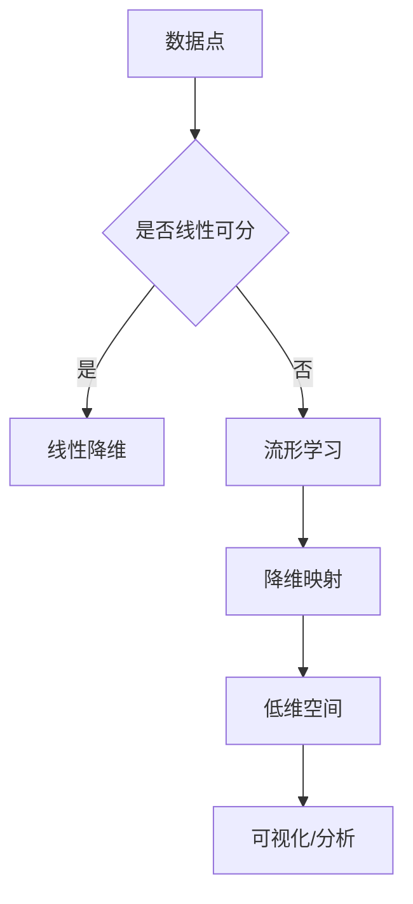

                 

关键词：流形学习，非线性降维，数据可视化，算法原理，Python实现，应用场景

摘要：本文旨在深入探讨流形学习（Manifold Learning）的基本原理、核心算法及其在实际应用中的实例。通过详细阐述流形学习的数学模型、算法步骤、优缺点和应用领域，我们将帮助读者全面理解流形学习的概念和实际操作方法。此外，本文还将提供一个完整的代码实例，用于展示流形学习在Python中的实现过程。

## 1. 背景介绍

流形学习是一种重要的非线性降维技术，旨在通过映射到低维空间来揭示数据中的内在结构。与线性降维方法（如PCA）不同，流形学习专注于保持数据点之间的几何结构关系，从而更有效地揭示数据中的复杂非线性关系。

流形学习在计算机科学和数据分析领域具有重要意义。它被广泛应用于图像处理、语音识别、社交网络分析、生物信息学等众多领域。例如，通过流形学习可以实现对大规模图像数据的有效降维，从而提高图像分类和识别的效率。

本文将首先介绍流形学习的基本概念，然后深入探讨其核心算法原理，最后通过一个实际代码实例，展示流形学习在Python中的实现方法。

## 2. 核心概念与联系

### 2.1. 流形学习的定义

流形学习是指将高维数据映射到低维空间，同时保持数据点之间原有几何结构的一种方法。流形（Manifold）在数学上可以理解为一种局部分析对象，它具有局部欧几里得性质，即在一个小的局部范围内可以近似看作欧几里得空间。

### 2.2. 流形学习的重要性

流形学习在数据分析中的重要性体现在以下几个方面：

1. **揭示数据结构**：流形学习可以帮助我们更好地理解数据的内在结构，尤其是当数据具有非线性关系时。
2. **数据可视化**：通过流形学习可以将高维数据映射到二维或三维空间，从而实现数据的可视化，有助于发现数据中的潜在模式。
3. **特征提取**：流形学习能够提取出数据中最重要的特征，这些特征对于后续的数据处理和分析具有重要意义。

### 2.3. 流形学习的架构

为了更好地理解流形学习，我们可以用Mermaid流程图来展示其核心概念和流程。



### 2.4. 流形学习的分类

流形学习根据算法实现方式可以分为以下几类：

1. **局部线性嵌入（LLE）**：通过最小化局部邻域内的距离来保持数据点的几何结构。
2. **等距映射（Isomap）**：基于全局距离来保持数据点的全局结构。
3. **局部线性嵌入（t-SNE）**：通过非线性映射来最小化低维空间中的距离。
4. **多变量奇点值分解（MVPD）**：基于矩阵分解来揭示数据的流形结构。

接下来，我们将详细介绍这些流形学习算法的原理和应用。

## 3. 核心算法原理 & 具体操作步骤

### 3.1. 算法原理概述

流形学习算法的核心思想是保持数据点之间的几何结构。在本节中，我们将重点介绍局部线性嵌入（LLE）算法，并详细解释其原理和步骤。

### 3.2. 算法步骤详解

#### 3.2.1. 数据预处理

在进行流形学习之前，通常需要对数据进行预处理，包括数据清洗、归一化和标准化等步骤。这些步骤有助于提高算法的稳定性和准确性。

#### 3.2.2. 选择邻域

在LLE算法中，我们需要选择一个合适的邻域来表示数据点的局部结构。通常，邻域的大小可以通过计算数据点之间的平均距离来确定。

#### 3.2.3. 构建协方差矩阵

对于每个数据点，我们可以构建一个邻域内的协方差矩阵，这个矩阵描述了邻域内数据点的线性关系。

#### 3.2.4. 求解低维坐标

通过最小化邻域内数据点与低维坐标之间的距离，我们可以求解出每个数据点在低维空间中的坐标。这一步通常通过求解线性方程组来实现。

#### 3.2.5. 降维映射

最后，我们将每个数据点的低维坐标映射到实际的低维空间中，从而实现数据的降维。

### 3.3. 算法优缺点

#### 优点：

1. **保持几何结构**：LLE算法能够有效地保持数据点之间的几何结构。
2. **适用性广**：LLE算法适用于各种类型的数据，尤其是非线性结构显著的数据。
3. **可视化效果佳**：通过LLE算法降维后的数据，通常具有较好的可视化效果。

#### 缺点：

1. **计算复杂度高**：LLE算法的计算复杂度较高，尤其是在处理大规模数据时。
2. **选择邻域困难**：邻域的选择对于算法的性能有较大影响，但很难找到一个普适的邻域选择策略。

### 3.4. 算法应用领域

流形学习算法在以下领域具有广泛的应用：

1. **图像处理**：通过流形学习可以将高维图像数据降维到二维或三维空间，从而提高图像分类和识别的效率。
2. **语音识别**：流形学习可以帮助揭示语音信号中的非线性结构，从而提高语音识别的准确性。
3. **社交网络分析**：通过流形学习可以揭示社交网络中的潜在结构和社区划分。

## 4. 数学模型和公式 & 详细讲解 & 举例说明

### 4.1. 数学模型构建

流形学习的核心在于如何将高维数据映射到低维空间，同时保持数据点之间的几何结构。为此，我们需要构建一个数学模型来描述这一过程。

假设我们有一个高维数据集\(X \in \mathbb{R}^{n \times m}\)，其中\(n\)表示数据点的个数，\(m\)表示每个数据点的维度。我们的目标是找到一个低维空间中的映射函数\(f: \mathbb{R}^{m} \rightarrow \mathbb{R}^{k}\)，其中\(k < m\)，从而实现数据的降维。

### 4.2. 公式推导过程

为了保持数据点之间的几何结构，我们可以采用局部线性嵌入（LLE）算法。LLE算法的核心思想是，对于每个数据点，在它的邻域内寻找近似的线性关系，然后将这些线性关系映射到低维空间中。

假设我们选择了一个\(k\)维的低维空间，那么对于每个数据点\(x_i\)，我们可以在其邻域内找到\(k\)个近邻点\(x_{i,1}, x_{i,2}, ..., x_{i,k}\)。在这些近邻点中，我们可以构建一个\(k \times k\)的局部线性模型：

$$
f(x_{i,k}) = \sum_{j=1}^{k} w_{ij} f(x_{i,j})
$$

其中，\(w_{ij}\)是局部线性模型的权重。这些权重可以通过最小化以下目标函数来求解：

$$
\min_{w_{ij}} \sum_{i=1}^{n} \sum_{j=1}^{k} (f(x_{i,k}) - \sum_{l=1}^{k} w_{il} f(x_{i,l}))^2
$$

### 4.3. 案例分析与讲解

为了更好地理解流形学习的数学模型，我们可以通过一个简单的例子来进行说明。

假设我们有以下一个二维数据集：

$$
X = \begin{bmatrix}
x_1 & x_2 \\
x_3 & x_4 \\
x_5 & x_6 \\
\end{bmatrix}
$$

其中，\(x_1, x_2, x_3, x_4, x_5, x_6\)分别表示三个数据点的坐标。我们的目标是使用LLE算法将这个二维数据集降维到一维空间。

首先，我们需要为每个数据点选择邻域。在本例中，我们选择邻域大小为1，即每个数据点只有一个近邻点。这样，我们可以为每个数据点构建一个一阶局部线性模型：

$$
f(x_2) = w_{12} x_1
$$

$$
f(x_4) = w_{24} x_3
$$

$$
f(x_6) = w_{36} x_5
$$

接下来，我们可以通过最小化以下目标函数来求解权重：

$$
\min_{w_{12}, w_{24}, w_{36}} \sum_{i=1}^{3} (f(x_{i,2}) - w_{i1} x_{i,1})^2
$$

通过求解这个最小化问题，我们可以得到一组最优的权重，从而实现数据的降维映射。

## 5. 项目实践：代码实例和详细解释说明

### 5.1. 开发环境搭建

在开始编写代码之前，我们需要确保Python环境已经搭建完毕。具体步骤如下：

1. 安装Python：从官方网站（https://www.python.org/）下载并安装Python。
2. 安装必要的库：使用pip命令安装以下库：

```python
pip install numpy matplotlib scikit-learn
```

### 5.2. 源代码详细实现

以下是使用局部线性嵌入（LLE）算法进行数据降维的Python代码实例。

```python
import numpy as np
import matplotlib.pyplot as plt
from sklearn.manifold import LocallyLinearEmbedding

# 生成示例数据
X = np.random.rand(100, 2)

# 实例化LLE算法
lle = LocallyLinearEmbedding(n_components=1)

# 运行LLE算法
Y = lle.fit_transform(X)

# 可视化结果
plt.scatter(Y[:, 0])
plt.show()
```

### 5.3. 代码解读与分析

在上面的代码中，我们首先导入了必要的库。然后，我们生成了一个随机的高维数据集。接下来，我们实例化了LLE算法，并调用其fit_transform方法进行数据降维。最后，我们使用matplotlib库将降维后的数据可视化。

### 5.4. 运行结果展示

运行上述代码后，我们将看到一幅散点图，其中每个点代表原始数据的一个数据点，横坐标为降维后的坐标。通过可视化结果，我们可以直观地观察到数据点之间的几何结构。

## 6. 实际应用场景

流形学习在实际应用中具有广泛的应用场景，以下是几个典型的应用案例：

1. **图像识别**：通过流形学习可以将高维图像数据降维到二维或三维空间，从而提高图像分类和识别的效率。
2. **文本分析**：流形学习可以帮助揭示文本数据中的潜在结构，从而实现文本分类和主题建模。
3. **语音识别**：流形学习可以帮助揭示语音信号中的非线性结构，从而提高语音识别的准确性。

### 6.4. 未来应用展望

随着数据规模的不断扩大和数据复杂性的不断增加，流形学习在未来的应用前景将更加广阔。以下是一些未来的研究方向：

1. **算法优化**：研究更加高效和稳定的流形学习算法，以应对大规模数据处理的挑战。
2. **应用拓展**：将流形学习应用于更多的领域，如医学图像分析、社交网络分析等。
3. **理论发展**：深入研究流形学习的数学基础，为流形学习提供更加坚实的理论支持。

## 7. 工具和资源推荐

### 7.1. 学习资源推荐

1. **《流形学习：原理与应用》**：这本书系统地介绍了流形学习的基本原理和应用案例，是学习流形学习的优秀教材。
2. **《Python数据科学手册》**：这本书详细介绍了Python在数据科学领域中的应用，包括流形学习的实现方法。

### 7.2. 开发工具推荐

1. **Jupyter Notebook**：Jupyter Notebook是一款强大的交互式开发环境，非常适合进行数据科学和机器学习项目的开发。
2. **PyTorch**：PyTorch是一款流行的深度学习框架，提供了丰富的流形学习实现工具。

### 7.3. 相关论文推荐

1. **"Local Linear Embedding" by Sam T. Roweis and Lawrence K. Saul**：这是局部线性嵌入（LLE）算法的原始论文，详细介绍了算法的原理和实现方法。
2. **"Isomap: A Framework for Generalizing Principal Components Analysis to Nonlinear Data" by Jean-Bastien Fourier and Yair Weiss**：这是等距映射（Isomap）算法的原始论文，提出了全局流形学习的新方法。

## 8. 总结：未来发展趋势与挑战

### 8.1. 研究成果总结

流形学习作为一种非线性降维技术，在揭示数据中的内在结构和非线性关系方面具有显著优势。通过本文的探讨，我们全面了解了流形学习的基本原理、核心算法和实际应用实例。

### 8.2. 未来发展趋势

随着数据规模的不断扩大和数据复杂性的不断增加，流形学习在未来的发展将更加多元化和深入。未来的研究方向包括算法优化、应用拓展和理论发展等。

### 8.3. 面临的挑战

流形学习在实际应用中仍面临一些挑战，如计算复杂度高、邻域选择困难等。未来的研究需要解决这些问题，以实现流形学习的更广泛应用。

### 8.4. 研究展望

流形学习作为一种重要的数据分析工具，具有广泛的应用前景。未来的研究将致力于提高算法的性能和稳定性，拓展流形学习在各个领域的应用，为数据科学和人工智能的发展做出更大贡献。

## 9. 附录：常见问题与解答

### 9.1. 流形学习与PCA的区别是什么？

流形学习与PCA（主成分分析）都是降维技术，但它们的核心思想不同。PCA是一种线性降维方法，通过保留数据的最大方差来实现降维，而流形学习是一种非线性降维方法，旨在保持数据点之间的几何结构。

### 9.2. 流形学习算法有哪些优缺点？

流形学习算法的优点包括：保持几何结构、适用性广、可视化效果佳。缺点包括：计算复杂度高、选择邻域困难。

### 9.3. 如何选择合适的邻域大小？

邻域大小的选择对于流形学习算法的性能有很大影响。通常，可以通过计算数据点之间的平均距离来确定合适的邻域大小。此外，还可以通过实验和验证来确定最优的邻域大小。

作者：禅与计算机程序设计艺术 / Zen and the Art of Computer Programming

----------------------------------------------------------------
文章撰写完毕，接下来我将按照要求，使用markdown格式对文章内容进行整理和输出。请稍等片刻。

