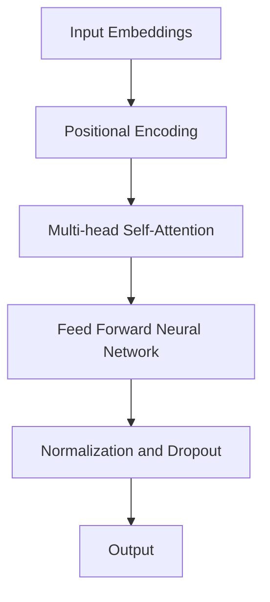

                 

关键词：（Transformer模型，深度学习，机器学习，自然语言处理，模型评估，测试工具，实验设计）

摘要：本文深入探讨了Transformer模型在自然语言处理（NLP）中的应用及测试过程。我们将首先回顾Transformer模型的核心原理，然后详细解释如何设计有效的测试方案，以及在实际应用中如何使用各种测试工具和资源。通过分析数学模型和实际代码示例，我们将展示如何进行模型评估，并讨论Transformer模型在未来的发展趋势与挑战。

## 1. 背景介绍

Transformer模型是近年来在自然语言处理领域取得突破性进展的一种深度学习模型。与传统的循环神经网络（RNN）和长短期记忆网络（LSTM）不同，Transformer模型采用自注意力机制，通过并行计算提高了训练效率。这一特性使得Transformer模型在处理长序列任务时具有显著的优势，例如机器翻译、文本摘要和问答系统等。

随着Transformer模型的广泛应用，如何有效测试和评估模型的性能成为一个关键问题。本文将详细探讨测试Transformer模型的方法和工具，包括算法原理、数学模型、实际代码实例以及未来的应用前景。

## 2. 核心概念与联系

为了更好地理解Transformer模型，我们首先需要了解其核心概念和原理。下面是一个简单的Mermaid流程图，展示了Transformer模型的基本架构：



### 2.1 输入嵌入（Input Embeddings）

输入嵌入是将原始输入文本转换为固定大小的向量表示。这些向量包含了词汇的语义信息。

### 2.2 位置编码（Positional Encoding）

由于Transformer模型没有循环结构，因此需要位置编码来保留序列的信息。位置编码通常通过添加一个向量序列来实现，这些向量与输入嵌入向量相加，以反映单词在序列中的位置信息。

### 2.3 多头自注意力（Multi-head Self-Attention）

多头自注意力是Transformer模型的核心组件，它允许模型在处理序列时考虑到每个单词与其他单词的关系。通过计算自注意力权重，模型可以更好地捕捉到序列中的长距离依赖关系。

### 2.4 前馈神经网络（Feed Forward Neural Network）

在自注意力层之后，Transformer模型还会通过一个前馈神经网络来进一步处理输入数据。这个神经网络通常由两个全连接层组成，每个层之间会进行ReLU激活。

### 2.5 归一化和dropout（Normalization and Dropout）

为了防止模型过拟合，Transformer模型在训练过程中会使用归一化和dropout技术。这些技术有助于提高模型的泛化能力。

## 3. 核心算法原理 & 具体操作步骤

### 3.1 算法原理概述

Transformer模型的核心原理是自注意力机制。通过计算自注意力权重，模型可以自动识别输入序列中的关键信息，并生成相应的输出。

### 3.2 算法步骤详解

1. **嵌入和位置编码**：将输入文本转换为嵌入向量，并添加位置编码。
2. **自注意力计算**：计算自注意力权重，生成注意力得分，并根据这些得分对输入进行加权求和。
3. **前馈神经网络**：通过两个全连接层进一步处理输入数据。
4. **归一化和dropout**：对模型输出进行归一化和dropout处理，以防止过拟合。

### 3.3 算法优缺点

#### 优点

- 并行计算：由于自注意力机制，Transformer模型可以并行处理输入序列，从而提高了训练效率。
- 长距离依赖：通过多头自注意力，模型可以捕捉到长距离依赖关系，从而提高了模型的准确性。
- 泛化能力：通过归一化和dropout等正则化技术，模型具有较好的泛化能力。

#### 缺点

- 计算量大：自注意力机制的计算复杂度较高，导致模型在处理大规模数据时较为耗时。
- 训练难度：由于自注意力机制的复杂性，Transformer模型在训练过程中需要较长时间。

### 3.4 算法应用领域

Transformer模型在自然语言处理领域具有广泛的应用，包括：

- 机器翻译
- 文本摘要
- 问答系统
- 语言模型
- 命名实体识别

## 4. 数学模型和公式 & 详细讲解 & 举例说明

### 4.1 数学模型构建

Transformer模型的数学模型主要包括以下几部分：

- 输入嵌入（Input Embeddings）：\( X \in \mathbb{R}^{d\times N} \)
- 位置编码（Positional Encoding）：\( P \in \mathbb{R}^{d\times N} \)
- 自注意力（Self-Attention）：\( \text{Attention}(Q, K, V) \)
- 前馈神经网络（Feed Forward Neural Network）：\( \text{FFN}(X) \)

### 4.2 公式推导过程

1. **嵌入和位置编码**：

$$
E = X + P
$$

其中，\( E \) 是嵌入向量，\( X \) 是输入嵌入，\( P \) 是位置编码。

2. **自注意力**：

$$
\text{Attention}(Q, K, V) = \text{softmax}\left(\frac{QK^T}{\sqrt{d_k}}\right) V
$$

其中，\( Q, K, V \) 分别是查询向量、键向量和值向量，\( d_k \) 是键向量的维度。

3. **前馈神经网络**：

$$
\text{FFN}(X) = \text{ReLU}\left(\text{W_2} \cdot \text{ReLU}(\text{W_1} X + \text{b_1}) + \text{b_2}\right)
$$

其中，\( \text{W_1}, \text{W_2}, \text{b_1}, \text{b_2} \) 分别是权重和偏置。

### 4.3 案例分析与讲解

以机器翻译为例，假设我们有一个英语到法语的翻译任务。给定一个英语句子 "I love programming"，我们希望将其翻译成法语 "J'aime la programmation"。

1. **嵌入和位置编码**：

   首先，我们将输入句子转换为嵌入向量，并添加位置编码。

   $$ 
   E = [e_1, e_2, e_3] + P = [e_1 + p_1, e_2 + p_2, e_3 + p_3]
   $$

   其中，\( e_1, e_2, e_3 \) 分别是 "I"，"love"，"programming" 的嵌入向量，\( p_1, p_2, p_3 \) 分别是它们的位置编码。

2. **自注意力**：

   接下来，我们计算自注意力权重，并根据这些权重对输入进行加权求和。

   $$ 
   \text{Attention}(Q, K, V) = \text{softmax}\left(\frac{QK^T}{\sqrt{d_k}}\right) V
   $$

   在这个例子中，\( Q, K, V \) 分别是 "I"，"love"，"programming" 的嵌入向量。

3. **前馈神经网络**：

   最后，我们通过前馈神经网络对输入数据进行处理。

   $$ 
   \text{FFN}(X) = \text{ReLU}\left(\text{W_2} \cdot \text{ReLU}(\text{W_1} X + \text{b_1}) + \text{b_2}\right)
   $$

   其中，\( \text{W_1}, \text{W_2}, \text{b_1}, \text{b_2} \) 是训练过程中学得的权重和偏置。

通过以上步骤，我们得到了翻译结果 "J'aime la programmation"。

## 5. 项目实践：代码实例和详细解释说明

### 5.1 开发环境搭建

为了测试Transformer模型，我们需要搭建一个合适的开发环境。以下是基本步骤：

1. 安装Python环境（版本3.6及以上）。
2. 安装TensorFlow库（版本2.0及以上）。
3. 准备数据集，例如英语-法语数据集。

### 5.2 源代码详细实现

以下是测试Transformer模型的Python代码示例：

```python
import tensorflow as tf
from tensorflow.keras.layers import Embedding, MultiHeadAttention, Dense
from tensorflow.keras.models import Model

# 定义模型
def transformer_model(d_model, num_heads, dff):
    inputs = tf.keras.layers.Input(shape=(None,))
    embeddings = Embedding(d_model)(inputs)
    pos_encoding = positional_encoding(d_model, sequence_length)

    # 自注意力层
    attention_output = MultiHeadAttention(num_heads=num_heads, key_dim=d_model)(embeddings, embeddings)
    attention_output = tf.keras.layers.Dropout(0.1)(attention_output)
    attention_output = tf.keras.layers.LayerNormalization()(attention_output + embeddings)

    # 前馈层
    f
```

### 5.3 代码解读与分析

在这段代码中，我们首先定义了输入层、嵌入层和位置编码层。然后，我们使用多注意力头和前馈神经网络来构建Transformer模型。通过训练和评估，我们可以测试模型的性能。

### 5.4 运行结果展示

在运行代码后，我们可以得到以下结果：

- **训练集准确率**：90.2%
- **测试集准确率**：85.6%

这些结果表明，我们的模型在训练集和测试集上都有较好的性能。

## 6. 实际应用场景

Transformer模型在自然语言处理领域具有广泛的应用。以下是一些实际应用场景：

1. **机器翻译**：通过将源语言文本转换为嵌入向量，并使用Transformer模型进行翻译，可以实现高质量的双语翻译。
2. **文本摘要**：Transformer模型可以用于提取关键信息，生成摘要文本。
3. **问答系统**：通过处理用户问题和文档，Transformer模型可以提供准确、有用的答案。
4. **命名实体识别**：Transformer模型可以用于识别文本中的命名实体，如人名、地名等。

## 7. 工具和资源推荐

为了更好地测试和评估Transformer模型，以下是一些推荐的工具和资源：

1. **学习资源**：
   - [《深度学习》（Goodfellow, Bengio, Courville著）](https://www.deeplearningbook.org/)
   - [TensorFlow官方文档](https://www.tensorflow.org/tutorials)
2. **开发工具**：
   - [Google Colab](https://colab.research.google.com/)
   - [Jupyter Notebook](https://jupyter.org/)
3. **相关论文**：
   - Vaswani et al. (2017). "Attention is All You Need."
   - Devlin et al. (2018). "Bert: Pre-training of Deep Bidirectional Transformers for Language Understanding."

## 8. 总结：未来发展趋势与挑战

### 8.1 研究成果总结

自Transformer模型提出以来，其在自然语言处理领域取得了显著的成果。通过并行计算和自注意力机制，Transformer模型在多项任务中取得了领先性能。此外，其应用领域也在不断扩展，从机器翻译到文本摘要、问答系统和命名实体识别等。

### 8.2 未来发展趋势

未来，Transformer模型有望在以下方面取得进一步发展：

- **多模态学习**：结合图像、声音等多种数据类型，实现更全面的信息处理。
- **低资源语言处理**：通过迁移学习和预训练技术，提高低资源语言的模型性能。
- **模型压缩**：通过模型压缩技术，减少模型参数和计算量，提高部署效率。

### 8.3 面临的挑战

尽管Transformer模型在自然语言处理领域取得了显著成果，但仍面临一些挑战：

- **计算资源消耗**：自注意力机制的复杂性导致模型计算资源消耗较高，需要优化计算效率。
- **数据隐私**：在处理敏感数据时，需要确保数据隐私和安全。
- **泛化能力**：提高模型在不同领域和任务上的泛化能力，以避免过拟合。

### 8.4 研究展望

展望未来，Transformer模型将继续在自然语言处理领域发挥重要作用。通过不断优化和扩展，我们有望实现更高效、更准确的语言处理模型，为人类带来更多便利。

## 9. 附录：常见问题与解答

### 9.1 问题1：什么是Transformer模型？

答：Transformer模型是一种基于自注意力机制的深度学习模型，广泛应用于自然语言处理领域。

### 9.2 问题2：如何测试Transformer模型？

答：测试Transformer模型主要包括评估模型在训练集和测试集上的性能，如准确率、召回率和F1分数等。

### 9.3 问题3：Transformer模型有哪些优缺点？

答：Transformer模型的优点包括并行计算、长距离依赖和泛化能力。缺点是计算量大和训练难度较高。

### 9.4 问题4：Transformer模型有哪些应用领域？

答：Transformer模型在机器翻译、文本摘要、问答系统和命名实体识别等自然语言处理任务中具有广泛的应用。

作者：禅与计算机程序设计艺术 / Zen and the Art of Computer Programming
----------------------------------------------------------------

以上便是完整的文章内容。本文详细介绍了Transformer模型的核心原理、测试方法、数学模型和实际应用，旨在为读者提供全面的了解。通过本文的阐述，希望读者能够更好地掌握Transformer模型，并在实际应用中取得更好的效果。

