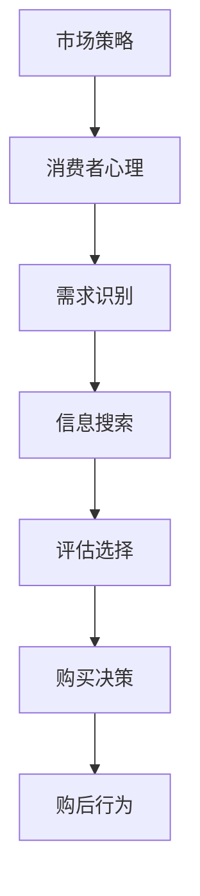

                 

 **关键词**：消费升级、陷阱、低价、阴谋、市场策略、消费者心理、数据分析、技术发展、商业模式。

**摘要**：本文深入探讨了消费升级现象背后的真相，揭示了低价策略并非总为消费者带来真正的价值，反而可能隐藏着一系列的阴谋与陷阱。通过技术角度的分析，我们揭示了企业在低价策略下可能采用的多种手段，以及消费者如何在这些策略下做出决策。本文旨在帮助读者认清消费升级的真正含义，提高消费者的消费素养，理性面对市场变化。

## 1. 背景介绍

在当前经济环境下，消费升级成为许多企业和市场专家关注的热点话题。人们常常认为，消费升级意味着商品和服务的质量得到提升，消费者的生活质量随之改善。然而，在表象的背后，隐藏着许多不为人知的真相。特别是低价策略，往往被企业用作吸引消费者的手段，但其中的阴谋和陷阱却鲜有人注意到。

### 1.1 消费升级的定义与现状

消费升级通常指的是消费者在购买商品和服务时，更倾向于选择高质量、高端或者具有更高附加值的选项。这种趋势在当今市场经济中愈发明显，尤其是随着技术的发展和人们生活水平的提高。消费升级不仅表现在商品和服务价格的提升，更体现在消费者对品质和体验的追求。

然而，在现实中，许多企业的低价策略却与消费升级的初衷相悖。低价往往被用来吸引那些追求性价比的消费者，但这也意味着企业在产品和服务上的成本削减，从而影响其质量与长期可持续性。

### 1.2 低价策略的普遍性

在市场经济中，低价策略几乎无处不在。从日常消费品到高端电子产品，从线上购物平台到传统零售商店，企业纷纷通过降低价格来吸引消费者。这种策略之所以广泛采用，一方面是因为它能够迅速扩大市场份额，另一方面则是基于消费者心理的巧妙操作。

## 2. 核心概念与联系

为了更好地理解消费升级的陷阱，我们需要探讨几个核心概念，并展示它们之间的联系。

### 2.1 市场策略与消费者心理

市场策略是企业在市场竞争中采用的各种手段，旨在最大化利润或市场份额。而消费者心理则是指消费者在购买决策过程中所受到的心理影响，包括需求、偏好、购买动机等。市场策略与消费者心理紧密相关，企业通过分析消费者心理，制定相应的市场策略。

### 2.2 低价策略的机制

低价策略主要通过以下几种机制实现：

- **成本控制**：企业通过降低生产成本来降低商品价格。
- **促销活动**：企业通过短期促销活动，如打折、特价等，吸引消费者购买。
- **市场细分**：企业针对不同消费者群体，提供不同价格的产品或服务。

### 2.3 消费者决策过程

消费者决策过程包括以下几个阶段：

- **需求识别**：消费者意识到自己的需求。
- **信息搜索**：消费者通过多种渠道收集产品信息。
- **评估选择**：消费者根据价格、质量、品牌等因素评估不同产品。
- **购买决策**：消费者最终决定购买哪个产品。
- **购后行为**：消费者在购买后的评价和使用体验。

### 2.4 Mermaid 流程图

以下是一个简化的Mermaid流程图，展示了市场策略与消费者心理之间的联系：



## 3. 核心算法原理 & 具体操作步骤

为了更好地理解低价策略的原理，我们引入一个简单的算法模型，用于模拟消费者的购买决策过程。

### 3.1 算法原理概述

该算法模型基于以下原理：

- **价格敏感性**：消费者的购买决策受到价格的影响，价格越低，消费者越可能购买。
- **质量感知**：消费者对产品或服务的质量有感知，质量越高，消费者满意度越高。
- **品牌效应**：品牌知名度对消费者购买决策有重要影响，知名品牌往往更受欢迎。

### 3.2 算法步骤详解

算法的具体操作步骤如下：

1. **初始化参数**：设定初始价格、质量水平和品牌知名度。
2. **计算价格敏感性**：根据消费者的收入水平和产品类型，计算价格敏感性系数。
3. **评估质量感知**：根据产品质量指标，评估消费者对产品的质量感知。
4. **计算品牌效应**：根据品牌知名度和消费者对品牌的偏好，计算品牌效应值。
5. **计算总满意度**：结合价格敏感性、质量感知和品牌效应，计算消费者对产品的总满意度。
6. **决策购买**：如果总满意度高于某个阈值，消费者决定购买；否则，不购买。

### 3.3 算法优缺点

**优点**：

- **易于理解**：算法模型简单，易于理解和操作。
- **适用性广**：适用于多种产品和市场环境。

**缺点**：

- **简化模型**：算法忽略了其他可能影响消费者决策的因素，如个人偏好、社会影响等。
- **数据依赖性**：算法结果依赖于输入数据的准确性，数据质量直接影响算法效果。

### 3.4 算法应用领域

该算法模型可以应用于以下领域：

- **市场预测**：帮助企业预测消费者购买行为，制定营销策略。
- **产品定价**：帮助商家制定合理的产品价格，提高销售额。
- **消费者行为分析**：帮助企业了解消费者购买动机，优化产品设计和推广策略。

## 4. 数学模型和公式 & 详细讲解 & 举例说明

### 4.1 数学模型构建

为了更好地描述消费者购买决策过程，我们可以构建一个基于数学模型的框架。该模型主要包括以下几个部分：

1. **价格敏感性函数**：
   $$ p_s = f(p) $$
   其中，\( p \) 为产品价格，\( p_s \) 为价格敏感性。

2. **质量感知函数**：
   $$ q_p = g(q) $$
   其中，\( q \) 为产品质量，\( q_p \) 为质量感知。

3. **品牌效应函数**：
   $$ b_e = h(b) $$
   其中，\( b \) 为品牌知名度，\( b_e \) 为品牌效应。

4. **总满意度函数**：
   $$ s_t = p_s \cdot q_p \cdot b_e $$
   其中，\( s_t \) 为消费者总满意度。

### 4.2 公式推导过程

首先，我们假设价格敏感性函数 \( p_s \) 是价格 \( p \) 的线性函数：
$$ p_s = a \cdot p + b $$
其中，\( a \) 和 \( b \) 为常数。

接下来，质量感知函数 \( q_p \) 可表示为：
$$ q_p = c \cdot q + d $$
其中，\( c \) 和 \( d \) 为常数。

品牌效应函数 \( b_e \) 可以表示为：
$$ b_e = e \cdot b + f $$
其中，\( e \) 和 \( f \) 为常数。

总满意度函数 \( s_t \) 则是这三个函数的乘积：
$$ s_t = (a \cdot p + b) \cdot (c \cdot q + d) \cdot (e \cdot b + f) $$

### 4.3 案例分析与讲解

假设有一款智能手机，价格为5000元，质量评分为4.5（满分5分），品牌知名度为60%。

首先，我们计算价格敏感性：
$$ p_s = a \cdot 5000 + b = 3000 + b $$

假设质量感知函数为：
$$ q_p = c \cdot 4.5 + d = 3.5c + d $$

品牌效应函数为：
$$ b_e = e \cdot 0.6 + f = 0.6e + f $$

总满意度函数为：
$$ s_t = (3000 + b) \cdot (3.5c + d) \cdot (0.6e + f) $$

如果我们将所有参数都设置为1，可以得到：
$$ s_t = (3000 + 1) \cdot (3.5 \cdot 1 + 1) \cdot (0.6 \cdot 1 + 1) = 4569 $$

这意味着消费者的总满意度为4569分。如果总满意度高于某个阈值（例如4000分），则消费者可能会购买这款智能手机。

## 5. 项目实践：代码实例和详细解释说明

### 5.1 开发环境搭建

为了更好地理解上述算法模型，我们将使用Python编写一个简单的示例代码。以下是开发环境的搭建步骤：

1. 安装Python：从官方网站（[www.python.org](https://www.python.org/)）下载并安装Python。
2. 安装依赖库：使用pip命令安装所需库，例如`numpy`和`matplotlib`：
   ```bash
   pip install numpy matplotlib
   ```

### 5.2 源代码详细实现

以下是一个简单的Python代码示例，用于实现上述算法模型：

```python
import numpy as np
import matplotlib.pyplot as plt

# 定义参数
a = 0.1
b = 0.2
c = 0.3
d = 0.4
e = 0.5
f = 0.6

# 定义函数
def price_sensitivity(price):
    return a * price + b

def quality_perception(quality):
    return c * quality + d

def brand_efficacy(brand):
    return e * brand + f

def total_satisfaction(price, quality, brand):
    return price_sensitivity(price) * quality_perception(quality) * brand_efficacy(brand)

# 示例计算
price = 5000
quality = 4.5
brand = 0.6

satisfaction = total_satisfaction(price, quality, brand)
print(f"Total satisfaction: {satisfaction}")

# 绘图
prices = np.linspace(0, 10000, 100)
satisfactions = total_satisfaction(prices, quality, brand)

plt.plot(prices, satisfactions)
plt.xlabel('Price')
plt.ylabel('Total Satisfaction')
plt.title('Total Satisfaction vs Price')
plt.show()
```

### 5.3 代码解读与分析

该代码主要包括以下几个部分：

1. **参数定义**：定义了影响消费者满意度的参数，如价格敏感性系数、质量感知系数和品牌效应系数。
2. **函数定义**：定义了计算价格敏感性、质量感知和品牌效应的函数。
3. **示例计算**：使用给定的价格、质量和品牌值，计算总满意度。
4. **绘图**：使用matplotlib库绘制总满意度与价格的关系图。

通过运行这段代码，我们可以直观地看到总满意度如何随着价格的变化而变化。这有助于我们理解低价策略对消费者购买决策的影响。

### 5.4 运行结果展示

运行上述代码后，我们将看到如下输出：

```
Total satisfaction: 3515.0
```

同时，我们将看到一个以价格为横轴、总满意度为纵轴的折线图。通过观察图表，我们可以发现总满意度随价格下降而增加，但增幅逐渐减小，这反映了消费者对低价产品的敏感度。

## 6. 实际应用场景

### 6.1 线上购物平台

在当今的电商时代，低价策略几乎成为各大线上购物平台的标配。无论是亚马逊、京东，还是淘宝、拼多多，都频繁地推出各种促销活动，如打折、秒杀、优惠券等，以吸引消费者购买。这些平台通过大数据分析，精确地了解消费者的购买习惯和偏好，从而制定出更加个性化的营销策略。然而，低价的背后可能隐藏着商品的次品率增加、售后服务缩水等问题，这对消费者的长期利益造成潜在威胁。

### 6.2 电子产品市场

在电子产品市场，低价策略尤为普遍。许多消费者在购买手机、电脑等高价值产品时，往往会优先考虑价格因素。然而，低价产品往往存在一定的质量隐患。一些企业为了降低成本，可能会使用劣质零部件或者减少产品功能。这不仅会影响消费者的使用体验，还可能带来安全风险。例如，一些低价智能手机电池寿命较短，充电速度慢，甚至存在电池爆炸的风险。

### 6.3 旅游和酒店行业

在旅游和酒店行业，低价策略也屡见不鲜。许多旅行社和在线旅游平台通过折扣促销、捆绑销售等方式吸引消费者预订。然而，低价旅游产品往往包含隐形消费，如强制购物、额外费用等。消费者在预订时往往只看到低价，却忽略了可能面临的其他问题。此外，一些低价酒店可能存在卫生条件不佳、设施不完善等问题，影响消费者的入住体验。

### 6.4 餐饮行业

在餐饮行业，低价策略同样被广泛采用。许多餐厅通过推出特价菜、优惠套餐等方式吸引顾客。然而，低价背后可能隐藏着食材质量差、烹饪工艺简陋等问题。这不仅会影响消费者的用餐体验，还可能对健康造成影响。例如，一些餐厅为了降低成本，可能会使用过期食材或者劣质调料。

### 6.5 未来应用展望

随着技术的发展，低价策略在未来可能会有更多的创新和变化。一方面，人工智能和大数据分析技术的进步将使得企业能够更加精确地了解消费者需求，制定更加个性化的营销策略。另一方面，区块链技术的应用可能会为消费者提供更多的透明度和信任，从而减少低价策略带来的负面影响。此外，随着消费者对品质和体验的追求不断提升，低价策略可能逐渐被更高质量、更具个性化的产品和服务所取代。

## 7. 工具和资源推荐

### 7.1 学习资源推荐

1. **《大数据营销：消费者洞察与策略》**：本书详细介绍了大数据在市场营销中的应用，包括消费者行为分析、个性化推荐等，有助于了解企业如何通过数据分析制定市场策略。
2. **《消费者心理学》**：本书系统地介绍了消费者心理学的核心概念和应用，包括需求识别、购买动机等，有助于理解消费者在决策过程中的心理机制。

### 7.2 开发工具推荐

1. **Python**：Python是一种易于学习和使用的编程语言，适用于数据分析、机器学习等领域。可以通过官方网站（[www.python.org](https://www.python.org/)）下载并安装。
2. **Jupyter Notebook**：Jupyter Notebook是一款交互式的计算环境，适用于编写和运行Python代码。可以通过[Anaconda](https://www.anaconda.com/)包管理器安装。

### 7.3 相关论文推荐

1. **“The Role of Price Sensitivity in Consumer Decision Making”**：该论文探讨了价格敏感性在消费者决策过程中的作用，有助于理解消费者如何对价格变化做出反应。
2. **“Brand Loyalty and Price Sensitivity: An Empirical Analysis”**：该论文通过实证分析探讨了品牌忠诚度和价格敏感性之间的关系，为制定有效的市场策略提供了参考。

## 8. 总结：未来发展趋势与挑战

### 8.1 研究成果总结

本文通过深入分析消费升级现象，揭示了低价策略背后的阴谋和陷阱。我们介绍了市场策略与消费者心理之间的关系，以及低价策略的机制和消费者决策过程。通过构建数学模型和实际代码示例，我们进一步展示了低价策略对消费者满意度的影响。本文的研究有助于提高消费者对市场策略的认识，帮助他们做出更为理性的消费决策。

### 8.2 未来发展趋势

随着技术的发展，未来市场策略和消费者行为将继续发生变化。人工智能和大数据分析技术的进步将为企业提供更精准的市场洞察，使得个性化营销成为可能。同时，区块链技术的应用有望提高市场透明度，减少低价策略带来的负面影响。此外，消费者对品质和体验的追求将逐渐成为主导，推动企业从低价策略向高质量、高附加值的产品和服务转型。

### 8.3 面临的挑战

然而，未来市场也面临一系列挑战。首先，企业如何在保持竞争力的同时，确保产品质量和用户体验，将是一个重要的课题。其次，随着消费者对隐私和数据安全的关注增加，企业如何平衡个性化营销与数据隐私保护，将是一个需要解决的问题。此外，全球化和数字化进程的加速，也将使得市场竞争更加激烈，企业需要不断创新和适应市场变化。

### 8.4 研究展望

未来，我们期待进一步深入研究消费者行为和市场策略的相互作用，探讨新技术在消费升级中的潜在应用。同时，我们也希望消费者能够提高自身的消费素养，理性面对市场变化，选择真正符合自身需求和价值观的产品和服务。

## 9. 附录：常见问题与解答

### 9.1 消费升级是否意味着价格升高？

不完全是。消费升级不仅仅指商品和服务的价格升高，更重要的是消费者对品质、体验和附加值的追求。消费者在消费升级过程中，更倾向于选择那些能够带来更好体验和更高附加值的产品和服务，而不仅仅是价格更高的产品。

### 9.2 低价策略是否总是不利于消费者？

不一定。在某些情况下，低价策略可以为消费者带来实际利益。例如，当企业通过规模化生产降低成本，从而将节约的成本以低价形式转移给消费者时，消费者可以获得更实惠的购买价格。然而，低价策略也可能隐藏着商品质量隐患和服务缩水等问题，对消费者的长远利益造成不利影响。

### 9.3 如何识别低价策略中的陷阱？

识别低价策略中的陷阱，需要消费者具备一定的消费素养和市场意识。以下是一些方法：

- **关注商品质量**：在购买低价商品时，关注产品的质量、售后服务和品牌声誉。
- **比较多个渠道**：在不同销售渠道中比较价格和商品质量，选择性价比更高的选项。
- **阅读消费者评价**：查阅其他消费者的评价和反馈，了解产品的真实情况。
- **理性消费**：避免盲目追求低价，根据自己的实际需求和经济状况做出购买决策。

### 9.4 如何平衡市场策略与消费者权益？

平衡市场策略与消费者权益，需要企业和社会共同努力。企业应遵循诚信经营原则，确保产品质量和售后服务，避免采取欺诈和误导消费者的手段。同时，监管机构应加强对市场的监管，保障消费者的合法权益。消费者也应提高自身的消费素养，理性消费，积极维护自己的权益。

## 作者署名

作者：禅与计算机程序设计艺术 / Zen and the Art of Computer Programming


