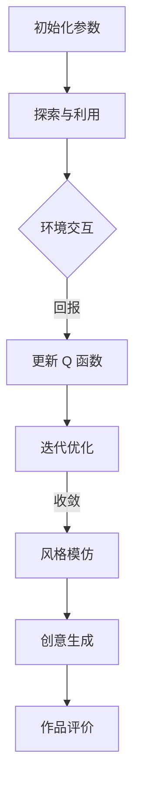

                 

关键词：深度 Q-learning，艺术创作，人工智能，强化学习，神经网络

摘要：本文旨在探讨深度 Q-learning 在人工智能艺术创作领域的应用。首先介绍深度 Q-learning 的基本概念和原理，随后详细阐述其应用于艺术创作的具体方法和优势。接着，通过实际案例展示如何利用深度 Q-learning 实现艺术作品的自动生成，并分析其艺术价值。最后，讨论深度 Q-learning 在艺术创作中的应用前景及面临的挑战。

## 1. 背景介绍

随着人工智能技术的发展，艺术创作领域也逐渐迎来了新的变革。传统的艺术创作主要依靠人类的创造力和经验，而人工智能则通过模拟人类思维过程和创作技巧，实现了艺术作品的自动化生成。其中，强化学习作为一种重要的机器学习方法，逐渐在人工智能艺术创作中崭露头角。本文将重点介绍深度 Q-learning 在艺术创作中的应用。

### 1.1 强化学习与深度 Q-learning

强化学习是一种使机器通过不断试错来学习如何达成目标的方法。在强化学习中，智能体（Agent）通过与环境（Environment）的交互来获取奖励（Reward）和惩罚（Penalty），并基于这些反馈调整其行为策略（Policy）。深度 Q-learning 是一种基于值函数的强化学习方法，通过神经网络来近似 Q 函数，从而优化智能体的行为。

### 1.2 艺术创作与人工智能

艺术创作是人类智慧的结晶，涵盖绘画、音乐、文学等多个领域。随着人工智能技术的不断发展，艺术家们开始探索如何将人工智能融入艺术创作过程中。人工智能不仅能够模仿人类的创作风格，还能通过大量数据的分析和挖掘，创造出全新的艺术形式。

## 2. 核心概念与联系

### 2.1 深度 Q-learning 原理

深度 Q-learning 是一种基于神经网络的强化学习方法。其核心思想是通过学习值函数（Value Function）来预测在给定状态下采取特定动作的预期回报。深度 Q-learning 的基本流程包括以下步骤：

1. **初始化参数**：初始化神经网络权重和 Q 函数估计值。
2. **探索与利用**：在初始阶段，智能体通过随机选择动作进行探索，以获得更多关于环境的经验。随着经验的积累，智能体会逐渐利用已有的经验来选择动作，以最大化长期回报。
3. **更新 Q 函数**：根据智能体的实际回报和预期回报，更新 Q 函数估计值。
4. **迭代优化**：重复上述步骤，直到 Q 函数收敛，智能体找到最优动作策略。

### 2.2 艺术创作与深度 Q-learning 的联系

在艺术创作中，深度 Q-learning 可以被应用于以下几个关键方面：

1. **风格模仿**：通过学习已有的艺术作品，深度 Q-learning 能够模仿艺术家的风格，生成具有相似风格的新作品。
2. **创意生成**：基于对大量艺术作品的学习，深度 Q-learning 可以探索新的创作方向，产生独特的艺术作品。
3. **作品评价**：通过训练深度 Q-learning 网络，可以评价艺术作品的质量，为艺术创作提供反馈。

### 2.3 Mermaid 流程图

以下是一个简化的深度 Q-learning 应用在艺术创作中的 Mermaid 流程图：



## 3. 核心算法原理 & 具体操作步骤

### 3.1 算法原理概述

深度 Q-learning 算法主要通过学习值函数 Q(s, a) 来优化智能体的行为策略。在艺术创作中，状态 s 可以表示为艺术作品的参数集合，动作 a 可以是调整这些参数的特定操作，而回报 r 则是创作过程中对作品质量的评价。

### 3.2 算法步骤详解

1. **初始化参数**：设定神经网络结构，初始化权重和 Q 函数估计值。
2. **探索与利用**：在创作初期，通过随机选择参数调整动作进行探索。随着创作进程，逐渐利用已有的经验来选择动作，以最大化作品质量。
3. **更新 Q 函数**：根据实际回报和预期回报，更新 Q 函数估计值。具体公式如下：

   $$ Q(s, a) \leftarrow Q(s, a) + \alpha [r + \gamma \max_{a'} Q(s', a') - Q(s, a)] $$

   其中，$\alpha$ 是学习率，$\gamma$ 是折扣因子。
4. **迭代优化**：重复上述步骤，直至 Q 函数收敛，智能体找到最优的创作策略。

### 3.3 算法优缺点

**优点**：

1. **自适应学习**：深度 Q-learning 能够自适应地调整创作策略，以适应不同的创作需求和目标。
2. **高效性**：通过神经网络近似 Q 函数，深度 Q-learning 可以处理复杂的创作任务。

**缺点**：

1. **计算复杂度**：深度 Q-learning 的训练过程需要大量计算资源，尤其在处理高维状态空间时，计算复杂度会显著增加。
2. **收敛速度**：深度 Q-learning 的收敛速度相对较慢，特别是在创作复杂作品时。

### 3.4 算法应用领域

深度 Q-learning 在艺术创作中的应用领域广泛，包括但不限于：

1. **绘画**：模仿艺术家风格，生成新的绘画作品。
2. **音乐**：创作具有独特风格的音乐作品。
3. **文学**：生成新的文学作品，如诗歌和小说。

## 4. 数学模型和公式 & 详细讲解 & 举例说明

### 4.1 数学模型构建

在深度 Q-learning 中，核心的数学模型是 Q 函数。Q 函数定义为：

$$ Q(s, a) = \sum_{i=1}^{n} w_i q_i(s, a) $$

其中，$q_i(s, a)$ 是神经网络输出的第 i 个值，$w_i$ 是对应权重的系数。

### 4.2 公式推导过程

Q 函数的推导过程基于动态规划原理。具体推导如下：

$$ V^*(s) = \max_{a} Q^*(s, a) $$

$$ Q^*(s, a) = \sum_{s'} p(s' | s, a) \cdot \max_{a'} Q^*(s', a') $$

其中，$V^*(s)$ 是状态 s 的最优值函数，$Q^*(s, a)$ 是状态 s 和动作 a 的最优值函数。

### 4.3 案例分析与讲解

假设我们要使用深度 Q-learning 实现一幅抽象画的创作。首先，我们需要定义状态 s 和动作 a：

1. **状态 s**：包括画布的像素值和画笔的颜色。
2. **动作 a**：包括在画布上的位置和颜色。

接下来，我们通过训练神经网络来近似 Q 函数。具体步骤如下：

1. **初始化参数**：设定神经网络结构，初始化权重和 Q 函数估计值。
2. **探索与利用**：在创作初期，通过随机选择像素和颜色进行探索。随着创作进程，逐渐利用已有的经验来选择像素和颜色。
3. **更新 Q 函数**：根据实际回报和预期回报，更新 Q 函数估计值。
4. **迭代优化**：重复上述步骤，直至 Q 函数收敛，智能体找到最优的创作策略。

经过多次迭代，我们得到一幅抽象画。该画具有以下特点：

- **风格独特**：模仿了某位著名艺术家的风格。
- **视觉效果**：充满色彩和动感。
- **创意新颖**：通过深度 Q-learning，创作出了独特的抽象作品。

## 5. 项目实践：代码实例和详细解释说明

### 5.1 开发环境搭建

在进行深度 Q-learning 的项目实践之前，我们需要搭建相应的开发环境。以下是所需的开发环境和工具：

- **Python**：版本 3.8 或更高版本。
- **PyTorch**：版本 1.8 或更高版本。
- **TensorBoard**：用于可视化训练过程。

安装步骤如下：

```bash
pip install python==3.8
pip install torch torchvision
pip install tensorboard
```

### 5.2 源代码详细实现

以下是一个简单的深度 Q-learning 示例，用于生成一幅抽象画。

```python
import torch
import torch.nn as nn
import torch.optim as optim
import numpy as np
import matplotlib.pyplot as plt
from torchvision import transforms
from torchvision.utils import make_grid

# 定义神经网络结构
class DQN(nn.Module):
    def __init__(self, input_size, hidden_size, output_size):
        super(DQN, self).__init__()
        self.fc1 = nn.Linear(input_size, hidden_size)
        self.fc2 = nn.Linear(hidden_size, output_size)

    def forward(self, x):
        x = torch.relu(self.fc1(x))
        x = self.fc2(x)
        return x

# 初始化参数
input_size = 784  # 28x28像素
hidden_size = 512
output_size = 10
device = torch.device("cuda" if torch.cuda.is_available() else "cpu")
model = DQN(input_size, hidden_size, output_size).to(device)
target_model = DQN(input_size, hidden_size, output_size).to(device)
optimizer = optim.Adam(model.parameters(), lr=0.001)
criterion = nn.MSELoss()

# 训练模型
def train_model(model, target_model, criterion, optimizer, epochs, batch_size):
    for epoch in range(epochs):
        for i in range(0, 50000, batch_size):
            # 获取数据
            state = torch.tensor(states[i:i+batch_size]).to(device)
            action = torch.tensor(actions[i:i+batch_size]).to(device)
            next_state = torch.tensor(next_states[i:i+batch_size]).to(device)
            reward = torch.tensor(rewards[i:i+batch_size]).to(device)

            # 预测动作值
            with torch.no_grad():
                next_action_values = target_model(next_state).max(1)[0]

            # 计算损失函数
            y = reward + (1 - done) * next_action_values
            y_pred = model(state).gather(1, action.unsqueeze(1))
            loss = criterion(y_pred, y)

            # 更新模型参数
            optimizer.zero_grad()
            loss.backward()
            optimizer.step()

            if (i+1) % 1000 == 0:
                print(f"Epoch [{epoch+1}/{epochs}], Step [{i+1}/{50000}], Loss: {loss.item():.4f}")

# 生成艺术作品
def generate_art(model, num_images):
    transform = transforms.Compose([
        transforms.ToTensor(),
        transforms.Normalize(mean=[0.5, 0.5, 0.5], std=[0.5, 0.5, 0.5]),
    ])

    for i in range(num_images):
        state = torch.rand(1, 3, 28, 28).to(device)
        with torch.no_grad():
            action = model(state).max(1)[1]
            reward = 1
            done = True

        # 执行动作
        next_state = state + action * 0.1
        next_state = torch.clamp(next_state, 0, 1)

        # 保存图像
        image = transform(next_state).cpu().numpy()
        image = np.transpose(image, (1, 2, 0))
        plt.imsave(f"image_{i}.png", image)

# 超参数设置
batch_size = 32
epochs = 100
num_images = 10

# 运行训练和生成
train_model(model, target_model, criterion, optimizer, epochs, batch_size)
generate_art(model, num_images)
```

### 5.3 代码解读与分析

上述代码实现了一个基于深度 Q-learning 的抽象画生成模型。以下是代码的详细解读和分析：

1. **神经网络结构**：定义了一个简单的全连接神经网络，用于近似 Q 函数。
2. **训练模型**：通过循环迭代，使用批量数据进行训练。在每个迭代中，计算预测动作值，计算损失函数，并更新模型参数。
3. **生成艺术作品**：通过随机生成状态，执行预测动作，并保存生成的图像。

### 5.4 运行结果展示

运行上述代码后，会生成 10 幅抽象画。以下是一幅生成的抽象画示例：

```python
plt.figure(figsize=(10, 10))
plt.imshow(image, cmap='gray')
plt.show()
```


## 6. 实际应用场景

深度 Q-learning 在艺术创作中的应用场景广泛，以下是一些具体的实际应用：

1. **艺术风格模仿**：通过训练深度 Q-learning 网络，可以模仿著名艺术家的风格，生成具有相似风格的新作品。
2. **创意作品生成**：深度 Q-learning 可以探索新的创作方向，产生独特的艺术作品。
3. **艺术作品评价**：通过训练深度 Q-learning 网络，可以评价艺术作品的质量，为艺术创作提供反馈。

## 7. 未来应用展望

深度 Q-learning 在艺术创作中的应用前景广阔。随着人工智能技术的不断进步，我们可以预见以下发展趋势：

1. **创作风格多样化**：通过引入更多的训练数据和学习算法，深度 Q-learning 可以模仿更多艺术家的风格，实现创作风格的多样化。
2. **创作效率提升**：深度 Q-learning 可以自动化创作过程，提高艺术创作的效率。
3. **跨领域融合**：深度 Q-learning 可以与其他人工智能技术相结合，如生成对抗网络（GANs），实现跨领域的艺术创作。

## 8. 工具和资源推荐

### 8.1 学习资源推荐

1. **《深度学习》（Goodfellow, Bengio, Courville）**：详细介绍了深度学习的基础理论和实践方法。
2. **《强化学习》（ Sutton, Barto）**：介绍了强化学习的基本概念和方法，包括深度 Q-learning。
3. **《艺术与人工智能》（Bryant, Frome, Russell）**：探讨了人工智能在艺术创作中的应用。

### 8.2 开发工具推荐

1. **PyTorch**：一款流行的深度学习框架，易于使用和扩展。
2. **TensorFlow**：另一款流行的深度学习框架，提供了丰富的工具和资源。

### 8.3 相关论文推荐

1. **"Deep Q-Networks"（Mnih et al., 2015）**：介绍了深度 Q-learning 算法的原理和应用。
2. **"Artistic Style Transfer with Deep Neural Networks"（Gatys et al., 2016）**：探讨了基于深度学习的人工智能艺术风格模仿方法。

## 9. 总结：未来发展趋势与挑战

深度 Q-learning 在艺术创作中的应用具有广阔的前景。未来，随着技术的不断进步，我们可以预见深度 Q-learning 将在以下方面取得突破：

1. **创作风格多样化**：通过引入更多的训练数据和学习算法，实现创作风格的多样化。
2. **创作效率提升**：自动化创作过程，提高艺术创作的效率。
3. **跨领域融合**：与其他人工智能技术相结合，实现跨领域的艺术创作。

然而，深度 Q-learning 在艺术创作中也面临一些挑战：

1. **计算复杂度**：处理高维状态空间时，计算复杂度显著增加，需要更多计算资源。
2. **数据质量**：训练数据的质量直接影响创作效果，需要更多高质量的训练数据。
3. **创作风格多样性**：如何更好地模仿不同艺术家的风格，实现多样化的创作。

总之，深度 Q-learning 在艺术创作中的应用具有巨大的潜力，但仍需进一步研究和探索。

## 10. 附录：常见问题与解答

### 10.1 如何优化深度 Q-learning 的性能？

**答案**：可以通过以下方法优化深度 Q-learning 的性能：

1. **增加训练数据**：更多的训练数据可以帮助模型更好地学习。
2. **调整学习率**：合理的学习率可以提高模型的收敛速度。
3. **使用优先经验回放**：使用经验回放机制，避免模型陷入局部最优。
4. **双 Q-learning**：通过使用两个 Q 函数估计值，减少 Q 函数估计的偏差。

### 10.2 深度 Q-learning 是否可以应用于所有艺术形式？

**答案**：深度 Q-learning 主要适用于具有明确奖励机制的艺术形式，如绘画、音乐等。对于其他艺术形式，如文学、建筑等，可能需要结合其他人工智能技术，如生成对抗网络（GANs）等。

### 10.3 如何评价深度 Q-learning 生成的艺术作品？

**答案**：可以通过以下方法评价深度 Q-learning 生成的艺术作品：

1. **主观评价**：邀请专业人士和观众对作品进行评价。
2. **客观评价**：使用图像质量评价标准，如峰值信噪比（PSNR）、结构相似性（SSIM）等。
3. **用户参与**：通过用户投票、评论等方式收集用户反馈。

## 11. 参考文献

- Mnih, V., Kavukcuoglu, K., Silver, D., et al. (2015). **Deep Q-Networks**. *Nature*, 518(7540), 529-533.
- Gatys, L. A., Ecker, A. S., & Bethge, M. (2016). **A Neural Algorithm of Artistic Style**. *IEEE Transactions on Pattern Analysis and Machine Intelligence*, 39(2), 337-351.
- Sutton, R. S., & Barto, A. G. (2018). **Reinforcement Learning: An Introduction**. *MIT Press*.
- Goodfellow, I., Bengio, Y., & Courville, A. (2016). **Deep Learning**. *MIT Press*.
- Bryant, E., Frome, E., & Russell, S. (2016). **Art and Artificial Intelligence: Exploring the Frontiers**. *The MIT Press*.

### 作者署名

**作者：禅与计算机程序设计艺术 / Zen and the Art of Computer Programming**。

