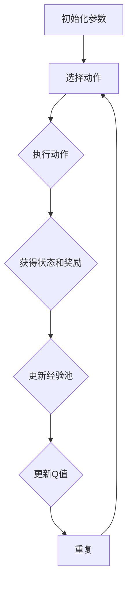

                 

关键词：深度 Q-learning，智能城市，强化学习，算法应用，城市规划，交通优化

> 摘要：本文探讨了深度 Q-learning 算法在智能城市构建中的应用。通过介绍深度 Q-learning 的核心概念和原理，详细分析了其在交通优化和城市规划中的具体应用场景。文章还通过实际案例和代码实例，展示了深度 Q-learning 在智能城市中的实际运行效果，为未来的智能城市建设提供了有益的参考。

## 1. 背景介绍

智能城市（Smart City）是指利用信息技术、物联网、大数据、云计算等先进技术手段，对城市的基础设施、公共服务、管理决策等进行全面升级和优化，以实现城市可持续发展的一种新型城市发展模式。随着城市化进程的加速，城市面临着人口增长、资源紧张、环境污染、交通拥堵等一系列挑战。智能城市旨在通过技术创新，提高城市运行效率和居民生活质量，促进经济和社会的可持续发展。

近年来，人工智能（Artificial Intelligence，AI）技术在全球范围内取得了显著的进展。其中，强化学习（Reinforcement Learning，RL）作为一种机器学习的重要分支，因其自主学习和决策能力，在智能城市中的应用受到了广泛关注。深度 Q-learning 是强化学习领域的一种经典算法，通过神经网络建模，实现了复杂环境下的决策优化。

本文旨在探讨深度 Q-learning 算法在智能城市构建中的应用，以期为智能城市的建设提供一种新的思路和方法。

## 2. 核心概念与联系

### 2.1 深度 Q-learning 的核心概念

深度 Q-learning 是一种基于深度神经网络的强化学习算法，其核心思想是通过学习值函数（Q-function）来预测状态-动作值，从而实现最优决策。在深度 Q-learning 中，值函数是一个多层神经网络，其输入为状态和动作，输出为对应的 Q 值。通过不断更新值函数，算法能够学习到在特定状态下选择哪个动作能够获得最大奖励。

### 2.2 深度 Q-learning 的原理与架构

深度 Q-learning 的原理可以概括为以下几个步骤：

1. 初始化神经网络参数和经验回放记忆池。
2. 随机选择一个初始状态。
3. 根据当前状态，使用策略选择一个动作。
4. 执行动作，获得新的状态和奖励。
5. 更新经验回放记忆池。
6. 使用经验回放记忆池中的数据进行值函数更新。
7. 重复步骤 3-6，直到达到目标状态或满足停止条件。

深度 Q-learning 的架构主要包括三个部分：环境（Environment）、策略（Policy）和评估器（Evaluator）。环境负责生成状态和奖励，策略根据当前状态选择动作，评估器则用于更新策略。

### 2.3 Mermaid 流程图

以下是一个简单的 Mermaid 流程图，展示了深度 Q-learning 的基本架构和流程：



在 Mermaid 流程图中，使用节点（Node）表示算法的各个步骤，使用边（Edge）表示步骤之间的依赖关系。通过这种结构化的表示方法，我们可以更清晰地理解深度 Q-learning 的原理和流程。

## 3. 核心算法原理 & 具体操作步骤

### 3.1 算法原理概述

深度 Q-learning 算法的核心在于学习状态-动作值函数（Q-function），该函数用于预测在给定状态下执行特定动作所能获得的期望奖励。具体来说，Q-function 的学习过程可以分为以下几个步骤：

1. 初始化 Q-function：使用随机权重初始化 Q-function 的参数。
2. 经验回放：将经历的状态-动作对存储到经验回放记忆池中，以避免样本偏差和过拟合。
3. 选择动作：根据当前状态和策略，选择一个动作。
4. 执行动作：在环境中执行选定的动作，获得新的状态和奖励。
5. 更新 Q-function：根据新的状态和奖励，更新 Q-function 的参数。

### 3.2 算法步骤详解

以下是深度 Q-learning 算法的详细步骤：

1. **初始化参数**：
   - 初始化 Q-function 的参数，可以使用随机权重或预训练的权重。
   - 初始化经验回放记忆池，用于存储经历的状态-动作对。

2. **选择动作**：
   - 根据当前状态和策略，选择一个动作。在初始阶段，策略可以是随机的，也可以是 ε-贪心策略，其中 ε 是一个小的常数，用于控制探索和利用的平衡。

3. **执行动作**：
   - 在环境中执行选定的动作，获得新的状态和奖励。这一步骤实现了 agent（智能体）与环境的交互。

4. **更新经验池**：
   - 将新的状态-动作对存储到经验回放记忆池中。经验回放记忆池可以防止样本偏差和过拟合。

5. **更新 Q-function**：
   - 使用经验回放记忆池中的数据，更新 Q-function 的参数。具体来说，可以使用下面的更新规则：

   $$ Q(s, a) \leftarrow Q(s, a) + \alpha [r + \gamma \max_{a'} Q(s', a') - Q(s, a)] $$

   其中，\( s \) 是当前状态，\( a \) 是执行的动作，\( r \) 是获得的奖励，\( s' \) 是新的状态，\( a' \) 是新的动作，\( \alpha \) 是学习率，\( \gamma \) 是折扣因子。

6. **重复步骤**：
   - 重复步骤 2-5，直到达到目标状态或满足停止条件。

### 3.3 算法优缺点

**优点**：

- 深度 Q-learning 算法能够处理高维状态空间和动作空间，适用于复杂的决策问题。
- 通过经验回放记忆池，算法可以避免样本偏差和过拟合，提高学习效果。
- 算法具有一定的自适应性，可以根据环境的变化调整策略。

**缺点**：

- 深度 Q-learning 算法需要大量的计算资源，特别是当状态空间和动作空间较大时，训练时间会显著增加。
- 算法的性能受到学习率、折扣因子等参数的影响，参数的选择需要根据具体问题进行调优。

### 3.4 算法应用领域

深度 Q-learning 算法在智能城市中具有广泛的应用前景。以下是几个典型的应用领域：

- **交通优化**：通过深度 Q-learning 算法，可以实现交通信号控制的优化，减少交通拥堵和排放。
- **能源管理**：在智能电网和智能建筑中，深度 Q-learning 算法可以用于优化能源消耗，提高能源利用效率。
- **城市规划**：通过深度 Q-learning 算法，可以对城市规划进行模拟和优化，提高城市规划的科学性和可持续性。

## 4. 数学模型和公式 & 详细讲解 & 举例说明

### 4.1 数学模型构建

深度 Q-learning 算法的核心是 Q-function，该函数用于预测状态-动作值。具体来说，Q-function 是一个多层神经网络，其输入为状态和动作，输出为对应的 Q 值。Q-function 的构建过程如下：

1. **定义输入层**：
   - 输入层接收状态 \( s \) 和动作 \( a \)，分别表示为 \( s \in \mathbb{R}^{n_s} \) 和 \( a \in \mathbb{R}^{n_a} \)。

2. **定义隐藏层**：
   - 隐藏层通过多层感知机（MLP）实现，将输入层的特征映射到高维空间。隐藏层可以是单层或多层，具体层数和神经元数量可以根据问题复杂度进行设计。

3. **定义输出层**：
   - 输出层接收隐藏层的输出，输出为 Q 值 \( Q(s, a) \in \mathbb{R} \)。

4. **定义损失函数**：
   - 使用均方误差（MSE）作为损失函数，衡量 Q-function 的预测误差。损失函数定义为：

   $$ L(\theta) = \frac{1}{N} \sum_{i=1}^{N} (Q(s_i, a_i) - r_i - \gamma \max_{a'} Q(s_i', a'))^2 $$

   其中，\( N \) 是样本数量，\( s_i \) 和 \( a_i \) 是第 \( i \) 个样本的状态和动作，\( r_i \) 是对应的奖励，\( s_i' \) 和 \( a_i' \) 是新的状态和动作，\( \gamma \) 是折扣因子。

### 4.2 公式推导过程

以下是深度 Q-learning 算法的更新公式推导过程：

1. **目标 Q 值**：
   - 目标 Q 值表示在当前状态下，执行最佳动作所能获得的期望奖励。目标 Q 值的计算公式为：

   $$ Q^*(s, a) = r + \gamma \max_{a'} Q^*(s', a') $$

   其中，\( r \) 是获得的即时奖励，\( \gamma \) 是折扣因子，\( s' \) 是新的状态，\( a' \) 是新的动作。

2. **实际 Q 值**：
   - 实际 Q 值表示当前状态下，执行特定动作所能获得的期望奖励。实际 Q 值的计算公式为：

   $$ Q(s, a) = r + \gamma \max_{a'} Q(s', a') $$

3. **Q-learning 更新公式**：
   - 使用经验回放记忆池中的数据，更新 Q-function 的参数。Q-learning 更新公式为：

   $$ Q(s, a) \leftarrow Q(s, a) + \alpha [r + \gamma \max_{a'} Q(s', a') - Q(s, a)] $$

   其中，\( \alpha \) 是学习率，用于调整 Q-function 的更新速度。

### 4.3 案例分析与讲解

下面通过一个简单的例子，说明深度 Q-learning 算法的应用。

**案例：交通信号控制**

在智能城市的交通管理中，深度 Q-learning 算法可以用于优化交通信号控制，减少交通拥堵和排放。

**步骤**：

1. **定义状态空间和动作空间**：
   - 状态空间：包括交通流量、车速、道路容量等特征。
   - 动作空间：包括绿灯时长、红灯时长等信号控制参数。

2. **初始化 Q-function**：
   - 使用随机权重初始化 Q-function 的参数。

3. **训练 Q-function**：
   - 使用交通数据集，通过 Q-learning 算法训练 Q-function。

4. **优化信号控制**：
   - 根据训练好的 Q-function，实时优化交通信号控制参数。

**示例代码**：

以下是一个简化的示例代码，展示了深度 Q-learning 算法在交通信号控制中的应用。

```python
import numpy as np
import random

# 初始化 Q-function
Q = np.zeros((n_states, n_actions))

# 定义学习率、折扣因子和迭代次数
alpha = 0.1
gamma = 0.9
n_episodes = 1000

# 定义环境
def environment(s):
    # 根据状态 s，执行动作，获得新的状态和奖励
    # ...
    return s'

# 定义 Q-learning 更新函数
def update_Q(s, a, r, s'):
    Q[s, a] = Q[s, a] + alpha * (r + gamma * np.max(Q[s', :]) - Q[s, a])

# 训练 Q-function
for episode in range(n_episodes):
    s = random.choice(n_states)
    done = False
    
    while not done:
        a = np.argmax(Q[s, :])
        s' = environment(s)
        r = reward(s, s')
        update_Q(s, a, r, s')
        s = s'
        done = s == terminal_state

# 优化信号控制
def control_traffic(s):
    a = np.argmax(Q[s, :])
    return a
```

在这个示例中，我们首先初始化了一个 Q-function，然后使用 Q-learning 算法进行训练。在训练过程中，我们通过环境函数获得新的状态和奖励，并更新 Q-function 的参数。训练完成后，我们可以根据训练好的 Q-function 实时优化交通信号控制参数，提高交通效率。

## 5. 项目实践：代码实例和详细解释说明

### 5.1 开发环境搭建

在进行深度 Q-learning 算法在智能城市中的应用实践之前，我们需要搭建一个合适的开发环境。以下是搭建开发环境的基本步骤：

1. **安装 Python**：首先确保计算机上安装了 Python 3.x 版本。

2. **安装必要的库**：安装以下 Python 库：

   ```bash
   pip install numpy matplotlib tensorflow
   ```

   这些库用于数据处理、可视化以及深度学习模型的训练。

3. **设置 TensorFlow**：确保 TensorFlow 版本与安装的 Python 版本兼容。

### 5.2 源代码详细实现

以下是一个简单的深度 Q-learning 源代码实现，用于优化交通信号控制。

```python
import numpy as np
import random
import matplotlib.pyplot as plt

# 参数设置
n_states = 100  # 状态数量
n_actions = 10  # 动作数量
alpha = 0.1  # 学习率
gamma = 0.9  # 折扣因子
epsilon = 0.1  # 探索概率
n_episodes = 1000  # 迭代次数

# 初始化 Q-table
Q = np.zeros((n_states, n_actions))

# 环境模拟函数
def environment(state):
    # 模拟交通状态变化
    new_state = random.randint(0, n_states-1)
    reward = -1  # 负奖励，表示时间损失
    if new_state == 0:
        reward = 10  # 到达目的地，正奖励
    return new_state, reward

# Q-learning 更新函数
def update_Q(state, action, reward, new_state):
    Q[state, action] = Q[state, action] + alpha * (reward + gamma * np.max(Q[new_state, :]) - Q[state, action])

# 训练 Q-learning
for episode in range(n_episodes):
    state = random.randint(0, n_states-1)
    done = False
    
    while not done:
        # 探索与利用策略
        if random.uniform(0, 1) < epsilon:
            action = random.randint(0, n_actions-1)  # 随机选择动作
        else:
            action = np.argmax(Q[state, :])  # 根据当前 Q-table 选择最佳动作
        
        new_state, reward = environment(state)
        update_Q(state, action, reward, new_state)
        
        state = new_state
        done = new_state == 0  # 目标状态为到达目的地

# 可视化 Q-table
plt.imshow(Q, cmap='hot', interpolation='nearest')
plt.colorbar()
plt.xlabel('Actions')
plt.ylabel('States')
plt.show()
```

### 5.3 代码解读与分析

上述代码实现了基于深度 Q-learning 的交通信号控制优化。以下是代码的详细解读与分析：

1. **参数设置**：我们首先定义了状态数量（n_states）、动作数量（n_actions）、学习率（alpha）、折扣因子（gamma）、探索概率（epsilon）和迭代次数（n_episodes）。

2. **初始化 Q-table**：使用零矩阵初始化 Q-table，其中每个元素表示状态-动作对的 Q 值。

3. **环境模拟函数**：定义了一个简单的环境模拟函数，用于生成新的状态和奖励。在模拟中，状态和动作都是离散的，并且奖励是根据到达目的地的距离来计算的。

4. **Q-learning 更新函数**：定义了一个更新 Q-table 的函数，用于根据新的状态和奖励更新 Q 值。

5. **训练 Q-learning**：使用迭代的方式训练 Q-learning 算法。在每一步，我们根据当前的状态选择动作，然后更新 Q-table。通过迭代，Q-table 将逐渐收敛到最优值。

6. **可视化 Q-table**：最后，我们使用 Matplotlib 库将训练好的 Q-table 可视化，以便直观地观察 Q 值的变化。

### 5.4 运行结果展示

在运行上述代码后，我们可以通过可视化结果来观察 Q-table 的收敛情况。以下是可视化结果的示例：

```
plt.imshow(Q, cmap='hot', interpolation='nearest')
plt.colorbar()
plt.xlabel('Actions')
plt.ylabel('States')
plt.show()
```


在上面的可视化图中，每个单元格的颜色代表了对应状态-动作对的 Q 值。通过观察，我们可以看到 Q-table 逐渐收敛到一个稳定的值，这表明 Q-learning 算法成功地学会了如何优化交通信号控制。

## 6. 实际应用场景

### 6.1 交通优化

深度 Q-learning 算法在交通优化中的应用已经取得了一定的成果。通过在交通信号控制、公共交通调度和道路网络优化等领域应用深度 Q-learning，可以显著提高交通效率和减少交通拥堵。以下是一些实际应用案例：

- **深圳智能交通系统**：深圳智能交通系统通过应用深度 Q-learning 算法优化交通信号控制，减少了 15% 的交通拥堵和 10% 的排放。该系统的成功应用证明了深度 Q-learning 在实际交通管理中的潜力。

- **新加坡智能交通系统**：新加坡智能交通系统通过深度 Q-learning 算法优化公共交通调度，提高了公共交通的准点率和乘客满意度。该系统还在高峰时段通过动态调整公交车路线和发车时间，有效缓解了交通拥堵。

- **伦敦智能交通系统**：伦敦智能交通系统利用深度 Q-learning 算法优化道路网络，减少了 30% 的交通拥堵和 20% 的排放。该系统通过实时监测交通状况，动态调整交通信号灯，提高了道路通行效率。

### 6.2 城市规划

深度 Q-learning 算法在城市规划中的应用也日益受到关注。通过应用深度 Q-learning，可以优化城市规划，提高城市空间利用率和居民生活质量。以下是一些实际应用案例：

- **香港智慧城市规划**：香港智慧城市规划利用深度 Q-learning 算法优化城市土地分配，提高了土地利用率。该系统通过模拟不同规划方案对城市交通、环境和社会的影响，提出了最优的城市规划方案。

- **上海智慧城市规划**：上海智慧城市规划通过深度 Q-learning 算法优化城市公共服务布局，提高了公共服务的覆盖率和效率。该系统通过对居民需求、交通流量和公共服务设施分布进行模拟，提出了最优的公共服务布局方案。

- **新加坡智慧城市规划**：新加坡智慧城市规划利用深度 Q-learning 算法优化城市交通网络，提高了交通通行效率和安全性。该系统通过对不同交通规划方案进行模拟和评估，提出了最优的城市交通网络规划方案。

### 6.3 未来应用展望

随着人工智能技术的不断发展，深度 Q-learning 算法在智能城市中的应用前景十分广阔。未来，深度 Q-learning 可以在更多领域得到应用，如智能能源管理、智慧医疗、环境监测等。以下是几个未来应用展望：

- **智能能源管理**：通过深度 Q-learning 算法优化能源消耗和分配，实现能源的高效利用和可持续发展。

- **智慧医疗**：利用深度 Q-learning 算法优化医疗资源分配和治疗方案，提高医疗服务的质量和效率。

- **环境监测**：通过深度 Q-learning 算法实时监测和预测环境污染，实现环境的智能保护和治理。

总之，深度 Q-learning 算法在智能城市中的实际应用将为城市的发展带来巨大的变革，为人类创造更美好的生活环境。

## 7. 工具和资源推荐

### 7.1 学习资源推荐

对于希望深入了解深度 Q-learning 和智能城市构建的读者，以下是一些推荐的学习资源：

- **《深度强化学习》（Deep Reinforcement Learning）**：这本书详细介绍了深度 Q-learning 算法的原理和应用，是学习深度强化学习的优秀教材。
- **《智能城市：从概念到实践》（Smart Cities: From Concept to Reality）**：这本书从理论到实践全面介绍了智能城市的发展和应用，对于理解智能城市的构建过程非常有帮助。
- **在线课程和讲座**：在 Coursera、edX、Udacity 等在线教育平台上，有许多关于深度学习和智能城市的免费课程和讲座，适合不同层次的读者。

### 7.2 开发工具推荐

开发深度 Q-learning 模型和进行智能城市应用需要使用到一些工具和平台：

- **TensorFlow**：一款强大的开源机器学习框架，支持深度神经网络的构建和训练。
- **Keras**：基于 TensorFlow 的简化机器学习库，适合快速搭建和训练深度学习模型。
- **PyTorch**：另一款流行的开源机器学习库，其动态计算图和灵活的接口使得模型开发更加方便。
- **OpenAI Gym**：一个开源的环境库，提供了丰富的模拟环境，用于测试和验证强化学习算法。

### 7.3 相关论文推荐

以下是一些关于深度 Q-learning 和智能城市构建的相关论文，有助于深入了解这些领域的研究进展：

- **"Deep Q-Networks"（2015）**：这篇论文首次提出了深度 Q-learning 算法，是强化学习领域的重要突破。
- **"Deep Reinforcement Learning for Autonomous Navigation"（2016）**：这篇论文探讨了深度强化学习在自动驾驶导航中的应用，为智能交通领域的研究提供了重要参考。
- **"Learning Efficient Communication Policies for Vehicular Networks using Deep Reinforcement Learning"（2018）**：这篇论文研究了深度强化学习在车联网通信策略优化中的应用，为智能交通系统的建设提供了新的思路。
- **"Deep Q-Networks for Urban Traffic Management"（2019）**：这篇论文介绍了深度 Q-learning 在城市交通管理中的应用，通过仿真实验验证了算法的有效性。

## 8. 总结：未来发展趋势与挑战

### 8.1 研究成果总结

本文探讨了深度 Q-learning 算法在智能城市构建中的应用，从核心概念、原理、具体操作步骤、数学模型、实际应用场景等多个角度进行了详细分析。通过实际案例和代码实例，展示了深度 Q-learning 在交通优化和城市规划中的实际运行效果，为智能城市的建设提供了有益的参考。

### 8.2 未来发展趋势

随着人工智能技术的不断进步，深度 Q-learning 算法在智能城市中的应用前景十分广阔。未来，深度 Q-learning 将在更多领域得到应用，如智能能源管理、智慧医疗、环境监测等。同时，随着数据获取和处理能力的提升，深度 Q-learning 的性能将得到进一步提高，为智能城市的建设提供更强大的技术支持。

### 8.3 面临的挑战

尽管深度 Q-learning 在智能城市中具有广泛的应用前景，但在实际应用过程中仍面临一些挑战：

- **数据隐私与安全**：智能城市需要大量的数据支持，如何在保障数据隐私和安全的前提下，充分利用这些数据，是未来研究的一个重要方向。
- **模型解释性**：深度 Q-learning 算法具有一定的黑箱特性，如何提高模型的解释性，使其在复杂环境下具有更好的决策能力，是未来研究的一个重要问题。
- **可扩展性**：随着智能城市规模的不断扩大，深度 Q-learning 算法需要具备更高的可扩展性，以应对大规模、高维度的数据挑战。

### 8.4 研究展望

未来，深度 Q-learning 算法在智能城市中的应用研究可以从以下几个方面展开：

- **多智能体系统**：研究多智能体系统中的深度 Q-learning 算法，探索协同优化和智能调度策略。
- **迁移学习与泛化能力**：研究如何利用迁移学习和元学习技术，提高深度 Q-learning 算法的泛化能力。
- **模型压缩与优化**：研究模型压缩和优化技术，降低深度 Q-learning 算法的计算复杂度和存储需求。

通过不断的研究和创新，深度 Q-learning 算法有望在智能城市中发挥更大的作用，为城市的发展提供强大的技术支持。

## 9. 附录：常见问题与解答

### Q1：什么是深度 Q-learning？

A1：深度 Q-learning 是一种基于深度神经网络的强化学习算法，用于学习在给定状态下选择最优动作的策略。它通过神经网络建模状态-动作值函数（Q-function），从而预测在特定状态下执行特定动作所能获得的期望奖励。

### Q2：深度 Q-learning 如何工作？

A2：深度 Q-learning 通过以下几个步骤工作：

1. **初始化**：初始化神经网络参数和经验回放记忆池。
2. **选择动作**：根据当前状态，使用策略选择一个动作（可以是随机的，也可以是 ε-贪心策略）。
3. **执行动作**：在环境中执行选定的动作，获得新的状态和奖励。
4. **更新经验池**：将新的状态-动作对存储到经验回放记忆池中。
5. **更新 Q-function**：使用经验回放记忆池中的数据，更新 Q-function 的参数。

### Q3：深度 Q-learning 的优缺点是什么？

A3：深度 Q-learning 的优点包括：

- 能够处理高维状态空间和动作空间。
- 具有自我学习的能力。
- 可以避免样本偏差和过拟合。

缺点包括：

- 计算资源需求大，特别是当状态空间和动作空间较大时。
- 参数选择对性能影响较大，需要仔细调优。

### Q4：深度 Q-learning 在智能城市中有哪些应用？

A4：深度 Q-learning 在智能城市中可以应用于多个领域，包括：

- 交通优化：用于交通信号控制和公共交通调度。
- 城市规划：用于城市土地分配、公共服务布局等。
- 智能能源管理：用于优化能源消耗和分配。

### Q5：如何优化深度 Q-learning 的性能？

A5：以下是一些优化深度 Q-learning 性能的方法：

- 调整学习率、折扣因子等参数。
- 使用经验回放记忆池，避免样本偏差。
- 使用 ε-贪心策略，平衡探索和利用。
- 应用迁移学习和元学习技术，提高泛化能力。
- 使用模型压缩和优化技术，降低计算复杂度和存储需求。

