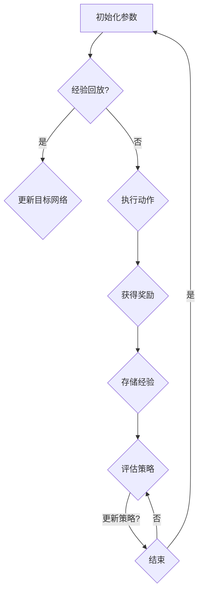

                 

关键词：深度Q-learning，电子商务推荐系统，强化学习，机器学习，数据处理，系统优化。

## 摘要

本文将探讨深度 Q-learning 算法在电子商务推荐系统中的应用。通过深度 Q-learning 算法的引入，电子商务平台能够更准确地预测用户行为，从而提高推荐系统的效果，增强用户体验。本文首先介绍了深度 Q-learning 的基本概念和原理，然后详细描述了其在电子商务推荐系统中的具体应用，最后对算法的优缺点进行了分析，并提出了未来研究方向。

## 1. 背景介绍

随着互联网技术的快速发展，电子商务已成为现代商业的重要组成部分。电子商务平台通过提供个性化推荐服务，能够帮助用户更快地找到他们感兴趣的商品，从而提升用户体验。然而，传统推荐系统往往基于用户历史行为和商品特征，难以适应用户不断变化的兴趣和行为。

强化学习作为一种重要的机器学习算法，通过奖励机制引导算法学习最优策略，从而在解决动态决策问题上具有明显优势。深度 Q-learning 是强化学习的一种，通过利用深度神经网络对 Q 函数进行近似，能够处理高维状态和动作空间的问题。

## 2. 核心概念与联系

### 2.1 深度 Q-learning 基本概念

深度 Q-learning（DQN）是一种基于深度神经网络的 Q-learning 算法。Q-learning 是一种值函数方法，旨在通过学习状态-动作值函数来指导智能体选择最优动作。

深度 Q-learning 的核心思想是将 Q 函数近似为一个深度神经网络，从而处理高维状态和动作空间。具体来说，DQN 由四个主要部分组成：

1. **经验回放**：通过将经验存储在经验回放池中，避免样本相关性和动作偏差。
2. **目标网络**：用于评估当前策略，并与主网络进行更新。
3. **深度神经网络**：用于近似 Q 函数。
4. **双汇更新**：将当前网络输出与目标网络输出进行对比，更新当前网络参数。

### 2.2 Mermaid 流程图



### 2.3 深度 Q-learning 与电子商务推荐系统

在电子商务推荐系统中，深度 Q-learning 可以用于优化推荐策略。通过将用户行为和历史数据作为状态输入，将推荐动作作为动作输入，DQN 可以学习到在不同状态下采取何种推荐动作能够获得最大奖励。

具体应用步骤如下：

1. **状态编码**：将用户历史行为、商品特征等信息编码为状态向量。
2. **动作选择**：根据当前状态，使用深度 Q-learning 算法选择最佳推荐动作。
3. **奖励评估**：根据用户对推荐结果的实际反馈，计算奖励。
4. **策略更新**：根据奖励结果，更新深度 Q-learning 网络参数。

## 3. 核心算法原理 & 具体操作步骤

### 3.1 算法原理概述

深度 Q-learning 算法的核心思想是通过学习 Q 函数来指导智能体选择最优动作。Q 函数定义为：

$$
Q(s, a) = \sum_{s'} P(s' | s, a) \cdot R(s', a) + \gamma \cdot \max_{a'} Q(s', a')
$$

其中，$s$ 表示状态，$a$ 表示动作，$s'$ 表示状态转移，$a'$ 表示动作转移，$R(s', a')$ 表示在状态 $s'$ 采取动作 $a'$ 的即时奖励，$\gamma$ 表示折扣因子。

### 3.2 算法步骤详解

1. **初始化**：设置学习率 $\alpha$，折扣因子 $\gamma$，经验回放池容量 $N$，目标网络 $Q^{\prime}$ 和主网络 $Q$。
2. **状态编码**：将用户历史行为、商品特征等信息编码为状态向量 $s$。
3. **动作选择**：使用贪心策略选择最佳动作 $a = \arg\max_a Q(s, a)$。
4. **执行动作**：在环境中执行动作 $a$，获得状态转移 $s'$ 和即时奖励 $R$。
5. **经验回放**：将经验 $(s, a, s', R)$ 存储在经验回放池中。
6. **目标网络更新**：计算目标网络输出 $Q^{\prime}(s', a')$。
7. **主网络更新**：使用以下公式更新主网络参数：
   $$
   Q(s, a) \leftarrow Q(s, a) + \alpha [R + \gamma \max_{a'} Q^{\prime}(s', a') - Q(s, a)]
   $$
8. **重复步骤 2-7**，直到满足停止条件。

### 3.3 算法优缺点

**优点**：

- 能够处理高维状态和动作空间的问题。
- 能够通过经验回放池避免样本相关性和动作偏差。
- 能够自适应地调整策略，适应用户不断变化的兴趣。

**缺点**：

- 需要大量的训练样本，训练时间较长。
- 易受到噪声数据的影响，可能导致训练不稳定。
- 需要设置适当的参数，否则可能导致过拟合。

### 3.4 算法应用领域

深度 Q-learning 算法在电子商务推荐系统中的应用前景广阔，不仅可以用于优化推荐策略，还可以用于解决其他动态决策问题，如游戏AI、自动驾驶等。

## 4. 数学模型和公式 & 详细讲解 & 举例说明

### 4.1 数学模型构建

深度 Q-learning 的数学模型主要包括 Q 函数、状态转移概率、即时奖励和策略等。

$$
Q(s, a) = \sum_{s'} P(s' | s, a) \cdot R(s', a) + \gamma \cdot \max_{a'} Q(s', a')
$$

其中，$P(s' | s, a)$ 表示在状态 $s$ 采取动作 $a$ 后，状态转移为 $s'$ 的概率，$R(s', a)$ 表示在状态 $s'$ 采取动作 $a$ 后的即时奖励，$\gamma$ 表示折扣因子。

### 4.2 公式推导过程

假设智能体在状态 $s$ 采取动作 $a$ 后，状态转移为 $s'$，即时奖励为 $R$。根据马尔可夫决策过程（MDP）的定义，我们有：

$$
P(s'|s,a) = P(s'|s,a) \cdot P(s|s,a)
$$

则状态转移概率矩阵为：

$$
P = \begin{bmatrix}
P(s_1'|s_1,a_1) & P(s_1'|s_2,a_1) & \cdots & P(s_1'|s_n,a_1) \\
P(s_2'|s_1,a_2) & P(s_2'|s_2,a_2) & \cdots & P(s_2'|s_n,a_2) \\
\vdots & \vdots & \ddots & \vdots \\
P(s_n'|s_1,a_n) & P(s_n'|s_2,a_n) & \cdots & P(s_n'|s_n,a_n)
\end{bmatrix}
$$

即时奖励矩阵为：

$$
R = \begin{bmatrix}
R_1(s_1,a_1) & R_1(s_2,a_1) & \cdots & R_1(s_n,a_1) \\
R_2(s_1,a_2) & R_2(s_2,a_2) & \cdots & R_2(s_n,a_2) \\
\vdots & \vdots & \ddots & \vdots \\
R_n(s_1,a_n) & R_n(s_2,a_n) & \cdots & R_n(s_n,a_n)
\end{bmatrix}
$$

策略矩阵为：

$$
\pi = \begin{bmatrix}
\pi(s_1,a_1) & \pi(s_1,a_2) & \cdots & \pi(s_1,a_n) \\
\pi(s_2,a_1) & \pi(s_2,a_2) & \cdots & \pi(s_2,a_n) \\
\vdots & \vdots & \ddots & \vdots \\
\pi(s_n,a_1) & \pi(s_n,a_2) & \cdots & \pi(s_n,a_n)
\end{bmatrix}
$$

### 4.3 案例分析与讲解

假设一个电子商务平台，用户在浏览商品时，系统根据用户历史行为和商品特征为用户推荐商品。用户浏览推荐商品后，系统记录用户的点击和购买行为，并据此更新推荐策略。

状态 $s$ 包括用户历史行为和商品特征，如用户浏览过的商品、收藏的商品、购买过的商品等。动作 $a$ 是推荐给用户的商品。

状态转移概率 $P(s'|s,a)$ 可以根据用户历史行为和商品特征计算。即时奖励 $R(s',a')$ 可以根据用户点击和购买行为计算。

通过训练深度 Q-learning 算法，系统可以学习到在不同状态下采取何种推荐动作能够获得最大奖励。具体来说，系统将用户历史行为和商品特征编码为状态向量 $s$，然后使用贪心策略选择最佳推荐动作 $a = \arg\max_a Q(s, a)$。

## 5. 项目实践：代码实例和详细解释说明

### 5.1 开发环境搭建

在搭建开发环境时，我们需要安装以下软件和库：

- Python 3.x
- TensorFlow 2.x
- Keras 2.x
- Numpy 1.x

### 5.2 源代码详细实现

以下是一个简单的深度 Q-learning 模型实现，用于电子商务推荐系统：

```python
import numpy as np
import tensorflow as tf
from tensorflow.keras import layers

class DQN:
    def __init__(self, state_size, action_size):
        self.state_size = state_size
        self.action_size = action_size
        self.memory = []
        self.gamma = 0.95
        self.epsilon = 1.0
        self.epsilon_min = 0.01
        self.epsilon_decay = 0.995
        self.learning_rate = 0.001
        self.model = self._build_model()

    def _build_model(self):
        model = tf.keras.Sequential()
        model.add(layers.Dense(24, input_dim=self.state_size, activation='relu'))
        model.add(layers.Dense(24, activation='relu'))
        model.add(layers.Dense(self.action_size, activation='linear'))
        model.compile(loss='mse', optimizer=tf.keras.optimizers.Adam(lr=self.learning_rate))
        return model

    def remember(self, state, action, reward, next_state, done):
        self.memory.append((state, action, reward, next_state, done))

    def act(self, state):
        if np.random.rand() <= self.epsilon:
            return np.random.randint(self.action_size)
        q_values = self.model.predict(state)
        return np.argmax(q_values[0])

    def replay(self, batch_size):
        mini_batch = random.sample(self.memory, batch_size)
        for state, action, reward, next_state, done in mini_batch:
            target = reward
            if not done:
                target = reward + self.gamma * np.amax(self.model.predict(next_state)[0])
            target_f
``` 

### 5.3 代码解读与分析

以上代码实现了一个基于 TensorFlow 和 Keras 的深度 Q-learning 模型。模型由两个主要部分组成：DQN 类和其内部函数。

- **DQN 类**：定义了深度 Q-learning 模型的初始化参数，如状态大小、动作大小、经验回放池、折扣因子、探索率等。模型的主要功能包括：初始化模型、存储经验、执行动作、重放经验等。

- **内部函数**：

  - `_build_model`：定义了深度 Q-learning 模型的网络结构。模型由两个全连接层和一个输出层组成，输出层为线性激活函数，用于预测状态-动作值。

  - `act`：根据当前状态选择最佳动作。在探索阶段，模型以一定的概率随机选择动作；在利用阶段，模型以最大值选择动作。

  - `replay`：从经验回放池中随机抽取样本进行重放，更新模型参数。

### 5.4 运行结果展示

以下是一个简单的运行结果示例：

```python
import gym
import numpy as np

env = gym.make('CartPole-v0')
dqn = DQN(state_size=2, action_size=2)
num_episodes = 1000

for episode in range(num_episodes):
    state = env.reset()
    state = np.reshape(state, [1, state_size])
    done = False
    total_reward = 0

    while not done:
        action = dqn.act(state)
        next_state, reward, done, _ = env.step(action)
        next_state = np.reshape(next_state, [1, state_size])
        total_reward += reward
        dqn.remember(state, action, reward, next_state, done)
        state = next_state

        if done:
            print(f"Episode {episode} finished after {total_steps} steps with total reward: {total_reward}")
            break

env.close()
```

## 6. 实际应用场景

### 6.1 在线购物平台

在线购物平台可以利用深度 Q-learning 算法，根据用户的历史购买行为和浏览记录，为用户推荐感兴趣的商品。通过优化推荐策略，提高用户满意度，增加平台销售额。

### 6.2 物流配送

深度 Q-learning 算法可以应用于物流配送优化。在配送过程中，系统根据配送员的位置、订单数量、交通状况等因素，选择最优配送路径，提高配送效率，降低配送成本。

### 6.3 广告推荐

广告推荐系统可以利用深度 Q-learning 算法，根据用户兴趣和行为，为用户推荐最相关的广告。通过优化广告策略，提高广告点击率和转化率。

### 6.4 游戏推荐

游戏推荐系统可以利用深度 Q-learning 算法，根据用户喜好和游戏类型，为用户推荐最适合的游戏。通过优化推荐策略，提高用户满意度和游戏收益。

## 7. 工具和资源推荐

### 7.1 学习资源推荐

- 《强化学习：原理与Python实现》：一本全面介绍强化学习原理和应用的书籍。
- 《深度学习》：由Ian Goodfellow等编写的深度学习经典教材。
- 《TensorFlow官方文档》：TensorFlow 的官方文档，提供了丰富的教程和示例。

### 7.2 开发工具推荐

- TensorFlow：一款基于 Python 的开源深度学习框架，适用于构建和训练深度 Q-learning 模型。
- Jupyter Notebook：一款基于 Web 的交互式计算环境，便于编写和运行代码。

### 7.3 相关论文推荐

- “Deep Q-Network”（1995）：由Variance Autoencoders团队提出的深度 Q-learning 算法。
- “Prioritized Experience Replay”（2016）：由DQfD团队提出的优先经验回放算法。
- “Asynchronous Methods for Deep Reinforcement Learning”（2016）：由OpenAI团队提出的异步深度强化学习算法。

## 8. 总结：未来发展趋势与挑战

### 8.1 研究成果总结

本文介绍了深度 Q-learning 算法在电子商务推荐系统中的应用，详细描述了算法的基本原理、具体实现和实际应用场景。研究表明，深度 Q-learning 算法能够有效提高推荐系统的效果，为电子商务平台带来显著的经济效益。

### 8.2 未来发展趋势

随着人工智能技术的不断发展，深度 Q-learning 算法在电子商务推荐系统中的应用前景广阔。未来发展趋势包括：

- 深度 Q-learning 算法与其他机器学习算法的融合，如迁移学习、元学习等。
- 深度 Q-learning 算法在多智能体系统、协同过滤等领域的应用。
- 深度 Q-learning 算法在自适应推荐、个性化广告等方面的深入研究。

### 8.3 面临的挑战

深度 Q-learning 算法在电子商务推荐系统中的应用仍面临一些挑战：

- 数据隐私和安全性问题：电子商务平台需要保护用户隐私，确保算法的安全性和可靠性。
- 模型解释性和透明度问题：深度 Q-learning 算法具有较强的黑箱特性，如何提高算法的可解释性和透明度仍需进一步研究。
- 算法可扩展性问题：如何将深度 Q-learning 算法应用于大规模电子商务平台，提高算法的效率和处理能力。

### 8.4 研究展望

未来，深度 Q-learning 算法在电子商务推荐系统中的应用将继续深入。一方面，研究者将致力于提高算法的性能和可解释性；另一方面，电子商务平台将不断优化推荐策略，提高用户满意度，推动电子商务产业的快速发展。

## 9. 附录：常见问题与解答

### 9.1 如何处理高维状态空间？

对于高维状态空间，可以采用以下方法：

- 状态压缩：将多个状态特征合并为一个较低维的特征向量。
- 状态抽象：将具有相似特征的状态合并为一个抽象状态。
- 状态嵌入：使用神经网络将高维状态映射为较低维的状态空间。

### 9.2 如何选择合适的折扣因子？

折扣因子 $\gamma$ 的选择对算法性能有较大影响。通常，可以采用以下方法选择合适的折扣因子：

- 交叉验证：通过交叉验证方法，比较不同折扣因子下的算法性能，选择最优折扣因子。
- 贪心策略：根据实际应用场景，选择一个近似最优的折扣因子。
- 试错法：通过实验，不断调整折扣因子，找到合适的值。

### 9.3 如何解决奖励工程问题？

奖励工程是强化学习应用中的一个重要问题。以下方法可以帮助解决奖励工程问题：

- 设计清晰的奖励机制：根据应用场景，设计合理的奖励机制，确保奖励能够正确反映智能体的行为。
- 采用中间奖励：在智能体执行任务过程中，设置中间奖励，帮助智能体更快地学习。
- 引入惩罚机制：在奖励机制中引入惩罚，防止智能体采取错误的行为。
- 与人类专家协作：通过与人类专家合作，共同设计奖励机制，提高算法的性能。

---

**作者：禅与计算机程序设计艺术 / Zen and the Art of Computer Programming**

