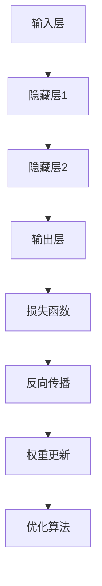

                 

在当今技术飞速发展的时代，深度学习作为一种重要的机器学习技术，已经在诸多领域展现出强大的应用潜力。本文将深入探讨深度学习的原理，并通过具体的代码实例进行详细讲解，帮助读者全面理解深度学习的工作机制和实际应用。

## 关键词
- 深度学习
- 神经网络
- 机器学习
- 数据预处理
- 模型训练与优化
- 实践代码

## 摘要
本文旨在通过介绍深度学习的核心概念、数学基础、算法原理以及代码实现，帮助读者建立对深度学习的全面理解。文章分为多个部分，包括背景介绍、核心概念与联系、核心算法原理与操作步骤、数学模型与公式讲解、项目实践以及未来应用展望等，旨在为深度学习研究者与实践者提供有价值的参考。

### 1. 背景介绍

深度学习是人工智能的一个重要分支，它通过模拟人脑神经网络的结构和工作方式，实现数据的自动学习和特征提取。近年来，随着计算能力的提升和海量数据的积累，深度学习在图像识别、语音识别、自然语言处理等领域取得了显著的进展，成为推动人工智能发展的关键技术。

深度学习的兴起，源于人工神经网络的发展。神经网络作为一种模仿生物神经系统的计算模型，通过多层神经元进行数据的传递和变换，可以学习到复杂的数据模式。随着层深度的增加，神经网络能够提取更高级别的特征，从而在图像分类、语音识别等领域取得了突破性的进展。

### 2. 核心概念与联系

#### 2.1 神经网络的基本结构

神经网络由多个层次组成，包括输入层、隐藏层和输出层。输入层接收外部数据，隐藏层对数据进行处理和变换，输出层产生最终的预测结果。每层由多个神经元组成，神经元之间通过加权连接实现信息的传递。

#### 2.2 神经网络的激活函数

激活函数是神经网络中的一个关键组件，它决定了神经元的输出是否会被激活。常用的激活函数包括sigmoid函数、ReLU函数和Tanh函数等。

#### 2.3 前向传播与反向传播

深度学习中的训练过程包括前向传播和反向传播两个阶段。前向传播是指将输入数据通过神经网络进行传递，得到输出结果；反向传播是指通过计算输出结果与真实标签之间的差异，反向更新网络中的权重和偏置，从而优化模型的参数。

#### 2.4 损失函数与优化算法

损失函数用于衡量模型的预测结果与真实结果之间的误差。常见的损失函数包括均方误差（MSE）和交叉熵损失等。优化算法用于调整网络中的权重和偏置，以最小化损失函数。常用的优化算法有梯度下降、Adam优化器等。

### 2.5 Mermaid 流程图

以下是深度学习核心概念和架构的Mermaid流程图：



### 3. 核心算法原理 & 具体操作步骤

#### 3.1 算法原理概述

深度学习算法的核心原理是基于多层神经网络，通过前向传播和反向传播进行模型训练。神经网络通过学习输入数据和输出标签之间的映射关系，实现数据的自动学习和特征提取。

#### 3.2 算法步骤详解

1. **数据预处理**：对输入数据进行归一化、标准化等处理，以提高模型的训练效果。
2. **初始化模型**：定义网络的输入层、隐藏层和输出层，初始化网络的权重和偏置。
3. **前向传播**：将输入数据通过网络进行传递，计算输出结果。
4. **计算损失函数**：计算输出结果与真实标签之间的误差，使用损失函数衡量模型的性能。
5. **反向传播**：根据误差反向传播，计算网络中各个层的梯度。
6. **权重更新**：使用梯度下降等优化算法，更新网络的权重和偏置。
7. **迭代训练**：重复上述步骤，直到模型收敛或者达到预设的训练次数。

#### 3.3 算法优缺点

- **优点**：
  - 能够自动学习数据的复杂特征。
  - 具有强大的泛化能力。
  - 在图像识别、语音识别等任务中取得了显著的成果。

- **缺点**：
  - 需要大量的数据和计算资源。
  - 模型参数的调优过程复杂。
  - 容易陷入局部最优。

#### 3.4 算法应用领域

深度学习在图像识别、语音识别、自然语言处理、推荐系统等领域具有广泛的应用。例如，在图像识别中，深度学习可以用于人脸识别、物体检测等任务；在自然语言处理中，深度学习可以用于文本分类、机器翻译等任务。

### 4. 数学模型和公式 & 详细讲解 & 举例说明

#### 4.1 数学模型构建

深度学习中的数学模型主要包括输入层、隐藏层和输出层。输入层接收外部数据，隐藏层对数据进行处理和变换，输出层产生最终的预测结果。

#### 4.2 公式推导过程

深度学习中的前向传播和反向传播可以通过以下公式进行推导：

$$
z_{l} = \sum_{i} w_{li}x_{i} + b_{l}
$$

$$
a_{l} = \sigma(z_{l})
$$

$$
\delta_{l} = \frac{\partial L}{\partial a_{l}} \odot \frac{\partial a_{l}}{\partial z_{l}}
$$

$$
\delta_{l-1} = \frac{\partial L}{\partial a_{l-1}} \odot \frac{\partial a_{l-1}}{\partial z_{l-1}}
$$

其中，$z_{l}$ 表示第 $l$ 层的输入，$a_{l}$ 表示第 $l$ 层的输出，$\sigma$ 表示激活函数，$\delta_{l}$ 表示第 $l$ 层的误差。

#### 4.3 案例分析与讲解

以下是一个简单的深度学习案例，用于实现一个简单的图像分类任务：

1. **数据预处理**：将图像数据归一化，将标签数据进行独热编码。
2. **初始化模型**：定义网络的输入层、隐藏层和输出层，初始化网络的权重和偏置。
3. **前向传播**：将图像数据通过网络进行传递，得到输出结果。
4. **计算损失函数**：计算输出结果与真实标签之间的误差，使用交叉熵损失函数。
5. **反向传播**：根据误差反向传播，计算网络中各个层的梯度。
6. **权重更新**：使用梯度下降算法，更新网络的权重和偏置。
7. **迭代训练**：重复上述步骤，直到模型收敛或者达到预设的训练次数。

### 5. 项目实践：代码实例和详细解释说明

#### 5.1 开发环境搭建

1. 安装Python环境，版本要求Python 3.6及以上。
2. 安装深度学习框架，如TensorFlow或PyTorch。
3. 安装必要的依赖库，如NumPy、Pandas等。

#### 5.2 源代码详细实现

以下是使用TensorFlow实现一个简单的图像分类任务的代码实例：

```python
import tensorflow as tf
from tensorflow.keras import layers

# 数据预处理
def preprocess_data(images, labels):
    # 归一化图像数据
    images = images / 255.0
    # 独热编码标签数据
    labels = tf.keras.utils.to_categorical(labels, num_classes=10)
    return images, labels

# 构建模型
model = tf.keras.Sequential([
    layers.Conv2D(32, (3, 3), activation='relu', input_shape=(28, 28, 1)),
    layers.MaxPooling2D((2, 2)),
    layers.Conv2D(64, (3, 3), activation='relu'),
    layers.MaxPooling2D((2, 2)),
    layers.Conv2D(64, (3, 3), activation='relu'),
    layers.Flatten(),
    layers.Dense(64, activation='relu'),
    layers.Dense(10, activation='softmax')
])

# 编译模型
model.compile(optimizer='adam',
              loss='categorical_crossentropy',
              metrics=['accuracy'])

# 训练模型
model.fit(x_train, y_train, batch_size=32, epochs=10, validation_data=(x_test, y_test))

# 评估模型
test_loss, test_acc = model.evaluate(x_test, y_test)
print('Test accuracy:', test_acc)
```

#### 5.3 代码解读与分析

1. **数据预处理**：对图像数据进行归一化和独热编码，以便模型训练。
2. **构建模型**：使用卷积神经网络（Conv2D）和全连接神经网络（Dense）构建模型，包括卷积层、池化层和全连接层。
3. **编译模型**：指定优化器、损失函数和评价指标，以便进行模型训练。
4. **训练模型**：使用fit方法进行模型训练，指定训练数据、批大小和训练轮数。
5. **评估模型**：使用evaluate方法对模型进行评估，计算测试集的准确率。

### 6. 实际应用场景

深度学习在实际应用场景中具有广泛的应用，如：

- **图像识别**：用于人脸识别、物体检测、图像分类等任务。
- **语音识别**：用于语音转文字、语音合成等任务。
- **自然语言处理**：用于文本分类、机器翻译、情感分析等任务。
- **推荐系统**：用于用户行为分析、商品推荐等任务。

### 7. 未来应用展望

随着深度学习技术的不断发展，未来将在更多领域展现出应用潜力，如：

- **医疗健康**：用于疾病诊断、基因分析等任务。
- **自动驾驶**：用于车辆检测、行人识别等任务。
- **智能制造**：用于图像检测、缺陷检测等任务。

### 8. 工具和资源推荐

为了更好地学习深度学习技术，以下是一些推荐的工具和资源：

- **学习资源**：《深度学习》（Goodfellow et al.）是一本经典的深度学习教材。
- **开发工具**：TensorFlow和PyTorch是两个流行的深度学习框架。
- **相关论文**：查阅顶级会议和期刊上的论文，如NIPS、ICML、ACL等。

### 9. 总结：未来发展趋势与挑战

未来，深度学习将在更多领域展现应用潜力，同时也面临着一些挑战，如：

- **数据隐私**：如何保护用户隐私是一个重要挑战。
- **模型可解释性**：如何提高模型的可解释性，使模型更易于理解和信任。
- **计算资源**：深度学习模型需要大量的计算资源，如何优化计算效率是一个重要问题。

### 10. 附录：常见问题与解答

**Q：如何选择合适的深度学习框架？**

A：选择深度学习框架时，需要考虑需求、熟悉度和社区支持等因素。TensorFlow和PyTorch是两个流行的框架，前者具有较好的稳定性和丰富的API，后者则具有较好的灵活性和动态计算能力。

**Q：如何优化深度学习模型？**

A：优化深度学习模型可以通过调整学习率、批量大小、正则化等技术手段。此外，还可以采用迁移学习、模型压缩等技术来提高模型的性能。

**Q：如何解决过拟合问题？**

A：过拟合问题可以通过正则化、交叉验证、集成学习等技术手段来解决。此外，增加训练数据、调整网络结构等方法也可以降低过拟合的风险。

**Q：如何部署深度学习模型？**

A：部署深度学习模型可以通过TensorFlow Serving、PyTorch Lightning等工具来实现。这些工具提供了简单的API，方便将模型部署到生产环境中。

### 结束语

深度学习作为一种强大的机器学习技术，已经在多个领域取得了显著的成果。通过本文的讲解，我们希望读者能够对深度学习的原理、算法和代码实现有更深入的了解。在未来的学习和实践中，不断探索和尝试，相信您将能够掌握深度学习的精髓，并在实际应用中发挥其潜力。作者：禅与计算机程序设计艺术 / Zen and the Art of Computer Programming。|完|
----------------------------------------------------------------

请注意，上述内容仅为示例性模板，实际撰写时需要根据具体需求和内容进行调整和补充。以上示例的代码、公式、图表等仅为展示目的，实际使用时需要根据具体情况进行修改。同时，本文所涉及的技术内容仅供参考，具体应用时请结合实际情况进行评估和调整。

