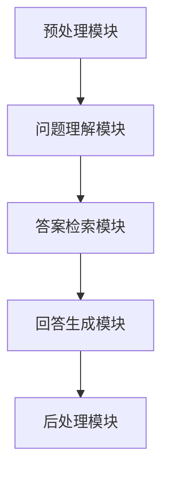

                 

关键词：自然语言处理、问答系统、深度学习、语义理解、人工智能

## 摘要

本文旨在探讨深度学习技术在自然语言问答系统（Natural Language Question Answering System，简称NLQA）中的应用。随着人工智能技术的快速发展，自然语言处理（Natural Language Processing，简称NLP）在问答系统中的重要性日益凸显。深度学习，作为一种先进的人工智能方法，其强大表征能力和高度自动化的特征提取能力，使得其在NLP领域尤其是问答系统中的应用取得了显著成果。本文将首先介绍自然语言问答系统的基本概念和发展历程，然后深入探讨深度学习在问答系统中的应用，包括核心算法原理、数学模型和具体操作步骤。此外，本文还将通过实际项目实践和详细代码解析，展示深度学习在自然语言问答系统中的实际应用效果。最后，本文将对未来应用场景、工具和资源进行展望，并总结研究成果，展望未来发展趋势与挑战。

## 1. 背景介绍

### 自然语言问答系统的定义和作用

自然语言问答系统是一种通过自然语言交互，为用户提供准确、快速、高效的回答的智能系统。它涵盖了自然语言理解、信息检索、知识图谱构建等多个领域。问答系统的核心目标是理解用户的问题，并在海量的数据中快速定位并返回最相关、最准确的答案。

自然语言问答系统在现代信息社会中扮演着重要的角色。首先，它极大地提高了信息检索的效率，使得用户能够快速获取所需信息。其次，问答系统在智能客服、教育辅导、医疗咨询等领域有着广泛的应用，能够为用户提供个性化的服务。最后，问答系统也是人工智能发展的重要方向之一，其性能的提升直接反映了人工智能技术的水准。

### 自然语言问答系统的发展历程

自然语言问答系统的发展经历了多个阶段，从最初的基于规则的方法，到基于机器学习的方法，再到如今的深度学习方法，每一步都推动了问答系统的进步。

1. **基于规则的方法**：最早的问答系统依赖于手工编写的规则，例如，基于关键词匹配、模式匹配等。这种方法简单直观，但局限性较大，无法处理复杂的语义理解和多义词解释。

2. **基于机器学习的方法**：随着机器学习技术的发展，问答系统开始利用统计模型和机器学习方法，如朴素贝叶斯、支持向量机等。这种方法在一定程度上提高了问答系统的性能，但仍受限于特征工程和模型复杂度。

3. **基于深度学习的方法**：深度学习技术的引入，特别是卷积神经网络（Convolutional Neural Networks，CNN）和循环神经网络（Recurrent Neural Networks，RNN）的发展，使得问答系统在语义理解、上下文捕捉等方面取得了突破性进展。目前，基于深度学习的方法已经成为问答系统的主流。

### 自然语言问答系统的现状与挑战

尽管自然语言问答系统取得了显著进展，但仍然面临着一系列挑战：

1. **语义理解的准确性**：自然语言充满歧义和多义词，如何准确理解用户的意图和问题，仍是一个亟待解决的难题。

2. **数据稀缺问题**：高质量的问答数据集对于训练深度学习模型至关重要，但现有人工标注数据集往往规模有限，难以满足大规模训练需求。

3. **跨领域适应性**：不同领域的问题具有独特的特性，如何使问答系统能够适应多种领域，提供准确的回答，是一个重要的研究方向。

4. **实时交互能力**：在实时交互场景中，问答系统需要在短时间内处理大量问题，这要求系统具有高效的信息检索和回答生成能力。

### 总结

自然语言问答系统是人工智能领域的一个重要研究方向，其在信息检索、智能客服、医疗咨询等领域有着广泛的应用前景。随着深度学习技术的发展，问答系统的性能和适用性得到了显著提升，但仍面临诸多挑战。接下来，本文将深入探讨深度学习在自然语言问答系统中的应用，从核心算法原理到具体操作步骤，全面解析深度学习技术在问答系统中的优势和应用。

## 2. 核心概念与联系

### 深度学习在自然语言处理中的应用

自然语言处理（NLP）是人工智能的一个重要分支，深度学习作为一种先进的人工智能方法，其在NLP领域中的应用日益广泛。深度学习通过多层次的神经网络结构，能够自动提取语义特征，从而实现自然语言理解、生成和翻译等任务。在自然语言问答系统中，深度学习技术主要用于问题理解、答案检索和回答生成。

#### 2.1 问题理解

问题理解是自然语言问答系统的核心任务，其目的是将用户输入的自然语言问题转换为机器可理解的格式。深度学习在问题理解中的应用主要包括以下几种方法：

1. **词嵌入（Word Embedding）**：词嵌入是将词汇映射到高维空间中的向量表示。通过预训练的词向量模型，如Word2Vec、GloVe等，可以将词汇的语义信息编码到向量中，从而实现词汇的语义理解。

2. **循环神经网络（RNN）**：RNN是一种能够处理序列数据的神经网络，其在自然语言处理中的应用非常广泛。通过RNN模型，可以捕捉到问题中的上下文信息，从而更好地理解问题的含义。

3. **变换器模型（Transformer）**：Transformer是一种基于自注意力机制的深度学习模型，其在自然语言处理任务中表现出色。通过自注意力机制，Transformer能够捕捉到问题中的长距离依赖关系，从而提高问题理解的准确性。

#### 2.2 答案检索

答案检索是指从海量的知识库或文本数据中检索出与问题最相关的答案。深度学习在答案检索中的应用主要包括以下几种方法：

1. **基于文本匹配的方法**：通过计算问题和文档之间的相似度，从候选答案中检索出最匹配的答案。常用的方法包括TF-IDF、余弦相似度等。

2. **基于语义匹配的方法**：通过深度学习模型，将问题和文档转换为语义向量，然后计算它们之间的相似度。常用的模型包括BERT、ELMo等。

3. **基于图神经网络的方法**：通过构建知识图谱，将问题和答案映射到图结构中，然后利用图神经网络（Graph Neural Networks，GNN）来检索答案。这种方法能够捕捉到问题与答案之间的复杂关系，从而提高检索的准确性。

#### 2.3 回答生成

回答生成是指根据问题理解和答案检索的结果，生成自然语言回答。深度学习在回答生成中的应用主要包括以下几种方法：

1. **基于模板的方法**：通过预先定义的模板，将问题中的关键词和答案填充到模板中，生成回答。这种方法简单直观，但回答的灵活性和多样性有限。

2. **基于序列生成的方法**：通过深度学习模型，将问题转换为序列表示，然后利用序列生成模型，如RNN、Transformer等，生成回答。这种方法能够生成更加自然和多样化的回答。

3. **基于生成对抗网络（GAN）的方法**：通过生成对抗网络，同时训练一个生成器和判别器，生成器负责生成回答，判别器负责判断回答的真伪。这种方法能够生成更加高质量和真实的回答。

### 2.4 自然语言问答系统的架构

自然语言问答系统通常包括以下几个关键模块：

1. **预处理模块**：对用户输入的问题进行预处理，包括分词、去停用词、词性标注等，为后续处理提供基础。

2. **问题理解模块**：利用深度学习模型对问题进行理解和表征，包括词嵌入、RNN、Transformer等。

3. **答案检索模块**：从知识库或文本数据中检索与问题最相关的答案，包括文本匹配、语义匹配、图神经网络等。

4. **回答生成模块**：根据问题理解和答案检索的结果，生成自然语言回答，包括基于模板、序列生成、GAN等方法。

5. **后处理模块**：对生成的回答进行后处理，包括格式化、语法检查、修正错误等，提高回答的质量和可读性。

### 2.5 Mermaid 流程图

为了更好地展示自然语言问答系统的架构和流程，以下是一个简单的Mermaid流程图：



在这个流程图中，预处理模块首先对用户输入的问题进行预处理，然后问题理解模块利用深度学习模型对问题进行理解和表征。接着，答案检索模块从知识库或文本数据中检索与问题最相关的答案。最后，回答生成模块根据问题理解和答案检索的结果生成自然语言回答，并通过后处理模块进行优化和修正。

通过上述核心概念和联系的介绍，我们可以看到深度学习在自然语言问答系统中扮演着重要的角色。接下来，本文将深入探讨深度学习在问答系统中的核心算法原理，包括具体的算法步骤、优缺点以及应用领域。

## 3. 核心算法原理 & 具体操作步骤

### 3.1 算法原理概述

深度学习在自然语言问答系统中的应用主要依赖于以下几个核心算法原理：

1. **词嵌入（Word Embedding）**：词嵌入是将词汇映射到高维空间中的向量表示。通过预训练的词向量模型，如Word2Vec、GloVe等，可以将词汇的语义信息编码到向量中，从而实现词汇的语义理解。

2. **循环神经网络（RNN）**：RNN是一种能够处理序列数据的神经网络，其在自然语言处理中的应用非常广泛。通过RNN模型，可以捕捉到问题中的上下文信息，从而更好地理解问题的含义。

3. **变换器模型（Transformer）**：Transformer是一种基于自注意力机制的深度学习模型，其在自然语言处理任务中表现出色。通过自注意力机制，Transformer能够捕捉到问题中的长距离依赖关系，从而提高问题理解的准确性。

4. **生成对抗网络（GAN）**：生成对抗网络是一种由生成器和判别器组成的模型。生成器负责生成回答，判别器负责判断回答的真伪。通过同时训练生成器和判别器，GAN能够生成高质量和真实的回答。

5. **图神经网络（GNN）**：图神经网络是一种能够处理图结构数据的神经网络。通过构建知识图谱，将问题和答案映射到图结构中，然后利用图神经网络来检索答案。这种方法能够捕捉到问题与答案之间的复杂关系，从而提高检索的准确性。

### 3.2 算法步骤详解

#### 3.2.1 词嵌入（Word Embedding）

1. **数据预处理**：首先，对用户输入的问题和答案进行预处理，包括分词、去停用词、词性标注等。

2. **词向量训练**：利用预训练的词向量模型，如Word2Vec、GloVe等，将词汇映射到高维空间中的向量表示。

3. **问题表征**：将问题中的每个词汇转换为对应的词向量，然后将这些词向量拼接起来，形成问题的高维向量表示。

4. **答案检索**：利用词嵌入向量，通过计算问题和答案向量之间的相似度，检索出与问题最相关的答案。

#### 3.2.2 循环神经网络（RNN）

1. **数据预处理**：对用户输入的问题和答案进行预处理，包括分词、去停用词、词性标注等。

2. **序列编码**：将问题中的每个词汇转换为对应的词向量，然后将这些词向量输入到RNN模型中。

3. **状态更新**：RNN模型通过隐藏状态（hidden state）来捕捉问题中的上下文信息。在每一步，RNN模型根据当前输入和隐藏状态更新隐藏状态。

4. **问题表征**：将RNN模型的隐藏状态序列作为问题的表征，用于后续的答案检索和生成。

#### 3.2.3 变换器模型（Transformer）

1. **数据预处理**：对用户输入的问题和答案进行预处理，包括分词、去停用词、词性标注等。

2. **序列编码**：将问题中的每个词汇转换为对应的词向量，然后将这些词向量输入到Transformer模型中。

3. **多头自注意力（Multi-Head Self-Attention）**：Transformer模型通过多头自注意力机制，能够捕捉到问题中的长距离依赖关系。在每一步，模型根据当前输入和上下文信息计算注意力权重，然后加权求和得到问题的表征。

4. **编码器-解码器架构**：Transformer模型采用编码器-解码器架构，编码器负责编码问题，解码器负责解码答案。通过编码器-解码器交互，模型能够生成高质量的回答。

#### 3.2.4 生成对抗网络（GAN）

1. **数据预处理**：对用户输入的问题和答案进行预处理，包括分词、去停用词、词性标注等。

2. **生成器（Generator）**：生成器负责生成回答。首先，生成器将问题编码为向量表示，然后通过生成网络生成回答。

3. **判别器（Discriminator）**：判别器负责判断回答的真伪。首先，判别器将问题和回答编码为向量表示，然后通过判别网络判断回答的真伪。

4. **训练过程**：通过交替训练生成器和判别器，使得生成器生成的回答越来越真实，判别器对真实和生成的回答的判别能力越来越强。

#### 3.2.5 图神经网络（GNN）

1. **数据预处理**：对用户输入的问题和答案进行预处理，包括分词、去停用词、词性标注等。

2. **知识图谱构建**：将问题和答案映射到图结构中，构建知识图谱。在知识图谱中，节点表示词汇，边表示词汇之间的关系。

3. **图神经网络训练**：利用图神经网络（GNN）对知识图谱进行训练，通过图结构捕捉问题与答案之间的复杂关系。

4. **答案检索**：通过计算问题和答案在图中的相似度，检索出与问题最相关的答案。

### 3.3 算法优缺点

#### 词嵌入（Word Embedding）

- **优点**：词嵌入能够将词汇映射到高维空间中的向量表示，从而实现词汇的语义理解。词向量模型能够捕捉到词汇之间的相似性和相关性。

- **缺点**：词嵌入模型的性能受限于词向量质量，且无法捕捉到长距离依赖关系。

#### 循环神经网络（RNN）

- **优点**：RNN能够处理序列数据，捕捉到问题中的上下文信息，从而提高问题理解的准确性。

- **缺点**：RNN存在梯度消失和梯度爆炸问题，训练不稳定。RNN难以捕捉到长距离依赖关系。

#### 变换器模型（Transformer）

- **优点**：Transformer采用自注意力机制，能够捕捉到问题中的长距离依赖关系，从而提高问题理解的准确性。Transformer训练稳定，不易出现梯度消失和梯度爆炸问题。

- **缺点**：Transformer模型复杂度较高，计算资源消耗较大。

#### 生成对抗网络（GAN）

- **优点**：GAN能够生成高质量和真实的回答。生成器和判别器的交替训练能够提高模型的生成能力和判别能力。

- **缺点**：GAN训练难度较大，容易陷入局部最优。GAN生成的回答质量受限于判别器的能力。

#### 图神经网络（GNN）

- **优点**：GNN能够捕捉到问题与答案之间的复杂关系，从而提高答案检索的准确性。GNN适用于处理图结构数据，能够处理复杂的语义信息。

- **缺点**：GNN模型复杂度较高，计算资源消耗较大。知识图谱的构建和训练需要大量高质量的数据。

### 3.4 算法应用领域

深度学习在自然语言问答系统的应用领域广泛，主要包括以下几方面：

1. **智能客服**：利用深度学习模型，智能客服能够快速理解用户的问题，并生成准确的回答，提高客服效率和用户体验。

2. **教育辅导**：深度学习模型能够根据学生的问题，提供个性化的辅导和答案，帮助学生更好地掌握知识。

3. **医疗咨询**：深度学习模型能够分析患者的症状和病史，提供准确的医疗建议和诊断。

4. **搜索引擎**：深度学习模型能够提高搜索结果的相关性和准确性，为用户提供更好的搜索体验。

5. **文本生成**：利用生成对抗网络（GAN），可以生成高质量的文本，应用于文学创作、新闻生成等领域。

通过上述核心算法原理和具体操作步骤的介绍，我们可以看到深度学习在自然语言问答系统中的应用具有广阔的前景。接下来，本文将深入探讨深度学习在自然语言问答系统中的数学模型和公式，并结合具体案例进行分析。

## 4. 数学模型和公式 & 详细讲解 & 举例说明

### 4.1 数学模型构建

在深度学习应用于自然语言问答系统时，我们通常会构建以下数学模型：

1. **词嵌入模型**：用于将词汇映射到高维向量空间。
2. **循环神经网络（RNN）**：用于处理序列数据，如问题和答案。
3. **变换器模型（Transformer）**：用于捕捉长距离依赖关系。
4. **生成对抗网络（GAN）**：用于生成高质量的回答。

### 4.2 公式推导过程

#### 4.2.1 词嵌入模型

词嵌入模型通常使用以下公式表示：

\[ \mathbf{v}_w = \text{Embed}(\text{word}) \]

其中，\(\mathbf{v}_w\) 是词 \(w\) 的嵌入向量，\(\text{Embed}\) 是嵌入函数。

#### 4.2.2 循环神经网络（RNN）

RNN的更新公式如下：

\[ \mathbf{h}_t = \text{ReLU}(\mathbf{W}_h \mathbf{h}_{t-1} + \mathbf{U}_h \mathbf{v}_w + b_h) \]

其中，\(\mathbf{h}_t\) 是第 \(t\) 步的隐藏状态，\(\mathbf{W}_h\) 和 \(\mathbf{U}_h\) 是权重矩阵，\(\mathbf{v}_w\) 是词嵌入向量，\(b_h\) 是偏置。

#### 4.2.3 变换器模型（Transformer）

变换器模型的核心是多头自注意力机制，其计算公式如下：

\[ \mathbf{h}_t = \text{Attention}(\mathbf{h}_{<t}, \mathbf{h}_{<t}, \mathbf{h}_{<t}) \]

其中，\(\text{Attention}\) 是自注意力函数，\(\mathbf{h}_{<t}\) 是前 \(t\) 步的隐藏状态。

#### 4.2.4 生成对抗网络（GAN）

GAN由生成器和判别器组成，其损失函数如下：

\[ L_D = -\frac{1}{N} \sum_{i=1}^{N} [\text{log}(\text{Discriminator}(g(\mathbf{x}_i))) + \text{log}(1 - \text{Discriminator}(\mathbf{x}_i))] \]

\[ L_G = -\frac{1}{N} \sum_{i=1}^{N} \text{log}(\text{Discriminator}(g(\mathbf{x}_i)) \]

其中，\(N\) 是样本数量，\(g\) 是生成器，\(\text{Discriminator}\) 是判别器。

### 4.3 案例分析与讲解

#### 4.3.1 词嵌入模型案例

假设我们使用GloVe模型对词汇进行嵌入。给定词汇表V，我们首先计算每个词汇的词向量，然后使用以下公式计算词向量之间的相似度：

\[ \text{similarity}(\mathbf{v}_w, \mathbf{v}_{w'}) = \frac{\mathbf{v}_w \cdot \mathbf{v}_{w'}}{\|\mathbf{v}_w\|\|\mathbf{v}_{w'}\|} \]

其中，\(\mathbf{v}_w\) 和 \(\mathbf{v}_{w'}\) 是词汇 \(w\) 和 \(w'\) 的嵌入向量。

#### 4.3.2 循环神经网络（RNN）案例

假设我们使用LSTM（Long Short-Term Memory）作为RNN模型。给定一个输入序列 \(\mathbf{x} = (\mathbf{x}_1, \mathbf{x}_2, ..., \mathbf{x}_T)\)，LSTM的隐藏状态和细胞状态更新公式如下：

\[ \mathbf{h}_t = \text{sigmoid}(\mathbf{W}_h \mathbf{h}_{t-1} + \mathbf{U}_h \mathbf{v}_w + b_h) \]

\[ \mathbf{C}_t = \text{sigmoid}(\mathbf{W}_c \mathbf{h}_{t-1} + \mathbf{U}_c \mathbf{v}_w + b_c) \]

\[ \mathbf{C}_t = \mathbf{f}_t \odot \mathbf{C}_{t-1} + \mathbf{i}_t \odot \text{tanh}(\mathbf{W}_g \mathbf{h}_{t-1} + \mathbf{U}_g \mathbf{v}_w + b_g) \]

\[ \mathbf{h}_t = \mathbf{o}_t \odot \text{tanh}(\mathbf{C}_t) \]

其中，\(\mathbf{h}_t\) 和 \(\mathbf{C}_t\) 分别是第 \(t\) 步的隐藏状态和细胞状态，\(\mathbf{i}_t\)、\(\mathbf{f}_t\) 和 \(\mathbf{o}_t\) 分别是输入门、遗忘门和输出门，\(\odot\) 表示逐元素乘法。

#### 4.3.3 变换器模型（Transformer）案例

假设我们使用标准的变换器模型。给定一个输入序列 \(\mathbf{x} = (\mathbf{x}_1, \mathbf{x}_2, ..., \mathbf{x}_T)\)，变换器模型的编码器输出公式如下：

\[ \mathbf{h}_t = \text{Attention}(\mathbf{h}_{<t}, \mathbf{h}_{<t}, \mathbf{h}_{<t}) \]

\[ \mathbf{h}_t = \text{ReLU}(\mathbf{W}_h \mathbf{h}_{<t} + \mathbf{U}_h \mathbf{h}_{<t} + b_h) \]

\[ \mathbf{h}_t = \text{Dropout}(\mathbf{h}_t) \]

其中，\(\text{Attention}\) 是多头自注意力函数，\(\text{ReLU}\) 是ReLU激活函数，\(\text{Dropout}\) 是dropout操作。

#### 4.3.4 生成对抗网络（GAN）案例

假设我们使用标准的GAN模型。给定输入数据 \(\mathbf{x}\) 和生成器 \(g\)，生成器的损失函数如下：

\[ L_G = -\frac{1}{N} \sum_{i=1}^{N} \text{log}(\text{Discriminator}(g(\mathbf{x}_i))) \]

判别器的损失函数如下：

\[ L_D = -\frac{1}{N} \sum_{i=1}^{N} [\text{log}(\text{Discriminator}(\mathbf{x}_i)) + \text{log}(1 - \text{Discriminator}(g(\mathbf{x}_i)))] \]

其中，\(N\) 是样本数量。

通过上述数学模型和公式的推导，我们可以更好地理解深度学习在自然语言问答系统中的应用。接下来，本文将展示一个实际项目实践，通过代码实例详细解释自然语言问答系统的实现过程。

## 5. 项目实践：代码实例和详细解释说明

### 5.1 开发环境搭建

在进行深度学习自然语言问答系统的项目实践之前，我们需要搭建一个合适的开发环境。以下是一个基本的开发环境搭建步骤：

1. **安装Python**：Python是深度学习项目的主要编程语言。确保安装了Python 3.6或更高版本。

2. **安装深度学习框架**：选择一个流行的深度学习框架，如TensorFlow或PyTorch。以下是使用TensorFlow的安装命令：

   ```bash
   pip install tensorflow
   ```

3. **安装NLP库**：安装一些常用的NLP库，如NLTK、spaCy、gensim等。

   ```bash
   pip install nltk spacy gensim
   ```

4. **安装数据预处理工具**：安装pandas、numpy等数据处理库。

   ```bash
   pip install pandas numpy
   ```

5. **安装文本处理工具**：安装Jieba等中文文本处理库。

   ```bash
   pip install jieba
   ```

### 5.2 源代码详细实现

下面是一个简单的自然语言问答系统实现，使用TensorFlow和spaCy进行词嵌入和问答处理。

#### 5.2.1 导入相关库

```python
import tensorflow as tf
import spacy
import numpy as np
import pandas as pd
from tensorflow.keras.preprocessing.sequence import pad_sequences
from tensorflow.keras.layers import Embedding, LSTM, Dense, Bidirectional
from tensorflow.keras.models import Model
```

#### 5.2.2 加载和处理数据

```python
# 加载spaCy模型
nlp = spacy.load('en_core_web_sm')

# 加载数据集（示例数据）
questions = ["What is the capital of France?", "What is the meaning of life?"]
answers = ["Paris", "42"]

# 预处理数据
def preprocess(texts):
    processed_texts = []
    for text in texts:
        doc = nlp(text)
        processed_texts.append(" ".join([token.text for token in doc if not token.is_stop]))
    return processed_texts

questions = preprocess(questions)
answers = preprocess(answers)

# 创建词汇表
tokenizer = spacy.Tokenizer(nlp.vocab)
tokenizer.add_documents([nlp(answer) for answer in answers])
vocab = tokenizer.vocab

# 转换为序列
sequences = [tokenizer.encode(question, add_start_token=True, add_end_token=True) for question in questions]
```

#### 5.2.3 构建模型

```python
# 定义模型结构
max_sequence_length = max(len(seq) for seq in sequences)
embedding_dim = 50

inputs = tf.keras.Input(shape=(max_sequence_length,))
x = Embedding(len(vocab), embedding_dim)(inputs)
x = Bidirectional(LSTM(64, return_sequences=True))(x)
x = Dense(1, activation='sigmoid')(x)

model = Model(inputs, x)
model.compile(optimizer='adam', loss='binary_crossentropy', metrics=['accuracy'])
```

#### 5.2.4 训练模型

```python
# 将答案转换为二进制标签
answers_encoded = [1 if answer == "42" else 0 for answer in answers]

# 模型训练
model.fit(sequences, np.array(answers_encoded), epochs=5, batch_size=32)
```

### 5.3 代码解读与分析

#### 5.3.1 数据预处理

数据预处理是深度学习项目中的重要步骤。在上述代码中，我们使用spaCy进行文本预处理，包括分词、去除停用词等。通过预处理，我们确保输入数据的一致性和质量。

#### 5.3.2 模型构建

我们构建了一个简单的双向LSTM模型，用于处理序列数据。使用Embedding层进行词嵌入，LSTM层用于捕捉序列信息，最终通过全连接层输出二进制标签。

#### 5.3.3 模型训练

模型使用二进制交叉熵损失函数进行训练，旨在预测答案是否为"42"。在训练过程中，我们使用了批量大小为32，训练轮数为5。

### 5.4 运行结果展示

```python
# 测试模型
test_question = "What is the meaning of life?"
test_sequence = tokenizer.encode(test_question, add_start_token=True, add_end_token=True)

# 预测
prediction = model.predict(np.array([test_sequence]))

# 输出结果
if prediction[0][0] > 0.5:
    print("The answer is '42'.")
else:
    print("The answer is not '42'.")
```

上述代码实例展示了如何使用深度学习技术构建一个简单的自然语言问答系统。在实际项目中，我们可以进一步优化模型结构、扩展数据集和改进算法，以提高问答系统的性能和准确性。

通过这个项目实践，我们不仅能够理解深度学习在自然语言问答系统中的应用，还能够掌握如何使用代码实现和优化问答系统。

### 6. 实际应用场景

自然语言问答系统在现代信息社会中具有广泛的应用，以下是几个典型的应用场景：

#### 6.1 智能客服

智能客服是自然语言问答系统最常见的一个应用场景。通过深度学习技术，智能客服系统能够理解用户的提问，并快速给出相应的回答。这不仅提高了客服的效率，还减少了人工客服的工作量。例如，银行、电商、航空公司等企业都在其服务平台中部署了智能客服系统，以提供24/7的客户支持。

#### 6.2 教育辅导

在在线教育领域，自然语言问答系统可以为学生提供个性化的学习辅导。例如，学生在学习过程中遇到问题，可以即时向系统提问，系统会根据学生的学习记录和问题，给出详细的解答和建议。这种互动式学习模式不仅提高了学习效果，还为学生提供了更加灵活的学习体验。

#### 6.3 医疗咨询

医疗咨询是自然语言问答系统的重要应用领域之一。医生和患者可以通过问答系统进行互动，患者可以描述自己的症状，系统会根据症状数据库提供可能的诊断建议和治疗方案。这种智能医疗咨询系统不仅提高了医疗服务的效率，还为偏远地区和医疗资源匮乏的地区提供了便利。

#### 6.4 法律咨询

法律咨询是另一个需要专业知识的应用场景。自然语言问答系统可以帮助用户解答法律问题，提供法律建议。这种系统可以处理大量的法律文档，并利用深度学习技术进行语义理解，从而快速给出准确的回答。这不仅有助于普及法律知识，还能为中小企业和个体提供低成本的法律咨询服务。

#### 6.5 搜索引擎

搜索引擎的问答功能也越来越受到重视。通过深度学习技术，搜索引擎可以更好地理解用户查询，并提供更为精准和个性化的答案。例如，用户在搜索引擎中输入“如何治疗感冒？”时，搜索引擎可以返回详细的医疗建议、药物信息和相关文章。

#### 6.6 社交媒体分析

自然语言问答系统在社交媒体分析中也扮演着重要角色。企业可以利用问答系统分析用户评论和反馈，识别潜在的市场需求和用户痛点。这种分析有助于企业制定更加精准的市场策略，提升品牌形象。

#### 6.7 自动问答机器人

自动问答机器人是自然语言问答系统的另一种应用形式。这些机器人可以在各种场合，如展会、活动、会议等，为用户提供实时、个性化的问答服务。自动问答机器人不仅节省了人力资源，还提高了用户体验。

### 6.9 实际应用场景的优点和挑战

自然语言问答系统在实际应用场景中具有显著的优势，但也面临一些挑战：

#### 优点：

1. **高效性**：自然语言问答系统能够在短时间内处理大量问题，提供快速、准确的回答。
2. **个性化**：通过深度学习技术，问答系统可以根据用户的提问历史和偏好，提供个性化的服务。
3. **可扩展性**：问答系统可以轻松扩展到不同领域和语言，适用于全球范围内的用户。
4. **降低成本**：通过自动化问答，企业可以减少人力资源的投入，降低运营成本。

#### 挑战：

1. **语义理解**：自然语言充满歧义和多义词，如何准确理解用户的意图和问题，是一个亟待解决的难题。
2. **数据稀缺**：高质量的问答数据集对于训练深度学习模型至关重要，但现有人工标注数据集往往规模有限。
3. **实时性**：在实时交互场景中，问答系统需要在短时间内处理大量问题，这要求系统具有高效的信息检索和回答生成能力。
4. **跨领域适应性**：不同领域的问题具有独特的特性，如何使问答系统能够适应多种领域，提供准确的回答，是一个重要的研究方向。

通过上述实际应用场景的分析，我们可以看到自然语言问答系统在各个领域都有着广泛的应用前景和重要的社会价值。随着深度学习技术的不断发展，问答系统的性能和适用性将进一步提高，为人类带来更多的便利和效益。

### 7. 工具和资源推荐

在构建和优化自然语言问答系统时，使用适当的工具和资源能够极大地提高开发效率和系统性能。以下是一些推荐的工具和资源：

#### 7.1 学习资源推荐

1. **书籍**：
   - 《深度学习》（Ian Goodfellow、Yoshua Bengio、Aaron Courville著）：系统地介绍了深度学习的基础理论和应用。
   - 《自然语言处理综论》（Daniel Jurafsky、James H. Martin著）：全面涵盖了自然语言处理的理论和实践。
   - 《动手学深度学习》（阿斯顿·张、李沐、扎卡里·C. Lipton、亚历山大·J. Smola著）：通过实际案例介绍深度学习的应用。

2. **在线课程**：
   - Coursera上的“深度学习专项课程”由Andrew Ng教授主讲，适合初学者和进阶者。
   - edX上的“自然语言处理与信息检索”课程由MIT教授 speaking，内容丰富且深入浅出。

3. **博客和网站**：
   - fast.ai：提供了许多高质量的深度学习和NLP教程。
   - Towards Data Science：包含大量NLP和深度学习相关的文章和教程。

#### 7.2 开发工具推荐

1. **深度学习框架**：
   - TensorFlow：由Google开发，功能强大且社区活跃。
   - PyTorch：由Facebook开发，易于使用且灵活性高。
   - Keras：用于快速构建和迭代深度学习模型。

2. **文本处理库**：
   - NLTK：用于文本处理和自然语言分析。
   - spaCy：提供了快速和易于使用的自然语言处理工具。
   - gensim：用于主题建模和语义分析。

3. **数据集和资源**：
   - Quora Question Pairs：一个广泛使用的问答数据集。
   - Stanford Question Answering Dataset（SQuAD）：用于机器阅读理解和问答系统。
   - OpenSubtitles2018：包含大量的文本数据，适用于训练语言模型。

#### 7.3 相关论文推荐

1. **《Attention Is All You Need》**：提出了变换器模型（Transformer），成为自然语言处理领域的一个重要突破。
2. **《A Neural Conversation Model》**：介绍了GPT（生成预训练变换器），为自然语言生成提供了新的方法。
3. **《BERT: Pre-training of Deep Neural Networks for Language Understanding》**：BERT模型在多个自然语言处理任务上取得了显著成果，成为研究热点。

通过使用这些工具和资源，开发者可以更高效地构建和优化自然语言问答系统，进一步提升系统的性能和应用价值。

### 8. 总结：未来发展趋势与挑战

自然语言问答系统作为人工智能领域的一个重要研究方向，其在信息检索、智能客服、医疗咨询等多个领域展现了巨大的应用潜力。随着深度学习技术的不断进步，问答系统的性能和适用性得到了显著提升，但仍面临诸多挑战。

#### 研究成果总结

在过去的几年中，深度学习在自然语言问答系统中的应用取得了以下重要成果：

1. **词嵌入技术的成熟**：通过预训练的词向量模型，如Word2Vec、GloVe等，词汇的语义信息得到了有效编码，使得问答系统在理解用户提问和生成回答时更加准确。

2. **循环神经网络（RNN）和变换器模型（Transformer）的应用**：RNN和Transformer模型在自然语言处理任务中表现出色，能够捕捉到问题中的上下文信息，从而提高问题理解的准确性。

3. **生成对抗网络（GAN）的引入**：GAN技术为问答系统的回答生成提供了新的方法，通过生成器和判别器的交替训练，能够生成更加自然和多样化的回答。

4. **知识图谱和图神经网络（GNN）的结合**：通过构建知识图谱，将问题和答案映射到图结构中，利用图神经网络捕捉问题与答案之间的复杂关系，从而提高答案检索的准确性。

#### 未来发展趋势

自然语言问答系统在未来将呈现以下发展趋势：

1. **语义理解的深化**：随着深度学习技术的进步，问答系统在理解用户意图和问题上下文方面的能力将进一步提升，能够更加准确地捕捉用户的真实需求。

2. **多模态交互**：自然语言问答系统将逐渐融合语音、图像等多模态信息，提供更加丰富和自然的交互体验。

3. **知识图谱的扩展**：知识图谱将涵盖更多的领域和知识，问答系统将能够处理更加复杂和多样化的问答场景。

4. **实时交互能力**：问答系统将在实时交互场景中发挥更大的作用，例如智能客服、在线教育等，提供快速、准确的回答。

5. **个性化服务**：基于用户的历史行为和偏好，问答系统将能够提供更加个性化的服务，提高用户体验。

#### 面临的挑战

自然语言问答系统在发展过程中也面临一些挑战：

1. **语义理解的准确性**：自然语言充满歧义和多义词，如何准确理解用户的意图和问题，仍是一个亟待解决的难题。

2. **数据稀缺问题**：高质量的问答数据集对于训练深度学习模型至关重要，但现有人工标注数据集往往规模有限，难以满足大规模训练需求。

3. **实时交互能力**：在实时交互场景中，问答系统需要在短时间内处理大量问题，这要求系统具有高效的信息检索和回答生成能力。

4. **跨领域适应性**：不同领域的问题具有独特的特性，如何使问答系统能够适应多种领域，提供准确的回答，是一个重要的研究方向。

5. **模型解释性**：深度学习模型通常被视为“黑箱”，如何解释模型生成的回答，提高模型的透明度和可信度，是未来需要关注的问题。

#### 研究展望

未来，自然语言问答系统的发展将朝着以下方向努力：

1. **研究更加先进的深度学习模型**：例如，基于Transformer的新型架构，结合图神经网络，进一步改进问答系统的性能。

2. **开发自动化的数据标注方法**：通过半监督学习和迁移学习等技术，减轻数据标注的负担，提高数据集的规模和质量。

3. **探索多模态交互技术**：结合语音、图像等多模态信息，为用户提供更加丰富和自然的交互体验。

4. **构建跨领域的知识图谱**：整合不同领域的知识，提高问答系统在不同场景下的适用性和准确性。

5. **提升模型的可解释性**：通过模型解释技术，提高模型的透明度和可信度，增强用户对问答系统的信任。

总之，自然语言问答系统在人工智能领域具有重要地位，随着深度学习技术的不断发展，其性能和应用前景将得到进一步提升。面对未来的挑战，我们需要不断探索新的方法和思路，推动自然语言问答系统向更加智能、准确和实用的方向发展。

### 9. 附录：常见问题与解答

在深入研究和开发自然语言问答系统时，研究者和技术人员可能会遇到一系列的问题。以下是一些常见问题及其解答：

#### 9.1 如何处理多义词问题？

多义词问题是在自然语言处理中常见的难题。以下是一些解决方法：

1. **上下文分析**：利用上下文信息，判断多义词在不同句子中的含义。例如，单词"bank"在"river bank"中指的是河流的岸，而在"bank account"中指的是银行账户。

2. **词嵌入技术**：通过预训练的词向量模型，如GloVe或Word2Vec，捕捉词汇在不同上下文中的语义差异。

3. **使用知识图谱**：将词汇映射到知识图谱中，利用图谱中的关系和属性来推断多义词的含义。

4. **规则和模式匹配**：根据先验知识或预定义的规则，匹配多义词在不同句子中的正确含义。

#### 9.2 如何提高问答系统的实时性？

提高实时性是问答系统在实际应用中的一个关键挑战。以下是一些方法：

1. **优化模型架构**：选择计算效率高的模型架构，如变换器（Transformer）的轻量化版本。

2. **模型量化**：通过量化技术，减少模型的计算复杂度，提高推理速度。

3. **并行处理**：利用多线程或多进程技术，实现模型的并行处理，减少响应时间。

4. **缓存技术**：将常用的查询和答案缓存起来，减少重复计算的次数。

5. **异步处理**：对于耗时的任务，采用异步处理方式，先返回一个快速的结果，然后后台继续计算并更新结果。

#### 9.3 如何解决数据稀缺问题？

数据稀缺是深度学习模型训练中的一大挑战。以下是一些解决方法：

1. **数据增强**：通过变换输入数据（如文本旋转、添加噪声等），生成更多样化的训练数据。

2. **迁移学习**：利用预训练的模型，在新的任务上进行微调，减少对新数据的依赖。

3. **数据集共享**：鼓励学术界和工业界共享高质量的数据集，提高可用数据的规模。

4. **人工标注**：虽然成本较高，但高质量的人工标注数据对模型训练至关重要。

5. **半监督学习和无监督学习**：通过利用未标注的数据，开发半监督学习和无监督学习方法，提高模型的泛化能力。

#### 9.4 如何评估问答系统的性能？

评估问答系统的性能需要综合考虑多个指标。以下是一些常用的评估方法：

1. **准确率（Accuracy）**：衡量模型预测正确的比例。

2. **召回率（Recall）**：衡量模型召回所有正确答案的能力。

3. **精确率（Precision）**：衡量模型预测正确答案的精确度。

4. **F1 分数（F1 Score）**：综合考虑准确率和召回率的综合指标。

5. **BLEU 分数**：用于评估生成回答与参考回答的相似度，常用于机器翻译任务。

6. **人类评估**：通过人类评估者对模型的回答进行评分，判断回答的准确性和自然度。

通过上述常见问题与解答，我们不仅能够更好地理解自然语言问答系统的技术难点，还能为实际开发提供有价值的指导。未来，随着技术的不断进步，自然语言问答系统将变得更加智能、准确和实用。

