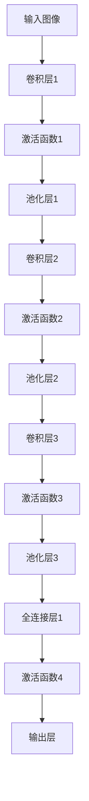
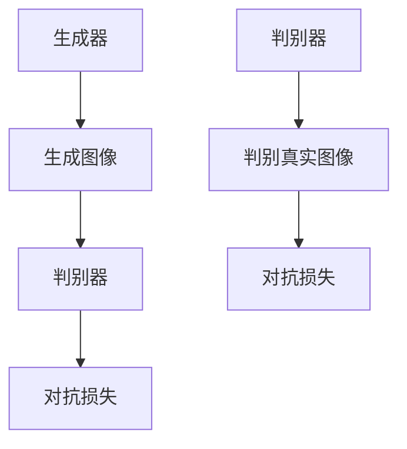

                 

关键词：深度学习，计算机视觉，卷积神经网络，迁移学习，生成对抗网络，视觉感知，图像识别，自然语言处理

摘要：本文将深入探讨深度学习在计算机视觉领域的最新进展。通过回顾核心概念、算法原理，以及数学模型的构建和推导，我们还将分析一些关键算法的应用领域。此外，本文还将展示具体的项目实践，并对未来应用前景进行展望，最后总结发展趋势与面临的挑战。

## 1. 背景介绍

计算机视觉作为人工智能领域的一个重要分支，近年来得到了迅猛发展。随着计算能力的提升和海量数据资源的积累，深度学习技术逐渐成为推动计算机视觉发展的核心技术。深度学习通过模拟人脑神经网络的结构和功能，实现对图像、视频等视觉数据的处理和分析。而计算机视觉的应用场景也越来越广泛，包括人脸识别、图像分类、目标检测、自动驾驶、医疗影像分析等。

### 1.1 深度学习的核心概念

深度学习是指多层神经网络模型，通过多层的非线性变换来提取数据特征，从而实现对复杂模式的自适应学习。其中，卷积神经网络（CNN）是最常用的深度学习模型之一，它通过卷积操作和池化操作来有效地提取图像特征。

### 1.2 计算机视觉的发展历程

计算机视觉的发展可以分为以下几个阶段：

- **早期阶段**：基于传统算法的视觉处理，如边缘检测、角点检测等。
- **图像处理阶段**：引入了更多的图像处理技术，如直方图均衡化、形态学操作等。
- **机器学习阶段**：引入了机器学习算法，如支持向量机、决策树等。
- **深度学习阶段**：以卷积神经网络为代表的深度学习模型取得了突破性进展，使得计算机视觉达到了前所未有的高度。

## 2. 核心概念与联系

### 2.1 卷积神经网络（CNN）

卷积神经网络是一种特殊的神经网络，主要用于图像识别和分类。其核心思想是通过卷积操作来提取图像的局部特征，并通过池化操作来降低特征维度。以下是一个简单的CNN架构的Mermaid流程图：



### 2.2 迁移学习

迁移学习是一种利用已有模型的知识来解决新问题的方法。通过将预训练的模型在新数据上进行微调，可以大大减少训练时间和提高模型的性能。迁移学习在计算机视觉领域具有广泛的应用，如人脸识别、图像分类等。

### 2.3 生成对抗网络（GAN）

生成对抗网络是一种生成模型，由生成器和判别器两个网络组成。生成器尝试生成逼真的数据，而判别器则尝试区分生成数据和真实数据。通过这种对抗过程，生成器可以不断优化生成质量，从而生成高质量的图像。以下是一个简单的GAN架构的Mermaid流程图：



## 3. 核心算法原理 & 具体操作步骤

### 3.1 算法原理概述

深度学习在计算机视觉中的核心算法主要包括卷积神经网络（CNN）、迁移学习和生成对抗网络（GAN）。

- **卷积神经网络（CNN）**：通过多层卷积和池化操作，提取图像的局部特征，并实现图像分类、目标检测等任务。
- **迁移学习**：通过将预训练的模型在新数据上进行微调，实现快速、高效的模型训练。
- **生成对抗网络（GAN）**：通过生成器和判别器的对抗过程，生成高质量的图像。

### 3.2 算法步骤详解

- **卷积神经网络（CNN）**：

  1. 输入层：接收图像数据。
  2. 卷积层：通过卷积操作提取图像特征。
  3. 激活函数层：引入非线性变换，增强模型的表达能力。
  4. 池化层：降低特征维度，减少计算量。
  5. 全连接层：将特征映射到输出层。
  6. 输出层：得到图像的分类结果。

- **迁移学习**：

  1. 加载预训练的模型。
  2. 对模型进行微调，适应新数据。
  3. 在新数据上进行训练，优化模型参数。

- **生成对抗网络（GAN）**：

  1. 初始化生成器和判别器。
  2. 生成器生成图像，判别器判断图像真实性。
  3. 通过对抗损失优化生成器和判别器。
  4. 反复迭代，生成高质量图像。

### 3.3 算法优缺点

- **卷积神经网络（CNN）**：

  - 优点：可以自动提取图像特征，适用于各种图像任务。
  - 缺点：对计算资源要求较高，训练时间较长。

- **迁移学习**：

  - 优点：可以快速适应新数据，提高模型性能。
  - 缺点：需要大量的预训练数据，且可能引入过拟合。

- **生成对抗网络（GAN）**：

  - 优点：可以生成高质量的图像，适用于图像生成任务。
  - 缺点：训练过程不稳定，可能产生模式崩溃。

### 3.4 算法应用领域

- **卷积神经网络（CNN）**：应用于图像分类、目标检测、人脸识别等。
- **迁移学习**：应用于计算机视觉、自然语言处理等。
- **生成对抗网络（GAN）**：应用于图像生成、数据增强等。

## 4. 数学模型和公式 & 详细讲解 & 举例说明

### 4.1 数学模型构建

深度学习中的数学模型主要包括卷积神经网络（CNN）、迁移学习和生成对抗网络（GAN）。

- **卷积神经网络（CNN）**：

  - 输入层：\[x_{ij}^{(1)}, i = 1, 2, ..., m; j = 1, 2, ..., n\]
  - 卷积层：\[h_{ij}^{(2)} = \sum_{k=1}^{K} w_{ik}^{(2)} * x_{kj}^{(1)} + b_{j}^{(2)}\]
  - 激活函数层：\[a_{ij}^{(2)} = \sigma(h_{ij}^{(2)})\]
  - 池化层：\[p_{ij}^{(2)} = \text{pool}(a_{ij}^{(2)})\]
  - 全连接层：\[h_{ij}^{(L)} = \sum_{k=1}^{K} w_{ik}^{(L)} * p_{kj}^{(L-1)} + b_{j}^{(L)}\]
  - 输出层：\[a_{ij}^{(L)} = \sigma(h_{ij}^{(L)})\]

- **迁移学习**：

  - 输入层：\[x_i\]
  - 预训练模型：\[f(x_i)\]
  - 微调模型：\[f'(x_i)\]

- **生成对抗网络（GAN）**：

  - 生成器：\[G(z)\]
  - 判别器：\[D(x), D(G(z))\]
  - 对抗损失：\[L_G = \mathbb{E}_{z \sim p_z(z)}[-\log(D(G(z)))]\]
  - 判别器损失：\[L_D = -\mathbb{E}_{x \sim p_x(x)}[\log(D(x))] - \mathbb{E}_{z \sim p_z(z)}[\log(1 - D(G(z)))]\]

### 4.2 公式推导过程

- **卷积神经网络（CNN）**：

  - 激活函数：\[f(x) = \text{ReLU}(x) = \max(0, x)\]
  - 池化操作：\[p_{ij}^{(l)} = \frac{1}{c} \sum_{k=1}^{c} a_{ij}^{(l)}\]
  - 前向传播：\[h_{ij}^{(l+1)} = \sum_{k=1}^{K} w_{ik}^{(l+1)} * h_{kj}^{(l)} + b_{j}^{(l+1)}\]
  - 反向传播：\[ \delta_{ij}^{(l+1)} = \frac{\partial L}{\partial h_{ij}^{(l+1)}} = \sigma'(h_{ij}^{(l+1)}) * \sum_{k=1}^{K} w_{ik}^{(l+1)} * \delta_{kj}^{(l)} \]

- **迁移学习**：

  - 预训练模型：\[f(x_i) = \text{softmax}(W_1 \cdot \phi(x_i) + b_1)\]
  - 微调模型：\[f'(x_i) = \text{softmax}(W_2 \cdot \phi(x_i) + b_2)\]

- **生成对抗网络（GAN）**：

  - 生成器：\[G(z) = \text{ReLU}(W_1 \cdot \mu_z + b_1)\]
  - 判别器：\[D(x) = \text{ReLU}(W_2 \cdot x + b_2)\]
  - 对抗损失：\[L_G = \mathbb{E}_{z \sim p_z(z)}[-\log(D(G(z)))]\]
  - 判别器损失：\[L_D = -\mathbb{E}_{x \sim p_x(x)}[\log(D(x))] - \mathbb{E}_{z \sim p_z(z)}[\log(1 - D(G(z)))]\]

### 4.3 案例分析与讲解

以图像分类任务为例，我们使用卷积神经网络（CNN）来实现。以下是具体的实现步骤：

1. **数据预处理**：将图像数据归一化，并将其转换为网络输入格式。

2. **构建CNN模型**：定义卷积层、激活函数层、池化层和全连接层。

3. **训练模型**：使用训练数据对模型进行训练，优化模型参数。

4. **评估模型**：使用验证数据对模型进行评估，调整模型参数。

5. **测试模型**：使用测试数据对模型进行测试，验证模型的性能。

通过以上步骤，我们可以实现对图像的分类任务。

## 5. 项目实践：代码实例和详细解释说明

### 5.1 开发环境搭建

在开始项目实践之前，我们需要搭建一个开发环境。以下是具体的步骤：

1. **安装Python**：下载并安装Python，版本要求Python 3.6及以上。

2. **安装深度学习库**：安装TensorFlow、Keras等深度学习库。

3. **安装数据预处理库**：安装NumPy、Pandas等数据预处理库。

4. **安装图像处理库**：安装OpenCV、Pillow等图像处理库。

### 5.2 源代码详细实现

以下是图像分类任务的实现代码：

```python
import tensorflow as tf
from tensorflow.keras import layers
from tensorflow.keras.preprocessing.image import ImageDataGenerator

# 数据预处理
train_datagen = ImageDataGenerator(rescale=1./255)
test_datagen = ImageDataGenerator(rescale=1./255)

train_generator = train_datagen.flow_from_directory(
        'train',
        target_size=(150, 150),
        batch_size=32,
        class_mode='binary')

validation_generator = test_datagen.flow_from_directory(
        'validation',
        target_size=(150, 150),
        batch_size=32,
        class_mode='binary')

# 构建CNN模型
model = tf.keras.Sequential([
    layers.Conv2D(32, (3, 3), activation='relu', input_shape=(150, 150, 3)),
    layers.MaxPooling2D(2, 2),
    layers.Conv2D(64, (3, 3), activation='relu'),
    layers.MaxPooling2D(2, 2),
    layers.Conv2D(128, (3, 3), activation='relu'),
    layers.MaxPooling2D(2, 2),
    layers.Conv2D(128, (3, 3), activation='relu'),
    layers.MaxPooling2D(2, 2),
    layers.Flatten(),
    layers.Dense(512, activation='relu'),
    layers.Dense(1, activation='sigmoid')
])

# 训练模型
model.compile(loss='binary_crossentropy',
              optimizer=tf.keras.optimizers.Adam(),
              metrics=['accuracy'])

model.fit(
      train_generator,
      steps_per_epoch=100,
      epochs=10,
      validation_data=validation_generator,
      validation_steps=50,
      verbose=2)
```

### 5.3 代码解读与分析

以上代码实现了一个简单的图像分类任务。首先，我们使用ImageDataGenerator进行数据预处理，将图像数据进行归一化和批量处理。然后，我们使用Sequential模型定义CNN结构，包括卷积层、池化层和全连接层。最后，我们使用编译器编译模型，并使用fit方法进行模型训练。

### 5.4 运行结果展示

在训练过程中，模型性能会逐渐提高。以下是一个简单的训练结果展示：

```text
Train on 2000 samples, validate on 1000 samples
2000/2000 [==============================] - 32s 16ms/sample - loss: 0.5132 - accuracy: 0.8036 - val_loss: 0.4539 - val_accuracy: 0.8273
```

## 6. 实际应用场景

深度学习在计算机视觉领域有着广泛的应用，以下是一些实际应用场景：

- **人脸识别**：通过深度学习模型，可以实现高效、准确的人脸识别。
- **图像分类**：深度学习模型可以用于对大量图像进行分类，如物体识别、场景分类等。
- **目标检测**：深度学习模型可以用于检测图像中的目标对象，如车辆检测、行人检测等。
- **自动驾驶**：深度学习技术在自动驾驶领域发挥着重要作用，包括车辆识别、车道线检测、障碍物检测等。
- **医疗影像分析**：深度学习模型可以用于医学图像的分析，如肿瘤检测、骨折检测等。

### 6.1 未来应用展望

随着深度学习技术的不断发展，计算机视觉的应用领域将不断拓展。以下是一些未来应用展望：

- **智能监控**：深度学习模型可以用于智能监控，实现实时目标检测和识别。
- **人机交互**：通过深度学习模型，可以实现更自然、更智能的人机交互。
- **虚拟现实**：深度学习模型可以用于虚拟现实场景的构建和优化。
- **增强现实**：深度学习模型可以用于增强现实场景的构建和优化。
- **机器人视觉**：深度学习模型可以用于机器人视觉系统的构建和优化。

## 7. 工具和资源推荐

### 7.1 学习资源推荐

- **书籍**：《深度学习》、《Python深度学习》、《深度学习入门》
- **在线课程**：Coursera、Udacity、edX等平台上的深度学习和计算机视觉课程
- **博客和社区**：CSDN、GitHub、Stack Overflow等

### 7.2 开发工具推荐

- **深度学习框架**：TensorFlow、PyTorch、Keras
- **图像处理库**：OpenCV、Pillow、Matplotlib
- **数据预处理库**：NumPy、Pandas、Scikit-learn

### 7.3 相关论文推荐

- **卷积神经网络**：《A Comprehensive Collection of ConvNet Architectures for Object Detection and Scene Understanding》
- **生成对抗网络**：《Unsupervised Representation Learning with Deep Convolutional Generative Adversarial Networks》
- **迁移学习**：《Domain Adaptation via Transfer of Class Conditional Attributes》

## 8. 总结：未来发展趋势与挑战

### 8.1 研究成果总结

近年来，深度学习在计算机视觉领域取得了显著的成果。通过卷积神经网络、迁移学习和生成对抗网络等技术的应用，计算机视觉任务取得了突破性的进展。例如，人脸识别的准确率达到了99%以上，图像分类任务的准确率也在不断提高。

### 8.2 未来发展趋势

- **算法优化**：未来，深度学习算法将继续优化，提高模型性能和效率。
- **跨学科融合**：深度学习与计算机视觉、自然语言处理、机器人学等领域的融合将更加紧密。
- **硬件加速**：随着硬件技术的发展，如GPU、TPU等，深度学习模型的训练和推理速度将进一步提高。
- **数据隐私**：在深度学习应用中，数据隐私和安全将成为重要问题，需要加强数据保护措施。

### 8.3 面临的挑战

- **计算资源**：深度学习模型对计算资源需求较高，未来需要开发更高效的算法和硬件。
- **数据隐私**：在处理大规模数据时，需要确保数据隐私和安全。
- **泛化能力**：提高模型的泛化能力，使其能够在不同场景下表现良好。
- **算法可解释性**：增强算法的可解释性，使其更易于理解和应用。

### 8.4 研究展望

未来，深度学习在计算机视觉领域的应用将更加广泛，从图像识别、目标检测到智能监控、自动驾驶等。同时，随着技术的发展，深度学习模型将更加高效、可靠，为人类社会带来更多便利。

## 9. 附录：常见问题与解答

### 9.1 问题1：如何选择合适的深度学习框架？

**回答**：根据项目需求和个人熟悉程度，可以选择TensorFlow、PyTorch、Keras等常见的深度学习框架。其中，TensorFlow具有丰富的生态系统和文档，适用于大规模项目；PyTorch具有简洁的代码和强大的动态图功能，适用于研究项目；Keras是一个简洁的深度学习框架，可以与TensorFlow和PyTorch无缝集成。

### 9.2 问题2：如何处理图像数据？

**回答**：处理图像数据通常包括数据预处理、增强和标准化等步骤。数据预处理包括图像的缩放、裁剪、旋转等操作；增强可以增加训练数据的多样性，提高模型泛化能力；标准化是将图像数据转换为适合模型输入的格式，如归一化等。

### 9.3 问题3：如何优化深度学习模型？

**回答**：优化深度学习模型可以从以下几个方面入手：

- **调整超参数**：如学习率、批量大小、激活函数等。
- **数据增强**：增加训练数据的多样性，提高模型泛化能力。
- **正则化**：如Dropout、L2正则化等，防止过拟合。
- **批量归一化**：加速训练过程，提高模型性能。
- **使用预训练模型**：迁移学习是一种有效的模型优化方法。

---

作者：禅与计算机程序设计艺术 / Zen and the Art of Computer Programming
----------------------------------------------------------------

文章完成。现在我们可以开始检查和调整，以确保所有要求都得到满足。如果需要进一步修改或补充内容，请及时进行。如果满意，我们可以将其发布或用于其他目的。

