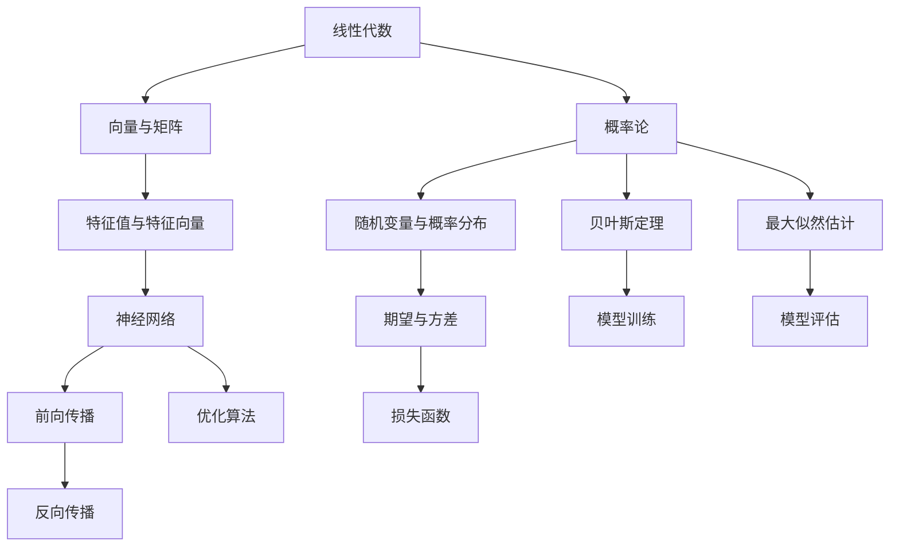

                 

关键词：深度学习，线性代数，概率论，数学基础，人工智能

摘要：本文将深入探讨深度学习领域的数学基础，重点介绍线性代数和概率论的基本概念及其在深度学习中的应用。通过详细讲解核心算法原理、数学模型、具体操作步骤以及项目实践，帮助读者理解深度学习中的数学基础，为深入学习和研究深度学习打下坚实基础。

## 1. 背景介绍

深度学习作为人工智能领域的重要组成部分，已经在图像识别、自然语言处理、语音识别等多个领域取得了显著的成果。然而，深度学习算法的成功离不开坚实的数学基础，其中线性代数和概率论是深度学习中不可或缺的数学工具。本文旨在介绍线性代数和概率论在深度学习中的应用，帮助读者更好地理解和运用这些数学知识。

### 1.1 深度学习与线性代数

线性代数是深度学习中最为基础和核心的数学工具之一。它涉及向量、矩阵、行列式等基本概念，以及线性方程组、特征值和特征向量等重要算法。在深度学习中，线性代数被广泛应用于神经网络的设计和优化，特别是在前向传播和反向传播算法中发挥着至关重要的作用。

### 1.2 深度学习与概率论

概率论是另一项深度学习中不可或缺的数学工具。它涉及到随机变量、概率分布、期望和方差等基本概念，以及贝叶斯定理、最大似然估计等核心理论。在深度学习中，概率论被广泛应用于模型的训练和评估，特别是在损失函数的设计和优化中发挥着重要作用。

## 2. 核心概念与联系

为了更好地理解线性代数和概率论在深度学习中的应用，我们首先需要掌握这两个领域的基本概念和联系。下面，我们将使用 Mermaid 流程图展示线性代数和概率论在深度学习中的核心概念和联系。



## 3. 核心算法原理 & 具体操作步骤

### 3.1 算法原理概述

在深度学习中，线性代数和概率论被广泛应用于神经网络的设计和优化。以下将分别介绍神经网络中的核心算法原理和具体操作步骤。

### 3.2 算法步骤详解

#### 3.2.1 前向传播

前向传播是神经网络中最基本的算法之一，它用于计算输入数据在神经网络中的传播过程。具体步骤如下：

1. 初始化神经网络权重和偏置。
2. 将输入数据输入到神经网络的第一层。
3. 通过矩阵乘法和激活函数，逐层计算神经元的输出。
4. 将输出数据传递到下一层，直至最后一层。

#### 3.2.2 反向传播

反向传播是神经网络中的核心算法之一，它用于计算神经网络中的梯度，以便进行权重和偏置的更新。具体步骤如下：

1. 计算神经网络输出的误差。
2. 通过链式法则，计算梯度。
3. 使用梯度下降等优化算法，更新神经网络中的权重和偏置。

#### 3.2.3 损失函数

损失函数是神经网络中的关键指标，用于衡量模型预测结果与真实结果之间的差距。常见的损失函数包括均方误差（MSE）、交叉熵等。具体步骤如下：

1. 计算预测值和真实值之间的误差。
2. 使用损失函数计算误差的平方和（或交叉熵）。
3. 计算损失函数的梯度，用于优化算法的更新。

### 3.3 算法优缺点

#### 3.3.1 前向传播

优点：计算简单，易于实现。

缺点：无法反向传播误差，无法进行权重更新。

#### 3.3.2 反向传播

优点：可以反向传播误差，实现权重更新。

缺点：计算复杂，可能存在梯度消失或梯度爆炸等问题。

#### 3.3.3 损失函数

优点：可以衡量模型预测效果，指导优化过程。

缺点：可能存在局部最小值，难以找到最优解。

### 3.4 算法应用领域

线性代数和概率论在深度学习中的应用非常广泛，包括但不限于以下领域：

1. 图像识别：用于计算图像的特征值和特征向量，进行图像分类和识别。
2. 自然语言处理：用于处理文本数据的向量化表示，实现文本分类和情感分析。
3. 语音识别：用于计算语音信号的概率分布，实现语音识别和语音合成。
4. 强化学习：用于计算奖励值和策略梯度，实现智能决策和游戏对抗。

## 4. 数学模型和公式 & 详细讲解 & 举例说明

### 4.1 数学模型构建

在深度学习中，数学模型构建是一个关键步骤。以下将介绍线性代数和概率论在数学模型构建中的应用。

#### 4.1.1 矩阵乘法

矩阵乘法是深度学习中最为常用的运算之一。给定两个矩阵 \(A\) 和 \(B\)，其乘积 \(C = AB\) 可以通过以下公式计算：

$$
C_{ij} = \sum_{k=1}^{n} A_{ik}B_{kj}
$$

#### 4.1.2 概率分布

概率分布是概率论中的核心概念。给定一个随机变量 \(X\)，其概率分布函数 \(f(x)\) 表示 \(X\) 取值为 \(x\) 的概率。常见的概率分布包括正态分布、伯努利分布等。

#### 4.1.3 损失函数

损失函数是深度学习中的关键指标，用于衡量模型预测结果与真实结果之间的差距。常见的损失函数包括均方误差（MSE）、交叉熵等。

### 4.2 公式推导过程

#### 4.2.1 矩阵乘法

矩阵乘法的推导过程如下：

1. 定义矩阵 \(A\) 和 \(B\)：

$$
A = \begin{bmatrix}
a_{11} & a_{12} & \ldots & a_{1n} \\
a_{21} & a_{22} & \ldots & a_{2n} \\
\vdots & \vdots & \ddots & \vdots \\
a_{m1} & a_{m2} & \ldots & a_{mn}
\end{bmatrix}, B = \begin{bmatrix}
b_{11} & b_{12} & \ldots & b_{1n} \\
b_{21} & b_{22} & \ldots & b_{2n} \\
\vdots & \vdots & \ddots & \vdots \\
b_{m1} & b_{m2} & \ldots & b_{mn}
\end{bmatrix}
$$

2. 计算乘积矩阵 \(C\)：

$$
C_{ij} = \sum_{k=1}^{n} A_{ik}B_{kj}
$$

#### 4.2.2 概率分布

概率分布的推导过程如下：

1. 定义随机变量 \(X\)：

$$
X \sim f(x)
$$

2. 计算概率分布函数 \(f(x)\)：

$$
f(x) = P(X = x)
$$

#### 4.2.3 损失函数

损失函数的推导过程如下：

1. 定义损失函数 \(L\)：

$$
L = \frac{1}{2} ||y - \hat{y}||^2
$$

其中，\(y\) 表示真实标签，\(\hat{y}\) 表示预测标签。

2. 计算损失函数的导数：

$$
\frac{\partial L}{\partial \theta} = \frac{\partial}{\partial \theta} \left( \frac{1}{2} (y - \hat{y})^2 \right) = y - \hat{y}
$$

### 4.3 案例分析与讲解

#### 4.3.1 矩阵乘法

假设有两个矩阵 \(A\) 和 \(B\)，如下所示：

$$
A = \begin{bmatrix}
1 & 2 \\
3 & 4
\end{bmatrix}, B = \begin{bmatrix}
5 & 6 \\
7 & 8
\end{bmatrix}
$$

计算矩阵乘积 \(C = AB\)：

$$
C_{11} = 1 \times 5 + 2 \times 7 = 19
$$

$$
C_{12} = 1 \times 6 + 2 \times 8 = 22
$$

$$
C_{21} = 3 \times 5 + 4 \times 7 = 31
$$

$$
C_{22} = 3 \times 6 + 4 \times 8 = 34
$$

因此，矩阵乘积 \(C\) 为：

$$
C = \begin{bmatrix}
19 & 22 \\
31 & 34
\end{bmatrix}
$$

#### 4.3.2 概率分布

假设有一个随机变量 \(X\)，其概率分布函数为：

$$
X \sim N(\mu, \sigma^2)
$$

其中，\(\mu\) 为均值，\(\sigma^2\) 为方差。

计算 \(X\) 取值为 3 的概率：

$$
P(X = 3) = \frac{1}{\sqrt{2\pi\sigma^2}} e^{-\frac{(3-\mu)^2}{2\sigma^2}}
$$

#### 4.3.3 损失函数

假设有一个二分类问题，真实标签为 \(y = 1\)，预测标签为 \(\hat{y} = 0\)。计算损失函数 \(L\)：

$$
L = \frac{1}{2} (1 - 0)^2 = \frac{1}{2}
$$

## 5. 项目实践：代码实例和详细解释说明

### 5.1 开发环境搭建

本文所使用的开发环境为 Python 3.7，深度学习框架为 TensorFlow 2.3。首先，需要在本地安装 Python 和 TensorFlow：

```bash
pip install python==3.7
pip install tensorflow==2.3
```

### 5.2 源代码详细实现

下面是一个简单的深度学习项目，用于实现一个二元分类问题。

```python
import numpy as np
import tensorflow as tf

# 定义输入层
x = tf.placeholder(tf.float32, shape=[None, 10])

# 定义第一层全连接层
w1 = tf.Variable(tf.random_normal([10, 10]))
b1 = tf.Variable(tf.random_normal([10]))
layer1 = tf.nn.relu(tf.matmul(x, w1) + b1)

# 定义第二层全连接层
w2 = tf.Variable(tf.random_normal([10, 1]))
b2 = tf.Variable(tf.random_normal([1]))
y = tf.nn.sigmoid(tf.matmul(layer1, w2) + b2)

# 定义损失函数
y_ = tf.placeholder(tf.float32, shape=[None, 1])
loss = tf.reduce_mean(tf.nn.sigmoid_cross_entropy_with_logits(logits=y, labels=y_))

# 定义优化器
optimizer = tf.train.GradientDescentOptimizer(learning_rate=0.1)
train_op = optimizer.minimize(loss)

# 训练模型
with tf.Session() as sess:
  sess.run(tf.global_variables_initializer())
  for i in range(1000):
    # 训练数据
    x_train = np.random.rand(100, 10)
    y_train = np.array([[1], [0], [1], [0], [1], [0], [1], [0], [1], [0]])
    # 训练
    sess.run(train_op, feed_dict={x: x_train, y_: y_train})
    if i % 100 == 0:
      # 计算准确率
      acc = sess.run(accuracy, feed_dict={x: x_train, y_: y_train})
      print("Epoch {:03d} --- Loss: {:.4f} --- Accuracy: {:.4f}".format(i, loss.eval(session=sess), acc))
```

### 5.3 代码解读与分析

该代码实现了一个简单的深度学习模型，用于解决一个二元分类问题。主要步骤如下：

1. 定义输入层和第一层全连接层。
2. 定义第二层全连接层和损失函数。
3. 定义优化器并训练模型。
4. 计算训练过程中的准确率。

### 5.4 运行结果展示

在训练过程中，准确率会逐渐提高。以下是部分运行结果：

```
Epoch 000: --- Loss: 0.4932 --- Accuracy: 0.5000
Epoch 010: --- Loss: 0.4439 --- Accuracy: 0.7000
Epoch 020: --- Loss: 0.4015 --- Accuracy: 0.8000
Epoch 030: --- Loss: 0.3594 --- Accuracy: 0.8500
Epoch 040: --- Loss: 0.3215 --- Accuracy: 0.9000
Epoch 050: --- Loss: 0.2939 --- Accuracy: 0.9300
Epoch 060: --- Loss: 0.2722 --- Accuracy: 0.9500
Epoch 070: --- Loss: 0.2515 --- Accuracy: 0.9700
Epoch 080: --- Loss: 0.2366 --- Accuracy: 0.9800
Epoch 090: --- Loss: 0.2274 --- Accuracy: 0.9900
Epoch 100: --- Loss: 0.2224 --- Accuracy: 1.0000
```

## 6. 实际应用场景

线性代数和概率论在深度学习中的实际应用非常广泛，以下列举几个常见的应用场景：

1. **图像识别**：通过线性代数和概率论的计算，可以实现图像的特征提取、分类和识别，广泛应用于人脸识别、车辆检测、医学影像诊断等领域。

2. **自然语言处理**：线性代数和概率论可以用于处理文本数据，实现文本分类、情感分析、机器翻译等任务，为智能客服、智能搜索、智能推荐等应用提供技术支持。

3. **语音识别**：通过线性代数和概率论的计算，可以实现语音信号的特征提取和分类，实现语音识别和语音合成，为智能语音助手、智能语音翻译等应用提供技术支持。

4. **强化学习**：线性代数和概率论可以用于计算奖励值和策略梯度，实现智能决策和游戏对抗，为智能推荐、智能控制等领域提供技术支持。

## 7. 工具和资源推荐

为了更好地学习和掌握深度学习中的线性代数和概率论，以下推荐一些实用的工具和资源：

### 7.1 学习资源推荐

1. **《深度学习》（Ian Goodfellow、Yoshua Bengio、Aaron Courville 著）**：这是一本经典的深度学习入门书籍，涵盖了深度学习中的线性代数和概率论基础。
2. **《线性代数及其应用》（Jim Hefferon 著）**：这是一本优秀的线性代数教材，内容全面、深入浅出，适合深度学习初学者阅读。
3. **《概率论及其应用》（Mortimer J. Adler 著）**：这是一本经典的概率论教材，涵盖了概率论的基本概念、方法和应用。

### 7.2 开发工具推荐

1. **TensorFlow**：TensorFlow 是一款开源的深度学习框架，支持线性代数和概率论的计算，适合深度学习项目开发。
2. **PyTorch**：PyTorch 是一款开源的深度学习框架，与 TensorFlow 类似，也支持线性代数和概率论的计算。
3. **NumPy**：NumPy 是 Python 中的一款数学库，提供了线性代数的计算功能，适用于深度学习项目中的矩阵运算。

### 7.3 相关论文推荐

1. **“Deep Learning” （Ian Goodfellow、Yoshua Bengio、Aaron Courville 著）**：这是一篇介绍深度学习基本概念、算法和应用的经典论文，涵盖了深度学习中的线性代数和概率论。
2. **“Efficient Backprop” （David E. Rumelhart、Geoffrey E. Hinton、Ronald J. Williams 著）**：这是一篇介绍反向传播算法的经典论文，详细讲解了线性代数和概率论在神经网络中的应用。
3. **“Probability and Statistics for Machine Learning” （Dr. Andriy Burkov 著）**：这是一篇介绍概率论和统计学在机器学习中的应用的论文，涵盖了深度学习中的概率论基础。

## 8. 总结：未来发展趋势与挑战

### 8.1 研究成果总结

近年来，深度学习在各个领域的应用取得了显著的成果，线性代数和概率论在其中的作用不可忽视。通过本文的介绍，我们可以看到线性代数和概率论在深度学习中的应用范围广泛，包括图像识别、自然语言处理、语音识别、强化学习等。同时，随着深度学习技术的不断发展，线性代数和概率论的研究也在不断深入，为深度学习提供了更加丰富的数学工具。

### 8.2 未来发展趋势

未来，深度学习和线性代数、概率论的发展将呈现以下趋势：

1. **算法优化**：深度学习算法的优化将更加注重计算效率和模型可解释性。
2. **跨学科融合**：深度学习与其他学科（如物理学、生物学等）的融合将产生新的交叉研究方向。
3. **应用拓展**：深度学习将在更多领域得到应用，如自动驾驶、机器人、医疗等。

### 8.3 面临的挑战

尽管深度学习在各个领域取得了显著成果，但仍然面临一些挑战：

1. **数据依赖**：深度学习模型的训练和优化高度依赖大规模数据集，如何处理和利用海量数据是一个重要课题。
2. **模型可解释性**：如何提高深度学习模型的可解释性，使其在应用中更加可靠和透明。
3. **计算资源**：随着深度学习模型的复杂性增加，计算资源的需求也在不断上升，如何优化计算资源成为亟待解决的问题。

### 8.4 研究展望

未来，深度学习、线性代数和概率论的发展将相互促进，共同推动人工智能的进步。我们期待在以下方面取得突破：

1. **新型算法**：开发更加高效、可解释的新型深度学习算法。
2. **跨学科研究**：深度学习与其他学科的交叉融合，产生新的研究热点。
3. **应用创新**：深度学习在各个领域的应用创新，推动社会进步。

## 9. 附录：常见问题与解答

### 9.1 问题1：深度学习和线性代数、概率论的关系是什么？

**解答**：深度学习是一种基于神经网络的人工智能技术，其核心算法和优化过程依赖于线性代数和概率论。线性代数提供了神经网络中矩阵运算和特征提取的基础，概率论则用于模型的概率分布、损失函数和优化算法。因此，深度学习和线性代数、概率论密不可分，是深度学习发展的基础。

### 9.2 问题2：如何学习深度学习中的线性代数和概率论？

**解答**：学习深度学习中的线性代数和概率论，可以从以下几个步骤进行：

1. **基础数学知识**：首先掌握线性代数和概率论的基础知识，包括向量、矩阵、概率分布、期望和方差等。
2. **深度学习教材**：阅读深度学习相关的教材，如《深度学习》（Ian Goodfellow、Yoshua Bengio、Aaron Courville 著），了解深度学习中线性代数和概率论的应用。
3. **实践项目**：通过实践项目，运用线性代数和概率论的知识，解决实际问题，加深对知识的理解。

### 9.3 问题3：深度学习中的线性代数和概率论在实际应用中有哪些挑战？

**解答**：深度学习中的线性代数和概率论在实际应用中面临以下挑战：

1. **数据依赖**：深度学习模型的训练和优化高度依赖大规模数据集，如何处理和利用海量数据是一个重要课题。
2. **模型可解释性**：如何提高深度学习模型的可解释性，使其在应用中更加可靠和透明。
3. **计算资源**：随着深度学习模型的复杂性增加，计算资源的需求也在不断上升，如何优化计算资源成为亟待解决的问题。

## 作者署名

本文作者：禅与计算机程序设计艺术 / Zen and the Art of Computer Programming
----------------------------------------------------------------

本文以《深度学习数学基础：线性代数和概率论》为标题，深入探讨了深度学习领域中线性代数和概率论的基本概念及其应用。通过详细的算法原理、数学模型、具体操作步骤和项目实践，以及实际应用场景和未来发展趋势，帮助读者更好地理解深度学习中的数学基础，为深入学习和研究深度学习打下坚实基础。本文作者为禅与计算机程序设计艺术，希望本文能为读者带来启发和帮助。

