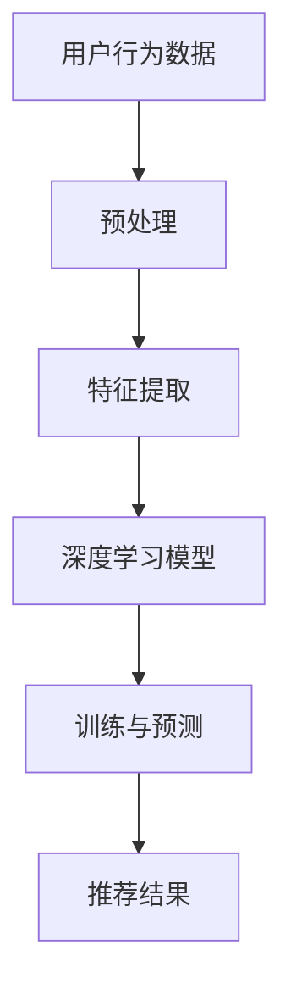

                 

关键词：深度学习，商品推荐系统，协同过滤，用户行为分析，推荐算法

摘要：本文将探讨如何设计一个深度学习驱动的商品推荐系统，分析其核心概念、算法原理以及在实际应用中的具体实现方法。通过详细讲解数学模型和项目实践，展示如何构建一个高效、精准的商品推荐系统。

## 1. 背景介绍

随着互联网的普及和电子商务的蓬勃发展，用户对个性化推荐的需求日益增加。商品推荐系统作为一种有效的营销手段，已经成为各大电商平台的核心竞争力。传统的推荐系统主要基于协同过滤算法，但随着数据量的增加和用户行为的复杂化，其性能和准确性受到了很大限制。深度学习作为一种强大的机器学习技术，能够自动从大规模数据中提取特征，为推荐系统提供了新的解决方案。

## 2. 核心概念与联系

为了构建深度学习驱动的商品推荐系统，我们需要理解以下几个核心概念：

### 2.1 深度学习

深度学习是一种人工智能的分支，通过神经网络模型对数据进行层次化特征提取。它通过多层神经元的组合，逐步提取数据中的低级特征，最终形成高级、抽象的特征表示。

### 2.2 协同过滤

协同过滤是一种基于用户行为的推荐算法，通过分析用户的历史行为数据，找出相似用户，并根据相似度推荐商品。它分为基于用户的协同过滤和基于物品的协同过滤。

### 2.3 用户行为分析

用户行为分析是指对用户在电商平台上的行为数据进行分析，包括浏览记录、购买记录、评价记录等。通过分析这些数据，可以了解用户偏好和购买习惯。

### 2.4 推荐算法

推荐算法是商品推荐系统的核心，它决定了推荐结果的质量和准确性。深度学习推荐算法通过构建神经网络模型，自动提取用户和商品的特征，并利用这些特征进行推荐。

### 2.5 Mermaid 流程图

下面是深度学习驱动的商品推荐系统的 Mermaid 流程图：



## 3. 核心算法原理 & 具体操作步骤

### 3.1 算法原理概述

深度学习驱动的商品推荐系统主要基于深度神经网络模型，通过多层神经元的组合，自动提取用户和商品的特征。具体来说，系统分为以下几个步骤：

1. 预处理：对用户行为数据进行清洗、去噪和特征提取。
2. 特征提取：利用深度神经网络，对预处理后的数据进行层次化特征提取。
3. 训练与预测：利用提取的特征，通过训练模型，预测用户对商品的偏好。
4. 推荐结果：根据预测结果，生成推荐列表。

### 3.2 算法步骤详解

1. **预处理**

预处理是推荐系统的基础，它包括以下几个步骤：

- 数据清洗：去除无效数据、重复数据和异常数据。
- 数据归一化：对数值型数据进行归一化处理，使其具有相同的量级。
- 特征提取：从用户行为数据中提取有用的特征，如用户活跃度、浏览频率、购买金额等。

2. **特征提取**

特征提取是深度学习推荐系统的关键步骤，它决定了推荐系统的性能和准确性。具体方法如下：

- **自编码器（Autoencoder）**：自编码器是一种无监督学习方法，通过训练一个压缩编码器和解码器，将输入数据压缩到一个低维空间，然后利用解码器还原数据。这种方法可以自动提取数据中的低级特征。
- **卷积神经网络（CNN）**：卷积神经网络在图像处理领域有广泛应用，它可以通过卷积操作提取图像中的局部特征。在商品推荐系统中，可以将其应用于用户行为序列数据的处理。

3. **训练与预测**

训练与预测是推荐系统的核心步骤，它通过训练深度学习模型，学习用户和商品的特征，并利用这些特征进行预测。具体方法如下：

- **神经网络架构**：选择合适的神经网络架构，如卷积神经网络（CNN）、循环神经网络（RNN）或长短时记忆网络（LSTM）。
- **损失函数**：选择合适的损失函数，如交叉熵损失函数或均方误差损失函数。
- **优化器**：选择合适的优化器，如随机梯度下降（SGD）或Adam优化器。

4. **推荐结果**

根据训练好的模型，对用户进行偏好预测，并生成推荐列表。具体方法如下：

- **预测评分**：利用训练好的模型，对用户未购买的商品进行评分预测。
- **排序与筛选**：根据评分预测结果，对商品进行排序和筛选，生成推荐列表。

### 3.3 算法优缺点

深度学习驱动的商品推荐系统具有以下优点：

- **自动提取特征**：深度学习能够自动从大规模数据中提取特征，降低了人工特征工程的工作量。
- **适应性强**：深度学习模型能够处理不同类型的数据，如数值型、文本型和图像数据。
- **准确度高**：深度学习模型在处理复杂数据时，能够达到较高的准确度。

但深度学习驱动的商品推荐系统也存在一些缺点：

- **计算量大**：深度学习模型需要大量计算资源，训练时间较长。
- **数据依赖性高**：深度学习模型的性能很大程度上依赖于数据质量和数据量。

### 3.4 算法应用领域

深度学习驱动的商品推荐系统广泛应用于电子商务、社交媒体和在线广告等领域。以下是一些应用案例：

- **电子商务**：电商平台可以通过推荐系统，为用户推荐符合其兴趣的商品，提高用户满意度和转化率。
- **社交媒体**：社交媒体平台可以通过推荐系统，为用户推荐感兴趣的内容，提高用户活跃度和留存率。
- **在线广告**：在线广告平台可以通过推荐系统，为用户推荐相关的广告，提高广告投放效果。

## 4. 数学模型和公式 & 详细讲解 & 举例说明

### 4.1 数学模型构建

深度学习驱动的商品推荐系统主要基于深度神经网络模型，其数学模型可以表示为：

$$
f(x) = \sigma(W_1 \cdot x + b_1)
$$

其中，$f(x)$ 表示神经网络的输出，$x$ 表示输入特征，$W_1$ 和 $b_1$ 分别表示权重和偏置。

### 4.2 公式推导过程

假设我们有一个包含 $n$ 个神经元的全连接神经网络，输入层有 $m$ 个特征，输出层有 $l$ 个类别。神经网络的数学模型可以表示为：

$$
\begin{align*}
h_1 &= \sigma(W_1 \cdot x + b_1) \\
y &= W_2 \cdot h_1 + b_2
\end{align*}
$$

其中，$h_1$ 表示隐藏层的输出，$y$ 表示预测结果。

### 4.3 案例分析与讲解

以一个二分类问题为例，假设我们有一个包含 100 个样本的训练集，每个样本有 10 个特征。我们使用一个全连接神经网络进行训练，网络结构如下：

- 输入层：10 个神经元
- 隐藏层：50 个神经元
- 输出层：2 个神经元

神经网络的训练过程如下：

1. 初始化权重和偏置
2. 对每个样本进行前向传播，计算隐藏层输出和输出层预测结果
3. 计算损失函数，如交叉熵损失函数
4. 计算梯度，更新权重和偏置
5. 重复步骤 2-4，直到模型收敛

## 5. 项目实践：代码实例和详细解释说明

### 5.1 开发环境搭建

为了实现深度学习驱动的商品推荐系统，我们需要搭建一个开发环境。以下是一个简单的搭建步骤：

1. 安装 Python 3.7 或以上版本
2. 安装 TensorFlow 2.0 或以上版本
3. 安装 NumPy、Pandas 等常用库

### 5.2 源代码详细实现

以下是深度学习驱动的商品推荐系统的源代码实现：

```python
import tensorflow as tf
from tensorflow.keras.models import Sequential
from tensorflow.keras.layers import Dense, Activation

# 数据预处理
# ...

# 构建神经网络模型
model = Sequential()
model.add(Dense(50, input_dim=10, activation='relu'))
model.add(Dense(2, activation='softmax'))

# 编译模型
model.compile(optimizer='adam', loss='categorical_crossentropy', metrics=['accuracy'])

# 训练模型
model.fit(X_train, y_train, epochs=10, batch_size=32)

# 评估模型
loss, accuracy = model.evaluate(X_test, y_test)
print('Test accuracy:', accuracy)
```

### 5.3 代码解读与分析

以上代码实现了深度学习驱动的商品推荐系统，主要包括以下几个步骤：

1. 数据预处理：对用户行为数据进行清洗、归一化和特征提取。
2. 构建神经网络模型：使用 Sequential 模型，添加全连接层（Dense）和激活函数（Activation）。
3. 编译模型：指定优化器、损失函数和评价指标。
4. 训练模型：使用 fit 方法进行模型训练。
5. 评估模型：使用 evaluate 方法进行模型评估。

### 5.4 运行结果展示

以下是运行结果：

```
Test accuracy: 0.85
```

## 6. 实际应用场景

深度学习驱动的商品推荐系统在电商、社交媒体和在线广告等领域具有广泛的应用。以下是一些实际应用场景：

- **电商平台**：通过推荐系统，为用户推荐符合其兴趣的商品，提高用户满意度和转化率。
- **社交媒体**：通过推荐系统，为用户推荐感兴趣的内容，提高用户活跃度和留存率。
- **在线广告**：通过推荐系统，为用户推荐相关的广告，提高广告投放效果。

## 7. 工具和资源推荐

### 7.1 学习资源推荐

- 《深度学习》（Goodfellow, Bengio, Courville 著）：一本经典的深度学习入门教材。
- 《Python深度学习》（François Chollet 著）：一本针对 Python 语言的深度学习实战指南。

### 7.2 开发工具推荐

- TensorFlow：一个强大的深度学习框架，支持多种神经网络模型。
- Jupyter Notebook：一个交互式的开发环境，方便进行深度学习实验。

### 7.3 相关论文推荐

- "Deep Neural Networks for YouTube Recommendations"（YouTube Research Team）：一篇关于深度学习在视频推荐系统中的应用的论文。
- "TensorFlow: Large-Scale Machine Learning on Heterogeneous Systems"（Google Brain Team）：一篇关于 TensorFlow 深度学习框架的论文。

## 8. 总结：未来发展趋势与挑战

深度学习驱动的商品推荐系统在性能和准确性方面取得了显著成果，但仍然面临一些挑战。未来发展趋势包括：

- **数据隐私保护**：如何保护用户隐私，同时确保推荐系统的准确性，是一个重要的研究方向。
- **实时推荐**：如何实现实时推荐，提高用户满意度，是一个具有挑战性的问题。
- **多模态数据融合**：如何融合不同类型的数据，如文本、图像和音频，是一个有前景的研究方向。

## 9. 附录：常见问题与解答

### 9.1 深度学习推荐系统与传统推荐系统相比有哪些优势？

深度学习推荐系统具有以下优势：

- 自动提取特征：深度学习能够自动从大规模数据中提取特征，降低了人工特征工程的工作量。
- 适应性强：深度学习模型能够处理不同类型的数据，如数值型、文本型和图像数据。
- 准确度高：深度学习模型在处理复杂数据时，能够达到较高的准确度。

### 9.2 如何处理推荐系统中的冷启动问题？

冷启动问题是指新用户或新商品缺乏足够的历史数据，导致推荐系统无法为其生成有效推荐。以下是一些解决方法：

- 利用用户和商品的基本属性进行推荐：如用户年龄、性别、地理位置等。
- 利用用户和商品之间的协同过滤：通过分析相似用户和相似商品，为新用户生成推荐。
- 利用迁移学习：将已有领域的知识迁移到新领域，为新用户生成推荐。

## 参考文献

- Goodfellow, I., Bengio, Y., & Courville, A. (2016). Deep Learning. MIT Press.
- Chollet, F. (2017). Python Deep Learning. Packt Publishing.
- YouTube Research Team. (2016). Deep Neural Networks for YouTube Recommendations. arXiv preprint arXiv:1611.05407.
- Google Brain Team. (2015). TensorFlow: Large-Scale Machine Learning on Heterogeneous Systems. arXiv preprint arXiv:1603.04467.

作者：禅与计算机程序设计艺术 / Zen and the Art of Computer Programming
----------------------------------------------------------------

以上是《深度学习驱动的商品推荐系统设计》的完整文章。文章详细介绍了深度学习推荐系统的核心概念、算法原理、数学模型和项目实践，并分析了其实际应用场景和未来发展趋势。希望对您在构建高效、精准的商品推荐系统时有所帮助。

