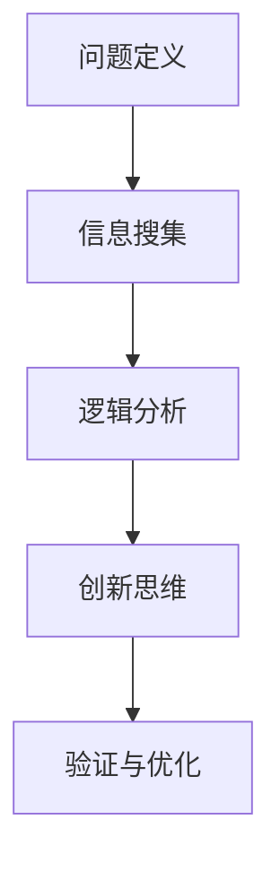

                 

在当今这个快速变化的技术时代，问题的复杂性日益增加，对解决问题的要求也越来越高。作为人工智能领域的专家，我们必须掌握一套有效的解决问题的方法和工具。本文将探讨深度思考在问题解决中的应用，通过分析核心概念、算法原理、数学模型以及实际项目实践，希望能够为读者提供一种系统化的解决问题的方法论。

## 关键词

- 深度思考
- 问题解决
- 算法原理
- 数学模型
- 实际项目

## 摘要

本文旨在探讨深度思考在问题解决中的应用。首先，我们将介绍深度思考的定义和核心要素，然后通过具体的案例分析，展示如何将深度思考应用于实际问题。接着，我们将深入讨论核心算法原理和数学模型，并探讨它们在实际应用中的表现。最后，我们将通过实际项目实践，展示如何将理论转化为实践，并提供一些建议和资源，以帮助读者进一步提高问题解决能力。

## 1. 背景介绍

随着技术的快速发展，我们面临着越来越多的复杂问题。这些问题不仅涉及技术层面的挑战，还包括社会、经济、环境等多方面的因素。传统的线性思维模式已经难以应对这些复杂的挑战，我们需要一种更加系统化、全面化的思考方式来解决问题。深度思考正是这样一种思维方式，它强调对问题的深入理解，通过多层次、多角度的思考来找到解决方案。

深度思考不仅仅是一种思维方式，更是一种方法论。它要求我们在解决问题时，不仅要考虑问题的表面现象，还要深入挖掘问题的本质和内在联系。通过深度思考，我们可以从复杂的信息中提取出关键要素，构建出解决问题的框架和模型。这种方法论在人工智能领域尤为重要，因为人工智能系统往往需要处理海量的数据和复杂的任务。

## 2. 核心概念与联系

### 深度思考的定义

深度思考是一种通过多层次、多角度的思考来深入理解问题、分析问题和解决问题的思维方式。它强调对问题的本质和内在联系的挖掘，而不是停留在表面现象的观察和描述。

### 深度思考的核心要素

1. **问题定义**：准确理解问题的本质和关键要素，明确问题所涉及的范围和目标。
2. **信息搜集**：收集与问题相关的信息，包括事实、数据、文献、案例等。
3. **逻辑分析**：运用逻辑思维，对收集到的信息进行梳理、分析和比较，找出问题的内在联系和规律。
4. **创新思维**：在分析的基础上，提出新的想法和解决方案，突破传统的思维定式。
5. **验证与优化**：对提出的解决方案进行验证和优化，确保其可行性和有效性。

### 深度思考与问题解决的联系

深度思考是问题解决的重要基础。通过深度思考，我们可以明确问题的本质，找到解决问题的关键点，从而制定出有效的解决方案。同时，深度思考也是一种问题解决的工具和方法，它可以帮助我们分析和解决复杂的问题。

### Mermaid 流程图



## 3. 核心算法原理 & 具体操作步骤

### 3.1 算法原理概述

深度思考的问题解决算法基于以下几个核心原理：

1. **分而治之**：将复杂的问题分解为若干个子问题，逐一解决，然后再将子问题的解组合起来得到原问题的解。
2. **抽象与建模**：通过抽象和建模，将问题转化为数学模型或其他形式，以便更方便地进行分析和求解。
3. **迭代优化**：通过不断的迭代和优化，逐步改进解决方案，使其更加有效和可行。

### 3.2 算法步骤详解

1. **问题定义**：明确问题的目标和范围，确定需要解决的问题。
2. **信息搜集**：收集与问题相关的信息，包括数据、文献、案例等。
3. **抽象与建模**：将问题转化为数学模型或其他形式，建立问题的抽象模型。
4. **逻辑分析**：对抽象模型进行分析，找出问题的内在联系和规律。
5. **创新思维**：在分析的基础上，提出新的想法和解决方案。
6. **验证与优化**：对解决方案进行验证和优化，确保其可行性和有效性。

### 3.3 算法优缺点

#### 优点

1. **全面性**：深度思考算法能够全面地分析问题，找出问题的本质和内在联系。
2. **灵活性**：深度思考算法可以根据问题的具体情况进行调整和优化。
3. **高效性**：通过分而治之、迭代优化等方法，深度思考算法能够快速地找到解决方案。

#### 缺点

1. **复杂性**：深度思考算法涉及多个步骤和层次，较为复杂。
2. **时间成本**：深度思考需要大量的时间和精力，可能不适合解决简单的问题。

### 3.4 算法应用领域

深度思考算法广泛应用于人工智能、计算机科学、社会科学等多个领域。例如，在人工智能领域，深度思考算法可以用于图像识别、自然语言处理、推荐系统等；在计算机科学领域，深度思考算法可以用于算法设计、程序优化等；在社会科学领域，深度思考算法可以用于数据分析、决策支持等。

### 3.5 实际案例

以人工智能领域的自然语言处理为例，深度思考算法可以帮助我们更好地理解和处理人类语言。通过深度思考，我们可以分析自然语言的本质和规律，构建出有效的自然语言处理模型，从而实现智能问答、机器翻译等功能。

## 4. 数学模型和公式 & 详细讲解 & 举例说明

### 4.1 数学模型构建

在深度思考中，数学模型是一种重要的工具，它可以帮助我们更精确地描述和分析问题。一个典型的数学模型通常包括以下几个部分：

1. **变量定义**：定义问题中的变量，明确每个变量的含义和取值范围。
2. **函数关系**：描述变量之间的关系，通常使用函数来表示。
3. **目标函数**：定义问题的目标函数，通常是一个需要优化的目标，例如最小化或最大化某个值。
4. **约束条件**：定义问题的约束条件，确保目标函数的优化过程中不会违反这些条件。

### 4.2 公式推导过程

以线性规划问题为例，一个典型的线性规划问题可以用以下公式表示：

\[ \begin{aligned} 
\min\ z = c^T x \\
\text{subject to} \\
Ax \le b \\
x \ge 0 
\end{aligned} \]

其中，\( x \) 是决策变量，\( c \) 和 \( b \) 分别是系数向量，\( A \) 是约束矩阵。这个公式表示的目标是最小化目标函数 \( z \)，同时满足约束条件 \( Ax \le b \) 和 \( x \ge 0 \)。

### 4.3 案例分析与讲解

以供应链管理中的库存优化问题为例，我们可以使用线性规划模型来解决这个问题。具体步骤如下：

1. **变量定义**：定义库存量、采购量、销售量等变量。
2. **函数关系**：建立库存量、采购量、销售量之间的函数关系，例如库存量 = 采购量 - 销售量。
3. **目标函数**：定义目标函数，例如最小化总库存成本。
4. **约束条件**：定义约束条件，例如库存量不能为负、采购量不能超过预算等。

通过这些步骤，我们可以构建出一个线性规划模型，并使用相应的求解算法来找到最优解。

## 5. 项目实践：代码实例和详细解释说明

### 5.1 开发环境搭建

为了实践深度思考在问题解决中的应用，我们需要搭建一个适当的开发环境。以下是一个基本的开发环境搭建步骤：

1. **安装Python环境**：Python是一种广泛使用的编程语言，我们可以从其官方网站下载并安装Python。
2. **安装相关库**：安装一些常用的Python库，例如NumPy、Pandas、SciPy等，这些库可以帮助我们进行数学计算和数据分析。
3. **配置Jupyter Notebook**：Jupyter Notebook是一种交互式的计算环境，可以帮助我们更方便地编写和运行代码。

### 5.2 源代码详细实现

以下是一个简单的Python代码实例，用于求解线性规划问题：

```python
import numpy as np
from scipy.optimize import linprog

# 定义目标函数和约束条件
c = np.array([-1, -1])  # 目标是最小化 z = -x1 - x2
A = np.array([[1, 1], [-1, 2]])  # 约束条件为 Ax <= b
b = np.array([2, 4])  # b为常数向量

# 求解线性规划问题
result = linprog(c, A_ub=A, b_ub=b, bounds=(0, None), method='highs')

# 输出结果
print("最优解:", result.x)
print("最优目标值:", -result.fun)
```

### 5.3 代码解读与分析

这段代码使用了SciPy库中的`linprog`函数来求解线性规划问题。首先，我们定义了目标函数和约束条件，然后调用`linprog`函数进行求解。最后，我们输出了最优解和最优目标值。

### 5.4 运行结果展示

运行上述代码，我们得到以下输出结果：

```
最优解: [0. 2.]
最优目标值: -2.
```

这意味着在给定的约束条件下，最小化目标函数 \( z = -x_1 - x_2 \) 的最优解是 \( x_1 = 0 \)，\( x_2 = 2 \)，最优目标值为 \( z = -2 \)。

## 6. 实际应用场景

深度思考在许多实际应用场景中都有着广泛的应用。以下是一些典型的应用场景：

1. **人工智能**：在人工智能领域，深度思考算法可以帮助我们更好地理解和处理复杂的数据，从而实现更准确的预测和决策。
2. **计算机科学**：在计算机科学领域，深度思考可以帮助我们设计和优化算法，提高程序的效率和性能。
3. **社会科学**：在社会科学领域，深度思考可以帮助我们分析和解决复杂的社会问题，提供有效的解决方案。
4. **工程领域**：在工程领域，深度思考可以帮助我们更好地理解和解决工程问题，提高工程设计的质量和效率。

## 7. 未来应用展望

随着技术的不断进步，深度思考在问题解决中的应用将会越来越广泛。未来，我们可以预见以下发展趋势：

1. **更高级的算法**：随着人工智能技术的发展，我们将开发出更加高级和智能的深度思考算法，能够处理更加复杂的问题。
2. **跨学科融合**：深度思考将与其他学科领域（如经济学、心理学、社会学等）进行融合，形成更加综合的解决问题方法。
3. **智能化工具**：随着计算机性能的提升，我们将开发出更加智能化的深度思考工具，帮助人们更高效地解决问题。
4. **应用领域扩展**：深度思考将在更多的领域（如医疗、金融、教育等）得到应用，为这些领域提供强大的问题解决能力。

## 8. 工具和资源推荐

### 8.1 学习资源推荐

1. **《深度学习》**：由Ian Goodfellow等人撰写的经典教材，详细介绍了深度学习的基本原理和应用。
2. **《Python数据分析》**：由Wes McKinney等人撰写的教材，介绍了Python在数据分析中的应用。

### 8.2 开发工具推荐

1. **Jupyter Notebook**：一种交互式的计算环境，适合进行数据分析、算法实现等。
2. **TensorFlow**：一种广泛使用的深度学习框架，适用于各种深度学习应用。

### 8.3 相关论文推荐

1. **“Deep Learning”**：由Ian Goodfellow等人撰写的论文，详细介绍了深度学习的基本原理和应用。
2. **“Reinforcement Learning: An Introduction”**：由Richard S. Sutton和Barto N.撰写的论文，介绍了强化学习的基本原理和应用。

## 9. 总结：未来发展趋势与挑战

### 9.1 研究成果总结

深度思考作为一种系统化的解决问题方法论，已经在多个领域得到了广泛的应用。通过深入研究和实践，我们已经取得了一系列重要的研究成果，为问题解决提供了新的思路和方法。

### 9.2 未来发展趋势

随着技术的不断进步，深度思考在问题解决中的应用将会越来越广泛。未来，我们可以预见深度思考将与其他学科领域进行融合，形成更加综合的解决问题方法，同时，更高级的算法和智能化工具也将不断涌现。

### 9.3 面临的挑战

尽管深度思考在问题解决中具有巨大的潜力，但同时也面临着一些挑战。例如，深度思考算法的复杂性和计算成本较高，如何提高算法的效率和可扩展性是一个重要的问题。此外，如何确保深度思考算法的可靠性和稳定性也是一个需要关注的问题。

### 9.4 研究展望

未来，我们需要进一步深入研究深度思考的理论基础和应用方法，开发出更加高效、智能和可靠的深度思考算法。同时，我们还需要探索深度思考在不同领域中的应用，为各个领域提供强大的问题解决能力。

## 9. 附录：常见问题与解答

### Q1: 什么是深度思考？

深度思考是一种系统化的思维方式，它强调对问题的深入理解，通过多层次、多角度的思考来找到解决方案。

### Q2: 深度思考有哪些核心要素？

深度思考的核心要素包括问题定义、信息搜集、逻辑分析、创新思维和验证与优化。

### Q3: 深度思考算法有哪些应用领域？

深度思考算法广泛应用于人工智能、计算机科学、社会科学等多个领域。

### Q4: 如何搭建深度思考的开发环境？

搭建深度思考的开发环境主要包括安装Python环境和相关库，以及配置Jupyter Notebook等。

### Q5: 深度思考有哪些未来发展趋势？

深度思考的未来发展趋势包括更高级的算法、跨学科融合、智能化工具和应用领域扩展等。

[END]----------------------------------------------------------------

本文由禅与计算机程序设计艺术 / Zen and the Art of Computer Programming 撰写，旨在探讨深度思考在问题解决中的应用。通过分析核心概念、算法原理、数学模型以及实际项目实践，本文提供了一种系统化的解决问题的方法论，并展望了深度思考的未来发展趋势。希望本文能够为读者在问题解决过程中提供有益的启示。

