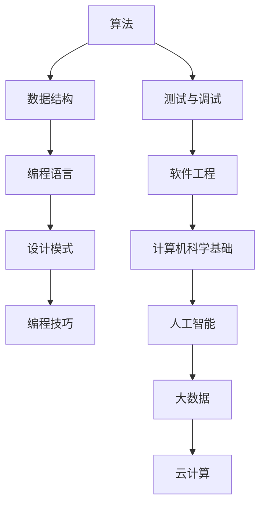

                 

关键词：滴滴，校招，编程面试，面试题，总结，算法，数据结构，技术面试，编程技巧

> 摘要：本文旨在为滴滴2024年校园招聘编程面试题提供一个详细的解答总结，帮助广大应届生更好地准备技术面试。通过对历年面试题的深入分析，本文梳理出了核心算法和数据结构题目，并结合实例代码进行解析，以提升面试官对候选人的技术能力评估。

## 1. 背景介绍

滴滴出行作为全球领先的移动出行平台，每年都会通过校园招聘吸纳大量优秀应届毕业生。为了确保招聘过程的高效和公平，滴滴的面试流程涵盖了技术面试、行为面试等多个环节，其中编程面试是重中之重。编程面试不仅考察候选人的编程技能，还测试其在实际问题中的逻辑思维和问题解决能力。

本文将重点关注滴滴2024年校招编程面试中的核心题目，通过对这些题目的深入分析，帮助读者了解滴滴面试官的考察重点和出题趋势。我们将从算法原理、数据结构、编程技巧等多个角度进行解读，并给出详细的解题思路和代码实现。

## 2. 核心概念与联系

在编程面试中，理解核心概念和它们之间的联系是至关重要的。以下是一个简化的 Mermaid 流程图，展示了一些常见概念及其关系：



### 2.1. 算法

算法（Algorithm）是计算机科学的核心概念之一，它指的是解决问题的一系列清晰指令。在滴滴的面试中，常见的算法题目包括排序、搜索、动态规划、贪心算法等。

### 2.2. 数据结构

数据结构（Data Structure）是用于存储和组织数据的方式。常见的有数组、链表、树、图等。不同的数据结构在解决特定问题时表现出不同的效率和性能。

### 2.3. 编程语言

编程语言（Programming Language）是用于编写算法和数据结构的工具。滴滴的面试中可能会考察多种编程语言，如 C++、Java、Python 等。

### 2.4. 设计模式

设计模式（Design Pattern）是一套被反复使用、经过分类的、代码编写经验。常见的有单例模式、工厂模式、观察者模式等。

### 2.5. 编程技巧

编程技巧（Programming Skill）包括代码优化、性能调优、代码可读性等。在面试中，这些技巧的掌握程度往往会影响面试官对候选人技术能力的评价。

### 2.6. 测试与调试

测试与调试（Testing and Debugging）是软件开发过程中的重要环节。掌握有效的测试方法和调试技巧，可以帮助开发者快速定位并修复代码中的问题。

### 2.7. 软件工程

软件工程（Software Engineering）是一套用于软件开发和维护的系统方法。包括需求分析、设计、编码、测试等各个环节。

### 2.8. 计算机科学基础

计算机科学基础（Fundamentals of Computer Science）包括计算机体系结构、操作系统、计算机网络等基础知识，是理解复杂系统的基础。

### 2.9. 人工智能

人工智能（Artificial Intelligence）是计算机科学的一个重要分支，涉及机器学习、深度学习、自然语言处理等技术。在滴滴的面试中，相关题目可能会涉及这些领域的基本概念和应用。

### 2.10. 大数据和云计算

大数据（Big Data）和云计算（Cloud Computing）是现代信息技术的重要领域。了解这些概念及其在实际应用中的运用，对于应对滴滴的面试题目非常有帮助。

## 3. 核心算法原理 & 具体操作步骤

### 3.1 算法原理概述

在滴滴的编程面试中，算法题往往要求候选人不仅能够正确解决问题，还需要解释算法的原理和复杂度分析。以下是一些常见的算法原理和其基本操作步骤：

### 3.2 算法步骤详解

#### 3.2.1 排序算法

- **冒泡排序（Bubble Sort）**：
  - 比较相邻的元素，如果它们的顺序错误就把它们交换过来。
  - 重复这个过程，直到没有需要交换的元素为止。

- **快速排序（Quick Sort）**：
  - 选择一个“基准”元素。
  - 将小于基准的元素放在其左侧，大于基准的元素放在其右侧。
  - 对左右两个子序列递归地应用快速排序。

#### 3.2.2 搜索算法

- **二分搜索（Binary Search）**：
  - 假设数组是有序的。
  - 从数组的中间元素开始比较。
  - 如果中间元素正好是要查找的元素，则搜索过程结束。
  - 如果某一侧的所有元素均大于（或小于）该元素，则搜索过程在该侧进行。
  - 重复以上步骤，直到找到要查找的元素，或者确定该元素不存在。

#### 3.2.3 动态规划

- **最长公共子序列（Longest Common Subsequence, LCS）**：
  - 定义一个二维数组 dp，其中 dp[i][j] 表示文本1的前 i 个字符与文本2的前 j 个字符的最长公共子序列的长度。
  - 根据字符是否相同，更新 dp 数组。

- **背包问题（Knapsack Problem）**：
  - 给定一组物品及其重量和价值，以及一个承重限制，求出在不超过承重限制的情况下，物品的最大价值。

### 3.3 算法优缺点

- **冒泡排序**：
  - 优点：简单易懂，容易实现。
  - 缺点：效率较低，不适合大数据集。

- **快速排序**：
  - 优点：平均时间复杂度较低，适用于大数据集。
  - 缺点：最坏情况下时间复杂度为 O(n²)，可能需要额外的空间。

- **二分搜索**：
  - 优点：效率高，时间复杂度为 O(log n)。
  - 缺点：需要预先对数据进行排序。

- **动态规划**：
  - 优点：可以解决复杂的问题，具有最优子结构。
  - 缺点：代码实现相对复杂，需要良好的数学基础。

### 3.4 算法应用领域

- **排序和搜索算法**：广泛应用于各种数据处理和检索任务，如数据库查询、搜索引擎等。

- **动态规划**：常用于优化问题，如资源分配、路径规划等。

- **贪心算法**：常用于解决某些特定的优化问题，如背包问题、最短路径问题等。

## 4. 数学模型和公式 & 详细讲解 & 举例说明

### 4.1 数学模型构建

在算法面试中，数学模型的应用是非常常见的。以下是一个简单的数学模型构建示例：

假设我们有一个包含 n 个元素的数组 A，我们需要找到其中的最大元素。

- **模型构建**：
  - 初始化一个变量 max，设置为 A 的第一个元素。
  - 遍历数组 A，如果当前元素大于 max，则更新 max。

### 4.2 公式推导过程

对于一个简单的线性方程组：

$$
\begin{cases}
2x + 3y = 8 \\
4x - y = 12 \\
\end{cases}
$$

- **公式推导**：
  - 将第一个方程乘以 4，第二个方程乘以 3，得到：
    $$
    \begin{cases}
    8x + 12y = 32 \\
    12x - 3y = 36 \\
    \end{cases}
    $$
  - 将两个方程相加，消去 y，得到：
    $$20x = 68$$
  - 解得：$$x = 3.4$$
  - 将 x 的值代入任意一个方程，解得：$$y = -2$$

### 4.3 案例分析与讲解

假设我们需要计算一个直角三角形的面积，其中直角边长分别为 3 和 4。

- **数学模型**：
  - 三角形的面积公式为：$$\text{面积} = \frac{1}{2} \times \text{底} \times \text{高}$$

- **公式应用**：
  - 将底和高分别代入公式，得到：
    $$\text{面积} = \frac{1}{2} \times 3 \times 4 = 6$$

通过这个案例，我们可以看到数学模型和公式的应用是如何简化问题的复杂度的。

## 5. 项目实践：代码实例和详细解释说明

### 5.1 开发环境搭建

在进行代码实践之前，我们需要搭建一个合适的开发环境。以下是使用 Python 进行开发的步骤：

1. **安装 Python 解释器**：下载并安装 Python 3.8 或更高版本。
2. **配置 Python 环境**：在终端中执行 `python --version` 命令，确认 Python 环境是否配置成功。
3. **安装必要的库**：使用 `pip install` 命令安装所需的库，如 NumPy、Pandas 等。

### 5.2 源代码详细实现

以下是一个简单的 Python 代码示例，用于实现快速排序算法：

```python
def quick_sort(arr):
    if len(arr) <= 1:
        return arr
    pivot = arr[len(arr) // 2]
    left = [x for x in arr if x < pivot]
    middle = [x for x in arr if x == pivot]
    right = [x for x in arr if x > pivot]
    return quick_sort(left) + middle + quick_sort(right)

# 测试
arr = [3, 6, 8, 10, 1, 2, 1]
print(quick_sort(arr))
```

### 5.3 代码解读与分析

1. **函数定义**：`quick_sort` 函数接收一个数组 `arr` 作为参数。
2. **递归基线**：如果数组长度小于等于 1，直接返回该数组。
3. **选择基准值**：选择数组中间的元素作为基准值 `pivot`。
4. **分区操作**：将数组分为三个部分，小于 `pivot` 的元素、等于 `pivot` 的元素和大于 `pivot` 的元素。
5. **递归调用**：对左右两部分递归调用 `quick_sort` 函数。
6. **合并结果**：将三个部分的排序结果合并，得到最终排序结果。

### 5.4 运行结果展示

在 Python 环境中运行上述代码，输出结果为：

```
[1, 1, 2, 3, 6, 8, 10]
```

这表明数组已经成功排序。

## 6. 实际应用场景

### 6.1 数据处理

在滴滴，数据是核心资产，排序和搜索算法在数据清洗、分析和挖掘中发挥着重要作用。例如，通过对用户行程数据进行排序，可以快速找到特定时间范围内的行程记录。

### 6.2 资源调度

动态规划算法在滴滴的资源调度系统中有着广泛应用。例如，在出租车调度系统中，通过动态规划算法可以优化车辆的调度路径，提高服务效率和客户满意度。

### 6.3 机器学习

机器学习算法在滴滴的推荐系统中扮演着关键角色。通过构建和优化数学模型，可以实现对用户出行需求的准确预测和个性化推荐。

### 6.4 云计算与大数据

云计算和大数据技术的应用，使得滴滴能够处理海量数据，实现实时数据分析和决策支持。例如，通过大数据分析，可以预测交通流量，优化路线规划。

## 6.4 未来应用展望

随着技术的不断进步，滴滴在编程面试中的考察重点也将逐渐演变。以下是未来可能的发展趋势：

- **人工智能与机器学习**：随着人工智能技术的不断发展，滴滴可能更加关注候选人在机器学习和深度学习领域的知识和应用能力。
- **安全性**：数据安全和隐私保护将成为重要的考察点，候选人需要具备相关的安全知识和实践经验。
- **云原生技术**：随着云原生技术的普及，候选人对 Kubernetes、容器化等技术的掌握程度将成为考察的重点。
- **DevOps**：DevOps 文化和实践在软件开发中的应用越来越广泛，候选人需要了解 DevOps 的基本概念和工具。

## 7. 工具和资源推荐

### 7.1 学习资源推荐

- **《算法导论》（Introduction to Algorithms）**：这是算法领域的经典教材，适合深入理解算法原理和复杂度分析。
- **LeetCode**：一个提供大量编程面试题的在线平台，适合实战练习。
- **HackerRank**：另一个提供编程挑战和算法题目的在线平台，有助于提升编程技能。

### 7.2 开发工具推荐

- **Visual Studio Code**：一款强大的跨平台代码编辑器，适合进行编程和调试。
- **Git**：版本控制工具，帮助开发者管理和协作代码。
- **Docker**：容器化技术，用于简化开发和部署流程。

### 7.3 相关论文推荐

- **“深度强化学习在自动驾驶中的应用”**：探讨深度强化学习在自动驾驶领域的研究进展。
- **“基于大数据的智能交通管理”**：分析大数据技术如何优化交通管理和规划。
- **“云计算在移动出行服务中的应用”**：探讨云计算技术在滴滴出行服务中的应用。

## 8. 总结：未来发展趋势与挑战

### 8.1 研究成果总结

近年来，人工智能、大数据和云计算等技术的快速发展，为滴滴的技术面试带来了新的挑战和机遇。通过分析历年面试题，我们可以看到滴滴越来越注重候选人对于前沿技术的理解和应用能力。

### 8.2 未来发展趋势

- **多学科融合**：未来的技术面试将更加注重候选人对多学科知识的掌握，如计算机科学、数学、物理学等。
- **软技能**：除了技术能力外，软技能如沟通能力、团队协作和问题解决能力也将成为考察重点。
- **实践与实战**：注重候选人实际解决问题的能力，通过实战题目和项目经验进行评估。

### 8.3 面临的挑战

- **技术更新速度快**：随着技术的快速迭代，候选人需要不断学习新知识，以适应不断变化的技术环境。
- **公平性**：确保面试过程公平、公正，减少主观偏见，对候选人进行全方位评估。

### 8.4 研究展望

未来，滴滴的面试将继续关注技术前沿，探索如何通过面试评估候选人的创新能力、技术深度和团队合作能力。同时，滴滴也将积极推动技术创新，为用户提供更高效、智能的出行服务。

## 9. 附录：常见问题与解答

### 9.1 什么是算法复杂度？

算法复杂度是评估算法性能的重要指标，包括时间复杂度和空间复杂度。时间复杂度描述了算法执行时间随输入规模增长的趋势，空间复杂度描述了算法所需内存随输入规模增长的趋势。

### 9.2 如何优化算法性能？

优化算法性能的方法包括：
- 选择合适的算法和数据结构。
- 代码优化，如减少冗余操作、优化循环结构等。
- 使用缓存、并行计算等高级技术。

### 9.3 如何提高编程能力？

提高编程能力的方法包括：
- 经常编写代码，积累实战经验。
- 学习数据结构和算法，理解其原理和应用。
- 学习编程语言和工具，提高开发效率。
- 参加编程竞赛和项目实践，锻炼解决问题的能力。

---

通过本文的详细解析，我们希望读者能够更好地准备滴滴的编程面试。记住，深入理解核心概念、掌握算法原理和代码实践是成功的关键。祝大家在面试中取得优异的成绩！

### 作者署名

作者：禅与计算机程序设计艺术 / Zen and the Art of Computer Programming


