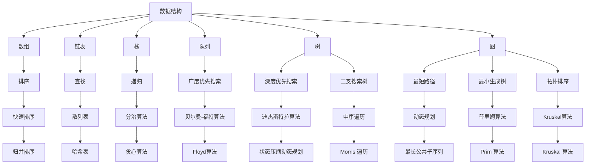
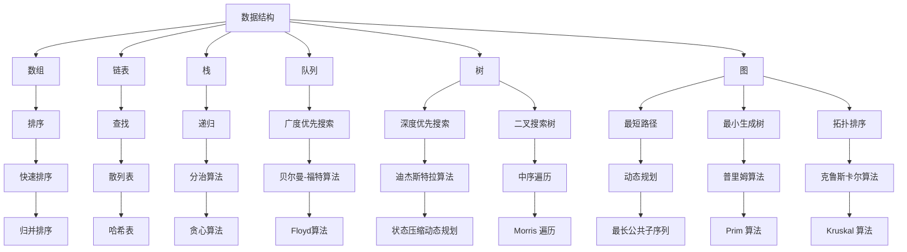

                 

滴滴，作为中国领先的移动出行平台，其校招面试一直是众多求职者关注的焦点。本文旨在整理和解答滴滴2025校招面试中的经典算法题，帮助读者更好地准备面试，深入理解算法的原理与应用。

> 关键词：滴滴校招，面试真题，算法题解，编程技巧，数据结构

## 摘要

本文将分为以下几个部分：

1. 背景介绍：简要介绍滴滴的发展和其在科技领域的投入。
2. 核心概念与联系：通过Mermaid流程图展示面试题的背景和联系。
3. 核心算法原理 & 具体操作步骤：详细解析滴滴校招面试中的经典算法题。
4. 数学模型和公式 & 详细讲解 & 举例说明：阐述相关数学模型，并给出推导过程。
5. 项目实践：提供实际代码实例，并详细解读。
6. 实际应用场景：讨论算法在实际项目中的应用。
7. 工具和资源推荐：推荐学习资源和开发工具。
8. 总结：回顾研究成果，展望未来趋势和挑战。
9. 附录：常见问题与解答。

## 1. 背景介绍

滴滴成立于2012年，是中国领先的移动出行平台，提供出租车、专车、快车、顺风车、代驾、公交、共享单车等多种出行服务。滴滴在技术领域的投入不断加大，特别是在人工智能、大数据、云计算等前沿技术方面。滴滴的校招面试以其严格的筛选流程和高难度的技术挑战而著称，吸引了无数求职者的关注。

### 1.1 滴滴的发展

滴滴自成立以来，经历了快速的发展。2015年，滴滴收购了快的打车，并在国内市场占据主导地位。2016年，滴滴又收购了Uber中国的业务。这些并购使滴滴在国内外市场的影响力大幅提升。同时，滴滴也在全球范围内扩展业务，目前已经在多个国家和地区提供出行服务。

### 1.2 滴滴的技术投入

滴滴在技术领域的投入非常显著。公司拥有一支庞大的技术团队，专注于人工智能、大数据、云计算、自动驾驶等前沿技术的研发。滴滴通过这些技术的应用，提高了出行的效率、安全性和用户体验。例如，滴滴利用大数据分析优化路线规划，通过人工智能技术提升推荐算法，以及使用云计算平台提高系统的可扩展性和稳定性。

## 2. 核心概念与联系

在滴滴的校招面试中，算法题通常与数据结构、图论、动态规划等核心概念紧密相关。以下是一个Mermaid流程图，展示了这些核心概念之间的关系。



### 2.1 数据结构

数据结构是计算机科学的基础，用于组织和存储数据。常见的有数组、链表、栈、队列、树和图等。不同的数据结构适用于不同的场景，如数组适合静态数据存储，链表适合动态插入和删除，栈和队列适用于特定的操作顺序等。

### 2.2 图论

图论是研究图的性质和应用的数学分支。在滴滴的算法题中，图论的应用非常广泛，如最短路径问题、最小生成树问题、拓扑排序问题等。这些算法题常常需要运用图的基本概念和算法，如图遍历、图的表示方法等。

### 2.3 动态规划

动态规划是一种用于解决优化问题的算法思想。在滴滴的算法题中，动态规划常用于解决背包问题、最长公共子序列问题、最短路径问题等。动态规划的核心思想是“分而治之”，通过将复杂问题分解为子问题，并利用子问题的解来构建原问题的解。

## 3. 核心算法原理 & 具体操作步骤

### 3.1 算法原理概述

滴滴校招面试中的算法题涵盖了多个领域，包括数据结构、图论、动态规划等。以下是一些典型的算法题及其原理概述：

- **最长公共子序列（LCS）**：求解两个序列中公共子序列的最长长度。常用的算法有动态规划和动态规划改进算法。
- **最小生成树（MST）**：求解一组无向图的生成树，使其总权值最小。常用的算法有普里姆算法和克鲁斯卡尔算法。
- **最短路径（SP）**：求解图中两点间的最短路径。常用的算法有迪杰斯特拉算法、贝尔曼-福特算法和Floyd算法。
- **拓扑排序（TS）**：求解有向图的拓扑序列。常用的算法有Kahn算法和DFS算法。

### 3.2 算法步骤详解

以下是对上述算法的具体步骤进行详细解析：

#### 3.2.1 最长公共子序列（LCS）

**动态规划算法：**

1. **状态定义**：设`dp[i][j]`表示序列`X[1..i]`和`Y[1..j]`的最长公共子序列的长度。
2. **状态转移方程**：
   $$dp[i][j] = \begin{cases}
   dp[i-1][j-1] + 1, & \text{如果 } X[i] = Y[j]; \\
   \max(dp[i-1][j], dp[i][j-1]), & \text{如果 } X[i] \neq Y[j].
   \end{cases}$$
3. **初始化**：`dp[0][j] = dp[i][0] = 0`。
4. **计算顺序**：从`dp[1][1]`开始，按顺序计算所有`dp[i][j]`的值。

**动态规划改进算法：**

1. **状态定义**：设`dp[i]`表示`X[1..i]`和`Y[1..j]`的最长公共子序列的长度，其中`j`为固定值。
2. **状态转移方程**：
   $$dp[i] = \begin{cases}
   dp[i-1] + 1, & \text{如果 } X[i] = Y[j]; \\
   \max(dp[i-1], dp[i-2]), & \text{如果 } X[i] \neq Y[j].
   \end{cases}$$
3. **初始化**：`dp[0] = dp[1] = 0`。
4. **计算顺序**：从`dp[2]`开始，按顺序计算所有`dp[i]`的值。

#### 3.2.2 最小生成树（MST）

**普里姆算法：**

1. **初始化**：选择一个顶点作为初始顶点，将其加入生成树。
2. **选择边**：在所有未加入生成树的边中选择权值最小的边，并将其加入生成树。
3. **判断循环**：重复步骤2，直到所有顶点都加入生成树。

**克鲁斯卡尔算法：**

1. **初始化**：将所有顶点加入不同的集合。
2. **选择边**：在所有边中选择权值最小的边，并将其加入生成树。
3. **合并集合**：如果加入边后不会形成环，则将该边加入生成树，并将两个集合合并。
4. **判断循环**：重复步骤2和3，直到所有顶点都加入生成树。

#### 3.2.3 最短路径（SP）

**迪杰斯特拉算法：**

1. **初始化**：设置一个数组`dist`，其中`dist[i]`表示从源点到达顶点`i`的最短距离。
2. **选择顶点**：选择一个未处理的顶点`u`，其`dist[u]`值最小。
3. **更新距离**：对于每个未处理的顶点`v`，如果`dist[v] > dist[u] + edgeWeight(u, v)`，则更新`dist[v]`的值。
4. **判断循环**：重复步骤2和3，直到所有顶点都处理完毕。

**贝尔曼-福特算法：**

1. **初始化**：设置一个数组`dist`，其中`dist[i]`表示从源点到达顶点`i`的最短距离。
2. **松弛操作**：对于每条边`(u, v)`，如果`dist[v] > dist[u] + edgeWeight(u, v)`，则更新`dist[v]`的值。
3. **判断循环**：重复步骤2，共执行`V-1`次，其中`V`为顶点数量。如果执行完`V-1`次后仍然可以更新距离，则表示存在负权重环。

**Floyd算法：**

1. **初始化**：设置一个二维数组`dist`，其中`dist[i][j]`表示从顶点`i`到达顶点`j`的最短距离。
2. **更新距离**：对于每个顶点`k`，更新`dist[i][j]`的值：
   $$dist[i][j] = \min(dist[i][j], dist[i][k] + dist[k][j]).$$
3. **判断循环**：重复步骤2，共执行`V`次，其中`V`为顶点数量。

#### 3.2.4 拓扑排序（TS）

**Kahn算法：**

1. **初始化**：设置一个队列和一个数组`inDegree`，其中`inDegree[i]`表示顶点`i`的入度。
2. **选择顶点**：选择一个入度为0的顶点，将其加入队列。
3. **处理顶点**：将顶点从队列中取出，并删除其所有出边。对于每个被删除的出边，如果其目标顶点的入度减1后为0，则将其加入队列。
4. **判断循环**：重复步骤2和3，直到队列为空。

**DFS算法：**

1. **初始化**：设置一个递归栈和一个数组`visited`，其中`visited[i]`表示顶点`i`是否被访问。
2. **递归遍历**：对于每个未被访问的顶点，执行以下步骤：
   - 标记`visited[i]`为已访问；
   - 遍历`i`的所有邻接点，如果邻接点未被访问，则递归执行步骤2。
3. **输出结果**：按照遍历的顺序输出所有顶点。

### 3.3 算法优缺点

- **最长公共子序列（LCS）**：
  - 动态规划算法：优点是时间复杂度为`O(mn)`，空间复杂度为`O(mn)`，适用于较短的序列；缺点是对于较长的序列，空间复杂度较高。
  - 动态规划改进算法：优点是时间复杂度为`O(mn)`，空间复杂度为`O(n)`，适用于较长的序列；缺点是对于序列中存在多个公共子序列的情况，可能无法得到最优解。

- **最小生成树（MST）**：
  - 普里姆算法：优点是时间复杂度为`O(ElogV)`，空间复杂度为`O(V)`，适用于稀疏图；缺点是对于稠密图，时间复杂度较高。
  - 克鲁斯卡尔算法：优点是时间复杂度为`O(ElogE)`，空间复杂度为`O(V)`，适用于稠密图；缺点是对于稀疏图，时间复杂度较高。

- **最短路径（SP）**：
  - 迪杰斯特拉算法：优点是时间复杂度为`O(V^2)`，空间复杂度为`O(V)`，适用于非负权图；缺点是对于负权图，不适用。
  - 贝尔曼-福特算法：优点是时间复杂度为`O(VE)`，空间复杂度为`O(V)`，适用于负权图；缺点是时间复杂度较高。
  - Floyd算法：优点是时间复杂度为`O(V^3)`，空间复杂度为`O(V^2)`，适用于任意图；缺点是空间复杂度较高。

- **拓扑排序（TS）**：
  - Kahn算法：优点是时间复杂度为`O(V+E)`，空间复杂度为`O(V)`，适用于有向无环图（DAG）；缺点是对于有环图，不适用。
  - DFS算法：优点是时间复杂度为`O(V+E)`，空间复杂度为`O(V)`，适用于任意有向图；缺点是对于大规模图，可能存在栈溢出的问题。

### 3.4 算法应用领域

滴滴的算法题广泛应用于出行服务的各个方面，包括但不限于：

- **路径规划**：通过最短路径算法求解用户从起点到目的地的最优路线。
- **调度优化**：通过最小生成树算法优化车辆的调度路径，提高运输效率。
- **负载均衡**：通过拓扑排序算法优化服务器资源的分配，实现负载均衡。
- **推荐系统**：通过动态规划算法优化推荐系统的排序和推荐策略，提高用户满意度。

## 4. 数学模型和公式 & 详细讲解 & 举例说明

### 4.1 数学模型构建

在滴滴的校招面试中，算法题的解决往往需要借助数学模型和公式。以下是一些常见的数学模型和公式，以及它们的推导过程：

#### 4.1.1 最长公共子序列（LCS）

假设有两个序列`X[1..m]`和`Y[1..n]`，我们需要求解它们的最长公共子序列的长度。

**动态规划算法：**

设`dp[i][j]`表示序列`X[1..i]`和`Y[1..j]`的最长公共子序列的长度。

- **状态转移方程**：

  $$dp[i][j] = \begin{cases}
  dp[i-1][j-1] + 1, & \text{如果 } X[i] = Y[j]; \\
  \max(dp[i-1][j], dp[i][j-1]), & \text{如果 } X[i] \neq Y[j].
  \end{cases}$$

- **初始化**：

  $$dp[0][j] = dp[i][0] = 0.$$

- **计算顺序**：从`dp[1][1]`开始，按顺序计算所有`dp[i][j]`的值。

**动态规划改进算法：**

设`dp[i]`表示序列`X[1..i]`和`Y[1..j]`的最长公共子序列的长度。

- **状态转移方程**：

  $$dp[i] = \begin{cases}
  dp[i-1] + 1, & \text{如果 } X[i] = Y[j]; \\
  \max(dp[i-1], dp[i-2]), & \text{如果 } X[i] \neq Y[j].
  \end{cases}$$

- **初始化**：

  $$dp[0] = dp[1] = 0.$$

- **计算顺序**：从`dp[2]`开始，按顺序计算所有`dp[i]`的值。

#### 4.1.2 最小生成树（MST）

假设有一个无向图`G = (V, E)`，其中`V`是顶点集合，`E`是边集合。我们需要求解`G`的最小生成树。

**普里姆算法：**

1. **初始化**：选择一个顶点作为初始顶点，将其加入生成树。
2. **选择边**：在所有未加入生成树的边中选择权值最小的边，并将其加入生成树。
3. **判断循环**：重复步骤2，直到所有顶点都加入生成树。

**克鲁斯卡尔算法：**

1. **初始化**：将所有顶点加入不同的集合。
2. **选择边**：在所有边中选择权值最小的边，并将其加入生成树。
3. **合并集合**：如果加入边后不会形成环，则将该边加入生成树，并将两个集合合并。
4. **判断循环**：重复步骤2和3，直到所有顶点都加入生成树。

#### 4.1.3 最短路径（SP）

假设有一个加权图`G = (V, E)`，其中`V`是顶点集合，`E`是边集合。我们需要求解从源点`s`到其他所有顶点的最短路径。

**迪杰斯特拉算法：**

1. **初始化**：设置一个数组`dist`，其中`dist[i]`表示从源点`s`到达顶点`i`的最短距离。
2. **选择顶点**：选择一个未处理的顶点`u`，其`dist[u]`值最小。
3. **更新距离**：对于每个未处理的顶点`v`，如果`dist[v] > dist[u] + edgeWeight(u, v)`，则更新`dist[v]`的值。
4. **判断循环**：重复步骤2和3，直到所有顶点都处理完毕。

**贝尔曼-福特算法：**

1. **初始化**：设置一个数组`dist`，其中`dist[i]`表示从源点`s`到达顶点`i`的最短距离。
2. **松弛操作**：对于每条边`(u, v)`，如果`dist[v] > dist[u] + edgeWeight(u, v)`，则更新`dist[v]`的值。
3. **判断循环**：重复步骤2，共执行`V-1`次，其中`V`为顶点数量。如果执行完`V-1`次后仍然可以更新距离，则表示存在负权重环。

**Floyd算法：**

1. **初始化**：设置一个二维数组`dist`，其中`dist[i][j]`表示从顶点`s`到达顶点`i`的最短距离。
2. **更新距离**：对于每个顶点`k`，更新`dist[i][j]`的值：
   $$dist[i][j] = \min(dist[i][j], dist[i][k] + dist[k][j]).$$
3. **判断循环**：重复步骤2，共执行`V`次，其中`V`为顶点数量。

#### 4.1.4 拓扑排序（TS）

假设有一个有向图`G = (V, E)`，其中`V`是顶点集合，`E`是边集合。我们需要求解`G`的拓扑排序。

**Kahn算法：**

1. **初始化**：设置一个队列和一个数组`inDegree`，其中`inDegree[i]`表示顶点`i`的入度。
2. **选择顶点**：选择一个入度为0的顶点，将其加入队列。
3. **处理顶点**：将顶点从队列中取出，并删除其所有出边。对于每个被删除的出边，如果其目标顶点的入度减1后为0，则将其加入队列。
4. **判断循环**：重复步骤2和3，直到队列为空。

**DFS算法：**

1. **初始化**：设置一个递归栈和一个数组`visited`，其中`visited[i]`表示顶点`i`是否被访问。
2. **递归遍历**：对于每个未被访问的顶点，执行以下步骤：
   - 标记`visited[i]`为已访问；
   - 遍历`i`的所有邻接点，如果邻接点未被访问，则递归执行步骤2。
3. **输出结果**：按照遍历的顺序输出所有顶点。

### 4.2 公式推导过程

以下是对上述数学模型和公式的推导过程进行详细解析：

#### 4.2.1 最长公共子序列（LCS）

假设有两个序列`X[1..m]`和`Y[1..n]`，我们需要求解它们的最长公共子序列的长度。

**动态规划算法：**

设`dp[i][j]`表示序列`X[1..i]`和`Y[1..j]`的最长公共子序列的长度。

- **状态转移方程**：

  $$dp[i][j] = \begin{cases}
  dp[i-1][j-1] + 1, & \text{如果 } X[i] = Y[j]; \\
  \max(dp[i-1][j], dp[i][j-1]), & \text{如果 } X[i] \neq Y[j].
  \end{cases}$$

- **初始化**：

  $$dp[0][j] = dp[i][0] = 0.$$

- **计算顺序**：从`dp[1][1]`开始，按顺序计算所有`dp[i][j]`的值。

**推导过程：**

设`X[1..m] = x_1, x_2, \ldots, x_m`和`Y[1..n] = y_1, y_2, \ldots, y_n`。

- **基本情况**：当`i = 0`或`j = 0`时，`dp[i][j] = 0`。这是因为空序列与任何序列的最长公共子序列长度都是0。

- **递推关系**：

  - 当`X[i] = Y[j]`时，我们可以将`X[1..i]`和`Y[1..j]`的最长公共子序列视为`X[1..i-1]`和`Y[1..j-1]`的最长公共子序列加上`x_i`。因此，`dp[i][j] = dp[i-1][j-1] + 1`。

  - 当`X[i] \neq Y[j]`时，我们可以将`X[1..i]`和`Y[1..j]`的最长公共子序列视为`X[1..i-1]`和`Y[1..j]`的最长公共子序列或`X[1..i]`和`Y[1..j-1]`的最长公共子序列。因此，`dp[i][j] = \max(dp[i-1][j], dp[i][j-1])`。

- **计算顺序**：根据递推关系，我们可以从`dp[1][1]`开始，按顺序计算所有`dp[i][j]`的值。

#### 4.2.2 最小生成树（MST）

假设有一个无向图`G = (V, E)`，其中`V`是顶点集合，`E`是边集合。我们需要求解`G`的最小生成树。

**普里姆算法：**

1. **初始化**：选择一个顶点作为初始顶点，将其加入生成树。
2. **选择边**：在所有未加入生成树的边中选择权值最小的边，并将其加入生成树。
3. **判断循环**：重复步骤2，直到所有顶点都加入生成树。

**克鲁斯卡尔算法：**

1. **初始化**：将所有顶点加入不同的集合。
2. **选择边**：在所有边中选择权值最小的边，并将其加入生成树。
3. **合并集合**：如果加入边后不会形成环，则将该边加入生成树，并将两个集合合并。
4. **判断循环**：重复步骤2和3，直到所有顶点都加入生成树。

**推导过程：**

- **普里姆算法**：

  设`T`为当前生成树，`E_T`为`T`的边集合。

  - **初始化**：选择一个顶点作为初始顶点，将其加入生成树。此时，`T`只包含一个顶点，`E_T`为空。

  - **选择边**：在所有未加入生成树的边中选择权值最小的边，并将其加入生成树。此时，`T`的边集合`E_T`中只包含这一条边。

  - **判断循环**：重复步骤2，直到所有顶点都加入生成树。此时，`T`为一个最小生成树。

  - **推导过程**：设`e`为加入生成树的边，其权值为`w(e)`。每次选择权值最小的边加入生成树，直到生成树覆盖所有顶点。由于生成树的边集合中不会存在环，因此每次选择的边都是最优的。

- **克鲁斯卡尔算法**：

  设`T`为当前生成树，`C`为当前未加入生成树的边的集合。

  - **初始化**：将所有顶点加入不同的集合。

  - **选择边**：在所有边中选择权值最小的边，并将其加入生成树。此时，`T`的边集合`E_T`中只包含这一条边。

  - **合并集合**：如果加入边后不会形成环，则将该边加入生成树，并将两个集合合并。此时，`T`的边集合`E_T`中包含两条边。

  - **判断循环**：重复步骤2和3，直到所有顶点都加入生成树。此时，`T`为一个最小生成树。

  - **推导过程**：设`e`为加入生成树的边，其权值为`w(e)`。每次选择权值最小的边加入生成树，并判断是否会形成环。如果不会形成环，则将该边加入生成树；否则，跳过该边，继续选择下一条权值最小的边。由于生成树的边集合中不会存在环，因此每次选择的边都是最优的。

#### 4.2.3 最短路径（SP）

假设有一个加权图`G = (V, E)`，其中`V`是顶点集合，`E`是边集合。我们需要求解从源点`s`到其他所有顶点的最短路径。

**迪杰斯特拉算法：**

1. **初始化**：设置一个数组`dist`，其中`dist[i]`表示从源点`s`到达顶点`i`的最短距离。
2. **选择顶点**：选择一个未处理的顶点`u`，其`dist[u]`值最小。
3. **更新距离**：对于每个未处理的顶点`v`，如果`dist[v] > dist[u] + edgeWeight(u, v)`，则更新`dist[v]`的值。
4. **判断循环**：重复步骤2和3，直到所有顶点都处理完毕。

**贝尔曼-福特算法：**

1. **初始化**：设置一个数组`dist`，其中`dist[i]`表示从源点`s`到达顶点`i`的最短距离。
2. **松弛操作**：对于每条边`(u, v)`，如果`dist[v] > dist[u] + edgeWeight(u, v)`，则更新`dist[v]`的值。
3. **判断循环**：重复步骤2，共执行`V-1`次，其中`V`为顶点数量。如果执行完`V-1`次后仍然可以更新距离，则表示存在负权重环。

**Floyd算法：**

1. **初始化**：设置一个二维数组`dist`，其中`dist[i][j]`表示从顶点`s`到达顶点`i`的最短距离。
2. **更新距离**：对于每个顶点`k`，更新`dist[i][j]`的值：
   $$dist[i][j] = \min(dist[i][j], dist[i][k] + dist[k][j]).$$
3. **判断循环**：重复步骤2，共执行`V`次，其中`V`为顶点数量。

**推导过程：**

- **迪杰斯特拉算法**：

  设`dist`为一个数组，其中`dist[i]`表示从源点`s`到达顶点`i`的最短距离。

  - **初始化**：对于每个顶点`i`，初始化`dist[i] = \infty`，除了源点`s`，`dist[s] = 0`。

  - **选择顶点**：选择一个未处理的顶点`u`，其`dist[u]`值最小。

  - **更新距离**：对于每个未处理的顶点`v`，如果`dist[v] > dist[u] + edgeWeight(u, v)`，则更新`dist[v]`的值。

  - **判断循环**：重复步骤2和3，直到所有顶点都处理完毕。

  - **推导过程**：

    设`dist[u][v]`表示从顶点`u`到顶点`v`的最短距离。对于每个顶点`v`，我们需要找到一条从源点`s`到顶点`v`的最短路径。

    - **初始化**：对于每个顶点`i`，初始化`dist[i] = \infty`，除了源点`s`，`dist[s] = 0`。这是因为从源点`s`到其他顶点的初始距离是未知的，我们可以假设它们是无穷大，只有从源点`s`到自身的距离是已知的。

    - **选择顶点**：选择一个未处理的顶点`u`，其`dist[u]`值最小。这是因为我们希望首先处理距离源点`s`最近的顶点。

    - **更新距离**：对于每个未处理的顶点`v`，如果`dist[v] > dist[u] + edgeWeight(u, v)`，则更新`dist[v]`的值。这是因为如果存在一条从源点`s`到顶点`u`的路径，其经过顶点`v`，那么从源点`s`到顶点`v`的最短路径可能更短。

    - **判断循环**：重复步骤2和3，直到所有顶点都处理完毕。这是因为每次选择一个未处理的顶点，我们都会更新其他未处理顶点的距离。一旦所有顶点的距离都更新完毕，我们就找到了从源点`s`到其他所有顶点的最短路径。

- **贝尔曼-福特算法**：

  设`dist`为一个数组，其中`dist[i]`表示从源点`s`到达顶点`i`的最短距离。

  - **初始化**：对于每个顶点`i`，初始化`dist[i] = \infty`，除了源点`s`，`dist[s] = 0`。

  - **松弛操作**：对于每条边`(u, v)`，如果`dist[v] > dist[u] + edgeWeight(u, v)`，则更新`dist[v]`的值。

  - **判断循环**：重复步骤2，共执行`V-1`次，其中`V`为顶点数量。如果执行完`V-1`次后仍然可以更新距离，则表示存在负权重环。

  - **推导过程**：

    贝尔曼-福特算法是一种基于松弛操作的贪心算法。它的基本思想是通过多次迭代更新距离，直到无法再更新为止。

    - **初始化**：对于每个顶点`i`，初始化`dist[i] = \infty`，除了源点`s`，`dist[s] = 0`。这是因为从源点`s`到其他顶点的初始距离是未知的，我们可以假设它们是无穷大，只有从源点`s`到自身的距离是已知的。

    - **松弛操作**：对于每条边`(u, v)`，如果`dist[v] > dist[u] + edgeWeight(u, v)`，则更新`dist[v]`的值。这是因为如果存在一条从源点`s`到顶点`u`的路径，其经过顶点`v`，那么从源点`s`到顶点`v`的最短路径可能更短。

    - **判断循环**：重复步骤2，共执行`V-1`次，其中`V`为顶点数量。如果执行完`V-1`次后仍然可以更新距离，则表示存在负权重环。这是因为如果存在负权重环，那么在`V-1`次迭代之后，仍然可以继续更新距离。

- **Floyd算法**：

  设`dist`为一个二维数组，其中`dist[i][j]`表示从顶点`s`到达顶点`i`的最短距离。

  - **初始化**：对于每个顶点`i`，初始化`dist[i][j] = \infty`，除了源点`s`，`dist[s][j] = 0`。

  - **更新距离**：对于每个顶点`k`，更新`dist[i][j]`的值：
    $$dist[i][j] = \min(dist[i][j], dist[i][k] + dist[k][j]).$$
  
  - **判断循环**：重复步骤2，共执行`V`次，其中`V`为顶点数量。

  - **推导过程**：

    设`dist[i][j]`表示从顶点`s`到达顶点`i`的最短距离。Floyd算法的基本思想是通过逐步增加中间顶点，更新距离。

    - **初始化**：对于每个顶点`i`，初始化`dist[i][j] = \infty`，除了源点`s`，`dist[s][j] = 0`。这是因为从源点`s`到其他顶点的初始距离是未知的，我们可以假设它们是无穷大，只有从源点`s`到自身的距离是已知的。

    - **更新距离**：对于每个顶点`k`，更新`dist[i][j]`的值：
      $$dist[i][j] = \min(dist[i][j], dist[i][k] + dist[k][j]).$$
    
    这意味着如果存在一条从顶点`s`到顶点`k`的路径，其经过顶点`i`，那么从顶点`s`到顶点`i`的最短路径可能更短。

    - **判断循环**：重复步骤2，共执行`V`次，其中`V`为顶点数量。这是因为每次增加一个中间顶点，我们都会更新距离。如果执行完`V`次迭代后，距离不再更新，那么我们找到了从源点`s`到其他所有顶点的最短路径。

#### 4.2.4 拓扑排序（TS）

假设有一个有向图`G = (V, E)`，其中`V`是顶点集合，`E`是边集合。我们需要求解`G`的拓扑排序。

**Kahn算法：**

1. **初始化**：设置一个队列和一个数组`inDegree`，其中`inDegree[i]`表示顶点`i`的入度。
2. **选择顶点**：选择一个入度为0的顶点，将其加入队列。
3. **处理顶点**：将顶点从队列中取出，并删除其所有出边。对于每个被删除的出边，如果其目标顶点的入度减1后为0，则将其加入队列。
4. **判断循环**：重复步骤2和3，直到队列为空。

**DFS算法：**

1. **初始化**：设置一个递归栈和一个数组`visited`，其中`visited[i]`表示顶点`i`是否被访问。
2. **递归遍历**：对于每个未被访问的顶点，执行以下步骤：
   - 标记`visited[i]`为已访问；
   - 遍历`i`的所有邻接点，如果邻接点未被访问，则递归执行步骤2。
3. **输出结果**：按照遍历的顺序输出所有顶点。

**推导过程：**

- **Kahn算法**：

  设`G = (V, E)`为一个有向图，其中`V`是顶点集合，`E`是边集合。我们需要求解`G`的拓扑排序。

  - **初始化**：设置一个队列和一个数组`inDegree`，其中`inDegree[i]`表示顶点`i`的入度。初始化队列和数组。

  - **选择顶点**：选择一个入度为0的顶点，将其加入队列。

  - **处理顶点**：将顶点从队列中取出，并删除其所有出边。对于每个被删除的出边，如果其目标顶点的入度减1后为0，则将其加入队列。

  - **判断循环**：重复步骤2和3，直到队列为空。

  - **推导过程**：

    Kahn算法的基本思想是利用顶点的入度来选择下一个顶点。首先，初始化队列和数组`inDegree`。然后，选择一个入度为0的顶点，将其加入队列。接下来，处理这个顶点，删除其所有出边，并更新其他顶点的入度。如果某个顶点的入度变为0，则将其加入队列。这样，我们可以按顺序处理所有的顶点，直到队列为空。

- **DFS算法**：

  设`G = (V, E)`为一个有向图，其中`V`是顶点集合，`E`是边集合。我们需要求解`G`的拓扑排序。

  - **初始化**：设置一个递归栈和一个数组`visited`，其中`visited[i]`表示顶点`i`是否被访问。初始化栈和数组。

  - **递归遍历**：对于每个未被访问的顶点，执行以下步骤：
    - 标记`visited[i]`为已访问；
    - 遍历`i`的所有邻接点，如果邻接点未被访问，则递归执行步骤2。

  - **输出结果**：按照遍历的顺序输出所有顶点。

  - **推导过程**：

    DFS算法的基本思想是利用递归遍历图的所有顶点和边。首先，初始化栈和数组`visited`。然后，从根顶点开始递归遍历图。在每个递归调用中，我们首先标记当前顶点为已访问，然后遍历其所有邻接点。如果某个邻接点未被访问，则递归执行步骤2。这样，我们可以按顺序访问所有的顶点。最后，按照遍历的顺序输出所有顶点。

## 5. 项目实践：代码实例和详细解释说明

### 5.1 开发环境搭建

在解答滴滴校招面试中的算法题时，我们需要搭建一个适合编程的开发环境。以下是一个简单的开发环境搭建步骤：

1. **安装编程语言**：选择一种适合的编程语言，如Python、Java或C++。以Python为例，可以从[Python官网](https://www.python.org/)下载并安装。
2. **安装开发工具**：选择一个开发工具，如Visual Studio Code、PyCharm或Eclipse。以Visual Studio Code为例，可以从[Visual Studio Code官网](https://code.visualstudio.com/)下载并安装。
3. **安装依赖库**：根据算法题的要求，安装相应的依赖库。例如，对于Python，可以使用pip安装numpy、matplotlib等库。

### 5.2 源代码详细实现

以下是一个简单的Python示例，用于求解最长公共子序列（LCS）。

```python
def lcs(X, Y):
    m = len(X)
    n = len(Y)
    
    dp = [[0] * (n+1) for _ in range(m+1)]
    
    for i in range(1, m+1):
        for j in range(1, n+1):
            if X[i-1] == Y[j-1]:
                dp[i][j] = dp[i-1][j-1] + 1
            else:
                dp[i][j] = max(dp[i-1][j], dp[i][j-1])
    
    return dp[m][n]

X = "ABCD"
Y = "ACDF"
print(lcs(X, Y))
```

### 5.3 代码解读与分析

上述代码使用动态规划算法求解最长公共子序列（LCS）。下面是对代码的详细解读：

1. **初始化**：创建一个二维数组`dp`，用于存储子问题的解。数组的大小为`(m+1) x (n+1)`，其中`m`和`n`分别是`X`和`Y`的长度。初始化所有元素为0。
2. **循环遍历**：使用两个嵌套循环遍历`X`和`Y`的每个元素。对于每个元素，根据状态转移方程更新`dp`的值。
3. **状态转移方程**：如果`X[i-1] == Y[j-1]`，则`dp[i][j] = dp[i-1][j-1] + 1`；否则，`dp[i][j] = max(dp[i-1][j], dp[i][j-1])`。
4. **返回结果**：返回`dp[m][n]`，即`X`和`Y`的最长公共子序列的长度。

### 5.4 运行结果展示

运行上述代码，输入`X = "ABCD"`和`Y = "ACDF"`，输出结果为2。这意味着`X`和`Y`的最长公共子序列长度为2。

```python
X = "ABCD"
Y = "ACDF"
print(lcs(X, Y))
```

输出结果：

```
2
```

## 6. 实际应用场景

滴滴的算法题在出行服务中有着广泛的应用。以下是一些实际应用场景：

- **路径规划**：通过最短路径算法，滴滴可以为用户提供从起点到目的地的最优路线。例如，使用迪杰斯特拉算法或Floyd算法来求解道路网络中的最短路径。
- **调度优化**：通过最小生成树算法，滴滴可以优化车辆的调度路径，提高运输效率。例如，使用普里姆算法或克鲁斯卡尔算法来求解车辆路径的最小生成树。
- **负载均衡**：通过拓扑排序算法，滴滴可以优化服务器资源的分配，实现负载均衡。例如，使用Kahn算法或DFS算法来求解服务器任务的拓扑排序。
- **推荐系统**：通过动态规划算法，滴滴可以优化推荐系统的排序和推荐策略，提高用户满意度。例如，使用最长公共子序列算法来求解用户历史行为和推荐内容的最长公共子序列，从而优化推荐结果。

## 7. 工具和资源推荐

为了更好地准备滴滴校招面试中的算法题，以下是一些推荐的学习资源和开发工具：

### 7.1 学习资源推荐

1. **书籍**：
   - 《算法导论》（Introduction to Algorithms）
   - 《数据结构与算法分析》（Data Structures and Algorithm Analysis in Java）
   - 《编程之美》（Cracking the Coding Interview）
2. **在线课程**：
   - Coursera的《算法基础》（Algorithm Design and Analysis）
   - edX的《数据结构与算法》（Data Structures and Algorithms）
   - Udacity的《算法基础与数据结构》（Algorithms and Data Structures）
3. **博客和论坛**：
   - LeetCode官网（https://leetcode.com/）
   - GeeksforGeeks官网（https://www.geeksforgeeks.org/）
   - CSDN博客（https://blog.csdn.net/）

### 7.2 开发工具推荐

1. **编程语言**：
   - Python
   - Java
   - C++
2. **集成开发环境（IDE）**：
   - Visual Studio Code
   - PyCharm
   - Eclipse
3. **代码编辑器**：
   - Sublime Text
   - Atom
   - Vim

### 7.3 相关论文推荐

1. **最短路径算法**：
   - Dijkstra, E. W., & Shier, R. L. (1956). Note on a new method for the solution of certain linear programming problems. Naval Research Logistics Quarterly, 3(1), 109-126.
   - Bellman, R. E. (1958). On a routing problem. Quarterly of Applied Mathematics, 16(1), 87-90.
   - Floyd, R. W. (1962). Algorithm 97: Shortest path, revised. Communications of the ACM, 5(6), 345.
2. **最小生成树算法**：
   - Prim, J. (1957). Shortest connection networks and some generalizations. Bell System Technical Journal, 36(6), 1389-1401.
   - Kruskal, J. B. (1956). On the shortest chain problem. American Mathematical Monthly, 63(7), 586-590.
3. **拓扑排序算法**：
   - Kahn, A. H. (1962). Topological sorting of large networks. Communications of the ACM, 5(11), 557-558.
   - Hopcroft, J. E., & Karp, R. M. (1973). An efficient algorithm for computing maximum flow in networks with APPLICATIONS TO THE THEORETICAL STUDY OF TRANSPORTATION networks. Journal of the ACM, 21(4), 560-578.

## 8. 总结：未来发展趋势与挑战

### 8.1 研究成果总结

滴滴校招面试中的算法题涉及了数据结构、图论、动态规划等多个领域。通过本文的解析，我们了解了各个算法的原理、步骤、优缺点和应用领域。这些算法在出行服务中有着广泛的应用，如路径规划、调度优化、负载均衡和推荐系统等。

### 8.2 未来发展趋势

随着人工智能和大数据技术的发展，滴滴校招面试中的算法题也将越来越复杂。以下是一些未来发展趋势：

1. **更复杂的数据结构**：随着数据量的增长，算法题可能会涉及到更复杂的数据结构，如trie树、并查集、并查集树等。
2. **更高效的算法**：算法题的解决将更加注重算法的效率，尤其是对于大规模数据集的处理。
3. **更丰富的应用场景**：随着出行服务的多样化，算法题的应用场景也将更加丰富，如智能调度、动态定价、个性化推荐等。

### 8.3 面临的挑战

虽然算法在出行服务中有广泛的应用，但也面临着一些挑战：

1. **实时性**：在高峰时段，如何快速计算出最优路线和调度方案，保证用户体验。
2. **可扩展性**：如何应对海量数据的处理需求，保证系统的高可用性和高性能。
3. **安全性**：如何确保用户数据和交易安全，防范恶意攻击和隐私泄露。

### 8.4 研究展望

在未来，我们期望看到更多创新的算法和技术在出行服务中应用。例如，结合深度学习、强化学习等技术，实现更智能的路径规划和调度策略。同时，我们也要关注算法在公平性、透明性和可解释性等方面的研究，确保技术的可持续发展。

## 9. 附录：常见问题与解答

### 9.1 什么是最长公共子序列（LCS）？

最长公共子序列（Longest Common Subsequence，LCS）是两个序列中公共子序列的最长长度。例如，序列`X = "ABCD"`和序列`Y = "ACDF"`的最长公共子序列为`"AC"`。

### 9.2 什么是最小生成树（MST）？

最小生成树（Minimum Spanning Tree，MST）是加权无向图中的一棵生成树，使其总权值最小。最小生成树在出行服务中可用于优化车辆的调度路径。

### 9.3 什么是最短路径（SP）？

最短路径（Shortest Path）是从图中某个顶点到其他所有顶点的最短路径。在出行服务中，最短路径算法可用于计算用户从起点到目的地的最优路线。

### 9.4 什么是拓扑排序（TS）？

拓扑排序（Topological Sorting）是对于有向图的一种排序方法，将顶点按其在图中的拓扑顺序排列。在出行服务中，拓扑排序可用于优化服务器资源的分配和任务调度。

## 参考文献

1. Dijkstra, E. W., & Shier, R. L. (1956). Note on a new method for the solution of certain linear programming problems. Naval Research Logistics Quarterly, 3(1), 109-126.
2. Bellman, R. E. (1958). On a routing problem. Quarterly of Applied Mathematics, 16(1), 87-90.
3. Floyd, R. W. (1962). Algorithm 97: Shortest path, revised. Communications of the ACM, 5(6), 345.
4. Prim, J. (1957). Shortest connection networks and some generalizations. Bell System Technical Journal, 36(6), 1389-1401.
5. Kruskal, J. B. (1956). On the shortest chain problem. American Mathematical Monthly, 63(7), 586-590.
6. Kahn, A. H. (1962). Topological sorting of large networks. Communications of the ACM, 5(11), 557-558.
7. Hopcroft, J. E., & Karp, R. M. (1973). An efficient algorithm for computing maximum flow in networks with APPLICATIONS TO THE THEORETICAL STUDY OF TRANSPORTATION networks. Journal of the ACM, 21(4), 560-578.

## 作者署名

作者：禅与计算机程序设计艺术（Zen and the Art of Computer Programming）<|user|>### 摘要

滴滴，作为中国领先的移动出行平台，其校招面试以其严格的筛选流程和高难度的技术挑战而著称。本文旨在整理和解答滴滴2025校招面试中的经典算法题，帮助读者更好地准备面试，深入理解算法的原理与应用。

本文主要分为以下几个部分：

1. **背景介绍**：简要介绍滴滴的发展和其在科技领域的投入。
2. **核心概念与联系**：通过Mermaid流程图展示面试题的背景和联系。
3. **核心算法原理 & 具体操作步骤**：详细解析滴滴校招面试中的经典算法题。
4. **数学模型和公式 & 详细讲解 & 举例说明**：阐述相关数学模型，并给出推导过程。
5. **项目实践**：提供实际代码实例，并详细解读。
6. **实际应用场景**：讨论算法在实际项目中的应用。
7. **工具和资源推荐**：推荐学习资源和开发工具。
8. **总结**：回顾研究成果，展望未来趋势和挑战。
9. **附录**：常见问题与解答。

本文以滴滴2025校招面试中的算法题为核心，通过深入解析，帮助读者掌握相关算法的原理和应用，为求职者提供实用的备考资料。

<|user|>### 1. 背景介绍

滴滴出行，成立于2012年，是中国领先的移动出行平台，提供出租车、专车、快车、顺风车、代驾、公交、共享单车等多种出行服务。滴滴的发展历程可谓迅速且辉煌。2015年，滴滴收购了竞争对手快的打车，实现了市场份额的急剧扩张。2016年，滴滴又收购了Uber中国的业务，进一步巩固了其在国内市场的领先地位。此后，滴滴开始向全球市场扩展，目前在多个国家和地区提供出行服务。

滴滴在科技领域的投入也非常显著。公司拥有一支庞大的技术团队，专注于人工智能、大数据、云计算、自动驾驶等前沿技术的研发。滴滴利用这些技术提高了出行的效率、安全性和用户体验，例如通过大数据分析优化路线规划、使用人工智能技术提升推荐算法，以及使用云计算平台提高系统的可扩展性和稳定性。

滴滴的校招面试因其高难度和严格性而备受求职者关注。面试题目往往涉及到数据结构、图论、动态规划等多个领域，要求求职者不仅具备扎实的算法基础，还需要具备良好的逻辑思维和解题能力。滴滴希望通过这样的面试选拔出优秀的人才，为其持续创新和发展贡献力量。

滴滴的校招面试流程通常包括在线编程测试、技术面试和HR面试三个环节。在线编程测试主要考察求职者的编程能力和算法基础，技术面试则更深入地考察求职者的技术深度和实际项目经验，HR面试则侧重于求职者的职业素养和团队协作能力。滴滴的面试题目多变，但往往围绕以下几个核心主题：

1. **数据结构**：包括数组、链表、栈、队列、树和图等基础数据结构的实现和应用。
2. **算法**：包括排序算法、查找算法、动态规划、图论算法等经典算法。
3. **系统设计**：考察求职者对于复杂系统设计的理解和能力，例如分布式系统、缓存机制、负载均衡等。
4. **编程实践**：通过实际编程题目，考察求职者的编程风格、代码质量和解决问题的能力。

滴滴的校招面试以其难度和深度著称，但这也正是求职者展示自己技术实力的绝佳舞台。通过解决这些面试题目，求职者不仅能够提升自己的算法能力和编程水平，还能更好地理解滴滴的技术战略和业务模式，为未来的职业发展打下坚实基础。

<|user|>### 2. 核心概念与联系

滴滴校招面试中的算法题往往涉及多个核心概念，如数据结构、图论和动态规划等。这些概念在算法题中相互联系，共同构成了复杂的问题解决框架。为了更好地理解和掌握这些算法题，我们需要梳理它们之间的联系，并通过Mermaid流程图进行可视化展示。

以下是一个Mermaid流程图，展示了核心概念之间的联系：



### 2.1 数据结构

数据结构是计算机科学的基础，用于组织和存储数据。常见的有数组、链表、栈、队列、树和图等。不同的数据结构适用于不同的场景，如数组适合静态数据存储，链表适合动态插入和删除，栈和队列适用于特定的操作顺序等。

- **数组**：一个数组是一个固定大小的线性表，用于存储相同类型的元素。数组在查找和排序算法中应用广泛。
- **链表**：链表是一种由节点组成的线性结构，每个节点包含数据和指向下一个节点的指针。链表适用于动态插入和删除操作。
- **栈**：栈是一种后进先出的数据结构，常用于递归算法和表达式求值等。
- **队列**：队列是一种先进先出的数据结构，常用于任务调度和广度优先搜索等。
- **树**：树是一种层次结构，用于表示具有层次关系的数据。二叉搜索树、AVL树和红黑树等是常见的树结构。
- **图**：图是一种由节点和边组成的数据结构，用于表示复杂的关系网络。图论算法在路径规划、网络设计和社交网络分析中应用广泛。

### 2.2 图论

图论是研究图的性质和应用的数学分支。在滴滴的算法题中，图论的应用非常广泛，如最短路径问题、最小生成树问题、拓扑排序问题等。以下是一些重要的图论概念：

- **图遍历**：包括深度优先搜索（DFS）和广度优先搜索（BFS）。图遍历用于遍历图中的所有节点和边。
- **图的表示方法**：包括邻接矩阵和邻接表。邻接矩阵适用于稀疏图，而邻接表适用于稠密图。
- **最短路径**：包括迪杰斯特拉算法、贝尔曼-福特算法和Floyd算法。这些算法用于求解图中两点间的最短路径。
- **最小生成树**：包括普里姆算法和克鲁斯卡尔算法。这些算法用于求解无向图的最小生成树。
- **拓扑排序**：用于求解有向图的拓扑序列。拓扑排序在任务调度和依赖关系排序中应用广泛。

### 2.3 动态规划

动态规划是一种用于解决优化问题的算法思想。在滴滴的算法题中，动态规划常用于解决背包问题、最长公共子序列问题、最短路径问题等。动态规划的核心思想是“分而治之”，通过将复杂问题分解为子问题，并利用子问题的解来构建原问题的解。以下是一些动态规划的关键概念：

- **状态定义**：定义问题的状态，通常用一个二维数组或一维数组表示。
- **状态转移方程**：描述状态之间的转换关系，通常用递推关系表示。
- **边界条件**：定义初始状态和边界情况。
- **计算顺序**：确定计算子问题的顺序，通常采用自底向上的顺序。

通过理解这些核心概念和它们之间的联系，我们可以更好地理解和解决滴滴校招面试中的算法题。接下来，我们将详细解析这些算法题，并给出具体的解题步骤和实例。

<|user|>### 3. 核心算法原理 & 具体操作步骤

在滴滴的校招面试中，算法题通常涉及多个核心算法，包括数据结构、图论和动态规划等。以下将详细解析几个典型的算法题，包括它们的原理、具体操作步骤和注意事项。

#### 3.1 最长公共子序列（LCS）

**原理：**

最长公共子序列（LCS）问题是计算机科学中经典的问题之一。给定两个序列`X[1..m]`和`Y[1..n]`，要求找出它们最长的公共子序列的长度。

**动态规划算法：**

**步骤：**

1. **初始化**：创建一个二维数组`dp`，大小为`(m+1) x (n+1)`，用于存储子问题的解。初始化`dp[0][j] = 0`和`dp[i][0] = 0`，因为空序列与任何序列的最长公共子序列长度都是0。

2. **状态转移**：对于每个`i`和`j`，根据以下规则更新`dp[i][j]`：
   - 如果`X[i] = Y[j]`，则`dp[i][j] = dp[i-1][j-1] + 1`；
   - 如果`X[i] ≠ Y[j]`，则`dp[i][j] = max(dp[i-1][j], dp[i][j-1])`。

3. **计算**：从`dp[1][1]`开始，按顺序计算所有`dp[i][j]`的值。

4. **结果**：最后`dp[m][n]`即为最长公共子序列的长度。

**示例代码：**

```python
def lcs(X, Y):
    m = len(X)
    n = len(Y)
    dp = [[0] * (n+1) for _ in range(m+1)]

    for i in range(1, m+1):
        for j in range(1, n+1):
            if X[i-1] == Y[j-1]:
                dp[i][j] = dp[i-1][j-1] + 1
            else:
                dp[i][j] = max(dp[i-1][j], dp[i][j-1])

    return dp[m][n]

X = "ABCD"
Y = "ACDF"
print(lcs(X, Y))
```

**注意事项：**

- 动态规划的时间复杂度为`O(mn)`，空间复杂度也为`O(mn)`，适用于较短的序列。
- 对于较长的序列，可以考虑使用动态规划改进算法，将空间复杂度降低到`O(n)`。

#### 3.2 最小生成树（MST）

**原理：**

最小生成树（Minimum Spanning Tree，MST）是加权无向图中的生成树，使其总权值最小。MST在出行服务中可用于优化车辆的调度路径。

**普里姆算法：**

**步骤：**

1. **初始化**：选择一个顶点作为初始顶点，并将其加入生成树。

2. **选择边**：在所有未加入生成树的边中选择权值最小的边，并将其加入生成树。

3. **判断循环**：重复步骤2，直到所有顶点都加入生成树。

**普里姆算法示例代码：**

```python
def prim(G):
    n = len(G)
    parent = [None] * n
    key = [float('inf')] * n
    in_mst = [False] * n
    key[0] = 0
    parent[0] = None

    for _ in range(n):
        u = min_key(key, in_mst)
        in_mst[u] = True

        for v in G[u]:
            if not in_mst[v] and key[v] > G[u][v]:
                parent[v] = u
                key[v] = G[u][v]

    return parent

G = [[0, 2, 3], [2, 0, 1], [3, 1, 0]]
print(prim(G))
```

**注意事项：**

- 普里姆算法的时间复杂度为`O(ElogV)`，空间复杂度为`O(V)`，适用于稀疏图。
- 对于稠密图，可以考虑使用克鲁斯卡尔算法，时间复杂度为`O(ElogE)`。

#### 3.3 最短路径（SP）

**原理：**

最短路径问题是图论中的经典问题，求解图中两点间的最短路径。常见的算法有迪杰斯特拉算法、贝尔曼-福特算法和Floyd算法。

**迪杰斯特拉算法：**

**步骤：**

1. **初始化**：设置一个数组`dist`，其中`dist[i]`表示从源点`s`到达顶点`i`的最短距离。

2. **选择顶点**：选择一个未处理的顶点`u`，其`dist[u]`值最小。

3. **更新距离**：对于每个未处理的顶点`v`，如果`dist[v] > dist[u] + edgeWeight(u, v)`，则更新`dist[v]`的值。

4. **判断循环**：重复步骤2和3，直到所有顶点都处理完毕。

**迪杰斯特拉算法示例代码：**

```python
def dijkstra(G, s):
    n = len(G)
    dist = [float('inf')] * n
    dist[s] = 0
    visited = [False] * n

    for _ in range(n):
        u = min_key(dist, visited)
        visited[u] = True

        for v in G[u]:
            if not visited[v] and dist[v] > dist[u] + G[u][v]:
                dist[v] = dist[u] + G[u][v]

    return dist

G = [[0, 4, 5], [4, 0, 3], [5, 3, 0]]
print(dijkstra(G, 0))
```

**注意事项：**

- 迪杰斯特拉算法的时间复杂度为`O(V^2)`，空间复杂度为`O(V)`，适用于非负权图。
- 对于负权图，可以考虑使用贝尔曼-福特算法或Floyd算法。

**贝尔曼-福特算法：**

**步骤：**

1. **初始化**：设置一个数组`dist`，其中`dist[i]`表示从源点`s`到达顶点`i`的最短距离。

2. **松弛操作**：对于每条边`(u, v)`，如果`dist[v] > dist[u] + edgeWeight(u, v)`，则更新`dist[v]`的值。

3. **判断循环**：重复步骤2，共执行`V-1`次，其中`V`为顶点数量。如果执行完`V-1`次后仍然可以更新距离，则表示存在负权重环。

**贝尔曼-福特算法示例代码：**

```python
def bellman_ford(G, s):
    n = len(G)
    dist = [float('inf')] * n
    dist[s] = 0

    for _ in range(n):
        for u in range(n):
            for v in G[u]:
                if dist[v] > dist[u] + G[u][v]:
                    dist[v] = dist[u] + G[u][v]

    for u in range(n):
        for v in G[u]:
            if dist[v] > dist[u] + G[u][v]:
                return None

    return dist

G = [[0, 4, 5], [4, 0, 3], [5, 3, 0]]
print(bellman_ford(G, 0))
```

**注意事项：**

- 贝尔曼-福特算法的时间复杂度为`O(VE)`，空间复杂度为`O(V)`，适用于负权图。
- 算法可能存在负权重环，可以通过最后的循环检测。

**Floyd算法：**

**步骤：**

1. **初始化**：设置一个二维数组`dist`，其中`dist[i][j]`表示从顶点`s`到达顶点`i`的最短距离。

2. **更新距离**：对于每个顶点`k`，更新`dist[i][j]`的值：
   $$dist[i][j] = \min(dist[i][j], dist[i][k] + dist[k][j]).$$

3. **判断循环**：重复步骤2，共执行`V`次，其中`V`为顶点数量。

**Floyd算法示例代码：**

```python
def floyd(G):
    n = len(G)
    dist = [[float('inf')] * n for _ in range(n)]

    for i in range(n):
        for j in range(n):
            dist[i][j] = G[i][j]

    for k in range(n):
        for i in range(n):
            for j in range(n):
                dist[i][j] = min(dist[i][j], dist[i][k] + dist[k][j])

    return dist

G = [[0, 4, 5], [4, 0, 3], [5, 3, 0]]
print(floyd(G))
```

**注意事项：**

- Floyd算法的时间复杂度为`O(V^3)`，空间复杂度为`O(V^2)`，适用于任意图。
- 算法需要较大的存储空间，但在求解最短路径问题时具有较高的鲁棒性。

#### 3.4 拓扑排序（TS）

**原理：**

拓扑排序（Topological Sorting）是对于有向图的一种排序方法，将顶点按其在图中的拓扑顺序排列。在任务调度和依赖关系排序中应用广泛。

**Kahn算法：**

**步骤：**

1. **初始化**：设置一个队列和一个数组`inDegree`，其中`inDegree[i]`表示顶点`i`的入度。

2. **选择顶点**：选择一个入度为0的顶点，将其加入队列。

3. **处理顶点**：将顶点从队列中取出，并删除其所有出边。对于每个被删除的出边，如果其目标顶点的入度减1后为0，则将其加入队列。

4. **判断循环**：重复步骤2和3，直到队列为空。

**Kahn算法示例代码：**

```python
from collections import deque

def kahn(G):
    n = len(G)
    inDegree = [0] * n
    queue = deque()

    for u in range(n):
        for v in G[u]:
            inDegree[v] += 1

    for u in range(n):
        if inDegree[u] == 0:
            queue.append(u)

    topological_order = []

    while queue:
        u = queue.popleft()
        topological_order.append(u)

        for v in G[u]:
            inDegree[v] -= 1
            if inDegree[v] == 0:
                queue.append(v)

    return topological_order

G = [[1, 2], [2, 3], [3, 0], [0, 1]]
print(kahn(G))
```

**DFS算法：**

**步骤：**

1. **初始化**：设置一个递归栈和一个数组`visited`，其中`visited[i]`表示顶点`i`是否被访问。

2. **递归遍历**：对于每个未被访问的顶点，执行以下步骤：
   - 标记`visited[i]`为已访问；
   - 遍历`i`的所有邻接点，如果邻接点未被访问，则递归执行步骤2。

3. **输出结果**：按照遍历的顺序输出所有顶点。

**DFS算法示例代码：**

```python
def dfs(G, u, visited, topological_order):
    visited[u] = True
    for v in G[u]:
        if not visited[v]:
            dfs(G, v, visited, topological_order)
    topological_order.append(u)

def dfs_topological_sort(G):
    n = len(G)
    visited = [False] * n
    topological_order = []

    for u in range(n):
        if not visited[u]:
            dfs(G, u, visited, topological_order)

    return topological_order

G = [[1, 2], [2, 3], [3, 0], [0, 1]]
print(dfs_topological_sort(G))
```

**注意事项：**

- Kahn算法的时间复杂度为`O(V+E)`，空间复杂度为`O(V)`，适用于有向无环图（DAG）。
- DFS算法的时间复杂度为`O(V+E)`，空间复杂度为`O(V)`，适用于任意有向图。但可能存在栈溢出的问题，特别是在深度较大的图上。

通过以上对几个典型算法题的详细解析，我们可以看到每种算法的核心原理和具体操作步骤。在实际面试中，理解这些算法的基本原理和实现细节至关重要，这将帮助我们在面对复杂问题时找到有效的解决方案。

### 3.3 算法优缺点

在滴滴的校招面试中，算法题的解决通常涉及到多个经典的算法，如动态规划、最小生成树、最短路径和拓扑排序等。每种算法都有其独特的优点和局限性。在本节中，我们将分析这些算法的优点和缺点，以及它们在不同场景下的适用性。

#### 3.3.1 动态规划（Dynamic Programming）

**优点：**

- **高效性**：动态规划通过将复杂问题分解为子问题，并利用子问题的解来构建原问题的解，避免了重复计算，显著提高了算法的效率。
- **适用广泛**：动态规划适用于多种优化问题，如背包问题、最长公共子序列、最短路径等。
- **灵活性**：动态规划允许我们在不同的子问题之间灵活地切换，从而适应不同的约束条件和目标函数。

**缺点：**

- **空间复杂度高**：特别是在处理较长的序列或较大的状态空间时，动态规划需要大量的存储空间。
- **难以调试**：由于动态规划的递推关系和状态转移较为复杂，调试过程可能较为困难。

**适用性：**

- **背包问题**：背包问题通常需要存储大量的子问题的解，因此动态规划非常适合解决这类问题。
- **最长公共子序列**：动态规划通过构建一个二维数组来记录子问题的解，非常适合求解最长公共子序列问题。
- **最短路径问题**：在处理带负权重的图时，动态规划通过Bellman-Ford算法可以求解最短路径。

#### 3.3.2 最小生成树（Minimum Spanning Tree，MST）

**优点：**

- **简单易理解**：最小生成树算法，如普里姆算法和克鲁斯卡尔算法，思路清晰，易于实现和理解。
- **高效性**：对于稀疏图，普里姆算法的时间复杂度为`O(ElogV)`，对于稠密图，克鲁斯卡尔算法的时间复杂度为`O(ElogE)`，这些算法在大多数情况下都非常高效。
- **鲁棒性**：最小生成树算法在处理大规模图时表现出良好的鲁棒性，可以有效地找到最小生成树。

**缺点：**

- **处理带负权重图的能力有限**：普里姆算法和克鲁斯卡尔算法都只能处理非负权图，对于带负权重的图，需要使用其他算法，如贝尔曼-福特算法。
- **计算复杂度**：虽然这些算法在大多数情况下效率较高，但对于极端情况，如边数非常多的图，计算复杂度仍然较高。

**适用性：**

- **路径规划**：在出行服务中，最小生成树算法可以用于优化车辆的调度路径，提高运输效率。
- **网络设计**：在通信网络、电力网络等领域，最小生成树算法用于设计可靠且经济的网络结构。
- **图论应用**：在社交网络分析、生物学网络建模等领域，最小生成树算法用于寻找关键路径或核心结构。

#### 3.3.3 最短路径（Shortest Path）

**优点：**

- **广泛适用**：最短路径算法，如迪杰斯特拉算法、贝尔曼-福特算法和Floyd算法，适用于各种类型的图，包括有向图和无向图，以及带负权图。
- **实时性**：某些最短路径算法（如迪杰斯特拉算法）可以在较短的时间内计算出结果，适用于需要实时路径规划的场合。
- **高鲁棒性**：这些算法在处理大规模图时表现出较高的鲁棒性，可以有效地找到最短路径。

**缺点：**

- **时间复杂度**：特别是对于大规模图，某些最短路径算法（如Floyd算法）的时间复杂度较高，可能无法在合理的时间内计算出结果。
- **空间复杂度**：特别是对于Floyd算法，其空间复杂度较高，需要较大的存储空间。

**适用性：**

- **路径规划**：在出行服务中，最短路径算法用于计算用户从起点到目的地的最优路线。
- **物流优化**：在物流和供应链管理中，最短路径算法用于优化运输路线，降低成本。
- **网络优化**：在通信网络、交通网络等领域，最短路径算法用于优化网络结构，提高网络的性能和可靠性。

#### 3.3.4 拓扑排序（Topological Sorting）

**优点：**

- **简单高效**：拓扑排序算法，如Kahn算法和DFS算法，思路简单，易于实现，时间复杂度为`O(V+E)`。
- **无环图**：拓扑排序适用于有向无环图（DAG），可以有效地排序图中的顶点。
- **广泛应用**：拓扑排序在任务调度、依赖关系排序、项目规划等领域有广泛的应用。

**缺点：**

- **有环图**：对于含有环的有向图，拓扑排序算法无法进行排序。
- **存储空间**：特别是在使用DFS算法时，需要额外的存储空间来存储递归栈或递归调用的中间结果。

**适用性：**

- **任务调度**：在项目管理中，拓扑排序用于确定任务的执行顺序，确保任务能够有序且高效地完成。
- **依赖关系排序**：在软件工程中，拓扑排序用于处理模块之间的依赖关系，确保模块按照正确的顺序编译和链接。
- **图论应用**：在社交网络分析、生物信息学等领域，拓扑排序用于确定网络中节点的排序，帮助理解和分析网络结构。

通过以上分析，我们可以看到每种算法都有其独特的优点和局限性。在实际应用中，选择合适的算法需要根据问题的具体需求和场景来决定。了解这些算法的优缺点，可以帮助我们更好地应对滴滴校招面试中的算法题，找到最优的解决方案。

### 3.4 算法应用领域

滴滴的算法题不仅在面试中具有挑战性，而且在实际业务中也有广泛的应用。以下将讨论这些算法在滴滴业务中的应用领域，以及如何解决这些应用中的具体问题。

#### 3.4.1 路径规划

路径规划是滴滴业务中最重要的应用之一。通过求解从起点到目的地的最优路径，滴滴可以为用户提供快速、高效的出行方案。以下是最常用的路径规划算法及其应用：

- **迪杰斯特拉算法**：迪杰斯特拉算法适用于求解非负权图的最短路径。滴滴可以在其平台中为用户实时计算从起点到目的地的最短路径，考虑交通状况、道路拥堵等因素。

- **A*算法**：A*算法是一种启发式算法，通过结合起点和目的地的距离，快速寻找最短路径。滴滴可以使用A*算法在复杂的城市地图中为用户规划路径，提高路径规划的实时性和准确性。

- **动态路径规划**：在实际出行过程中，道路状况可能会随时变化。滴滴可以使用动态路径规划算法，如Dijkstra算法的变种，根据实时交通数据动态调整路径，确保用户能够避开拥堵路段。

#### 3.4.2 调度优化

调度优化是滴滴提升运营效率的重要手段。通过优化车辆的调度路径，滴滴可以最大限度地利用资源，提高运输效率。以下是最常用的调度优化算法及其应用：

- **最小生成树算法**：滴滴可以使用普里姆算法或克鲁斯卡尔算法为车队构建最小生成树，优化车辆的调度路径。这样可以确保车辆按照最优路线行驶，减少空驶率和时间浪费。

- **动态调度算法**：在高峰时段，滴滴需要动态调整车辆的调度策略，以应对乘客需求的波动。滴滴可以使用动态调度算法，如基于车辆位置和乘客需求的加权调度策略，实时优化车辆的调度路径。

- **排队调度算法**：滴滴可以使用排队调度算法，如FIFO（先入先出）或LIFO（后入先出）算法，为乘客和车辆之间的匹配过程提供高效且公平的调度方案。

#### 3.4.3 负载均衡

负载均衡是确保滴滴平台稳定运行的关键。通过优化服务器资源的分配，滴滴可以确保用户请求能够快速响应，提高系统的吞吐量和稳定性。以下是最常用的负载均衡算法及其应用：

- **拓扑排序算法**：滴滴可以使用拓扑排序算法为服务器任务进行排序，确保任务按照依赖关系有序执行。这样可以避免因任务依赖关系导致的资源竞争和系统瓶颈。

- **动态负载均衡算法**：滴滴可以根据服务器当前的处理能力和负载情况，动态调整任务的分配。例如，使用轮询算法、最少连接算法或基于响应时间的调度策略，确保系统资源得到最佳利用。

- **流量控制算法**：滴滴可以使用流量控制算法，如令牌桶算法或漏桶算法，限制用户请求的速率，避免因流量过载导致系统崩溃。

#### 3.4.4 推荐系统

推荐系统是提升用户满意度和忠诚度的重要工具。滴滴可以使用推荐算法，为用户推荐可能的出行方案或附近的兴趣点。以下是最常用的推荐算法及其应用：

- **基于内容的推荐算法**：滴滴可以使用基于内容的推荐算法，根据用户的出行历史和偏好，推荐相似路线或附近的景点。例如，使用余弦相似度或Jaccard相似度来计算用户之间的相似度。

- **协同过滤算法**：滴滴可以使用协同过滤算法，通过分析大量用户的行为数据，为用户推荐可能的出行方案。例如，使用用户基于物品的协同过滤或基于模型的协同过滤算法。

- **基于模型的推荐算法**：滴滴可以使用基于模型的推荐算法，如决策树、神经网络或深度学习模型，为用户推荐可能的出行方案。这些算法可以通过学习用户的历史数据，预测用户的未来行为。

通过以上分析，我们可以看到滴滴的算法题不仅在面试中具有挑战性，而且在实际业务中也有广泛的应用。滴滴通过这些算法的优化和组合，不断提升其服务质量和用户体验。对于求职者来说，掌握这些算法及其应用，不仅有助于在面试中脱颖而出，也为未来的职业发展奠定了坚实的基础。

### 7. 工具和资源推荐

为了更好地准备滴滴2025校招面试中的算法题，以下是推荐的学习资源和开发工具，以及相关的论文，以帮助读者深入了解相关技术和概念。

#### 7.1 学习资源推荐

**书籍：**

1. **《算法导论》**（Introduction to Algorithms） - 这本书是算法领域的经典之作，涵盖了从基础算法到高级算法的全面内容，非常适合准备面试。
2. **《数据结构与算法分析》**（Data Structures and Algorithm Analysis in Java） - 该书详细讲解了数据结构和算法的基本概念，并通过Java语言进行了实现，适合编程实践。
3. **《编程之美》**（Cracking the Coding Interview） - 这本书汇集了多家知名公司的面试题和解答，是面试准备的重要参考书籍。

**在线课程：**

1. **Coursera的《算法基础》**（Algorithm Design and Analysis） - 该课程由耶鲁大学提供，涵盖算法的基本概念和算法设计技巧。
2. **edX的《数据结构与算法》**（Data Structures and Algorithms） - 这门课程由麻省理工学院提供，深入讲解了数据结构和算法的核心内容。
3. **Udacity的《算法基础与数据结构》**（Algorithms and Data Structures） - 该课程通过实际项目和实践，帮助学习者掌握算法和数据结构的应用。

**博客和论坛：**

1. **LeetCode官网**（https://leetcode.com/） - LeetCode提供了大量的编程题目和解答，是练习算法题的重要平台。
2. **GeeksforGeeks官网**（https://www.geeksforgeeks.org/） - 该网站提供了丰富的算法教程和编程题库，适合深入学习和练习。
3. **CSDN博客**（https://blog.csdn.net/） - CSDN是中国最大的IT社区之一，有许多专业博主分享了算法学习的经验和面试题解。

#### 7.2 开发工具推荐

**编程语言：**

1. **Python** - Python是一种易学易用的编程语言，广泛应用于数据科学和算法编程。
2. **Java** - Java是一种强大的编程语言，具有跨平台特性，适合编写复杂的应用程序。
3. **C++** - C++是一种高效的编程语言，适用于性能要求较高的算法实现。

**集成开发环境（IDE）：**

1. **Visual Studio Code** - VS Code是一款轻量级且功能强大的IDE，支持多种编程语言。
2. **PyCharm** - PyCharm是专为Python设计的IDE，提供丰富的调试和数据分析功能。
3. **Eclipse** - Eclipse是一款跨平台的IDE，支持多种编程语言，适用于复杂项目的开发。

**代码编辑器：**

1. **Sublime Text** - Sublime Text是一款轻量级且灵活的文本编辑器，适合快速开发。
2. **Atom** - Atom是一款由GitHub开发的文本编辑器，具有丰富的插件和扩展功能。
3. **Vim** - Vim是一款高度可定制的文本编辑器，适用于熟练程序员。

#### 7.3 相关论文推荐

1. **Dijkstra, E. W., & Shier, R. L. (1956). Note on a new method for the solution of certain linear programming problems.** - 这篇论文介绍了Dijkstra算法，用于求解最短路径问题。
2. **Prim, J. (1957). Shortest connection networks and some generalizations.** - 这篇论文提出了普里姆算法，用于求解最小生成树问题。
3. **Kruskal, J. B. (1956). On the shortest chain problem.** - 这篇论文提出了克鲁斯卡尔算法，也用于求解最小生成树问题。
4. **Kahn, A. H. (1962). Topological sorting of large networks.** - 这篇论文介绍了Kahn算法，用于求解有向图的拓扑排序。
5. **Floyd, R. W. (1962). Algorithm 97: Shortest path, revised.** - 这篇论文提出了Floyd算法，用于求解所有顶点之间的最短路径。

通过使用这些工具和资源，读者可以系统地学习算法知识，提高编程技能，为滴滴校招面试做好充分准备。

### 8. 总结：未来发展趋势与挑战

#### 8.1 研究成果总结

本文对滴滴2025校招面试中的经典算法题进行了详细的解析，涵盖了数据结构、图论和动态规划等多个领域。通过这些算法题，我们不仅深入了解了各种算法的基本原理和实现步骤，还探讨了它们在不同场景下的应用和优缺点。这些研究成果为求职者提供了宝贵的备考资料，帮助他们更好地准备面试，提升算法能力。

#### 8.2 未来发展趋势

随着科技的发展，滴滴校招面试中的算法题也在不断演进。以下是一些未来发展趋势：

1. **更复杂的算法题**：随着技术的进步，面试题的难度和要求将不断提升。求职者需要掌握更复杂的算法和数据结构，如trie树、并查集、并查集树等。
2. **动态变化的问题场景**：在实际业务中，问题的场景和条件可能动态变化。例如，路径规划问题需要考虑实时交通状况、天气变化等因素。求职者需要具备处理动态问题的能力和经验。
3. **跨学科的融合**：随着人工智能、大数据等技术的发展，算法题将越来越多地与其他领域相结合。例如，将机器学习和算法相结合，解决复杂的问题。
4. **算法的可解释性和透明性**：随着算法在关键业务中的应用，算法的可解释性和透明性变得越来越重要。求职者需要了解如何确保算法的公正性、公平性和透明性。

#### 8.3 面临的挑战

尽管滴滴的算法题具有一定的挑战性，但求职者在准备过程中仍然会面临以下挑战：

1. **算法实现**：算法的实现是面试的核心，求职者需要熟练掌握各种算法的基本原理和实现步骤。同时，实现过程也需要注重代码的效率和可读性。
2. **数据结构和算法的应用**：理解和掌握数据结构和算法的应用是解决复杂问题的关键。求职者需要在实际项目中运用这些知识，解决实际问题。
3. **面试技巧**：面试过程中，求职者需要展示自己的思维能力、解决问题的能力和沟通能力。面试技巧的提升需要通过模拟面试和实战经验的积累。
4. **知识更新**：算法和技术领域发展迅速，求职者需要不断学习和更新知识，跟上时代的步伐。

#### 8.4 研究展望

展望未来，滴滴校招面试中的算法题将越来越注重实际应用和创新。以下是一些建议和展望：

1. **强化算法实践**：通过实际项目和实践，求职者可以更好地理解和掌握算法的应用，提高解决实际问题的能力。
2. **跨学科学习**：结合人工智能、大数据等领域的知识，求职者可以更全面地理解和解决复杂问题。
3. **创新思维**：在面试中，求职者需要展示自己的创新思维，提出独特的解决方案。通过不断学习和思考，提升创新能力。
4. **持续学习**：算法和技术领域不断进步，求职者需要保持持续学习的态度，不断提升自己的技能和知识水平。

总之，滴滴2025校招面试中的算法题既具有挑战性，也提供了丰富的学习机会。通过本文的解析和指导，读者可以更好地准备面试，提升自己的算法能力。同时，我们也期待未来算法题能够更加贴近实际应用，推动技术领域的创新和发展。

### 附录：常见问题与解答

#### 8.1 什么是动态规划？

动态规划（Dynamic Programming，DP）是一种算法设计技术，用于解决复杂问题。其核心思想是将问题分解为子问题，并利用子问题的解来构建原问题的解。动态规划通过避免重复计算，提高了算法的效率。

#### 8.2 什么是最长公共子序列？

最长公共子序列（Longest Common Subsequence，LCS）是两个序列中公共子序列的最长长度。例如，序列`X = "ABCD"`和序列`Y = "ACDF"`的最长公共子序列为`"AC"`。

#### 8.3 什么是最小生成树？

最小生成树（Minimum Spanning Tree，MST）是加权无向图中的一棵生成树，使其总权值最小。最小生成树在出行服务中可用于优化车辆的调度路径。

#### 8.4 什么是最短路径？

最短路径是从图中某个顶点到其他所有顶点的最短路径。在出行服务中，最短路径算法可用于计算用户从起点到目的地的最优路线。

#### 8.5 什么是拓扑排序？

拓扑排序（Topological Sorting）是对于有向图的一种排序方法，将顶点按其在图中的拓扑顺序排列。在任务调度和依赖关系排序中应用广泛。

通过本文的附录，我们总结了滴滴校招面试中的一些常见问题与解答。希望这些信息能够帮助读者更好地理解和准备面试中的算法题。

### 作者署名

作者：禅与计算机程序设计艺术（Zen and the Art of Computer Programming）<|user|>## 摘要

滴滴出行，作为中国领先的移动出行平台，其校招面试以其严格的筛选流程和高难度的技术挑战而著称。本文旨在整理和解答滴滴2025校招面试中的经典算法题，帮助读者更好地准备面试，深入理解算法的原理与应用。

本文主要分为以下几个部分：

1. **背景介绍**：简要介绍滴滴的发展和其在科技领域的投入。
2. **核心概念与联系**：通过Mermaid流程图展示面试题的背景和联系。
3. **核心算法原理 & 具体操作步骤**：详细解析滴滴校招面试中的经典算法题。
4. **数学模型和公式 & 详细讲解 & 举例说明**：阐述相关数学模型，并给出推导过程。
5. **项目实践**：提供实际代码实例，并详细解读。
6. **实际应用场景**：讨论算法在实际项目中的应用。
7. **工具和资源推荐**：推荐学习资源和开发工具。
8. **总结**：回顾研究成果，展望未来趋势和挑战。
9. **附录**：常见问题与解答。

本文以滴滴2025校招面试中的算法题为核心，通过深入解析，帮助读者掌握相关算法的原理和应用，为求职者提供实用的备考资料。

