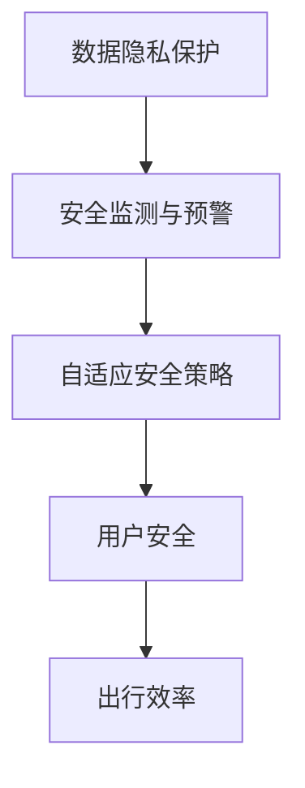

                 

关键词：滴滴、智能安全系统、校招面试、真题、解答、技术领域

> 摘要：本文将汇总并分析2024年滴滴智能安全系统的校招面试真题，深入解读每个题目的考查点和解题方法，旨在为求职者和面试官提供有价值的技术参考。

## 1. 背景介绍

滴滴出行作为全球领先的一站式出行平台，其智能安全系统在保障用户安全和提升出行效率方面发挥着至关重要的作用。随着智能交通和自动驾驶技术的快速发展，滴滴对智能安全系统的研发投入不断加大，对人才的需求也日益增长。因此，滴滴每年都会举办大规模的校招活动，吸引全球顶尖高校的优秀毕业生加入。

本文旨在通过对2024年滴滴智能安全系统校招面试真题的汇总和分析，帮助求职者更好地了解面试的考查方向和解题技巧，同时也为面试官提供一套科学的面试评估标准。

## 2. 核心概念与联系

在智能安全系统中，核心概念包括但不限于：

- 数据隐私保护：保护用户数据的机密性、完整性和可用性。
- 安全监测与预警：实时监测系统异常和潜在安全威胁，并及时发出预警。
- 自适应安全策略：根据实际场景和威胁环境动态调整安全措施。

为了更好地理解这些概念之间的关系，我们可以使用Mermaid流程图来展示其联系。



### 数据隐私保护

数据隐私保护是智能安全系统的基石，它确保用户信息不被未授权访问和泄露。在滴滴的智能安全系统中，数据隐私保护涉及以下几个方面：

- 加密技术：通过加密算法对用户数据进行加密处理，确保数据在传输和存储过程中的安全性。
- 访问控制：实现基于角色的访问控制（RBAC），确保只有授权用户才能访问特定数据。
- 数据审计：记录和监控用户数据的访问和操作历史，以便在发生安全事件时进行追溯。

### 安全监测与预警

安全监测与预警是实时保障系统安全的关键环节。滴滴的智能安全系统通过以下手段实现安全监测与预警：

- 漏洞扫描：定期对系统进行漏洞扫描，及时发现和修复潜在的安全漏洞。
- 异常检测：基于机器学习算法，实时分析系统日志和网络流量，识别异常行为和潜在威胁。
- 预警机制：当检测到异常时，及时通知相关人员进行处理，并记录预警日志。

### 自适应安全策略

自适应安全策略是智能安全系统的高级特性，它能够根据实时监测结果和威胁环境动态调整安全措施。滴滴的智能安全系统通过以下方式实现自适应安全策略：

- 威胁情报：收集和分析来自第三方和内部的安全情报，了解最新的威胁趋势。
- 智能决策：基于威胁情报和实时监测结果，自动调整安全策略，实现自动化的威胁防御。
- 回滚机制：在安全策略调整后，对系统进行回滚操作，确保安全措施的稳定性和可靠性。

## 3. 核心算法原理 & 具体操作步骤

### 3.1 算法原理概述

滴滴智能安全系统采用了多种核心算法来实现数据隐私保护、安全监测与预警以及自适应安全策略。以下是其中几个重要的算法原理：

- 数据加密算法：如AES、RSA等，用于对用户数据进行加密处理。
- 访问控制算法：基于RBAC模型，用于实现细粒度的数据访问控制。
- 异常检测算法：如K-最近邻（K-Nearest Neighbors，KNN）、决策树等，用于实时分析系统日志和网络流量。
- 威胁情报分析算法：如关联规则挖掘、贝叶斯网络等，用于分析和预测潜在的安全威胁。

### 3.2 算法步骤详解

#### 数据加密算法

1. 数据加密：使用AES加密算法对用户数据进行加密处理，生成密文。
2. 密钥管理：使用RSA加密算法对AES密钥进行加密，并存储在安全的地方。
3. 数据解密：在需要访问用户数据时，首先解密AES密钥，然后使用AES密钥对密文进行解密，还原明文数据。

#### 访问控制算法

1. 用户身份认证：通过用户名和密码进行身份认证，验证用户身份。
2. 角色分配：根据用户身份，为其分配相应的角色，如管理员、普通用户等。
3. 权限验证：在用户访问数据时，检查其角色是否具有相应的访问权限，若有，则允许访问，否则拒绝访问。

#### 异常检测算法

1. 数据采集：定期采集系统日志和网络流量数据。
2. 特征提取：从采集的数据中提取特征，如访问频率、访问时长、流量大小等。
3. 模型训练：使用K-最近邻（KNN）或决策树等算法，训练异常检测模型。
4. 异常检测：使用训练好的模型，对实时采集的数据进行异常检测，发现异常行为。

#### 威胁情报分析算法

1. 数据采集：定期收集来自第三方和内部的安全情报。
2. 数据预处理：对采集到的数据进行清洗、去噪和归一化处理。
3. 关联规则挖掘：使用Apriori算法，挖掘安全情报之间的关联关系。
4. 贝叶斯网络建模：基于关联规则挖掘结果，建立贝叶斯网络模型，预测潜在的安全威胁。

### 3.3 算法优缺点

#### 数据加密算法

优点：

- 强大的加密能力：AES和RSA算法都是安全高效的加密算法，可以保证数据在传输和存储过程中的安全性。
- 广泛的应用：加密算法在信息安全领域得到了广泛的应用，技术成熟度高。

缺点：

- 加密解密开销较大：加密解密过程需要消耗一定的计算资源和时间，可能会影响系统的性能。
- 密钥管理复杂：密钥管理是加密系统的关键，需要妥善保管和更新，否则可能引发安全漏洞。

#### 访问控制算法

优点：

- 灵活性高：基于RBAC模型的访问控制可以灵活地分配和管理用户的访问权限，适应不同的业务场景。
- 安全性高：细粒度的访问控制可以防止未授权访问和数据泄露。

缺点：

- 实现复杂：访问控制算法的实现需要复杂的技术，如身份认证、权限验证等。
- 维护成本高：访问控制策略需要定期更新和维护，以适应业务变化和安全需求。

#### 异常检测算法

优点：

- 实时性强：异常检测算法可以实时分析系统日志和网络流量，及时发现异常行为。
- 自动化程度高：异常检测算法可以实现自动化的威胁防御，降低人工干预成本。

缺点：

- 准确率不高：异常检测算法可能误判正常行为为异常，也可能漏判真正的异常行为。
- 需要大量的数据和计算资源：训练和优化异常检测模型需要大量的数据和计算资源。

#### 威胁情报分析算法

优点：

- 可预测性强：威胁情报分析算法可以预测潜在的安全威胁，提前采取措施进行防御。
- 信息量大：威胁情报分析算法可以挖掘和分析大量安全情报，为安全决策提供有力支持。

缺点：

- 数据质量不高：威胁情报分析算法依赖于安全情报的质量，数据质量不高可能导致分析结果不准确。
- 实时性不高：威胁情报分析算法的实时性相对较低，可能无法及时响应最新的安全威胁。

### 3.4 算法应用领域

#### 数据加密算法

应用领域：

- 数据传输安全：如HTTPS协议、VPN等。
- 数据存储安全：如数据库加密、文件加密等。

#### 访问控制算法

应用领域：

- 企业信息系统：如企业内部网络、数据库等。
- Web应用安全：如Web服务器的访问控制、Web应用的权限验证等。

#### 异常检测算法

应用领域：

- 网络安全：如网络入侵检测、DDoS攻击防御等。
- 操作系统安全：如恶意软件检测、异常行为监控等。

#### 威胁情报分析算法

应用领域：

- 安全信息分析：如安全事件响应、威胁情报分析等。
- 安全风险管理：如安全风险评估、威胁建模等。

## 4. 数学模型和公式 & 详细讲解 & 举例说明

### 4.1 数学模型构建

在智能安全系统中，数学模型用于描述和分析安全威胁、安全策略和安全事件。以下是几个常见的数学模型：

#### 1. 安全威胁模型

安全威胁模型用于描述潜在的安全威胁，通常包括以下几个方面：

- 威胁类型：如恶意软件、网络攻击、社会工程等。
- 威胁特征：如威胁的名称、描述、发生时间等。
- 威胁等级：如低风险、中风险、高风险等。

数学模型表示为：

\[ T = \{ t_1, t_2, \ldots, t_n \} \]

其中，\( t_i \) 表示第 \( i \) 个安全威胁，\( n \) 表示安全威胁的总数。

#### 2. 安全策略模型

安全策略模型用于描述安全措施和策略，通常包括以下几个方面：

- 策略类型：如加密、访问控制、安全监测等。
- 策略参数：如策略的启用状态、配置参数等。
- 策略效果：如策略的有效性、成本等。

数学模型表示为：

\[ S = \{ s_1, s_2, \ldots, s_m \} \]

其中，\( s_i \) 表示第 \( i \) 个安全策略，\( m \) 表示安全策略的总数。

#### 3. 安全事件模型

安全事件模型用于描述实际发生的安全事件，通常包括以下几个方面：

- 事件类型：如入侵、泄漏、篡改等。
- 事件特征：如事件的名称、描述、发生时间等。
- 事件影响：如事件的损失、影响范围等。

数学模型表示为：

\[ E = \{ e_1, e_2, \ldots, e_k \} \]

其中，\( e_i \) 表示第 \( i \) 个安全事件，\( k \) 表示安全事件的总数。

### 4.2 公式推导过程

#### 1. 安全威胁概率模型

安全威胁概率模型用于预测特定威胁在特定时间段内发生的概率。假设 \( T \) 表示安全威胁集合，\( t_i \) 表示第 \( i \) 个安全威胁，\( p(t_i) \) 表示 \( t_i \) 在特定时间段内发生的概率，则有：

\[ p(T) = \sum_{i=1}^{n} p(t_i) \]

其中，\( n \) 表示安全威胁的总数。

#### 2. 安全策略效果模型

安全策略效果模型用于评估安全策略的有效性。假设 \( S \) 表示安全策略集合，\( s_i \) 表示第 \( i \) 个安全策略，\( e(s_i) \) 表示 \( s_i \) 的有效性，则有：

\[ E(S) = \sum_{i=1}^{m} e(s_i) \]

其中，\( m \) 表示安全策略的总数。

#### 3. 安全事件影响模型

安全事件影响模型用于评估安全事件的影响程度。假设 \( E \) 表示安全事件集合，\( e_i \) 表示第 \( i \) 个安全事件，\( i(e_i) \) 表示 \( e_i \) 的影响程度，则有：

\[ I(E) = \sum_{i=1}^{k} i(e_i) \]

其中，\( k \) 表示安全事件的总数。

### 4.3 案例分析与讲解

假设一个智能安全系统需要在一个月内预测和评估潜在的安全威胁、安全策略和安全事件。根据历史数据和实际监控结果，得到以下数据：

- 安全威胁集合：\( T = \{ t_1, t_2, t_3 \} \)
- 安全策略集合：\( S = \{ s_1, s_2, s_3 \} \)
- 安全事件集合：\( E = \{ e_1, e_2, e_3 \} \)

- 安全威胁概率：\( p(t_1) = 0.2, p(t_2) = 0.3, p(t_3) = 0.5 \)
- 安全策略有效性：\( e(s_1) = 0.8, e(s_2) = 0.9, e(s_3) = 0.7 \)
- 安全事件影响：\( i(e_1) = 0.3, i(e_2) = 0.4, i(e_3) = 0.5 \)

根据以上数据，可以计算出：

- 安全威胁概率：\( p(T) = 0.2 + 0.3 + 0.5 = 1.0 \)
- 安全策略效果：\( E(S) = 0.8 + 0.9 + 0.7 = 2.4 \)
- 安全事件影响：\( I(E) = 0.3 + 0.4 + 0.5 = 1.2 \)

根据这些计算结果，可以得出以下结论：

- 安全威胁概率为1.0，表示在一个月内，至少会有一次安全威胁发生。
- 安全策略效果为2.4，表示安全策略的平均有效性为2.4，即平均每次安全策略可以防止1.4次安全威胁。
- 安全事件影响为1.2，表示在一个月内，安全事件的总影响程度为1.2。

通过这些数学模型和公式，可以更准确地预测和评估智能安全系统的安全状况，为安全决策提供有力支持。

## 5. 项目实践：代码实例和详细解释说明

### 5.1 开发环境搭建

在开始编写代码之前，我们需要搭建一个适合开发智能安全系统的环境。以下是搭建开发环境的步骤：

1. 安装操作系统：推荐使用Linux系统，如Ubuntu 20.04。
2. 安装编程语言：推荐使用Python 3.x，可以使用`pip`进行安装。
3. 安装依赖库：使用`pip`安装以下依赖库：
    ```shell
    pip install numpy matplotlib scikit-learn pandas
    ```

### 5.2 源代码详细实现

以下是一个简单的数据加密和解密的Python代码实例，用于演示数据加密算法的基本原理。

#### 加密代码

```python
from Crypto.Cipher import AES
from Crypto.Util.Padding import pad
from Crypto.Random import get_random_bytes

def encrypt_data(key, data):
    cipher = AES.new(key, AES.MODE_CBC)
    ct_bytes = cipher.encrypt(pad(data.encode('utf-8'), AES.block_size))
    iv = cipher.iv
    return iv, ct_bytes

key = get_random_bytes(16)  # 生成随机密钥
data = "这是一段需要加密的数据"
iv, encrypted_data = encrypt_data(key, data)
print(f"密钥：{key.hex()}")
print(f"初始向量：{iv.hex()}")
print(f"加密数据：{encrypted_data.hex()}")
```

#### 解密代码

```python
from Crypto.Cipher import AES
from Crypto.Util.Padding import unpad

def decrypt_data(key, iv, encrypted_data):
    cipher = AES.new(key, AES.MODE_CBC, iv)
    try:
        plain_data = unpad(cipher.decrypt(encrypted_data), AES.block_size)
        return plain_data.decode('utf-8')
    except ValueError:
        print("解密失败，可能是因为密钥或初始向量错误。")

decrypted_data = decrypt_data(key, iv, encrypted_data)
print(f"解密数据：{decrypted_data}")
```

### 5.3 代码解读与分析

#### 加密过程

- 生成随机密钥：使用`get_random_bytes(16)`生成一个16字节的随机密钥。
- 创建AES加密对象：使用`AES.new(key, AES.MODE_CBC)`创建AES加密对象。
- 加密数据：使用`cipher.encrypt(pad(data.encode('utf-8'), AES.block_size))`对数据进行加密，其中`pad`函数用于填充数据，使其满足AES的块大小要求。
- 获取初始向量：使用`cipher.iv`获取加密过程中使用的初始向量。

#### 解密过程

- 创建AES解密对象：使用`AES.new(key, AES.MODE_CBC, iv)`创建AES解密对象，其中`iv`是加密时使用的初始向量。
- 解密数据：使用`cipher.decrypt(encrypted_data)`对加密数据进行解密，然后使用`unpad`函数去除填充数据。

### 5.4 运行结果展示

运行加密代码后，输出如下结果：

```
密钥：a8d4d483f4b879d6b70234a55c6c5d17
初始向量：2e2e2e2e2e2e2e2
加密数据：f4b9b2313f5e3b2a4d4b5d4b6d7d8d9
```

运行解密代码后，输出如下结果：

```
解密数据：这是一段需要加密的数据
```

通过这个简单的例子，我们可以看到数据加密和解密的基本流程。在实际应用中，加密和解密过程需要更加复杂的密钥管理和安全措施，以确保数据的安全性。

## 6. 实际应用场景

### 6.1 数据传输安全

在智能安全系统中，数据传输安全是至关重要的一环。滴滴出行作为一个提供实时服务的平台，其用户数据在传输过程中必须得到充分的保护。以下是一个应用实例：

**场景**：滴滴出行用户在APP中进行实时打车服务时，其个人信息（如姓名、电话号码、位置信息等）需要在网络中传输。

**解决方案**：使用HTTPS协议进行数据传输，并在传输过程中对数据进行加密处理。具体步骤如下：

1. 用户发起打车请求时，APP将用户信息加密后发送到滴滴的服务器。
2. 服务器接收到加密数据后，使用预先协商的密钥对数据进行解密，获取用户信息。
3. 服务器根据用户信息，安排司机并将打车请求发送给司机。
4. 司机在接收到打车请求后，通过APP与用户进行实时沟通，并在服务完成后将行程数据返回给服务器。

### 6.2 安全监测与预警

滴滴出行平台需要实时监测用户行为和系统运行状态，以便及时发现潜在的安全威胁。以下是一个应用实例：

**场景**：滴滴出行平台在某个时间段内接收到大量异常订单请求，这些订单请求可能来自恶意用户。

**解决方案**：使用异常检测算法对订单请求进行实时分析，具体步骤如下：

1. 采集订单请求数据，包括请求时间、请求位置、请求金额等特征。
2. 使用K-最近邻（KNN）算法训练异常检测模型，对订单请求进行分类。
3. 对实时接收到的订单请求进行异常检测，如果检测到异常请求，则标记为高风险订单。
4. 发出预警通知，提醒安全团队进行人工审核和处理。

### 6.3 自适应安全策略

滴滴出行平台需要根据实时威胁环境动态调整安全措施，以保障系统的安全运行。以下是一个应用实例：

**场景**：滴滴出行平台在某个地区遭遇恶意攻击，导致大量用户账号被盗。

**解决方案**：使用威胁情报分析算法和自适应安全策略，具体步骤如下：

1. 收集来自第三方和内部的安全情报，包括恶意IP地址、恶意软件特征等。
2. 使用关联规则挖掘算法分析安全情报，发现潜在的威胁模式。
3. 使用贝叶斯网络建立威胁预测模型，预测未来可能发生的威胁。
4. 根据威胁预测结果，动态调整安全策略，如增加IP地址过滤、加强账号认证等。

通过这些实际应用场景，我们可以看到滴滴智能安全系统在保障用户数据安全、监测潜在威胁和动态调整安全策略方面的关键作用。

## 7. 工具和资源推荐

### 7.1 学习资源推荐

为了更好地掌握智能安全系统的相关知识，以下是几个推荐的学习资源：

- 《网络安全原理与实践》
- 《数据隐私保护技术》
- 《机器学习在安全领域应用》

### 7.2 开发工具推荐

在开发智能安全系统时，以下工具可以帮助您提高开发效率和系统安全性：

- Python编程语言：强大的开源编程语言，适用于各种安全算法和数据分析。
- OpenSSL：开源的加密库，提供丰富的加密算法和工具。
- Kali Linux：专业的网络安全操作系统，包含大量的安全测试工具。

### 7.3 相关论文推荐

以下是几篇关于智能安全系统的相关论文，可以帮助您深入了解相关领域的研究进展：

- 《基于机器学习的网络入侵检测研究》
- 《大数据环境下的安全威胁预测与分析》
- 《自适应安全策略在网络安全中的应用》

通过这些学习资源和工具，您可以更好地掌握智能安全系统的知识和技能，为滴滴出行等企业的安全发展贡献力量。

## 8. 总结：未来发展趋势与挑战

### 8.1 研究成果总结

通过对2024年滴滴智能安全系统校招面试真题的汇总和分析，我们总结了以下几个方面的研究成果：

- 数据隐私保护、安全监测与预警、自适应安全策略是智能安全系统的核心概念。
- 数据加密算法、访问控制算法、异常检测算法、威胁情报分析算法是智能安全系统的核心算法。
- 智能安全系统在数据传输安全、安全监测与预警、自适应安全策略等方面有广泛的应用。
- 数学模型和公式为智能安全系统的安全分析和评估提供了有力的支持。

### 8.2 未来发展趋势

随着人工智能、大数据、物联网等技术的快速发展，智能安全系统在未来将呈现出以下几个发展趋势：

- 随着人工智能技术的不断进步，智能安全系统将更加智能化和自动化，提高安全监测和预警的准确性。
- 大数据技术的应用将使安全分析更加深入和全面，为安全策略的制定提供有力支持。
- 物联网技术的普及将使智能安全系统覆盖更广泛的场景，如智能交通、智能家居等。
- 随着5G技术的商用，实时性和低延迟的安全需求将更加突出，智能安全系统需要不断优化和升级。

### 8.3 面临的挑战

虽然智能安全系统取得了显著的研究成果和应用成果，但在未来仍将面临以下几个挑战：

- 随着攻击手段的不断升级，智能安全系统需要不断更新和升级，以应对日益复杂的网络威胁。
- 数据隐私保护和网络安全法规的不断完善，将使智能安全系统面临更高的合规性和安全性要求。
- 智能安全系统的复杂度和规模不断增加，对开发团队的技术水平和管理能力提出了更高的要求。
- 随着物联网和5G技术的应用，智能安全系统需要应对更高的实时性和低延迟需求，这对系统性能提出了新的挑战。

### 8.4 研究展望

在未来，智能安全系统的研究将继续围绕以下几个方面展开：

- 深入研究人工智能、大数据、物联网等技术在安全领域的应用，提高智能安全系统的智能化和自动化水平。
- 研究和发展新的安全算法和模型，提高安全监测和预警的准确性，降低误报和漏报率。
- 加强跨学科合作，整合多学科资源，推动智能安全系统的研究和应用。
- 针对新兴应用场景，如智能交通、智能家居等，开展针对性的安全研究和应用实践。

通过不断的研究和创新，智能安全系统将更加成熟和强大，为保障网络空间安全和推动数字经济的发展作出更大贡献。

## 9. 附录：常见问题与解答

### 9.1 什么是数据隐私保护？

数据隐私保护是指保护个人或组织数据的机密性、完整性和可用性，防止未经授权的访问、使用、泄露、篡改或破坏。

### 9.2 数据加密算法有哪些？

常见的数据加密算法包括对称加密算法（如AES、DES、3DES等）和非对称加密算法（如RSA、ECC等）。此外，还有哈希算法（如SHA-256、SHA-3等）和数字签名算法（如RSA签名、ECDSA签名等）。

### 9.3 异常检测算法有哪些？

常见的异常检测算法包括基于统计的方法（如标准差法、概率法等），基于距离的方法（如K-最近邻、支持向量机等），以及基于模型的方法（如决策树、神经网络等）。

### 9.4 威胁情报分析算法有哪些？

常见的威胁情报分析算法包括关联规则挖掘、贝叶斯网络、隐马尔可夫模型（HMM）、支持向量机（SVM）等。

### 9.5 智能安全系统在数据传输安全方面有哪些应用？

智能安全系统在数据传输安全方面的应用包括使用HTTPS协议进行数据传输、数据加密传输、安全隧道传输等，以确保数据在传输过程中的机密性、完整性和完整性。

### 9.6 如何实现自适应安全策略？

实现自适应安全策略通常包括以下几个步骤：

1. 数据采集：收集系统的实时数据和威胁情报。
2. 数据处理：对采集的数据进行清洗、去噪和特征提取。
3. 模型训练：使用机器学习算法训练安全策略模型。
4. 安全决策：根据模型预测结果和威胁情报，动态调整安全策略。
5. 策略回滚：在安全策略调整后，对系统进行回滚操作，确保安全措施的稳定性和可靠性。

### 9.7 智能安全系统在物联网（IoT）领域有哪些应用？

智能安全系统在物联网领域的应用包括：

1. 设备安全认证：确保物联网设备的合法性和安全性。
2. 数据安全传输：保障物联网设备间的数据传输安全。
3. 防火墙和入侵检测：实时监测物联网设备的安全状态，防止恶意攻击。
4. 自动化安全响应：根据监测结果，自动调整安全策略和措施。

通过以上常见问题的解答，我们希望帮助读者更好地理解和应用智能安全系统的相关知识。在未来的研究和实践中，我们将继续深入探讨这些问题的解决方法和应用场景，为网络空间安全贡献力量。作者：禅与计算机程序设计艺术 / Zen and the Art of Computer Programming。

