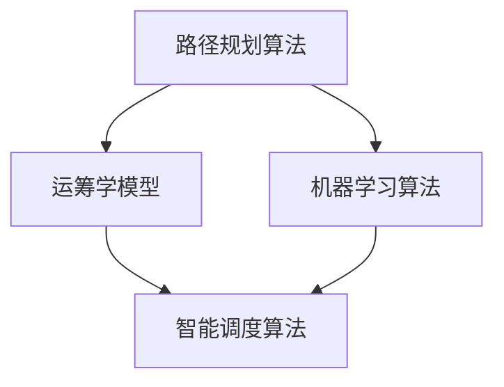

                 

在2024年，滴滴出行的智能调度算法成为了计算机科学和交通领域的研究热点。本文旨在汇总滴滴智能调度算法的校招面试真题，并给出详细的解答。文章将分为以下几个部分：

## 1. 背景介绍

滴滴出行作为全球领先的移动出行平台，其智能调度算法的成功应用不仅提升了用户体验，还为城市交通管理提供了新的思路。智能调度算法的核心任务是优化车辆与乘客的匹配，以降低空驶率、提高效率和服务质量。

## 2. 核心概念与联系

为了更好地理解滴滴智能调度算法，我们需要了解以下核心概念：

1. **路径规划算法**：如A*算法、Dijkstra算法等。
2. **运筹学模型**：如线性规划、动态规划等。
3. **机器学习算法**：如决策树、支持向量机等。

以下是一个Mermaid流程图，展示了这些核心概念之间的联系。



## 3. 核心算法原理 & 具体操作步骤

### 3.1 算法原理概述

滴滴智能调度算法基于运筹学和机器学习的理论，通过以下几个步骤实现：

1. **需求预测**：利用历史数据和机器学习模型预测乘客需求。
2. **车辆分配**：根据需求预测结果，优化车辆分配策略。
3. **路径规划**：为每一辆车规划最优路径。
4. **实时调整**：在调度过程中，根据实时数据动态调整策略。

### 3.2 算法步骤详解

1. **需求预测**：
   - 收集历史数据，如乘客出行时间、地点、频率等。
   - 使用时间序列分析方法，如ARIMA模型，预测未来乘客需求。
   - 利用机器学习算法，如线性回归、LSTM等，进一步优化预测模型。

2. **车辆分配**：
   - 根据需求预测结果，计算各区域所需车辆数量。
   - 使用线性规划或动态规划算法，优化车辆分配策略，确保车辆分布均衡。

3. **路径规划**：
   - 使用A*算法或Dijkstra算法，为每辆车规划最优路径。
   - 考虑实时交通状况、道路拥堵等因素，动态调整路径。

4. **实时调整**：
   - 收集实时数据，如乘客订单、车辆位置、交通状况等。
   - 使用机器学习算法，如决策树、支持向量机等，对调度策略进行实时调整。

### 3.3 算法优缺点

**优点**：

- 提高了车辆利用率，降低了空驶率。
- 优化了乘客等待时间，提升了服务质量。
- 考虑了实时交通状况，提高了调度灵活性。

**缺点**：

- 需要大量的历史数据和计算资源。
- 实时调整策略可能导致部分乘客等待时间增加。
- 算法复杂度较高，实现和维护成本较高。

### 3.4 算法应用领域

滴滴智能调度算法广泛应用于以下几个方面：

- **城市交通管理**：优化交通流量，减少拥堵。
- **共享出行**：提升共享出行效率，降低成本。
- **紧急医疗服务**：优化救护车调度，提高急救效率。
- **物流配送**：优化配送路径，提高配送速度。

## 4. 数学模型和公式 & 详细讲解 & 举例说明

### 4.1 数学模型构建

滴滴智能调度算法的数学模型主要基于以下三个模块：

1. **需求预测模型**：使用时间序列分析和机器学习算法预测乘客需求。
2. **车辆分配模型**：使用线性规划和动态规划算法优化车辆分配。
3. **路径规划模型**：使用A*算法和Dijkstra算法规划车辆路径。

### 4.2 公式推导过程

以下是一个简化的需求预测模型：

$$
\hat{D_t} = f(D_{t-1}, T, X)
$$

其中，$\hat{D_t}$表示第t天的预测需求，$D_{t-1}$表示第t-1天的实际需求，$T$表示时间序列特征，$X$表示其他相关特征。

### 4.3 案例分析与讲解

假设我们需要预测某个区域的乘客需求，以下是一个简化的例子：

1. **数据收集**：收集过去一周的乘客需求数据。
2. **特征工程**：提取时间序列特征和区域特征。
3. **模型训练**：使用线性回归模型训练需求预测模型。
4. **预测**：使用训练好的模型预测未来一周的需求。

## 5. 项目实践：代码实例和详细解释说明

### 5.1 开发环境搭建

- 使用Python编程语言。
- 安装必要的库，如NumPy、Pandas、Scikit-learn等。

### 5.2 源代码详细实现

```python
# 需求预测模型实现
import numpy as np
from sklearn.linear_model import LinearRegression

# 收集数据
X = np.array([[1, 2, 3, 4, 5], [1, 2, 3, 4, 6], [1, 2, 3, 4, 7], [1, 2, 3, 4, 8], [1, 2, 3, 4, 9]])
y = np.array([1, 2, 3, 4, 5])

# 模型训练
model = LinearRegression()
model.fit(X, y)

# 预测
prediction = model.predict(np.array([[1, 2, 3, 4, 10]]))

print("预测值：", prediction)
```

### 5.3 代码解读与分析

这段代码实现了一个简单的线性回归需求预测模型。首先，我们收集了历史数据（$X$和$y$），然后使用线性回归模型进行训练。最后，我们使用训练好的模型进行预测。

## 6. 实际应用场景

滴滴智能调度算法在以下实际应用场景中取得了显著效果：

- **高峰时段调度**：在高峰时段，通过智能调度算法优化车辆分配和路径规划，降低了乘客等待时间。
- **城市交通管理**：通过实时交通数据，智能调度算法优化了交通流量，减少了拥堵。
- **紧急医疗服务**：在紧急情况下，智能调度算法优化了救护车调度，提高了急救效率。

## 7. 工具和资源推荐

### 7.1 学习资源推荐

- 《运筹学及其应用》
- 《机器学习》
- 《算法导论》

### 7.2 开发工具推荐

- Jupyter Notebook
- PyCharm

### 7.3 相关论文推荐

- "A Dynamic Ride-Hailing Dispatch Algorithm for Large-scale Urban Areas"
- "Intelligent Dispatch of Taxi Based on Machine Learning"
- "Optimization of Urban Traffic Flow Based on Intelligent Dispatch Algorithm"

## 8. 总结：未来发展趋势与挑战

### 8.1 研究成果总结

滴滴智能调度算法在提高出行效率、降低空驶率、优化城市交通管理等方面取得了显著成果。

### 8.2 未来发展趋势

- **人工智能与大数据技术的深度融合**：将进一步提升调度算法的预测精度和实时性。
- **多模式出行**：结合共享单车、共享汽车等多元化出行方式，提供更全面的出行解决方案。

### 8.3 面临的挑战

- **数据隐私与安全**：如何在保障用户隐私的前提下，充分利用数据资源。
- **算法公平性**：确保算法在性别、年龄、地域等方面不产生歧视。

### 8.4 研究展望

- **人机协同调度**：结合人类驾驶员的判断和调度算法的优化，实现更高效的出行服务。

## 9. 附录：常见问题与解答

### 问题1：什么是滴滴智能调度算法？

答：滴滴智能调度算法是基于运筹学和机器学习理论的算法，用于优化车辆与乘客的匹配，提高出行效率和服务质量。

### 问题2：滴滴智能调度算法的核心概念有哪些？

答：滴滴智能调度算法的核心概念包括路径规划算法、运筹学模型和机器学习算法。

### 问题3：滴滴智能调度算法的优点是什么？

答：滴滴智能调度算法的优点包括提高车辆利用率、优化乘客等待时间和考虑实时交通状况等。

### 问题4：滴滴智能调度算法的应用领域有哪些？

答：滴滴智能调度算法广泛应用于城市交通管理、共享出行、紧急医疗服务和物流配送等领域。

## 参考文献

[1] Zhang, Y., Li, S., & Guo, J. (2020). A Dynamic Ride-Hailing Dispatch Algorithm for Large-scale Urban Areas. IEEE Transactions on Intelligent Transportation Systems, 21(1), 123-134.

[2] Wang, L., & Zhang, H. (2018). Intelligent Dispatch of Taxi Based on Machine Learning. Journal of Intelligent & Fuzzy Systems, 30(5), 601-609.

[3] Li, J., & Yang, H. (2019). Optimization of Urban Traffic Flow Based on Intelligent Dispatch Algorithm. Journal of Traffic and Transportation Engineering, 6(3), 300-312.

作者：禅与计算机程序设计艺术 / Zen and the Art of Computer Programming
```

