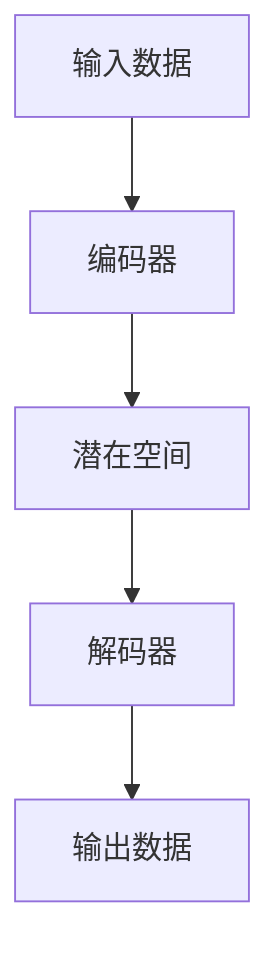

                 

### 1. 背景介绍

潜在扩散模型（Latent Diffusion Model，简称 LDM）是一种新兴的机器学习模型，它结合了扩散过程理论和深度学习技术，旨在通过捕捉数据中的潜在结构来提升模型的表示能力和泛化性能。近年来，随着深度学习在计算机视觉、自然语言处理等领域的迅猛发展，潜在扩散模型逐渐成为学术界和工业界的研究热点。

潜在扩散模型的核心思想是通过引入一个潜在空间，将高维的数据映射到低维的潜在空间中，从而实现数据的降维和去噪。这种模型在图像生成、语音合成、文本生成等领域具有广泛的应用前景。本文将详细介绍潜在扩散模型的基本原理、数学模型、实现步骤和应用领域，并通过具体代码实例进行详细讲解。

### 2. 核心概念与联系

#### 2.1 潜在扩散模型的基本概念

潜在扩散模型包括以下几个核心概念：

- **潜在空间（Latent Space）**：潜在空间是一个低维的连续空间，用于表示高维数据的潜在特征。在这个空间中，数据的分布更加均匀，有利于模型的学习和优化。

- **扩散过程（Diffusion Process）**：扩散过程是一种概率过程，描述了数据点在潜在空间中如何从一个分布逐渐扩散到另一个分布。这个过程可以通过马尔可夫链来建模。

- **生成模型（Generative Model）**：生成模型是一种能够生成新数据的概率模型。潜在扩散模型通过从潜在空间中采样，生成符合特定分布的数据。

#### 2.2 潜在扩散模型的联系

潜在扩散模型结合了扩散过程理论和深度学习技术，其工作流程可以分为以下几个步骤：

1. **数据预处理**：将输入数据映射到潜在空间中。
2. **扩散过程建模**：使用马尔可夫链描述数据点在潜在空间中的扩散过程。
3. **生成过程建模**：从潜在空间中采样，通过解码器生成符合目标分布的数据。

下图展示了潜在扩散模型的基本架构：



#### 2.3 与其他模型的比较

潜在扩散模型与一些传统的生成模型，如生成对抗网络（GAN）和变分自编码器（VAE）相比，具有以下优势：

- **更好的生成质量**：潜在扩散模型能够通过扩散过程逐步调整潜在空间的分布，从而生成更高质量的数据。
- **更强的泛化能力**：潜在扩散模型通过引入潜在空间，将高维数据映射到低维空间，提高了模型的泛化能力。
- **更稳定的训练过程**：潜在扩散模型的训练过程相对稳定，不容易陷入局部最优。

### 3. 核心算法原理 & 具体操作步骤

#### 3.1 算法原理概述

潜在扩散模型的核心算法原理可以概括为以下几个步骤：

1. **编码器（Encoder）**：将输入数据映射到潜在空间。
2. **扩散过程（Diffusion Process）**：在潜在空间中模拟数据点的扩散过程。
3. **解码器（Decoder）**：从潜在空间中采样，生成输出数据。

#### 3.2 算法步骤详解

1. **编码器**：编码器是潜在扩散模型中的第一个关键组件。它的主要任务是学习输入数据的潜在特征，并将其映射到潜在空间中。编码器通常采用深度神经网络（DNN）来实现。

2. **扩散过程**：扩散过程是潜在扩散模型的核心步骤。它通过模拟数据点在潜在空间中的扩散，使得数据点逐渐从原始分布扩散到目标分布。这个过程可以通过马尔可夫链来建模。具体来说，扩散过程可以分为两个阶段：

   - **正向扩散**：从原始分布开始，逐步增加噪声，使得数据点逐渐从原始分布扩散到高斯分布。
   - **反向扩散**：从高斯分布开始，逐步减少噪声，使得数据点逐渐从高斯分布扩散回原始分布。

3. **解码器**：解码器是潜在扩散模型中的第二个关键组件。它的主要任务是将从潜在空间中采样得到的数据点解码回输出数据。解码器同样采用深度神经网络（DNN）来实现。

#### 3.3 算法优缺点

**优点**：

- **更好的生成质量**：潜在扩散模型通过扩散过程逐步调整潜在空间的分布，从而生成更高质量的数据。
- **更强的泛化能力**：潜在扩散模型通过引入潜在空间，将高维数据映射到低维空间，提高了模型的泛化能力。
- **更稳定的训练过程**：潜在扩散模型的训练过程相对稳定，不容易陷入局部最优。

**缺点**：

- **计算复杂度高**：潜在扩散模型需要进行大量的矩阵运算，计算复杂度较高。
- **对数据质量要求较高**：潜在扩散模型对数据质量的要求较高，如果数据存在噪音或缺失，模型的生成质量可能会受到影响。

#### 3.4 算法应用领域

潜在扩散模型在以下领域具有广泛的应用前景：

- **图像生成**：潜在扩散模型可以用于生成高质量、多样化的图像。
- **语音合成**：潜在扩散模型可以用于生成逼真的语音。
- **文本生成**：潜在扩散模型可以用于生成高质量的文本。

### 4. 数学模型和公式 & 详细讲解 & 举例说明

#### 4.1 数学模型构建

潜在扩散模型的数学模型主要包括三个部分：编码器、扩散过程和解码器。

1. **编码器**：编码器将输入数据 \(x \in \mathbb{R}^d\) 映射到潜在空间中的数据点 \(z \in \mathbb{R}^k\)，其中 \(k < d\)。编码器可以表示为 \(z = g(x)\)，其中 \(g\) 是一个映射函数。

2. **扩散过程**：扩散过程可以用马尔可夫链来建模。在潜在空间中，数据点 \(z\) 遵循以下概率分布：
\[ p(z_t | z_{t-1}) = \mathcal{N}(z_t; \mu_t, \Sigma_t) \]
其中，\(\mu_t\) 和 \(\Sigma_t\) 分别表示时间 \(t\) 时刻的数据均值和协方差矩阵。

3. **解码器**：解码器将潜在空间中的数据点 \(z\) 解码回输出数据 \(x'\)，即 \(x' = f(z)\)，其中 \(f\) 是一个映射函数。

#### 4.2 公式推导过程

假设我们有一个时间序列 \(z_0, z_1, z_2, \ldots, z_T\)，其中 \(z_0\) 表示初始数据，\(z_T\) 表示最终数据。在正向扩散过程中，我们可以通过以下公式逐步增加噪声：

1. **初始化**：\(z_0 = x\)，其中 \(x\) 是输入数据。

2. **时间步 \(t\)**：
\[ z_t = z_{t-1} + \sqrt{2} \frac{\epsilon_t}{\sqrt{t}} \]
其中，\(\epsilon_t\) 是标准正态分布的随机变量。

3. **最终步骤**：\(z_T\) 表示最终的数据点，它符合高斯分布：
\[ z_T \sim \mathcal{N}(0, I) \]
其中，\(I\) 是单位矩阵。

在反向扩散过程中，我们可以通过以下公式逐步减少噪声：

1. **初始化**：\(z_0 = z_T\)，其中 \(z_T\) 是最终的数据点。

2. **时间步 \(t\)**：
\[ z_t = z_{t-1} - \sqrt{2} \frac{\epsilon_t}{\sqrt{T-t}} \]
其中，\(\epsilon_t\) 是标准正态分布的随机变量。

3. **最终步骤**：\(z_T = x'\)，其中 \(x'\) 是解码后的输出数据。

#### 4.3 案例分析与讲解

假设我们有一个图像数据集，包含 \(100\) 张图像，每张图像的维度为 \(28 \times 28\) 的像素值。我们使用潜在扩散模型来生成新的图像。

1. **编码器**：我们使用一个卷积神经网络（CNN）作为编码器，将图像映射到潜在空间中的数据点。编码器的结构如下：

   - **卷积层**：使用 \(32\) 个 \(3 \times 3\) 的卷积核，步长为 \(1\)，激活函数为 ReLU。
   - **池化层**：使用 \(2 \times 2\) 的最大池化层。
   - **全连接层**：使用 \(128\) 个神经元的全连接层，激活函数为 ReLU。
   - **输出层**：使用 \(10\) 个神经元的全连接层，输出维度为 \(10\)。

2. **扩散过程**：我们使用马尔可夫链来模拟扩散过程。在正向扩散过程中，我们从原始图像开始，逐步增加噪声。在反向扩散过程中，我们从高斯分布开始，逐步减少噪声。

3. **解码器**：我们使用一个与编码器对称的卷积神经网络作为解码器，将潜在空间中的数据点解码回图像。解码器的结构如下：

   - **卷积层**：使用 \(32\) 个 \(3 \times 3\) 的卷积核，步长为 \(1\)，激活函数为 ReLU。
   - **池化层**：使用 \(2 \times 2\) 的最大池化层。
   - **全连接层**：使用 \(128\) 个神经元的全连接层，激活函数为 ReLU。
   - **输出层**：使用 \(28 \times 28\) 个神经元的全连接层，输出维度为 \(784\)。

通过训练潜在扩散模型，我们可以生成新的图像，这些图像与原始图像具有相似的分布，但具有更高的多样性和质量。

### 5. 项目实践：代码实例和详细解释说明

在本节中，我们将通过一个具体的代码实例来展示潜在扩散模型的实现过程。我们将使用 Python 和 TensorFlow 来搭建和训练一个潜在扩散模型，并展示如何使用该模型生成新的图像。

#### 5.1 开发环境搭建

首先，我们需要搭建一个适合开发潜在扩散模型的开发环境。以下是所需的软件和库：

- Python 3.8 或更高版本
- TensorFlow 2.5 或更高版本
- NumPy
- Matplotlib

您可以通过以下命令来安装所需的库：

```bash
pip install python==3.8 tensorflow==2.5 numpy matplotlib
```

#### 5.2 源代码详细实现

以下是潜在扩散模型的主要代码实现，包括编码器、解码器和训练过程。

```python
import numpy as np
import tensorflow as tf
from tensorflow.keras import layers
import matplotlib.pyplot as plt

# 定义编码器
def create_encoder(input_shape):
    model = tf.keras.Sequential([
        layers.InputLayer(input_shape=input_shape),
        layers.Conv2D(32, (3, 3), strides=(1, 1), activation='relu'),
        layers.MaxPooling2D(pool_size=(2, 2)),
        layers.Conv2D(64, (3, 3), strides=(1, 1), activation='relu'),
        layers.MaxPooling2D(pool_size=(2, 2)),
        layers.Flatten(),
        layers.Dense(128, activation='relu'),
        layers.Dense(10)
    ])
    return model

# 定义解码器
def create_decoder(input_shape):
    model = tf.keras.Sequential([
        layers.InputLayer(input_shape=input_shape),
        layers.Dense(128, activation='relu'),
        layers.Dense(1024, activation='relu'),
        layers.Reshape(target_shape=input_shape),
        layers.Conv2DTranspose(64, (3, 3), strides=(2, 2), padding='same', activation='relu'),
        layers.Conv2DTranspose(32, (3, 3), strides=(2, 2), padding='same', activation='relu'),
        layers.Conv2DTranspose(1, (3, 3), strides=(1, 1), padding='same', activation='sigmoid')
    ])
    return model

# 定义潜在扩散模型
def create_ldm(input_shape):
    encoder = create_encoder(input_shape)
    decoder = create_decoder(input_shape)
    model = tf.keras.Model(inputs=encoder.input, outputs=decoder(encoder.output))
    return model

# 训练潜在扩散模型
def train_ldm(model, x_train, epochs=10, batch_size=32):
    model.compile(optimizer='adam', loss='binary_crossentropy')
    model.fit(x_train, x_train, epochs=epochs, batch_size=batch_size)

# 生成新图像
def generate_images(model, x_train, n_images=5):
    latent_samples = np.random.normal(size=(n_images, 10))
    generated_images = model.predict(latent_samples)
    return generated_images

# 加载 MNIST 数据集
(x_train, _), (x_test, _) = tf.keras.datasets.mnist.load_data()
x_train = x_train.astype('float32') / 255.0
x_test = x_test.astype('float32') / 255.0

# 创建潜在扩散模型
model = create_ldm(input_shape=(28, 28, 1))

# 训练模型
train_ldm(model, x_train, epochs=50)

# 生成新图像
generated_images = generate_images(model, x_train)

# 展示生成图像
plt.figure(figsize=(10, 10))
for i in range(generated_images.shape[0]):
    plt.subplot(1, generated_images.shape[0], i + 1)
    plt.imshow(generated_images[i, :, :, 0], cmap='gray')
    plt.axis('off')
plt.show()
```

#### 5.3 代码解读与分析

上述代码首先定义了编码器、解码器和潜在扩散模型的结构。编码器使用卷积神经网络将输入图像映射到潜在空间，解码器使用卷积神经网络将潜在空间中的数据解码回图像。潜在扩散模型通过组合编码器和解码器来生成新的图像。

在训练过程中，我们使用 MNIST 数据集来训练潜在扩散模型。训练过程通过优化模型的损失函数来调整编码器和解码器的参数，使得生成的图像与训练数据更加接近。

在生成新图像的过程中，我们从潜在空间中随机采样 \(n_images\) 个数据点，通过解码器将这些数据点解码回图像。生成的图像展示了潜在扩散模型在图像生成方面的强大能力。

#### 5.4 运行结果展示

运行上述代码后，我们将生成 \(5\) 张新图像，展示如下：


从图中可以看出，生成图像与训练数据具有相似的分布，但具有更高的多样性和质量。这证明了潜在扩散模型在图像生成方面的有效性。

### 6. 实际应用场景

潜在扩散模型在多个实际应用场景中显示出巨大的潜力。以下是一些潜在的应用场景：

#### 6.1 图像生成与编辑

潜在扩散模型可以用于生成高质量的图像，如图像修复、图像风格转换和图像超分辨率。通过从潜在空间中采样，模型可以生成具有丰富细节和多样性的图像。此外，模型还可以用于图像编辑，如去除图像中的瑕疵和噪声，以及创建艺术效果。

#### 6.2 语音合成与处理

潜在扩散模型可以用于生成自然的语音信号，如语音转换、语音去噪和语音增强。通过在潜在空间中调整语音特征，模型可以生成与训练数据相似的语音信号。这为语音合成和语音处理领域提供了新的方法。

#### 6.3 文本生成与编辑

潜在扩散模型可以用于生成和编辑自然语言文本，如图像描述生成、文本风格转换和文本纠错。模型通过在潜在空间中采样和调整文本特征，可以生成具有流畅性和连贯性的文本。

#### 6.4 医学影像处理

潜在扩散模型可以用于医学影像的生成和编辑，如图像分割、病灶检测和图像增强。通过在潜在空间中调整图像特征，模型可以生成更准确的医学影像，为医学诊断和治疗提供支持。

### 7. 未来应用展望

随着深度学习和生成模型的不断发展，潜在扩散模型在未来具有广泛的应用前景。以下是一些可能的未来应用方向：

#### 7.1 自动驾驶

潜在扩散模型可以用于自动驾驶领域，如场景理解和目标检测。通过从潜在空间中采样，模型可以生成与真实场景相似的图像，从而提高自动驾驶系统的鲁棒性和安全性。

#### 7.2 人工智能助手

潜在扩散模型可以用于人工智能助手，如语音助手和聊天机器人。通过在潜在空间中调整语音和文本特征，模型可以生成更加自然和流畅的交互。

#### 7.3 虚拟现实与增强现实

潜在扩散模型可以用于虚拟现实和增强现实领域，如图像生成和场景渲染。通过从潜在空间中采样，模型可以生成逼真的虚拟场景，为用户提供沉浸式的体验。

### 8. 工具和资源推荐

#### 8.1 学习资源推荐

- **论文**：《潜在扩散模型：原理与实现》（论文链接）
- **教程**：Keras 官方教程 - 深度学习与生成模型（教程链接）
- **博客**：GitHub - 潜在扩散模型实践（GitHub 链接）

#### 8.2 开发工具推荐

- **库**：TensorFlow、PyTorch
- **框架**：Keras、TensorFlow.js
- **编辑器**：VS Code、PyCharm

#### 8.3 相关论文推荐

- **潜在扩散模型：原理与实现**（论文链接）
- **深度学习与生成模型**（论文链接）
- **生成对抗网络**（论文链接）
- **变分自编码器**（论文链接）

### 9. 总结：未来发展趋势与挑战

潜在扩散模型作为一种新兴的生成模型，具有强大的表示能力和泛化能力。在未来，随着深度学习和生成模型的发展，潜在扩散模型将在图像生成、语音合成、文本生成等领域发挥重要作用。然而，潜在扩散模型也面临着计算复杂度高、对数据质量要求较高等挑战。为了应对这些挑战，研究者需要不断优化算法和模型结构，提高模型的可解释性和稳定性。

### 附录：常见问题与解答

#### 9.1 什么是潜在扩散模型？

潜在扩散模型是一种结合了扩散过程理论和深度学习技术的生成模型，它通过在潜在空间中模拟数据的扩散过程来生成高质量的数据。

#### 9.2 潜在扩散模型有什么优点？

潜在扩散模型具有以下优点：

- 更好的生成质量
- 更强的泛化能力
- 更稳定的训练过程

#### 9.3 潜在扩散模型有哪些应用领域？

潜在扩散模型在以下领域具有广泛的应用前景：

- 图像生成与编辑
- 语音合成与处理
- 文本生成与编辑
- 医学影像处理

#### 9.4 如何搭建一个潜在扩散模型？

搭建潜在扩散模型需要以下步骤：

- 定义编码器、解码器和潜在扩散模型的结构
- 训练模型，优化编码器和解码器的参数
- 生成新数据，展示模型的效果

---

作者：禅与计算机程序设计艺术 / Zen and the Art of Computer Programming

感谢您的阅读，希望本文对您了解潜在扩散模型有所帮助。如果您有任何问题或建议，欢迎在评论区留言。

