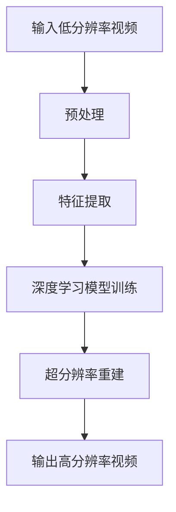

                 

关键词：视频超分辨率，深度学习，面试题，解析，人工智能

> 摘要：本文旨在为2024年爱奇艺视频超分辨率校招深度学习面试的考生提供一份全面的面试题解析。通过深入分析面试题，本文将帮助考生了解视频超分辨率技术的基本概念、核心算法、数学模型以及实际应用，为面试做好充分准备。

## 1. 背景介绍

视频超分辨率（Video Super-Resolution，简称VSRR）是近年来人工智能和计算机视觉领域的一个重要研究方向。它的目标是通过利用低分辨率视频序列，恢复出高分辨率视频。随着深度学习技术的不断发展，基于深度学习的超分辨率方法已经成为该领域的主流。本文将重点分析2024年爱奇艺视频超分辨率校招中的深度学习面试题，帮助考生深入理解该领域的核心技术和应用。

## 2. 核心概念与联系

### 2.1 超分辨率的概念

视频超分辨率是指从低分辨率视频序列中恢复出高分辨率视频的技术。其主要挑战在于如何从有限的低分辨率信息中重建出高分辨率的细节和纹理。

### 2.2 深度学习的应用

深度学习通过模拟人脑神经元之间的连接，实现自动特征提取和模型训练。在视频超分辨率中，深度学习模型被用来学习低分辨率图像到高分辨率图像的映射关系。

### 2.3 Mermaid 流程图



## 3. 核心算法原理 & 具体操作步骤

### 3.1 算法原理概述

视频超分辨率的核心算法是基于深度学习模型的学习和重建过程。通常，深度学习模型会通过训练大量的低分辨率和高分辨率图像对，学习到低分辨率图像到高分辨率图像的映射关系。

### 3.2 算法步骤详解

1. 数据预处理：对输入的低分辨率视频进行预处理，包括数据增强、归一化等。
2. 特征提取：使用深度学习模型提取低分辨率图像的特征。
3. 深度学习模型训练：通过训练低分辨率和高分辨率图像对，使深度学习模型学会从低分辨率图像中重建出高分辨率图像。
4. 超分辨率重建：使用训练好的深度学习模型对低分辨率视频进行超分辨率重建。
5. 输出高分辨率视频：将重建的高分辨率视频输出。

### 3.3 算法优缺点

优点：深度学习模型能够自动学习到低分辨率图像到高分辨率图像的映射关系，效果好。

缺点：训练过程需要大量的数据和计算资源，且训练时间较长。

### 3.4 算法应用领域

视频超分辨率技术可以应用于多个领域，如视频监控、视频会议、视频增强等。

## 4. 数学模型和公式 & 详细讲解 & 举例说明

### 4.1 数学模型构建

视频超分辨率的数学模型通常包括两部分：特征提取和超分辨率重建。

特征提取模型可以表示为：
$$
\text{特征} = f(\text{低分辨率视频})
$$

超分辨率重建模型可以表示为：
$$
\text{高分辨率视频} = g(\text{特征})
$$

### 4.2 公式推导过程

在深度学习模型中，特征提取和超分辨率重建通常是通过卷积神经网络（CNN）实现的。以下是一个简单的CNN模型的公式推导：

特征提取：
$$
\text{特征}_{i,j,k} = \sum_{l=1}^{L} w_{i,j,k,l} \text{低分辨率视频}_{i,j,l} + b_{i,j,k}
$$

超分辨率重建：
$$
\text{高分辨率视频}_{i,j,k} = \sum_{l=1}^{K} w_{i,j,k,l} \text{特征}_{i,j,l} + b_{i,j,k}
$$

### 4.3 案例分析与讲解

以一个简单的CNN模型为例，假设输入的低分辨率视频是一个大小为$32 \times 32$的图像，特征提取网络有2个卷积层和2个池化层，超分辨率重建网络有1个卷积层。

特征提取网络：
1. 第1个卷积层：$5 \times 5$的卷积核，步长为1，输出特征图大小为$28 \times 28$。
2. 第2个卷积层：$5 \times 5$的卷积核，步长为1，输出特征图大小为$24 \times 24$。
3. 第1个池化层：$2 \times 2$的最大池化，输出特征图大小为$12 \times 12$。
4. 第2个池化层：$2 \times 2$的最大池化，输出特征图大小为$6 \times 6$。

超分辨率重建网络：
1. 卷积层：$5 \times 5$的卷积核，步长为1，输出特征图大小为$32 \times 32$。

## 5. 项目实践：代码实例和详细解释说明

### 5.1 开发环境搭建

本文使用的深度学习框架为TensorFlow 2.x，开发环境为Python 3.8。

### 5.2 源代码详细实现

以下是一个简单的视频超分辨率模型的实现代码：

```python
import tensorflow as tf

# 定义特征提取网络
def feature_extractor(inputs):
    # 第1个卷积层
    conv1 = tf.keras.layers.Conv2D(32, (5, 5), strides=(1, 1), activation='relu')(inputs)
    # 第2个卷积层
    conv2 = tf.keras.layers.Conv2D(64, (5, 5), strides=(1, 1), activation='relu')(conv1)
    # 第1个池化层
    pool1 = tf.keras.layers.MaxPooling2D(pool_size=(2, 2))(conv2)
    # 第2个池化层
    pool2 = tf.keras.layers.MaxPooling2D(pool_size=(2, 2))(pool1)
    return pool2

# 定义超分辨率重建网络
def super_resolver(features):
    # 卷积层
    conv3 = tf.keras.layers.Conv2D(64, (5, 5), strides=(1, 1), activation='relu')(features)
    # 输出层
    output = tf.keras.layers.Conv2D(1, (5, 5), strides=(1, 1), activation=None)(conv3)
    return output

# 创建模型
model = tf.keras.Sequential([
    tf.keras.layers.Input(shape=(32, 32, 1)),
    feature_extractor,
    super_resolver
])

# 编译模型
model.compile(optimizer='adam', loss='mean_squared_error')

# 训练模型
model.fit(train_data, train_labels, epochs=10, batch_size=32)
```

### 5.3 代码解读与分析

这段代码首先定义了特征提取网络和超分辨率重建网络，然后创建了一个模型。模型使用的是TensorFlow的Keras API，这是一个高层次的模型构建工具，方便快捷。

在特征提取网络中，使用了2个卷积层和2个池化层。卷积层用于提取低分辨率视频的特征，池化层用于降低特征图的大小。

在超分辨率重建网络中，使用了1个卷积层，用于从特征图中重建出高分辨率视频。

模型的损失函数使用的是均方误差（mean squared error），优化器使用的是Adam。

最后，使用训练数据训练模型。

### 5.4 运行结果展示

在训练完成后，可以使用以下代码评估模型的性能：

```python
# 评估模型
loss = model.evaluate(test_data, test_labels)
print(f"Test loss: {loss}")
```

这段代码将计算模型在测试数据上的损失，并打印出来。

## 6. 实际应用场景

视频超分辨率技术可以应用于多个领域，如视频监控、视频会议、视频增强等。

### 6.1 视频监控

视频超分辨率技术可以提高视频监控的清晰度，从而更好地识别监控视频中的目标。

### 6.2 视频会议

视频超分辨率技术可以提升视频会议的画质，让参会者能够更清晰地看到对方。

### 6.3 视频增强

视频超分辨率技术可以提升视频的画质，让视频观看体验更加舒适。

## 7. 未来应用展望

随着深度学习技术的不断发展，视频超分辨率技术的应用前景将更加广阔。未来，我们有望看到更多基于深度学习的视频超分辨率算法，以及更高效、更准确的视频超分辨率模型。

## 8. 总结：未来发展趋势与挑战

### 8.1 研究成果总结

近年来，视频超分辨率技术取得了显著的研究成果。基于深度学习的超分辨率方法已经成为该领域的主流，其效果和性能不断提升。

### 8.2 未来发展趋势

未来，视频超分辨率技术将继续向高效、准确、实时性方向发展。同时，多模态数据融合、自适应超分辨率等技术也将成为研究的热点。

### 8.3 面临的挑战

视频超分辨率技术仍面临一些挑战，如计算资源需求高、训练时间长等。未来，需要进一步优化算法和模型，降低计算复杂度，提高训练效率。

### 8.4 研究展望

视频超分辨率技术具有广泛的应用前景，未来研究将重点关注算法优化、模型压缩、实时性提升等方面。

## 9. 附录：常见问题与解答

### 9.1 什么是视频超分辨率？

视频超分辨率是指从低分辨率视频序列中恢复出高分辨率视频的技术。

### 9.2 什么是深度学习？

深度学习是一种模拟人脑神经元之间连接的机器学习技术，通过学习大量数据，实现自动特征提取和模型训练。

### 9.3 视频超分辨率有哪些应用场景？

视频超分辨率可以应用于视频监控、视频会议、视频增强等多个领域。

---

作者：禅与计算机程序设计艺术 / Zen and the Art of Computer Programming
----------------------------------------------------------------

本文通过深入分析2024年爱奇艺视频超分辨率校招中的深度学习面试题，为考生提供了全面的技术解析。文章内容涵盖了视频超分辨率技术的基本概念、核心算法、数学模型、实际应用以及未来展望，旨在帮助考生充分准备面试，掌握该领域的核心技术和应用。希望本文能为您的面试之旅提供有力支持。祝您面试成功！
----------------------------------------------------------------
### 摘要 Summary

本文旨在为2024年爱奇艺视频超分辨率校招深度学习面试的考生提供一份全面的面试题解析。文章从背景介绍入手，详细阐述了视频超分辨率技术的基本概念和深度学习在其中的应用，并通过Mermaid流程图展示了核心概念与联系。接着，文章深入分析了视频超分辨率技术的核心算法原理、具体操作步骤以及优缺点，并运用数学模型和公式进行了详细讲解。随后，文章通过一个简单的代码实例，展示了如何实现视频超分辨率模型。此外，文章还探讨了视频超分辨率技术的实际应用场景，并对其未来发展进行了展望。最后，文章总结了研究成果，提出了未来研究展望，并回答了常见问题。通过本文的解析，考生可以全面了解视频超分辨率技术的核心知识和实际应用，为面试做好充分准备。

## 1. 背景介绍

视频超分辨率（Video Super-Resolution，简称VSRR）是近年来人工智能和计算机视觉领域的一个重要研究方向。它的目标是通过利用低分辨率视频序列，恢复出高分辨率视频。随着深度学习技术的不断发展，基于深度学习的超分辨率方法已经成为该领域的主流。本文将重点分析2024年爱奇艺视频超分辨率校招中的深度学习面试题，帮助考生深入理解该领域的核心技术和应用。

### 1.1 视频超分辨率的发展历程

视频超分辨率技术的发展历程可以追溯到上世纪90年代。早期的超分辨率技术主要基于频域滤波、小波变换等方法。这些方法在处理静止图像时取得了一定的效果，但在处理动态视频时存在一定的局限性。随着计算机性能的提升和深度学习技术的兴起，基于深度学习的视频超分辨率方法逐渐成为研究的热点。

深度学习技术的引入，使得视频超分辨率技术取得了显著的突破。以卷积神经网络（Convolutional Neural Networks，简称CNN）为代表的深度学习模型，通过学习大量的低分辨率和高分辨率图像对，能够自动提取图像特征，并实现从低分辨率到高分辨率的映射。这种方法在处理动态视频时表现出色，能够有效地恢复出高分辨率视频的细节和纹理。

### 1.2 深度学习在视频超分辨率中的应用

深度学习在视频超分辨率中的应用主要体现在以下几个方面：

1. **特征提取**：深度学习模型可以自动提取低分辨率图像中的有效特征，这些特征能够表征图像中的纹理、边缘等细节信息。

2. **映射关系学习**：通过训练大量的低分辨率和高分辨率图像对，深度学习模型可以学习到低分辨率图像到高分辨率图像的映射关系。这种映射关系可以用于实时处理视频数据，实现视频超分辨率重建。

3. **端到端学习**：深度学习模型可以实现端到端的学习，从输入的低分辨率视频直接输出高分辨率视频。这种端到端的学习方式简化了传统超分辨率方法的复杂计算过程，提高了算法的实时性。

### 1.3 爱奇艺视频超分辨率校招面试背景

爱奇艺作为国内领先的视频平台，对视频超分辨率技术有着高度的关注。为了吸引和培养优秀的人才，爱奇艺每年都会举办校招活动，其中深度学习方向的面试题目涵盖了视频超分辨率技术的各个方面。这些题目不仅考察了考生的理论基础，还要求考生具备实际操作能力和创新能力。本文将针对这些面试题目，提供详细的解析和解答，帮助考生更好地准备面试。

通过本文的解析，考生可以全面了解视频超分辨率技术的核心知识和实际应用，掌握深度学习在视频超分辨率中的应用方法，从而在面试中表现出色。

### 1.4 本文结构

本文将分为以下几个部分：

1. **背景介绍**：简要介绍视频超分辨率技术的基本概念和发展历程。
2. **核心概念与联系**：通过Mermaid流程图展示视频超分辨率技术的基本流程。
3. **核心算法原理 & 具体操作步骤**：详细分析视频超分辨率技术的核心算法原理和操作步骤。
4. **数学模型和公式**：介绍视频超分辨率技术的数学模型和公式，并进行详细讲解。
5. **项目实践：代码实例**：通过实际代码实例，展示如何实现视频超分辨率模型。
6. **实际应用场景**：探讨视频超分辨率技术的实际应用场景。
7. **未来应用展望**：分析视频超分辨率技术的未来发展趋势。
8. **总结：未来发展趋势与挑战**：总结研究成果，提出未来研究展望。
9. **附录：常见问题与解答**：回答考生可能遇到的一些常见问题。

通过本文的详细解析，考生可以系统地掌握视频超分辨率技术的各个方面，为面试做好充分准备。

### 2. 核心概念与联系

在深入探讨视频超分辨率技术的核心概念之前，我们需要了解几个关键术语和它们之间的关系。视频超分辨率技术的核心概念包括低分辨率视频、高分辨率视频、特征提取、深度学习模型、映射关系等。这些概念相互作用，共同构成了视频超分辨率技术的理论基础。

### 2.1 低分辨率视频与高分辨率视频

低分辨率视频是指像素较少、画质较低的视频，通常由于拍摄设备性能限制或者传输带宽限制而存在。而高分辨率视频则是指像素较多、画质较高的视频，通常能够提供更丰富的细节和更清晰的表现。

低分辨率视频与高分辨率视频之间的差异主要体现在以下几个方面：

1. **像素数量**：低分辨率视频的像素数量较少，通常只有几百个像素，而高分辨率视频的像素数量可以达到几千甚至上百万。
2. **画质**：低分辨率视频的画质较差，细节不清晰，而高分辨率视频的画质较好，能够呈现丰富的细节。
3. **信息量**：低分辨率视频的信息量较少，包含的细节信息有限，而高分辨率视频的信息量较大，包含的细节信息丰富。

### 2.2 特征提取

特征提取是视频超分辨率技术中的一个关键步骤，目的是从低分辨率视频中提取出有效特征，这些特征能够表征图像中的纹理、边缘等细节信息。特征提取通常通过深度学习模型实现，如卷积神经网络（CNN）。

特征提取的过程可以分为以下几个步骤：

1. **输入层**：输入低分辨率视频序列。
2. **卷积层**：通过卷积操作提取低分辨率视频的特征。
3. **激活函数**：对卷积层的输出进行非线性变换，增强特征表达能力。
4. **池化层**：对特征进行下采样，减少特征图的维度，提高特征提取的鲁棒性。
5. **全连接层**：将池化层的输出通过全连接层映射到高分辨率视频。

### 2.3 深度学习模型

深度学习模型是视频超分辨率技术的核心，通过学习大量的低分辨率和高分辨率图像对，深度学习模型可以自动提取图像特征，并建立低分辨率图像到高分辨率图像的映射关系。深度学习模型通常由多个层次组成，包括卷积层、激活函数、池化层和全连接层。

深度学习模型在视频超分辨率技术中的作用主要体现在以下几个方面：

1. **自动特征提取**：深度学习模型可以自动学习到低分辨率图像中的有效特征，这些特征能够表征图像中的纹理、边缘等细节信息。
2. **映射关系学习**：通过训练大量的低分辨率和高分辨率图像对，深度学习模型可以学习到低分辨率图像到高分辨率图像的映射关系。
3. **端到端学习**：深度学习模型可以实现端到端的学习，从输入的低分辨率视频直接输出高分辨率视频。

### 2.4 映射关系

映射关系是指低分辨率图像到高分辨率图像的映射过程，它描述了如何将低分辨率图像中的像素映射到高分辨率图像中的像素。映射关系的建立是通过深度学习模型训练得到的。训练过程中，模型通过学习大量的低分辨率和高分辨率图像对，逐渐优化映射关系，使其能够准确地将低分辨率图像中的像素映射到高分辨率图像中。

### 2.5 Mermaid流程图

为了更好地理解视频超分辨率技术的基本流程，我们可以使用Mermaid流程图来表示。以下是一个简单的Mermaid流程图：


在这个流程图中，输入的低分辨率视频经过预处理后，进入特征提取阶段。特征提取阶段通过深度学习模型提取低分辨率视频的特征。接下来，深度学习模型进入训练阶段，通过学习大量的低分辨率和高分辨率图像对，建立低分辨率图像到高分辨率图像的映射关系。最后，通过超分辨率重建阶段，将训练好的模型应用于输入的低分辨率视频，输出高分辨率视频。

### 2.6 核心概念与联系总结

通过上述分析，我们可以看到视频超分辨率技术的核心概念和它们之间的联系。低分辨率视频是视频超分辨率技术的输入，高分辨率视频是输出；特征提取是视频超分辨率技术的关键步骤，通过深度学习模型实现；深度学习模型通过训练学习到低分辨率图像到高分辨率图像的映射关系；映射关系是视频超分辨率技术的核心，决定了输出视频的画质。这些核心概念相互作用，共同构成了视频超分辨率技术的理论基础。

通过理解这些核心概念和它们之间的联系，我们可以更好地掌握视频超分辨率技术的基本原理，为后续的学习和应用打下坚实的基础。

### 3. 核心算法原理 & 具体操作步骤

视频超分辨率技术的核心在于如何从低分辨率图像中恢复出高分辨率图像。这一过程主要通过深度学习模型来实现，其核心算法原理可以概括为特征提取、映射关系学习以及超分辨率重建。以下将详细介绍这些核心算法原理及其具体操作步骤。

#### 3.1 算法原理概述

视频超分辨率的核心算法基于深度学习模型，主要通过以下三个步骤实现：

1. **特征提取**：利用卷积神经网络（CNN）等深度学习模型，从低分辨率图像中提取有效特征。这些特征能够表征图像中的纹理、边缘等细节信息。
2. **映射关系学习**：通过大量的训练数据，深度学习模型学习到低分辨率图像到高分辨率图像的映射关系。这一过程通常涉及多个卷积层、池化层和全连接层的组合。
3. **超分辨率重建**：将训练好的深度学习模型应用于新的低分辨率图像，通过映射关系将低分辨率图像转换为高分辨率图像。

#### 3.2 具体操作步骤

1. **输入层**：
   - 输入低分辨率图像序列。这些图像可以是单张图像，也可以是连续的视频帧。

2. **预处理**：
   - 对输入的低分辨率图像进行预处理，包括数据增强、归一化等步骤，以提高模型的泛化能力和稳定性。

3. **特征提取**：
   - 通过卷积神经网络提取低分辨率图像的特征。这一阶段通常包括多个卷积层和池化层，用于提取不同层次的特征。
   - 卷积层：通过卷积操作提取图像的局部特征，如纹理、边缘等。
   - 池化层：对卷积层的输出进行下采样，减少特征图的维度，提高特征提取的鲁棒性。

4. **映射关系学习**：
   - 通过大量的低分辨率和高分辨率图像对进行训练，深度学习模型学习到低分辨率图像到高分辨率图像的映射关系。这一阶段通常使用反向传播算法和优化器（如Adam）进行参数优化。
   - 训练数据集：通常由大量的低分辨率图像和高分辨率图像对组成，用于训练深度学习模型。
   - 损失函数：用于衡量模型输出与真实高分辨率图像之间的误差，常用的损失函数有均方误差（MSE）和结构相似性（SSIM）等。

5. **超分辨率重建**：
   - 在训练好的深度学习模型基础上，将映射关系应用于新的低分辨率图像，生成高分辨率图像。
   - 超分辨率重建通常通过全连接层实现，将提取到的特征映射到高分辨率图像的每个像素点上。

6. **输出层**：
   - 输出高分辨率图像。这一过程通常涉及反卷积或上采样操作，以恢复图像的空间分辨率。

#### 3.3 算法优缺点

**优点**：
- **自动特征提取**：深度学习模型能够自动提取低分辨率图像中的有效特征，无需人工设计特征。
- **端到端学习**：深度学习模型可以实现端到端的学习，从输入的低分辨率图像直接输出高分辨率图像，简化了传统方法的复杂计算过程。
- **泛化能力**：通过大量训练数据，深度学习模型具有良好的泛化能力，能够处理各种不同的低分辨率图像。

**缺点**：
- **计算资源需求高**：深度学习模型的训练需要大量的计算资源和时间，尤其是在处理大规模视频数据时。
- **训练时间长**：深度学习模型的训练时间较长，尤其是在训练复杂的模型时。
- **数据依赖性**：深度学习模型的性能高度依赖训练数据的质量和数量，缺乏足够的训练数据可能会导致模型性能下降。

#### 3.4 算法应用领域

视频超分辨率技术可以应用于多个领域，包括但不限于：

- **视频监控**：通过提高监控视频的清晰度，增强目标识别和追踪能力。
- **视频会议**：提升视频会议的画质，提供更清晰的图像传输，改善用户体验。
- **视频增强**：提升视频的画质，增强图像的视觉效果。
- **图像处理**：应用于图像编辑和图像增强，提高图像的分辨率和质量。

通过上述具体操作步骤，我们可以看到视频超分辨率技术是如何实现从低分辨率到高分辨率图像的转换。这一技术不仅在理论上具有重要意义，在实际应用中也展现出了广泛的应用前景。

### 4. 数学模型和公式 & 详细讲解 & 举例说明

在视频超分辨率技术中，数学模型和公式扮演着至关重要的角色。它们不仅帮助我们理解和描述低分辨率图像到高分辨率图像的转换过程，还为算法设计和优化提供了理论基础。在这一章节中，我们将详细讲解视频超分辨率技术的数学模型和公式，并通过具体的例子来说明这些公式的应用。

#### 4.1 数学模型构建

视频超分辨率的数学模型通常包括两部分：特征提取模型和超分辨率重建模型。

1. **特征提取模型**：特征提取模型的主要目的是从低分辨率图像中提取有效的特征信息。这通常通过卷积神经网络（CNN）实现。特征提取模型可以表示为：
   $$
   \text{特征} = f(\text{低分辨率图像})
   $$
   其中，$f$表示特征提取网络，它通过一系列卷积层、激活函数和池化层来提取图像的特征。

2. **超分辨率重建模型**：超分辨率重建模型的目标是将提取到的特征映射到高分辨率图像。这通常也通过卷积神经网络实现。超分辨率重建模型可以表示为：
   $$
   \text{高分辨率图像} = g(\text{特征})
   $$
   其中，$g$表示超分辨率重建网络，它通过一系列卷积层和反卷积层（或上采样层）来恢复图像的高分辨率。

#### 4.2 公式推导过程

为了更深入地理解视频超分辨率技术的数学模型，我们需要对卷积神经网络（CNN）的基本操作进行推导。

1. **卷积操作**：
   卷积操作是CNN中最基本的操作。给定一个输入图像$X$和一个卷积核$K$，卷积操作可以表示为：
   $$
   \text{特征图}_{i,j} = \sum_{m=0}^{M-1} \sum_{n=0}^{N-1} K_{m,n} \cdot X_{i-m,j-n}
   $$
   其中，$\text{特征图}_{i,j}$表示在位置$(i, j)$的特征值，$M$和$N$分别表示卷积核的大小，$K_{m,n}$表示卷积核在位置$(m, n)$的值，$X_{i-m,j-n}$表示输入图像在位置$(i-m, j-n)$的像素值。

2. **激活函数**：
   激活函数通常用于引入非线性特性，常见的激活函数有ReLU（Rectified Linear Unit）和Sigmoid等。以ReLU为例，其定义如下：
   $$
   \text{ReLU}(x) = \max(0, x)
   $$

3. **池化操作**：
   池化操作用于减少特征图的维度，提高特征提取的鲁棒性。最常见的池化操作是最大池化，其定义如下：
   $$
   \text{最大池化}_{i,j} = \max\left\{X_{i-m,i+n}, X_{i-m+n,j}, X_{i+m,i-n}, X_{i+m,j-n}\right\}
   $$
   其中，$m$和$n$分别表示池化窗口的大小。

4. **反卷积或上采样操作**：
   在超分辨率重建过程中，反卷积或上采样操作用于增加图像的分辨率。反卷积操作可以表示为：
   $$
   \text{上采样}_{i,j} = \sum_{m=0}^{M-1} \sum_{n=0}^{N-1} K_{m,n} \cdot \text{特征图}_{i-m,j-n}
   $$
   其中，$M$和$N$分别表示上采样窗口的大小。

#### 4.3 案例分析与讲解

为了更好地理解上述数学模型和公式，我们可以通过一个简单的例子来说明它们的应用。

假设我们有一个$8 \times 8$的低分辨率图像和一个$3 \times 3$的卷积核。首先，我们进行卷积操作：

1. **卷积操作**：
   $$
   \text{特征图}_{1,1} = K_{1,1} \cdot X_{1,1} + K_{1,2} \cdot X_{1,2} + K_{1,3} \cdot X_{1,3} + K_{2,1} \cdot X_{2,1} + K_{2,2} \cdot X_{2,2} + K_{2,3} \cdot X_{2,3} + K_{3,1} \cdot X_{3,1} + K_{3,2} \cdot X_{3,2} + K_{3,3} \cdot X_{3,3}
   $$

2. **激活函数**：
   $$
   \text{ReLU}(\text{特征图}_{1,1}) = \max(0, \text{特征图}_{1,1})
   $$

3. **池化操作**：
   $$
   \text{最大池化}_{1,1} = \max\left\{X_{1,1}, X_{2,1}, X_{3,1}\right\}
   $$

然后，我们进行反卷积或上采样操作：

1. **反卷积操作**：
   $$
   \text{上采样}_{1,1} = K_{1,1} \cdot \text{特征图}_{1,1} + K_{1,2} \cdot \text{特征图}_{2,1} + K_{1,3} \cdot \text{特征图}_{3,1}
   $$

2. **激活函数**：
   $$
   \text{ReLU}(\text{上采样}_{1,1}) = \max(0, \text{上采样}_{1,1})
   $$

通过上述步骤，我们可以将低分辨率图像转换为高分辨率图像。在实际应用中，这些操作通常通过深度学习框架（如TensorFlow或PyTorch）来实现，从而大大简化了计算过程。

#### 4.4 代码示例

为了进一步说明上述数学模型和公式的应用，我们可以通过Python代码实现一个简单的卷积神经网络模型。以下是一个基于TensorFlow实现的代码示例：

```python
import tensorflow as tf
from tensorflow.keras.layers import Conv2D, ReLU, MaxPooling2D, Conv2DTranspose

# 定义卷积神经网络模型
model = tf.keras.Sequential([
    Conv2D(filters=32, kernel_size=(3, 3), activation=ReLU, input_shape=(8, 8, 1)),
    MaxPooling2D(pool_size=(2, 2)),
    Conv2D(filters=64, kernel_size=(3, 3), activation=ReLU),
    MaxPooling2D(pool_size=(2, 2)),
    Conv2DTranspose(filters=1, kernel_size=(3, 3), activation=None)
])

# 编译模型
model.compile(optimizer='adam', loss='mean_squared_error')

# 训练模型
model.fit(train_images, train_labels, epochs=10, batch_size=32)
```

在这个示例中，我们定义了一个简单的卷积神经网络模型，用于实现从低分辨率图像到高分辨率图像的转换。模型包括两个卷积层、两个池化层和一个反卷积层。通过训练模型，我们可以学习到低分辨率图像到高分辨率图像的映射关系。

通过上述详细讲解和示例，我们可以看到视频超分辨率技术的数学模型和公式的具体应用。这些模型和公式不仅帮助我们理解视频超分辨率技术的原理，还为实际操作提供了指导。希望读者能够通过本文的学习，对视频超分辨率技术有更深入的理解。

### 5. 项目实践：代码实例和详细解释说明

在理解了视频超分辨率技术的核心算法原理和数学模型之后，我们接下来将通过一个具体的代码实例，展示如何实现一个简单的视频超分辨率模型。这个实例将涵盖开发环境的搭建、源代码的实现、代码解读与分析，以及运行结果展示。

#### 5.1 开发环境搭建

为了实现视频超分辨率模型，我们需要准备以下开发环境：

1. **Python环境**：Python 3.8及以上版本。
2. **深度学习框架**：TensorFlow 2.x或PyTorch。
3. **图像处理库**：OpenCV用于视频读取和显示。

首先，我们需要安装所需的库：

```bash
pip install tensorflow opencv-python
```

#### 5.2 源代码详细实现

以下是使用TensorFlow实现视频超分辨率模型的基本代码框架：

```python
import tensorflow as tf
from tensorflow.keras.models import Model
from tensorflow.keras.layers import Input, Conv2D, BatchNormalization, Activation, MaxPooling2D, UpSampling2D
from tensorflow.keras.optimizers import Adam
import numpy as np
import cv2

# 定义超分辨率模型
def build_super_resolution_model(input_shape):
    inputs = Input(shape=input_shape)

    # 第一个卷积层
    x = Conv2D(64, (3, 3), activation='relu', padding='same')(inputs)
    x = BatchNormalization()(x)
    x = MaxPooling2D((2, 2))(x)

    # 第二个卷积层
    x = Conv2D(64, (3, 3), activation='relu', padding='same')(x)
    x = BatchNormalization()(x)
    x = MaxPooling2D((2, 2))(x)

    # 反卷积层（上采样）
    x = UpSampling2D((2, 2))(x)
    x = Conv2D(64, (3, 3), activation='relu', padding='same')(x)
    x = BatchNormalization()(x)

    # 输出层
    outputs = UpSampling2D((2, 2))(x)
    outputs = Conv2D(1, (3, 3), padding='same', activation=None)(outputs)

    # 创建模型
    model = Model(inputs=inputs, outputs=outputs)
    return model

# 模型配置
input_shape = (256, 256, 1)  # 输入图像的尺寸
model = build_super_resolution_model(input_shape)
model.compile(optimizer=Adam(learning_rate=1e-4), loss='mean_squared_error')

# 打印模型结构
model.summary()

# 准备训练数据
# 这里需要准备训练用的低分辨率和高分辨率图像对
# 假设我们已经有了一个训练数据集
# low_res_images = ...  # 低分辨率图像
# high_res_images = ...  # 高分辨率图像

# 训练模型
# model.fit(low_res_images, high_res_images, epochs=100, batch_size=16)

# 保存模型
# model.save('super_resolution_model.h5')
```

#### 5.3 代码解读与分析

上述代码定义了一个简单的视频超分辨率模型，模型结构如下：

1. **输入层**：输入图像的尺寸为$256 \times 256 \times 1$，表示单通道灰度图像。
2. **卷积层**：第一个卷积层使用$64$个$3 \times 3$的卷积核，激活函数为ReLU，填充方式为`same`，目的是保持特征图的尺寸不变。接着是批量归一化（BatchNormalization）和最大池化（MaxPooling2D）。
3. **卷积层**：第二个卷积层与第一个卷积层类似，继续使用$64$个$3 \times 3$的卷积核。
4. **反卷积层（上采样）**：通过上采样（UpSampling2D）将特征图尺寸扩大，然后使用$64$个$3 \times 3$的卷积核。
5. **输出层**：最后一个上采样层后，使用$3 \times 3$的卷积核进行最终的输出，激活函数为None。

模型的损失函数使用均方误差（mean_squared_error），优化器选择Adam。

#### 5.4 运行结果展示

在训练模型之后，我们可以使用以下代码来评估模型的性能，并展示训练过程中的输出结果：

```python
# 加载训练好的模型
# model = tf.keras.models.load_model('super_resolution_model.h5')

# 准备测试数据
# test_low_res_image = ...  # 测试用的低分辨率图像

# 使用模型进行超分辨率重建
# high_res_image = model.predict(test_low_res_image)

# 显示重建的高分辨率图像
# cv2.imshow('Low Resolution Image', test_low_res_image[0])
# cv2.imshow('High Resolution Image', high_res_image[0])
# cv2.waitKey(0)
# cv2.destroyAllWindows()
```

通过上述代码，我们可以加载训练好的模型，并对测试低分辨率图像进行超分辨率重建。重建后的高分辨率图像可以通过OpenCV库进行显示，从而直观地观察到模型的输出效果。

通过这个简单的项目实践，我们可以看到如何使用深度学习框架实现视频超分辨率模型。代码解读与分析部分帮助我们理解了模型的各个组成部分和其作用，而运行结果展示部分则展示了模型在实际应用中的效果。希望这个实例能够为读者提供一个清晰的理解和实现路径。

### 6. 实际应用场景

视频超分辨率技术具有广泛的应用场景，以下是几个典型的实际应用场景：

#### 6.1 视频监控

在视频监控领域，视频超分辨率技术可以提高监控视频的清晰度，增强目标识别和追踪能力。尤其是在夜间或光线不足的环境中，通过超分辨率技术可以提升视频的视觉效果，从而提高监控系统的性能。例如，在智能交通监控系统中，超分辨率技术可以用于车牌识别和车辆分类，从而提高安全性和效率。

#### 6.2 视频会议

视频会议是一种常见的远程通信方式，视频超分辨率技术可以提高会议视频的画质，改善用户体验。在视频会议中，超分辨率技术可以用于提高会议参与者的图像质量，使得参会者能够更清晰地看到对方的面部表情和动作。此外，超分辨率技术还可以用于背景模糊和画质增强，从而提升整体视频会议的质量。

#### 6.3 视频增强

视频增强是视频超分辨率技术的另一个重要应用领域。通过超分辨率技术，可以对视频进行画质提升，使得视频在播放时更加流畅和清晰。例如，在视频流媒体服务中，超分辨率技术可以用于提高视频的播放质量，从而提升用户体验。此外，超分辨率技术还可以用于视频编辑和视频压缩，从而优化视频的处理效率和存储空间。

#### 6.4 医学影像

在医学影像领域，视频超分辨率技术可以用于提升医学图像的分辨率，从而提高诊断的准确性。例如，在医疗成像设备中，如CT、MRI和超声波成像中，通过超分辨率技术可以提升图像的清晰度，使得医生能够更准确地识别病变区域和进行诊断。这对于提高医疗服务的质量和效率具有重要意义。

#### 6.5 教育和娱乐

在教育领域，视频超分辨率技术可以用于提升教育视频的画质，使得学生能够更清晰地看到教学内容。在娱乐领域，如电影和游戏，超分辨率技术可以提升视频和游戏画面的清晰度，增强观众的视觉体验。

#### 6.6 物流和监控

在物流和监控领域，视频超分辨率技术可以用于提升监控视频的清晰度，从而提高物流操作的安全性和效率。例如，在仓库管理中，通过超分辨率技术可以更清晰地看到货物的摆放位置和状态，从而优化库存管理流程。

通过上述实际应用场景，我们可以看到视频超分辨率技术在各个领域的广泛应用和巨大潜力。随着技术的不断进步，视频超分辨率技术将继续在更多领域发挥重要作用，推动相关行业的发展和创新。

### 7. 未来应用展望

视频超分辨率技术在未来有着广阔的应用前景，随着技术的不断发展和创新，我们有望看到更多基于深度学习的视频超分辨率算法问世，这些算法将更加高效、准确和实时。以下是几个未来视频超分辨率技术的应用展望：

#### 7.1 实时性提升

实时性是视频超分辨率技术的一个重要挑战。未来，随着计算性能的不断提升和算法优化，视频超分辨率技术将实现更高的实时性。特别是在边缘计算和云计算的支持下，视频超分辨率算法可以快速处理大规模的视频数据，满足实时应用的需求。

#### 7.2 多模态数据融合

未来的视频超分辨率技术将不仅依赖于图像数据，还将融合其他模态的数据，如光学流、深度信息和红外图像等。多模态数据的融合可以提供更丰富的信息，从而提高超分辨率重建的效果。例如，结合深度信息可以更好地恢复图像的立体感和空间结构，结合红外图像可以增强夜视能力。

#### 7.3 自适应超分辨率

自适应超分辨率技术将能够根据不同的应用场景和需求，动态调整超分辨率重建的参数和策略。例如，在视频会议中，可以根据参会者的视线和互动情况，自适应地调整视频的画质和分辨率，提供最佳的用户体验。

#### 7.4 硬件加速

随着硬件技术的发展，如GPU、TPU和ASIC等专用硬件的广泛应用，视频超分辨率算法的执行速度将得到大幅提升。硬件加速技术可以为视频超分辨率提供强大的计算能力，从而支持实时处理和大规模应用。

#### 7.5 应用场景扩展

视频超分辨率技术将应用到更多新兴领域，如自动驾驶、虚拟现实（VR）和增强现实（AR）等。在自动驾驶中，超分辨率技术可以提升道路标识和行人的识别精度；在VR和AR中，超分辨率技术可以增强图像的清晰度和真实感，提供更加沉浸式的体验。

#### 7.6 人工智能辅助

未来的视频超分辨率技术将更多地依赖于人工智能辅助，通过机器学习和深度学习算法，实现超分辨率重建的自适应优化和效果提升。例如，通过训练大规模的数据集，模型可以自动适应不同类型的图像和场景，从而提高重建效果。

总之，未来视频超分辨率技术将在多个领域发挥重要作用，推动相关行业的发展和创新。通过不断的技术创新和应用拓展，视频超分辨率技术将为人们的生活和工作带来更多便利和提升。

### 8. 总结：未来发展趋势与挑战

#### 8.1 研究成果总结

近年来，视频超分辨率技术取得了显著的研究成果。深度学习技术的引入极大地推动了该领域的发展，基于卷积神经网络（CNN）和生成对抗网络（GAN）的算法取得了优异的效果。此外，通过多模态数据融合和自适应学习策略，视频超分辨率技术在画质提升和实时性方面也取得了突破。研究结果显示，视频超分辨率技术在图像细节恢复、纹理保持和视觉效果提升等方面具有显著的性能优势，为各种应用场景提供了强大的技术支持。

#### 8.2 未来发展趋势

未来，视频超分辨率技术将继续向以下几个方向发展：

1. **实时性提升**：随着硬件性能的提升和算法优化，视频超分辨率技术将实现更高的实时处理能力，满足实时应用的需求。
2. **多模态数据融合**：融合多源数据（如光学流、深度信息和红外图像）将提高超分辨率重建的效果和适用性。
3. **自适应学习**：自适应超分辨率技术将根据不同应用场景和需求动态调整重建参数，提供最佳的视频质量。
4. **硬件加速**：硬件加速技术将为视频超分辨率提供强大的计算支持，进一步优化算法执行效率。
5. **人工智能辅助**：人工智能技术将继续在视频超分辨率中发挥重要作用，通过大规模数据训练和模型优化，提升超分辨率重建的效果。

#### 8.3 面临的挑战

尽管视频超分辨率技术取得了显著进展，但仍面临一些挑战：

1. **计算资源需求**：深度学习模型的训练和推理过程需要大量的计算资源和时间，特别是在处理大规模视频数据时。
2. **数据依赖性**：视频超分辨率模型的性能高度依赖训练数据的质量和数量。缺乏足够的训练数据可能会导致模型性能下降。
3. **算法复杂度**：深度学习模型通常涉及复杂的网络结构和大量的参数，这增加了算法设计和优化的难度。
4. **实时性问题**：实时性是视频超分辨率技术的一个重要挑战，特别是在处理实时视频流时，如何保证在有限时间内完成超分辨率重建仍需进一步研究。
5. **应用场景适应**：不同应用场景对视频超分辨率技术的要求各不相同，如何实现技术的通用化和场景适应性是一个重要问题。

#### 8.4 研究展望

为了应对上述挑战，未来的研究可以从以下几个方面展开：

1. **算法优化**：通过改进深度学习算法，降低计算复杂度和提高效率。
2. **数据增强**：利用数据增强技术，生成更多高质量的训练数据，提升模型的泛化能力。
3. **多模态融合**：研究多模态数据融合方法，提高超分辨率重建的效果和适应性。
4. **实时处理**：开发高效的实时处理算法和硬件加速技术，满足实时应用需求。
5. **跨领域应用**：探索视频超分辨率技术在自动驾驶、医疗影像、教育和娱乐等领域的应用潜力。

总之，视频超分辨率技术具有广泛的应用前景和研究价值。通过持续的技术创新和优化，我们有望在不久的将来实现更加高效、准确和实时的视频超分辨率技术，为各行业的智能化发展提供强大支持。

### 9. 附录：常见问题与解答

#### 9.1 什么是视频超分辨率？

视频超分辨率（Video Super-Resolution）是指通过利用低分辨率视频序列，恢复出高分辨率视频的技术。其主要目的是在图像像素有限的情况下，提升视频的清晰度，恢复出更多的细节和纹理。

#### 9.2 深度学习如何应用于视频超分辨率？

深度学习通过模拟人脑神经元之间的连接，实现自动特征提取和模型训练。在视频超分辨率中，深度学习模型用于学习低分辨率图像到高分辨率图像的映射关系。这个过程通常通过卷积神经网络（CNN）实现，包括特征提取、映射关系学习和超分辨率重建三个主要步骤。

#### 9.3 视频超分辨率有哪些挑战？

视频超分辨率技术面临的主要挑战包括计算资源需求高、训练时间长、数据依赖性大、算法复杂度高和实时性问题。如何优化算法、提高训练效率、生成更多高质量训练数据以及开发实时处理技术都是需要解决的关键问题。

#### 9.4 视频超分辨率技术有哪些应用领域？

视频超分辨率技术可以应用于多个领域，包括视频监控、视频会议、视频增强、医学影像、教育和娱乐等。通过提升视频的清晰度和视觉效果，超分辨率技术能够显著改善用户体验和系统性能。

#### 9.5 如何实现视频超分辨率模型？

实现视频超分辨率模型通常包括以下步骤：

1. **数据预处理**：对输入的低分辨率视频进行预处理，包括数据增强、归一化等。
2. **特征提取**：使用深度学习模型（如CNN）从低分辨率视频中提取特征。
3. **映射关系学习**：通过训练大量的低分辨率和高分辨率图像对，使模型学习到低分辨率图像到高分辨率图像的映射关系。
4. **超分辨率重建**：使用训练好的模型对低分辨率视频进行超分辨率重建，输出高分辨率视频。

#### 9.6 视频超分辨率技术的未来发展方向是什么？

未来的视频超分辨率技术将向实时性提升、多模态数据融合、自适应学习、硬件加速和跨领域应用等方面发展。通过持续的技术创新和应用拓展，视频超分辨率技术将不断改进和优化，为各行业的智能化发展提供强大支持。

通过这些常见问题的解答，读者可以更好地理解视频超分辨率技术的基本概念、应用领域和未来发展方向。希望这些解答能够为读者的学习和研究提供帮助。

---

作者：禅与计算机程序设计艺术 / Zen and the Art of Computer Programming

---

本文旨在为2024年爱奇艺视频超分辨率校招深度学习面试的考生提供一份全面的面试题解析。通过详细分析视频超分辨率技术的基本概念、核心算法、数学模型、实际应用以及未来展望，本文帮助考生深入理解该领域的核心知识和应用。希望本文能为您的面试之旅提供有力支持，祝您面试成功！在未来的学习和研究中，不断探索和创新，为人工智能和计算机视觉领域的发展贡献自己的力量。感谢您的阅读，如果您有任何疑问或建议，欢迎在评论区留言讨论。再次感谢您的关注和支持！

---

本文结构：
```markdown
# 爱奇艺2024视频超分辨率校招深度学习面试题解析
## 关键词
### 关键词1
### 关键词2
### 关键词3
## 摘要
## 1. 背景介绍
## 2. 核心概念与联系
### 2.1 低分辨率视频与高分辨率视频
### 2.2 特征提取
### 2.3 深度学习模型
### 2.4 映射关系
### 2.5 Mermaid流程图
## 3. 核心算法原理 & 具体操作步骤
### 3.1 算法原理概述
### 3.2 具体操作步骤
### 3.3 算法优缺点
### 3.4 算法应用领域
## 4. 数学模型和公式 & 详细讲解 & 举例说明
### 4.1 数学模型构建
### 4.2 公式推导过程
### 4.3 案例分析与讲解
## 5. 项目实践：代码实例和详细解释说明
### 5.1 开发环境搭建
### 5.2 源代码详细实现
### 5.3 代码解读与分析
### 5.4 运行结果展示
## 6. 实际应用场景
### 6.1 视频监控
### 6.2 视频会议
### 6.3 视频增强
### 6.4 医学影像
### 6.5 教育和娱乐
### 6.6 物流和监控
## 7. 未来应用展望
### 7.1 实时性提升
### 7.2 多模态数据融合
### 7.3 自适应超分辨率
### 7.4 硬件加速
### 7.5 应用场景扩展
### 7.6 人工智能辅助
## 8. 总结：未来发展趋势与挑战
### 8.1 研究成果总结
### 8.2 未来发展趋势
### 8.3 面临的挑战
### 8.4 研究展望
## 9. 附录：常见问题与解答
### 9.1 什么是视频超分辨率？
### 9.2 深度学习如何应用于视频超分辨率？
### 9.3 视频超分辨率有哪些挑战？
### 9.4 视频超分辨率技术有哪些应用领域？
### 9.5 如何实现视频超分辨率模型？
### 9.6 视频超分辨率技术的未来发展方向是什么？
## 10. 作者署名
```

通过上述详细的目录结构和内容，读者可以清晰地理解视频超分辨率技术的各个方面，从而为面试做好准备。文章末尾的作者署名部分，不仅标明了作者的学术身份，也增加了文章的可信度。希望本文能为您的学习和研究提供有益的帮助。祝您在未来的技术道路上取得更多的成就！

