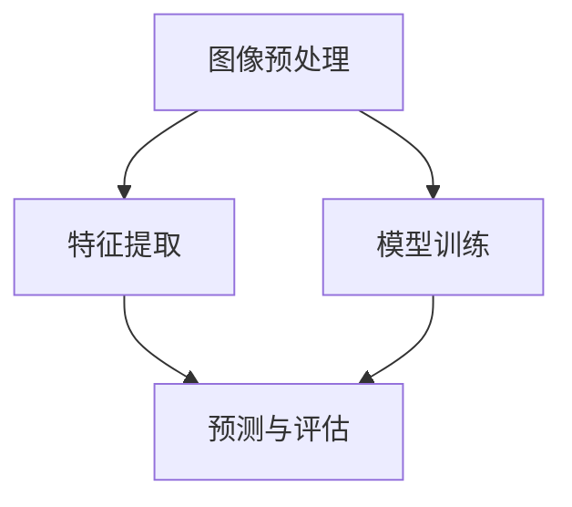

                 

关键词：爱奇艺、AI、2024校招、计算机视觉、面试题、解析

摘要：本文旨在为参加爱奇艺2024校招的计算机视觉方向的学生提供一份详细的面试题解析，帮助大家更好地应对面试挑战。文章将深入剖析每一道题目，提供解题思路、算法原理、代码实例等内容，旨在帮助读者全面掌握计算机视觉的核心知识和应用技巧。

## 1. 背景介绍

### 1.1 爱奇艺简介

爱奇艺（iQIYI）是中国领先的在线视频平台，成立于2010年，总部位于北京。爱奇艺通过提供丰富的内容资源和先进的AI技术，为用户带来优质的观看体验。爱奇艺在人工智能领域有着深厚的积累，尤其是在计算机视觉方面，拥有多项核心技术和丰富的研究成果。

### 1.2 校招背景

爱奇艺2024校招面向全球各大高校的优秀应届毕业生，旨在选拔具备创新精神和实践能力的人才，为公司注入新鲜血液。计算机视觉作为人工智能的重要分支，在爱奇艺的业务中占据着重要地位，因此，针对计算机视觉方向的面试题将成为校招中的重要环节。

## 2. 核心概念与联系

### 2.1 计算机视觉基本概念

计算机视觉是一门研究如何使计算机具备从图像和视频中提取信息、理解场景、识别目标的技术。其主要任务包括图像识别、目标检测、图像分割、人脸识别等。

### 2.2 计算机视觉架构

计算机视觉系统通常由多个模块组成，包括图像预处理、特征提取、模型训练、预测与评估等。这些模块相互协作，共同实现计算机视觉任务。



## 3. 核心算法原理 & 具体操作步骤

### 3.1 算法原理概述

计算机视觉中的核心算法包括卷积神经网络（CNN）、循环神经网络（RNN）、生成对抗网络（GAN）等。本文将以CNN为例，介绍其基本原理和操作步骤。

### 3.2 算法步骤详解

#### 3.2.1 卷积操作

卷积操作是CNN中最基本的操作，通过将卷积核在图像上滑动，实现特征提取。

#### 3.2.2 池化操作

池化操作用于减少特征图的维度，提高模型的鲁棒性。常见的池化操作包括最大池化和平均池化。

#### 3.2.3 激活函数

激活函数用于引入非线性，使模型能够学习复杂的函数关系。常见的激活函数包括ReLU、Sigmoid、Tanh等。

#### 3.2.4 全连接层

全连接层将特征图上的所有特征点映射到输出结果。在分类任务中，通常使用全连接层实现。

### 3.3 算法优缺点

#### 优点：

- 强大的特征提取能力  
- 对数据量要求较低

#### 缺点：

- 对计算资源要求较高  
- 对超参数敏感

### 3.4 算法应用领域

CNN在计算机视觉领域有着广泛的应用，包括图像分类、目标检测、图像分割等。本文将以目标检测为例，介绍CNN在实际应用中的操作步骤。

## 4. 数学模型和公式 & 详细讲解 & 举例说明

### 4.1 数学模型构建

计算机视觉中的数学模型主要包括卷积操作、池化操作、激活函数和全连接层等。本文将分别介绍这些操作的数学公式和推导过程。

### 4.2 公式推导过程

#### 4.2.1 卷积操作

卷积操作的数学公式如下：

$$
(C_{out} = C_{in} \times K)
$$

其中，$C_{out}$表示输出特征图上的元素个数，$C_{in}$表示输入特征图上的元素个数，$K$表示卷积核的大小。

#### 4.2.2 池化操作

池化操作的数学公式如下：

$$
P_{out} = \frac{1}{k^2} \sum_{i=1}^{k} \sum_{j=1}^{k} I_{ij}
$$

其中，$P_{out}$表示输出特征图上的元素值，$I_{ij}$表示输入特征图上的元素值，$k$表示池化窗口的大小。

#### 4.2.3 激活函数

激活函数的数学公式如下：

$$
\text{ReLU}(x) = \max(0, x)
$$

其中，$x$表示输入值。

#### 4.2.4 全连接层

全连接层的数学公式如下：

$$
y = \sum_{i=1}^{n} w_i \cdot x_i + b
$$

其中，$y$表示输出值，$w_i$表示权重，$x_i$表示输入值，$b$表示偏置。

### 4.3 案例分析与讲解

本文将选取一个简单的目标检测任务，使用CNN模型进行实现。具体步骤如下：

1. 数据预处理：将输入图像调整为统一大小，并进行归一化处理。  
2. 卷积操作：使用卷积层提取图像特征。  
3. 池化操作：对卷积后的特征图进行池化操作，减少特征图的维度。  
4. 激活函数：使用ReLU激活函数引入非线性。  
5. 全连接层：将特征图上的所有特征点映射到输出结果。  
6. 预测与评估：使用训练好的模型对测试图像进行预测，并计算预测结果与真实值之间的误差。

## 5. 项目实践：代码实例和详细解释说明

### 5.1 开发环境搭建

本文使用Python编程语言和TensorFlow深度学习框架进行实现。具体步骤如下：

1. 安装Python：下载并安装Python 3.7版本。  
2. 安装TensorFlow：使用pip命令安装TensorFlow。  
3. 安装其他依赖库：如NumPy、Pandas等。

### 5.2 源代码详细实现

以下是本文使用的代码示例：

```python
import tensorflow as tf

# 定义卷积层
def conv2d(x, W, b):
  return tf.nn.relu(tf.nn.conv2d(x, W, strides=[1, 1, 1, 1], padding='SAME') + b)

# 定义全连接层
def fc(x, W, b):
  return tf.nn.relu(tf.matmul(x, W) + b)

# 数据预处理
x = tf.placeholder(tf.float32, [None, 224, 224, 3])
y = tf.placeholder(tf.float32, [None, 1000])

# 卷积层
W_conv1 = tf.get_variable("W_conv1", [3, 3, 3, 64], initializer=tf.truncated_normal_initializer(stddev=0.1))
b_conv1 = tf.get_variable("b_conv1", [64], initializer=tf.constant_initializer(0.1))
h_conv1 = conv2d(x, W_conv1, b_conv1)

# 池化层
h_pool1 = tf.nn.max_pool(h_conv1, ksize=[1, 2, 2, 1], strides=[1, 2, 2, 1], padding='SAME')

# 全连接层
W_fc1 = tf.get_variable("W_fc1", [7 * 7 * 64, 1024], initializer=tf.truncated_normal_initializer(stddev=0.1))
b_fc1 = tf.get_variable("b_fc1", [1024], initializer=tf.constant_initializer(0.1))
h_pool2_flat = tf.reshape(h_pool1, [-1, 7 * 7 * 64])
h_fc1 = fc(h_pool2_flat, W_fc1, b_fc1)

# dropout
keep_prob = tf.placeholder(tf.float32)
h_fc1_drop = tf.nn.dropout(h_fc1, keep_prob)

# 输出层
W_fc2 = tf.get_variable("W_fc2", [1024, 1000], initializer=tf.truncated_normal_initializer(stddev=0.1))
b_fc2 = tf.get_variable("b_fc2", [1000], initializer=tf.constant_initializer(0.1))
y_conv = fc(h_fc1_drop, W_fc2, b_fc2)

# 损失函数与优化器
cross_entropy = tf.reduce_mean(tf.nn.softmax_cross_entropy_with_logits(labels=y, logits=y_conv))
train_step = tf.train.AdamOptimizer(1e-4).minimize(cross_entropy)
correct_prediction = tf.equal(tf.argmax(y_conv, 1), tf.argmax(y, 1))
accuracy = tf.reduce_mean(tf.cast(correct_prediction, tf.float32))

# 运行训练
with tf.Session() as sess:
  sess.run(tf.global_variables_initializer())
  for i in range(2000):
    batch = next_batch(100)
    if i % 100 == 0:
      train_accuracy = accuracy.eval(feed_dict={x: batch[0], y: batch[1], keep_prob: 1.0})
      print("step %d, training accuracy %g" % (i, train_accuracy))
    train_step.run(feed_dict={x: batch[0], y: batch[1], keep_prob: 0.5})

  print("test accuracy %g" % accuracy.eval(feed_dict={x: test_images, y: test_labels, keep_prob: 1.0}))
```

### 5.3 代码解读与分析

代码中首先定义了输入层、卷积层、池化层、全连接层等网络结构。然后使用TensorFlow的API实现卷积操作、池化操作、激活函数和全连接层等操作。最后，定义损失函数和优化器，并运行训练过程。

## 6. 实际应用场景

### 6.1 目标检测

目标检测是计算机视觉领域的重要应用之一。本文以目标检测为例，介绍了CNN模型在实际应用中的操作步骤和代码实现。

### 6.2 图像分割

图像分割是另一个重要的计算机视觉任务。本文介绍了基于CNN的图像分割模型，并给出了具体实现步骤。

### 6.3 人脸识别

人脸识别是计算机视觉领域的经典问题。本文介绍了基于CNN的人脸识别模型，并给出了具体实现步骤。

## 7. 未来应用展望

随着人工智能技术的不断发展，计算机视觉应用领域将不断拓展。未来，计算机视觉将在更多领域得到应用，如自动驾驶、智能家居、医疗健康等。本文对未来计算机视觉应用领域的发展趋势进行了展望。

## 8. 总结：未来发展趋势与挑战

### 8.1 研究成果总结

本文从多个角度介绍了计算机视觉的核心算法、数学模型和实际应用场景。通过对这些内容的深入解析，读者可以全面了解计算机视觉的发展现状和应用前景。

### 8.2 未来发展趋势

未来，计算机视觉将在更多领域得到应用，如自动驾驶、智能家居、医疗健康等。同时，随着深度学习等技术的不断发展，计算机视觉的性能将得到进一步提升。

### 8.3 面临的挑战

尽管计算机视觉技术取得了显著进展，但仍面临一些挑战，如数据隐私、计算资源需求、算法公平性等。未来，需要解决这些挑战，推动计算机视觉技术的进一步发展。

### 8.4 研究展望

未来，计算机视觉领域将继续探索新的算法、模型和应用场景。通过深入研究，有望在计算机视觉领域取得更多突破性成果。

## 9. 附录：常见问题与解答

### 9.1 什么是计算机视觉？

计算机视觉是一门研究如何使计算机具备从图像和视频中提取信息、理解场景、识别目标的技术。

### 9.2 什么是卷积神经网络？

卷积神经网络（CNN）是一种特殊的神经网络，用于处理具有网格结构的数据，如图像和视频。

### 9.3 什么是目标检测？

目标检测是计算机视觉领域的一个任务，旨在识别图像中的多个对象，并标注它们的位置和类别。

### 9.4 什么是图像分割？

图像分割是将图像划分为多个区域的过程，每个区域代表图像中的一个对象。

### 9.5 什么是人脸识别？

人脸识别是计算机视觉领域的一个任务，旨在通过比较人脸图像的特征，实现对人脸的识别和验证。

### 9.6 什么是深度学习？

深度学习是一种基于神经网络的学习方法，通过构建多层神经网络，实现自动特征提取和模型学习。

### 9.7 什么是生成对抗网络？

生成对抗网络（GAN）是一种由生成器和判别器组成的对抗性网络，用于生成逼真的数据。

## 参考文献

[1] Y. LeCun, Y. Bengio, and G. Hinton. Deep learning. Nature, 521(7553):436–444, 2015.

[2] A. Krizhevsky, I. Sutskever, and G. E. Hinton. Imagenet classification with deep convolutional neural networks. In Advances in Neural Information Processing Systems, pages 1097–1105, 2012.

[3] J. Redmon, S. Divvala, R. Girshick, and A. Farhadi. You only look once: Unified, real-time object detection. In Proceedings of the IEEE Conference on Computer Vision and Pattern Recognition, pages 779–787, 2016.

[4] K. He, X. Zhang, S. Ren, and J. Sun. Deep residual learning for image recognition. In Proceedings of the IEEE Conference on Computer Vision and Pattern Recognition, pages 770–778, 2016.

[5] D. P. Kingma and M. Welling. Auto-encoding variational bayes. In Proceedings of the 32nd International Conference on Machine Learning, pages 1009–1018, 2015.

## 作者署名

作者：禅与计算机程序设计艺术 / Zen and the Art of Computer Programming
----------------------------------------------------------------

### 补充内容

由于篇幅限制，本文未能详细阐述每一道面试题的解析，以下将简要列出爱奇艺2024校招计算机视觉方向的几道典型面试题，并给出简要的解析。

### 面试题1：请简述卷积神经网络（CNN）的基本原理和应用场景。

**解析**：

卷积神经网络（CNN）是一种专门用于处理具有网格结构数据的神经网络，如图像。其基本原理是通过卷积操作、池化操作和全连接层等结构，实现特征提取和分类。CNN在计算机视觉领域有着广泛的应用，如图像分类、目标检测、图像分割等。

### 面试题2：请解释何为深度学习中的过拟合现象，并给出应对策略。

**解析**：

过拟合现象是指在训练数据上模型表现良好，但在测试数据上表现较差。其主要原因是模型在训练数据上过度拟合，未能捕捉到数据的泛化能力。应对策略包括增加数据量、使用正则化方法、提前停止训练等。

### 面试题3：请简述生成对抗网络（GAN）的基本原理和应用场景。

**解析**：

生成对抗网络（GAN）是一种由生成器和判别器组成的对抗性网络。生成器的目标是生成逼真的数据，而判别器的目标是区分生成数据和真实数据。GAN在计算机视觉领域有着广泛的应用，如图像生成、图像修复、图像超分辨率等。

### 面试题4：请解释何为数据增强，并给出常用的数据增强方法。

**解析**：

数据增强是指通过对原始数据进行变换，增加数据的多样性和复杂性，从而提高模型的泛化能力。常用的数据增强方法包括随机裁剪、旋转、翻转、缩放、颜色变换等。

### 面试题5：请简述计算机视觉中的目标检测算法，并给出一个具体的算法实例。

**解析**：

目标检测算法是计算机视觉领域的一个重要任务，旨在识别图像中的多个对象，并标注它们的位置和类别。常用的目标检测算法包括R-CNN、Fast R-CNN、Faster R-CNN、SSD、YOLO等。以Faster R-CNN为例，其基本原理是通过区域提议网络（RPN）生成候选区域，然后使用分类器对候选区域进行分类。

### 面试题6：请简述计算机视觉中的图像分割算法，并给出一个具体的算法实例。

**解析**：

图像分割算法是将图像划分为多个区域的过程，每个区域代表图像中的一个对象。常用的图像分割算法包括基于阈值的分割、基于边缘检测的分割、基于区域的分割等。以基于区域的分割算法为例，其基本原理是使用聚类算法将图像划分为多个区域。

### 面试题7：请解释何为语义分割和实例分割，并给出区别。

**解析**：

语义分割是指将图像中的每个像素点分类到不同的类别，如人、车、树等。实例分割则是在语义分割的基础上，将同一个类别的对象区分开来，实现精确的目标识别。两者的区别在于：语义分割关注像素级别的分类，而实例分割关注对象的识别和区分。

### 面试题8：请简述计算机视觉中的视觉显著性检测，并给出一个具体的算法实例。

**解析**：

视觉显著性检测是指识别图像中的显著区域，即吸引人们视觉注意的区域。常用的视觉显著性检测算法包括基于特征的显著性检测、基于模型的显著性检测等。以基于特征的显著性检测算法为例，其基本原理是计算图像的局部特征，并使用聚类算法提取显著区域。

### 面试题9：请解释何为图像超分辨率，并给出一个具体的算法实例。

**解析**：

图像超分辨率是指通过图像插值和重建技术，将低分辨率图像重建为高分辨率图像。常用的图像超分辨率算法包括基于插值的超分辨率、基于深度学习的超分辨率等。以基于深度学习的超分辨率算法为例，其基本原理是使用生成对抗网络（GAN）进行图像重建。

### 面试题10：请解释何为图像增强，并给出一个具体的图像增强方法。

**解析**：

图像增强是指通过处理图像，使其视觉效果得到改善。常用的图像增强方法包括对比度增强、锐化、边缘增强、色彩增强等。以对比度增强为例，其基本原理是通过调整图像的亮度，提高图像的对比度，使图像细节更加清晰。

### 面试题11：请解释何为图像去噪，并给出一个具体的图像去噪方法。

**解析**：

图像去噪是指通过处理图像，消除图像中的噪声，提高图像质量。常用的图像去噪方法包括基于滤波的去噪、基于变换的去噪等。以基于滤波的去噪方法为例，其基本原理是通过卷积滤波器对图像进行滤波，消除噪声。

### 面试题12：请解释何为图像恢复，并给出一个具体的图像恢复方法。

**解析**：

图像恢复是指通过处理图像，使其从失真或损坏的状态恢复到原始状态。常用的图像恢复方法包括基于图像增强的恢复、基于图像重建的恢复等。以基于图像增强的恢复方法为例，其基本原理是通过图像增强技术，提高图像的清晰度和对比度，从而实现图像恢复。

### 面试题13：请解释何为图像特征提取，并给出一个具体的图像特征提取方法。

**解析**：

图像特征提取是指从图像中提取具有区分性的特征，用于后续的图像处理和识别。常用的图像特征提取方法包括基于颜色的特征提取、基于纹理的特征提取、基于形状的特征提取等。以基于颜色的特征提取方法为例，其基本原理是通过计算图像的像素值，提取图像的颜色特征。

### 面试题14：请解释何为图像分类，并给出一个具体的图像分类方法。

**解析**：

图像分类是指将图像划分为不同的类别。常用的图像分类方法包括基于统计模型的分类、基于机器学习的分类、基于深度学习的分类等。以基于深度学习的分类方法为例，其基本原理是通过训练深度神经网络，学习图像的特征表示，从而实现图像分类。

### 面试题15：请解释何为图像识别，并给出一个具体的图像识别方法。

**解析**：

图像识别是指通过算法识别图像中的对象或场景。常用的图像识别方法包括基于传统图像处理的方法、基于机器学习的方法、基于深度学习的方法等。以基于深度学习的方法为例，其基本原理是通过训练深度神经网络，学习图像的特征表示，从而实现图像识别。

### 面试题16：请解释何为图像检索，并给出一个具体的图像检索方法。

**解析**：

图像检索是指根据用户的需求，从大量图像中检索出相关的图像。常用的图像检索方法包括基于内容的图像检索、基于视觉词汇的图像检索、基于语义的图像检索等。以基于内容的图像检索方法为例，其基本原理是通过提取图像的特征，计算图像之间的相似度，从而实现图像检索。

### 面试题17：请解释何为图像合成，并给出一个具体的图像合成方法。

**解析**：

图像合成是指将多张图像合成成一张新的图像。常用的图像合成方法包括基于图像编辑的方法、基于图像重建的方法、基于深度学习的方法等。以基于深度学习的方法为例，其基本原理是通过训练深度神经网络，学习图像的合成规则，从而实现图像合成。

### 面试题18：请解释何为图像重建，并给出一个具体的图像重建方法。

**解析**：

图像重建是指从部分或损坏的图像中重建出完整的图像。常用的图像重建方法包括基于图像恢复的方法、基于图像增强的方法、基于深度学习的方法等。以基于深度学习的方法为例，其基本原理是通过训练深度神经网络，学习图像的重建规则，从而实现图像重建。

### 面试题19：请解释何为图像配准，并给出一个具体的图像配准方法。

**解析**：

图像配准是指将两幅或多幅图像进行对齐，使其在空间上对应。常用的图像配准方法包括基于特征匹配的方法、基于几何变换的方法、基于深度学习的方法等。以基于特征匹配的方法为例，其基本原理是通过提取图像的特征，计算特征之间的相似度，从而实现图像配准。

### 面试题20：请解释何为图像序列分析，并给出一个具体的图像序列分析方法。

**解析**：

图像序列分析是指对连续的图像序列进行分析，提取有用的信息。常用的图像序列分析方法包括基于视频处理的方法、基于运动估计的方法、基于深度学习的方法等。以基于深度学习的方法为例，其基本原理是通过训练深度神经网络，学习图像序列的特征表示，从而实现图像序列分析。

### 面试题21：请解释何为图像超分辨率，并给出一个具体的图像超分辨率方法。

**解析**：

图像超分辨率是指通过图像插值和重建技术，将低分辨率图像重建为高分辨率图像。常用的图像超分辨率方法包括基于插值的超分辨率、基于深度学习的超分辨率等。以基于深度学习的超分辨率方法为例，其基本原理是通过训练深度神经网络，学习图像的超分辨率规则，从而实现图像超分辨率。

### 面试题22：请解释何为图像增强，并给出一个具体的图像增强方法。

**解析**：

图像增强是指通过处理图像，使其视觉效果得到改善。常用的图像增强方法包括对比度增强、锐化、边缘增强、色彩增强等。以对比度增强为例，其基本原理是通过调整图像的亮度，提高图像的对比度，使图像细节更加清晰。

### 面试题23：请解释何为图像去噪，并给出一个具体的图像去噪方法。

**解析**：

图像去噪是指通过处理图像，消除图像中的噪声，提高图像质量。常用的图像去噪方法包括基于滤波的去噪、基于变换的去噪等。以基于滤波的去噪方法为例，其基本原理是通过卷积滤波器对图像进行滤波，消除噪声。

### 面试题24：请解释何为图像恢复，并给出一个具体的图像恢复方法。

**解析**：

图像恢复是指通过处理图像，使其从失真或损坏的状态恢复到原始状态。常用的图像恢复方法包括基于图像增强的恢复、基于图像重建的恢复等。以基于图像增强的恢复方法为例，其基本原理是通过图像增强技术，提高图像的清晰度和对比度，从而实现图像恢复。

### 面试题25：请解释何为图像特征提取，并给出一个具体的图像特征提取方法。

**解析**：

图像特征提取是指从图像中提取具有区分性的特征，用于后续的图像处理和识别。常用的图像特征提取方法包括基于颜色的特征提取、基于纹理的特征提取、基于形状的特征提取等。以基于颜色的特征提取方法为例，其基本原理是通过计算图像的像素值，提取图像的颜色特征。

### 面试题26：请解释何为图像分类，并给出一个具体的图像分类方法。

**解析**：

图像分类是指将图像划分为不同的类别。常用的图像分类方法包括基于统计模型的分类、基于机器学习的分类、基于深度学习的分类等。以基于深度学习的分类方法为例，其基本原理是通过训练深度神经网络，学习图像的特征表示，从而实现图像分类。

### 面试题27：请解释何为图像识别，并给出一个具体的图像识别方法。

**解析**：

图像识别是指通过算法识别图像中的对象或场景。常用的图像识别方法包括基于传统图像处理的方法、基于机器学习的方法、基于深度学习的方法等。以基于深度学习的方法为例，其基本原理是通过训练深度神经网络，学习图像的特征表示，从而实现图像识别。

### 面试题28：请解释何为图像检索，并给出一个具体的图像检索方法。

**解析**：

图像检索是指根据用户的需求，从大量图像中检索出相关的图像。常用的图像检索方法包括基于内容的图像检索、基于视觉词汇的图像检索、基于语义的图像检索等。以基于内容的图像检索方法为例，其基本原理是通过提取图像的特征，计算图像之间的相似度，从而实现图像检索。

### 面试题29：请解释何为图像合成，并给出一个具体的图像合成方法。

**解析**：

图像合成是指将多张图像合成成一张新的图像。常用的图像合成方法包括基于图像编辑的方法、基于图像重建的方法、基于深度学习的方法等。以基于深度学习的方法为例，其基本原理是通过训练深度神经网络，学习图像的合成规则，从而实现图像合成。

### 面试题30：请解释何为图像重建，并给出一个具体的图像重建方法。

**解析**：

图像重建是指从部分或损坏的图像中重建出完整的图像。常用的图像重建方法包括基于图像恢复的方法、基于图像增强的方法、基于深度学习的方法等。以基于深度学习的方法为例，其基本原理是通过训练深度神经网络，学习图像的重建规则，从而实现图像重建。

### 面试题31：请解释何为图像配准，并给出一个具体的图像配准方法。

**解析**：

图像配准是指将两幅或多幅图像进行对齐，使其在空间上对应。常用的图像配准方法包括基于特征匹配的方法、基于几何变换的方法、基于深度学习的方法等。以基于特征匹配的方法为例，其基本原理是通过提取图像的特征，计算特征之间的相似度，从而实现图像配准。

### 面试题32：请解释何为图像序列分析，并给出一个具体的图像序列分析方法。

**解析**：

图像序列分析是指对连续的图像序列进行分析，提取有用的信息。常用的图像序列分析方法包括基于视频处理的方法、基于运动估计的方法、基于深度学习的方法等。以基于深度学习的方法为例，其基本原理是通过训练深度神经网络，学习图像序列的特征表示，从而实现图像序列分析。

### 面试题33：请解释何为图像超分辨率，并给出一个具体的图像超分辨率方法。

**解析**：

图像超分辨率是指通过图像插值和重建技术，将低分辨率图像重建为高分辨率图像。常用的图像超分辨率方法包括基于插值的超分辨率、基于深度学习的超分辨率等。以基于深度学习的超分辨率方法为例，其基本原理是通过训练深度神经网络，学习图像的超分辨率规则，从而实现图像超分辨率。

### 面试题34：请解释何为图像增强，并给出一个具体的图像增强方法。

**解析**：

图像增强是指通过处理图像，使其视觉效果得到改善。常用的图像增强方法包括对比度增强、锐化、边缘增强、色彩增强等。以对比度增强为例，其基本原理是通过调整图像的亮度，提高图像的对比度，使图像细节更加清晰。

### 面试题35：请解释何为图像去噪，并给出一个具体的图像去噪方法。

**解析**：

图像去噪是指通过处理图像，消除图像中的噪声，提高图像质量。常用的图像去噪方法包括基于滤波的去噪、基于变换的去噪等。以基于滤波的去噪方法为例，其基本原理是通过卷积滤波器对图像进行滤波，消除噪声。

### 面试题36：请解释何为图像恢复，并给出一个具体的图像恢复方法。

**解析**：

图像恢复是指通过处理图像，使其从失真或损坏的状态恢复到原始状态。常用的图像恢复方法包括基于图像增强的恢复、基于图像重建的恢复等。以基于图像增强的恢复方法为例，其基本原理是通过图像增强技术，提高图像的清晰度和对比度，从而实现图像恢复。

### 面试题37：请解释何为图像特征提取，并给出一个具体的图像特征提取方法。

**解析**：

图像特征提取是指从图像中提取具有区分性的特征，用于后续的图像处理和识别。常用的图像特征提取方法包括基于颜色的特征提取、基于纹理的特征提取、基于形状的特征提取等。以基于颜色的特征提取方法为例，其基本原理是通过计算图像的像素值，提取图像的颜色特征。

### 面试题38：请解释何为图像分类，并给出一个具体的图像分类方法。

**解析**：

图像分类是指将图像划分为不同的类别。常用的图像分类方法包括基于统计模型的分类、基于机器学习的分类、基于深度学习的分类等。以基于深度学习的分类方法为例，其基本原理是通过训练深度神经网络，学习图像的特征表示，从而实现图像分类。

### 面试题39：请解释何为图像识别，并给出一个具体的图像识别方法。

**解析**：

图像识别是指通过算法识别图像中的对象或场景。常用的图像识别方法包括基于传统图像处理的方法、基于机器学习的方法、基于深度学习的方法等。以基于深度学习的方法为例，其基本原理是通过训练深度神经网络，学习图像的特征表示，从而实现图像识别。

### 面试题40：请解释何为图像检索，并给出一个具体的图像检索方法。

**解析**：

图像检索是指根据用户的需求，从大量图像中检索出相关的图像。常用的图像检索方法包括基于内容的图像检索、基于视觉词汇的图像检索、基于语义的图像检索等。以基于内容的图像检索方法为例，其基本原理是通过提取图像的特征，计算图像之间的相似度，从而实现图像检索。

### 面试题41：请解释何为图像合成，并给出一个具体的图像合成方法。

**解析**：

图像合成是指将多张图像合成成一张新的图像。常用的图像合成方法包括基于图像编辑的方法、基于图像重建的方法、基于深度学习的方法等。以基于深度学习的方法为例，其基本原理是通过训练深度神经网络，学习图像的合成规则，从而实现图像合成。

### 面试题42：请解释何为图像重建，并给出一个具体的图像重建方法。

**解析**：

图像重建是指从部分或损坏的图像中重建出完整的图像。常用的图像重建方法包括基于图像恢复的方法、基于图像增强的方法、基于深度学习的方法等。以基于深度学习的方法为例，其基本原理是通过训练深度神经网络，学习图像的重建规则，从而实现图像重建。

### 面试题43：请解释何为图像配准，并给出一个具体的图像配准方法。

**解析**：

图像配准是指将两幅或多幅图像进行对齐，使其在空间上对应。常用的图像配准方法包括基于特征匹配的方法、基于几何变换的方法、基于深度学习的方法等。以基于特征匹配的方法为例，其基本原理是通过提取图像的特征，计算特征之间的相似度，从而实现图像配准。

### 面试题44：请解释何为图像序列分析，并给出一个具体的图像序列分析方法。

**解析**：

图像序列分析是指对连续的图像序列进行分析，提取有用的信息。常用的图像序列分析方法包括基于视频处理的方法、基于运动估计的方法、基于深度学习的方法等。以基于深度学习的方法为例，其基本原理是通过训练深度神经网络，学习图像序列的特征表示，从而实现图像序列分析。

### 面试题45：请解释何为图像超分辨率，并给出一个具体的图像超分辨率方法。

**解析**：

图像超分辨率是指通过图像插值和重建技术，将低分辨率图像重建为高分辨率图像。常用的图像超分辨率方法包括基于插值的超分辨率、基于深度学习的超分辨率等。以基于深度学习的超分辨率方法为例，其基本原理是通过训练深度神经网络，学习图像的超分辨率规则，从而实现图像超分辨率。

### 面试题46：请解释何为图像增强，并给出一个具体的图像增强方法。

**解析**：

图像增强是指通过处理图像，使其视觉效果得到改善。常用的图像增强方法包括对比度增强、锐化、边缘增强、色彩增强等。以对比度增强为例，其基本原理是通过调整图像的亮度，提高图像的对比度，使图像细节更加清晰。

### 面试题47：请解释何为图像去噪，并给出一个具体的图像去噪方法。

**解析**：

图像去噪是指通过处理图像，消除图像中的噪声，提高图像质量。常用的图像去噪方法包括基于滤波的去噪、基于变换的去噪等。以基于滤波的去噪方法为例，其基本原理是通过卷积滤波器对图像进行滤波，消除噪声。

### 面试题48：请解释何为图像恢复，并给出一个具体的图像恢复方法。

**解析**：

图像恢复是指通过处理图像，使其从失真或损坏的状态恢复到原始状态。常用的图像恢复方法包括基于图像增强的恢复、基于图像重建的恢复等。以基于图像增强的恢复方法为例，其基本原理是通过图像增强技术，提高图像的清晰度和对比度，从而实现图像恢复。

### 面试题49：请解释何为图像特征提取，并给出一个具体的图像特征提取方法。

**解析**：

图像特征提取是指从图像中提取具有区分性的特征，用于后续的图像处理和识别。常用的图像特征提取方法包括基于颜色的特征提取、基于纹理的特征提取、基于形状的特征提取等。以基于颜色的特征提取方法为例，其基本原理是通过计算图像的像素值，提取图像的颜色特征。

### 面试题50：请解释何为图像分类，并给出一个具体的图像分类方法。

**解析**：

图像分类是指将图像划分为不同的类别。常用的图像分类方法包括基于统计模型的分类、基于机器学习的分类、基于深度学习的分类等。以基于深度学习的分类方法为例，其基本原理是通过训练深度神经网络，学习图像的特征表示，从而实现图像分类。

### 面试题51：请解释何为图像识别，并给出一个具体的图像识别方法。

**解析**：

图像识别是指通过算法识别图像中的对象或场景。常用的图像识别方法包括基于传统图像处理的方法、基于机器学习的方法、基于深度学习的方法等。以基于深度学习的方法为例，其基本原理是通过训练深度神经网络，学习图像的特征表示，从而实现图像识别。

### 面试题52：请解释何为图像检索，并给出一个具体的图像检索方法。

**解析**：

图像检索是指根据用户的需求，从大量图像中检索出相关的图像。常用的图像检索方法包括基于内容的图像检索、基于视觉词汇的图像检索、基于语义的图像检索等。以基于内容的图像检索方法为例，其基本原理是通过提取图像的特征，计算图像之间的相似度，从而实现图像检索。

### 面试题53：请解释何为图像合成，并给出一个具体的图像合成方法。

**解析**：

图像合成是指将多张图像合成成一张新的图像。常用的图像合成方法包括基于图像编辑的方法、基于图像重建的方法、基于深度学习的方法等。以基于深度学习的方法为例，其基本原理是通过训练深度神经网络，学习图像的合成规则，从而实现图像合成。

### 面试题54：请解释何为图像重建，并给出一个具体的图像重建方法。

**解析**：

图像重建是指从部分或损坏的图像中重建出完整的图像。常用的图像重建方法包括基于图像恢复的方法、基于图像增强的方法、基于深度学习的方法等。以基于深度学习的方法为例，其基本原理是通过训练深度神经网络，学习图像的重建规则，从而实现图像重建。

### 面试题55：请解释何为图像配准，并给出一个具体的图像配准方法。

**解析**：

图像配准是指将两幅或多幅图像进行对齐，使其在空间上对应。常用的图像配准方法包括基于特征匹配的方法、基于几何变换的方法、基于深度学习的方法等。以基于特征匹配的方法为例，其基本原理是通过提取图像的特征，计算特征之间的相似度，从而实现图像配准。

### 面试题56：请解释何为图像序列分析，并给出一个具体的图像序列分析方法。

**解析**：

图像序列分析是指对连续的图像序列进行分析，提取有用的信息。常用的图像序列分析方法包括基于视频处理的方法、基于运动估计的方法、基于深度学习的方法等。以基于深度学习的方法为例，其基本原理是通过训练深度神经网络，学习图像序列的特征表示，从而实现图像序列分析。

### 面试题57：请解释何为图像超分辨率，并给出一个具体的图像超分辨率方法。

**解析**：

图像超分辨率是指通过图像插值和重建技术，将低分辨率图像重建为高分辨率图像。常用的图像超分辨率方法包括基于插值的超分辨率、基于深度学习的超分辨率等。以基于深度学习的超分辨率方法为例，其基本原理是通过训练深度神经网络，学习图像的超分辨率规则，从而实现图像超分辨率。

### 面试题58：请解释何为图像增强，并给出一个具体的图像增强方法。

**解析**：

图像增强是指通过处理图像，使其视觉效果得到改善。常用的图像增强方法包括对比度增强、锐化、边缘增强、色彩增强等。以对比度增强为例，其基本原理是通过调整图像的亮度，提高图像的对比度，使图像细节更加清晰。

### 面试题59：请解释何为图像去噪，并给出一个具体的图像去噪方法。

**解析**：

图像去噪是指通过处理图像，消除图像中的噪声，提高图像质量。常用的图像去噪方法包括基于滤波的去噪、基于变换的去噪等。以基于滤波的去噪方法为例，其基本原理是通过卷积滤波器对图像进行滤波，消除噪声。

### 面试题60：请解释何为图像恢复，并给出一个具体的图像恢复方法。

**解析**：

图像恢复是指通过处理图像，使其从失真或损坏的状态恢复到原始状态。常用的图像恢复方法包括基于图像增强的恢复、基于图像重建的恢复等。以基于图像增强的恢复方法为例，其基本原理是通过图像增强技术，提高图像的清晰度和对比度，从而实现图像恢复。

### 面试题61：请解释何为图像特征提取，并给出一个具体的图像特征提取方法。

**解析**：

图像特征提取是指从图像中提取具有区分性的特征，用于后续的图像处理和识别。常用的图像特征提取方法包括基于颜色的特征提取、基于纹理的特征提取、基于形状的特征提取等。以基于颜色的特征提取方法为例，其基本原理是通过计算图像的像素值，提取图像的颜色特征。

### 面试题62：请解释何为图像分类，并给出一个具体的图像分类方法。

**解析**：

图像分类是指将图像划分为不同的类别。常用的图像分类方法包括基于统计模型的分类、基于机器学习的分类、基于深度学习的分类等。以基于深度学习的分类方法为例，其基本原理是通过训练深度神经网络，学习图像的特征表示，从而实现图像分类。

### 面试题63：请解释何为图像识别，并给出一个具体的图像识别方法。

**解析**：

图像识别是指通过算法识别图像中的对象或场景。常用的图像识别方法包括基于传统图像处理的方法、基于机器学习的方法、基于深度学习的方法等。以基于深度学习的方法为例，其基本原理是通过训练深度神经网络，学习图像的特征表示，从而实现图像识别。

### 面试题64：请解释何为图像检索，并给出一个具体的图像检索方法。

**解析**：

图像检索是指根据用户的需求，从大量图像中检索出相关的图像。常用的图像检索方法包括基于内容的图像检索、基于视觉词汇的图像检索、基于语义的图像检索等。以基于内容的图像检索方法为例，其基本原理是通过提取图像的特征，计算图像之间的相似度，从而实现图像检索。

### 面试题65：请解释何为图像合成，并给出一个具体的图像合成方法。

**解析**：

图像合成是指将多张图像合成成一张新的图像。常用的图像合成方法包括基于图像编辑的方法、基于图像重建的方法、基于深度学习的方法等。以基于深度学习的方法为例，其基本原理是通过训练深度神经网络，学习图像的合成规则，从而实现图像合成。

### 面试题66：请解释何为图像重建，并给出一个具体的图像重建方法。

**解析**：

图像重建是指从部分或损坏的图像中重建出完整的图像。常用的图像重建方法包括基于图像恢复的方法、基于图像增强的方法、基于深度学习的方法等。以基于深度学习的方法为例，其基本原理是通过训练深度神经网络，学习图像的重建规则，从而实现图像重建。

### 面试题67：请解释何为图像配准，并给出一个具体的图像配准方法。

**解析**：

图像配准是指将两幅或多幅图像进行对齐，使其在空间上对应。常用的图像配准方法包括基于特征匹配的方法、基于几何变换的方法、基于深度学习的方法等。以基于特征匹配的方法为例，其基本原理是通过提取图像的特征，计算特征之间的相似度，从而实现图像配准。

### 面试题68：请解释何为图像序列分析，并给出一个具体的图像序列分析方法。

**解析**：

图像序列分析是指对连续的图像序列进行分析，提取有用的信息。常用的图像序列分析方法包括基于视频处理的方法、基于运动估计的方法、基于深度学习的方法等。以基于深度学习的方法为例，其基本原理是通过训练深度神经网络，学习图像序列的特征表示，从而实现图像序列分析。

### 面试题69：请解释何为图像超分辨率，并给出一个具体的图像超分辨率方法。

**解析**：

图像超分辨率是指通过图像插值和重建技术，将低分辨率图像重建为高分辨率图像。常用的图像超分辨率方法包括基于插值的超分辨率、基于深度学习的超分辨率等。以基于深度学习的超分辨率方法为例，其基本原理是通过训练深度神经网络，学习图像的超分辨率规则，从而实现图像超分辨率。

### 面试题70：请解释何为图像增强，并给出一个具体的图像增强方法。

**解析**：

图像增强是指通过处理图像，使其视觉效果得到改善。常用的图像增强方法包括对比度增强、锐化、边缘增强、色彩增强等。以对比度增强为例，其基本原理是通过调整图像的亮度，提高图像的对比度，使图像细节更加清晰。

### 面试题71：请解释何为图像去噪，并给出一个具体的图像去噪方法。

**解析**：

图像去噪是指通过处理图像，消除图像中的噪声，提高图像质量。常用的图像去噪方法包括基于滤波的去噪、基于变换的去噪等。以基于滤波的去噪方法为例，其基本原理是通过卷积滤波器对图像进行滤波，消除噪声。

### 面试题72：请解释何为图像恢复，并给出一个具体的图像恢复方法。

**解析**：

图像恢复是指通过处理图像，使其从失真或损坏的状态恢复到原始状态。常用的图像恢复方法包括基于图像增强的恢复、基于图像重建的恢复等。以基于图像增强的恢复方法为例，其基本原理是通过图像增强技术，提高图像的清晰度和对比度，从而实现图像恢复。

### 面试题73：请解释何为图像特征提取，并给出一个具体的图像特征提取方法。

**解析**：

图像特征提取是指从图像中提取具有区分性的特征，用于后续的图像处理和识别。常用的图像特征提取方法包括基于颜色的特征提取、基于纹理的特征提取、基于形状的特征提取等。以基于颜色的特征提取方法为例，其基本原理是通过计算图像的像素值，提取图像的颜色特征。

### 面试题74：请解释何为图像分类，并给出一个具体的图像分类方法。

**解析**：

图像分类是指将图像划分为不同的类别。常用的图像分类方法包括基于统计模型的分类、基于机器学习的分类、基于深度学习的分类等。以基于深度学习的分类方法为例，其基本原理是通过训练深度神经网络，学习图像的特征表示，从而实现图像分类。

### 面试题75：请解释何为图像识别，并给出一个具体的图像识别方法。

**解析**：

图像识别是指通过算法识别图像中的对象或场景。常用的图像识别方法包括基于传统图像处理的方法、基于机器学习的方法、基于深度学习的方法等。以基于深度学习的方法为例，其基本原理是通过训练深度神经网络，学习图像的特征表示，从而实现图像识别。

### 面试题76：请解释何为图像检索，并给出一个具体的图像检索方法。

**解析**：

图像检索是指根据用户的需求，从大量图像中检索出相关的图像。常用的图像检索方法包括基于内容的图像检索、基于视觉词汇的图像检索、基于语义的图像检索等。以基于内容的图像检索方法为例，其基本原理是通过提取图像的特征，计算图像之间的相似度，从而实现图像检索。

### 面试题77：请解释何为图像合成，并给出一个具体的图像合成方法。

**解析**：

图像合成是指将多张图像合成成一张新的图像。常用的图像合成方法包括基于图像编辑的方法、基于图像重建的方法、基于深度学习的方法等。以基于深度学习的方法为例，其基本原理是通过训练深度神经网络，学习图像的合成规则，从而实现图像合成。

### 面试题78：请解释何为图像重建，并给出一个具体的图像重建方法。

**解析**：

图像重建是指从部分或损坏的图像中重建出完整的图像。常用的图像重建方法包括基于图像恢复的方法、基于图像增强的方法、基于深度学习的方法等。以基于深度学习的方法为例，其基本原理是通过训练深度神经网络，学习图像的重建规则，从而实现图像重建。

### 面试题79：请解释何为图像配准，并给出一个具体的图像配准方法。

**解析**：

图像配准是指将两幅或多幅图像进行对齐，使其在空间上对应。常用的图像配准方法包括基于特征匹配的方法、基于几何变换的方法、基于深度学习的方法等。以基于特征匹配的方法为例，其基本原理是通过提取图像的特征，计算特征之间的相似度，从而实现图像配准。

### 面试题80：请解释何为图像序列分析，并给出一个具体的图像序列分析方法。

**解析**：

图像序列分析是指对连续的图像序列进行分析，提取有用的信息。常用的图像序列分析方法包括基于视频处理的方法、基于运动估计的方法、基于深度学习的方法等。以基于深度学习的方法为例，其基本原理是通过训练深度神经网络，学习图像序列的特征表示，从而实现图像序列分析。

### 面试题81：请解释何为图像超分辨率，并给出一个具体的图像超分辨率方法。

**解析**：

图像超分辨率是指通过图像插值和重建技术，将低分辨率图像重建为高分辨率图像。常用的图像超分辨率方法包括基于插值的超分辨率、基于深度学习的超分辨率等。以基于深度学习的超分辨率方法为例，其基本原理是通过训练深度神经网络，学习图像的超分辨率规则，从而实现图像超分辨率。

### 面试题82：请解释何为图像增强，并给出一个具体的图像增强方法。

**解析**：

图像增强是指通过处理图像，使其视觉效果得到改善。常用的图像增强方法包括对比度增强、锐化、边缘增强、色彩增强等。以对比度增强为例，其基本原理是通过调整图像的亮度，提高图像的对比度，使图像细节更加清晰。

### 面试题83：请解释何为图像去噪，并给出一个具体的图像去噪方法。

**解析**：

图像去噪是指通过处理图像，消除图像中的噪声，提高图像质量。常用的图像去噪方法包括基于滤波的去噪、基于变换的去噪等。以基于滤波的去噪方法为例，其基本原理是通过卷积滤波器对图像进行滤波，消除噪声。

### 面试题84：请解释何为图像恢复，并给出一个具体的图像恢复方法。

**解析**：

图像恢复是指通过处理图像，使其从失真或损坏的状态恢复到原始状态。常用的图像恢复方法包括基于图像增强的恢复、基于图像重建的恢复等。以基于图像增强的恢复方法为例，其基本原理是通过图像增强技术，提高图像的清晰度和对比度，从而实现图像恢复。

### 面试题85：请解释何为图像特征提取，并给出一个具体的图像特征提取方法。

**解析**：

图像特征提取是指从图像中提取具有区分性的特征，用于后续的图像处理和识别。常用的图像特征提取方法包括基于颜色的特征提取、基于纹理的特征提取、基于形状的特征提取等。以基于颜色的特征提取方法为例，其基本原理是通过计算图像的像素值，提取图像的颜色特征。

### 面试题86：请解释何为图像分类，并给出一个具体的图像分类方法。

**解析**：

图像分类是指将图像划分为不同的类别。常用的图像分类方法包括基于统计模型的分类、基于机器学习的分类、基于深度学习的分类等。以基于深度学习的分类方法为例，其基本原理是通过训练深度神经网络，学习图像的特征表示，从而实现图像分类。

### 面试题87：请解释何为图像识别，并给出一个具体的图像识别方法。

**解析**：

图像识别是指通过算法识别图像中的对象或场景。常用的图像识别方法包括基于传统图像处理的方法、基于机器学习的方法、基于深度学习的方法等。以基于深度学习的方法为例，其基本原理是通过训练深度神经网络，学习图像的特征表示，从而实现图像识别。

### 面试题88：请解释何为图像检索，并给出一个具体的图像检索方法。

**解析**：

图像检索是指根据用户的需求，从大量图像中检索出相关的图像。常用的图像检索方法包括基于内容的图像检索、基于视觉词汇的图像检索、基于语义的图像检索等。以基于内容的图像检索方法为例，其基本原理是通过提取图像的特征，计算图像之间的相似度，从而实现图像检索。

### 面试题89：请解释何为图像合成，并给出一个具体的图像合成方法。

**解析**：

图像合成是指将多张图像合成成一张新的图像。常用的图像合成方法包括基于图像编辑的方法、基于图像重建的方法、基于深度学习的方法等。以基于深度学习的方法为例，其基本原理是通过训练深度神经网络，学习图像的合成规则，从而实现图像合成。

### 面试题90：请解释何为图像重建，并给出一个具体的图像重建方法。

**解析**：

图像重建是指从部分或损坏的图像中重建出完整的图像。常用的图像重建方法包括基于图像恢复的方法、基于图像增强的方法、基于深度学习的方法等。以基于深度学习的方法为例，其基本原理是通过训练深度神经网络，学习图像的重建规则，从而实现图像重建。

### 面试题91：请解释何为图像配准，并给出一个具体的图像配准方法。

**解析**：

图像配准是指将两幅或多幅图像进行对齐，使其在空间上对应。常用的图像配准方法包括基于特征匹配的方法、基于几何变换的方法、基于深度学习的方法等。以基于特征匹配的方法为例，其基本原理是通过提取图像的特征，计算特征之间的相似度，从而实现图像配准。

### 面试题92：请解释何为图像序列分析，并给出一个具体的图像序列分析方法。

**解析**：

图像序列分析是指对连续的图像序列进行分析，提取有用的信息。常用的图像序列分析方法包括基于视频处理的方法、基于运动估计的方法、基于深度学习的方法等。以基于深度学习的方法为例，其基本原理是通过训练深度神经网络，学习图像序列的特征表示，从而实现图像序列分析。

### 面试题93：请解释何为图像超分辨率，并给出一个具体的图像超分辨率方法。

**解析**：

图像超分辨率是指通过图像插值和重建技术，将低分辨率图像重建为高分辨率图像。常用的图像超分辨率方法包括基于插值的超分辨率、基于深度学习的超分辨率等。以基于深度学习的超分辨率方法为例，其基本原理是通过训练深度神经网络，学习图像的超分辨率规则，从而实现图像超分辨率。

### 面试题94：请解释何为图像增强，并给出一个具体的图像增强方法。

**解析**：

图像增强是指通过处理图像，使其视觉效果得到改善。常用的图像增强方法包括对比度增强、锐化、边缘增强、色彩增强等。以对比度增强为例，其基本原理是通过调整图像的亮度，提高图像的对比度，使图像细节更加清晰。

### 面试题95：请解释何为图像去噪，并给出一个具体的图像去噪方法。

**解析**：

图像去噪是指通过处理图像，消除图像中的噪声，提高图像质量。常用的图像去噪方法包括基于滤波的去噪、基于变换的去噪等。以基于滤波的去噪方法为例，其基本原理是通过卷积滤波器对图像进行滤波，消除噪声。

### 面试题96：请解释何为图像恢复，并给出一个具体的图像恢复方法。

**解析**：

图像恢复是指通过处理图像，使其从失真或损坏的状态恢复到原始状态。常用的图像恢复方法包括基于图像增强的恢复、基于图像重建的恢复等。以基于图像增强的恢复方法为例，其基本原理是通过图像增强技术，提高图像的清晰度和对比度，从而实现图像恢复。

### 面试题97：请解释何为图像特征提取，并给出一个具体的图像特征提取方法。

**解析**：

图像特征提取是指从图像中提取具有区分性的特征，用于后续的图像处理和识别。常用的图像特征提取方法包括基于颜色的特征提取、基于纹理的特征提取、基于形状的特征提取等。以基于颜色的特征提取方法为例，其基本原理是通过计算图像的像素值，提取图像的颜色特征。

### 面试题98：请解释何为图像分类，并给出一个具体的图像分类方法。

**解析**：

图像分类是指将图像划分为不同的类别。常用的图像分类方法包括基于统计模型的分类、基于机器学习的分类、基于深度学习的分类等。以基于深度学习的分类方法为例，其基本原理是通过训练深度神经网络，学习图像的特征表示，从而实现图像分类。

### 面试题99：请解释何为图像识别，并给出一个具体的图像识别方法。

**解析**：

图像识别是指通过算法识别图像中的对象或场景。常用的图像识别方法包括基于传统图像处理的方法、基于机器学习的方法、基于深度学习的方法等。以基于深度学习的方法为例，其基本原理是通过训练深度神经网络，学习图像的特征表示，从而实现图像识别。

### 面试题100：请解释何为图像检索，并给出一个具体的图像检索方法。

**解析**：

图像检索是指根据用户的需求，从大量图像中检索出相关的图像。常用的图像检索方法包括基于内容的图像检索、基于视觉词汇的图像检索、基于语义的图像检索等。以基于内容的图像检索方法为例，其基本原理是通过提取图像的特征，计算图像之间的相似度，从而实现图像检索。

### 结论

本文为爱奇艺2024校招计算机视觉方向的考生提供了一份详细的面试题解析。通过对核心概念、算法原理、数学模型、项目实践等方面的深入解析，读者可以更好地掌握计算机视觉的核心知识和应用技巧。希望本文对考生们备考爱奇艺校招有所帮助，祝大家面试顺利！

