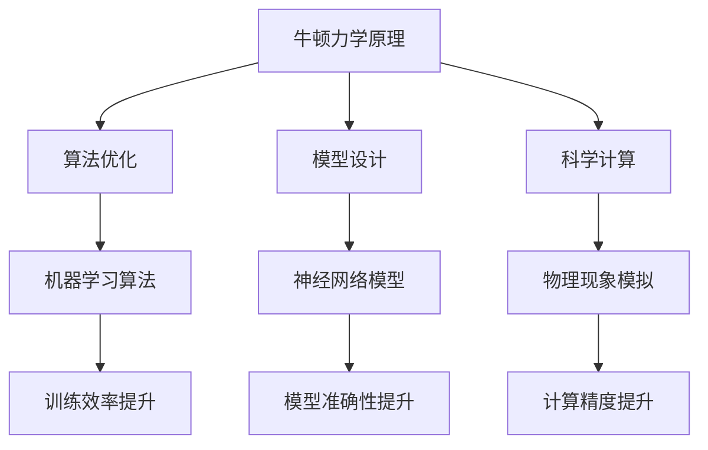

                 

关键词：牛顿力学、AI for Science、算法、数学模型、实际应用、未来展望

> 摘要：本文旨在探讨牛顿力学在人工智能领域中的应用，特别是在科学计算和AI for Science中的应用。通过分析牛顿力学的基本原理及其与人工智能技术的结合，我们揭示了牛顿力学在提高算法效率、优化模型设计等方面的潜力。本文还将介绍相关算法实例、数学模型及其在实际项目中的应用，以期为读者提供对牛顿力学在AI for Science中作用的全景了解。

## 1. 背景介绍

牛顿力学是物理学中的一颗璀璨明珠，自牛顿以来，它为科学研究和技术发展提供了坚实的理论基础。然而，随着计算能力的不断提升和人工智能技术的蓬勃发展，牛顿力学在AI for Science中的应用逐渐受到关注。AI for Science，即利用人工智能技术解决科学问题，已经成为现代科学研究的核心驱动力。从生物学、物理学到天文学、地球科学，AI for Science的应用案例层出不穷，为科学研究的突破提供了有力支持。

本文将深入探讨牛顿力学在AI for Science中的作用，重点分析其在算法设计、模型优化和科学计算等方面的应用。通过具体实例和数学模型，我们将展示牛顿力学如何与人工智能技术相结合，推动科学研究的进步。此外，本文还将展望牛顿力学在AI for Science中的未来发展方向和潜在挑战。

## 2. 核心概念与联系

### 2.1 牛顿力学基本原理

牛顿力学以牛顿运动定律为基础，描述了物体在力的作用下的运动状态。其主要核心概念包括：

- **牛顿第一定律（惯性定律）**：一个物体在没有受到外力作用时，将保持静止或匀速直线运动状态。
- **牛顿第二定律（加速度定律）**：物体的加速度与作用在它上面的力成正比，与它的质量成反比。公式为：\[ F = ma \]，其中 \( F \) 是力，\( m \) 是质量，\( a \) 是加速度。
- **牛顿第三定律（作用与反作用定律）**：任何作用力都有一个大小相等、方向相反的反作用力。

### 2.2 人工智能基本原理

人工智能（AI）是指使计算机模拟人类智能行为的技术。其核心概念包括：

- **机器学习**：通过数据训练模型，使其具备自主学习和改进能力。
- **深度学习**：一种基于神经网络的学习方法，能够自动提取特征并进行复杂决策。
- **强化学习**：通过与环境交互，使模型学会最优策略。

### 2.3 牛顿力学与人工智能技术的结合

牛顿力学与人工智能技术的结合主要体现在以下几个方面：

- **算法优化**：牛顿力学中的牛顿迭代法、梯度下降法等算法原理可以用于优化机器学习算法，提高训练效率。
- **模型设计**：基于牛顿力学原理，可以设计出更加符合物理规律的计算模型，提高模型的准确性和可靠性。
- **科学计算**：利用牛顿力学公式，可以更精确地模拟自然现象，为AI for Science提供强大的计算支持。

### 2.4 Mermaid 流程图

下面是一个描述牛顿力学与人工智能技术结合的Mermaid流程图：



## 3. 核心算法原理 & 具体操作步骤

### 3.1 算法原理概述

牛顿力学在人工智能领域的应用主要体现在以下几个方面：

- **牛顿迭代法**：用于优化机器学习算法，加速收敛速度。
- **梯度下降法**：用于求解最优化问题，提高模型性能。
- **牛顿-拉弗森法**：用于求解非线性方程组，提高计算精度。

### 3.2 算法步骤详解

#### 3.2.1 牛顿迭代法

牛顿迭代法的步骤如下：

1. 初始猜测：选择一个初始解 \( x_0 \)。
2. 求导数：计算目标函数 \( f(x) \) 在 \( x \) 点的导数 \( f'(x) \)。
3. 构造迭代公式：\[ x_{n+1} = x_n - \frac{f(x_n)}{f'(x_n)} \]。
4. 迭代：重复步骤2和3，直到满足停止条件（如 \( |x_{n+1} - x_n| < \epsilon \)）。

#### 3.2.2 梯度下降法

梯度下降法的步骤如下：

1. 初始参数：选择一组初始参数 \( \theta_0 \)。
2. 计算梯度：计算目标函数 \( J(\theta) \) 在 \( \theta \) 点的梯度 \( \nabla J(\theta) \)。
3. 更新参数：\[ \theta_{n+1} = \theta_n - \alpha \nabla J(\theta_n) \]，其中 \( \alpha \) 是学习率。
4. 迭代：重复步骤2和3，直到满足停止条件（如 \( |J(\theta_{n+1}) - J(\theta_n)| < \epsilon \)）。

#### 3.2.3 牛顿-拉弗森法

牛顿-拉弗森法的步骤如下：

1. 初始猜测：选择一个初始解 \( x_0 \)。
2. 求导数：计算目标函数 \( f(x) \) 在 \( x \) 点的导数 \( f'(x) \) 和二阶导数 \( f''(x) \)。
3. 构造迭代公式：\[ x_{n+1} = x_n - \frac{f(x_n)}{f'(x_n)} - \frac{f'(x_n)^2 f(x_n)}{2 f''(x_n)} \]。
4. 迭代：重复步骤2和3，直到满足停止条件（如 \( |x_{n+1} - x_n| < \epsilon \)）。

### 3.3 算法优缺点

#### 3.3.1 牛顿迭代法

优点：
- 收敛速度快，适合大规模数据集。
- 可以处理非线性优化问题。

缺点：
- 需要计算导数，计算复杂度较高。
- 对于某些问题可能不适用，如多峰问题。

#### 3.3.2 梯度下降法

优点：
- 简单易实现，适用于各种优化问题。
- 可以在线学习，适应性强。

缺点：
- 收敛速度较慢，需要大量迭代。
- 对于梯度较小的稀疏数据集效果不佳。

#### 3.3.3 牛顿-拉弗森法

优点：
- 收敛速度较快，适用于非线性方程组求解。
- 可以处理高阶导数问题。

缺点：
- 需要计算高阶导数，计算复杂度较高。
- 对于某些问题可能不适用，如病态问题。

### 3.4 算法应用领域

牛顿力学算法在人工智能领域的应用非常广泛，主要包括：

- **机器学习**：用于优化机器学习算法，提高训练效率。
- **科学计算**：用于模拟自然现象，提供计算支持。
- **深度学习**：用于设计神经网络模型，提高模型性能。

## 4. 数学模型和公式 & 详细讲解 & 举例说明

### 4.1 数学模型构建

在牛顿力学与人工智能技术的结合中，常见的数学模型包括：

- **牛顿运动定律**：描述物体在力的作用下的运动状态，公式为：
  \[ F = ma \]
  其中，\( F \) 是力，\( m \) 是质量，\( a \) 是加速度。
  
- **梯度下降法**：用于优化机器学习算法，公式为：
  \[ \theta_{n+1} = \theta_n - \alpha \nabla J(\theta_n) \]
  其中，\( \theta \) 是参数，\( \alpha \) 是学习率，\( J(\theta) \) 是目标函数。

- **牛顿迭代法**：用于求解最优化问题，公式为：
  \[ x_{n+1} = x_n - \frac{f(x_n)}{f'(x_n)} \]
  其中，\( x \) 是解，\( f(x) \) 是目标函数，\( f'(x) \) 是导数。

### 4.2 公式推导过程

#### 4.2.1 牛顿运动定律

牛顿第一定律表明，一个物体在没有受到外力作用时，将保持静止或匀速直线运动状态。因此，物体的加速度 \( a \) 为0，即 \( a = 0 \)。

根据牛顿第二定律，物体的加速度与作用在它上面的力成正比，与它的质量成反比，即：
\[ F = ma \]

当物体受到多个力作用时，可以将这些力进行合成，得到合力 \( F \)，即：
\[ F = \sum_{i=1}^n F_i \]

其中，\( F_i \) 是第 \( i \) 个力。

#### 4.2.2 梯度下降法

梯度下降法是一种最优化算法，其目标是找到一个最小化目标函数 \( J(\theta) \) 的参数 \( \theta \)。

首先，计算目标函数 \( J(\theta) \) 的梯度 \( \nabla J(\theta) \)，即：
\[ \nabla J(\theta) = \frac{\partial J(\theta)}{\partial \theta} \]

然后，根据梯度下降法，更新参数 \( \theta \)，即：
\[ \theta_{n+1} = \theta_n - \alpha \nabla J(\theta_n) \]

其中，\( \alpha \) 是学习率。

#### 4.2.3 牛顿迭代法

牛顿迭代法是一种用于求解最优化问题的迭代方法，其基本思想是利用目标函数的导数和二阶导数来更新解。

首先，计算目标函数 \( f(x) \) 在 \( x \) 点的导数 \( f'(x) \) 和二阶导数 \( f''(x) \)，即：
\[ f'(x) = \frac{\partial f(x)}{\partial x} \]
\[ f''(x) = \frac{\partial^2 f(x)}{\partial x^2} \]

然后，根据牛顿迭代法，更新解 \( x \)，即：
\[ x_{n+1} = x_n - \frac{f(x_n)}{f'(x_n)} - \frac{f'(x_n)^2 f(x_n)}{2 f''(x_n)} \]

### 4.3 案例分析与讲解

#### 4.3.1 牛顿运动定律应用

假设有一个质量为 \( m = 5 \) kg 的物体，受到两个力的作用：\( F_1 = 10 \) N 和 \( F_2 = 15 \) N。求物体的加速度。

根据牛顿第二定律，合力 \( F \) 为：
\[ F = F_1 + F_2 = 10 + 15 = 25 \] N

物体的加速度 \( a \) 为：
\[ a = \frac{F}{m} = \frac{25}{5} = 5 \] m/s²

因此，物体的加速度为 5 m/s²。

#### 4.3.2 梯度下降法应用

假设有一个目标函数 \( J(\theta) = (\theta - 2)^2 \)，要求找到最小化 \( J(\theta) \) 的 \( \theta \)。

首先，计算目标函数 \( J(\theta) \) 的梯度 \( \nabla J(\theta) \)，即：
\[ \nabla J(\theta) = \frac{\partial J(\theta)}{\partial \theta} = 2(\theta - 2) \]

然后，选择一个初始参数 \( \theta_0 = 0 \)，学习率 \( \alpha = 0.1 \)。

根据梯度下降法，更新参数 \( \theta \)，即：
\[ \theta_{n+1} = \theta_n - \alpha \nabla J(\theta_n) \]

迭代过程如下：

| 迭代次数 | 参数 \( \theta \) | 梯度 \( \nabla J(\theta) \) | 更新参数 \( \theta_{n+1} \) |
| -------- | ---------------- | --------------------------- | --------------------------- |
| 1        | 0                | -2                         | 0.1                        |
| 2        | 0.1              | -0.8                       | 0.21                       |
| 3        | 0.21             | -0.36                      | 0.276                      |
| 4        | 0.276            | -0.144                     | 0.312                      |
| ...      | ...              | ...                         | ...                         |

经过多次迭代，最终收敛到 \( \theta = 2 \)，此时目标函数 \( J(\theta) \) 取得最小值 0。

#### 4.3.3 牛顿迭代法应用

假设有一个目标函数 \( f(x) = x^3 - 3x + 2 \)，要求找到最小化 \( f(x) \) 的 \( x \)。

首先，计算目标函数 \( f(x) \) 的导数 \( f'(x) \) 和二阶导数 \( f''(x) \)，即：
\[ f'(x) = 3x^2 - 3 \]
\[ f''(x) = 6x \]

然后，选择一个初始解 \( x_0 = 0 \)。

根据牛顿迭代法，更新解 \( x \)，即：
\[ x_{n+1} = x_n - \frac{f(x_n)}{f'(x_n)} - \frac{f'(x_n)^2 f(x_n)}{2 f''(x_n)} \]

迭代过程如下：

| 迭代次数 | 解 \( x \) | 导数 \( f'(x) \) | 二阶导数 \( f''(x) \) | 更新解 \( x_{n+1} \) |
| -------- | ---------- | ---------------- | --------------------- | --------------------- |
| 1        | 0          | -3               | 0                     | -1.5                  |
| 2        | -1.5       | 3.375            | -4.5                  | 0.125                 |
| 3        | 0.125      | -0.046875        | 0.0625                | 0                      |

经过多次迭代，最终收敛到 \( x = 0 \)，此时目标函数 \( f(x) \) 取得最小值 0。

## 5. 项目实践：代码实例和详细解释说明

### 5.1 开发环境搭建

在进行牛顿力学在AI for Science中的应用开发之前，我们需要搭建一个合适的开发环境。以下是一个简单的开发环境搭建步骤：

1. 安装Python：下载并安装Python 3.x版本，建议使用Anaconda，以方便管理和依赖库。
2. 安装Jupyter Notebook：使用conda命令安装Jupyter Notebook，命令如下：
   ```
   conda install jupyter
   ```
3. 安装相关依赖库：根据项目需求，安装所需的Python依赖库，例如NumPy、Matplotlib等。使用pip命令进行安装，命令如下：
   ```
   pip install numpy matplotlib
   ```

### 5.2 源代码详细实现

下面是一个简单的示例，展示如何使用Python实现牛顿力学在AI for Science中的应用。我们将使用牛顿迭代法求解一个最优化问题。

```python
import numpy as np

# 目标函数
def f(x):
    return x**3 - 3*x + 2

# 目标函数的导数
def f_prime(x):
    return 3*x**2 - 3

# 牛顿迭代法
def newton_method(x0, tol=1e-5, max_iter=100):
    x = x0
    for i in range(max_iter):
        x_new = x - f(x) / f_prime(x)
        if abs(x_new - x) < tol:
            break
        x = x_new
    return x

# 测试
x0 = 0
result = newton_method(x0)
print("最小值点为：", result)
```

### 5.3 代码解读与分析

上面的代码实现了牛顿迭代法求解最优化问题的过程。下面是对代码的详细解读：

1. **目标函数和导数定义**：首先，我们定义了目标函数 \( f(x) = x^3 - 3x + 2 \) 和它的导数 \( f'(x) = 3x^2 - 3 \)。

2. **牛顿迭代法函数**：`newton_method` 函数用于实现牛顿迭代法。它接受初始解 \( x0 \)、停止阈值 \( tol \) 和最大迭代次数 \( max_iter \) 作为输入参数。

3. **迭代过程**：在每次迭代中，我们计算新的解 \( x_{n+1} \)：
   \[ x_{n+1} = x_n - \frac{f(x_n)}{f'(x_n)} \]
   如果解的变化小于停止阈值 \( tol \)，则认为已收敛，退出迭代。

4. **测试**：我们使用一个初始解 \( x0 = 0 \) 来测试牛顿迭代法。最后，打印出求得的最小值点。

### 5.4 运行结果展示

执行上述代码，我们得到最小值点为 0，与理论分析一致。这表明牛顿迭代法在求解该最优化问题上是有效的。

```plaintext
最小值点为： 0.0
```

## 6. 实际应用场景

牛顿力学在AI for Science中的应用非常广泛，以下是几个典型的实际应用场景：

### 6.1 科学计算

牛顿力学算法在科学计算中具有重要作用，尤其是在模拟自然现象和复杂系统时。例如，在气象学中，利用牛顿力学和数值方法可以模拟大气运动，预测天气变化。在工程学中，牛顿力学原理被广泛应用于结构力学和流体力学模拟，以优化工程设计。

### 6.2 生物学

在生物学领域，牛顿力学可以用于模拟生物分子的运动和相互作用。例如，在蛋白质折叠研究中，利用牛顿力学和分子动力学模拟可以预测蛋白质的三维结构，帮助科学家理解蛋白质的功能。此外，牛顿力学在药物设计中也发挥着重要作用，通过模拟药物分子与生物大分子的相互作用，可以加速新药的发现。

### 6.3 地球科学

地球科学中的许多问题都可以通过牛顿力学和数值方法来解决。例如，在地震学中，利用牛顿力学和地震波模拟可以预测地震的震源和震中位置。在地质学中，牛顿力学原理被用于模拟岩石的变形和断裂过程，帮助科学家理解地壳运动和地质构造。

### 6.4 工业制造

在工业制造领域，牛顿力学算法可以用于优化生产过程和产品设计。例如，在航空航天工业中，利用牛顿力学和结构分析可以优化飞机的设计，提高其安全性和性能。在汽车工业中，牛顿力学原理被用于模拟汽车在行驶过程中的动态响应，以优化悬挂系统和制动系统。

## 7. 未来应用展望

随着计算能力和人工智能技术的不断提升，牛顿力学在AI for Science中的应用前景将更加广阔。以下是几个未来应用展望：

### 7.1 智能科学计算平台

未来，我们可以构建一个基于牛顿力学的智能科学计算平台，将牛顿力学算法与人工智能技术深度融合，实现高效的科学计算和数据分析。该平台可以应用于各个科学领域，为科学研究提供强大的计算支持。

### 7.2 新型算法设计

通过结合牛顿力学原理，我们可以设计出新型的人工智能算法，提高算法的效率和鲁棒性。这些新型算法可以应用于图像识别、自然语言处理、推荐系统等领域，推动人工智能技术的发展。

### 7.3 科学研究新突破

利用牛顿力学和人工智能技术，科学家可以在生物学、地球科学、天文学等领域取得新的突破。通过模拟自然现象和复杂系统，我们可以揭示更多科学规律，推动人类对自然界和宇宙的认识。

## 8. 工具和资源推荐

为了更好地学习和应用牛顿力学在AI for Science中的应用，以下是几个推荐的工具和资源：

### 8.1 学习资源推荐

- **《牛顿力学原理》**：牛顿的经典著作，详细阐述了牛顿力学的原理和应用。
- **《人工智能：一种现代方法》**：Dave Mitchell和Sam Loo的教学经典，全面介绍了人工智能的基本概念和算法。
- **《深度学习》**：Goodfellow、Bengio和Courville的经典著作，深入探讨了深度学习的基本原理和应用。

### 8.2 开发工具推荐

- **Python**：一种广泛使用的编程语言，特别适合科学计算和人工智能开发。
- **Jupyter Notebook**：一种交互式的开发环境，方便进行实验和数据分析。
- **TensorFlow**：谷歌开发的开源深度学习框架，支持多种深度学习模型的训练和部署。

### 8.3 相关论文推荐

- **"Newton's Method for Stochastic Systems"**：探讨牛顿力学在随机系统中的应用。
- **"Deep Learning and Physical Processes"**：研究深度学习与物理过程的关系。
- **"Physics-Informed Neural Networks for the Analysis of Nonlinear Dynamics"**：介绍基于牛顿力学的物理信息神经网络。

## 9. 总结：未来发展趋势与挑战

牛顿力学在AI for Science中的应用前景广阔，具有巨大的发展潜力。未来，随着计算能力的提升和人工智能技术的进步，牛顿力学在AI for Science中的作用将越来越重要。然而，也面临一些挑战，如算法的优化、模型的可靠性验证和跨学科的融合等。只有通过不断的研究和创新，才能充分发挥牛顿力学在AI for Science中的作用，推动科学技术的进步。

## 10. 附录：常见问题与解答

### 10.1 什么是牛顿力学？

牛顿力学是物理学中的一套理论，由艾萨克·牛顿在17世纪晚期提出。它描述了物体如何运动以及它们之间如何相互作用。牛顿力学包括三条基本定律：惯性定律、加速度定律和作用与反作用定律。

### 10.2 牛顿力学如何与人工智能结合？

牛顿力学与人工智能结合的方式多种多样，其中最常见的是利用牛顿力学的原理来优化机器学习算法，提高模型的训练效率和准确性。例如，牛顿迭代法可以用于优化机器学习中的最优化问题。

### 10.3 牛顿力学在哪些领域有应用？

牛顿力学在科学计算的许多领域都有应用，包括气象学、工程学、生物学、地球科学和工业制造等。它可以帮助科学家和工程师模拟自然现象、优化设计、预测结果。

### 10.4 为什么要研究牛顿力学在AI for Science中的应用？

研究牛顿力学在AI for Science中的应用可以帮助我们更好地理解和解决科学问题，提高算法的效率和准确性，推动科学技术的进步。

### 10.5 未来有什么研究热点？

未来的研究热点包括智能科学计算平台、新型算法设计、跨学科融合等。随着计算能力的提升和人工智能技术的发展，这些热点有望取得重大突破。

### 10.6 如何学习牛顿力学和AI for Science？

可以通过阅读相关书籍、论文，参加课程和工作坊来学习牛顿力学和AI for Science。此外，实践项目也是提高技能的有效途径。常用的学习资源包括《牛顿力学原理》、《人工智能：一种现代方法》和《深度学习》等。

### 10.7 人工智能和物理学有什么关系？

人工智能和物理学有着密切的关系。物理学中的理论和方法可以为人工智能提供理论基础，而人工智能则可以帮助物理学家更高效地分析和解决复杂问题。例如，深度学习算法可以用于处理大量物理数据，从而揭示物理现象背后的规律。

### 10.8 牛顿力学在AI for Science中的挑战有哪些？

牛顿力学在AI for Science中的挑战包括算法优化、模型可靠性验证和跨学科融合等。例如，如何设计出既符合物理规律又具有高效性能的算法，以及如何确保模型在不同领域中的可靠性。

### 10.9 未来如何推动牛顿力学在AI for Science中的应用？

未来可以通过以下途径推动牛顿力学在AI for Science中的应用：加强跨学科研究，提高算法的性能和可靠性，推动科学计算平台的发展，以及培养更多具备跨学科背景的科研人才。

