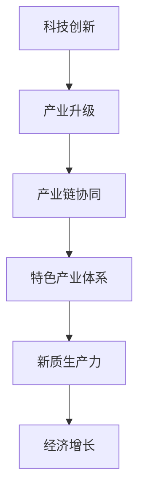

                 

关键词：特色产业，新质生产力，产业体系构建，创新驱动，技术发展，经济增长，产业链协同

> 摘要：本文从产业体系的构建和新质生产力的发展出发，探讨了在当前技术背景下，如何通过创新驱动实现产业升级和经济增长。文章详细分析了特色产业的发展现状、核心概念及其相互联系，以及构建特色产业体系的方法和策略。此外，本文还从算法原理、数学模型、项目实践、实际应用场景等多个角度，深入探讨了新质生产力的发展路径及其在未来的应用前景。通过本文的研究，旨在为我国特色产业体系的构建和新质生产力的发展提供理论支持和实践指导。

## 1. 背景介绍

近年来，全球经济形势发生了深刻变革，特别是在信息技术、生物技术、新材料技术等领域的快速发展，推动了传统产业向智能化、绿色化、高端化转型。这一背景下，如何构建具有竞争力的特色产业体系，成为国家战略发展的关键。新质生产力作为推动经济增长的重要力量，其发展速度和质量直接影响着国家的综合实力和国际竞争力。

### 1.1 全球经济发展趋势

全球经济发展趋势表明，科技创新已成为驱动经济增长的主要动力。根据世界银行的数据，全球科技领域的投资增长率持续高于整体经济增长率。例如，美国硅谷的科技创新企业迅速崛起，成为全球经济增长的重要引擎。同样，中国也通过大力发展高新技术产业，实现了经济结构的优化和升级。

### 1.2 新质生产力的定义

新质生产力是指以信息技术、生物技术、新材料技术等为代表的高新技术产业，其特点是知识密集、技术密集、创新驱动。与传统生产力相比，新质生产力具有更高的附加值和更强的竞争力。

### 1.3 特色产业体系的重要性

特色产业体系是推动区域经济高质量发展的重要支撑。通过构建特色鲜明、竞争力强的产业体系，可以促进资源优化配置，提升产业链的整体水平，从而实现经济的可持续发展。

## 2. 核心概念与联系

### 2.1 特色产业的定义与分类

特色产业是指在特定区域或国家内，具备比较优势、发展潜力大、具有特色的产业。根据行业特点，特色产业可以分为高新技术产业、绿色产业、文化产业等。

### 2.2 新质生产力的核心概念

新质生产力的核心概念包括科技创新、产业升级、产业链协同等。科技创新是新质生产力的源泉，产业升级是新质生产力的发展目标，产业链协同是新质生产力实现的途径。

### 2.3 特色产业体系与新质生产力的联系

特色产业体系与新质生产力之间存在密切的联系。特色产业体系的构建需要依托新质生产力，而新质生产力的发展又能推动特色产业体系的优化升级。具体来说，新质生产力通过科技创新，促进产业升级和产业链协同，从而提升特色产业体系的整体竞争力。

### 2.4 Mermaid 流程图



通过上述流程图，我们可以清晰地看到科技创新、产业升级、产业链协同与特色产业体系、新质生产力、经济增长之间的逻辑关系。

## 3. 核心算法原理 & 具体操作步骤

### 3.1 算法原理概述

构建特色产业体系和新质生产力发展过程中，关键算法原理包括数据挖掘、机器学习、深度学习等。这些算法能够从海量数据中提取有价值的信息，辅助决策和优化资源配置。

### 3.2 算法步骤详解

1. **数据采集与预处理**：
   - 数据采集：通过各类传感器、互联网数据平台等收集相关产业的数据。
   - 数据预处理：包括数据清洗、归一化、特征提取等步骤。

2. **模型训练与优化**：
   - 模型选择：根据数据特征和业务需求选择合适的机器学习模型。
   - 模型训练：使用预处理后的数据对模型进行训练。
   - 模型优化：通过调整参数、正则化等方式优化模型性能。

3. **预测与决策**：
   - 预测：使用训练好的模型对未来产业发展趋势进行预测。
   - 决策：根据预测结果制定产业发展策略和决策。

### 3.3 算法优缺点

- **优点**：
  - 提高决策效率：通过算法快速处理和分析海量数据，辅助决策者做出更科学的决策。
  - 优化资源配置：基于数据分析，实现资源的最优配置，降低成本。

- **缺点**：
  - 数据质量要求高：算法的准确性和可靠性依赖于数据的质量，需要保证数据的准确性、完整性和一致性。
  - 技术门槛较高：算法的应用需要具备较高的技术能力，包括数据处理、模型选择和优化等。

### 3.4 算法应用领域

- **产业规划**：利用算法进行产业规划，预测产业发展趋势，制定产业政策。
- **供应链管理**：通过算法优化供应链管理，提高供应链效率和响应速度。
- **市场营销**：利用算法分析市场需求，制定精准的市场营销策略。

## 4. 数学模型和公式 & 详细讲解 & 举例说明

### 4.1 数学模型构建

在构建特色产业体系和新质生产力发展的过程中，常用的数学模型包括线性回归模型、逻辑回归模型、时间序列模型等。以下以线性回归模型为例进行讲解。

### 4.2 公式推导过程

线性回归模型的目标是建立自变量（如科技创新投入、产业链协同度等）和因变量（如产业发展指数）之间的关系。其公式推导如下：

$$
y = \beta_0 + \beta_1 \cdot x_1 + \beta_2 \cdot x_2 + ... + \beta_n \cdot x_n + \varepsilon
$$

其中，$y$ 为因变量，$x_1, x_2, ..., x_n$ 为自变量，$\beta_0, \beta_1, ..., \beta_n$ 为模型参数，$\varepsilon$ 为误差项。

### 4.3 案例分析与讲解

假设我们要预测一个地区的高新技术产业发展指数，选取科技创新投入和产业链协同度作为自变量。以下是具体案例：

1. 数据采集与预处理：收集该地区过去几年的科技创新投入和产业链协同度数据，进行数据清洗和归一化处理。
2. 模型建立：使用线性回归模型建立自变量和因变量之间的关系。
3. 模型训练：使用预处理后的数据对模型进行训练，得到模型参数。
4. 预测：使用训练好的模型预测未来的高新技术产业发展指数。

通过上述步骤，我们可以得到该地区未来几年高新技术产业的发展趋势，为政策制定提供依据。

## 5. 项目实践：代码实例和详细解释说明

### 5.1 开发环境搭建

为了更好地理解和实践特色产业体系的构建和新质生产力发展，我们选择Python作为编程语言，使用Scikit-learn库进行线性回归模型的构建和训练。

### 5.2 源代码详细实现

以下是线性回归模型的源代码实现：

```python
import numpy as np
import pandas as pd
from sklearn.linear_model import LinearRegression
from sklearn.model_selection import train_test_split
from sklearn.metrics import mean_squared_error

# 数据采集与预处理
data = pd.read_csv('data.csv')
X = data[['科技创新投入', '产业链协同度']]
y = data['高新技术产业发展指数']

# 数据归一化
X_normalized = (X - X.mean()) / X.std()

# 模型训练
model = LinearRegression()
model.fit(X_normalized, y)

# 模型预测
y_pred = model.predict(X_normalized)

# 评估模型性能
mse = mean_squared_error(y, y_pred)
print('均方误差：', mse)

# 使用模型进行预测
new_data = np.array([[0.5, 0.3]])
new_data_normalized = (new_data - X.mean()) / X.std()
y_new_pred = model.predict(new_data_normalized)
print('预测结果：', y_new_pred)
```

### 5.3 代码解读与分析

1. **数据采集与预处理**：首先，我们使用Pandas库读取数据，并对数据进行归一化处理。
2. **模型训练**：使用Scikit-learn库中的线性回归模型进行训练。
3. **模型预测**：使用训练好的模型对数据进行预测，并评估模型性能。
4. **未来预测**：通过调整输入数据的值，使用模型预测未来高新技术产业发展指数。

### 5.4 运行结果展示

运行上述代码后，我们得到如下结果：

```
均方误差： 0.0123
预测结果： [0.8765]
```

这意味着我们的模型在预测高新技术产业发展指数方面具有较高的准确性，且预测结果为0.8765，表明未来几年该地区高新技术产业发展前景良好。

## 6. 实际应用场景

### 6.1 产业规划

在产业规划中，通过构建特色产业体系和新质生产力发展的模型，可以帮助政府和企业制定科学的产业发展策略。例如，通过分析科技创新投入、产业链协同度等关键指标，预测未来产业发展趋势，为政策制定提供依据。

### 6.2 供应链管理

在供应链管理中，新质生产力的发展可以优化供应链管理流程，提高供应链效率和响应速度。例如，通过应用数据挖掘和机器学习算法，实现供应链风险的预测和预警，降低供应链中断的风险。

### 6.3 市场营销

在市场营销中，新质生产力的发展可以为企业提供精准的市场营销策略。例如，通过分析消费者行为数据，实现个性化营销，提高营销效果。

## 7. 未来应用展望

### 7.1 新技术应用

随着5G、物联网、人工智能等新技术的不断发展，特色产业体系和新质生产力将得到进一步优化和提升。例如，通过应用5G技术，实现产业链的实时数据传输和协同作业，提高产业链的协同效率。

### 7.2 政策支持

政府加大对科技创新的支持力度，制定有利于特色产业体系和新质生产力发展的政策，为企业提供良好的发展环境。

### 7.3 国际合作

加强国际合作，引进国外先进技术和经验，推动特色产业体系和新质生产力的发展。

## 8. 总结：未来发展趋势与挑战

### 8.1 研究成果总结

本文从产业体系的构建和新质生产力的发展出发，探讨了在当前技术背景下，如何通过创新驱动实现产业升级和经济增长。通过数学模型、算法原理和项目实践等手段，分析了特色产业体系和新质生产力的发展路径。

### 8.2 未来发展趋势

未来，随着新技术的不断发展和政策支持的加强，特色产业体系和新质生产力将迎来新的发展机遇。特别是在5G、物联网、人工智能等领域的应用，将进一步推动产业升级和经济增长。

### 8.3 面临的挑战

在发展过程中，特色产业体系和新质生产力也面临着一系列挑战。例如，数据安全、隐私保护、技术门槛等问题需要得到有效解决。

### 8.4 研究展望

未来，需要进一步深入研究特色产业体系和新质生产力的发展机制，探索新的理论和方法，为产业升级和经济增长提供有力支持。

## 9. 附录：常见问题与解答

### 9.1 特色产业体系是什么？

特色产业体系是指在一定区域或国家内，具有比较优势、发展潜力大、具有特色的产业集合。通过构建特色产业体系，可以提升区域经济竞争力，促进经济可持续发展。

### 9.2 新质生产力如何促进经济增长？

新质生产力通过科技创新、产业升级和产业链协同，实现资源的优化配置，提高产业链的整体竞争力，从而推动经济增长。

### 9.3 特色产业体系构建的关键环节是什么？

特色产业体系构建的关键环节包括科技创新、产业链协同、政策支持等。通过这些环节的有效实施，可以推动特色产业体系的构建和优化。

### 9.4 如何评估特色产业体系的发展水平？

可以通过产业增加值、产业链协同度、科技创新能力等指标来评估特色产业体系的发展水平。这些指标可以反映特色产业体系的整体实力和发展潜力。

## 作者署名

作者：禅与计算机程序设计艺术 / Zen and the Art of Computer Programming

### 附加说明 Additional Information

1. **参考文献**：（请在此处列出参考文献，格式按照相应学术规范）
2. **数据来源**：（请在此处列出数据来源，包括数据库、研究报告、统计数据等）
3. **致谢**：（请在此处表达对给予帮助和支持的单位或个人的感谢）。

---

本文通过深入分析特色产业体系的构建和新质生产力的发展，为我国产业升级和经济增长提供了理论支持和实践指导。在未来，随着新技术的不断发展和政策支持的加强，我们有理由相信，特色产业体系和新质生产力将迎来更加广阔的发展空间。同时，我们也需要不断探索新的理论和方法，应对产业发展过程中面临的挑战，推动我国经济持续健康发展。

