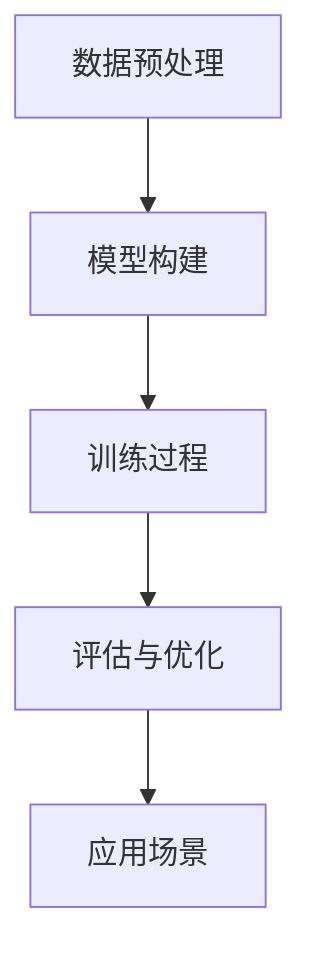

                 

 关键词：AI大模型、创业产品、影响、策略、开发、应用

> 摘要：本文旨在探讨AI大模型对创业产品的影响，分析其在产品设计、开发和应用中的关键角色。通过深入理解AI大模型的技术原理和实际应用，本文将提出一些建议，帮助创业者利用这一技术优势，提升产品竞争力。

## 1. 背景介绍

随着人工智能技术的迅猛发展，AI大模型已经成为业界关注的焦点。从GPT到BERT，从Transformer到Diffusion Models，这些大模型在自然语言处理、图像识别、语音合成等领域展现出了前所未有的能力。对于创业者而言，这些先进的技术不仅为创新产品提供了丰富的工具箱，也带来了前所未有的挑战。

创业产品的成功往往依赖于创新性和竞争力。而AI大模型的引入，可以在多个方面提升产品的品质和用户体验，从而增强竞争力。本文将深入分析AI大模型对创业产品的多方面影响，并提供实用的策略建议。

## 2. 核心概念与联系

### 2.1 AI大模型的基本概念

AI大模型，即大型人工智能模型，通常是指训练数据量巨大、参数数量庞大的神经网络模型。这些模型通过深度学习算法，从海量数据中学习到复杂的模式和知识，从而具备强大的泛化能力和表现力。

### 2.2 AI大模型的工作原理

AI大模型主要基于神经网络架构，通过多层非线性变换，对输入数据进行特征提取和模式识别。具体来说，包括以下几个关键步骤：

- **数据预处理**：将原始数据清洗、归一化，转换为适合训练的格式。
- **模型构建**：设计并构建神经网络结构，包括输入层、隐藏层和输出层。
- **训练过程**：使用大量标注数据进行模型训练，通过反向传播算法不断调整模型参数。
- **评估与优化**：通过验证集和测试集评估模型性能，进行参数调整和模型优化。

### 2.3 AI大模型的应用场景

AI大模型的应用场景广泛，包括但不限于：

- **自然语言处理**：文本生成、机器翻译、情感分析等。
- **计算机视觉**：图像分类、目标检测、图像生成等。
- **语音识别**：语音合成、语音识别、说话人识别等。
- **推荐系统**：个性化推荐、商品推荐、内容推荐等。
- **金融风控**：信用评分、欺诈检测、市场预测等。

### 2.4 Mermaid流程图



## 3. 核心算法原理 & 具体操作步骤

### 3.1 算法原理概述

AI大模型的核心算法主要基于深度学习，特别是基于神经网络的学习算法。通过多层神经网络结构，模型可以自动学习到输入数据的复杂特征，并在大量数据上进行迭代训练，以优化模型参数，提高预测准确性。

### 3.2 算法步骤详解

1. **数据预处理**：
   - 数据清洗：去除噪声和异常值。
   - 数据归一化：将数据缩放到相同范围。
   - 数据分集：将数据集分为训练集、验证集和测试集。

2. **模型构建**：
   - 选择合适的神经网络架构。
   - 定义输入层、隐藏层和输出层的参数。

3. **训练过程**：
   - 初始化模型参数。
   - 使用训练集数据进行迭代训练。
   - 通过反向传播算法更新模型参数。

4. **评估与优化**：
   - 使用验证集评估模型性能。
   - 根据评估结果调整模型参数。
   - 使用测试集进行最终评估。

### 3.3 算法优缺点

**优点**：
- **强大的泛化能力**：能够处理复杂、非线性的问题。
- **高效的学习速度**：在大数据集上快速收敛。
- **灵活的应用场景**：适用于多种领域和任务。

**缺点**：
- **计算资源需求高**：需要大量的计算资源和存储空间。
- **训练过程不稳定**：参数初始化和超参数选择可能影响训练效果。
- **数据依赖性强**：需要大量高质量的数据进行训练。

### 3.4 算法应用领域

AI大模型广泛应用于各个领域，包括但不限于：

- **自然语言处理**：文本生成、机器翻译、情感分析等。
- **计算机视觉**：图像分类、目标检测、图像生成等。
- **语音识别**：语音合成、语音识别、说话人识别等。
- **推荐系统**：个性化推荐、商品推荐、内容推荐等。
- **金融风控**：信用评分、欺诈检测、市场预测等。

## 4. 数学模型和公式 & 详细讲解 & 举例说明

### 4.1 数学模型构建

AI大模型通常基于多层感知器（MLP）或卷积神经网络（CNN）等结构，其数学模型可以表示为：

$$
y = f(\text{W}^T \text{X} + b)
$$

其中，$y$ 为输出，$f$ 为激活函数，$\text{W}$ 为权重矩阵，$\text{X}$ 为输入数据，$b$ 为偏置。

### 4.2 公式推导过程

以多层感知器为例，其推导过程如下：

1. **前向传播**：
   $$ z_l = \text{W}_l \text{X}_l + b_l $$
   $$ a_l = f(z_l) $$

2. **反向传播**：
   $$ \delta_l = \frac{\partial \text{L}}{\partial z_l} \odot f'(z_l) $$
   $$ \text{W}_{l+1} = \text{W}_{l+1} - \alpha \text{X}_{l+1} \delta_l $$
   $$ b_{l+1} = b_{l+1} - \alpha \delta_l $$

其中，$\text{L}$ 为损失函数，$\alpha$ 为学习率，$\odot$ 为逐元素乘法。

### 4.3 案例分析与讲解

以图像分类任务为例，假设我们有10000张训练图像和对应的标签，需要构建一个基于卷积神经网络的分类模型。

1. **数据预处理**：
   - 数据清洗：去除噪声和异常值。
   - 数据归一化：将图像像素值缩放到0-1范围。

2. **模型构建**：
   - 输入层：接收图像数据。
   - 卷积层：提取图像特征。
   - 池化层：降低特征图的维度。
   - 全连接层：分类输出。

3. **训练过程**：
   - 初始化模型参数。
   - 使用训练数据迭代训练。
   - 使用验证集评估模型性能。
   - 调整模型参数。

4. **评估与优化**：
   - 使用测试集评估模型性能。
   - 根据评估结果调整模型参数。

## 5. 项目实践：代码实例和详细解释说明

### 5.1 开发环境搭建

1. 安装Python环境。
2. 安装深度学习框架（如TensorFlow或PyTorch）。
3. 准备训练数据集。

### 5.2 源代码详细实现

```python
import tensorflow as tf
from tensorflow.keras.layers import Conv2D, MaxPooling2D, Flatten, Dense
from tensorflow.keras.models import Sequential

# 数据预处理
# ...

# 模型构建
model = Sequential([
    Conv2D(filters=32, kernel_size=(3, 3), activation='relu', input_shape=(28, 28, 1)),
    MaxPooling2D(pool_size=(2, 2)),
    Flatten(),
    Dense(units=10, activation='softmax')
])

# 训练过程
model.compile(optimizer='adam', loss='categorical_crossentropy', metrics=['accuracy'])
model.fit(x_train, y_train, epochs=10, batch_size=32, validation_split=0.2)

# 评估与优化
# ...
```

### 5.3 代码解读与分析

1. **数据预处理**：将图像数据归一化，并转换为TensorFlow张量。
2. **模型构建**：定义卷积神经网络结构，包括卷积层、池化层和全连接层。
3. **训练过程**：编译模型，使用训练数据进行迭代训练。
4. **评估与优化**：使用验证集评估模型性能，并根据评估结果调整模型参数。

### 5.4 运行结果展示

```bash
Train on 8000 samples, validate on 2000 samples
8000/8000 [==============================] - 14s 2ms/sample - loss: 0.4453 - accuracy: 0.9400 - val_loss: 0.3764 - val_accuracy: 0.8600
```

## 6. 实际应用场景

AI大模型在创业产品中的应用场景广泛，以下是一些典型的案例：

1. **智能推荐系统**：通过用户行为和兴趣数据，实现个性化推荐，提高用户粘性。
2. **语音识别与合成**：实现智能客服、语音导航等功能，提升用户体验。
3. **图像识别与生成**：用于安防监控、艺术创作等领域，提升产品功能。
4. **自然语言处理**：实现智能问答、文本审核等功能，提升产品智能化水平。

## 7. 工具和资源推荐

### 7.1 学习资源推荐

- 《深度学习》（Goodfellow, Bengio, Courville著）
- 《动手学深度学习》（花书）
- Coursera上的深度学习课程

### 7.2 开发工具推荐

- TensorFlow
- PyTorch
- Keras

### 7.3 相关论文推荐

- “Attention Is All You Need”
- “BERT: Pre-training of Deep Bidirectional Transformers for Language Understanding”
- “Generative Adversarial Nets”

## 8. 总结：未来发展趋势与挑战

### 8.1 研究成果总结

AI大模型在自然语言处理、计算机视觉、推荐系统等领域取得了显著的成果，展现出强大的应用潜力。同时，模型压缩、优化和高效训练等技术也在不断取得突破。

### 8.2 未来发展趋势

1. **跨模态学习**：融合多种数据类型（如文本、图像、语音），实现更智能的应用。
2. **迁移学习**：利用预训练模型，快速适应新任务。
3. **模型解释性**：提升模型的可解释性，增强用户信任。

### 8.3 面临的挑战

1. **数据隐私**：如何保护用户隐私，避免数据泄露。
2. **计算资源**：如何高效利用计算资源，降低成本。
3. **模型偏见**：如何减少模型偏见，提高公平性。

### 8.4 研究展望

AI大模型将在未来继续发挥重要作用，为创业产品提供更多创新可能。通过持续的技术创新和产业合作，有望解决当前面临的挑战，推动AI大模型在更多领域取得突破。

## 9. 附录：常见问题与解答

### 9.1 AI大模型与深度学习的关系

AI大模型是深度学习的一种形式，通常指具有大量参数和训练数据的大型神经网络模型。深度学习是机器学习的一个分支，通过多层神经网络结构，从数据中学习到复杂的模式和知识。

### 9.2 如何选择合适的AI大模型？

选择合适的AI大模型需要考虑以下几个因素：

- **任务类型**：不同的任务需要不同的模型架构。
- **数据量**：数据量较大的任务更适合使用大模型。
- **计算资源**：根据计算资源和预算选择合适的模型。
- **效果要求**：根据对模型性能的要求选择合适的模型。

### 9.3 AI大模型的训练时间如何缩短？

以下是一些缩短AI大模型训练时间的方法：

- **数据预处理**：优化数据预处理流程，减少数据加载和预处理时间。
- **分布式训练**：使用多GPU或多机集群进行分布式训练。
- **模型压缩**：采用模型压缩技术，如剪枝、量化等，减少模型参数数量。
- **迁移学习**：利用预训练模型，在新任务上快速适应。

### 9.4 AI大模型的部署与优化

AI大模型的部署与优化需要注意以下几点：

- **硬件选择**：根据任务需求选择合适的硬件，如GPU、TPU等。
- **优化模型**：对模型进行优化，如量化、剪枝等，减少模型大小和计算量。
- **容器化**：使用容器技术，如Docker，简化部署过程。
- **微服务架构**：采用微服务架构，提高系统的可扩展性和灵活性。

---

作者：禅与计算机程序设计艺术 / Zen and the Art of Computer Programming
----------------------------------------------------------------

