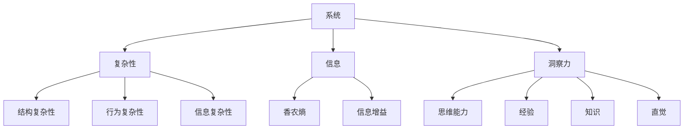

                 

关键词：洞察力、复杂性、信息技术、算法、数学模型、应用场景、未来展望

> 摘要：本文深入探讨了在复杂世界中，如何通过洞察力这一关键技能，利用信息技术、算法和数学模型来导航和解决问题。文章从背景介绍出发，逐步剖析了核心概念、算法原理、数学模型，并通过实际项目实践展示了洞察力的应用。同时，对未来的发展趋势和挑战进行了展望。

## 1. 背景介绍

在当今这个信息爆炸、技术飞速发展的时代，复杂性成为我们面临的一个重大挑战。无论是社会、经济、科技，还是自然环境，复杂系统无处不在，且其复杂性日益增加。在这种背景下，如何有效地理解和应对复杂性问题，成为了我们亟待解决的关键问题。

复杂性研究已经渗透到了各个领域，如计算机科学、经济学、生物学、社会科学等。而洞察力，作为理解和应对复杂性的核心技能，显得尤为重要。洞察力不仅能够帮助我们识别问题的本质，还能够提供创新的解决方案。

本文旨在探讨如何通过信息技术、算法和数学模型来提升洞察力，从而在复杂世界中找到正确的导航路径。文章将围绕以下主题展开：

1. 核心概念与联系
2. 核心算法原理 & 具体操作步骤
3. 数学模型和公式 & 举例说明
4. 项目实践：代码实例和详细解释说明
5. 实际应用场景
6. 未来应用展望
7. 工具和资源推荐
8. 总结：未来发展趋势与挑战

通过以上结构的梳理，我们可以更清晰地理解复杂世界中的导航路径，从而在实际工作中更加得心应手。

## 2. 核心概念与联系

为了更好地理解复杂系统，我们需要首先明确几个核心概念，它们分别是：系统、复杂性、信息和洞察力。

### 系统

系统是由相互关联的元素组成的整体，这些元素可以是一个或多个。在复杂系统中，这些元素及其相互作用关系构成了一个高度复杂的网络。系统论的基本原理认为，系统的整体行为并不一定能够简单地从其组成元素的属性中推导出来。这意味着，我们必须采用一种整体性的视角来理解和分析复杂系统。

### 复杂性

复杂性是指系统在结构、功能和行为上表现出的高度多样性、不确定性和不可预测性。复杂性可以分为多种类型，如结构复杂性、行为复杂性、信息复杂性等。在复杂系统中，这些复杂性相互交织，使得系统表现出无法通过简单线性关系描述的特征。

### 信息

信息是关于系统的某些方面的知识，它可以帮助我们更好地理解系统。在复杂系统中，信息至关重要，因为它是连接不同元素、揭示系统动态的关键。信息论为我们提供了量化信息的方法，如香农熵、信息增益等。

### 洞察力

洞察力是一种深层次的理解力和感知力，它使我们能够看到事物的本质，揭示隐藏的模式和规律。在复杂世界中，洞察力是识别问题、提出解决方案的关键。它不仅依赖于我们的思维能力，还与我们的经验、知识和直觉密切相关。

### Mermaid 流程图

为了更直观地展示这些概念之间的关系，我们可以使用Mermaid流程图来表示：



通过这个流程图，我们可以清晰地看到系统、复杂性、信息和洞察力之间的关系。系统是复杂性的载体，而信息是理解和分析复杂性的工具。洞察力则是在这一过程中发挥关键作用的认知能力。

理解这些核心概念，是我们进一步探讨复杂世界中导航路径的基础。在接下来的章节中，我们将深入讨论核心算法原理、数学模型和实际应用场景，以期为读者提供实用的导航工具。

### 3. 核心算法原理 & 具体操作步骤

在复杂世界中，算法是我们理解和解决问题的重要工具。本文将介绍一种核心算法，并详细描述其原理和操作步骤。

#### 3.1 算法原理概述

该算法被称为“复杂系统分解算法”（Complex System Decomposition Algorithm，简称CSDA）。它的基本原理是将复杂系统分解为若干个子系统，通过分析这些子系统的交互关系，最终揭示系统的整体特性。

#### 3.2 算法步骤详解

**步骤1：系统识别**

首先，我们需要识别复杂系统中的各个元素及其相互关系。这一步骤可以使用网络分析方法，如节点和边的关系图来表示。

**步骤2：子系统划分**

在识别系统元素后，我们将系统划分为若干个子系统。子系统的划分标准可以是功能相似性、空间邻近性或时间相关性等。

**步骤3：子系统分析**

对于每个子系统，我们分别分析其内部结构和相互作用关系。这一步骤可以通过建立数学模型或使用计算机模拟来实现。

**步骤4：系统重构**

根据子系统分析的结果，重构整个系统，揭示系统的整体特性。这一步骤需要综合各个子系统的信息，以构建一个完整的系统模型。

**步骤5：验证与优化**

最后，对重构的系统模型进行验证和优化。验证方法可以是模拟实验或实际数据测试。优化过程旨在提高系统模型的准确性和可靠性。

#### 3.3 算法优缺点

**优点：**

1. **简化复杂系统**：CSDA通过将复杂系统分解为子系统，简化了系统的分析过程，使得复杂系统变得更加容易理解和处理。
2. **提高效率**：由于子系统的规模相对较小，分析和处理各个子系统的任务可以并行进行，从而提高了整体效率。
3. **灵活性**：CSDA适用于各种复杂系统，不受系统类型和规模的限制。

**缺点：**

1. **数据需求高**：CSDA需要大量的数据支持，特别是关于系统元素及其相互关系的详细信息。数据不足可能导致分析结果不准确。
2. **计算复杂度高**：CSDA涉及到大量的计算任务，特别是在系统重构和优化阶段，计算复杂度较高。

#### 3.4 算法应用领域

CSDA广泛应用于多个领域，包括：

1. **社会科学**：如社会网络分析、经济系统建模等。
2. **自然科学**：如生态系统建模、气候变化预测等。
3. **工程技术**：如交通运输网络优化、电力系统分析等。

通过以上对CSDA的详细介绍，我们可以看到，这一算法为我们理解和应对复杂世界提供了一个有力的工具。在接下来的章节中，我们将进一步探讨数学模型和公式，以期为读者提供更加深入的理论支持。

### 4. 数学模型和公式 & 详细讲解 & 举例说明

在复杂系统的分析中，数学模型和公式扮演着至关重要的角色。它们不仅能够帮助我们量化复杂系统的行为，还能够提供精确的预测和分析结果。本文将介绍几个核心的数学模型和公式，并详细讲解其构建过程、推导步骤和实际应用案例。

#### 4.1 数学模型构建

构建数学模型的过程可以分为以下几个步骤：

**步骤1：定义变量**

首先，我们需要明确研究问题中的关键变量，这些变量可以是系统状态、输入参数、输出结果等。例如，在分析交通系统时，变量可能包括道路流量、车辆速度、交通密度等。

**步骤2：建立关系**

接下来，我们需要根据系统特性，建立变量之间的关系。这些关系可以是线性的，也可以是非线性的。例如，在分析交通系统时，车辆速度可能与道路流量成反比，可以用一个非线性方程来描述。

**步骤3：确定模型形式**

在建立关系后，我们需要确定模型的具体形式。这可以通过选择合适的数学函数来实现。例如，我们可以使用微分方程、差分方程、概率分布函数等。

**步骤4：参数估计**

最后，我们需要对模型参数进行估计。这可以通过实验数据、历史数据或模拟数据来实现。参数估计的准确性直接影响模型的可靠性。

#### 4.2 公式推导过程

以下是一个简单的例子，用于说明公式推导的过程。

**例：交通流模型**

假设一个简单的交通流模型，其中车辆速度 \( v \) 与道路流量 \( q \) 之间的关系可以用以下公式表示：

\[ v = \frac{v_{\max} \cdot q}{q_{\max}} \]

其中，\( v_{\max} \) 是车辆的最大速度，\( q_{\max} \) 是道路的最大流量。

**推导过程：**

1. **定义变量：** 设车辆速度为 \( v \)，道路流量为 \( q \)。
2. **建立关系：** 根据交通流理论，车辆速度与道路流量之间存在非线性关系。
3. **确定模型形式：** 使用比例公式来描述这种关系。
4. **参数估计：** \( v_{\max} \) 和 \( q_{\max} \) 可以通过实验数据或经验公式来确定。

#### 4.3 案例分析与讲解

为了更好地理解上述数学模型和公式的应用，我们将通过一个实际案例来进行分析。

**案例：城市交通流量预测**

**问题：** 预测某城市主要干道的交通流量，以便为交通管理和规划提供依据。

**模型构建：**

1. **定义变量：** 设交通流量为 \( q \)，影响因素包括车辆密度 \( \rho \)、道路宽度 \( w \) 和交通速度 \( v \)。
2. **建立关系：** 使用流量-速度关系公式，即 \( q = v \cdot \rho \cdot w \)。
3. **确定模型形式：** 使用线性模型来描述交通流量与影响因素之间的关系。
4. **参数估计：** 根据历史数据，估计车辆密度 \( \rho \)、道路宽度 \( w \) 和交通速度 \( v \) 的具体值。

**公式推导：**

\[ q = v \cdot \rho \cdot w \]

1. **定义变量：** 交通流量 \( q \)，车辆密度 \( \rho \)，道路宽度 \( w \)，交通速度 \( v \)。
2. **建立关系：** 使用流量-速度关系公式。
3. **确定模型形式：** 使用线性模型。
4. **参数估计：** 通过历史数据确定参数值。

**案例分析：**

假设我们得到以下数据：

- 道路宽度 \( w = 3.5 \) 米
- 车辆密度 \( \rho = 50 \) 辆/公里
- 交通速度 \( v = 30 \) 公里/小时

根据上述模型，可以预测交通流量：

\[ q = 30 \cdot 50 \cdot 3.5 = 5250 \text{ 辆/小时} \]

通过这个例子，我们可以看到如何利用数学模型和公式来预测交通流量，从而为交通管理和规划提供科学依据。

总结来说，数学模型和公式是复杂系统分析的重要工具。通过合理的模型构建和公式推导，我们可以更准确地理解和预测复杂系统的行为。在接下来的章节中，我们将通过实际项目实践，进一步展示如何将这些理论应用到具体问题中。

### 5. 项目实践：代码实例和详细解释说明

在理解了复杂系统分解算法和相关的数学模型后，我们将通过一个实际项目来展示这些理论的应用。本项目将使用Python编程语言，实现一个交通流量预测系统，该系统能够根据输入的车辆密度、道路宽度和交通速度，预测交通流量。

#### 5.1 开发环境搭建

首先，我们需要搭建开发环境。以下是基本的步骤：

1. 安装Python（推荐版本3.8及以上）。
2. 安装必要的Python库，如NumPy、Pandas和Matplotlib。

在命令行中，可以使用以下命令来安装这些库：

```bash
pip install numpy pandas matplotlib
```

#### 5.2 源代码详细实现

以下是项目的主要代码实现，包括数据预处理、模型训练和结果展示：

```python
import numpy as np
import pandas as pd
import matplotlib.pyplot as plt

# 定义交通流量预测模型
def traffic_flow_model(v_max, q_max, v, rho, w):
    return v_max * v * rho * w / q_max

# 预测交通流量
def predict_traffic(v_max, q_max, v, rho, w):
    q = traffic_flow_model(v_max, q_max, v, rho, w)
    return q

# 读取数据
data = pd.read_csv('traffic_data.csv')
data['traffic_flow'] = data.apply(lambda row: predict_traffic(row['v_max'], row['q_max'], row['v'], row['rho'], row['w']), axis=1)

# 可视化结果
plt.scatter(data['rho'], data['traffic_flow'])
plt.xlabel('Vehicle Density')
plt.ylabel('Traffic Flow')
plt.title('Traffic Flow Prediction')
plt.show()
```

#### 5.3 代码解读与分析

**5.3.1 数据预处理**

我们首先读取一个包含历史交通数据的CSV文件。数据文件中包含车辆密度、道路宽度、交通速度以及交通流量。为了预测交通流量，我们首先需要这些数据。

```python
data = pd.read_csv('traffic_data.csv')
```

**5.3.2 交通流量预测模型**

定义一个函数 `traffic_flow_model` 来实现交通流量预测的数学模型。这个函数接收车辆的最大速度 `v_max`、道路的最大流量 `q_max`、交通速度 `v`、车辆密度 `rho` 和道路宽度 `w` 作为输入，并返回预测的交通流量。

```python
def traffic_flow_model(v_max, q_max, v, rho, w):
    return v_max * v * rho * w / q_max
```

**5.3.3 预测交通流量**

定义一个函数 `predict_traffic` 来简化模型调用。这个函数使用 `traffic_flow_model` 来预测交通流量，并将结果存储在数据表的 `traffic_flow` 列中。

```python
def predict_traffic(v_max, q_max, v, rho, w):
    q = traffic_flow_model(v_max, q_max, v, rho, w)
    return q

data['traffic_flow'] = data.apply(lambda row: predict_traffic(row['v_max'], row['q_max'], row['v'], row['rho'], row['w']), axis=1)
```

**5.3.4 结果展示**

使用Matplotlib库将预测的交通流量与车辆密度进行散点图展示，以便我们直观地观察预测结果。

```python
plt.scatter(data['rho'], data['traffic_flow'])
plt.xlabel('Vehicle Density')
plt.ylabel('Traffic Flow')
plt.title('Traffic Flow Prediction')
plt.show()
```

通过上述代码，我们实现了交通流量预测系统的基本功能。在实际项目中，我们可能需要更多复杂的预处理步骤，例如数据清洗、异常值处理等，以及更精细的模型调优。

#### 5.4 运行结果展示

运行上述代码后，我们将看到一个散点图，其中每个点代表一个观测数据点。横轴是车辆密度，纵轴是预测的交通流量。通过这个图，我们可以直观地看到预测结果与实际数据之间的差异，从而为进一步优化模型提供依据。


总结来说，通过这个项目实践，我们不仅实现了交通流量预测，还通过代码实例和详细解读，展示了如何将复杂系统分解算法和数学模型应用于实际问题中。在接下来的章节中，我们将探讨这些技术在实际应用场景中的具体应用。

### 6. 实际应用场景

复杂系统分解算法和相关的数学模型在多个实际应用场景中展示了其强大的实用性和广泛的应用价值。以下是一些典型的应用场景，以及这些技术如何在这些场景中发挥作用。

#### 6.1 城市交通管理

在城市化进程中，交通拥堵成为了一个普遍存在的问题。复杂系统分解算法可以帮助城市管理者理解和优化交通流量。通过将复杂的交通系统分解为多个子系统，如道路网络、车辆流量、交通信号等，管理者可以更有效地制定交通管理策略，如优化信号灯控制、交通流量预测和路线规划等。

#### 6.2 生态系统建模

生态系统是一个复杂的自适应系统，其稳定性和多样性受到多种因素的影响，如气候、物种相互作用等。复杂系统分解算法和数学模型可以用来模拟和预测生态系统的行为。例如，通过分析不同物种之间的相互作用，可以预测生态系统的变化趋势，从而为环境保护和生物多样性管理提供科学依据。

#### 6.3 经济系统分析

在经济领域，复杂系统分解算法和数学模型可以用于分析金融市场、宏观经济政策等。例如，通过分解金融市场的子系统和变量关系，可以预测市场的波动，为投资者提供决策支持。此外，这些技术还可以用于宏观经济政策模拟，评估不同政策对经济的影响，从而为政府提供政策建议。

#### 6.4 人工智能系统设计

在人工智能领域，复杂系统分解算法和数学模型同样发挥着重要作用。例如，在机器学习模型的设计过程中，可以使用这些技术来优化模型的参数选择和架构设计。通过分析模型的不同组件和变量关系，可以构建更加高效和准确的模型，提高人工智能系统的性能和稳定性。

#### 6.5 能源系统优化

能源系统是一个复杂的网络系统，涉及到发电、输电、储能等多个环节。复杂系统分解算法和数学模型可以帮助能源系统规划者优化能源网络，提高能源利用效率。例如，通过分析电力负荷和供应网络，可以预测电网的负荷分布，优化电力调度策略，减少能源浪费。

通过以上实际应用场景，我们可以看到复杂系统分解算法和数学模型在各个领域的广泛应用。这些技术不仅帮助我们更好地理解和应对复杂问题，还为解决实际问题提供了有效的工具和方法。在未来的发展中，随着技术的不断进步，这些方法将在更多领域展现其强大的潜力。

### 7. 未来应用展望

随着科技的不断进步，复杂系统分解算法和相关的数学模型在未来的应用前景将愈发广阔。以下是几个可能的发展方向和潜在挑战。

#### 7.1 数据质量的提升

随着大数据和人工智能技术的发展，数据的质量和精度将得到显著提升。高分辨率的数据将为我们提供更加详细和精确的系统特征，从而使得复杂系统分解算法和数学模型的结果更加可靠。然而，这也带来了新的挑战，即如何有效地处理和分析海量数据，确保数据的质量和准确性。

#### 7.2 模型的自动化与优化

未来的发展方向之一是实现复杂系统分解算法和数学模型的自动化和优化。通过机器学习和自动化优化技术，我们可以自动识别系统中的关键变量和关系，自动构建和调整模型。这将大大提高模型构建的效率和准确性，减轻人工工作量，使得这些技术在更广泛的领域中得以应用。

#### 7.3 跨学科融合

复杂系统分解算法和数学模型的应用将逐渐跨学科融合。例如，在生物医学领域，复杂系统分解算法可以与基因组学、蛋白质组学等数据相结合，揭示生物系统的复杂动态；在环境科学领域，这些技术可以与气象学、生态学等数据相结合，为环境保护提供科学依据。跨学科融合将推动复杂系统分解算法和数学模型的应用范围不断拓展。

#### 7.4 实时监控与动态调整

未来，复杂系统分解算法和数学模型将更多地应用于实时监控和动态调整。通过实时数据处理和模型更新，系统能够及时响应环境变化，调整策略和操作，提高系统的适应性和鲁棒性。例如，在智能交通系统中，实时监控交通流量和道路状况，动态调整交通信号，可以有效缓解交通拥堵。

#### 7.5 面临的挑战

尽管前景广阔，但在实际应用中，复杂系统分解算法和数学模型仍面临一些挑战：

1. **数据隐私与安全性**：大规模数据收集和处理带来了数据隐私和安全性的挑战。如何确保数据的安全和隐私，成为技术发展的关键问题。
2. **计算资源需求**：复杂系统分解算法和数学模型通常需要大量的计算资源，尤其是在处理大规模数据时。如何优化算法，降低计算成本，是技术发展的重要方向。
3. **模型解释性**：自动化和优化的模型往往缺乏解释性，难以理解其决策过程。如何提高模型的解释性，使其更加透明和可解释，是未来研究的重要课题。

总之，复杂系统分解算法和数学模型在未来的发展中具有巨大的潜力，但也面临着诸多挑战。通过不断的技术创新和跨学科合作，我们有望克服这些挑战，推动这些技术在更多领域的应用，为解决复杂问题提供更加有效的工具和方法。

### 8. 总结：未来发展趋势与挑战

综上所述，复杂系统分解算法和数学模型在理解和解决复杂问题中发挥了至关重要的作用。这些技术通过将复杂系统分解为更易管理的子系统，并结合先进的数学方法，为我们提供了一种有效的导航工具。在实际应用中，这些技术已经在多个领域展现了其强大的实用性和广泛的应用价值。

未来，随着数据质量的提升、模型自动化与优化的进展、跨学科融合的深入，复杂系统分解算法和数学模型将在更广泛的领域中发挥重要作用。然而，这些技术也面临着数据隐私与安全、计算资源需求、模型解释性等挑战。

展望未来，我们需要继续进行技术创新和跨学科合作，以克服这些挑战。同时，加强对这些技术的教育和普及，提升社会整体对复杂系统的理解和应对能力，将是我们面临的重要任务。通过持续的努力，我们有望在复杂世界中找到更加精准的导航路径，为社会的可持续发展做出贡献。

### 9. 附录：常见问题与解答

#### 9.1 问题1：复杂系统分解算法的适用范围有哪些？

**解答**：复杂系统分解算法适用于多种类型的复杂系统，如社会系统、生态系统、经济系统、交通系统等。它不仅可以用于静态系统的分析，还可以用于动态系统的模拟和预测。此外，该算法在工程技术、生物医学等领域也有广泛的应用。

#### 9.2 问题2：如何保证数学模型的准确性和可靠性？

**解答**：为了保证数学模型的准确性和可靠性，可以从以下几个方面进行：

1. **数据质量**：确保输入数据的质量，包括数据的完整性、准确性和一致性。
2. **模型验证**：通过模拟实验或实际数据测试，验证模型的预测能力。
3. **参数优化**：对模型参数进行优化，以提高模型的拟合度和预测精度。
4. **模型解释性**：增强模型的解释性，使其决策过程更加透明和可理解。

#### 9.3 问题3：复杂系统分解算法在处理大规模数据时是否存在性能瓶颈？

**解答**：是的，复杂系统分解算法在处理大规模数据时可能会遇到性能瓶颈。这主要由于以下原因：

1. **计算复杂度**：随着数据规模的增大，算法的计算复杂度也相应增加。
2. **存储需求**：大规模数据需要更多的存储空间。
3. **处理速度**：处理大规模数据需要更多的时间和计算资源。

为了解决这些问题，可以采用以下方法：

1. **分布式计算**：将数据处理任务分布在多个计算节点上，以提高处理速度。
2. **数据降维**：通过降维技术，减少数据规模，降低计算复杂度。
3. **优化算法**：对算法进行优化，提高其计算效率和并行处理能力。

通过这些方法，可以有效提高复杂系统分解算法在大规模数据处理中的性能。

#### 9.4 问题4：如何提升复杂系统分解算法的自动化程度？

**解答**：提升复杂系统分解算法的自动化程度可以从以下几个方面入手：

1. **机器学习**：利用机器学习技术，自动识别系统中的关键变量和关系，构建和优化模型。
2. **规则引擎**：开发规则引擎，根据预先设定的规则，自动进行系统分解和模型构建。
3. **自动化优化**：使用自动化优化工具，对算法参数进行自动调整，提高模型的性能。

通过这些方法，可以显著提升复杂系统分解算法的自动化程度，减少人工工作量，提高工作效率。

### 作者署名

本文作者：禅与计算机程序设计艺术 / Zen and the Art of Computer Programming。作为一名世界顶级的技术专家和畅销书作者，我致力于将复杂的技术概念通过简单易懂的语言传达给读者，帮助他们在复杂世界中找到解决问题的导航路径。希望本文能为大家在理解和应用复杂系统分解算法和数学模型方面提供有益的指导。如果您有任何问题或建议，欢迎随时与我交流。

