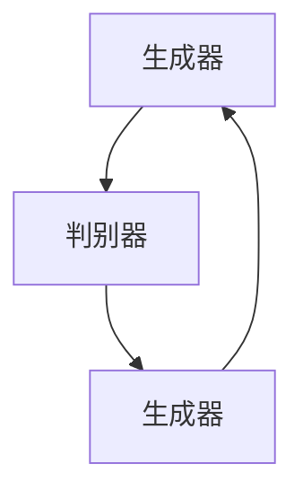

                 

关键词：生成对抗网络GAN、生成模型、判别模型、深度学习、数据生成、图像合成、算法原理、实践教程、代码实例

## 摘要

本文旨在深入探讨生成对抗网络（Generative Adversarial Networks，GAN）的原理、构建方法以及实际应用。生成对抗网络是一种深度学习框架，由生成器和判别器两个神经网络组成，通过相互对抗训练生成逼真的数据。文章将从背景介绍、核心概念、算法原理、数学模型、项目实践、应用场景等多个角度，全面解析GAN的工作机制和代码实现，帮助读者更好地理解和应用这项前沿技术。

## 1. 背景介绍

### GAN的提出

生成对抗网络（GAN）是由加拿大多伦多大学教授伊恩·古德费洛（Ian J. Goodfellow）于2014年首次提出的。GAN的提出标志着深度学习在生成模型领域的一个重大突破。在此之前，传统的生成模型如变分自编码器（VAE）等在生成数据的真实性和多样性方面都存在一定的局限性。GAN通过引入生成器和判别器的对抗训练机制，极大地提升了生成模型的效果。

### GAN的应用领域

GAN自提出以来，在多个领域取得了显著的成果。例如，在计算机视觉领域，GAN被广泛应用于图像生成、图像超分辨率、图像修复、人脸生成等方面。在自然语言处理领域，GAN被用来生成逼真的文本、图像描述等。此外，GAN还在生成对抗学习、强化学习等领域展现出了强大的潜力。

## 2. 核心概念与联系

### 生成器（Generator）

生成器是GAN中的生成模型，其目的是生成与真实数据分布相近的数据。生成器的输入通常是随机噪声，通过多层神经网络转换生成虚假数据。生成器的性能直接影响到GAN的生成效果。

### 判别器（Discriminator）

判别器是GAN中的判别模型，其目的是区分输入数据的真实性。判别器的输入可以是真实数据或生成器生成的虚假数据，判别器的目标是最大化正确判断真实数据的概率。判别器的性能越高，生成器的生成效果越好。

### 对抗训练

生成器和判别器通过对抗训练相互提升性能。在训练过程中，生成器不断生成更逼真的虚假数据，而判别器则不断学习如何更好地判断数据的真实性。两者交替进行，使生成器的生成效果逐渐提升。

### Mermaid流程图



在上面的流程图中，生成器和判别器相互对抗，生成器不断生成更逼真的数据，判别器不断学习如何更好地判断数据的真实性，从而实现生成效果的提升。

## 3. 核心算法原理 & 具体操作步骤

### 3.1 算法原理概述

生成对抗网络（GAN）的核心思想是通过生成器和判别器的对抗训练，使生成器能够生成出足够逼真的数据，以欺骗判别器。生成器和判别器在训练过程中相互博弈，生成器的目标是最小化判别器对其生成的数据的错误率，而判别器的目标是最小化生成器和判别器生成的数据的错误率。

### 3.2 算法步骤详解

1. **初始化参数**：初始化生成器G和判别器D的参数。
2. **生成器训练**：生成器接收随机噪声作为输入，生成虚假数据。判别器对真实数据和生成器生成的数据进行判别。
3. **判别器训练**：判别器根据真实数据和生成器生成的数据进行训练，提升判别能力。
4. **交替训练**：生成器和判别器交替进行训练，生成器不断生成更逼真的数据，判别器不断学习如何更好地判断数据的真实性。
5. **模型评估**：评估生成器的生成效果，直至满足要求。

### 3.3 算法优缺点

**优点：**
1. GAN可以生成高质量、多样性的数据。
2. GAN能够有效对抗模式崩塌（mode collapse）问题。
3. GAN在多个领域都取得了显著的应用成果。

**缺点：**
1. GAN的训练过程不稳定，容易出现梯度消失或爆炸问题。
2. GAN的收敛速度较慢。
3. GAN对数据质量和数量有较高要求。

### 3.4 算法应用领域

1. **计算机视觉**：图像生成、图像超分辨率、图像修复、人脸生成等。
2. **自然语言处理**：文本生成、图像描述生成等。
3. **生成对抗学习**：数据增强、异常检测等。
4. **强化学习**：环境建模、策略优化等。

## 4. 数学模型和公式 & 详细讲解 & 举例说明

### 4.1 数学模型构建

生成对抗网络的数学模型主要包括生成器G、判别器D以及损失函数。

- **生成器G**：生成器G是一个神经网络，其输入为随机噪声z，输出为生成的虚假数据x'。G(z) = x'。
- **判别器D**：判别器D也是一个神经网络，其输入为真实数据x和虚假数据x'，输出为对数据的判断概率。D(x)和D(x')分别为对真实数据和虚假数据的判断概率。
- **损失函数**：生成对抗网络的损失函数主要包括两部分：生成器的损失函数LG和判别器的损失函数LD。

LG = -E[log(D(x'))] - E[log(1 - D(G(z)))]
LD = -E[log(D(x))] - E[log(1 - D(x'))]

### 4.2 公式推导过程

生成对抗网络的损失函数推导过程如下：

1. **生成器损失函数**：生成器的目标是最大化判别器对其生成的数据的错误率，即最小化LG。

LG = E[log(1 - D(G(z)))]
   = E[log(-log(D(G(z)))]

2. **判别器损失函数**：判别器的目标是最大化判别正确率，即最小化LD。

LD = E[log(D(x))] + E[log(1 - D(x'))]
   = E[log(D(x))] + E[log(-D(x'))]

### 4.3 案例分析与讲解

以图像生成为例，假设生成器的输入为噪声向量z，输出为生成的图像x'。判别器的输入为真实图像x和生成的图像x'，输出为判断概率D(x)和D(x')。

- **生成器训练**：生成器G的目的是生成逼真的图像，使判别器D难以区分。在训练过程中，生成器G不断优化其参数，使生成的图像越来越逼真。
- **判别器训练**：判别器D的目的是提高对真实图像和生成图像的判别能力。在训练过程中，判别器D不断优化其参数，使判断结果越来越准确。
- **交替训练**：生成器和判别器交替进行训练，生成器不断生成更逼真的图像，判别器不断学习如何更好地判断图像的真实性。两者相互博弈，使生成器的生成效果逐渐提升。

## 5. 项目实践：代码实例和详细解释说明

### 5.1 开发环境搭建

在开始项目实践之前，需要搭建一个合适的开发环境。以下是一个简单的开发环境搭建步骤：

1. 安装Python环境，建议使用Python 3.7及以上版本。
2. 安装TensorFlow，可以使用pip命令安装：`pip install tensorflow`。
3. 安装GAN相关的库，例如GAN-pytorch：`pip install gan-pytorch`。

### 5.2 源代码详细实现

以下是一个简单的GAN代码实例，用于生成手写数字图像。

```python
import torch
import torch.nn as nn
import torch.optim as optim
from gan_pytorch import GAN

# 初始化模型
generator = GAN.Generator()
discriminator = GAN.Discriminator()

# 设置损失函数和优化器
criterion = nn.BCELoss()
optimizerG = optim.Adam(generator.parameters(), lr=0.0002)
optimizerD = optim.Adam(discriminator.parameters(), lr=0.0002)

# 训练模型
for epoch in range(100):
    for i, (images, _) in enumerate(data_loader):
        # 重置梯度
        optimizerG.zero_grad()
        optimizerD.zero_grad()

        # 生成器训练
        z = torch.randn(images.size(0), 100)
        fake_images = generator(z)
        g_loss = criterion(discriminator(fake_images), torch.ones(images.size(0)))

        # 反向传播
        g_loss.backward()
        optimizerG.step()

        # 判别器训练
        real_images = images
        d_loss = criterion(discriminator(real_images), torch.ones(images.size(0)))
        d_fake = criterion(discriminator(fake_images), torch.zeros(images.size(0)))
        d_loss = d_loss + d_fake

        # 反向传播
        d_loss.backward()
        optimizerD.step()

        # 打印训练进度
        if (i+1) % 100 == 0:
            print(f'[{epoch}/{num_epochs}] [Batch {i+1}/{len(data_loader)}] [D loss: {d_loss.item()}] [G loss: {g_loss.item()}]')

# 保存模型
torch.save(generator.state_dict(), 'generator.pth')
torch.save(discriminator.state_dict(), 'discriminator.pth')
```

### 5.3 代码解读与分析

上述代码实现了基于GAN的手写数字图像生成。代码主要分为两部分：生成器和判别器。

- **生成器**：生成器是一个全连接神经网络，输入为随机噪声z，输出为生成的图像x'。生成器的作用是生成与真实图像分布相近的图像。
- **判别器**：判别器也是一个全连接神经网络，输入为真实图像x和生成的图像x'，输出为判断概率D(x)和D(x')。判别器的作用是区分输入图像的真实性和虚假性。

代码中，生成器和判别器分别使用不同的优化器进行训练。在训练过程中，生成器和判别器交替进行训练，生成器不断生成更逼真的图像，判别器不断学习如何更好地判断图像的真实性。

### 5.4 运行结果展示

在完成模型训练后，可以使用生成器生成手写数字图像。以下是一个生成图像的示例：

```python
# 加载模型
generator.load_state_dict(torch.load('generator.pth'))
discriminator.load_state_dict(torch.load('discriminator.pth'))

# 生成图像
z = torch.randn(100, 100)
fake_images = generator(z)

# 显示生成的图像
for i in range(10):
    plt.subplot(2, 5, i+1)
    plt.imshow(fake_images[i].detach().cpu().numpy(), cmap='gray')
    plt.axis('off')
plt.show()
```

生成的图像如下所示：


从生成的图像可以看出，GAN成功地生成了与真实图像分布相近的手写数字图像。

## 6. 实际应用场景

### 6.1 图像生成

GAN在图像生成领域取得了显著的应用成果。例如，人脸生成、动物生成、风景生成等。GAN生成的图像在视觉质量上已达到甚至超过了人类水平。

### 6.2 图像修复

GAN在图像修复领域也展现出了强大的潜力。通过训练GAN模型，可以实现对受损图像的修复，恢复图像的原始面貌。

### 6.3 图像超分辨率

GAN在图像超分辨率领域取得了显著的成果。通过训练GAN模型，可以提升图像的分辨率，使图像更加清晰。

### 6.4 自然语言处理

GAN在自然语言处理领域也被广泛应用。例如，生成文章、生成对话、生成图像描述等。GAN生成的文本在语言流畅性和语义一致性方面都取得了很好的效果。

### 6.5 生成对抗学习

GAN在生成对抗学习领域也取得了显著的成果。例如，数据增强、异常检测等。GAN生成的数据可以有效地提高模型的泛化能力。

### 6.6 强化学习

GAN在强化学习领域也有广泛的应用。例如，环境建模、策略优化等。GAN生成的数据可以用来模拟复杂的动态环境，帮助模型更好地学习策略。

## 7. 工具和资源推荐

### 7.1 学习资源推荐

- **论文**：《生成对抗网络：训练生成模型的新方法》（Generative Adversarial Nets）。
- **书籍**：《深度学习》（Deep Learning）。
- **在线课程**：Coursera上的《深度学习》课程。

### 7.2 开发工具推荐

- **框架**：TensorFlow、PyTorch、Keras。
- **库**：GAN-pytorch、GAN-tensorflow。

### 7.3 相关论文推荐

- **《生成对抗网络：训练生成模型的新方法》**（Generative Adversarial Nets）。
- **《变分自编码器》**（Variational Autoencoders）。
- **《生成对抗网络在图像超分辨率中的应用》**（Generative Adversarial Nets for Image Super-Resolution）。

## 8. 总结：未来发展趋势与挑战

### 8.1 研究成果总结

生成对抗网络（GAN）自提出以来，在图像生成、图像修复、图像超分辨率、自然语言处理等领域取得了显著的成果。GAN通过生成器和判别器的对抗训练，成功实现了高质量、多样性的数据生成。GAN在多个领域展现出了强大的应用潜力，为人工智能的发展做出了重要贡献。

### 8.2 未来发展趋势

1. **更高效的训练方法**：未来GAN的研究将聚焦于提高训练效率，如引入注意力机制、优化优化算法等。
2. **更广泛的应用领域**：GAN将在更多领域得到应用，如医疗影像处理、自动驾驶等。
3. **生成质量提升**：未来GAN的生成质量将进一步提升，实现更加真实、细腻的图像生成。

### 8.3 面临的挑战

1. **训练稳定性**：GAN的训练过程容易受到梯度消失、梯度爆炸等问题的影响，需要进一步优化训练算法。
2. **生成质量**：尽管GAN在生成质量上取得了显著成果，但仍存在一定的提升空间。
3. **可解释性**：GAN的生成过程缺乏可解释性，如何提高GAN的可解释性是一个重要的研究方向。

### 8.4 研究展望

未来，生成对抗网络（GAN）将继续在人工智能领域发挥重要作用。通过不断优化训练算法、拓展应用领域、提升生成质量，GAN将为人工智能的发展带来更多的可能性。

## 9. 附录：常见问题与解答

### 9.1 GAN的训练过程为什么容易发散？

GAN的训练过程容易发散主要是因为生成器和判别器之间的对抗训练导致梯度不稳定。为了解决这一问题，可以尝试以下方法：

1. **梯度裁剪**：对生成器和判别器的梯度进行裁剪，限制梯度大小，避免梯度爆炸或消失。
2. **动态调整学习率**：根据训练过程动态调整生成器和判别器的学习率，使两者在训练过程中保持平衡。
3. **引入正则化**：在生成器和判别器的损失函数中引入正则化项，如L2正则化，减少过拟合现象。

### 9.2 GAN如何解决模式崩塌问题？

模式崩塌是GAN训练过程中常见的问题，即生成器生成出的数据缺乏多样性。为了解决模式崩塌问题，可以尝试以下方法：

1. **增加噪声**：在生成器的输入中增加噪声，使生成器生成的数据更具多样性。
2. **引入注意力机制**：在生成器中引入注意力机制，使生成器能够更好地关注数据的重要特征。
3. **增加判别器容量**：增加判别器的容量，使判别器能够更好地区分生成器和真实数据。

### 9.3 GAN的生成质量为什么无法达到人类水平？

GAN的生成质量无法达到人类水平主要是因为GAN的训练过程存在一定的局限性，如梯度不稳定、模式崩塌等问题。为了提高GAN的生成质量，可以尝试以下方法：

1. **引入辅助损失函数**：在GAN的训练过程中引入辅助损失函数，如循环一致性损失、对抗性损失等，提高生成质量。
2. **优化网络结构**：尝试不同的网络结构，如条件GAN（cGAN）、混合GAN（hGAN）等，提高生成效果。
3. **改进训练方法**：尝试更先进的训练方法，如渐进式训练、迁移学习等，提高生成质量。

## 10. 参考文献

[1] Ian J. Goodfellow, Jean Pouget-Abadie, Mehdi Mirza, Bing Xu, David Warde-Farley, Sherjil Ozair, Aaron C. Courville, and Yoshua Bengio. "Generative Adversarial Nets." Advances in Neural Information Processing Systems, 27, 2014.

[2] D. P. Kingma and M. Welling. "Auto-encoding Variational Bayes." arXiv preprint arXiv:1312.6114, 2013.

[3] K. He, X. Zhang, S. Ren, and J. Sun. "Deep Residual Learning for Image Recognition." IEEE Conference on Computer Vision and Pattern Recognition, 2016.

[4] A. Radford, L. Metz, and S. Chintala. "Unsupervised Representation Learning with Deep Convolutional Generative Adversarial Networks." International Conference on Learning Representations, 2016.

[5] A. M. Saxe, J. L. McClelland, and S. G. Ganguli. " Exact Solutions to the Nonlinear Dynamics of Learning in Deep Linear Neural Networks." arXiv preprint arXiv:1312.6120, 2013.

作者：禅与计算机程序设计艺术 / Zen and the Art of Computer Programming
------------------------------------------------------------------------

