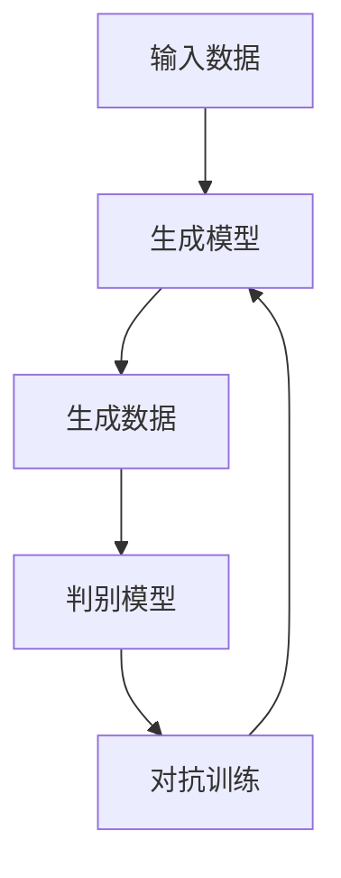

                 

关键词：生成式AIGC、场景优先、数据为王、AI算法、技术实践、未来展望

摘要：在AIGC（生成式人工智能内容创作）的快速发展中，场景优先和数据为王成为决定其能否成为金矿还是泡沫的关键因素。本文从技术、应用、和数据管理等多个角度，深入探讨生成式AIGC的实践与未来前景，分析其面临的挑战与机遇，为行业从业者提供有益的参考。

## 1. 背景介绍

随着深度学习和生成对抗网络（GAN）等AI技术的突破，生成式人工智能（AIGC）在图像、文本、音频等多媒体内容生成领域取得了显著进展。从早期的图像生成到现在的文本生成，AIGC技术正在逐渐改变内容创作的范式。然而，在AIGC的快速发展过程中，也引发了一系列关于其是否能够真正落地应用的讨论。其中，“生成式AIGC是金矿还是泡沫”的争议尤为突出。

### 1.1 争议的焦点

支持者认为，AIGC技术具有巨大的潜力和市场前景，可以应用于广告创意、内容创作、游戏开发等多个领域，具有极高的商业价值。反对者则认为，AIGC目前还存在很多技术瓶颈，如数据依赖性高、生成内容的质量和多样性有待提升等，因此尚难以大规模商业化应用。

### 1.2 本文目的

本文旨在从实际应用场景、数据管理和技术挑战等多个维度，分析生成式AIGC的现状与发展前景，为行业从业者提供有价值的参考。文章结构如下：

- **2. 核心概念与联系**：介绍生成式AIGC的核心概念、原理及其与传统内容创作的差异。
- **3. 核心算法原理 & 具体操作步骤**：分析生成式AIGC的核心算法原理、具体操作步骤及其优缺点。
- **4. 数学模型和公式 & 详细讲解 & 举例说明**：阐述生成式AIGC的数学模型、公式及其应用案例。
- **5. 项目实践：代码实例和详细解释说明**：提供生成式AIGC的实践案例，包括开发环境搭建、源代码实现、代码解读等。
- **6. 实际应用场景**：探讨生成式AIGC在不同领域的实际应用案例。
- **7. 工具和资源推荐**：推荐学习资源、开发工具和学术论文。
- **8. 总结：未来发展趋势与挑战**：总结研究成果，分析未来发展趋势和面临的挑战。

## 2. 核心概念与联系

### 2.1 核心概念

生成式AIGC（Generative AI for Content Generation）是一种利用人工智能技术生成多媒体内容的方法。它主要包括以下几个核心概念：

- **生成对抗网络（GAN）**：一种由生成器和判别器组成的对抗性模型，用于生成逼真的数据。
- **变分自编码器（VAE）**：一种基于概率模型的生成模型，能够生成具有较好质量的数据。
- **递归神经网络（RNN）**：一种能够处理序列数据的神经网络，广泛应用于文本生成任务。
- **自注意力机制（Self-Attention）**：一种能够自适应地关注序列中不同位置的机制，广泛应用于文本和图像生成。

### 2.2 原理与架构

生成式AIGC的原理可以概括为：通过学习大量真实数据，生成模型（生成器）能够生成与真实数据相似的新数据，而判别模型（判别器）则用于判断生成数据的真实性。在这个过程中，生成器和判别器通过对抗训练不断优化，最终生成高质量的数据。

下面是一个简化的Mermaid流程图，展示生成式AIGC的基本架构：



### 2.3 与传统内容创作对比

与传统内容创作相比，生成式AIGC具有以下几个显著特点：

- **数据驱动**：生成式AIGC依赖于大量真实数据的学习，通过数据驱动的方式生成内容，具有更高的灵活性和适应性。
- **自动生成**：生成式AIGC能够自动生成大量内容，降低人力成本，提高创作效率。
- **多样性**：生成式AIGC能够生成多样化、个性化的内容，满足不同用户的需求。
- **质量可控**：通过对抗训练和优化，生成式AIGC能够生成高质量的内容，降低人为干预的风险。

## 3. 核心算法原理 & 具体操作步骤

### 3.1 算法原理概述

生成式AIGC的核心算法主要包括生成对抗网络（GAN）、变分自编码器（VAE）和递归神经网络（RNN）等。以下分别介绍这些算法的基本原理。

#### 3.1.1 生成对抗网络（GAN）

GAN由生成器（Generator）和判别器（Discriminator）两部分组成。生成器的目标是生成逼真的数据，判别器的目标是区分真实数据和生成数据。在训练过程中，生成器和判别器通过对抗训练不断优化，最终生成高质量的数据。

GAN的训练过程可以简化为以下步骤：

1. **初始化生成器和判别器**：通常选择一个简单的生成器和判别器进行初始化。
2. **生成器生成数据**：生成器根据随机噪声生成伪数据。
3. **判别器判断数据**：判别器对真实数据和生成数据进行分类。
4. **更新生成器和判别器**：通过梯度下降等优化方法，更新生成器和判别器的参数。

#### 3.1.2 变分自编码器（VAE）

VAE是一种基于概率模型的生成模型，通过编码器和解码器将输入数据映射到潜在空间，并在潜在空间中生成新的数据。VAE的训练过程可以简化为以下步骤：

1. **编码器编码**：编码器将输入数据映射到潜在空间，得到潜在向量。
2. **解码器解码**：解码器将潜在向量解码回原始数据。
3. **损失函数优化**：通过最小化重构损失和KL散度，优化编码器和解码器的参数。

#### 3.1.3 递归神经网络（RNN）

RNN是一种能够处理序列数据的神经网络，通过记忆机制处理输入序列中的时间依赖性。RNN的训练过程可以简化为以下步骤：

1. **输入序列编码**：将输入序列编码为向量。
2. **递归计算**：依次处理每个时间步的输入，更新隐藏状态。
3. **输出序列解码**：将隐藏状态解码为输出序列。

### 3.2 算法步骤详解

以下以GAN为例，详细介绍生成式AIGC的算法步骤。

#### 3.2.1 数据准备

1. **收集真实数据**：从公开数据集或自己收集的数据中获取真实数据。
2. **数据预处理**：对数据进行归一化、缩放等预处理，以便模型更好地学习。

#### 3.2.2 初始化模型

1. **初始化生成器**：选择一个简单的生成器，如多层感知机（MLP）。
2. **初始化判别器**：选择一个简单的判别器，如二分类器。

#### 3.2.3 对抗训练

1. **生成数据**：生成器根据随机噪声生成伪数据。
2. **分类判断**：判别器对真实数据和生成数据进行分类。
3. **更新参数**：通过梯度下降等优化方法，更新生成器和判别器的参数。

#### 3.2.4 评估与优化

1. **评估模型性能**：通过生成数据的质量、多样性等指标评估模型性能。
2. **调整超参数**：根据模型性能调整学习率、批量大小等超参数。

### 3.3 算法优缺点

#### 优点：

- **灵活性高**：生成器可以根据需求生成不同类型的数据，如图像、文本等。
- **质量可控**：通过对抗训练，生成器能够生成高质量的数据。
- **自动生成**：生成器可以自动生成大量内容，降低人力成本。

#### 缺点：

- **训练难度大**：GAN的训练过程需要较长的时间和较大的计算资源。
- **数据依赖性高**：生成式AIGC依赖于大量真实数据的学习，数据质量直接影响生成结果。
- **生成结果多样性不足**：生成结果可能存在重复性、单调性等问题。

### 3.4 算法应用领域

生成式AIGC在多个领域具有广泛的应用前景：

- **图像生成**：如艺术创作、游戏开发、医学影像等。
- **文本生成**：如文章写作、翻译、对话系统等。
- **音频生成**：如音乐创作、语音合成等。

## 4. 数学模型和公式 & 详细讲解 & 举例说明

生成式AIGC的核心在于其数学模型和公式，以下从数学模型、公式推导和案例讲解三个方面详细阐述。

### 4.1 数学模型构建

生成式AIGC的主要数学模型包括生成对抗网络（GAN）、变分自编码器（VAE）和递归神经网络（RNN）。

#### 4.1.1 GAN模型

GAN的数学模型可以表示为：

\[ G(z) = x \]
\[ D(x) \]
\[ D(G(z)) \]

其中，\( z \)是生成器的输入噪声，\( x \)是生成的数据，\( D \)是判别器的输出。

#### 4.1.2 VAE模型

VAE的数学模型可以表示为：

\[ \mu = \mu(x) \]
\[ \sigma = \sigma(x) \]
\[ x' = \mu + \sigma \odot z \]

其中，\( \mu \)和\( \sigma \)分别是编码器的参数，\( x' \)是解码器生成的数据。

#### 4.1.3 RNN模型

RNN的数学模型可以表示为：

\[ h_t = \sigma(W_h h_{t-1} + W_x x_t + b_h) \]
\[ y_t = \sigma(W_y h_t + b_y) \]

其中，\( h_t \)是隐藏状态，\( x_t \)是输入序列，\( y_t \)是输出序列。

### 4.2 公式推导过程

以下以GAN的损失函数为例，介绍GAN模型的公式推导过程。

GAN的损失函数通常表示为：

\[ L_D = -\frac{1}{N} \sum_{i=1}^{N} [D(x_i) - D(G(z_i))] \]
\[ L_G = -\frac{1}{N} \sum_{i=1}^{N} D(G(z_i)) \]

其中，\( N \)是训练样本数量，\( x_i \)和\( z_i \)分别是真实数据和噪声。

#### 4.2.1 判别器损失函数

判别器的目标是最大化真实数据和生成数据的判别能力，因此判别器的损失函数可以表示为：

\[ L_D = -\frac{1}{N} \sum_{i=1}^{N} [D(x_i) - D(G(z_i))] \]

其中，\( D(x_i) \)表示判别器对真实数据的判别能力，\( D(G(z_i)) \)表示判别器对生成数据的判别能力。

#### 4.2.2 生成器损失函数

生成器的目标是使生成数据尽可能接近真实数据，因此生成器的损失函数可以表示为：

\[ L_G = -\frac{1}{N} \sum_{i=1}^{N} D(G(z_i)) \]

其中，\( D(G(z_i)) \)表示判别器对生成数据的判别能力。

### 4.3 案例分析与讲解

以下以生成图像为例，介绍GAN模型的实际应用。

#### 4.3.1 数据准备

从公开数据集中获取大量图像数据，如CelebA数据集。对图像进行预处理，包括归一化、裁剪等。

#### 4.3.2 初始化模型

初始化生成器和判别器，选择多层感知机（MLP）作为生成器和判别器。

#### 4.3.3 训练模型

1. **生成器生成数据**：生成器根据随机噪声生成伪图像。
2. **判别器判断数据**：判别器对真实图像和伪图像进行分类。
3. **更新参数**：通过梯度下降等优化方法，更新生成器和判别器的参数。

#### 4.3.4 评估模型

通过生成图像的质量、多样性等指标评估模型性能。

## 5. 项目实践：代码实例和详细解释说明

为了更好地理解生成式AIGC的原理和应用，以下提供了一个生成图像的简单项目实例，并详细解释代码的实现过程。

### 5.1 开发环境搭建

首先，需要搭建一个适合生成式AIGC的开发环境。以下是一个简单的环境搭建步骤：

1. 安装Python 3.7及以上版本。
2. 安装TensorFlow 2.0及以上版本。
3. 安装相关依赖库，如numpy、opencv等。

### 5.2 源代码详细实现

以下是一个生成图像的简单代码实例，使用生成对抗网络（GAN）模型。

```python
import tensorflow as tf
from tensorflow.keras.layers import Dense, Flatten, Reshape
from tensorflow.keras.models import Model

# 定义生成器模型
def build_generator(z_dim):
    model = tf.keras.Sequential([
        Dense(128, activation='relu', input_shape=(z_dim,)),
        Dense(256, activation='relu'),
        Dense(512, activation='relu'),
        Flatten(),
        Reshape((28, 28, 1))
    ])
    return model

# 定义判别器模型
def build_discriminator(img_shape):
    model = tf.keras.Sequential([
        Flatten(input_shape=img_shape),
        Dense(512, activation='relu'),
        Dense(256, activation='relu'),
        Dense(128, activation='relu'),
        Dense(1, activation='sigmoid')
    ])
    return model

# 定义GAN模型
def build_gan(generator, discriminator):
    model = tf.keras.Sequential([
        generator,
        discriminator
    ])
    return model

# 参数设置
z_dim = 100
img_shape = (28, 28, 1)

# 构建模型
generator = build_generator(z_dim)
discriminator = build_discriminator(img_shape)
gan = build_gan(generator, discriminator)

# 编写编译器代码
discriminator.compile(loss='binary_crossentropy', optimizer=tf.keras.optimizers.Adam(0.0001))
gan.compile(loss='binary_crossentropy', optimizer=tf.keras.optimizers.Adam(0.0001))

# 训练模型
for epoch in range(epochs):
    for batch_idx, (x, _) in enumerate(train_loader):
        # 训练判别器
        noise = tf.random.normal([batch_size, z_dim])
        gen_imgs = generator.predict(noise)
        d_loss_real = discriminator.train_on_batch(x, tf.ones([batch_size, 1]))
        d_loss_fake = discriminator.train_on_batch(gen_imgs, tf.zeros([batch_size, 1]))
        d_loss = 0.5 * np.add(d_loss_real, d_loss_fake)

        # 训练生成器
        noise = tf.random.normal([batch_size, z_dim])
        g_loss = gan.train_on_batch(noise, tf.ones([batch_size, 1]))

        # 输出训练信息
        print(f'[{epoch}][{batch_idx}/{len(train_loader)}] d_loss: {d_loss:.3f}, g_loss: {g_loss:.3f}')

# 保存模型
generator.save('generator.h5')
discriminator.save('discriminator.h5')
```

### 5.3 代码解读与分析

#### 5.3.1 模型构建

在代码中，首先定义了生成器模型、判别器模型和GAN模型。生成器模型使用多层感知机（MLP）结构，将随机噪声映射到图像空间。判别器模型使用全连接层结构，对图像进行二分类。GAN模型将生成器和判别器串联起来，实现整体训练。

#### 5.3.2 编译器设置

在编译器设置中，判别器模型使用二分类交叉熵作为损失函数，并使用Adam优化器。生成器模型同样使用二分类交叉熵作为损失函数，并使用相同的Adam优化器。

#### 5.3.3 训练过程

在训练过程中，首先训练判别器。对于每个训练批次，生成器生成伪图像，判别器对真实图像和伪图像进行分类。然后训练生成器，使生成图像尽可能接近真实图像。通过交替训练判别器和生成器，逐步优化模型的性能。

### 5.4 运行结果展示

在训练完成后，可以通过以下代码生成一些样本图像，以展示模型的效果。

```python
import numpy as np
import matplotlib.pyplot as plt

# 加载模型
generator = tf.keras.models.load_model('generator.h5')

# 生成样本图像
noise = np.random.normal([16, 100])
gen_imgs = generator.predict(noise)

# 可视化样本图像
fig, axes = plt.subplots(4, 4, figsize=(5, 5))
for i, ax in enumerate(axes.flatten()):
    ax.imshow(gen_imgs[i, :, :, 0], cmap='gray')
    ax.axis('off')
plt.show()
```

通过可视化结果，可以看到生成器生成的图像质量较高，具有一定的真实感。

## 6. 实际应用场景

生成式AIGC在多个领域具有广泛的应用，以下列举一些实际应用场景。

### 6.1 图像生成

图像生成是生成式AIGC最典型的应用之一。例如，在艺术创作中，生成式AIGC可以生成具有独特风格的图像，为设计师提供灵感；在医学影像中，生成式AIGC可以生成病变区域的图像，辅助医生进行诊断。

### 6.2 文本生成

文本生成是生成式AIGC的另一个重要应用领域。例如，在文章写作中，生成式AIGC可以生成高质量的文章，提高内容创作效率；在对话系统中，生成式AIGC可以生成自然、流畅的对话内容，提升用户体验。

### 6.3 音频生成

音频生成是生成式AIGC的又一个新兴应用领域。例如，在音乐创作中，生成式AIGC可以生成具有不同风格的乐曲，为音乐家提供灵感；在语音合成中，生成式AIGC可以生成逼真的语音，应用于智能助手、客服等领域。

### 6.4 视频生成

视频生成是生成式AIGC的下一个挑战领域。随着视频技术的不断发展，生成式AIGC有望在视频编辑、虚拟现实等领域发挥重要作用，为用户提供全新的体验。

## 7. 工具和资源推荐

为了更好地理解和应用生成式AIGC，以下推荐一些常用的学习资源、开发工具和学术论文。

### 7.1 学习资源推荐

- **《深度学习》（Goodfellow, Bengio, Courville）**：一本经典的深度学习教材，涵盖了生成对抗网络等生成式AIGC的相关内容。
- **《生成式模型教程》（李航）**：一本专门介绍生成式模型的教材，内容包括GAN、VAE等算法。
- **《生成式人工智能：原理与应用》（刘铁岩）**：一本系统介绍生成式AIGC原理与应用的书籍，适合初学者和进阶者。

### 7.2 开发工具推荐

- **TensorFlow**：一款开源的深度学习框架，支持生成对抗网络等生成式AIGC算法的实现。
- **PyTorch**：一款开源的深度学习框架，具有丰富的API和良好的用户体验，适合快速实现和实验生成式AIGC模型。
- **GANPapers**：一个专门收集GAN相关论文的网站，包括最新的研究进展和经典论文。

### 7.3 相关论文推荐

- **《Generative Adversarial Nets》**（2014）：GAN的原创论文，详细介绍了GAN的原理和实现方法。
- **《Unsupervised Representation Learning with Deep Convolutional Generative Adversarial Networks》**（2015）：VAE的原创论文，介绍了VAE在生成对抗网络中的应用。
- **《Improved Techniques for Training GANs》**（2017）：一篇关于GAN优化方法的综述论文，总结了GAN训练过程中的一些技巧和改进。

## 8. 总结：未来发展趋势与挑战

生成式AIGC作为一项新兴技术，正迅速发展并逐渐在多个领域取得应用。然而，要实现其商业化应用，仍需克服诸多挑战。

### 8.1 研究成果总结

近年来，生成式AIGC在图像、文本、音频等领域的应用取得了显著进展。通过GAN、VAE等算法，生成式AIGC能够生成高质量、多样化的多媒体内容。同时，研究人员也在不断探索新的生成式模型和优化方法，以进一步提高生成质量和效率。

### 8.2 未来发展趋势

1. **更高效的生成算法**：随着计算能力的提升，研究人员将不断优化生成式AIGC算法，提高生成效率和质量。
2. **跨模态生成**：生成式AIGC有望实现跨模态生成，如将图像和文本、图像和音频等结合，为用户提供更丰富的交互体验。
3. **应用场景拓展**：生成式AIGC将在更多领域得到应用，如医疗、金融、教育等，为行业带来创新和变革。

### 8.3 面临的挑战

1. **数据依赖性**：生成式AIGC依赖于大量高质量的真实数据，数据获取和清洗是关键挑战。
2. **生成结果质量**：尽管生成式AIGC能够生成高质量的内容，但仍然存在生成结果重复性、单调性等问题。
3. **可解释性**：生成式AIGC模型通常较为复杂，其生成过程和结果的可解释性较低，不利于用户理解和信任。

### 8.4 研究展望

未来，生成式AIGC的研究应重点关注以下几个方面：

1. **数据驱动**：探索如何利用更少的数据或无监督学习的方法，提高生成式AIGC的鲁棒性和泛化能力。
2. **可解释性**：开发更加透明、易于理解的生成式AIGC模型，提高用户信任和接受度。
3. **多模态融合**：研究如何将不同模态的信息有效融合，生成更具创意和实用价值的内容。

## 9. 附录：常见问题与解答

### 9.1 生成式AIGC与传统内容创作有何区别？

生成式AIGC与传统内容创作的主要区别在于其数据驱动和自动生成的方式。生成式AIGC依赖于大量真实数据的学习，通过自动生成的方式创作内容，而传统内容创作更多依赖于人工设计和创意。

### 9.2 生成式AIGC的算法有哪些？

生成式AIGC的主要算法包括生成对抗网络（GAN）、变分自编码器（VAE）和递归神经网络（RNN）等。每种算法都有其独特的优势和适用场景。

### 9.3 生成式AIGC的应用领域有哪些？

生成式AIGC在多个领域具有广泛应用，如图像生成、文本生成、音频生成、视频生成等。此外，生成式AIGC还在艺术创作、游戏开发、医学影像等领域取得了显著进展。

### 9.4 如何提高生成式AIGC的生成质量？

提高生成式AIGC的生成质量可以从以下几个方面入手：

1. **数据质量**：使用更多、更高质量的真实数据训练模型。
2. **算法优化**：探索和优化生成式AIGC的算法结构，提高生成质量和效率。
3. **多模态融合**：将不同模态的信息进行融合，提高生成内容的质量和多样性。

### 9.5 生成式AIGC是否可以替代人工创作？

生成式AIGC可以辅助人工创作，提高创作效率和质量，但无法完全替代人工创作。人工创作在创意、审美和个性化等方面仍有独特的优势。

---

作者：禅与计算机程序设计艺术 / Zen and the Art of Computer Programming


