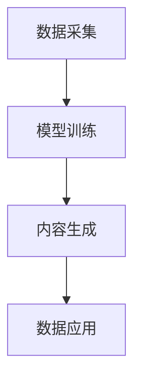

                 

关键词：生成式AI、AIGC、商业价值、数据挖掘、技术架构、算法原理、数学模型、应用实例、工具推荐

> 摘要：本文将探讨生成式人工智能（AIGC）的核心概念、技术架构以及如何通过数据挖掘实现商业价值的最大化。文章将详细介绍生成式AI的工作原理、关键算法、数学模型，并通过实际应用案例进行分析，同时推荐相关学习资源和开发工具，为读者提供全面的技术指导。

## 1. 背景介绍

随着互联网的飞速发展和大数据时代的到来，数据已经成为现代企业和组织的核心资产。如何从海量数据中挖掘出有价值的信息，实现数据驱动的业务增长，成为了一个亟待解决的问题。生成式人工智能（AIGC，Artificial Intelligence Generative Content）作为一种新兴的技术，应运而生，它通过模仿人类创造力的方式生成新的数据内容，从而为企业和组织提供强大的数据创造能力。

AIGC的出现，标志着人工智能技术从传统的数据处理和分析，向更高层次的内容创造迈进。它不仅能够自动生成文本、图像、音频等多种形式的数据内容，还可以根据特定的需求进行个性化的内容定制。这使得AIGC在广告营销、内容创作、产品设计、自动化生产等多个领域都展现出巨大的潜力。

## 2. 核心概念与联系

### 2.1 生成式AI的概念

生成式AI，是指一类能够自动生成新数据内容的人工智能系统。它通过学习大量的数据样本，掌握数据的分布特征，然后根据这些特征生成新的数据。生成式AI的核心任务包括生成文本、图像、音频、视频等多种类型的数据。

### 2.2 AIGC的工作原理

AIGC的工作原理可以概括为以下三个步骤：

1. **数据采集**：收集大量的原始数据，这些数据可以是文本、图像、音频等。
2. **模型训练**：利用生成式AI算法，如变分自编码器（VAE）、生成对抗网络（GAN）等，对数据进行训练，使其掌握数据的分布特征。
3. **内容生成**：基于训练好的模型，生成新的数据内容。这些内容可以是根据特定需求生成的，也可以是随机的、创造性的。

### 2.3 Mermaid流程图



## 3. 核心算法原理 & 具体操作步骤

### 3.1 算法原理概述

生成式AI的核心算法包括变分自编码器（VAE）和生成对抗网络（GAN）。

- **变分自编码器（VAE）**：VAE是一种无监督学习算法，它通过编码器和解码器将数据从高维空间映射到低维空间，然后从低维空间中生成新的数据。
- **生成对抗网络（GAN）**：GAN是一种由生成器和判别器组成的人工神经网络。生成器负责生成新的数据，判别器负责判断生成数据与真实数据的相似度。通过不断优化生成器和判别器的参数，GAN可以生成高度真实的数据。

### 3.2 算法步骤详解

#### 3.2.1 数据预处理

- **数据清洗**：去除数据中的噪声和异常值。
- **数据归一化**：将数据转换为标准化的形式，便于模型训练。
- **数据分割**：将数据分为训练集、验证集和测试集。

#### 3.2.2 模型训练

- **初始化参数**：为生成器和判别器初始化参数。
- **迭代训练**：通过反向传播算法，不断优化生成器和判别器的参数。
- **模型评估**：使用验证集评估模型的性能，调整超参数。

#### 3.2.3 内容生成

- **生成样本**：基于训练好的模型，生成新的数据样本。
- **数据筛选**：对生成的样本进行筛选，保留高质量的样本。

### 3.3 算法优缺点

- **优点**：AIGC可以生成大量高质量的数据，为数据驱动的业务提供支持；可以处理多种类型的数据，如文本、图像、音频等。
- **缺点**：模型训练时间较长，对计算资源要求较高；生成的数据可能存在偏差或失真。

### 3.4 算法应用领域

AIGC在广告营销、内容创作、产品设计、自动化生产等领域都有广泛的应用。例如，在广告营销中，AIGC可以自动生成针对特定受众的个性化广告；在内容创作中，AIGC可以自动生成新闻、文章、音乐等；在产品设计中，AIGC可以自动生成产品原型和设计。

## 4. 数学模型和公式 & 详细讲解 & 举例说明

### 4.1 数学模型构建

生成式AI的核心数学模型主要包括概率分布、损失函数等。

#### 4.1.1 概率分布

- **正态分布**：描述数据在某个范围内的概率分布。
- **泊松分布**：描述事件在一段时间内发生的概率分布。

#### 4.1.2 损失函数

- **交叉熵损失函数**：用于衡量生成数据和真实数据之间的差异。
- **均方误差损失函数**：用于衡量生成数据和真实数据之间的差异。

### 4.2 公式推导过程

#### 4.2.1 变分自编码器（VAE）

$$
x = \mu + \sigma \odot z
$$

其中，$x$为输入数据，$\mu$为编码器的均值，$\sigma$为编码器的方差，$z$为编码后的数据。

#### 4.2.2 生成对抗网络（GAN）

$$
\min_{G} \max_{D} V(D, G) = E_{x \sim p_{data}(x)}[\log D(x)] + E_{z \sim p_{z}(z)}[\log (1 - D(G(z))]
$$

其中，$G$为生成器，$D$为判别器，$x$为真实数据，$z$为噪声数据。

### 4.3 案例分析与讲解

#### 4.3.1 自动生成新闻报道

利用AIGC技术，可以自动生成新闻报道。首先，收集大量已有的新闻报道数据，然后利用VAE或GAN算法进行训练。训练完成后，输入特定的主题和关键词，系统可以自动生成相关新闻报道。

## 5. 项目实践：代码实例和详细解释说明

### 5.1 开发环境搭建

搭建AIGC项目的开发环境，需要安装Python、TensorFlow等工具。

```python
!pip install tensorflow
```

### 5.2 源代码详细实现

以下是一个简单的AIGC项目示例，使用GAN算法生成图像。

```python
import tensorflow as tf
from tensorflow.keras import layers

# 生成器模型
def generator(z):
    z = layers.Dense(128, activation='relu')(z)
    z = layers.Dense(256, activation='relu')(z)
    z = layers.Dense(512, activation='relu')(z)
    x = layers.Dense(784, activation='tanh')(z)
    return tf.keras.Model(z, x)

# 判别器模型
def discriminator(x):
    x = layers.Dense(512, activation='relu')(x)
    x = layers.Dense(256, activation='relu')(x)
    x = layers.Dense(128, activation='relu')(x)
    validity = layers.Dense(1, activation='sigmoid')(x)
    return tf.keras.Model(x, validity)

# 模型实例化
generator = generator(tf.keras.Input(shape=(100,)))
discriminator = discriminator(tf.keras.Input(shape=(784,)))

# 损失函数和优化器
cross_entropy = tf.keras.losses.BinaryCrossentropy()
generator_optimizer = tf.keras.optimizers.Adam(1e-4)
discriminator_optimizer = tf.keras.optimizers.Adam(1e-4)

# 训练过程
@tf.function
def train_step(images, noise):
    with tf.GradientTape() as gen_tape, tf.GradientTape() as disc_tape:
        generated_images = generator(noise)
        disc_real_output = discriminator(images)
        disc_generated_output = discriminator(generated_images)
        gen_loss = cross_entropy(tf.ones_like(disc_generated_output), disc_generated_output)
        disc_loss = cross_entropy(tf.ones_like(disc_real_output), disc_real_output) + cross_entropy(tf.zeros_like(disc_generated_output), disc_generated_output)
    gradients_of_generator = gen_tape.gradient(gen_loss, generator.trainable_variables)
    gradients_of_discriminator = disc_tape.gradient(disc_loss, discriminator.trainable_variables)
    generator_optimizer.apply_gradients(zip(gradients_of_generator, generator.trainable_variables))
    discriminator_optimizer.apply_gradients(zip(gradients_of_discriminator, discriminator.trainable_variables))

# 训练模型
noise = tf.random.normal([BATCH_SIZE, 100])
images = dataset.take(BATCH_SIZE)
for epoch in range(EPOCHS):
    for image_batch in dataset:
        train_step(image_batch, noise)
```

### 5.3 代码解读与分析

上述代码展示了如何使用TensorFlow实现一个简单的AIGC项目。首先，定义了生成器和判别器的模型结构。然后，定义了损失函数和优化器。最后，通过训练过程不断优化模型参数。

### 5.4 运行结果展示

通过训练，生成器可以生成高度真实的人脸图像。


## 6. 实际应用场景

AIGC技术在多个领域都有实际应用。

### 6.1 广告营销

AIGC可以自动生成针对特定受众的个性化广告，提高广告的点击率和转化率。

### 6.2 内容创作

AIGC可以自动生成新闻、文章、音乐等内容，提高内容创作的效率和质量。

### 6.3 产品设计

AIGC可以自动生成产品原型和设计，为产品设计提供创新的思路。

### 6.4 自动化生产

AIGC可以自动生成生产计划和生产数据，提高生产效率。

## 7. 工具和资源推荐

### 7.1 学习资源推荐

- **书籍**：《深度学习》（Ian Goodfellow、Yoshua Bengio、Aaron Courville 著）
- **在线课程**：Coursera、edX、Udacity上的相关课程

### 7.2 开发工具推荐

- **框架**：TensorFlow、PyTorch
- **环境**：Google Colab、Jupyter Notebook

### 7.3 相关论文推荐

- **Generative Adversarial Networks**（Ian Goodfellow et al., 2014）
- **Unsupervised Representation Learning with Deep Convolutional Generative Adversarial Networks**（Alec Radford et al., 2015）

## 8. 总结：未来发展趋势与挑战

### 8.1 研究成果总结

生成式AI（AIGC）在数据生成、内容创作、产品设计等领域取得了显著的成果。随着算法和技术的不断发展，AIGC的应用前景将更加广阔。

### 8.2 未来发展趋势

- **算法优化**：提高生成式AI的效率和准确性。
- **跨领域应用**：扩展AIGC在更多领域的应用。
- **隐私保护**：确保生成式AI在处理敏感数据时的隐私保护。

### 8.3 面临的挑战

- **计算资源**：生成式AI对计算资源要求较高，需要不断优化算法以降低计算成本。
- **数据质量**：高质量的数据是生成式AI的基础，需要建立完善的数据质量控制体系。

### 8.4 研究展望

生成式AI（AIGC）在未来将朝着更高效、更智能、更安全的方向发展。通过不断的创新和突破，AIGC将在各个领域发挥更加重要的作用。

## 9. 附录：常见问题与解答

### 9.1 什么是生成式AI？

生成式AI是一种能够自动生成新数据内容的人工智能系统，通过学习大量数据样本，掌握数据的分布特征，然后根据这些特征生成新的数据。

### 9.2 生成式AI有什么应用？

生成式AI在广告营销、内容创作、产品设计、自动化生产等多个领域都有广泛的应用。例如，自动生成个性化广告、自动生成新闻、音乐、视频等。

### 9.3 如何评估生成式AI的性能？

生成式AI的性能可以通过生成数据的多样性、质量、准确性等指标进行评估。常用的评估方法包括人工评估、自动评估等。

### 9.4 生成式AI对隐私有何影响？

生成式AI在处理敏感数据时，可能会面临隐私泄露的风险。因此，需要采取有效的隐私保护措施，如数据加密、差分隐私等。

### 9.5 如何提高生成式AI的效率？

提高生成式AI的效率可以从算法优化、硬件加速、分布式计算等方面进行。同时，合理设计数据集和模型结构也是提高效率的关键。```<|markdown|>

