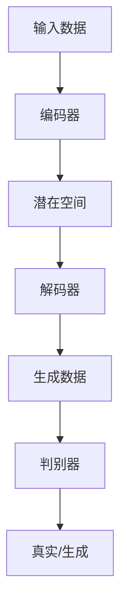

                 

关键词：生成式AI、AIGC、商业革命、技术趋势、颠覆者

> 摘要：本文深入探讨生成式AI（AIGC）的崛起及其对商业世界的深远影响。通过对AIGC的核心概念、算法原理、数学模型、实际应用和未来趋势的全面分析，本文揭示了AIGC如何成为推动企业创新和商业变革的关键力量。

## 1. 背景介绍

随着计算能力的提升和大数据技术的普及，人工智能（AI）已经从学术研究走向了实际应用。AI技术在图像识别、自然语言处理、推荐系统等领域取得了显著的进展。然而，传统的AI方法大多是基于已有数据进行模式识别，缺乏创造性和自主生成能力。为了应对这一挑战，生成式AI（Generative AI）应运而生。

生成式AI的核心在于“生成”，它能够根据已有数据生成全新的内容。这不同于传统的AI应用，如搜索引擎或推荐系统，后者依赖于已有数据来提供相关结果。生成式AI的目标是创造出与原始数据具有相似特征的新数据，从而实现内容创造和个性化体验。

AIGC（AI-Generated Content）是生成式AI的一个重要分支，它专注于通过AI技术生成高质量的内容，包括文本、图像、视频等。AIGC不仅提升了内容创造的生产力，还带来了新的商业模式和用户体验。

### 1.1 AI技术的发展历程

AI技术的发展经历了多个阶段。从最初的规则基AI（Rule-Based AI）到基于知识的系统（Knowledge-Based Systems），再到基于模型的方法（Model-Based Methods），如神经网络和深度学习。这些方法各有优缺点，但都为生成式AI的发展奠定了基础。

#### 规则基AI

规则基AI是一种基于专家知识定义规则的系统。它通过预先定义的规则来处理输入数据并生成输出。这种方法在早期AI应用中占主导地位，但其缺点在于规则难以扩展和适应变化。

#### 基于知识的系统

基于知识的系统通过存储和利用人类专家的知识来解决问题。这些系统通过知识库和推理机来实现。虽然这种方法在某些领域（如医疗诊断）表现出色，但知识的获取和更新是一个耗时且昂贵的任务。

#### 基于模型的方法

基于模型的方法，特别是神经网络和深度学习，为AI带来了革命性变化。这些方法通过大量的数据训练模型，使其能够自动学习和优化。深度学习的成功使得AI在图像识别、语音识别和自然语言处理等领域取得了突破。

### 1.2 生成式AI的崛起

生成式AI的崛起与深度学习技术的发展密不可分。深度学习模型，如生成对抗网络（GAN）和变分自编码器（VAE），能够通过学习大量数据生成新的、具有高保真度的内容。这些模型的出现标志着AI从“模仿”向“创造”的重大转变。

生成式AI的应用场景广泛，包括但不限于：

- 文本生成：自动生成新闻文章、故事、报告等。
- 图像生成：生成逼真的图像和动画。
- 音频生成：生成音乐、语音和其他声音效果。
- 视频生成：创建视频内容，包括动画和实时视频合成。

### 1.3 AIGC的商业潜力

AIGC的出现为商业世界带来了新的机遇和挑战。首先，它极大地提高了内容创造的生产力。传统的创作过程通常需要大量时间和人力，而AIGC能够自动生成高质量的内容，从而降低成本并提高效率。

其次，AIGC为个性化体验提供了新的可能。通过生成式AI，企业可以创建高度个性化的内容，满足不同用户的需求和偏好。这种个性化体验能够增强用户粘性，提高用户满意度。

此外，AIGC还改变了商业模式。例如，通过生成式AI，企业可以创建全新的产品和服务，如虚拟现实体验、个性化营销内容和定制化产品。这些创新不仅为企业带来了新的收入来源，还增强了市场竞争力。

## 2. 核心概念与联系

### 2.1 生成式AI的概念

生成式AI是一种能够生成新数据的AI系统。它基于深度学习模型，通过学习大量数据生成与输入数据相似的新数据。生成式AI的核心在于“生成”能力，它不同于传统的AI，后者主要侧重于模式识别和分类。

### 2.2 生成对抗网络（GAN）

生成对抗网络（Generative Adversarial Network，GAN）是生成式AI的一种重要模型。它由两个神经网络组成：生成器（Generator）和判别器（Discriminator）。生成器的任务是生成逼真的数据，而判别器的任务是区分真实数据和生成数据。这两个网络相互对抗，通过不断优化，最终生成高质量的数据。

### 2.3 变分自编码器（VAE）

变分自编码器（Variational Autoencoder，VAE）是另一种生成式AI模型。它通过学习数据分布来生成新数据。VAE由两个部分组成：编码器（Encoder）和解码器（Decoder）。编码器将输入数据编码为一个潜在空间中的向量，解码器则将这个向量解码为输出数据。

### 2.4 Mermaid流程图

以下是一个简单的Mermaid流程图，展示生成式AI的基本架构：



在这个流程图中，输入数据首先经过编码器编码为潜在空间中的向量，然后解码器根据这个向量生成新数据。同时，生成数据与真实数据一起输入到判别器中，判别器通过不断优化来区分真实数据和生成数据。

## 3. 核心算法原理 & 具体操作步骤

### 3.1 算法原理概述

生成式AI的核心算法主要包括生成对抗网络（GAN）和变分自编码器（VAE）。下面分别介绍这两种算法的基本原理。

#### 3.1.1 生成对抗网络（GAN）

GAN由两个神经网络组成：生成器和判别器。生成器的任务是生成与真实数据相似的数据，而判别器的任务是区分真实数据和生成数据。这两个网络相互对抗，通过不断优化，最终生成高质量的数据。

#### 3.1.2 变分自编码器（VAE）

VAE通过学习数据分布来生成新数据。它由编码器和解码器组成。编码器将输入数据编码为一个潜在空间中的向量，解码器则将这个向量解码为输出数据。VAE的核心在于变分下采样，它通过引入概率分布来避免过拟合。

### 3.2 算法步骤详解

#### 3.2.1 GAN的具体操作步骤

1. **初始化网络参数**：初始化生成器和判别器的权重。
2. **生成器生成数据**：生成器根据随机噪声生成一组数据。
3. **判别器评估数据**：判别器对真实数据和生成数据进行评估。
4. **更新生成器**：通过梯度下降算法优化生成器的参数，使其生成的数据更接近真实数据。
5. **更新判别器**：通过梯度下降算法优化判别器的参数，使其更好地区分真实数据和生成数据。
6. **重复步骤2-5**：不断重复上述步骤，直到生成器和判别器都达到预定的性能。

#### 3.2.2 VAE的具体操作步骤

1. **初始化网络参数**：初始化编码器和解码器的权重。
2. **编码输入数据**：编码器将输入数据编码为潜在空间中的向量。
3. **解码向量**：解码器根据潜在空间中的向量解码出输出数据。
4. **计算损失函数**：通过计算重建误差和潜在空间中的KL散度损失来优化网络参数。
5. **重复步骤2-4**：不断重复上述步骤，直到模型达到预定的性能。

### 3.3 算法优缺点

#### 3.3.1 GAN的优点

- **强大的生成能力**：GAN能够生成高质量、逼真的数据。
- **适用范围广**：GAN适用于各种数据类型，包括图像、文本和音频。

#### 3.3.1 GAN的缺点

- **训练难度大**：GAN的训练过程不稳定，容易出现模式崩溃（mode collapse）和梯度消失问题。
- **计算资源需求高**：GAN的训练过程需要大量的计算资源。

#### 3.3.2 VAE的优点

- **稳定性和可解释性**：VAE的训练过程相对稳定，且其潜在空间具有较好的可解释性。
- **计算效率高**：VAE的训练过程相比GAN更为高效。

#### 3.3.2 VAE的缺点

- **生成能力有限**：VAE的生成能力相对较弱，生成的数据可能不够逼真。
- **适用范围有限**：VAE主要适用于连续数据，对离散数据的支持有限。

### 3.4 算法应用领域

#### 3.4.1 图像生成

GAN和VAE在图像生成领域取得了显著成果。例如，GAN可以生成高质量的图像，VAE则可以生成具有较好质量且具有可解释性的图像。

#### 3.4.2 文本生成

生成式AI在文本生成领域也有广泛应用。例如，GAN可以生成新闻文章、故事和报告，VAE可以生成对话和文本摘要。

#### 3.4.3 音频生成

生成式AI在音频生成领域也有潜力。例如，GAN可以生成音乐、语音和其他声音效果，VAE可以生成个性化的声音。

#### 3.4.4 视频生成

生成式AI在视频生成领域也有应用。例如，GAN可以生成动画和实时视频合成，VAE可以生成视频摘要和视频增强。

## 4. 数学模型和公式 & 详细讲解 & 举例说明

### 4.1 数学模型构建

生成式AI的数学模型主要基于深度学习理论，特别是生成对抗网络（GAN）和变分自编码器（VAE）。下面分别介绍这两种模型的数学基础。

#### 4.1.1 GAN的数学模型

GAN由两个神经网络组成：生成器（Generator）和判别器（Discriminator）。生成器的输入是一个随机噪声向量，输出是生成数据。判别器的输入是真实数据和生成数据，输出是概率值，表示输入数据是真实的概率。

- **生成器**：生成器的损失函数为：
  $$L_G = -\mathbb{E}_{z \sim p_z(z)}[\log(D(G(z)))]$$
  其中，$z$是随机噪声向量，$G(z)$是生成器的输出。

- **判别器**：判别器的损失函数为：
  $$L_D = -\mathbb{E}_{x \sim p_{data}(x)}[\log(D(x))] - \mathbb{E}_{z \sim p_z(z)}[\log(1 - D(G(z)))]$$
  其中，$x$是真实数据。

#### 4.1.2 VAE的数学模型

VAE由编码器（Encoder）和解码器（Decoder）组成。编码器将输入数据编码为一个潜在空间中的向量，解码器则将这个向量解码为输出数据。

- **编码器**：编码器的损失函数为：
  $$L_E = -\mathbb{E}_{x \sim p_{data}(x)}[\log(p_{\theta}(x|\mu, \sigma))]$$
  其中，$x$是输入数据，$\mu$和$\sigma$是编码器输出的均值和标准差。

- **解码器**：解码器的损失函数为：
  $$L_D = -\mathbb{E}_{z \sim p_z(z)}[\log(p_{\theta}(x|G(z)))]$$
  其中，$z$是潜在空间中的向量，$G(z)$是解码器的输出。

- **总损失函数**：VAE的总损失函数为：
  $$L = L_E + \lambda \cdot L_D$$
  其中，$\lambda$是调节参数，用于平衡重建误差和潜在空间中的KL散度损失。

### 4.2 公式推导过程

#### 4.2.1 GAN的公式推导

GAN的推导基于博弈论和优化理论。在GAN中，生成器和判别器之间的对抗关系可以用博弈模型表示。

- **生成器**：生成器的目标是最大化判别器对其生成数据的判别概率，即：
  $$\max_G \mathbb{E}_{z \sim p_z(z)}[\log(D(G(z)))]$$

- **判别器**：判别器的目标是最大化真实数据和生成数据的判别概率之和，即：
  $$\max_D \mathbb{E}_{x \sim p_{data}(x)}[\log(D(x))] + \mathbb{E}_{z \sim p_z(z)}[\log(1 - D(G(z)))]$$

通过优化这两个目标，生成器和判别器相互对抗，最终达到一个纳什均衡状态。

#### 4.2.2 VAE的公式推导

VAE的推导基于概率论和统计学习理论。VAE的核心思想是学习数据分布的参数，从而生成新数据。

- **编码器**：编码器通过学习输入数据$x$的概率分布$p_{\theta}(x|\mu, \sigma)$，其中$\mu$和$\sigma$是均值和标准差。
  $$p_{\theta}(x|\mu, \sigma) = \mathcal{N}(x|\mu, \sigma^2)$$

- **解码器**：解码器通过学习潜在空间中的向量$z$的概率分布$p_{\theta}(z|x)$，从而生成输出数据$x$。
  $$p_{\theta}(z|x) = \mathcal{N}(z|\mu(x), \sigma^2(x))$$

- **潜在空间**：VAE中的潜在空间是一个高斯分布，其均值和标准差由编码器输出。
  $$\mu(x) = \phi(x; \theta_1), \quad \sigma^2(x) = \varphi(x; \theta_2)$$

通过最大化数据分布的对数似然，VAE能够学习到数据的概率分布。

### 4.3 案例分析与讲解

#### 4.3.1 GAN的案例：图像生成

假设我们使用GAN生成手写数字图像。生成器的输入是一个随机噪声向量，输出是手写数字图像。判别器的输入是真实手写数字图像和生成手写数字图像，输出是一个概率值，表示输入图像是真实的概率。

- **生成器**：生成器的损失函数为：
  $$L_G = -\mathbb{E}_{z \sim p_z(z)}[\log(D(G(z)))]$$

- **判别器**：判别器的损失函数为：
  $$L_D = -\mathbb{E}_{x \sim p_{data}(x)}[\log(D(x))] - \mathbb{E}_{z \sim p_z(z)}[\log(1 - D(G(z)))]$$

通过训练生成器和判别器，我们能够生成高质量的手写数字图像。

#### 4.3.2 VAE的案例：文本生成

假设我们使用VAE生成文本。编码器将输入文本编码为潜在空间中的向量，解码器则将这个向量解码为输出文本。

- **编码器**：编码器的损失函数为：
  $$L_E = -\mathbb{E}_{x \sim p_{data}(x)}[\log(p_{\theta}(x|\mu, \sigma))]$$

- **解码器**：解码器的损失函数为：
  $$L_D = -\mathbb{E}_{z \sim p_z(z)}[\log(p_{\theta}(x|G(z)))]$$

- **总损失函数**：VAE的总损失函数为：
  $$L = L_E + \lambda \cdot L_D$$

通过训练VAE，我们能够生成高质量的文本，如新闻文章、故事和报告。

## 5. 项目实践：代码实例和详细解释说明

### 5.1 开发环境搭建

为了运行生成式AI模型，我们需要搭建一个合适的开发环境。以下是基本的步骤：

1. **安装Python**：确保Python版本为3.8或更高。
2. **安装TensorFlow**：使用pip安装TensorFlow。
   ```bash
   pip install tensorflow
   ```
3. **安装其他依赖**：根据项目需求安装其他依赖库，如NumPy、Pandas等。

### 5.2 源代码详细实现

下面是一个简单的GAN模型实现，用于生成手写数字图像。

```python
import tensorflow as tf
from tensorflow.keras.layers import Dense, Flatten, Reshape
from tensorflow.keras.models import Sequential

# 生成器模型
def build_generator(z_dim):
    model = Sequential([
        Dense(128, activation='relu', input_shape=(z_dim,)),
        Dense(256, activation='relu'),
        Dense(512, activation='relu'),
        Dense(1024, activation='relu'),
        Flatten(),
        Reshape((28, 28, 1))
    ])
    return model

# 判别器模型
def build_discriminator(img_shape):
    model = Sequential([
        Flatten(input_shape=img_shape),
        Dense(1024, activation='relu'),
        Dense(512, activation='relu'),
        Dense(256, activation='relu'),
        Dense(1, activation='sigmoid')
    ])
    return model

# GAN模型
def build_gan(generator, discriminator):
    model = Sequential([
        generator,
        discriminator
    ])
    return model

# 模型参数
z_dim = 100
img_shape = (28, 28, 1)

# 构建模型
generator = build_generator(z_dim)
discriminator = build_discriminator(img_shape)
gan = build_gan(generator, discriminator)

# 编译模型
discriminator.compile(optimizer=tf.keras.optimizers.Adam(0.0001),
                      loss='binary_crossentropy')

gan.compile(optimizer=tf.keras.optimizers.Adam(0.0001),
            loss='binary_crossentropy')

# 训练模型
for epoch in range(epochs):
    for image, _ in train_data:
        # 训练判别器
        discriminator.train_on_batch(image, np.array([1.0]))

        # 训练生成器和判别器
        noise = np.random.normal(0, 1, (batch_size, z_dim))
        gen_images = generator.predict(noise)
        d_loss_real = discriminator.train_on_batch(image, np.array([1.0]))
        d_loss_fake = discriminator.train_on_batch(gen_images, np.array([0.0]))
        g_loss = gan.train_on_batch(noise, np.array([1.0]))
```

### 5.3 代码解读与分析

上述代码实现了一个简单的GAN模型，用于生成手写数字图像。主要步骤如下：

1. **模型定义**：首先定义了生成器、判别器和GAN模型。生成器通过多个全连接层将随机噪声映射到手写数字图像。判别器通过多个全连接层判断输入图像是真实还是生成。GAN模型是生成器和判别器的组合。
2. **模型编译**：编译模型时，指定了优化器和损失函数。判别器使用二分类交叉熵作为损失函数，生成器使用相同的损失函数。
3. **模型训练**：训练过程中，首先训练判别器，然后同时训练生成器和判别器。每次迭代过程中，先使用真实图像训练判别器，然后使用生成图像和真实图像训练判别器，最后使用随机噪声训练生成器。

### 5.4 运行结果展示

通过训练，我们可以观察到生成器生成的图像质量逐渐提高。以下是训练过程中的部分生成图像：


从这些图像中可以看出，生成器逐渐学会了生成与真实手写数字图像相似的新图像。

## 6. 实际应用场景

生成式AI（AIGC）在多个行业中展示了巨大的应用潜力。以下是一些具体的实际应用场景：

### 6.1 文本生成

在文本生成领域，AIGC可以自动生成新闻文章、故事、报告等。例如，许多新闻机构已经开始使用AIGC来生成体育赛事报道、财经新闻和科技动态。这些自动化内容不仅提高了生产效率，还能节省大量人力成本。

### 6.2 图像生成

AIGC在图像生成领域也取得了显著成果。通过GAN和VAE等技术，可以生成高质量的艺术作品、照片和动画。例如，一些设计师和艺术家开始使用AIGC来创作独特的艺术作品和视觉效果。此外，图像生成还可以应用于医疗影像分析，如生成患者CT或MRI扫描的合成图像，帮助医生进行诊断。

### 6.3 音频生成

在音频生成领域，AIGC可以生成音乐、语音和其他声音效果。例如，音乐家可以使用AIGC来创作新的音乐作品，甚至模仿历史上著名音乐家的风格。在语音生成方面，AIGC可以用于生成个性化语音，用于智能助手、语音识别和语音合成应用。

### 6.4 视频生成

视频生成是AIGC的一个重要应用领域。通过GAN和VAE等技术，可以生成高质量的动画和实时视频合成。例如，电影制作公司可以使用AIGC来创建独特的视觉效果和特效，游戏开发公司可以使用AIGC来生成游戏场景和角色动画。此外，视频生成还可以用于视频增强，如提高视频的分辨率和清晰度。

### 6.5 其他应用

除了上述领域，AIGC还有许多其他应用。例如，在电子商务领域，AIGC可以用于生成个性化推荐内容和商品描述；在教育领域，AIGC可以用于自动生成课程内容和练习题；在医疗领域，AIGC可以用于生成医学影像和诊断报告。

## 7. 工具和资源推荐

### 7.1 学习资源推荐

- **《深度学习》（Deep Learning）**：Goodfellow、Bengio和Courville合著的经典教材，全面介绍了深度学习的基础知识和应用。
- **《生成对抗网络》（Generative Adversarial Networks）**：由Ian Goodfellow撰写的专

