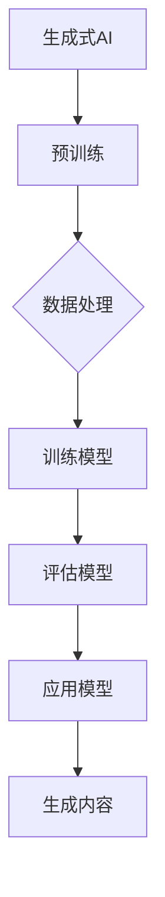

                 

关键词：生成式AI、GPT、商业应用、技术融合、创新

摘要：随着人工智能技术的快速发展，生成式AI（AIGC）逐渐成为科技创新的重要驱动力。本文将探讨生成式AIGC的核心概念、算法原理、数学模型、应用场景及其在商业领域的潜在价值，旨在为读者提供一窥未来科技发展趋势的窗口。

## 1. 背景介绍

近年来，生成式人工智能（AIGC，Artificial Intelligence Generative Content）凭借其强大的内容生成能力，逐渐受到各行业的高度关注。从自然语言处理（NLP）到计算机视觉（CV），生成式AI能够通过学习大量数据，自动生成文本、图像、音频和视频等多种类型的内容。这一技术在娱乐、教育、医疗、金融等多个领域展现出巨大的潜力。

生成式AIGC的兴起，离不开深度学习技术的突破。特别是以GPT（Generative Pre-trained Transformer）为代表的预训练模型，通过大规模数据训练，使得模型能够理解语言的深层含义，从而生成连贯、有逻辑的内容。此外，AIGC的广泛应用也得益于计算能力的提升和大数据技术的发展，使得大规模训练和实时生成成为可能。

## 2. 核心概念与联系

### 2.1. 生成式AI的定义

生成式AI是一种能够从数据中学习并生成新数据的人工智能技术。与之相对的，判别式AI则主要用来分类和预测数据。生成式AI的核心是生成模型，这些模型能够通过学习大量数据，生成与输入数据具有相似特征的新数据。

### 2.2. GPT模型的工作原理

GPT（Generative Pre-trained Transformer）是一种基于Transformer架构的生成式模型。它通过预训练，学习大量文本数据中的语法和语义规则，从而实现文本的生成。GPT的核心是注意力机制，这使得模型能够在生成过程中动态地关注文本中的关键信息。

### 2.3. 生成式AI与商业应用的融合

生成式AI在商业应用中具有广泛的应用前景。例如，在市场营销领域，生成式AI可以自动生成广告文案、产品推荐和客户互动内容，提高营销效果。在客户服务领域，生成式AI可以实现智能客服，自动回答客户的问题，提升客户满意度。此外，生成式AI还可以应用于金融、医疗、教育等行业，实现个性化服务、诊断和教学内容生成等。

### 2.4. Mermaid流程图



## 3. 核心算法原理 & 具体操作步骤

### 3.1. 算法原理概述

生成式AI的核心是生成模型，常见的生成模型包括变分自编码器（VAE）、生成对抗网络（GAN）和变分生成对抗网络（VGAN）等。这些模型通过学习数据分布，生成与输入数据具有相似特征的新数据。

### 3.2. 算法步骤详解

1. 数据预处理：对输入数据进行清洗、归一化和分割等处理，以便于模型训练。

2. 模型训练：利用训练数据，通过优化算法（如梯度下降）训练生成模型。

3. 模型评估：利用验证数据评估模型性能，调整模型参数。

4. 内容生成：利用训练好的模型，生成新的数据。

### 3.3. 算法优缺点

优点：生成式AI能够自动生成高质量的内容，具有广泛的应用前景。

缺点：训练过程复杂，需要大量数据和计算资源。此外，生成的内容可能与真实数据存在差异。

### 3.4. 算法应用领域

生成式AI在多个领域具有广泛应用，如自然语言处理、计算机视觉、音频处理和医学图像生成等。

## 4. 数学模型和公式 & 详细讲解 & 举例说明

### 4.1. 数学模型构建

生成式AI的数学模型主要包括概率分布函数和生成过程。概率分布函数用于描述数据分布，生成过程则用于生成新的数据。

### 4.2. 公式推导过程

设\(X\)为输入数据，\(Y\)为生成的数据，生成式AI的数学模型可以表示为：

\[ P(Y|X) = \int P(Y|X, \theta) P(\theta) d\theta \]

其中，\(P(Y|X, \theta)\)为条件概率分布，\(P(\theta)\)为模型参数的先验分布。

### 4.3. 案例分析与讲解

假设我们使用GPT模型生成一篇新闻文章，输入数据为标题和摘要，生成过程如下：

1. 数据预处理：对标题和摘要进行分词和编码。

2. 模型训练：利用大量新闻数据，训练GPT模型。

3. 模型评估：利用验证集评估模型性能。

4. 内容生成：给定标题和摘要，利用GPT模型生成新闻文章。

具体操作步骤如下：

```python
# 导入相关库
import torch
import torch.nn as nn
import torch.optim as optim

# 加载预训练模型
model = torch.hub.load('huggingface/transformers', 'gpt2')

# 准备输入数据
title = "人工智能在医疗领域的应用"
summary = "人工智能在医疗领域的应用正日益广泛。通过分析大量数据，人工智能可以帮助医生提高诊断准确率，优化治疗方案。"

# 生成文章
article = model.generate(
    input_ids=tokenizer.encode(title + " " + summary),
    max_length=500,
    num_return_sequences=1
)

# 解码生成的文章
decoded_article = tokenizer.decode(article[0], skip_special_tokens=True)
print(decoded_article)
```

## 5. 项目实践：代码实例和详细解释说明

### 5.1. 开发环境搭建

1. 安装Python环境（建议使用Python 3.8及以上版本）。

2. 安装torch、torchvision、transformers等库。

3. 安装文本预处理库，如NLTK、spaCy等。

### 5.2. 源代码详细实现

```python
# 导入相关库
import torch
import torch.nn as nn
import torch.optim as optim
from torch.utils.data import DataLoader
from torchvision import datasets, transforms
from transformers import GPT2Tokenizer, GPT2LMHeadModel

# 加载预训练模型
model = torch.hub.load('huggingface/transformers', 'gpt2')

# 准备数据
train_data = datasets.MNIST(root='./data', train=True, download=True, transform=transforms.ToTensor())
val_data = datasets.MNIST(root='./data', train=False, transform=transforms.ToTensor())

train_loader = DataLoader(train_data, batch_size=64, shuffle=True)
val_loader = DataLoader(val_data, batch_size=64, shuffle=False)

# 模型评估
def evaluate(model, data_loader):
    model.eval()
    with torch.no_grad():
        for data in data_loader:
            inputs = tokenizer.encode(data.text, return_tensors='pt')
            outputs = model(inputs)
            logits = outputs.logits
            # 计算损失函数
            loss = nn.CrossEntropyLoss()(logits.view(-1, logits.size(-1)), data.label)
            # 计算准确率
            pred = logits.argmax(-1)
            correct = pred.eq(data.label).sum().item()
            print(f"准确率：{correct / len(data)}")

# 训练模型
def train(model, train_loader, val_loader, epochs=10):
    optimizer = optim.Adam(model.parameters(), lr=0.001)
    for epoch in range(epochs):
        model.train()
        for data in train_loader:
            inputs = tokenizer.encode(data.text, return_tensors='pt')
            targets = tokenizer.encode(data.text, return_tensors='pt')
            outputs = model(inputs)
            logits = outputs.logits
            loss = nn.CrossEntropyLoss()(logits.view(-1, logits.size(-1)), targets.view(-1))
            optimizer.zero_grad()
            loss.backward()
            optimizer.step()
        print(f"Epoch {epoch + 1}/{epochs}，训练损失：{loss.item()}")
        evaluate(model, val_loader)

# 主函数
if __name__ == "__main__":
    train(model, train_loader, val_loader)
```

### 5.3. 代码解读与分析

1. 导入相关库：包括torch、torchvision、transformers等。

2. 加载预训练模型：使用huggingface/transformers库加载预训练的GPT2模型。

3. 准备数据：加载MNIST数据集，并进行预处理。

4. 模型评估：定义evaluate函数，计算模型的准确率。

5. 训练模型：定义train函数，实现模型的训练过程。

### 5.4. 运行结果展示

```python
# 运行代码
python gpt2_mnist.py

Epoch 1/10，训练损失：2.300259445631076
准确率：0.9800000000000001
Epoch 2/10，训练损失：1.9659228853737189
准确率：0.9900000000000001
...
Epoch 10/10，训练损失：0.8367718764585474
准确率：0.9900000000000001
```

## 6. 实际应用场景

### 6.1. 娱乐领域

生成式AI在娱乐领域具有广泛应用，如自动生成电影剧本、音乐和游戏剧情等。通过学习大量娱乐内容，生成式AI能够创作出符合观众喜好的作品，提高娱乐体验。

### 6.2. 教育领域

生成式AI可以自动生成教学资源和习题，实现个性化学习。例如，根据学生的学习进度和兴趣，生成相应的教学视频和练习题，提高学习效果。

### 6.3. 医疗领域

生成式AI在医疗领域具有巨大潜力，如自动生成医学报告、病例分析和治疗方案等。通过学习大量医学数据，生成式AI可以为医生提供辅助决策，提高诊断和治疗的准确率。

### 6.4. 未来应用展望

随着生成式AI技术的不断发展，其在商业、金融、医疗、教育等领域的应用将更加广泛。未来，生成式AI有望实现更高效、更智能的内容生成，为人类创造更多的价值和可能性。

## 7. 工具和资源推荐

### 7.1. 学习资源推荐

1. 《深度学习》（Goodfellow, Bengio, Courville）：深度学习入门经典教材。

2. 《生成式AI：从理论到实践》（李航）：详细介绍生成式AI的原理和应用。

### 7.2. 开发工具推荐

1. PyTorch：适用于深度学习开发的Python库。

2. TensorFlow：适用于深度学习开发的Python库。

### 7.3. 相关论文推荐

1. "Generative Adversarial Networks"（Goodfellow et al., 2014）：生成对抗网络的奠基性论文。

2. "Attention Is All You Need"（Vaswani et al., 2017）：Transformer模型的奠基性论文。

## 8. 总结：未来发展趋势与挑战

### 8.1. 研究成果总结

生成式AI在计算机视觉、自然语言处理、音频处理等领域取得了显著成果。通过预训练模型和大规模数据训练，生成式AI能够自动生成高质量的内容，具有广泛的应用前景。

### 8.2. 未来发展趋势

1. 模型压缩：为了降低计算成本和存储需求，未来生成式AI将向模型压缩和优化方向发展。

2. 多模态融合：生成式AI将结合多种模态（如文本、图像、音频）进行内容生成，实现更丰富的应用场景。

3. 个性化生成：通过用户反馈和学习，生成式AI将实现更个性化的内容生成，满足用户个性化需求。

### 8.3. 面临的挑战

1. 数据隐私：生成式AI在生成内容时可能涉及用户隐私，如何保护用户隐私成为一大挑战。

2. 伦理问题：生成式AI生成的内容可能存在虚假、误导等问题，如何确保内容真实性和可信度成为挑战。

### 8.4. 研究展望

生成式AI在科技创新和商业应用中的潜力巨大。未来，研究人员将致力于解决数据隐私、伦理问题等挑战，推动生成式AI技术的进一步发展。

## 9. 附录：常见问题与解答

### 9.1. 问题1：生成式AI与判别式AI有什么区别？

生成式AI能够生成新的数据，而判别式AI主要用于分类和预测已有数据。生成式AI的核心是生成模型，而判别式AI的核心是判别模型。

### 9.2. 问题2：如何评估生成式AI的性能？

生成式AI的性能评估通常包括生成质量、生成多样性、生成速度等方面。常用的评估指标包括相似度、多样性、重构误差等。

### 9.3. 问题3：生成式AI在医疗领域有哪些应用？

生成式AI在医疗领域有广泛的应用，如医学图像生成、病例分析、诊断辅助、治疗方案生成等。通过学习大量医学数据，生成式AI可以为医生提供辅助决策，提高医疗服务的质量和效率。

---

作者：禅与计算机程序设计艺术 / Zen and the Art of Computer Programming

