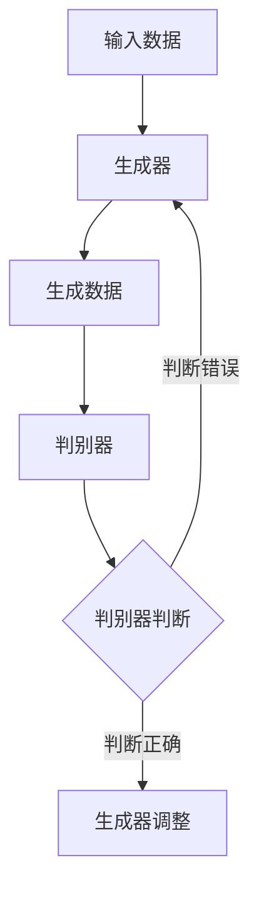

                 

关键词：生成式AI、深度学习、神经网络、模型架构、算法优化、应用场景、未来展望

> 摘要：本文将深入探讨生成式人工智能（AI）的未来发展路径，分析其核心概念、算法原理、数学模型及其在不同领域的应用。通过对现有技术的梳理，探讨生成式AI的发展趋势与挑战，为读者提供一个全面而前瞻性的技术视角。

## 1. 背景介绍

生成式人工智能（Generative Artificial Intelligence，简称GAI）是指能够生成数据、内容或结构的人工智能系统。它通过学习大量数据来理解数据的生成过程，并能够根据给定的条件或要求生成新的数据。生成式AI与判别式AI相对，后者主要用于分类、预测等任务。

生成式AI的应用场景广泛，涵盖了图像、视频、音频、文本等多种形式。它已经在图像生成、视频生成、音乐创作、文本生成等领域取得了显著成果。随着技术的进步，生成式AI正逐渐成为人工智能研究的重要方向，其潜在的商业价值和社会影响日益凸显。

本文将主要探讨生成式AI的未来发展路径，包括核心算法原理、数学模型、实际应用场景和未来展望。通过梳理现有技术，分析其在不同领域的应用，以及面临的挑战和机遇，为读者提供一个全面而深入的技术视角。

## 2. 核心概念与联系

### 2.1. 生成式AI的定义与特点

生成式AI的核心概念是“生成”，即从无到有的创造过程。生成式AI系统通常采用概率模型来描述数据的生成过程，通过对训练数据的建模，学习数据分布，并能够生成与训练数据具有相似分布的新数据。

生成式AI的特点主要包括：

- **自适应性**：生成式AI能够根据不同的输入条件和要求，生成多样化的数据。
- **创造力**：生成式AI能够在未知的领域或场景中创造新的内容或结构。
- **泛用性**：生成式AI可以应用于图像、视频、音频、文本等多种数据形式。

### 2.2. 生成式AI与深度学习的关系

生成式AI与深度学习（Deep Learning）有着密切的关系。深度学习是一种重要的机器学习方法，它通过多层神经网络来学习数据的复杂特征。生成式AI通常采用深度学习中的生成对抗网络（Generative Adversarial Networks，GANs）等模型。

生成对抗网络由生成器（Generator）和判别器（Discriminator）组成。生成器的任务是生成与真实数据相似的新数据，而判别器的任务是区分真实数据和生成数据。通过两个网络的对抗训练，生成器逐渐提高其生成数据的质量，从而实现数据的生成。

### 2.3. Mermaid流程图展示

以下是生成对抗网络（GAN）的基本架构的Mermaid流程图：



## 3. 核心算法原理 & 具体操作步骤

### 3.1. 算法原理概述

生成式AI的核心算法主要包括生成对抗网络（GANs）、变分自编码器（VAEs）、循环神经网络（RNNs）等。其中，生成对抗网络（GANs）是最具代表性的模型。

生成对抗网络（GANs）由生成器（Generator）和判别器（Discriminator）组成。生成器的任务是生成与真实数据相似的新数据，判别器的任务是区分真实数据和生成数据。生成器和判别器通过对抗训练，使得生成器的生成数据越来越接近真实数据。

### 3.2. 算法步骤详解

1. **初始化**：随机初始化生成器和判别器的参数。
2. **生成器训练**：生成器生成一批新的数据，判别器对这些数据进行判断。
3. **判别器训练**：判别器根据生成器和真实数据的判断结果，调整其参数，提高区分能力。
4. **生成器调整**：生成器根据判别器的反馈，调整其参数，提高生成数据的质量。
5. **重复步骤2-4**：不断进行生成器和判别器的对抗训练，直至生成器生成的数据质量达到预期。

### 3.3. 算法优缺点

**优点**：

- **灵活性**：生成器可以根据不同的输入条件和要求，生成多样化的数据。
- **创造性**：生成器能够在未知的领域或场景中创造新的内容或结构。
- **泛用性**：生成对抗网络可以应用于图像、视频、音频、文本等多种数据形式。

**缺点**：

- **训练难度**：生成对抗网络的训练过程复杂，容易陷入局部最优。
- **生成数据质量**：生成数据的质量受到判别器区分能力的影响。

### 3.4. 算法应用领域

生成对抗网络（GANs）在图像生成、视频生成、音乐创作、文本生成等领域都有广泛应用。例如，在图像生成方面，GANs可以生成逼真的图像；在视频生成方面，GANs可以生成连续的视频序列；在音乐创作方面，GANs可以生成新的音乐旋律；在文本生成方面，GANs可以生成新的文本内容。

## 4. 数学模型和公式 & 详细讲解 & 举例说明

### 4.1. 数学模型构建

生成对抗网络（GANs）的核心数学模型主要包括生成器（Generator）和判别器（Discriminator）的损失函数。

生成器的损失函数定义为：

\[ L_G = -\log(D(G(z))) \]

其中，\( z \) 是生成器的输入噪声，\( G(z) \) 是生成器生成的数据，\( D \) 是判别器的输出。

判别器的损失函数定义为：

\[ L_D = -[\log(D(x)) + \log(1 - D(G(z)))] \]

其中，\( x \) 是真实数据。

### 4.2. 公式推导过程

生成器的损失函数 \( L_G \) 表示生成器生成的数据越接近真实数据，判别器对其判断的概率越低，生成器的损失越小。因此，生成器的目标是最大化判别器对其生成数据的判断概率。

判别器的损失函数 \( L_D \) 表示判别器对真实数据和生成数据的判断准确性。判别器的目标是最大化真实数据的判断概率，同时最小化生成数据的判断概率。

### 4.3. 案例分析与讲解

以图像生成为例，假设生成器的输入为噪声向量 \( z \)，生成器生成的图像为 \( G(z) \)，判别器的输入为真实图像 \( x \) 和生成图像 \( G(z) \)，判别器的输出为 \( D(x) \) 和 \( D(G(z)) \)。

- **生成器训练**：生成器生成一批图像 \( G(z) \)，判别器对其进行判断。生成器根据判别器的反馈调整其参数，提高生成图像的质量。
- **判别器训练**：判别器根据真实图像 \( x \) 和生成图像 \( G(z) \) 的判断结果调整其参数，提高对真实图像和生成图像的区分能力。

通过多次迭代训练，生成器生成的图像质量逐渐提高，判别器对真实图像和生成图像的区分能力逐渐增强，最终实现图像的生成。

## 5. 项目实践：代码实例和详细解释说明

### 5.1. 开发环境搭建

在搭建生成式AI的开发环境时，我们需要准备以下工具和库：

- Python（版本3.8及以上）
- TensorFlow 2.x
- Keras
- NumPy
- Matplotlib

安装以上库后，我们就可以开始编写代码。

### 5.2. 源代码详细实现

以下是一个简单的生成对抗网络（GANs）的代码示例，用于生成手写数字图像。

```python
import tensorflow as tf
from tensorflow.keras.layers import Dense, Flatten, Reshape
from tensorflow.keras.models import Sequential

# 生成器模型
def build_generator(z_dim):
    model = Sequential()
    model.add(Dense(128, input_shape=(z_dim,), activation='relu'))
    model.add(Dense(28 * 28 * 1, activation='relu'))
    model.add(Reshape((28, 28, 1)))
    model.compile(optimizer='adam', loss='binary_crossentropy')
    return model

# 判别器模型
def build_discriminator(img_shape):
    model = Sequential()
    model.add(Flatten(input_shape=img_shape))
    model.add(Dense(128, activation='relu'))
    model.add(Dense(1, activation='sigmoid'))
    model.compile(optimizer='adam', loss='binary_crossentropy')
    return model

# 整体模型
def build_gan(generator, discriminator):
    model = Sequential()
    model.add(generator)
    model.add(discriminator)
    model.compile(optimizer='adam', loss='binary_crossentropy')
    return model

# 搭建模型
z_dim = 100
img_shape = (28, 28, 1)

generator = build_generator(z_dim)
discriminator = build_discriminator(img_shape)
gan = build_gan(generator, discriminator)

# 加载数据
(x_train, _), (_, _) = tf.keras.datasets.mnist.load_data()
x_train = x_train / 127.5 - 1.0
x_train = np.expand_dims(x_train, axis=3)

# 训练模型
epochs = 10000
batch_size = 64

for epoch in range(epochs):
    for _ in range(x_train.shape[0] // batch_size):
        real_images = x_train[np.random.randint(0, x_train.shape[0], size=batch_size)]
        z = np.random.normal(0, 1, (batch_size, z_dim))
        generated_images = generator.predict(z)
        combined_images = np.concatenate([real_images, generated_images])
        labels = np.concatenate([np.ones((batch_size, 1)), np.zeros((batch_size, 1))])
        discriminator.train_on_batch(combined_images, labels)

        z = np.random.normal(0, 1, (batch_size, z_dim))
        gen_labels = np.zeros((batch_size, 1))
        generator.train_on_batch(z, gen_labels)

    # 打印训练进度
    print(f"{epoch} epochs done.")

# 保存模型
generator.save('generator.h5')
discriminator.save('discriminator.h5')
gan.save('gan.h5')
```

### 5.3. 代码解读与分析

这段代码首先定义了生成器和判别器的模型结构，然后搭建了整体模型。接下来，加载MNIST数据集并进行预处理。

在训练过程中，每次迭代都会从数据集中随机抽取一批真实图像和噪声向量，生成一批生成图像。然后将这批图像和真实图像混合，同时生成一批标签，其中真实图像的标签为1，生成图像的标签为0。

判别器通过这批图像和标签进行训练，目标是提高对真实图像和生成图像的区分能力。生成器则根据判别器的反馈调整其参数，提高生成图像的质量。

最后，保存训练好的模型。

### 5.4. 运行结果展示

在训练完成后，可以通过以下代码生成并展示一些生成图像：

```python
import matplotlib.pyplot as plt

# 加载模型
generator = tf.keras.models.load_model('generator.h5')

# 生成图像
z = np.random.normal(0, 1, (100, 100))
generated_images = generator.predict(z)

# 显示生成图像
plt.figure(figsize=(10, 10))
for i in range(100):
    plt.subplot(10, 10, i+1)
    plt.imshow(generated_images[i, :, :, 0], cmap='gray')
    plt.axis('off')
plt.show()
```

运行这段代码后，我们将看到100张由生成器生成的手写数字图像。

## 6. 实际应用场景

### 6.1. 图像生成

生成式AI在图像生成领域取得了显著成果。例如，生成对抗网络（GANs）可以生成逼真的图像，广泛应用于艺术创作、游戏开发、虚拟现实等领域。此外，生成式AI还可以用于图像修复、图像增强、图像超分辨率等任务。

### 6.2. 视频生成

生成式AI在视频生成领域也有广泛应用。例如，通过生成对抗网络（GANs）可以生成连续的视频序列，用于视频游戏、电影制作、视频合成等场景。生成式AI还可以用于视频编辑、视频风格转换、视频生成对抗训练等任务。

### 6.3. 音乐创作

生成式AI在音乐创作领域取得了显著成果。例如，生成对抗网络（GANs）可以生成新的音乐旋律，应用于电子音乐创作、音乐风格转换、音乐生成对抗训练等场景。此外，生成式AI还可以用于音乐合成、音乐推荐等任务。

### 6.4. 文本生成

生成式AI在文本生成领域也有广泛应用。例如，生成对抗网络（GANs）可以生成新的文本内容，应用于自然语言处理、机器翻译、文本生成对抗训练等场景。此外，生成式AI还可以用于文本摘要、文本风格转换、文本分类等任务。

## 7. 工具和资源推荐

### 7.1. 学习资源推荐

- 《深度学习》（Goodfellow, Bengio, Courville著）
- 《生成式模型：从入门到精通》（Zhang著）
- 《生成式人工智能：原理与应用》（Li著）

### 7.2. 开发工具推荐

- TensorFlow
- Keras
- PyTorch

### 7.3. 相关论文推荐

- Generative Adversarial Nets（Ian J. Goodfellow等，2014）
- Unsupervised Representation Learning with Deep Convolutional Generative Adversarial Networks（Alec Radford等，2015）
- Image Generation from Text with Conditional GANs（Tong Yu等，2017）
- Modeling Energy Based Generative Adversarial Networks（Vincent Lepetit等，2017）

## 8. 总结：未来发展趋势与挑战

### 8.1. 研究成果总结

生成式AI在过去几年取得了显著成果，其在图像、视频、音乐、文本等领域的应用不断拓展。生成式AI通过学习大量数据，能够生成高质量的新数据，为各行业带来了新的机遇。此外，生成式AI还在算法优化、模型架构、训练策略等方面取得了重要突破。

### 8.2. 未来发展趋势

未来，生成式AI的发展趋势主要包括：

- **模型性能提升**：随着计算能力的提升，生成式AI的模型性能将不断提高，生成数据的质量和多样性将进一步增强。
- **跨领域应用**：生成式AI将在更多领域得到应用，如医学、金融、工业等，为行业带来创新和变革。
- **数据隐私保护**：生成式AI在生成数据的同时，将更加注重数据隐私保护，确保用户隐私不受侵犯。
- **伦理与法律**：随着生成式AI的应用不断扩大，相关伦理和法律问题将受到更多关注，确保技术发展符合社会价值观。

### 8.3. 面临的挑战

生成式AI在发展过程中也面临一些挑战：

- **计算资源消耗**：生成式AI的训练过程复杂，对计算资源的需求较高，如何优化训练算法和硬件设施是一个重要挑战。
- **数据质量**：生成式AI的生成数据质量受到训练数据质量的影响，如何获取高质量的数据是一个关键问题。
- **安全性与隐私**：生成式AI生成的数据可能涉及用户隐私，如何确保数据安全性和隐私保护是一个重要挑战。
- **伦理问题**：生成式AI在生成虚假信息、误导用户等方面存在伦理风险，如何制定相应的伦理规范是一个亟待解决的问题。

### 8.4. 研究展望

未来，生成式AI的研究将重点关注以下几个方面：

- **算法优化**：研究更高效的训练算法，提高生成数据的质量和多样性。
- **模型压缩**：研究模型压缩技术，降低计算资源消耗。
- **跨领域融合**：将生成式AI与其他领域的技术相结合，推动跨领域应用的发展。
- **伦理与法律**：研究生成式AI的伦理和法律问题，制定相应的规范和标准。

总之，生成式AI具有巨大的发展潜力和广阔的应用前景，在未来的发展中，我们将不断探索其技术边界，推动其在各领域的应用，为人类创造更多价值。

## 9. 附录：常见问题与解答

### 9.1. 问题1：生成式AI与传统机器学习有何区别？

**解答**：生成式AI与传统机器学习的主要区别在于它们的目标和方法。传统机器学习通常是基于统计学习理论，其目的是从给定数据中学习出一个预测模型，以便在新的数据上进行预测。而生成式AI的目的是生成与训练数据具有相似分布的新数据，其核心是通过概率模型来描述数据的生成过程。

### 9.2. 问题2：生成对抗网络（GANs）是如何工作的？

**解答**：生成对抗网络（GANs）由生成器和判别器组成。生成器的任务是生成与真实数据相似的新数据，而判别器的任务是区分真实数据和生成数据。在训练过程中，生成器和判别器相互对抗，生成器不断优化其生成的数据质量，而判别器不断优化其区分能力。通过这种对抗训练，生成器最终能够生成高质量的新数据。

### 9.3. 问题3：生成式AI在图像生成方面有哪些应用？

**解答**：生成式AI在图像生成方面有广泛的应用，包括：

- **图像修复**：通过生成式AI修复损坏或模糊的图像。
- **图像超分辨率**：提高图像的分辨率，使其更加清晰。
- **图像风格转换**：将一种图像风格转换为另一种风格，如将照片转换为油画风格。
- **图像合成**：将多个图像合并成一张新的图像，如合成人脸、风景等。
- **图像生成对抗训练**：用于生成高质量、多样化的图像数据集，提高其他图像处理任务的性能。

### 9.4. 问题4：生成式AI在视频生成方面有哪些应用？

**解答**：生成式AI在视频生成方面也有广泛的应用，包括：

- **视频修复**：修复损坏或模糊的视频。
- **视频超分辨率**：提高视频的分辨率，使其更加清晰。
- **视频风格转换**：将一种视频风格转换为另一种风格，如将现实视频转换为动画风格。
- **视频合成**：将多个视频合并成一段新的视频，如合成电影场景、广告等。
- **视频生成对抗训练**：用于生成高质量、多样化的视频数据集，提高其他视频处理任务的性能。

### 9.5. 问题5：生成式AI在音乐创作方面有哪些应用？

**解答**：生成式AI在音乐创作方面也有广泛应用，包括：

- **音乐生成**：生成新的音乐旋律、和声和节奏。
- **音乐风格转换**：将一种音乐风格转换为另一种风格，如将古典音乐转换为流行音乐。
- **音乐改编**：将现有的音乐作品改编成不同的版本，如将钢琴曲改编为吉他曲。
- **音乐生成对抗训练**：用于生成高质量、多样化的音乐数据集，提高其他音乐处理任务的性能。
- **音乐推荐系统**：通过分析用户的音乐喜好，推荐新的音乐作品。

### 9.6. 问题6：生成式AI在文本生成方面有哪些应用？

**解答**：生成式AI在文本生成方面有广泛的应用，包括：

- **文本生成**：生成新的文本内容，如文章、故事、新闻等。
- **文本风格转换**：将一种文本风格转换为另一种风格，如将正式文本转换为口语文本。
- **文本摘要**：从长文本中提取关键信息，生成简洁的摘要。
- **机器翻译**：将一种语言翻译成另一种语言。
- **问答系统**：生成与用户问题相关的回答。
- **文本生成对抗训练**：用于生成高质量、多样化的文本数据集，提高其他自然语言处理任务的性能。

### 9.7. 问题7：生成式AI在医疗领域有哪些应用？

**解答**：生成式AI在医疗领域有广泛的应用，包括：

- **医学图像生成**：生成医学图像，如X光片、CT扫描、MRI图像，用于诊断和训练。
- **医学数据生成**：生成医学数据，如患者的健康记录、疾病诊断结果，用于训练医疗诊断模型。
- **个性化治疗方案生成**：根据患者的病情和病史，生成个性化的治疗方案。
- **药物设计**：通过生成式AI设计新的药物分子，用于治疗疾病。
- **医学文本生成**：生成医学报告、病历、医学论文等文本内容。

### 9.8. 问题8：生成式AI在金融领域有哪些应用？

**解答**：生成式AI在金融领域有广泛的应用，包括：

- **金融市场预测**：生成式AI可以预测股票、货币、期货等金融市场的走势。
- **风险评估**：通过生成式AI评估金融产品的风险。
- **投资策略生成**：根据市场数据和用户偏好，生成个性化的投资策略。
- **客户服务**：生成式AI可以生成与客户对话的文本，提供24/7的客户服务。
- **金融文本生成**：生成金融报告、研究分析、投资建议等文本内容。

### 9.9. 问题9：生成式AI在艺术创作方面有哪些应用？

**解答**：生成式AI在艺术创作方面有广泛的应用，包括：

- **艺术作品生成**：生成式AI可以生成新的艺术作品，如绘画、雕塑、摄影等。
- **艺术风格转换**：将一种艺术风格转换为另一种风格，如将古典艺术作品转换为现代艺术作品。
- **音乐艺术创作**：生成新的音乐作品，如旋律、和声、节奏等。
- **文学艺术创作**：生成新的文学作品，如小说、诗歌、剧本等。
- **艺术市场分析**：通过生成式AI分析艺术市场趋势，为艺术投资者提供参考。

### 9.10. 问题10：生成式AI在自动驾驶领域有哪些应用？

**解答**：生成式AI在自动驾驶领域有广泛的应用，包括：

- **环境建模**：生成式AI可以生成自动驾驶车辆周围环境的3D模型，用于训练自动驾驶算法。
- **模拟测试**：通过生成式AI生成模拟交通场景，用于测试自动驾驶车辆的鲁棒性和安全性。
- **行为预测**：生成式AI可以预测其他车辆和行人的行为，帮助自动驾驶车辆做出正确的决策。
- **路径规划**：生成式AI可以生成自动驾驶车辆的行驶路径，提高行驶效率和安全性。
- **自动驾驶数据生成**：通过生成式AI生成自动驾驶数据集，用于训练和优化自动驾驶算法。

