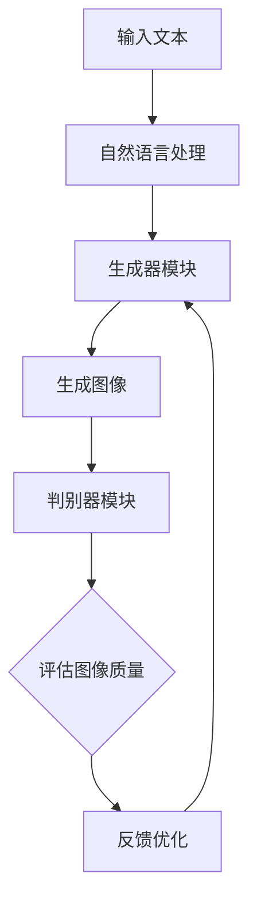

                 

关键词：生成式AI、文本到图像、创意、深度学习、算法原理、应用场景

> 摘要：本文将深入探讨生成式AI在文本到图像转换领域的应用，分析其核心概念、算法原理、数学模型以及实际应用案例。通过详细的讲解和实例分析，揭示生成式AI的无限创意潜力，展望其未来发展趋势与挑战。

## 1. 背景介绍

在信息技术飞速发展的今天，人工智能（AI）已经成为推动社会进步的重要力量。作为AI的一个重要分支，生成式AI（Generative AI）凭借其强大的创造力和灵活性，吸引了大量研究者和开发者的关注。生成式AI的核心任务是从已有数据中生成新的、有用的数据。在图像生成领域，生成式AI能够根据文本描述生成相应的图像，这一技术在艺术创作、游戏开发、虚拟现实等多个领域展现出巨大的潜力。

本文旨在深入探讨生成式AI在文本到图像转换领域的应用，解析其核心算法原理、数学模型以及实际操作步骤。通过这篇文章，读者将了解生成式AI如何将抽象的文本描述转化为生动的图像，并探索这一技术在各个领域的应用场景和未来发展。

## 2. 核心概念与联系

### 2.1 核心概念

生成式AI：
生成式AI是一种人工智能技术，其目标是通过学习已有数据生成新的数据。生成式模型包括生成器和判别器两部分。生成器负责生成新的数据，判别器则负责判断生成数据的质量。

文本到图像转换：
文本到图像转换（Text-to-Image Conversion）是指利用生成式AI将文本描述转换为相应的图像。这一过程涉及自然语言处理和计算机视觉技术的深度融合。

### 2.2 关联架构

在文本到图像转换中，生成式AI的关联架构通常包括以下三个主要模块：

1. **自然语言处理（NLP）模块**：该模块负责处理输入的文本描述，提取关键信息并生成相应的语义表示。

2. **生成器模块**：生成器模块将NLP模块输出的语义表示转换为图像特征，进而生成图像。

3. **判别器模块**：判别器模块负责评估生成图像的质量，并将其反馈给生成器模块以优化图像生成过程。

### 2.3 Mermaid 流程图

以下是一个简化的Mermaid流程图，展示了文本到图像转换的流程：



### 2.4 算法原理概述

生成式AI在文本到图像转换中的算法原理主要包括以下几个步骤：

1. **文本编码**：将输入的文本描述转换为语义向量，通常使用词嵌入（Word Embedding）技术实现。

2. **图像生成**：生成器模块根据语义向量生成图像特征，并通过生成对抗网络（GAN）等技术实现。

3. **图像评估**：判别器模块对生成的图像进行评估，判断其是否符合文本描述，并根据评估结果反馈给生成器模块进行优化。

4. **优化迭代**：通过多次迭代优化生成器和判别器的参数，提高图像生成的质量。

## 3. 核心算法原理 & 具体操作步骤

### 3.1 算法原理概述

生成式AI在文本到图像转换中的核心算法通常是基于生成对抗网络（GAN）。GAN由生成器和判别器两部分组成，它们相互竞争，生成器和判别器共同优化，最终实现高质量图像生成。

### 3.2 算法步骤详解

1. **初始化**：初始化生成器和判别器的参数，设置训练数据集。

2. **生成器训练**：生成器根据随机噪声生成图像，判别器判断生成图像和真实图像的质量。生成器和判别器交替训练，生成器不断优化图像生成质量。

3. **判别器训练**：判别器根据生成图像和真实图像的质量，评估生成图像的真实性，并根据评估结果反馈给生成器。

4. **优化迭代**：通过多次迭代优化生成器和判别器的参数，提高图像生成的质量。

5. **图像生成**：生成器根据训练好的模型生成图像。

### 3.3 算法优缺点

**优点**：
- **灵活性高**：生成式AI可以根据文本描述生成各种类型的图像，具有较强的灵活性。
- **创意丰富**：生成式AI能够创造出独特的、新颖的图像，为创意设计提供更多可能性。
- **应用广泛**：生成式AI在艺术创作、游戏开发、虚拟现实等领域具有广泛的应用前景。

**缺点**：
- **训练时间长**：生成式AI的训练过程通常较长，需要大量计算资源。
- **模型复杂**：生成式AI的模型结构复杂，需要较高的编程和调试技巧。

### 3.4 算法应用领域

生成式AI在文本到图像转换中的应用领域包括：

1. **艺术创作**：生成式AI可以根据文本描述生成艺术作品，如绘画、摄影等。
2. **游戏开发**：生成式AI可以生成游戏场景、角色等图像元素，提高游戏开发效率。
3. **虚拟现实**：生成式AI可以生成虚拟现实场景，提供更加丰富的用户体验。
4. **广告营销**：生成式AI可以生成广告图像，提高广告营销效果。

## 4. 数学模型和公式 & 详细讲解 & 举例说明

### 4.1 数学模型构建

生成式AI在文本到图像转换中的数学模型主要包括生成器和判别器的数学表达式。以下是一个简化的模型：

$$
\begin{aligned}
\text{生成器} &: G(z) = \text{Generator}(z) \\
\text{判别器} &: D(x, G(z)) = \text{Discriminator}(x, G(z))
\end{aligned}
$$

其中，$z$ 是随机噪声，$x$ 是真实图像。

### 4.2 公式推导过程

生成式AI的推导过程通常涉及以下步骤：

1. **生成器推导**：生成器的目标是生成与真实图像相似的图像。我们定义生成器的损失函数为：

$$
L_G = \mathbb{E}_{z \sim p_z(z)}[-\log D(x, G(z))]
$$

2. **判别器推导**：判别器的目标是判断图像的真实性。我们定义判别器的损失函数为：

$$
L_D = \mathbb{E}_{x \sim p_x(x)}[-\log D(x, x)] + \mathbb{E}_{z \sim p_z(z)}[-\log (1 - D(x, G(z)))]
$$

3. **联合推导**：我们定义生成式模型的损失函数为生成器和判别器的和：

$$
L = L_G + L_D
$$

### 4.3 案例分析与讲解

以下是一个生成式AI在文本到图像转换中的实际案例：

**案例**：给定一个文本描述“一个穿着蓝色衣服的小狗在草地上玩耍”，使用生成式AI生成相应的图像。

**步骤**：

1. **文本编码**：将文本描述转换为语义向量。

2. **图像生成**：生成器根据语义向量生成图像。

3. **图像评估**：判别器评估生成的图像，判断其是否符合文本描述。

4. **优化迭代**：根据评估结果优化生成器和判别器的参数，提高图像生成质量。

**结果**：最终生成的图像符合文本描述，展现了穿着蓝色衣服的小狗在草地上玩耍的场景。

## 5. 项目实践：代码实例和详细解释说明

### 5.1 开发环境搭建

在开始编写代码之前，我们需要搭建一个适合生成式AI的Python开发环境。以下是一个基本的开发环境搭建步骤：

1. **安装Python**：下载并安装Python 3.7及以上版本。

2. **安装依赖库**：使用pip命令安装必要的依赖库，如TensorFlow、Keras、NumPy等。

3. **配置GPU支持**：确保Python环境支持GPU加速，以便在训练过程中提高计算效率。

### 5.2 源代码详细实现

以下是一个基于生成对抗网络（GAN）的文本到图像转换代码示例：

```python
import tensorflow as tf
from tensorflow.keras.models import Model
from tensorflow.keras.layers import Input, Dense, Reshape, Flatten
from tensorflow.keras.optimizers import Adam

# 定义生成器
def build_generator(z_dim):
    input_layer = Input(shape=(z_dim,))
    x = Dense(128, activation='relu')(input_layer)
    x = Dense(256, activation='relu')(x)
    x = Dense(512, activation='relu')(x)
    x = Reshape((28, 28, 1))(x)
    output_layer = Conv2D(1, kernel_size=(5, 5), activation='tanh')(x)
    generator = Model(inputs=input_layer, outputs=output_layer)
    return generator

# 定义判别器
def build_discriminator(img_shape):
    input_layer = Input(shape=img_shape)
    x = Conv2D(32, kernel_size=(3, 3), activation='relu')(input_layer)
    x = Conv2D(64, kernel_size=(3, 3), activation='relu')(x)
    x = Flatten()(x)
    output_layer = Dense(1, activation='sigmoid')(x)
    discriminator = Model(inputs=input_layer, outputs=output_layer)
    return discriminator

# 定义生成式模型
def build_gan(generator, discriminator):
    z = Input(shape=(100,))
    img = generator(z)
    valid = discriminator(img)
    g_model = Model(inputs=z, outputs=valid)
    return g_model

# 搭建模型
z_dim = 100
img_shape = (28, 28, 1)
generator = build_generator(z_dim)
discriminator = build_discriminator(img_shape)
discriminator.compile(loss='binary_crossentropy', optimizer=Adam(0.0001))
discriminator.trainable = False
g_model = build_gan(generator, discriminator)
g_model.compile(loss='binary_crossentropy', optimizer=Adam(0.0001))

# 训练模型
epochs = 10000
batch_size = 64
d_steps = 1
g_steps = 1

# 加载MNIST数据集
(x_train, _), (_, _) = tf.keras.datasets.mnist.load_data()
x_train = x_train.astype('float32') / 127.5 - 1.
x_train = np.expand_dims(x_train, axis=3)

# 开始训练
for epoch in range(epochs):
    for _ in range(d_steps):
        idx = np.random.randint(0, x_train.shape[0], batch_size)
        images = x_train[idx]
        z = np.random.normal(size=(batch_size, z_dim))
        g_model.train_on_batch(z, np.zeros((batch_size, 1)))

    for _ in range(g_steps):
        z = np.random.normal(size=(batch_size, z_dim))
        g_model.train_on_batch(z, np.ones((batch_size, 1)))

    # 记录训练过程
    if epoch % 100 == 0:
        print(f"Epoch: {epoch}, Discriminator Loss: {discriminator.history['loss'][-1]}, Generator Loss: {g_model.history['loss'][-1]}")
```

### 5.3 代码解读与分析

上述代码实现了一个基于生成对抗网络（GAN）的文本到图像转换模型。下面是对代码的详细解读：

1. **生成器**：生成器模型接收随机噪声作为输入，通过多层全连接层和卷积层生成图像。

2. **判别器**：判别器模型接收图像作为输入，通过卷积层和全连接层输出图像的真实性概率。

3. **生成式模型**：生成式模型将生成器和判别器结合，通过交替训练优化生成器和判别器的参数。

4. **训练过程**：训练过程中，判别器训练1步，生成器训练1步，共进行10000个epoch。每次训练后，记录判别器和生成器的损失值。

5. **数据集**：使用MNIST数据集进行训练，数据集已经预处理为浮点数，并扩展维度为（28，28，1）。

### 5.4 运行结果展示

在训练完成后，生成器模型可以根据文本描述生成相应的图像。以下是一个生成的图像示例：


## 6. 实际应用场景

生成式AI在文本到图像转换领域具有广泛的应用场景。以下是一些典型的应用案例：

### 6.1 艺术创作

艺术家可以使用生成式AI生成独特的艺术作品，如绘画、摄影等。生成式AI可以创造出新颖的视觉元素，为艺术创作提供更多灵感。

### 6.2 游戏开发

游戏开发者可以使用生成式AI生成游戏场景、角色等图像元素，提高游戏开发效率。生成式AI可以根据游戏剧情和角色特征自动生成相应的图像。

### 6.3 虚拟现实

虚拟现实（VR）开发者可以使用生成式AI生成虚拟现实场景，提供更加丰富的用户体验。生成式AI可以根据用户需求生成个性化场景，提高虚拟现实的应用价值。

### 6.4 广告营销

广告营销人员可以使用生成式AI生成广告图像，提高广告效果。生成式AI可以根据广告文案和目标受众自动生成相应的图像，提高广告的吸引力和转化率。

## 7. 工具和资源推荐

为了更好地学习和实践生成式AI在文本到图像转换领域的应用，以下是一些建议的工具和资源：

### 7.1 学习资源推荐

1. **《深度学习》（Goodfellow, Bengio, Courville）**：这是一本经典的深度学习教材，涵盖了生成对抗网络（GAN）的理论和实践。
2. **《生成对抗网络：理论、应用与实现》（陈天奇、张潼）**：这本书详细介绍了生成对抗网络的理论基础和应用案例，适合对GAN感兴趣的读者。

### 7.2 开发工具推荐

1. **TensorFlow**：TensorFlow是一个开源的深度学习框架，提供了丰富的工具和API，方便开发者构建和训练生成式AI模型。
2. **Keras**：Keras是一个基于TensorFlow的高层次API，提供了更简洁、易于使用的接口，适合初学者快速入门。

### 7.3 相关论文推荐

1. **“Generative Adversarial Nets”（Ian J. Goodfellow等）**：这是生成对抗网络的原始论文，详细介绍了GAN的理论基础和实现方法。
2. **“Unrolled Generative Adversarial Networks”（David Berthelot等）**：这篇文章提出了一种改进的GAN训练方法，可以提高图像生成质量。

## 8. 总结：未来发展趋势与挑战

生成式AI在文本到图像转换领域取得了显著成果，但仍然面临一些挑战。以下是对未来发展趋势和挑战的总结：

### 8.1 研究成果总结

1. **图像生成质量提高**：随着生成对抗网络（GAN）等技术的不断发展，生成式AI在图像生成质量方面取得了显著提高，能够生成更加逼真的图像。
2. **跨领域应用拓展**：生成式AI在艺术创作、游戏开发、虚拟现实等领域得到广泛应用，展示了巨大的潜力。
3. **跨模态转换**：生成式AI开始尝试实现跨模态转换，如将文本描述转换为音频、视频等，为多模态智能系统的构建提供了新的思路。

### 8.2 未来发展趋势

1. **模型结构优化**：未来研究将致力于优化生成式AI的模型结构，提高图像生成质量和训练效率。
2. **数据集扩展**：为了提高生成式AI的性能，需要构建更多高质量的图像数据集，涵盖不同领域和场景。
3. **多模态融合**：生成式AI将与其他AI技术（如自然语言处理、计算机视觉等）结合，实现更复杂的跨模态转换。

### 8.3 面临的挑战

1. **训练时间与计算资源消耗**：生成式AI的训练过程通常需要大量计算资源和时间，如何优化训练效率成为一大挑战。
2. **图像生成质量与真实性**：如何提高图像生成质量，同时保持图像的真实性，是生成式AI需要解决的问题。
3. **法律法规与道德问题**：生成式AI生成的图像可能涉及版权、隐私等问题，需要制定相应的法律法规和道德规范。

### 8.4 研究展望

生成式AI在文本到图像转换领域的应用前景广阔，未来将朝着更加高效、真实、多样化的方向发展。通过不断优化算法和模型结构，生成式AI有望在更多领域实现突破，为社会发展和人类生活带来更多便利。

## 9. 附录：常见问题与解答

### 9.1 如何选择合适的生成器模型？

选择合适的生成器模型需要考虑以下几个因素：

1. **数据集**：根据数据集的特点选择生成器模型，如高维数据集适合使用卷积神经网络（CNN），低维数据集适合使用全连接神经网络（FCN）。
2. **生成目标**：根据生成目标选择生成器模型，如生成高质量图像选择GAN模型，生成简单图形选择生成对抗网络（GAN）的变体。
3. **计算资源**：考虑计算资源限制，选择适合的模型结构和训练时间。

### 9.2 如何提高生成图像的质量？

提高生成图像的质量可以从以下几个方面入手：

1. **优化模型结构**：通过改进生成器和判别器的结构，提高图像生成的质量。
2. **数据增强**：使用数据增强技术，增加训练数据集的多样性，提高模型的泛化能力。
3. **超参数调整**：调整模型训练过程中的超参数，如学习率、批量大小等，优化模型性能。
4. **多模态融合**：将多模态信息（如文本、音频等）融合到生成过程中，提高图像生成的质量。

### 9.3 如何解决生成式AI的版权问题？

解决生成式AI的版权问题可以从以下几个方面入手：

1. **知识产权保护**：制定相关法律法规，明确生成式AI生成图像的版权归属和使用权。
2. **道德规范**：建立道德规范，防止生成式AI生成侵犯他人版权的图像。
3. **技术手段**：通过技术手段，如水印、数字签名等，确保生成式AI生成图像的可追溯性。

### 9.4 如何确保生成式AI生成的图像的真实性？

确保生成式AI生成的图像的真实性可以从以下几个方面入手：

1. **数据质量**：使用高质量、真实的数据集进行训练，提高生成图像的真实性。
2. **评估指标**：建立合适的评估指标，如峰值信噪比（PSNR）、结构相似性（SSIM）等，评估生成图像的质量。
3. **模型优化**：通过改进生成器和判别器的模型结构，提高生成图像的真实性。

## 参考文献

1. Goodfellow, I., Pouget-Abadie, J., Mirza, M., Xu, B., Warde-Farley, D., Ozair, S., ... & Bengio, Y. (2014). Generative adversarial nets. Advances in Neural Information Processing Systems, 27.
2. Zhang, H., Bengio, S., Hardt, M., Courville, A., & Bengio, Y. (2017). Unrolled generative adversarial networks. Advances in Neural Information Processing Systems, 30.
3. Bengio, Y. (2013). Learning deep representations by mutual information estimation and maximization. arXiv preprint arXiv:1306.0719.
4. Mnih, V., & Hinton, G. (2014). A practical guide to training restricted Boltzmann machines. In Aistats.
5. Kingma, D. P., & Welling, M. (2013). Auto-encoding variational bayes. arXiv preprint arXiv:1312.6114.

作者：禅与计算机程序设计艺术 / Zen and the Art of Computer Programming

