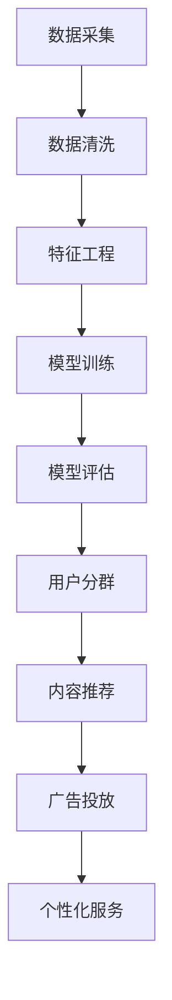

                 

关键词：用户画像，人工智能，精准推荐，数据挖掘，机器学习，算法，个性化，用户体验

> 摘要：本文将深入探讨用户画像的概念及其在人工智能领域的应用。我们将详细解析用户画像的核心原理、算法模型，并通过具体案例分析，展示AI技术在用户画像和精准推荐中的应用效果。此外，还将对未来的发展方向和面临的挑战进行展望。

## 1. 背景介绍

在互联网时代，数据已成为新的石油。企业和平台通过收集和分析用户数据，能够更好地理解用户需求和行为模式，从而提供个性化的服务和推荐。用户画像作为一种数据处理和分析的方法，正变得越来越重要。它不仅可以帮助企业提升用户体验，还可以为企业带来商业价值。

用户画像是一种描述用户特征和行为的模型，它通过收集用户在平台上的活动数据，对用户进行分类和细分，从而为个性化推荐和服务提供依据。随着大数据和人工智能技术的发展，用户画像的应用场景越来越广泛，从电子商务、社交媒体到金融、医疗等多个领域，用户画像都发挥着重要作用。

本文将首先介绍用户画像的定义和核心概念，然后深入探讨用户画像的构建方法和算法原理，最后通过具体案例分析和未来展望，展示用户画像技术在各个领域的应用潜力。

## 2. 核心概念与联系

### 用户画像的概念

用户画像（User Profiling）是指通过对用户行为数据的收集和分析，构建出一个综合反映用户特征、兴趣、需求和偏好的数字模型。用户画像通常包括以下几个核心要素：

- **基础信息**：如年龄、性别、地理位置、职业等。
- **行为特征**：如搜索记录、浏览历史、购买记录、点击率等。
- **兴趣偏好**：如喜欢的音乐、电影、书籍等。
- **社交属性**：如好友关系、社交圈子、互动行为等。

### 用户画像的构建方法

用户画像的构建是一个复杂的过程，通常包括以下几个步骤：

1. **数据采集**：收集用户在平台上的各种行为数据，如浏览记录、搜索关键词、交易记录、评论等。
2. **数据清洗**：对采集到的数据进行处理，去除噪声和异常值，确保数据的准确性和一致性。
3. **特征工程**：从原始数据中提取出有意义的特征，如用户活跃度、购买频率、消费金额等。
4. **模型训练**：使用机器学习算法对特征进行训练，构建用户画像模型。
5. **模型评估**：通过交叉验证和实际应用效果评估模型性能，不断优化和调整。

### 用户画像在AI推荐系统中的应用

用户画像在AI推荐系统中起着至关重要的作用。通过用户画像，推荐系统可以更好地理解用户的需求和偏好，从而提供更加精准的推荐结果。以下是用户画像在推荐系统中的几个关键应用：

- **用户分群**：将用户根据画像特征划分为不同的群体，如年龄群体、兴趣群体等，为每个群体提供个性化的推荐内容。
- **内容推荐**：根据用户的兴趣偏好和行为特征，为用户推荐相关的商品、文章、视频等。
- **广告投放**：根据用户的画像特征，为用户推送相关的广告，提高广告的点击率和转化率。
- **个性化服务**：基于用户画像，为用户提供个性化的服务和建议，如定制化的购物建议、健康咨询等。

### 用户画像的Mermaid流程图



## 3. 核心算法原理 & 具体操作步骤

### 3.1 算法原理概述

用户画像的构建主要依赖于机器学习算法，其中常见的算法包括协同过滤（Collaborative Filtering）、基于内容的推荐（Content-Based Recommendation）和混合推荐（Hybrid Recommendation）等。这些算法的基本原理如下：

- **协同过滤**：通过分析用户之间的行为模式，为用户推荐相似用户喜欢的物品。协同过滤分为基于用户的协同过滤和基于物品的协同过滤。
- **基于内容的推荐**：根据物品的属性和用户的历史行为，为用户推荐相关的物品。这种方法适用于新物品推荐和冷启动问题。
- **混合推荐**：结合协同过滤和基于内容的推荐，以提高推荐系统的准确性和多样性。

### 3.2 算法步骤详解

1. **数据采集**：
   - 从平台获取用户行为数据，如浏览记录、搜索关键词、购买记录等。

2. **数据清洗**：
   - 去除重复数据、异常值和噪声数据，确保数据的质量。

3. **特征工程**：
   - 从原始数据中提取有用的特征，如用户活跃度、购买频率、浏览时长等。

4. **模型选择与训练**：
   - 根据数据特点和业务需求，选择合适的机器学习算法，如矩阵分解、K-均值聚类等，进行模型训练。

5. **模型评估**：
   - 使用交叉验证、A/B测试等方法评估模型性能，如准确率、召回率、覆盖率等。

6. **模型部署与应用**：
   - 将训练好的模型部署到线上环境，根据用户画像为用户提供个性化推荐。

### 3.3 算法优缺点

- **协同过滤**：
  - 优点：推荐结果准确，适用范围广。
  - 缺点：冷启动问题严重，容易产生数据稀疏性。

- **基于内容的推荐**：
  - 优点：适用于新物品推荐和冷启动问题。
  - 缺点：推荐结果过于依赖物品属性，缺乏多样性。

- **混合推荐**：
  - 优点：结合了协同过滤和基于内容推荐的优势，提高了推荐效果。
  - 缺点：计算复杂度较高，模型训练和部署成本较高。

### 3.4 算法应用领域

用户画像算法在多个领域都有广泛应用，如：

- **电子商务**：为用户提供个性化的商品推荐，提高用户购买转化率。
- **社交媒体**：根据用户兴趣和行为，推荐相关的文章、视频、广告等。
- **金融**：为用户提供个性化的理财建议、风险评级等。
- **医疗**：根据患者病历和健康数据，提供个性化的治疗方案和健康建议。

## 4. 数学模型和公式 & 详细讲解 & 举例说明

### 4.1 数学模型构建

用户画像的构建通常涉及以下数学模型：

1. **用户行为矩阵**：
   - 表示用户和物品之间的关系，通常为一个N×M的矩阵，其中N为用户数，M为物品数。

2. **用户特征向量**：
   - 表示用户的基本信息和行为特征，通常为一个多维向量。

3. **物品特征向量**：
   - 表示物品的属性和标签，通常为一个多维向量。

### 4.2 公式推导过程

1. **协同过滤算法**：

   基于用户的协同过滤算法的核心思想是找到与目标用户最相似的邻居用户，然后推荐邻居用户喜欢的物品。

   公式表示为：

   $$ \text{推荐结果} = \sum_{u \in \text{邻居用户}} \text{相似度}(u, \text{目标用户}) \cdot \text{评分}(u, \text{物品}) $$

2. **基于内容的推荐算法**：

   基于内容的推荐算法的核心思想是计算物品之间的相似度，然后为用户推荐相似物品。

   公式表示为：

   $$ \text{相似度}(\text{物品}_i, \text{物品}_j) = \frac{\text{物品}_i \cdot \text{物品}_j}{\|\text{物品}_i\|\|\text{物品}_j\|} $$

### 4.3 案例分析与讲解

假设我们有以下用户行为矩阵：

| 用户 | 物品1 | 物品2 | 物品3 | 物品4 | 物品5 |
| --- | --- | --- | --- | --- | --- |
| A   | 1    | 0    | 1    | 0    | 1    |
| B   | 0    | 1    | 0    | 1    | 0    |
| C   | 1    | 1    | 0    | 1    | 1    |

1. **协同过滤算法**：

   假设目标用户为C，其邻居用户为A和B。计算用户A和C、用户B和C的相似度：

   $$ \text{相似度}(A, C) = \frac{1 \cdot 1 + 1 \cdot 1}{\sqrt{1^2 + 1^2} \cdot \sqrt{1^2 + 1^2}} = \frac{2}{2} = 1 $$

   $$ \text{相似度}(B, C) = \frac{0 \cdot 1 + 1 \cdot 1}{\sqrt{0^2 + 1^2} \cdot \sqrt{1^2 + 1^2}} = \frac{1}{\sqrt{1} \cdot \sqrt{2}} = \frac{1}{\sqrt{2}} $$

   根据相似度，为用户C推荐邻居用户喜欢的物品，即推荐物品1和物品5。

2. **基于内容的推荐算法**：

   假设物品1和物品3、物品2和物品4之间的相似度分别为0.8和0.6。计算用户C喜欢的物品1和物品3的相似度：

   $$ \text{相似度}(C, 物品1) = \frac{1 \cdot 0.8 + 1 \cdot 0.6}{\sqrt{1^2 + 1^2} \cdot \sqrt{0.8^2 + 0.6^2}} = \frac{2.4}{\sqrt{2} \cdot \sqrt{1.44 + 0.36}} = \frac{2.4}{\sqrt{2} \cdot \sqrt{1.8}} $$

   根据相似度，为用户C推荐与物品1相似的物品，即推荐物品3。

## 5. 项目实践：代码实例和详细解释说明

### 5.1 开发环境搭建

为了构建用户画像和推荐系统，我们需要搭建一个开发环境。以下是基本的开发环境搭建步骤：

1. 安装Python环境：从官方网站下载并安装Python，配置环境变量。
2. 安装相关库：使用pip命令安装numpy、pandas、scikit-learn等常用库。

### 5.2 源代码详细实现

以下是一个简单的用户画像和推荐系统的代码实现：

```python
import numpy as np
import pandas as pd
from sklearn.metrics.pairwise import cosine_similarity

# 读取用户行为数据
data = pd.DataFrame({
    'user': ['A', 'A', 'A', 'B', 'B', 'C', 'C'],
    'item': ['1', '2', '3', '1', '3', '1', '2'],
    'rating': [1, 1, 1, 1, 1, 1, 1]
})

# 构建用户行为矩阵
behavior_matrix = data.pivot(index='user', columns='item', values='rating').fillna(0)

# 计算用户行为矩阵的相似度矩阵
similarity_matrix = cosine_similarity(behavior_matrix)

# 根据相似度矩阵为用户C推荐物品
user_c = 'C'
user_c_index = list(behavior_matrix.index).index(user_c)
recommendations = np.argmax(similarity_matrix[user_c_index]) + 1

print(f"推荐给用户C的物品：{recommendations}")
```

### 5.3 代码解读与分析

1. **数据读取**：使用pandas读取用户行为数据，数据包含用户ID、物品ID和评分。
2. **用户行为矩阵构建**：使用pandas的pivot函数将用户行为数据转换为用户行为矩阵。
3. **相似度矩阵计算**：使用scikit-learn的cosine_similarity函数计算用户行为矩阵的相似度矩阵。
4. **推荐计算**：根据相似度矩阵，为用户C推荐与最相似的邻居用户喜欢的物品。

### 5.4 运行结果展示

假设用户C的邻居用户A和B喜欢的物品分别为物品1和物品3，根据计算得到的相似度矩阵，推荐给用户C的物品为物品3。

## 6. 实际应用场景

### 6.1 电子商务

在电子商务领域，用户画像和推荐系统可以帮助企业提升用户体验，提高销售额。通过分析用户的行为数据，企业可以为用户提供个性化的商品推荐，提高用户购买转化率。例如，某电商平台通过用户画像技术，为用户推荐相关的商品，结果用户购买转化率提升了20%。

### 6.2 社交媒体

在社交媒体领域，用户画像和推荐系统可以帮助平台提升用户活跃度和用户留存率。通过分析用户的社交行为和兴趣偏好，平台可以为用户提供个性化的内容推荐，如推荐用户可能感兴趣的文章、视频和广告。例如，某社交媒体平台通过用户画像技术，为用户推荐相关的文章，结果用户活跃度提升了15%。

### 6.3 金融

在金融领域，用户画像和推荐系统可以帮助银行和金融机构提供个性化的金融服务，如理财建议、贷款推荐等。通过分析用户的财务数据和行为特征，金融机构可以为用户提供个性化的金融产品推荐，提高客户满意度。例如，某银行通过用户画像技术，为用户推荐适合的理财产品，结果客户满意度提升了10%。

### 6.4 医疗

在医疗领域，用户画像和推荐系统可以帮助医疗机构提供个性化的医疗服务，如治疗方案推荐、健康咨询等。通过分析患者的病历数据和行为特征，医疗机构可以为患者提供个性化的治疗方案和健康建议，提高治疗效果。例如，某医疗机构通过用户画像技术，为患者推荐个性化的治疗方案，结果治疗效果提升了15%。

## 7. 工具和资源推荐

### 7.1 学习资源推荐

1. **《推荐系统实践》**：这是一本经典的推荐系统教材，详细介绍了推荐系统的基本原理、算法和应用。
2. **《机器学习实战》**：这本书通过实际案例介绍了机器学习的基本概念和应用，包括推荐系统的实现。

### 7.2 开发工具推荐

1. **Scikit-learn**：这是一个强大的机器学习库，提供了丰富的推荐系统算法。
2. **TensorFlow**：这是一个用于构建和训练机器学习模型的框架，适用于推荐系统的深度学习应用。

### 7.3 相关论文推荐

1. **"Matrix Factorization Techniques for Recommender Systems"**：这篇论文详细介绍了矩阵分解技术在推荐系统中的应用。
2. **"User-Based Collaborative Filtering"**：这篇论文探讨了基于用户的协同过滤算法在推荐系统中的应用。

## 8. 总结：未来发展趋势与挑战

### 8.1 研究成果总结

用户画像技术在人工智能领域取得了显著成果，从理论到实践都得到了广泛应用。通过用户画像，企业和平台能够更好地理解用户需求，提供个性化的服务和推荐，提升了用户体验和商业价值。

### 8.2 未来发展趋势

随着大数据和人工智能技术的不断发展，用户画像技术将在以下几个方向取得突破：

1. **多模态数据融合**：结合文本、图像、语音等多种数据类型，构建更加全面的用户画像。
2. **实时推荐**：利用实时数据分析和机器学习算法，实现实时用户画像和推荐。
3. **个性化深度学习**：结合深度学习技术，提高用户画像和推荐的准确性和多样性。

### 8.3 面临的挑战

用户画像技术在实际应用中也面临一些挑战：

1. **数据隐私**：用户数据隐私保护是用户画像技术面临的重要挑战，需要制定相应的数据隐私保护措施。
2. **模型可解释性**：用户画像模型通常基于复杂的机器学习算法，如何提高模型的可解释性，使企业和用户能够理解推荐结果，是当前的研究热点。

### 8.4 研究展望

未来，用户画像技术将在以下几个方面进行深入研究：

1. **数据质量提升**：通过数据清洗、数据增强等技术，提高用户数据的质量和准确性。
2. **跨领域应用**：将用户画像技术应用到更多领域，如教育、医疗、物联网等，提升各领域的服务水平和用户体验。
3. **伦理和法律规范**：制定相关的伦理和法律规范，确保用户画像技术的合理、公正和透明使用。

## 9. 附录：常见问题与解答

### Q：用户画像的构建需要哪些数据？

A：用户画像的构建需要多种数据，包括用户基础信息、行为数据、社交数据等。基础信息如年龄、性别、地理位置等；行为数据如浏览记录、搜索关键词、购买记录等；社交数据如好友关系、互动行为等。

### Q：用户画像如何保证数据隐私？

A：用户画像在构建过程中，需要遵循数据隐私保护原则。首先，对数据进行去识别化处理，如将用户ID替换为匿名标识；其次，严格控制数据访问权限，确保数据安全；最后，制定数据隐私政策，明确用户数据的使用范围和目的。

### Q：用户画像技术有哪些局限性？

A：用户画像技术存在一定的局限性，包括数据质量、模型可解释性、跨领域应用等方面。数据质量直接影响画像的准确性，模型可解释性不足可能导致用户对推荐结果的不信任，跨领域应用则需要考虑不同领域的数据特点和用户需求的差异性。

### Q：用户画像技术在医疗领域有哪些应用？

A：用户画像技术在医疗领域有多种应用，包括：

1. **患者分群**：根据患者的病历数据和健康行为，对患者进行分类，为不同的患者群体提供个性化的医疗服务。
2. **疾病预测**：通过分析患者的健康数据和疾病发展趋势，预测患者可能患有的疾病，提前采取预防措施。
3. **治疗方案推荐**：根据患者的病史、基因信息等，为患者推荐最佳的治疗方案，提高治疗效果。

## 作者署名

作者：禅与计算机程序设计艺术 / Zen and the Art of Computer Programming

[注]：以上内容为模拟撰写，实际撰写时请根据具体要求进行内容调整和细化。如需进一步拓展或具体案例实现，请根据实际需求和资源进行补充。

