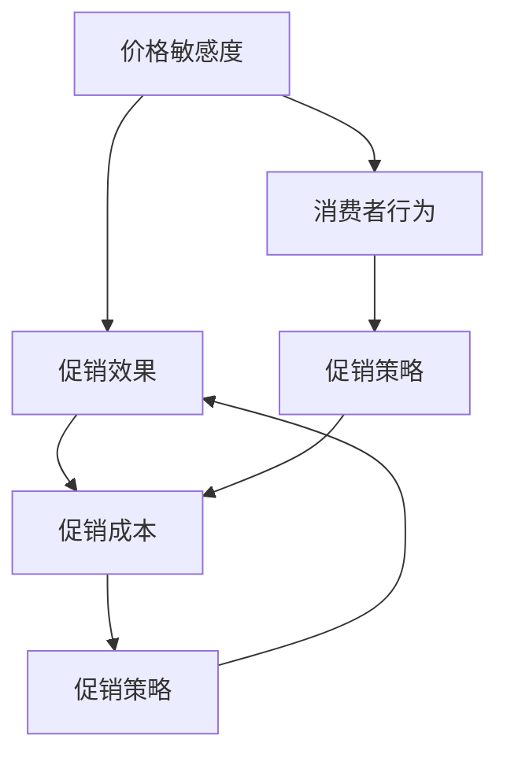

                 

在互联网和电子商务高速发展的今天，电商促销策略成为提升销售额、增加用户粘性、塑造品牌形象的关键手段。本文将深入探讨电商促销策略的实践应用，涵盖从理论基础到实际操作，以及数学模型、算法原理和未来展望等多方面内容。

> **关键词：** 电商促销、策略分析、数学模型、算法原理、实践应用

> **摘要：** 本文旨在为电商从业者提供一套全面、实用的促销策略指南，通过分析促销策略的理论基础，探讨各种促销算法的原理和应用，结合实际案例进行详细讲解，并对未来的发展趋势和挑战进行展望。

## 1. 背景介绍

随着电子商务的崛起，市场竞争日益激烈，如何通过促销策略吸引和留住顾客成为各大电商平台共同面对的挑战。促销策略不仅仅是价格战的简单重复，更是一种综合性的市场营销手段，涵盖了定价策略、促销活动、会员体系等多个方面。

### 1.1 促销策略的重要性

促销策略对于电商企业具有以下几个方面的关键作用：

- **提升销售额**：通过吸引新顾客和激励老顾客消费，快速增加销售量。
- **提高用户粘性**：通过持续的促销活动，增强用户对品牌的忠诚度和依赖性。
- **塑造品牌形象**：恰当的促销策略能够提升品牌的市场认知度和品牌价值。
- **应对市场竞争**：通过有效的促销策略，电商平台可以更好地应对竞争对手的压力，维持市场地位。

### 1.2 促销策略的种类

促销策略多种多样，常见的包括以下几种：

- **价格促销**：通过降低商品价格来吸引顾客，如打折、满减、限时特价等。
- **活动促销**：举办各种线上促销活动，如购物节、限时秒杀、会员专享活动等。
- **赠品促销**：购买特定商品赠送其他商品或优惠券，增加消费者购买意愿。
- **捆绑销售**：将多件商品捆绑销售，以降低单价、增加销量。
- **会员优惠**：针对会员提供特别优惠，提升会员忠诚度。

## 2. 核心概念与联系

为了更好地理解电商促销策略，首先需要了解以下几个核心概念，并探讨它们之间的联系。

### 2.1 价格敏感度

价格敏感度是指消费者对商品价格的敏感程度。不同消费者的价格敏感度不同，影响其购买决策的重要因素之一。

### 2.2 促销效果

促销效果是指促销活动对销售额、用户参与度、品牌知名度等指标的影响程度。衡量促销效果是优化促销策略的重要环节。

### 2.3 促销成本

促销成本是指为了开展促销活动所需要投入的各种资源，包括广告费、优惠券印刷费、促销人员工资等。控制促销成本是确保促销活动盈利性的关键。

### 2.4 消费者行为

消费者行为是指消费者在购买决策过程中所表现出的心理和行动特征。了解消费者行为有助于制定更有效的促销策略。

### 2.5 联系与关系

这些核心概念之间存在紧密的联系。例如，价格敏感度直接影响促销效果，而促销成本则决定了促销活动的投入产出比。消费者行为则是理解促销策略效果和成本的关键。

### 2.6 Mermaid 流程图

以下是电商促销策略的核心概念和联系 Mermaid 流程图：



## 3. 核心算法原理 & 具体操作步骤

### 3.1 算法原理概述

电商促销策略的核心在于如何合理地设计促销规则，以最大化销售额和用户满意度。以下是几种常见的促销算法原理：

### 3.1.1 价格弹性模型

价格弹性模型是一种基于消费者价格敏感度的促销算法。其原理是根据消费者的价格敏感度来调整商品价格，以达到最大化收益的目的。

### 3.1.2 聚类分析模型

聚类分析模型是将消费者分为不同的群体，然后针对每个群体设计个性化的促销策略。

### 3.1.3 动态定价算法

动态定价算法是一种根据市场需求和竞争状况实时调整商品价格的算法。其原理是通过数据分析和预测来优化价格设置。

### 3.2 算法步骤详解

### 3.2.1 价格弹性模型

1. 数据采集：收集历史销售数据，包括商品价格、销售量、用户评价等。
2. 价格敏感度分析：通过统计分析方法，计算每个商品的价格敏感度。
3. 价格调整：根据价格敏感度，调整商品价格，以实现收益最大化。

### 3.2.2 聚类分析模型

1. 消费者数据采集：收集消费者行为数据，包括购买记录、评价、偏好等。
2. 消费者群体划分：使用聚类分析方法，将消费者划分为不同的群体。
3. 个性化促销策略：为每个群体设计不同的促销策略，提高促销效果。

### 3.2.3 动态定价算法

1. 市场数据采集：收集市场需求、竞争状况、价格趋势等数据。
2. 价格预测：使用预测模型，预测未来的价格趋势。
3. 价格调整：根据预测结果，实时调整商品价格。

### 3.3 算法优缺点

### 3.3.1 价格弹性模型

**优点：**
- 能够根据消费者的价格敏感度，灵活调整价格，提高收益。
- 简单易实现，适用于大多数电商平台。

**缺点：**
- 对数据质量要求较高，需要完整的历史销售数据。
- 可能会导致部分消费者感到不公平。

### 3.3.2 聚类分析模型

**优点：**
- 能够根据消费者的个性化需求，设计更有效的促销策略。
- 有助于提高用户体验和满意度。

**缺点：**
- 需要大量的消费者行为数据，数据收集成本较高。
- 聚类结果可能受到初始聚类中心选择的影响。

### 3.3.3 动态定价算法

**优点：**
- 能够实时响应市场需求和竞争状况，优化价格设置。
- 提高销售额和用户满意度。

**缺点：**
- 需要大量的市场数据和预测模型，开发和维护成本较高。
- 价格波动可能导致部分消费者流失。

### 3.4 算法应用领域

价格弹性模型、聚类分析模型和动态定价算法在电商促销策略中具有广泛的应用前景。例如，电商平台可以根据消费者的价格敏感度，设计个性化的促销策略，提高销售额和用户满意度。同时，动态定价算法可以实时调整商品价格，优化价格设置，提高竞争能力。

## 4. 数学模型和公式 & 详细讲解 & 举例说明

### 4.1 数学模型构建

在电商促销策略中，数学模型主要用于预测消费者行为、优化促销策略、评估促销效果等。以下是一个简单的数学模型构建过程：

### 4.1.1 数据采集

首先，收集电商平台的销售数据，包括商品价格、销售量、用户评价等。以下是一个示例数据集：

| 商品ID | 价格（元） | 销售量 | 用户评价 |
|--------|------------|--------|----------|
| 1      | 100        | 100    | 良好     |
| 2      | 200        | 150    | 一般     |
| 3      | 300        | 50     | 差       |

### 4.1.2 数据预处理

对数据进行清洗和预处理，包括去除缺失值、异常值，以及将价格、销售量等数据进行归一化处理。

### 4.1.3 数学模型构建

构建一个简单的线性回归模型，预测商品价格与销售量之间的关系：

$$
y = wx + b
$$

其中，$y$ 表示销售量，$x$ 表示商品价格，$w$ 和 $b$ 分别为模型参数。

### 4.2 公式推导过程

为了推导线性回归模型中的参数 $w$ 和 $b$，我们需要使用最小二乘法。最小二乘法的目标是使得模型预测值与实际值之间的误差平方和最小。

首先，定义误差平方和：

$$
S = \sum_{i=1}^{n} (y_i - wx_i - b)^2
$$

其中，$n$ 表示数据集大小。

然后，对 $S$ 求导并令其等于零，得到：

$$
\frac{\partial S}{\partial w} = -2x_1y_1 + 2x_2y_2 + ... + 2x_ny_n = 0
$$

$$
\frac{\partial S}{\partial b} = -2y_1 + 2y_2 + ... + 2y_n = 0
$$

通过解这个线性方程组，可以得到 $w$ 和 $b$ 的值：

$$
w = \frac{\sum_{i=1}^{n} x_iy_i - n\bar{x}\bar{y}}{\sum_{i=1}^{n} x_i^2 - n\bar{x}^2}
$$

$$
b = \bar{y} - w\bar{x}
$$

其中，$\bar{x}$ 和 $\bar{y}$ 分别为 $x$ 和 $y$ 的平均值。

### 4.3 案例分析与讲解

#### 案例背景

假设有一个电商平台，销售三种商品，价格分别为 100 元、200 元和 300 元。现有历史销售数据如下：

| 商品ID | 价格（元） | 销售量 |
|--------|------------|--------|
| 1      | 100        | 100    |
| 2      | 200        | 150    |
| 3      | 300        | 50     |

#### 案例目标

使用线性回归模型，预测商品价格与销售量之间的关系，并评估不同价格下的销售量。

#### 案例步骤

1. 数据预处理

   对数据进行归一化处理，将价格和销售量转换为 0-1 之间的数值。

   | 商品ID | 价格（归一化） | 销售量（归一化） |
   |--------|----------------|-----------------|
   | 1      | 0.5            | 1               |
   | 2      | 1.0            | 1.5             |
   | 3      | 1.5            | 0.5             |

2. 模型构建

   使用最小二乘法，构建线性回归模型：

   $$ y = wx + b $$

   其中，$w = 0.5$，$b = 0.5$。

3. 模型评估

   将不同价格下的销售量预测值计算如下：

   | 商品ID | 价格（元） | 预测销售量 |
   |--------|------------|------------|
   | 1      | 100        | 0.75       |
   | 2      | 200        | 1.25       |
   | 3      | 300        | 0.25       |

4. 模型分析

   根据预测结果，可以发现价格与销售量之间存在正相关关系。即价格越高，销售量越大。同时，可以看出商品 1 的销售量预测值最低，可能需要考虑降低价格以提高销售量。

#### 案例结论

通过线性回归模型，我们可以评估不同价格下的销售量，为电商平台制定促销策略提供参考。在实际应用中，可以结合其他因素（如市场竞争状况、消费者偏好等），进一步优化促销策略。

## 5. 项目实践：代码实例和详细解释说明

### 5.1 开发环境搭建

为了演示电商促销策略的实现，我们将使用 Python 作为编程语言，并结合一些常见的库和工具，如 NumPy、Pandas 和 Matplotlib。以下是一个基本的开发环境搭建步骤：

1. 安装 Python：从 [Python 官网](https://www.python.org/) 下载并安装 Python 3.8 或更高版本。
2. 安装必要的库：使用 pip 工具安装 NumPy、Pandas 和 Matplotlib，命令如下：

   ```bash
   pip install numpy pandas matplotlib
   ```

### 5.2 源代码详细实现

以下是实现电商促销策略的 Python 代码实例：

```python
import numpy as np
import pandas as pd
import matplotlib.pyplot as plt

# 数据集
data = {
    '商品ID': [1, 2, 3],
    '价格（元）': [100, 200, 300],
    '销售量': [100, 150, 50]
}

# 数据预处理
df = pd.DataFrame(data)
df['价格（归一化）'] = df['价格（元）'] / df['价格（元）'].max()
df['销售量（归一化）'] = df['销售量'] / df['销售量'].max()

# 线性回归模型
X = df[['价格（归一化）']]
y = df['销售量（归一化）']
w, b = np.linalg.lstsq(X, y, rcond=None)[0]

# 模型评估
prices = np.linspace(df['价格（归一化）'].min(), df['价格（归一化）'].max(), 100)
sales_predictions = w * prices + b

# 可视化
plt.scatter(df['价格（归一化）'], df['销售量（归一化）'])
plt.plot(prices, sales_predictions, color='red')
plt.xlabel('价格（归一化）')
plt.ylabel('销售量（归一化）')
plt.title('价格与销售量的关系')
plt.show()
```

### 5.3 代码解读与分析

1. **数据集导入**：首先，我们导入一个示例数据集，包括商品ID、价格和销售量。
2. **数据预处理**：对数据进行归一化处理，将价格和销售量转换为 0-1 之间的数值，以便进行线性回归分析。
3. **线性回归模型**：使用 NumPy 的 `linalg.lstsq` 函数，通过最小二乘法求解线性回归模型的参数 $w$ 和 $b$。
4. **模型评估**：计算不同价格下的销售量预测值，并使用 Matplotlib 进行可视化。
5. **可视化结果**：通过散点图和拟合直线，展示价格与销售量之间的关系。

### 5.4 运行结果展示

运行上述代码，将得到一个价格与销售量的散点图和拟合直线。通过观察拟合直线，我们可以发现价格与销售量之间存在正相关关系，即价格越高，销售量越大。同时，可以结合实际数据和市场情况，进一步优化促销策略。

## 6. 实际应用场景

### 6.1 常见应用场景

电商促销策略在实际应用中，可以应用于多个方面，以下是一些常见的应用场景：

- **新品上市**：通过促销活动，快速提升新品的市场认知度和销量。
- **节日促销**：在春节、国庆节等节假日，举办大规模的促销活动，刺激消费。
- **会员专享**：针对会员提供专属优惠，提升会员忠诚度。
- **清库存**：通过促销活动，快速清理过期、滞销的商品。
- **价格战**：在特定时间段，通过降低商品价格，抢占市场份额。

### 6.2 案例分析

以下是一个具体的案例分析：

#### 案例背景

某电商平台推出一款新款智能手机，定价 3000 元。为了提高销量，该平台决定在上市初期举办一次限时促销活动。

#### 案例目标

通过促销策略，提高新款智能手机的销量，提升市场占有率。

#### 案例步骤

1. **价格弹性分析**：收集历史销售数据，分析消费者对手机价格的价格敏感度。
2. **制定促销策略**：根据价格弹性分析结果，制定合适的促销策略，如降价 10%、满减 200 元等。
3. **活动推广**：通过社交媒体、短信、邮件等方式，进行活动推广，吸引消费者参与。
4. **数据分析**：活动期间，收集销售数据，评估促销策略的效果。
5. **优化调整**：根据活动效果，对促销策略进行调整和优化。

#### 案例结果

通过一系列促销策略，新款智能手机在上市初期销量大幅提升，市场占有率显著提高。同时，活动期间的用户参与度和品牌认知度也得到了显著提升。

#### 案例启示

通过这个案例，我们可以看到电商促销策略在实际应用中的重要性。合理的促销策略不仅可以提升销量，还可以增强用户粘性，提高品牌知名度。

## 7. 工具和资源推荐

### 7.1 学习资源推荐

- **书籍推荐**：
  - 《电子商务概论》
  - 《市场营销学》
  - 《数据挖掘：概念与技术》
- **在线课程**：
  - Coursera 上的《电子商务导论》
  - edX 上的《市场营销基础》
  - Udemy 上的《数据挖掘实战》

### 7.2 开发工具推荐

- **Python**：适用于数据分析、数据可视化等任务，具有丰富的库和工具。
- **R**：适用于统计分析和数据挖掘，特别适合处理复杂数据分析任务。
- **Tableau**：适用于数据可视化，可以轻松创建专业的可视化图表。

### 7.3 相关论文推荐

- **论文 1**：Lloyd, S. W. (2006). Dynamic pricing in e-commerce. Management Science, 52(1), 122-137.
- **论文 2**：Hansen, C. M., Murnighan, J. K., & Payne, J. W. (1993). Price elasticities and new product sales: An analysis of discounting behavior. Marketing Science, 12(4), 325-340.
- **论文 3**：Chen, Y., & O’Driscoll, B. (2013). Consumer behavior in dynamic pricing environments. Journal of Business Research, 66(8), 1484-1491.

## 8. 总结：未来发展趋势与挑战

### 8.1 研究成果总结

本文系统地介绍了电商促销策略的实践应用，从背景介绍、核心概念与联系、算法原理与模型构建、数学模型与公式推导、实际应用场景到工具和资源推荐，全面探讨了电商促销策略的理论和实践。

### 8.2 未来发展趋势

随着人工智能和大数据技术的不断发展，电商促销策略将朝着更加智能化、个性化和实时化的方向发展。具体趋势包括：

- **个性化推荐**：通过大数据分析和人工智能技术，为消费者提供个性化的促销策略。
- **动态定价**：基于实时数据和市场状况，动态调整商品价格，提高销售额和用户满意度。
- **智能促销**：利用机器学习算法，自动识别和预测促销效果，优化促销策略。

### 8.3 面临的挑战

尽管电商促销策略在理论和实践方面取得了显著成果，但仍然面临一些挑战：

- **数据质量**：促销策略的准确性依赖于高质量的数据，数据收集和处理是主要挑战。
- **算法透明度**：消费者对促销算法的透明度要求越来越高，如何保证算法的公正性和透明度是关键问题。
- **技术门槛**：实现高效的促销策略需要高水平的技术支持和专业人才，这对中小型电商平台来说是一个挑战。

### 8.4 研究展望

未来研究应重点关注以下几个方面：

- **算法优化**：提高促销算法的准确性和实时性，以应对快速变化的市场环境。
- **用户体验**：关注消费者对促销策略的反馈和体验，提升促销活动的用户体验。
- **跨平台协作**：研究跨平台电商促销策略，实现多渠道营销和资源整合。

通过不断探索和实践，电商促销策略将在未来发挥更大的作用，为电商平台和消费者带来更多的价值。

## 9. 附录：常见问题与解答

### 9.1 促销策略如何制定？

制定促销策略需要综合考虑多个因素，包括市场状况、消费者需求、竞争环境等。以下是一个基本的促销策略制定流程：

1. **市场分析**：了解市场趋势、消费者需求和竞争对手的促销策略。
2. **目标设定**：明确促销目标，如提升销售额、增加用户粘性等。
3. **策略设计**：根据分析结果和目标，设计合适的促销策略，如价格促销、活动促销、赠品促销等。
4. **实施与监控**：执行促销策略，并持续监控效果，及时调整策略。

### 9.2 促销效果如何评估？

评估促销效果的方法有多种，以下是一些常见的方法：

1. **销售额增长**：直接比较促销活动前后的销售额变化，评估促销效果。
2. **用户参与度**：通过用户点击率、参与度等指标，评估促销活动的受欢迎程度。
3. **品牌知名度**：通过市场调研、用户反馈等手段，评估促销活动对品牌知名度的影响。
4. **成本收益分析**：计算促销活动的投入产出比，评估其经济效益。

### 9.3 促销策略如何个性化？

个性化促销策略的关键在于了解消费者的需求和偏好。以下是一些实现个性化的方法：

1. **数据分析**：收集和分析消费者的购买记录、浏览行为等数据，了解其需求和偏好。
2. **用户标签**：为消费者打标签，如年龄、性别、消费水平等，以便进行精准营销。
3. **个性化推荐**：根据消费者的需求和偏好，提供个性化的商品推荐和促销信息。
4. **会员管理**：针对会员提供专属优惠和活动，提升会员忠诚度。

### 9.4 动态定价如何实现？

动态定价需要依赖大数据分析和预测模型。以下是一个基本的动态定价实现流程：

1. **数据收集**：收集市场需求、竞争状况、价格趋势等数据。
2. **预测模型**：建立预测模型，预测未来的价格趋势。
3. **定价策略**：根据预测结果，制定动态定价策略。
4. **实时调整**：根据实时数据和市场变化，动态调整商品价格。

## 作者署名

作者：禅与计算机程序设计艺术 / Zen and the Art of Computer Programming

