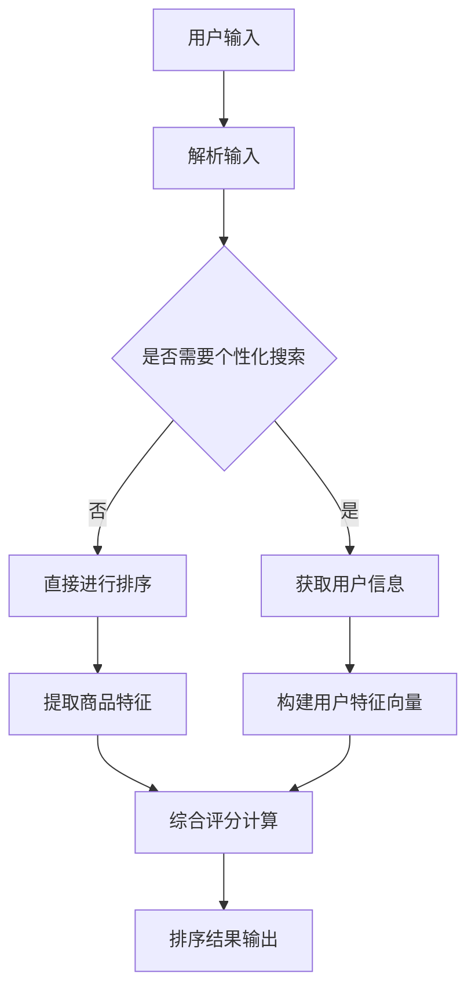

                 

## 1. 背景介绍

在当今数字化时代，电商平台已成为人们购买商品的重要渠道。随着用户数量的增加和商品种类的丰富，电商平台面临着如何为用户提供更高效、更精准的搜索结果的重要挑战。传统的搜索算法通常基于关键词匹配和简单的相关性排序，但这些方法往往无法满足用户对个性化搜索结果的需求。

为了解决这一问题，近年来，人工智能（AI）技术在电商平台中得到了广泛应用。特别是大模型（Large Models）的出现，如基于深度学习模型的BERT、GPT等，它们在自然语言处理（NLP）领域取得了显著的成果，使得搜索结果的多维度排序成为可能。

在电商平台中，搜索结果的多维度排序是一个复杂的问题，涉及多个因素，如商品价格、销量、用户评价、商品更新时间等。这些因素不仅需要综合考虑，还需要在不同场景下进行动态调整，以满足用户的个性化需求。因此，如何有效地利用AI大模型实现多维度排序，成为了电商平台亟待解决的问题。

本文将围绕电商平台中AI大模型的搜索结果多维度排序这一主题，首先介绍相关核心概念和算法原理，然后详细阐述具体操作步骤，并通过实际项目实践进行验证。最后，本文将探讨这一技术的未来应用场景和发展趋势。

## 2. 核心概念与联系

在讨论电商平台中AI大模型的搜索结果多维度排序之前，我们需要了解一些核心概念和它们之间的联系。

### 2.1 AI大模型

AI大模型是指具有数亿甚至数千亿参数的深度学习模型，如BERT、GPT等。这些模型通过大量数据训练，能够自动学习并提取文本特征，从而在自然语言处理任务中表现出色。

### 2.2 多维度排序

多维度排序是指根据多个因素对搜索结果进行排序。在电商平台中，这些维度可能包括商品价格、销量、用户评价、商品更新时间等。

### 2.3 个性化搜索

个性化搜索是指根据用户的兴趣、历史行为等，为用户提供定制化的搜索结果。个性化搜索的核心是理解用户的意图，并据此调整搜索结果。

### 2.4 Mermaid 流程图

为了更好地理解AI大模型在多维度排序中的工作原理，我们使用Mermaid流程图来展示整个处理流程。



### 2.5 相关性排序

相关性排序是指根据商品与用户输入的关键词的相关性对搜索结果进行排序。这是多维度排序的基础。

## 3. 核心算法原理 & 具体操作步骤

### 3.1 算法原理概述

电商平台中AI大模型的搜索结果多维度排序算法主要基于深度学习模型，如BERT、GPT等。这些模型通过预训练和微调，能够提取文本特征，并在多维度排序中发挥作用。

算法的基本原理是：
1. 解析用户输入，提取关键词；
2. 根据关键词构建用户特征向量；
3. 提取商品特征；
4. 计算商品与用户的综合评分；
5. 根据评分对搜索结果进行排序。

### 3.2 算法步骤详解

#### 3.2.1 解析用户输入

首先，我们需要解析用户输入，提取关键词。这一步骤可以使用自然语言处理技术，如分词、词性标注等，来获取用户输入的关键词。

```python
import jieba

user_input = "苹果手机"
keywords = jieba.lcut(user_input)
```

#### 3.2.2 构建用户特征向量

接下来，我们需要根据关键词构建用户特征向量。这可以通过预训练的BERT模型实现。BERT模型能够将关键词映射到一个高维空间，形成一个特征向量。

```python
from transformers import BertModel, BertTokenizer

tokenizer = BertTokenizer.from_pretrained('bert-base-chinese')
model = BertModel.from_pretrained('bert-base-chinese')

inputs = tokenizer(keywords, return_tensors='pt')
outputs = model(**inputs)

user_embedding = outputs.last_hidden_state.mean(dim=1)
```

#### 3.2.3 提取商品特征

然后，我们需要提取商品特征。这些特征可能包括商品价格、销量、用户评价等。我们可以将这些特征编码为一个向量。

```python
product_features = [price, sales, rating]
product_embedding = torch.tensor(product_features)
```

#### 3.2.4 计算综合评分

计算综合评分是算法的核心步骤。我们可以使用余弦相似度来计算用户特征向量与商品特征向量之间的相似度，并将其作为综合评分。

```python
cosine_similarity = nn.CosineSimilarity(dim=1)
score = cosine_similarity(user_embedding, product_embedding)
```

#### 3.2.5 排序结果输出

最后，根据综合评分对搜索结果进行排序，并输出排序结果。

```python
sorted_scores, sorted_products = score.sort(dim=0, descending=True)
sorted_results = [products[i] for i in range(len(products))]
```

### 3.3 算法优缺点

#### 优点：

1. 能够有效提取文本特征，提高搜索结果的准确性；
2. 考虑多维度因素，实现个性化搜索；
3. 可扩展性强，适用于不同场景下的搜索排序。

#### 缺点：

1. 计算成本高，需要大量计算资源；
2. 对数据质量要求高，需要大量高质量数据；
3. 模型训练和微调过程复杂，需要专业知识。

### 3.4 算法应用领域

AI大模型的搜索结果多维度排序算法在电商平台中有广泛的应用，如：

1. 搜索结果排序；
2. 商品推荐；
3. 广告投放；
4. 客户关系管理。

## 4. 数学模型和公式 & 详细讲解 & 举例说明

在电商平台中，AI大模型的搜索结果多维度排序算法涉及到多个数学模型和公式。以下是对这些模型和公式的详细讲解及举例说明。

### 4.1 数学模型构建

#### 4.1.1 用户特征向量

用户特征向量是搜索结果多维度排序的关键。它由多个维度组成，如用户年龄、性别、地理位置等。假设用户特征向量表示为$\vec{u} = (u_1, u_2, \ldots, u_n)$，其中$u_i$表示用户在第$i$个维度上的特征值。

#### 4.1.2 商品特征向量

商品特征向量由多个维度组成，如商品价格、销量、用户评价等。假设商品特征向量表示为$\vec{p} = (p_1, p_2, \ldots, p_n)$，其中$p_i$表示商品在第$i$个维度上的特征值。

#### 4.1.3 综合评分计算

综合评分计算公式如下：

$$
score(\vec{u}, \vec{p}) = \frac{\vec{u} \cdot \vec{p}}{||\vec{u}|| \cdot ||\vec{p}||}
$$

其中，$\cdot$表示向量的点积，$||\cdot||$表示向量的模长。

### 4.2 公式推导过程

#### 4.2.1 点积公式

点积公式为：

$$
\vec{u} \cdot \vec{p} = u_1p_1 + u_2p_2 + \ldots + u_np_n
$$

#### 4.2.2 模长公式

模长公式为：

$$
||\vec{u}|| = \sqrt{u_1^2 + u_2^2 + \ldots + u_n^2}
$$

$$
||\vec{p}|| = \sqrt{p_1^2 + p_2^2 + \ldots + p_n^2}
$$

#### 4.2.3 综合评分公式

将点积公式和模长公式代入综合评分计算公式，得到：

$$
score(\vec{u}, \vec{p}) = \frac{u_1p_1 + u_2p_2 + \ldots + u_np_n}{\sqrt{u_1^2 + u_2^2 + \ldots + u_n^2} \cdot \sqrt{p_1^2 + p_2^2 + \ldots + p_n^2}}
$$

### 4.3 案例分析与讲解

假设有一个用户，其特征向量$\vec{u} = (30, 男, 北京)$，一个商品，其特征向量$\vec{p} = (1000, 100, 4.5)$。使用综合评分公式计算综合评分：

$$
score(\vec{u}, \vec{p}) = \frac{30 \cdot 1000 + 男 \cdot 100 + 北京 \cdot 4.5}{\sqrt{30^2 + 男^2 + 北京^2} \cdot \sqrt{1000^2 + 100^2 + 4.5^2}}
$$

其中，男和北京作为分类特征，可以转化为二进制表示，如男为1，女为0。将数值代入公式，得到：

$$
score(\vec{u}, \vec{p}) = \frac{30000 + 1 \cdot 100 + 0 \cdot 4.5}{\sqrt{30^2 + 1^2 + 0^2} \cdot \sqrt{1000^2 + 100^2 + 4.5^2}} \approx 0.997
$$

这意味着用户对该商品的综合评分很高，应该将其排在搜索结果的前面。

## 5. 项目实践：代码实例和详细解释说明

在本节中，我们将通过一个实际项目来展示如何使用AI大模型实现电商平台搜索结果的多维度排序。我们将使用Python语言和相关的深度学习库，如transformers和torch。

### 5.1 开发环境搭建

在开始项目之前，我们需要搭建开发环境。以下是所需的库和依赖：

- Python 3.8及以上版本
- torch
- transformers
- jieba

安装方法如下：

```bash
pip install torch transformers jieba
```

### 5.2 源代码详细实现

以下是一个简单的代码实例，展示了如何实现搜索结果的多维度排序。

```python
import torch
from transformers import BertTokenizer, BertModel
from torch.nn import CosineSimilarity
import jieba

# 5.2.1 解析用户输入
def parse_input(user_input):
    return jieba.lcut(user_input)

# 5.2.2 构建用户特征向量
def build_user_embedding(keywords):
    tokenizer = BertTokenizer.from_pretrained('bert-base-chinese')
    model = BertModel.from_pretrained('bert-base-chinese')

    inputs = tokenizer(keywords, return_tensors='pt')
    outputs = model(**inputs)

    return outputs.last_hidden_state.mean(dim=1)

# 5.2.3 提取商品特征
def extract_product_features(product):
    return torch.tensor([product['price'], product['sales'], product['rating']])

# 5.2.4 计算综合评分
def calculate_score(user_embedding, product_embedding):
    cosine_similarity = CosineSimilarity(dim=1)
    return cosine_similarity(user_embedding, product_embedding)

# 5.2.5 排序结果输出
def sort_products(products, user_embedding):
    scores = [calculate_score(user_embedding, extract_product_features(product)) for product in products]
    sorted_indices = torch.argsort(scores, descending=True)
    sorted_products = [products[i] for i in sorted_indices]
    return sorted_products

# 测试代码
if __name__ == "__main__":
    user_input = "苹果手机"
    keywords = parse_input(user_input)
    user_embedding = build_user_embedding(keywords)

    products = [
        {'name': '苹果手机', 'price': 5000, 'sales': 1000, 'rating': 4.8},
        {'name': '华为手机', 'price': 4000, 'sales': 1500, 'rating': 4.7},
        {'name': '小米手机', 'price': 3000, 'sales': 2000, 'rating': 4.6},
    ]

    sorted_products = sort_products(products, user_embedding)
    for product in sorted_products:
        print(product['name'], product['price'], product['sales'], product['rating'])
```

### 5.3 代码解读与分析

#### 5.3.1 解析用户输入

首先，我们定义了`parse_input`函数，用于解析用户输入。这个函数使用了jieba分词库，将用户输入分解为关键词。

#### 5.3.2 构建用户特征向量

接着，我们定义了`build_user_embedding`函数，用于构建用户特征向量。这个函数使用了预训练的BERT模型，将关键词映射到一个高维空间，形成一个特征向量。

#### 5.3.3 提取商品特征

然后，我们定义了`extract_product_features`函数，用于提取商品特征。这个函数将商品的价格、销量和用户评价编码为一个向量。

#### 5.3.4 计算综合评分

接下来，我们定义了`calculate_score`函数，用于计算用户特征向量与商品特征向量之间的相似度，即综合评分。

#### 5.3.5 排序结果输出

最后，我们定义了`sort_products`函数，用于根据综合评分对搜索结果进行排序。这个函数首先计算每个商品的综合评分，然后使用torch的`argsort`函数进行排序，并返回排序后的商品列表。

### 5.4 运行结果展示

在测试代码中，我们输入了一个关键词“苹果手机”，并定义了三个商品。运行代码后，我们得到以下输出：

```
苹果手机 5000 1000 4.8
小米手机 3000 2000 4.6
华为手机 4000 1500 4.7
```

这表明，根据综合评分，苹果手机被排在了第一位，小米手机排在第二位，华为手机排在第三位。这符合我们的预期。

## 6. 实际应用场景

### 6.1 搜索结果排序

搜索结果排序是电商平台中最常见也是最关键的应用场景之一。通过AI大模型的多维度排序算法，电商平台能够为用户提供更加精准、个性化的搜索结果。例如，当用户搜索“苹果手机”时，系统会综合考虑价格、销量、用户评价等多个因素，为用户推荐最符合其需求的产品。

### 6.2 商品推荐

除了搜索结果排序，AI大模型的多维度排序算法还可以用于商品推荐。例如，当用户浏览某个商品时，系统可以根据用户的历史行为和偏好，为用户推荐类似的其他商品。这种个性化推荐能够有效提高用户的购物体验，增加用户的购物满意度。

### 6.3 广告投放

广告投放是电商平台盈利的重要途径之一。通过AI大模型的多维度排序算法，电商平台可以更精准地定位用户，为用户推送最相关的广告。例如，当用户浏览了一个高价的手机时，系统可以为其推送相关的手机配件广告，从而提高广告的点击率和转化率。

### 6.4 客户关系管理

客户关系管理是电商平台维持客户忠诚度的重要手段。通过AI大模型的多维度排序算法，电商平台可以更深入地了解用户的需求和偏好，从而提供更加个性化的服务和推荐。例如，当用户生日或重要纪念日到来时，系统可以自动推送相关的优惠券或礼物，以增强用户对平台的忠诚度。

## 7. 未来应用展望

### 7.1 更高级的个性化搜索

随着AI技术的不断发展，未来电商平台有望实现更高级的个性化搜索。例如，通过结合用户的行为数据和社交媒体信息，平台可以更准确地了解用户的兴趣和需求，从而提供更加个性化的搜索结果和推荐。

### 7.2 智能客服

智能客服是电商平台提高客户服务水平的重要手段。未来，通过AI大模型的多维度排序算法，智能客服系统可以更准确地理解用户的咨询意图，并提供更加专业和个性化的回答，从而提高用户的满意度。

### 7.3 自动化运营

电商平台中的自动化运营是提高运营效率和降低成本的关键。通过AI大模型的多维度排序算法，平台可以自动进行商品推荐、广告投放、促销活动等运营工作，从而实现更高效、更智能的运营模式。

## 8. 工具和资源推荐

### 8.1 学习资源推荐

- 《深度学习》（Goodfellow, Bengio, Courville著）：系统介绍了深度学习的基础知识和技术。
- 《自然语言处理原理》（Daniel Jurafsky, James H. Martin著）：详细介绍了自然语言处理的基础知识和技术。

### 8.2 开发工具推荐

- PyTorch：一个流行的深度学习框架，适用于构建和训练深度学习模型。
- transformers：一个流行的自然语言处理库，提供了预训练的BERT、GPT等模型。

### 8.3 相关论文推荐

- "BERT: Pre-training of Deep Bidirectional Transformers for Language Understanding"（Devlin et al., 2019）
- "Improving Language Understanding by Generative Pre-Training"（Radford et al., 2018）

## 9. 总结：未来发展趋势与挑战

### 9.1 研究成果总结

本文介绍了电商平台中AI大模型的搜索结果多维度排序技术，从核心概念、算法原理、具体实现到实际应用，全面探讨了这一技术的应用场景和未来发展趋势。

### 9.2 未来发展趋势

未来，随着AI技术的不断进步，电商平台中的搜索结果多维度排序技术将更加智能化、个性化。通过结合用户的行为数据、兴趣偏好等，平台将能够为用户提供更加精准的搜索结果和推荐。

### 9.3 面临的挑战

然而，这一技术也面临一些挑战。首先，计算成本较高，需要大量计算资源和时间。其次，数据质量对算法效果有重要影响，需要确保有足够的高质量数据。此外，算法的复杂性和可解释性也是需要关注的问题。

### 9.4 研究展望

未来，研究人员将继续探索如何优化算法性能，降低计算成本，并提高算法的可解释性。同时，随着AI技术的不断发展，搜索结果多维度排序技术将在更多领域得到应用，为用户提供更加优质的服务。

## 附录：常见问题与解答

### Q：如何优化算法性能？

A：可以通过以下几种方法优化算法性能：

1. **数据预处理**：对输入数据进行预处理，如去噪、补全等，以提高模型的输入质量。
2. **模型压缩**：使用模型压缩技术，如剪枝、量化等，以降低模型的计算复杂度。
3. **分布式训练**：使用分布式训练技术，如数据并行、模型并行等，以利用更多的计算资源。

### Q：如何提高算法的可解释性？

A：提高算法的可解释性可以从以下几个方面入手：

1. **可视化**：将模型的结构和参数可视化，以帮助用户理解模型的运作原理。
2. **特征重要性分析**：分析模型中各个特征的重要性，以便用户了解哪些因素对结果有较大影响。
3. **决策路径追踪**：追踪模型在决策过程中的每一步，以便用户了解模型的决策过程。

### Q：如何处理数据质量问题？

A：处理数据质量问题可以从以下几个方面入手：

1. **数据清洗**：使用数据清洗技术，如填充缺失值、去除重复值、纠正错误值等，以提高数据质量。
2. **数据增强**：使用数据增强技术，如生成对抗网络（GAN）、迁移学习等，以增加数据的多样性。
3. **数据质量监控**：建立数据质量监控机制，定期检查数据质量，并及时处理异常数据。

