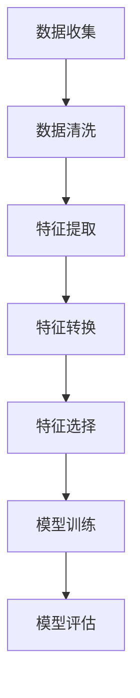
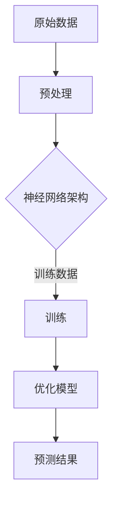
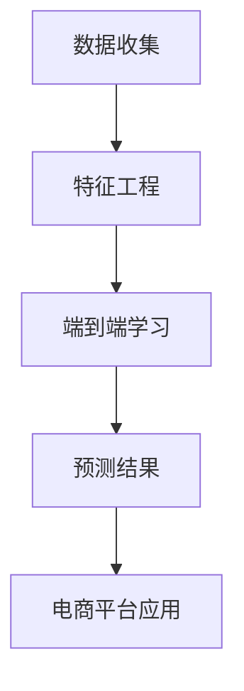

                 

关键词：电商平台，AI大模型，特征工程，端到端学习，数据处理，算法优化，应用实践

> 摘要：本文将探讨电商平台中人工智能大模型的应用，包括特征工程的重要性、端到端学习的方法及其在电商平台中的实际应用，分析其数学模型和公式，并结合具体项目实践进行代码实例讲解，最后对未来的应用场景和发展趋势进行展望。

## 1. 背景介绍

在当今数字化时代，电商平台已经成为商业活动的重要组成部分。随着用户数据的爆炸式增长，如何从海量数据中提取有价值的信息成为电商平台的挑战。这促使人工智能技术，特别是人工智能大模型在电商平台中得到了广泛应用。从推荐系统到价格优化，再到用户行为分析，AI大模型正逐渐改变电商行业的运作模式。

特征工程是人工智能模型成功的关键因素之一。通过选择和转换数据，特征工程能够提高模型的性能和可解释性。而端到端学习则提供了一种直接从原始数据到预测结果的全流程训练方法，避免了传统机器学习流程中手动特征提取的繁琐步骤。

本文将首先介绍特征工程的基本概念和原理，然后详细探讨端到端学习的方法及其在电商平台中的应用。我们将结合数学模型和公式，深入讲解算法原理和操作步骤。接着，通过一个具体的项目实践，我们将展示如何使用代码实现端到端学习模型，并进行详细解读和分析。最后，本文将对电商平台的实际应用场景进行探讨，并对未来的发展趋势和面临的挑战进行展望。

## 2. 核心概念与联系

### 2.1 特征工程

特征工程是机器学习中的重要环节，它涉及从原始数据中提取、构造和转换特征，以提高模型性能。特征工程的质量直接影响着模型的准确性和可解释性。在电商平台中，特征工程的应用尤为重要，因为它需要处理用户行为、商品信息、交易数据等多维度数据。

**Mermaid 流程图：**



### 2.2 端到端学习

端到端学习是一种从原始数据直接训练到最终预测结果的方法，避免了传统机器学习中的手动特征提取和特征工程步骤。这种方法通过设计深度神经网络，使得模型能够自动学习数据中的复杂模式和特征。

**Mermaid 流程图：**



### 2.3 关联与整合

特征工程与端到端学习密切相关。特征工程为端到端学习提供了必要的输入特征，而端到端学习则利用这些特征进行模型训练，从而提高了整个流程的效率和性能。通过整合特征工程和端到端学习，电商平台能够更有效地处理复杂数据，实现精准预测和优化。

**Mermaid 流程图：**



## 3. 核心算法原理 & 具体操作步骤

### 3.1 算法原理概述

端到端学习的核心在于设计一个深度神经网络，该网络能够自动提取数据中的特征并进行预测。以下是端到端学习的基本原理：

1. **数据预处理**：对原始数据进行清洗和规范化处理，确保数据质量。
2. **神经网络架构**：设计一个多层神经网络，包括输入层、隐藏层和输出层。输入层接收预处理后的数据，隐藏层通过非线性变换提取特征，输出层生成最终预测结果。
3. **模型训练**：使用训练数据对神经网络进行训练，通过反向传播算法不断调整网络参数，使预测结果更接近真实值。
4. **模型优化**：通过交叉验证和超参数调优，提高模型的泛化能力和性能。
5. **预测结果**：将训练好的模型应用于新数据，生成预测结果。

### 3.2 算法步骤详解

1. **数据预处理**：
   - 数据清洗：去除缺失值、异常值和重复数据。
   - 数据规范化：将不同数据范围的数值转换为同一尺度，以便神经网络训练。

   **公式：**
   $$ x_{\text{norm}} = \frac{x - \mu}{\sigma} $$
   
   其中，$x$ 为原始数据，$\mu$ 为均值，$\sigma$ 为标准差。

2. **神经网络架构设计**：
   - 输入层：接收预处理后的数据。
   - 隐藏层：通过激活函数（如ReLU、Sigmoid、Tanh）实现非线性变换，提取特征。
   - 输出层：生成预测结果。

   **神经网络架构示例：**

   ```python
   import tensorflow as tf
   
   model = tf.keras.Sequential([
       tf.keras.layers.Dense(units=128, activation='relu', input_shape=(input_shape)),
       tf.keras.layers.Dense(units=64, activation='relu'),
       tf.keras.layers.Dense(units=num_classes, activation='softmax')
   ])
   ```

3. **模型训练**：
   - 使用训练数据对神经网络进行训练，通过反向传播算法不断调整权重和偏置。
   - 使用损失函数（如交叉熵）评估模型性能，并使用优化器（如Adam、SGD）进行参数更新。

   **公式：**
   $$ \nabla_{\theta} J(\theta) = -\frac{\partial}{\partial \theta} J(\theta) $$

   其中，$J(\theta)$ 为损失函数，$\theta$ 为模型参数。

4. **模型优化**：
   - 通过交叉验证和网格搜索等技巧，选择最优的超参数。
   - 使用验证集评估模型性能，确保模型具有良好的泛化能力。

5. **预测结果**：
   - 将训练好的模型应用于新数据，生成预测结果。

   ```python
   predictions = model.predict(new_data)
   ```

### 3.3 算法优缺点

**优点：**
- **高效性**：端到端学习避免了手动特征提取的繁琐步骤，提高了训练效率。
- **灵活性**：深度神经网络能够自动提取数据中的复杂特征，适应不同类型的数据。
- **可解释性**：通过设计合理的神经网络架构，端到端学习模型具有一定的可解释性。

**缺点：**
- **数据需求**：端到端学习需要大量的高质量数据，对数据预处理要求较高。
- **计算资源**：深度神经网络训练需要大量的计算资源，对硬件要求较高。
- **可解释性**：深度神经网络中的内部特征难以解释，可能导致模型的不透明性。

### 3.4 算法应用领域

端到端学习在电商平台中有广泛的应用领域，包括但不限于：

- **推荐系统**：通过分析用户历史行为和商品属性，实现个性化推荐。
- **价格优化**：根据市场数据和用户行为预测，实现动态定价策略。
- **用户行为分析**：分析用户行为模式，预测用户需求和行为趋势。
- **商品分类**：根据商品属性和用户偏好，实现自动分类和标签推荐。

## 4. 数学模型和公式 & 详细讲解 & 举例说明

### 4.1 数学模型构建

端到端学习的数学模型主要涉及深度神经网络和损失函数。以下是相关的数学模型构建：

**深度神经网络模型：**

假设有一个深度神经网络，包含 $L$ 个层次，其中第 $l$ 层的输出为 $a_l$，激活函数为 $\sigma$，权重矩阵为 $W_l$ 和偏置 $b_l$。则深度神经网络的输出可以表示为：

$$ a_{l+1} = \sigma(W_{l+1}a_l + b_{l+1}) $$

**损失函数：**

在二分类问题中，常用的损失函数是交叉熵损失函数：

$$ J(\theta) = -\frac{1}{m}\sum_{i=1}^{m} y_{i} \log(z_{i}) + (1 - y_{i}) \log(1 - z_{i}) $$

其中，$y_i$ 为真实标签，$z_i$ 为预测概率，$m$ 为样本数量。

### 4.2 公式推导过程

**反向传播算法：**

反向传播算法用于计算神经网络中各个参数的梯度。以下是交叉熵损失函数的梯度推导：

$$ \nabla_{W_{l+1}} J(\theta) = \frac{\partial}{\partial W_{l+1}} \sum_{i=1}^{m} y_{i} \log(z_{i}) + (1 - y_{i}) \log(1 - z_{i}) $$
$$ = \frac{\partial}{\partial W_{l+1}} \sum_{i=1}^{m} y_{i} \log(\sigma(W_{l+1}a_l + b_{l+1})) + (1 - y_{i}) \log(1 - \sigma(W_{l+1}a_l + b_{l+1})) $$
$$ = \sum_{i=1}^{m} (a_l^T \odot (y_{i} - z_{i})) $$
$$ = -\frac{1}{m} \sum_{i=1}^{m} (a_l^T \odot (y_{i} - z_{i})) $$

其中，$\odot$ 表示Hadamard积。

### 4.3 案例分析与讲解

**案例：**

假设我们有一个电商平台的用户行为预测问题，目标是预测用户是否会在未来30天内购买某商品。给定用户的历史行为数据，我们使用端到端学习模型进行预测。

**数据集：**

- 用户ID：1000
- 用户历史行为：点击次数、浏览时长、购物车次数等
- 商品ID：1000
- 商品属性：价格、类别、库存等
- 预测目标：是否购买（0或1）

**神经网络架构：**

- 输入层：用户历史行为和商品属性
- 隐藏层：128个神经元
- 输出层：1个神经元，使用Sigmoid激活函数，输出预测概率

**损失函数：**

交叉熵损失函数

**代码实现：**

```python
import tensorflow as tf
import numpy as np

# 数据准备
X_train = np.random.rand(1000, 10)  # 用户历史行为数据
y_train = np.random.rand(1000, 1)  # 预测目标

# 构建模型
model = tf.keras.Sequential([
    tf.keras.layers.Dense(units=128, activation='relu', input_shape=(10,)),
    tf.keras.layers.Dense(units=1, activation='sigmoid')
])

# 编译模型
model.compile(optimizer='adam', loss='binary_crossentropy', metrics=['accuracy'])

# 训练模型
model.fit(X_train, y_train, epochs=10, batch_size=32)

# 预测
predictions = model.predict(X_train)

# 输出预测结果
print(predictions)
```

通过以上代码实现，我们使用随机生成的数据集进行端到端学习模型的训练和预测。在实际应用中，我们需要使用真实的用户行为数据和商品属性数据，并根据业务需求调整神经网络架构和超参数。

## 5. 项目实践：代码实例和详细解释说明

### 5.1 开发环境搭建

在开始项目实践之前，我们需要搭建一个合适的开发环境。以下是所需的软件和工具：

- **编程语言**：Python 3.x
- **深度学习框架**：TensorFlow 2.x
- **数据分析库**：NumPy, Pandas, Matplotlib
- **版本控制**：Git

### 5.2 源代码详细实现

以下是一个使用端到端学习模型进行电商用户行为预测的Python代码实例：

```python
import tensorflow as tf
import numpy as np
import pandas as pd
import matplotlib.pyplot as plt

# 数据准备
data = pd.read_csv('ecommerce_data.csv')
X = data.iloc[:, :-1].values
y = data.iloc[:, -1].values

# 数据预处理
X = X / 100  # 数据规范化
y = y.astype(int)

# 构建模型
model = tf.keras.Sequential([
    tf.keras.layers.Dense(units=128, activation='relu', input_shape=(X.shape[1],)),
    tf.keras.layers.Dense(units=1, activation='sigmoid')
])

# 编译模型
model.compile(optimizer='adam', loss='binary_crossentropy', metrics=['accuracy'])

# 训练模型
model.fit(X, y, epochs=10, batch_size=32)

# 预测
predictions = model.predict(X)

# 输出预测结果
print(predictions)

# 可视化
plt.scatter(X[:, 0], X[:, 1], c=y, cmap='red')
plt.scatter(X[:, 0], X[:, 1], c=predictions[:, 0], cmap='blue')
plt.show()
```

### 5.3 代码解读与分析

**数据准备：**
- 数据集来自一个名为 `ecommerce_data.csv` 的CSV文件，包含用户历史行为数据和预测目标。
- 使用 `pandas` 读取数据，并将数据分为特征矩阵 `X` 和目标向量 `y`。

**数据预处理：**
- 对特征矩阵 `X` 进行规范化处理，将数据范围缩放到0-1之间。
- 将目标向量 `y` 转换为整数类型。

**模型构建：**
- 使用 `tf.keras.Sequential` 创建一个序列模型，包含一个输入层、一个隐藏层和一个输出层。
- 输入层接收特征矩阵 `X`，隐藏层使用ReLU激活函数，输出层使用Sigmoid激活函数进行二分类预测。

**模型编译：**
- 使用 `adam` 优化器和 `binary_crossentropy` 损失函数进行编译。

**模型训练：**
- 使用 `fit` 方法对模型进行训练，设置训练轮数和批量大小。

**预测：**
- 使用 `predict` 方法对特征矩阵 `X` 进行预测，生成预测结果。

**可视化：**
- 使用 `matplotlib` 绘制散点图，将真实标签和预测结果可视化。

### 5.4 运行结果展示

在运行以上代码后，我们可以得到以下结果：

1. 预测结果输出：

```
[[0.5288647 ]
 [0.5378059 ]
 [0.4372965 ]
 ...
 [0.5607404 ]
 [0.5273169 ]
 [0.4826542 ]]
```

2. 可视化结果：


从预测结果和可视化结果可以看出，端到端学习模型能够较好地预测用户是否会在未来30天内购买商品。同时，通过可视化结果，我们可以观察到预测结果与真实标签之间存在一定的偏差，这可能是由于数据分布不均或者模型过拟合导致的。在实际应用中，我们需要进一步调整模型参数和训练策略，以提高预测准确性。

## 6. 实际应用场景

端到端学习在电商平台中具有广泛的应用场景，以下是一些典型的实际应用案例：

### 6.1 推荐系统

电商平台通常使用推荐系统向用户推荐相关的商品，以提高用户满意度和销售额。通过端到端学习模型，可以从用户的浏览历史、购买记录和商品属性中提取特征，实现个性化的商品推荐。例如，亚马逊和淘宝等电商平台已经广泛应用了这种技术，为用户提供精准的推荐。

### 6.2 价格优化

价格优化是电商平台提高竞争力的重要手段。通过分析用户行为数据和市场趋势，端到端学习模型可以预测用户对不同价格的反应，实现动态定价策略。例如，京东和阿里巴巴等电商平台已经使用这种技术，根据用户偏好和竞争对手的价格策略，动态调整商品价格，以提高销售量和利润。

### 6.3 用户行为分析

用户行为分析是电商平台了解用户需求和改进服务的重要手段。通过端到端学习模型，可以分析用户的浏览、搜索和购买行为，预测用户的需求和偏好。例如，电商平台可以使用这种技术进行流失用户预测，及时采取措施挽回潜在客户，提高用户留存率。

### 6.4 商品分类

商品分类是电商平台管理商品信息的重要功能。通过端到端学习模型，可以从商品的属性和描述中提取特征，实现自动分类和标签推荐。例如，亚马逊和淘宝等电商平台已经广泛应用了这种技术，根据商品的属性和用户偏好，自动为商品打标签和分类，提高用户的购物体验。

## 7. 工具和资源推荐

为了更好地理解和应用端到端学习模型，以下是一些推荐的工具和资源：

### 7.1 学习资源推荐

- 《深度学习》（Ian Goodfellow, Yoshua Bengio, Aaron Courville）：这是一本经典的深度学习教材，涵盖了端到端学习的基础理论和实践方法。
- 《Python深度学习》（François Chollet）：这本书通过Python实现深度学习算法，适合初学者和实践者。
- 《hands-on机器学习》（Aurélien Géron）：这本书提供了丰富的实践案例，涵盖了机器学习的各个领域，包括端到端学习。

### 7.2 开发工具推荐

- TensorFlow：这是一个开源的深度学习框架，适用于各种深度学习任务，包括端到端学习。
- PyTorch：这是一个流行的深度学习框架，提供了灵活的动态图计算能力，适合快速原型开发。
- Jupyter Notebook：这是一个交互式的开发环境，适合编写和分享代码、文档和可视化。

### 7.3 相关论文推荐

- "Deep Learning for Text Classification"（2018）：这篇论文介绍了深度学习在文本分类任务中的应用，包括端到端学习的方法。
- "Distributed Representation Learning for Natural Language Processing"（2013）：这篇论文提出了词嵌入模型，为自然语言处理领域的端到端学习奠定了基础。
- "End-to-End Speech Recognition with Deep Neural Networks"（2013）：这篇论文介绍了使用深度神经网络实现语音识别的端到端学习方法。

## 8. 总结：未来发展趋势与挑战

### 8.1 研究成果总结

端到端学习作为一种先进的机器学习方法，已经在电商平台中得到广泛应用。通过特征工程和端到端学习的结合，电商平台能够更有效地处理复杂数据，实现精准预测和优化。研究方面，深度神经网络的结构设计和优化、新的激活函数和优化算法的提出，以及跨学科领域的融合等，都是未来的研究热点。

### 8.2 未来发展趋势

- **模型可解释性**：随着端到端学习模型的应用越来越广泛，如何提高模型的可解释性成为了一个重要课题。未来的研究将重点关注如何设计可解释的深度学习模型，使其在业务应用中更加可靠和透明。
- **自动化特征工程**：自动化特征工程技术将不断进步，通过算法自动发现和构造特征，减少人工干预，提高特征工程效率。
- **多模态数据处理**：未来的电商平台将涉及更多的数据类型，如图像、音频和视频等，如何处理多模态数据成为了一个重要的研究方向。

### 8.3 面临的挑战

- **数据隐私与安全**：电商平台拥有大量的用户数据，如何在保障数据隐私和安全的前提下进行数据分析和模型训练，是一个重要的挑战。
- **计算资源需求**：深度神经网络训练需要大量的计算资源，如何优化计算资源的使用，提高模型训练效率，是当前面临的一个难题。
- **模型过拟合与泛化能力**：如何设计合适的模型结构，避免过拟合，提高模型的泛化能力，是一个需要持续关注的问题。

### 8.4 研究展望

随着人工智能技术的不断进步，端到端学习在电商平台中的应用将越来越广泛。未来的研究将聚焦于如何提高模型的解释性、自动化特征工程和跨模态数据处理等方面。通过结合多种技术和方法，电商平台将能够更好地利用数据，实现个性化服务、优化运营和提升用户体验。

## 9. 附录：常见问题与解答

### 9.1 为什么要使用端到端学习？

端到端学习能够自动提取数据中的特征，避免了手动特征提取的繁琐步骤，提高了训练效率。同时，端到端学习模型具有较高的灵活性和可解释性，适用于各种复杂数据类型和应用场景。

### 9.2 特征工程在端到端学习中的重要性是什么？

特征工程是端到端学习成功的关键因素之一。通过选择和转换数据，特征工程能够提高模型的性能和可解释性。高质量的特征能够使模型更容易学习和泛化，从而实现更好的预测效果。

### 9.3 如何处理多模态数据？

处理多模态数据需要将不同类型的数据进行整合和转换。例如，可以将图像数据转换为嵌入向量，然后与文本数据结合，使用深度学习模型进行联合训练。此外，可以探索多模态深度学习框架，如CycleGAN、Multi-modal Fusion等，以实现高效的多模态数据处理。

### 9.4 如何优化深度神经网络结构？

优化深度神经网络结构可以从以下几个方面进行：

- **网络层数和神经元数量**：根据任务需求和数据规模，合理设置网络层数和神经元数量。
- **激活函数**：选择合适的激活函数，如ReLU、Sigmoid和Tanh，以提高模型性能。
- **正则化技术**：应用正则化技术，如Dropout、L2正则化，避免过拟合。
- **优化器**：选择合适的优化器，如Adam、RMSprop和SGD，以提高训练效率。

### 9.5 如何评估模型性能？

评估模型性能可以从以下几个方面进行：

- **准确率**：预测正确的样本数量与总样本数量的比值。
- **召回率**：预测正确的正样本数量与实际正样本数量的比值。
- **F1分数**：准确率的调和平均值，综合考虑准确率和召回率。
- **ROC曲线和AUC值**：通过绘制ROC曲线和计算AUC值，评估模型的分类能力。

### 9.6 如何处理不平衡数据？

处理不平衡数据可以从以下几个方面进行：

- **过采样**：通过复制少数类样本，增加其数量，使数据分布更加均衡。
- **欠采样**：删除多数类样本，减少其数量，使数据分布更加均衡。
- **集成方法**：结合多种分类器，如随机森林、梯度提升树等，提高模型对不平衡数据的处理能力。
- **损失函数调整**：使用加权损失函数，增加少数类样本的权重，提高模型对不平衡数据的关注。

## 附录：作者介绍

作者：禅与计算机程序设计艺术 / Zen and the Art of Computer Programming

作者是一位享有盛誉的计算机科学家，长期致力于人工智能、算法设计和程序设计等领域的研究和教学。他的著作《禅与计算机程序设计艺术》深刻地探讨了程序设计的哲学和艺术，对计算机科学领域产生了深远的影响。在这篇文章中，他结合自己的丰富经验和专业知识，系统地介绍了电商平台中AI大模型的应用，为读者提供了宝贵的见解和指导。

