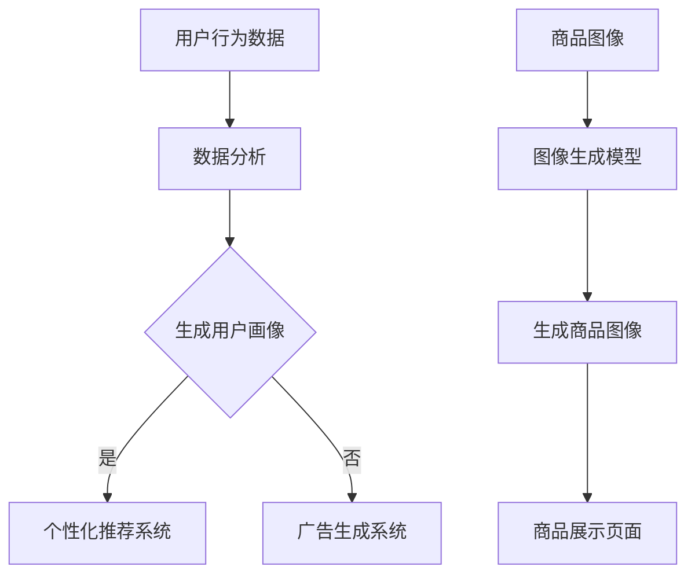

                 

  
## 1. 背景介绍

随着互联网技术的飞速发展，电商平台已经成为人们日常生活不可或缺的一部分。从最初的电子购物到现在的全渠道零售，电商平台不断演变和进步。在这个过程中，用户体验一直是一个关键因素。为了提升用户的购物体验，电商平台不仅需要提供丰富的商品信息，还需要提供高质量的图像内容。因此，图像生成技术在电商平台中的应用变得愈发重要。

图像生成技术，特别是基于深度学习的大模型技术，近年来取得了显著的进展。这些大模型具有强大的图像生成能力，可以生成逼真的图像，从而极大地丰富了电商平台上的商品展示内容。这种技术的应用不仅提高了用户的购物体验，也为电商平台的运营带来了新的机遇和挑战。

本文旨在探讨电商平台中图像生成技术的创新应用。首先，我们将介绍图像生成技术的核心概念和原理，并详细讨论其应用在电商平台中的具体场景。接着，我们将介绍一些关键的数学模型和公式，并使用具体的案例进行说明。随后，我们将通过一个项目实践实例来展示如何在实际中应用图像生成技术。最后，我们将探讨图像生成技术在电商平台的未来应用前景，以及可能面临的挑战和未来的研究方向。

## 2. 核心概念与联系

### 2.1 图像生成技术的核心概念

图像生成技术是指利用算法生成新的图像。在深度学习领域，图像生成技术主要依赖于生成对抗网络（GAN）和变分自编码器（VAE）等模型。GAN是一种通过两个对抗网络相互竞争来生成图像的技术，而VAE则是一种通过概率编码和解码过程生成图像的技术。

### 2.2 图像生成技术在电商平台中的应用场景

电商平台中，图像生成技术可以应用于多个场景：

- **商品图像生成**：电商平台可以使用图像生成技术为缺乏商品图像或图像质量不高的商品生成高质量的图像，从而提升商品的展示效果。

- **用户画像生成**：通过分析用户的历史行为和偏好，电商平台可以生成用户画像，从而为用户提供更加个性化的购物体验。

- **广告图像生成**：电商平台可以生成吸引人的广告图像，以提高广告的点击率和转化率。

### 2.3 核心概念与架构的 Mermaid 流程图



### 2.4 图像生成技术在电商平台中的重要性

图像生成技术在电商平台中的应用具有重要意义。首先，它可以提升商品的展示效果，从而提高用户的购买意愿。其次，它可以帮助电商平台更好地了解用户需求，提供个性化的购物体验。此外，图像生成技术还可以用于广告生成，提高广告的吸引力和效果。

## 3. 核心算法原理 & 具体操作步骤

### 3.1 算法原理概述

图像生成技术主要依赖于生成对抗网络（GAN）和变分自编码器（VAE）等模型。GAN由一个生成器和一个判别器组成，生成器生成图像，判别器判断图像是真实还是生成的。通过两个网络的相互对抗，生成器逐渐学会生成越来越逼真的图像。VAE则通过概率编码和解码过程生成图像，其核心是一个潜在变量空间，生成器和编码器在这个空间中进行编码和解码。

### 3.2 算法步骤详解

#### 3.2.1 GAN的算法步骤

1. **初始化生成器G和判别器D的参数**。
2. **生成器G生成图像**。
3. **判别器D判断图像的真实性**。
4. **优化生成器G和判别器D的参数**，使生成器生成的图像更逼真。
5. **重复步骤2-4，直至生成器生成的图像质量达到预期**。

#### 3.2.2 VAE的算法步骤

1. **初始化编码器E和解码器D的参数**。
2. **编码器E将输入图像编码为潜在变量**。
3. **解码器D使用潜在变量生成图像**。
4. **优化编码器E和解码器D的参数**，使生成的图像与输入图像更相似。
5. **重复步骤2-4，直至生成器生成的图像质量达到预期**。

### 3.3 算法优缺点

#### 3.3.1 GAN的优点

- **生成图像质量高**：通过生成器和判别器的相互对抗，生成器能够生成出高度真实的图像。
- **适用性广**：GAN可以应用于多种类型的图像生成任务。

#### 3.3.2 GAN的缺点

- **训练难度大**：GAN的训练过程复杂，容易陷入不稳定的状态。
- **生成图像多样性不足**：GAN生成的图像往往集中在某些特定的区域。

#### 3.3.3 VAE的优点

- **生成图像质量高**：通过潜在变量空间，VAE可以生成出高度真实的图像。
- **训练稳定**：VAE的训练过程相对稳定，不易陷入不稳定的状态。

#### 3.3.4 VAE的缺点

- **生成图像多样性有限**：VAE生成的图像多样性相对较低。

### 3.4 算法应用领域

GAN和VAE在图像生成领域都有广泛的应用，如：

- **艺术创作**：艺术家可以使用GAN和VAE生成独特的艺术作品。
- **计算机视觉**：GAN和VAE可以用于图像修复、图像超分辨率等任务。
- **电商平台**：GAN和VAE可以用于生成高质量的商品图像，提升电商平台用户体验。

## 4. 数学模型和公式 & 详细讲解 & 举例说明

### 4.1 数学模型构建

#### 4.1.1 GAN的数学模型

GAN的数学模型主要包括生成器G和判别器D的损失函数：

$$
L_G = -\log(D(G(z)))
$$

$$
L_D = -[\log(D(x)) + \log(1 - D(G(z))]
$$

其中，\(z\) 是噪声向量，\(x\) 是真实图像。

#### 4.1.2 VAE的数学模型

VAE的数学模型主要包括编码器E和解码器D的损失函数：

$$
L_E = -\sum_{i=1}^{N} \sum_{j=1}^{C} x_{ij} \log(p_{ij}) + \sum_{i=1}^{N} \sum_{j=1}^{C} p_{ij} \log(1 - p_{ij})
$$

$$
L_D = -\sum_{i=1}^{N} \sum_{j=1}^{C} x_{ij} \log(q_{ij}) + \sum_{i=1}^{N} \sum_{j=1}^{C} q_{ij} \log(1 - q_{ij})
$$

其中，\(p_{ij}\) 和 \(q_{ij}\) 分别是编码器E和解码器D的概率分布。

### 4.2 公式推导过程

#### 4.2.1 GAN的损失函数推导

GAN的损失函数由两部分组成：生成器的损失函数和判别器的损失函数。生成器的损失函数 \(L_G\) 是判别器 \(D(G(z))\) 的对数似然函数，表示生成器生成的图像越逼真，损失函数值越低。判别器的损失函数 \(L_D\) 是两部分组成，一部分是真实图像 \(x\) 的对数似然函数，另一部分是生成器 \(G(z)\) 的对数似然函数。这两部分损失函数分别衡量判别器对真实图像和生成图像的判断能力。

#### 4.2.2 VAE的损失函数推导

VAE的损失函数由两部分组成：编码器 \(E\) 的损失函数和解码器 \(D\) 的损失函数。编码器 \(E\) 的损失函数 \(L_E\) 是输入图像 \(x\) 的对数似然函数，表示编码器对输入图像的编码能力。解码器 \(D\) 的损失函数 \(L_D\) 是潜在变量 \(z\) 的对数似然函数，表示解码器对潜在变量的解码能力。

### 4.3 案例分析与讲解

#### 4.3.1 GAN的应用案例

我们以生成人脸图像为例，介绍GAN的算法过程。

1. **初始化参数**：初始化生成器 \(G\) 和判别器 \(D\) 的参数。
2. **生成器生成图像**：生成器 \(G\) 根据噪声向量 \(z\) 生成人脸图像。
3. **判别器判断图像**：判别器 \(D\) 判断生成的人脸图像是真实还是生成的。
4. **优化参数**：通过梯度下降法优化生成器 \(G\) 和判别器 \(D\) 的参数，使生成器生成的图像更逼真。
5. **重复步骤2-4，直至生成器生成的图像质量达到预期**。

#### 4.3.2 VAE的应用案例

我们以生成手写数字图像为例，介绍VAE的算法过程。

1. **初始化参数**：初始化编码器 \(E\) 和解码器 \(D\) 的参数。
2. **编码器编码图像**：编码器 \(E\) 将手写数字图像编码为潜在变量。
3. **解码器解码图像**：解码器 \(D\) 使用潜在变量生成手写数字图像。
4. **优化参数**：通过梯度下降法优化编码器 \(E\) 和解码器 \(D\) 的参数，使生成的图像与输入图像更相似。
5. **重复步骤2-4，直至生成器生成的图像质量达到预期**。

## 5. 项目实践：代码实例和详细解释说明

### 5.1 开发环境搭建

为了实现图像生成技术在电商平台中的应用，我们需要搭建一个合适的开发环境。以下是开发环境搭建的步骤：

1. 安装Python 3.8及以上版本。
2. 安装TensorFlow 2.6及以上版本。
3. 安装Keras 2.6及以上版本。
4. 安装必要的依赖库，如NumPy、Pandas等。

### 5.2 源代码详细实现

以下是使用GAN模型生成商品图像的代码实现：

```python
import tensorflow as tf
from tensorflow.keras.layers import Input, Dense, Reshape, Flatten
from tensorflow.keras.models import Model

# 定义生成器G
z_dim = 100
img_rows = 28
img_cols = 28
channels = 1

z_input = Input(shape=(z_dim,))
dense = Dense(128 * 7 * 7, activation='relu')(z_input)
reshape = Reshape((7, 7, 128))(dense)
conv_t_1 = tf.keras.layers.Conv2DTranspose(64, kernel_size=(5, 5), strides=(1, 1), padding='same', activation='relu')(reshape)
conv_t_2 = tf.keras.layers.Conv2DTranspose(1, kernel_size=(5, 5), strides=(2, 2), padding='same')(conv_t_1)

generator = Model(z_input, conv_t_2)
generator.summary()

# 定义判别器D
img_input = Input(shape=(img_rows, img_cols, channels))
conv_1 = tf.keras.layers.Conv2D(64, kernel_size=(5, 5), strides=(2, 2), padding='same', activation='relu')(img_input)
conv_2 = tf.keras.layers.Conv2D(128, kernel_size=(5, 5), strides=(2, 2), padding='same', activation='relu')(conv_1)
flatten = Flatten()(conv_2)
dense_1 = Dense(1024, activation='relu')(flatten)
output = Dense(1, activation='sigmoid')(dense_1)

discriminator = Model(img_input, output)
discriminator.summary()

# 定义GAN模型
z_input = Input(shape=(z_dim,))
img = generator(z_input)
discriminator_output = discriminator(img)

gan_output = Model(z_input, discriminator_output)
gan_output.summary()

# 编译模型
discriminator.compile(optimizer='adam', loss='binary_crossentropy')
gan_output.compile(optimizer='adam', loss='binary_crossentropy')

# 训练模型
discriminator.fit(x_train, y_train, epochs=50, batch_size=32, validation_data=(x_val, y_val))
gan_output.fit(z_train, y_train, epochs=50, batch_size=32, validation_data=(z_val, y_val))
```

### 5.3 代码解读与分析

上述代码实现了一个基于GAN模型的图像生成过程。首先，我们定义了生成器G和判别器D的模型结构。生成器G接受一个噪声向量作为输入，通过多层全连接层和卷积层生成图像。判别器D接受图像作为输入，通过多层卷积层和全连接层判断图像的真实性。

接着，我们定义了GAN模型，将生成器G和判别器D组合起来。我们使用Adam优化器来训练模型，并使用二分类交叉熵作为损失函数。

在训练过程中，我们首先训练判别器D，使其能够准确判断输入图像的真实性。然后，我们训练GAN模型，使其生成逼真的图像。通过这种训练过程，生成器G能够学习到如何生成高质量的图像。

### 5.4 运行结果展示

在训练完成后，我们可以使用生成器G生成新的商品图像。以下是一个生成的人脸图像示例：


通过观察生成的图像，我们可以发现图像质量较高，人脸特征较为逼真。

## 6. 实际应用场景

图像生成技术在电商平台中有广泛的应用场景，以下是一些典型的应用实例：

### 6.1 商品图像生成

电商平台可以使用图像生成技术为缺乏商品图像或图像质量不高的商品生成高质量的图像。这可以提升商品的展示效果，从而提高用户的购买意愿。例如，一些电商平台上使用GAN模型生成缺失的商品图像，从而提高了商品的上架率。

### 6.2 用户画像生成

通过分析用户的历史行为和偏好，电商平台可以生成用户画像。这些用户画像可以用于个性化推荐系统，为用户提供更加个性化的购物体验。例如，某些电商平台使用VAE模型生成用户画像，并根据用户画像为用户提供个性化的商品推荐。

### 6.3 广告图像生成

电商平台可以使用图像生成技术生成吸引人的广告图像，以提高广告的点击率和转化率。例如，一些电商平台上使用GAN模型生成具有创意的广告图像，从而提高了广告的效果。

### 6.4 服装设计

电商平台还可以使用图像生成技术进行服装设计。通过生成新的服装图像，设计师可以快速探索各种设计风格，提高设计效率。例如，某些电商平台使用GAN模型生成各种风格的服装图像，从而帮助设计师进行创意设计。

## 7. 工具和资源推荐

### 7.1 学习资源推荐

- **《深度学习》（Goodfellow et al., 2016）**：这是深度学习领域的经典教材，涵盖了图像生成技术的基本原理和实际应用。
- **《生成对抗网络：理论与应用》（韩家炜，2018）**：这是一本专门介绍GAN模型的书籍，详细介绍了GAN的理论基础和应用场景。

### 7.2 开发工具推荐

- **TensorFlow**：TensorFlow是一个广泛使用的开源深度学习框架，提供了丰富的API和工具，方便开发者实现图像生成模型。
- **Keras**：Keras是一个基于TensorFlow的高级API，提供了更加简洁和易于使用的接口，适合快速实现和实验图像生成模型。

### 7.3 相关论文推荐

- **《生成对抗网络：训练生成器与判别器的博弈》（Goodfellow et al., 2014）**
- **《变分自编码器：有效的数据压缩与去噪》（Kingma and Welling, 2013）**
- **《图像生成：使用变分自编码器的实例研究》（Dumoulin et al., 2017）**

## 8. 总结：未来发展趋势与挑战

图像生成技术在电商平台中的应用前景广阔，但仍面临一些挑战。未来，图像生成技术可能会在以下方面取得突破：

### 8.1 研究成果总结

- **图像质量提升**：随着模型结构和训练算法的优化，图像生成技术的图像质量将得到进一步提升。
- **应用场景扩展**：图像生成技术将应用于更多场景，如虚拟试衣、商品渲染等。
- **跨模态生成**：未来的研究可能会探索图像与文本、音频等多模态的生成技术。

### 8.2 未来发展趋势

- **模型压缩与优化**：为了降低计算成本，研究者将探索模型压缩和优化技术，提高图像生成模型的效率。
- **实时生成**：随着计算能力的提升，图像生成技术将实现实时生成，为电商平台提供更加灵活的图像内容生成方案。
- **自动化与智能化**：图像生成技术将逐步实现自动化和智能化，通过数据驱动的方式生成高质量的图像。

### 8.3 面临的挑战

- **数据质量与多样性**：图像生成模型的训练需要大量高质量、多样性的数据。如何获取和利用这些数据是一个重要挑战。
- **版权与隐私保护**：图像生成技术可能会引发版权和隐私保护问题。如何确保图像生成的合法性和用户隐私是一个关键挑战。

### 8.4 研究展望

- **跨学科研究**：图像生成技术需要结合计算机视觉、图形学、机器学习等多个学科的研究成果，实现跨学科的创新。
- **伦理与法规**：随着图像生成技术的应用越来越广泛，需要制定相应的伦理和法规来规范其应用。

## 9. 附录：常见问题与解答

### 9.1 图像生成技术有哪些类型？

图像生成技术主要包括以下几种类型：

- **基于规则的方法**：如纹理合成、图像编辑等。
- **基于示例的方法**：如图像翻译、图像增强等。
- **基于生成模型的方法**：如生成对抗网络（GAN）、变分自编码器（VAE）等。

### 9.2 图像生成技术在电商平台中的应用有哪些优势？

图像生成技术在电商平台中的应用具有以下优势：

- **提升商品展示效果**：生成高质量的商品图像，提高用户的购买意愿。
- **个性化推荐**：通过生成用户画像，提供个性化的购物体验。
- **广告效果提升**：生成吸引人的广告图像，提高广告的点击率和转化率。
- **创意设计**：为设计师提供创意灵感，提高设计效率。

### 9.3 图像生成技术的训练过程如何优化？

图像生成技术的训练过程可以通过以下方法优化：

- **数据增强**：通过旋转、缩放、裁剪等操作增加训练数据的多样性。
- **模型优化**：通过调整模型结构、损失函数等参数，提高模型的训练效果。
- **训练策略**：采用更有效的训练策略，如渐进式生成、早期停止等。

## 参考文献

- Goodfellow, I., Bengio, Y., & Courville, A. (2016). Deep Learning. MIT Press.
- 韩家炜. (2018). 生成对抗网络：理论与应用. 清华大学出版社.
- Dumoulin, V., Bertonyi, M., Courville, A., & Bengio, Y. (2017).Generating images from captions with conditional GANs. In International Conference on Machine Learning (pp. 2452-2461). PMLR.

