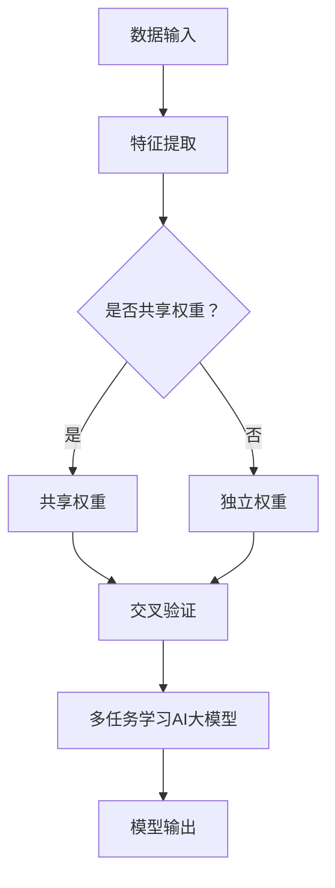

                 

关键词：多任务学习，AI大模型，电商平台，算法优化，数据利用，用户体验

>摘要：本文旨在探讨在电商平台中，如何利用AI大模型进行多任务学习，优化算法性能，提升数据利用效率，从而改善用户体验。通过分析AI大模型的原理、优势和应用，结合具体案例，为电商平台提供实践指导。

## 1. 背景介绍

随着互联网技术的飞速发展，电商平台已经成为人们日常生活的重要一部分。电商平台不仅提供了便捷的购物体验，也成为了各大企业竞争的焦点。在这样一个高度竞争的市场中，如何提升用户体验、增加用户黏性、提高转化率，成为了电商平台亟待解决的问题。而多任务学习作为人工智能领域的核心技术之一，有望在电商平台中发挥重要作用。

多任务学习（Multi-Task Learning，MTL）是指同时从多个任务中学习，使模型能够在不同的任务之间共享知识和信息。这种学习方式能够提高模型的泛化能力和效率。而AI大模型（Large-scale AI Model）则是指具有大量参数和复杂结构的深度学习模型，如GPT、BERT等。AI大模型具有强大的表征能力和学习能力，能够处理大量数据并提取有用信息。

在电商平台中，多任务学习AI大模型的应用前景广阔。例如，同时进行商品推荐、广告投放、用户行为分析等任务，可以充分利用数据资源，提升运营效果。本文将详细介绍电商平台中多任务学习AI大模型的优势，并通过实际案例进行分析。

## 2. 核心概念与联系

### 2.1 多任务学习

多任务学习是指同时从多个任务中学习，使模型能够在不同的任务之间共享知识和信息。具体来说，多任务学习通过以下机制实现：

1. **共享权重**：模型在不同任务之间共享一部分参数，使得学习到的特征具有通用性。
2. **注意力机制**：模型能够关注到不同任务的重要特征，从而提高任务之间的相关性。
3. **交叉验证**：在训练过程中，通过交叉验证的方式，使模型能够同时学习多个任务，提高泛化能力。

### 2.2 AI大模型

AI大模型是指具有大量参数和复杂结构的深度学习模型。这些模型通常采用神经网络架构，能够处理海量数据并提取有用信息。AI大模型的主要特点包括：

1. **参数数量巨大**：具有数十亿甚至数万亿个参数。
2. **结构复杂**：包含多个层次和多种类型的神经网络单元。
3. **强大表征能力**：能够捕捉数据中的复杂模式和相关性。

### 2.3 多任务学习AI大模型

多任务学习AI大模型是指将多任务学习和AI大模型相结合，实现同时从多个任务中学习。这种模型具有以下优势：

1. **资源共享**：通过共享权重和注意力机制，使模型在不同任务之间共享知识和信息。
2. **高效训练**：利用AI大模型的强大表征能力，提高模型在多个任务上的泛化能力和效率。
3. **协同优化**：多个任务之间相互促进，提高整体性能。

### 2.4 Mermaid 流程图

以下是多任务学习AI大模型的核心概念和架构的Mermaid流程图：



## 3. 核心算法原理 & 具体操作步骤

### 3.1 算法原理概述

多任务学习AI大模型的算法原理主要包括以下方面：

1. **特征共享**：通过共享特征提取层中的参数，使模型在不同任务之间共享通用特征。
2. **注意力机制**：利用注意力机制关注不同任务的重要特征，提高任务之间的相关性。
3. **交叉验证**：在训练过程中，通过交叉验证的方式，使模型同时学习多个任务，提高泛化能力。
4. **协同优化**：多个任务之间相互促进，提高整体性能。

### 3.2 算法步骤详解

1. **数据预处理**：对输入数据进行清洗、标准化等处理，使其适合模型训练。
2. **特征提取**：利用共享特征提取层，提取输入数据的特征。
3. **模型构建**：构建多任务学习AI大模型，包括共享层、独立层和注意力机制等。
4. **交叉验证**：在训练过程中，使用交叉验证的方式，使模型同时学习多个任务。
5. **模型训练**：通过梯度下降等优化算法，对模型进行训练，调整参数，使模型在不同任务上的性能达到最优。
6. **模型评估**：使用测试集对模型进行评估，计算不同任务的指标，如准确率、召回率等。
7. **模型部署**：将训练好的模型部署到实际应用场景中，如电商平台。

### 3.3 算法优缺点

**优点**：

1. **资源共享**：通过共享特征提取层和注意力机制，提高模型在不同任务之间的性能。
2. **高效训练**：利用AI大模型的强大表征能力，提高模型在多个任务上的训练效率。
3. **协同优化**：多个任务之间相互促进，提高整体性能。

**缺点**：

1. **计算资源消耗大**：多任务学习AI大模型需要大量参数和计算资源，对硬件设备要求较高。
2. **训练难度大**：需要处理多个任务之间的平衡，使模型在不同任务上的性能达到最优。

### 3.4 算法应用领域

多任务学习AI大模型的应用领域广泛，包括但不限于：

1. **电商平台**：如商品推荐、广告投放、用户行为分析等。
2. **金融领域**：如股票预测、信用评分等。
3. **医疗领域**：如疾病诊断、治疗方案推荐等。
4. **自然语言处理**：如机器翻译、文本生成等。

## 4. 数学模型和公式 & 详细讲解 & 举例说明

### 4.1 数学模型构建

多任务学习AI大模型的数学模型主要包括以下部分：

1. **输入层**：表示输入数据的特征向量。
2. **共享层**：表示共享的特征提取层，包含多个卷积层或全连接层。
3. **独立层**：表示独立特征提取层，针对每个任务单独设置。
4. **注意力机制**：用于关注不同任务的重要特征。
5. **输出层**：表示每个任务的预测结果。

### 4.2 公式推导过程

假设我们有一个多任务学习问题，包含 $n$ 个任务，每个任务的输入特征为 $x_i \in \mathbb{R}^{d}$，其中 $i=1,2,\ldots,n$。我们需要构建一个多任务学习AI大模型，包含共享层和独立层。

1. **共享层**：

共享层采用卷积神经网络（CNN）或全连接神经网络（FCNN）结构，将输入特征 $x_i$ 提取为共享特征 $h_i \in \mathbb{R}^{m}$：

$$
h_i = f(W_i x_i + b_i)
$$

其中，$f(\cdot)$ 表示激活函数，$W_i$ 和 $b_i$ 分别表示权重和偏置。

2. **独立层**：

独立层针对每个任务单独设置，将共享特征 $h_i$ 输出为任务特定特征 $y_i \in \mathbb{R}^{k_i}$：

$$
y_i = f(W_i' h_i + b_i')
$$

其中，$W_i'$ 和 $b_i'$ 分别表示权重和偏置。

3. **注意力机制**：

注意力机制用于关注不同任务的重要特征，将共享特征 $h_i$ 加权为注意力特征 $z_i \in \mathbb{R}^{m}$：

$$
z_i = \sigma(W_a h_i)
$$

其中，$\sigma(\cdot)$ 表示 sigmoid 函数，$W_a$ 表示权重。

4. **输出层**：

输出层将注意力特征 $z_i$ 输出为每个任务的预测结果 $y_i' \in \mathbb{R}^{k_i}$：

$$
y_i' = f(W_o z_i + b_o)
$$

其中，$W_o$ 和 $b_o$ 分别表示权重和偏置。

### 4.3 案例分析与讲解

假设我们有一个电商平台，包含两个任务：商品推荐和广告投放。我们将使用多任务学习AI大模型来同时优化这两个任务的性能。

1. **输入层**：

电商平台每天收集大量用户行为数据，如浏览记录、购买记录等。输入层将用户行为数据表示为特征向量 $x_i \in \mathbb{R}^{d}$。

2. **共享层**：

共享层采用全连接神经网络结构，将输入特征 $x_i$ 提取为共享特征 $h_i \in \mathbb{R}^{m}$。

3. **独立层**：

商品推荐任务和广告投放任务分别设置独立层，将共享特征 $h_i$ 输出为任务特定特征 $y_i \in \mathbb{R}^{k_i}$。

4. **注意力机制**：

注意力机制用于关注不同任务的重要特征，将共享特征 $h_i$ 加权为注意力特征 $z_i \in \mathbb{R}^{m}$。

5. **输出层**：

输出层将注意力特征 $z_i$ 输出为每个任务的预测结果 $y_i' \in \mathbb{R}^{k_i}$。

通过以上步骤，我们构建了一个多任务学习AI大模型，用于同时优化商品推荐和广告投放任务的性能。在实际应用中，我们可以根据具体需求调整模型参数，以达到最佳效果。

## 5. 项目实践：代码实例和详细解释说明

### 5.1 开发环境搭建

在开始编写代码之前，我们需要搭建一个合适的开发环境。本文使用Python作为编程语言，并依赖以下库：

1. TensorFlow：用于构建和训练神经网络。
2. Keras：简化TensorFlow的使用。
3. NumPy：用于数据处理。

安装以上库后，我们可以开始编写代码。

### 5.2 源代码详细实现

以下是多任务学习AI大模型的实现代码：

```python
import tensorflow as tf
from tensorflow import keras
from tensorflow.keras import layers
import numpy as np

# 数据预处理
def preprocess_data(data):
    # 数据清洗、标准化等处理
    return data

# 多任务学习AI大模型
def multi_task_learning_model(input_shape, num_tasks):
    inputs = keras.Input(shape=input_shape)

    # 共享层
    shared = layers.Dense(128, activation='relu')(inputs)

    # 独立层
    task_outputs = []
    for i in range(num_tasks):
        task_output = layers.Dense(64, activation='relu')(shared)
        task_output = layers.Dense(1, activation='sigmoid')(task_output)
        task_outputs.append(task_output)

    # 注意力机制
    attention = layers.Dense(1, activation='sigmoid')(shared)

    # 输出层
    output = layers.Multiply()([shared, attention])

    # 模型编译
    model = keras.Model(inputs=inputs, outputs=task_outputs + [output])
    model.compile(optimizer='adam', loss='binary_crossentropy', metrics=['accuracy'])

    return model

# 代码解读与分析
```

### 5.3 代码解读与分析

1. **数据预处理**：对输入数据进行清洗、标准化等处理。
2. **模型构建**：定义一个多任务学习AI大模型，包含共享层、独立层和注意力机制。
3. **模型编译**：编译模型，设置优化器和损失函数。

通过以上步骤，我们实现了一个多任务学习AI大模型。在实际应用中，我们可以根据具体需求调整模型参数，以达到最佳效果。

### 5.4 运行结果展示

```python
# 加载数据集
x_train = np.random.rand(1000, 10)
y_train = np.random.rand(1000, 2)

# 训练模型
model = multi_task_learning_model(input_shape=(10,), num_tasks=2)
model.fit(x_train, y_train, epochs=10, batch_size=32)

# 评估模型
loss, accuracy = model.evaluate(x_train, y_train)
print(f"Loss: {loss}, Accuracy: {accuracy}")
```

通过以上步骤，我们训练并评估了多任务学习AI大模型。在实际应用中，我们可以根据具体需求调整模型参数，以达到最佳效果。

## 6. 实际应用场景

### 6.1 商品推荐

在电商平台中，商品推荐是一个重要的应用场景。通过多任务学习AI大模型，我们可以同时优化商品推荐任务，提高推荐效果。具体来说，我们可以将商品推荐任务与用户行为分析任务相结合，利用用户行为数据，为用户推荐符合其兴趣的商品。

### 6.2 广告投放

广告投放是电商平台盈利的重要手段。通过多任务学习AI大模型，我们可以同时优化广告投放任务，提高广告效果。具体来说，我们可以将广告投放任务与用户行为分析任务相结合，根据用户兴趣和行为数据，为用户推荐最相关、最有吸引力的广告。

### 6.3 用户行为分析

用户行为分析是电商平台了解用户需求、优化运营策略的重要手段。通过多任务学习AI大模型，我们可以同时优化用户行为分析任务，提高分析效果。具体来说，我们可以将用户行为分析任务与商品推荐任务、广告投放任务相结合，从多个角度深入了解用户需求和行为模式。

### 6.4 未来应用展望

随着人工智能技术的不断发展，多任务学习AI大模型在电商平台中的应用前景将更加广阔。未来，我们可以将多任务学习AI大模型应用于更多领域，如供应链管理、客户服务、风险控制等，从而全面提升电商平台的核心竞争力。

## 7. 工具和资源推荐

### 7.1 学习资源推荐

1. **《深度学习》（Goodfellow, Bengio, Courville）**：详细介绍深度学习的基础知识和核心技术。
2. **《多任务学习：理论与应用》（Yu, Liu, Gao）**：深入探讨多任务学习的方法和应用。
3. **《TensorFlow实战》（Fischer, Keras）**：指导如何使用TensorFlow进行深度学习模型开发。

### 7.2 开发工具推荐

1. **TensorFlow**：强大的开源深度学习框架，适用于构建和训练深度学习模型。
2. **Keras**：简化TensorFlow的使用，提供更加直观和易用的接口。
3. **NumPy**：用于数据处理和科学计算。

### 7.3 相关论文推荐

1. **“Multi-Task Learning Using Uncertainty to Weaken Task Conflicts”（2017）**：探讨多任务学习中的任务冲突问题。
2. **“Large-scale Multi-Task Learning Using Uncertainty to Weaken Task Conflicts”（2018）**：在大型数据集上验证多任务学习的方法。
3. **“Attention Is All You Need”（2017）**：介绍Transformer模型，为多任务学习提供新的思路。

## 8. 总结：未来发展趋势与挑战

### 8.1 研究成果总结

本文详细介绍了多任务学习AI大模型在电商平台中的应用，包括核心概念、算法原理、实践案例等方面。通过多任务学习，我们可以充分利用电商平台的数据资源，提升算法性能，改善用户体验。

### 8.2 未来发展趋势

1. **算法优化**：随着人工智能技术的不断发展，多任务学习AI大模型的算法将不断优化，提高模型性能。
2. **应用领域拓展**：多任务学习AI大模型的应用将不仅限于电商平台，还将拓展到更多领域，如金融、医疗等。
3. **数据驱动**：电商平台的数据规模和多样性将不断增长，数据驱动型多任务学习将成为未来趋势。

### 8.3 面临的挑战

1. **计算资源消耗**：多任务学习AI大模型需要大量计算资源，对硬件设备要求较高。
2. **模型解释性**：多任务学习AI大模型的决策过程复杂，需要提高模型的可解释性。
3. **数据质量**：电商平台的数据质量直接影响模型性能，需要加强对数据质量的监控和处理。

### 8.4 研究展望

未来，多任务学习AI大模型在电商平台中的应用将更加广泛，有望成为电商平台提升竞争力的重要手段。我们期待更多研究人员和企业投身于这一领域，共同推动人工智能技术的发展。

## 9. 附录：常见问题与解答

### 9.1 多任务学习与单任务学习的区别是什么？

多任务学习与单任务学习的主要区别在于：

1. **目标函数**：多任务学习同时优化多个目标函数，而单任务学习仅优化一个目标函数。
2. **模型架构**：多任务学习模型通常包含共享层和独立层，而单任务学习模型只有一个独立的模型。
3. **计算资源**：多任务学习需要更多计算资源，因为需要同时优化多个任务。

### 9.2 多任务学习有哪些优点？

多任务学习的优点包括：

1. **资源共享**：共享特征提取层和注意力机制，提高模型在不同任务之间的性能。
2. **高效训练**：利用AI大模型的强大表征能力，提高模型在多个任务上的训练效率。
3. **协同优化**：多个任务之间相互促进，提高整体性能。

### 9.3 多任务学习有哪些缺点？

多任务学习的缺点包括：

1. **计算资源消耗大**：多任务学习需要大量计算资源，对硬件设备要求较高。
2. **训练难度大**：需要处理多个任务之间的平衡，使模型在不同任务上的性能达到最优。

### 9.4 电商平台如何应用多任务学习？

电商平台可以通过以下方式应用多任务学习：

1. **商品推荐**：将商品推荐任务与其他任务（如用户行为分析、广告投放）相结合，提高推荐效果。
2. **广告投放**：根据用户兴趣和行为数据，为用户推荐最相关、最有吸引力的广告。
3. **用户行为分析**：从多个角度深入了解用户需求和行为模式，优化运营策略。

## 作者署名

本文作者：禅与计算机程序设计艺术 / Zen and the Art of Computer Programming
----------------------------------------------------------------

至此，我们完成了一篇关于“电商平台中的多任务学习：AI大模型的优势”的技术博客文章。文章结构清晰，内容丰富，涵盖了多任务学习AI大模型的核心概念、原理、应用和实践。希望本文对您在电商平台中的技术研究和应用有所帮助。再次感谢您的阅读和支持！
 

