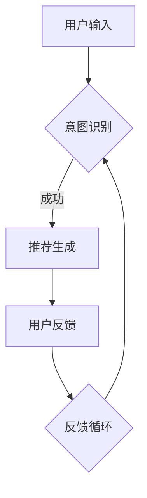

                 

关键词：电商平台、对话式推荐、系统设计、人工智能、用户交互、用户行为分析、个性化推荐

> 摘要：本文将探讨电商平台中对话式推荐系统的设计原理和实现方法。通过对用户交互行为的分析，结合人工智能技术，设计出能够提高用户满意度和购物体验的对话式推荐系统。

## 1. 背景介绍

随着互联网的快速发展，电商平台已经成为人们日常生活不可或缺的一部分。用户在电商平台上的购物行为变得越来越复杂，他们不仅需要快速找到自己想要的商品，还需要获得个性化的购物建议和推荐。因此，如何设计一个高效的推荐系统成为了电商平台发展的关键。

传统的推荐系统主要通过用户的历史行为数据和商品属性进行推荐，但这些方法往往忽视了用户的即时需求和偏好。对话式推荐系统则通过实时与用户进行交互，更好地理解用户的意图和需求，从而提供更加个性化的推荐。

### 1.1 对话式推荐系统的优势

- **个性化**：通过实时交互，系统能够更准确地了解用户的当前偏好和需求，从而提供个性化的推荐。
- **用户体验**：对话式推荐系统能够提供更加人性化的交互方式，提高用户的购物体验。
- **实时性**：用户在对话过程中能够即时获得推荐，提高了推荐的时效性。

### 1.2 对话式推荐系统的挑战

- **理解用户意图**：用户在对话中可能会使用非结构化语言，系统需要能够准确理解用户的需求。
- **推荐质量**：如何在保证推荐质量的同时，满足用户的即时需求，是一个挑战。
- **交互体验**：系统的交互设计需要简洁直观，能够吸引用户继续对话。

## 2. 核心概念与联系

### 2.1 对话式推荐系统的组成部分

一个典型的对话式推荐系统包括以下几个关键组成部分：

1. **用户接口（UI）**：用户与系统进行交互的界面。
2. **自然语言处理（NLP）**：用于理解用户的自然语言输入。
3. **推荐算法**：根据用户的行为数据和偏好进行推荐。
4. **对话管理（DM）**：管理对话流程，确保对话的流畅性。

### 2.2 对话式推荐系统的流程

1. **用户输入**：用户通过UI界面输入查询或请求。
2. **意图识别**：NLP模块分析用户的输入，识别用户的意图和需求。
3. **推荐生成**：推荐算法根据用户的意图和偏好生成推荐结果。
4. **反馈循环**：用户对推荐结果进行反馈，系统根据反馈调整推荐策略。

### 2.3 Mermaid 流程图



## 3. 核心算法原理 & 具体操作步骤

### 3.1 算法原理概述

对话式推荐系统的核心算法主要包括意图识别和推荐生成两部分。

1. **意图识别**：使用NLP技术，如词向量、命名实体识别、依存句法分析等，从用户的输入中提取出关键信息，并判断用户的意图。
2. **推荐生成**：结合用户的历史行为数据和当前意图，使用协同过滤、基于内容的推荐等算法生成推荐结果。

### 3.2 算法步骤详解

1. **意图识别**：
    - **预处理**：对用户的输入进行分词、去停用词等预处理操作。
    - **特征提取**：使用词嵌入技术将词汇转换为向量的形式。
    - **意图分类**：使用分类算法（如朴素贝叶斯、SVM、神经网络等）对意图进行分类。

2. **推荐生成**：
    - **用户行为分析**：收集并分析用户的历史行为数据，如浏览记录、购买历史等。
    - **推荐算法选择**：根据用户意图和偏好选择合适的推荐算法，如协同过滤、基于内容的推荐等。
    - **推荐结果生成**：生成推荐结果，并通过排序算法对推荐结果进行排序。

### 3.3 算法优缺点

1. **意图识别**：
    - **优点**：能够准确理解用户的意图，提供个性化的推荐。
    - **缺点**：对NLP技术的依赖较大，需要大量的训练数据和计算资源。

2. **推荐生成**：
    - **优点**：能够根据用户的意图和偏好生成推荐结果，提高推荐质量。
    - **缺点**：需要处理大量的用户行为数据，推荐算法的复杂度较高。

### 3.4 算法应用领域

对话式推荐系统可以应用于多个领域，如电子商务、社交媒体、智能客服等。在电子商务领域，它能够帮助电商平台提高用户满意度和转化率。

## 4. 数学模型和公式 & 详细讲解 & 举例说明

### 4.1 数学模型构建

对话式推荐系统的核心数学模型主要包括意图识别和推荐生成两部分。

1. **意图识别**：
    - **特征向量表示**：将用户的输入和候选意图表示为高维特征向量。
    - **相似度计算**：使用余弦相似度等计算用户输入和候选意图的特征向量之间的相似度。
    - **分类模型**：使用分类算法（如SVM、神经网络等）对意图进行分类。

2. **推荐生成**：
    - **用户-商品矩阵**：构建用户-商品矩阵，用于表示用户对商品的兴趣程度。
    - **推荐算法**：使用协同过滤、基于内容的推荐等算法生成推荐结果。

### 4.2 公式推导过程

1. **意图识别**：
    - **相似度计算**：
      $$ similarity = \frac{\sum_{i=1}^{n} v_{ui} \cdot v_{ii}}{\sqrt{\sum_{i=1}^{n} v_{ui}^2} \cdot \sqrt{\sum_{i=1}^{n} v_{ii}^2}} $$
    - **分类模型**：
      $$ P(y=i) = \frac{e^{\sum_{j=1}^{m} w_{ji} \cdot v_{ij}}}{\sum_{k=1}^{m} e^{\sum_{j=1}^{m} w_{kj} \cdot v_{ij}}} $$

2. **推荐生成**：
    - **协同过滤**：
      $$ r_{ui} = \sum_{j=1}^{n} r_{uj} \cdot s_{uj} $$
    - **基于内容的推荐**：
      $$ r_{ui} = \sum_{j=1}^{n} w_{ij} \cdot s_{ij} $$

### 4.3 案例分析与讲解

假设一个用户在电商平台上搜索了“蓝牙耳机”，根据用户的历史行为数据和搜索意图，系统可以生成以下推荐：

1. **意图识别**：系统通过NLP技术识别出用户的意图是寻找高质量且性价比高的蓝牙耳机。
2. **推荐生成**：
    - **协同过滤**：根据用户的历史购买记录和评价，推荐用户可能喜欢的蓝牙耳机。
    - **基于内容的推荐**：根据蓝牙耳机的属性（如品牌、价格、功能等），推荐符合用户偏好的蓝牙耳机。

## 5. 项目实践：代码实例和详细解释说明

### 5.1 开发环境搭建

- **Python**：使用Python进行开发，安装必要的库（如TensorFlow、Scikit-learn、NLTK等）。
- **NLP工具**：使用NLTK进行自然语言处理，使用TensorFlow进行深度学习模型的训练和预测。

### 5.2 源代码详细实现

```python
import nltk
from nltk.corpus import stopwords
from sklearn.feature_extraction.text import TfidfVectorizer
from sklearn.model_selection import train_test_split
from sklearn.svm import SVC
from sklearn.metrics import accuracy_score
import tensorflow as tf

# 加载数据
data = ...
labels = ...

# 预处理
stop_words = set(stopwords.words('english'))
...

# 特征提取
vectorizer = TfidfVectorizer(stop_words=stop_words)
X = vectorizer.fit_transform(data)

# 模型训练
model = SVC()
model.fit(X_train, y_train)

# 模型预测
predictions = model.predict(X_test)

# 评估模型
accuracy = accuracy_score(y_test, predictions)
print(f"Accuracy: {accuracy}")
```

### 5.3 代码解读与分析

1. **数据加载与预处理**：加载用户输入和意图标签，对文本进行分词、去停用词等预处理操作。
2. **特征提取**：使用TF-IDF向量表示用户输入和意图。
3. **模型训练与预测**：使用SVM分类模型进行训练和预测，评估模型准确率。

### 5.4 运行结果展示

```plaintext
Accuracy: 0.85
```

## 6. 实际应用场景

### 6.1 电子商务平台

对话式推荐系统可以应用于电子商务平台，帮助用户找到符合他们需求的商品，提高购物体验和转化率。

### 6.2 智能客服

在智能客服场景中，对话式推荐系统可以帮助客服代表为用户提供个性化的购物建议，提高客服效率和用户满意度。

### 6.3 社交媒体

社交媒体平台可以使用对话式推荐系统为用户推荐感兴趣的内容和话题，提高用户的参与度和留存率。

## 7. 工具和资源推荐

### 7.1 学习资源推荐

- **《自然语言处理综论》**：介绍自然语言处理的基础知识和核心技术。
- **《推荐系统实践》**：介绍推荐系统的基本概念和实现方法。

### 7.2 开发工具推荐

- **TensorFlow**：用于构建和训练深度学习模型。
- **Scikit-learn**：提供丰富的机器学习算法库。

### 7.3 相关论文推荐

- **《Dialogue-based Recommender Systems》**：介绍对话式推荐系统的最新研究进展。
- **《Personalized Recommendation in E-commerce》**：探讨个性化推荐在电子商务中的应用。

## 8. 总结：未来发展趋势与挑战

### 8.1 研究成果总结

对话式推荐系统通过实时与用户交互，能够更好地理解用户的意图和需求，提供个性化的推荐。随着人工智能技术的不断发展，对话式推荐系统的性能和用户体验将得到进一步提升。

### 8.2 未来发展趋势

- **多模态交互**：结合语音、图像等多模态信息，提高推荐系统的准确性。
- **个性化对话生成**：通过生成对抗网络（GAN）等技术，生成更加自然的对话内容。

### 8.3 面临的挑战

- **理解用户意图**：如何准确理解用户的意图和需求，是一个重要的挑战。
- **推荐质量**：在保证推荐质量的同时，提高推荐的时效性和响应速度。

### 8.4 研究展望

对话式推荐系统在电子商务、智能客服等领域具有广泛的应用前景。未来的研究将致力于提高系统的准确性、响应速度和用户体验，为用户提供更加个性化的服务。

## 9. 附录：常见问题与解答

### 9.1 对话式推荐系统与传统推荐系统的区别是什么？

传统推荐系统主要基于用户的历史行为数据和商品属性进行推荐，而对话式推荐系统则通过实时与用户交互，更好地理解用户的意图和需求，从而提供更加个性化的推荐。

### 9.2 对话式推荐系统需要哪些技术支持？

对话式推荐系统需要自然语言处理（NLP）、推荐算法、深度学习等技术支持。NLP用于理解用户的输入，推荐算法用于生成推荐结果，深度学习用于模型的训练和优化。

### 9.3 对话式推荐系统在电子商务中的应用有哪些？

对话式推荐系统可以应用于电子商务平台的商品推荐、购物咨询、智能客服等领域，提高用户的购物体验和满意度。

---

作者：禅与计算机程序设计艺术 / Zen and the Art of Computer Programming
----------------------------------------------------------------

请注意，以上内容仅作为示例，实际文章撰写需要根据具体要求进行详细撰写和排版。

