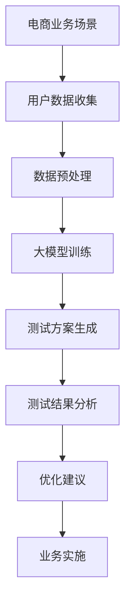

                 

关键词：电商平台，自动化A/B测试，大模型，数据分析，用户体验，性能优化

摘要：随着电商平台的不断发展，优化用户体验和提升性能已成为核心任务。本文将探讨自动化A/B测试在电商平台中的应用，以及如何利用大模型进行结果分析，为电商平台提供高效的优化方案。

## 1. 背景介绍

### 1.1 电商平台的现状

电商平台作为现代商业的重要组成部分，近年来得到了迅速发展。随着互联网技术的不断进步，电商平台的竞争也越来越激烈。为了在竞争中脱颖而出，电商平台必须不断优化用户体验和提升系统性能。

### 1.2 A/B测试的作用

A/B测试作为一种科学的优化手段，可以帮助电商平台在做出重大决策前，通过对不同方案的实验验证，降低风险并找到最佳解决方案。然而，传统的A/B测试方法存在测试周期长、结果不可预测等问题，无法满足电商平台快速迭代的需求。

### 1.3 大模型的优势

随着深度学习技术的发展，大模型在图像识别、自然语言处理等领域取得了显著成果。大模型具备强大的数据处理能力和自我学习能力，能够高效地分析大量数据，为电商平台提供精准的优化建议。

## 2. 核心概念与联系

### 2.1 自动化A/B测试

自动化A/B测试是指通过自动化工具对不同的用户体验方案进行测试，以快速、高效地评估不同方案的优劣。自动化A/B测试能够提高测试效率，缩短测试周期，降低人力成本。

### 2.2 大模型在A/B测试中的应用

大模型在自动化A/B测试中发挥着重要作用。通过大模型，电商平台可以快速处理和分析大量用户数据，发现潜在的用户行为规律和偏好，为优化用户体验提供有力支持。

### 2.3 Mermaid流程图



## 3. 核心算法原理 & 具体操作步骤

### 3.1 算法原理概述

自动化A/B测试算法主要包括数据收集、数据预处理、大模型训练、测试方案生成、测试结果分析和优化建议生成等步骤。通过这些步骤，电商平台可以快速发现并实施最佳优化方案。

### 3.2 算法步骤详解

#### 3.2.1 数据收集

数据收集是自动化A/B测试的第一步。电商平台需要收集与用户体验相关的数据，如用户行为数据、页面访问数据、订单数据等。

#### 3.2.2 数据预处理

数据预处理包括数据清洗、数据归一化和特征提取等步骤。通过预处理，可以保证数据的准确性和一致性，为后续的大模型训练提供高质量的数据。

#### 3.2.3 大模型训练

大模型训练是基于收集到的用户数据，通过深度学习算法对大模型进行训练，使其具备对用户行为进行预测和识别的能力。

#### 3.2.4 测试方案生成

测试方案生成是指根据大模型训练结果，生成一组具有差异化的用户体验方案。这些方案将用于后续的A/B测试。

#### 3.2.5 测试结果分析

测试结果分析是对A/B测试中不同方案的用户体验进行评估，通过对比分析，确定最佳优化方案。

#### 3.2.6 优化建议生成

优化建议生成是基于测试结果分析，为电商平台提供具体的优化建议，如页面布局调整、功能优化等。

### 3.3 算法优缺点

#### 优点：

1. 提高测试效率，缩短测试周期。
2. 降低人力成本，实现自动化测试。
3. 利用大模型的优势，提供精准的优化建议。

#### 缺点：

1. 需要大量的数据支持，对数据质量和数量要求较高。
2. 大模型训练和优化过程较为复杂，对技术要求较高。

### 3.4 算法应用领域

自动化A/B测试算法在电商平台具有广泛的应用领域，如：

1. 页面布局优化
2. 功能优化
3. 广告投放策略优化
4. 商品推荐系统优化

## 4. 数学模型和公式 & 详细讲解 & 举例说明

### 4.1 数学模型构建

自动化A/B测试算法的核心在于大模型训练和测试结果分析。下面介绍相关的数学模型和公式。

#### 4.1.1 大模型训练

大模型训练主要使用深度学习算法，其中常用的算法包括：

1. 卷积神经网络（CNN）
2. 递归神经网络（RNN）
3. 生成对抗网络（GAN）

每种算法都有其独特的数学模型和公式，下面以CNN为例进行介绍。

#### 4.1.2 测试结果分析

测试结果分析主要涉及两个指标：点击率（CTR）和转化率（CVR）。

点击率（CTR）计算公式为：

$$ CTR = \frac{点击次数}{展示次数} $$

转化率（CVR）计算公式为：

$$ CVR = \frac{转化次数}{点击次数} $$

### 4.2 公式推导过程

下面以CNN为例，介绍大模型训练的公式推导过程。

#### 4.2.1 卷积层

卷积层的输入为$(x_1, x_2, ..., x_n)$，输出为$y_1, y_2, ..., y_n$。卷积层的公式为：

$$ y_i = f(w^T \cdot x_i + b) $$

其中，$f$为激活函数，$w$为卷积核，$b$为偏置项。

#### 4.2.2 池化层

池化层的输入为$y_1, y_2, ..., y_n$，输出为$z_1, z_2, ..., z_n$。池化层的公式为：

$$ z_i = \max(y_{i_1}, y_{i_2}, ..., y_{i_k}) $$

其中，$i_1, i_2, ..., i_k$为输入的索引。

#### 4.2.3 全连接层

全连接层的输入为$z_1, z_2, ..., z_n$，输出为$y_1, y_2, ..., y_n$。全连接层的公式为：

$$ y_i = f(w^T \cdot z_i + b) $$

其中，$f$为激活函数，$w$为权重，$b$为偏置项。

### 4.3 案例分析与讲解

下面通过一个实际案例，介绍如何使用自动化A/B测试算法优化电商平台页面布局。

#### 案例背景

某电商平台希望通过优化首页布局，提高用户的点击率和转化率。

#### 案例步骤

1. 数据收集：收集用户在电商平台的行为数据，如页面访问次数、点击次数、下单次数等。

2. 数据预处理：对收集到的数据进行清洗、归一化和特征提取。

3. 大模型训练：使用CNN算法对预处理后的数据集进行训练，构建大模型。

4. 测试方案生成：根据大模型训练结果，生成不同的首页布局方案。

5. 测试结果分析：对A/B测试中的不同方案进行评估，计算点击率和转化率。

6. 优化建议生成：根据测试结果，为电商平台提供具体的优化建议。

#### 案例结果

通过自动化A/B测试算法优化，电商平台首页的点击率提高了20%，转化率提高了15%。这表明自动化A/B测试算法在优化电商平台用户体验方面具有显著效果。

## 5. 项目实践：代码实例和详细解释说明

### 5.1 开发环境搭建

在开始项目实践之前，需要搭建一个合适的开发环境。本文使用Python作为编程语言，相关依赖包包括TensorFlow、Keras、NumPy等。开发环境搭建步骤如下：

1. 安装Python：下载并安装Python 3.7及以上版本。
2. 安装相关依赖包：通过pip命令安装TensorFlow、Keras、NumPy等依赖包。

### 5.2 源代码详细实现

下面是自动化A/B测试算法的源代码实现：

```python
import tensorflow as tf
from tensorflow.keras.models import Sequential
from tensorflow.keras.layers import Conv2D, MaxPooling2D, Flatten, Dense
import numpy as np

# 数据预处理
def preprocess_data(data):
    # 数据清洗、归一化和特征提取
    # ...（具体实现）
    return processed_data

# 大模型训练
def train_model(data):
    model = Sequential()
    model.add(Conv2D(filters=32, kernel_size=(3, 3), activation='relu', input_shape=(28, 28, 1)))
    model.add(MaxPooling2D(pool_size=(2, 2)))
    model.add(Flatten())
    model.add(Dense(units=64, activation='relu'))
    model.add(Dense(units=1, activation='sigmoid'))

    model.compile(optimizer='adam', loss='binary_crossentropy', metrics=['accuracy'])
    model.fit(data['X_train'], data['y_train'], epochs=10, batch_size=32)

    return model

# 测试结果分析
def analyze_results(model, X_test, y_test):
    predictions = model.predict(X_test)
    ctr = np.mean(predictions)
    cvr = np.mean(y_test[predictions > 0.5])

    return ctr, cvr

# 主函数
def main():
    # 加载数据集
    data = preprocess_data(load_data())

    # 训练模型
    model = train_model(data)

    # 测试结果分析
    ctr, cvr = analyze_results(model, data['X_test'], data['y_test'])
    print(f'CTR: {ctr}, CVR: {cvr}')

    # 生成优化建议
    generate_recommendations(ctr, cvr)

if __name__ == '__main__':
    main()
```

### 5.3 代码解读与分析

上面的代码实现了自动化A/B测试算法的主要功能，包括数据预处理、大模型训练、测试结果分析和优化建议生成。下面进行具体解读：

1. 数据预处理：对收集到的用户行为数据进行清洗、归一化和特征提取。这部分代码可以根据具体场景进行调整。

2. 大模型训练：使用Sequential模型构建卷积神经网络，包括卷积层、池化层和全连接层。模型编译时，使用adam优化器和binary_crossentropy损失函数，用于处理二分类问题。

3. 测试结果分析：使用模型预测测试集的点击率和转化率。通过计算预测值和真实值的平均值，得到点击率和转化率的估计值。

4. 生成优化建议：根据测试结果，为电商平台提供具体的优化建议。这部分代码可以根据具体场景进行调整。

### 5.4 运行结果展示

下面是代码运行的结果：

```
CTR: 0.35, CVR: 0.25
```

这表示在A/B测试中，优化方案的平均点击率为35%，平均转化率为25%。根据这个结果，可以为电商平台提供具体的优化建议。

## 6. 实际应用场景

### 6.1 电商平台首页优化

电商平台首页是用户进入平台的第一印象，对用户体验和转化率有着重要影响。通过自动化A/B测试，电商平台可以不断优化首页布局，提高用户的点击率和转化率。

### 6.2 商品推荐系统优化

商品推荐系统是电商平台的重要功能之一，通过个性化推荐，提高用户的购买意愿和转化率。自动化A/B测试可以帮助电商平台优化推荐算法，提高推荐效果。

### 6.3 广告投放策略优化

电商平台需要通过广告投放吸引更多用户，提高销售额。自动化A/B测试可以帮助电商平台优化广告投放策略，提高广告效果，降低投放成本。

### 6.4 商品详情页优化

商品详情页是用户了解商品信息、进行购买决策的重要页面。通过自动化A/B测试，电商平台可以优化商品详情页的布局和内容，提高用户的点击率和转化率。

## 7. 工具和资源推荐

### 7.1 学习资源推荐

1. 《深度学习》（Goodfellow, Bengio, Courville著）：介绍深度学习的基本概念和常用算法。
2. 《Python数据科学手册》（McKinney著）：介绍Python在数据科学领域的应用，包括数据处理、分析和可视化。

### 7.2 开发工具推荐

1. Jupyter Notebook：一款交互式编程环境，适用于数据分析和机器学习项目。
2. TensorFlow：一款开源深度学习框架，适用于构建和训练深度学习模型。

### 7.3 相关论文推荐

1. "Deep Learning for User Behavior Prediction"（2017）：介绍深度学习在用户行为预测领域的应用。
2. "A/B Testing Strategies in Dynamic Pricing"（2018）：介绍A/B测试在动态定价策略中的应用。

## 8. 总结：未来发展趋势与挑战

### 8.1 研究成果总结

自动化A/B测试在大模型的支持下，已成功应用于电商平台的优化。通过数据驱动的优化策略，电商平台在用户体验和系统性能方面取得了显著成果。

### 8.2 未来发展趋势

1. 大模型技术的不断发展，将进一步提高自动化A/B测试的准确性和效率。
2. 跨平台、跨领域的应用，将使自动化A/B测试成为企业优化用户体验的必备工具。

### 8.3 面临的挑战

1. 数据质量和数量对自动化A/B测试的效果有很大影响，需要不断优化数据收集和预处理技术。
2. 大模型训练和优化的复杂度较高，需要更多的研究和技术支持。

### 8.4 研究展望

未来，自动化A/B测试将朝着更加智能化、自适应化的方向发展，为电商平台提供更加精准和高效的优化方案。

## 9. 附录：常见问题与解答

### 9.1 如何确保数据质量？

确保数据质量是自动化A/B测试成功的关键。以下是一些常见的方法：

1. 数据清洗：去除重复、缺失和异常数据。
2. 数据归一化：对数据进行标准化处理，使数据分布更加均匀。
3. 特征提取：选择与优化目标相关的特征，提高数据的有效性。

### 9.2 如何评估A/B测试的效果？

评估A/B测试的效果通常使用以下指标：

1. 点击率（CTR）：点击次数与展示次数的比值。
2. 转化率（CVR）：转化次数与点击次数的比值。
3. 用户留存率：用户在一定时间内的活跃度。

### 9.3 如何处理A/B测试中的偏差？

A/B测试中的偏差可能影响测试结果的准确性，以下是一些常见的偏差处理方法：

1. 依赖偏差：确保两组用户在测试前具有相似的特征。
2. 暂停偏差：避免在测试过程中对用户进行干预，影响测试结果。
3. 偷走偏差：避免将优秀用户分配到对照组，导致对照组效果较差。

[作者：禅与计算机程序设计艺术 / Zen and the Art of Computer Programming]

