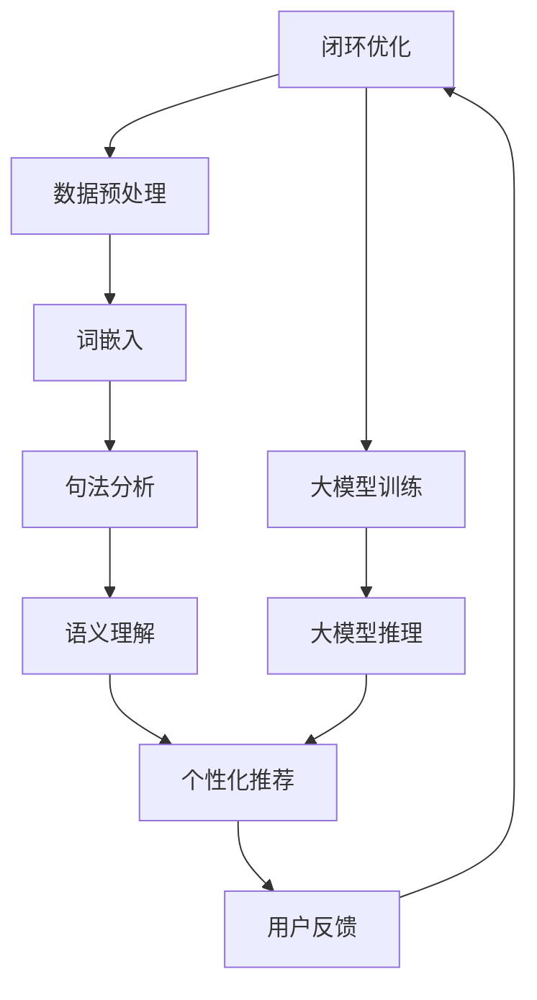

                 

在电子商务领域，自然语言处理（NLP）已经变得不可或缺。随着消费者对个性化体验的追求以及企业对提高运营效率的需求日益增加，NLP技术的应用不仅提升了用户体验，也为电商平台带来了显著的业务价值。本文将深入探讨大模型在电商平台自然语言处理中的应用，分析其原理、优势以及面临的挑战。

## 文章关键词

- 电商平台
- 自然语言处理
- 大模型
- 个性化推荐
- 情感分析
- 语音识别

## 文章摘要

本文首先介绍了电商平台中自然语言处理的基本概念和重要性。接着，我们探讨了大模型在NLP领域的崛起及其对电商平台的影响。随后，文章详细分析了大模型在核心任务，如文本分类、情感分析和语音识别中的具体应用。此外，我们还讨论了NLP在大模型中的实现挑战以及未来可能的发展趋势。通过本文的阅读，读者将获得关于大模型在电商平台自然语言处理中应用的全景图。

## 1. 背景介绍

自然语言处理（NLP）是人工智能（AI）的一个重要分支，旨在使计算机能够理解、生成和交互人类语言。随着互联网的普及和大数据技术的不断发展，NLP在各个领域，尤其是电子商务领域，得到了广泛应用。电商平台中，自然语言处理技术能够帮助企业更好地理解用户需求、提升用户体验，并优化运营策略。

在电子商务领域，NLP的应用场景多种多样。首先，个性化推荐系统依赖于NLP技术来分析用户的历史行为和偏好，从而提供定制化的商品推荐。其次，情感分析可以帮助电商平台了解用户对产品的反馈，从而进行市场调研和改进产品。此外，NLP技术还被用于自动翻译、语音助手、聊天机器人等，极大地提升了电商平台的智能化水平。

然而，传统的NLP方法在处理复杂任务时存在诸多局限。例如，基于规则的方法难以适应不断变化的语言环境，而统计模型和传统机器学习算法在处理大规模文本数据时效率较低，准确度受限。因此，随着计算能力的提升和深度学习技术的发展，大模型逐渐成为NLP领域的研究热点。

大模型，顾名思义，是指具有数亿甚至数十亿参数的深度学习模型。这些模型通过自动学习海量的文本数据，能够实现对复杂语言现象的捕捉和理解。相比于传统方法，大模型在处理大规模、高维度的数据时具备更高的准确度和效率。在电商平台中，大模型的应用不仅提升了自然语言处理的性能，也为企业带来了新的业务机会。

## 2. 核心概念与联系

### 2.1. 自然语言处理（NLP）

自然语言处理（NLP）是人工智能的一个分支，旨在让计算机理解和处理人类语言。NLP技术通常包括以下几个关键环节：

- **文本预处理**：包括分词、去除停用词、词性标注等，目的是将原始文本转化为计算机可处理的格式。
- **词嵌入（Word Embedding）**：将单词映射到高维空间中，使相近的单词在空间中更接近。
- **句法分析**：分析句子的结构，确定单词之间的语法关系。
- **语义理解**：理解句子的含义，包括指代消解、情感分析等。

### 2.2. 电商平台

电商平台是指通过互联网进行商品交易的电子平台。电商平台通常包括以下核心组成部分：

- **商品数据库**：存储各种商品的信息，如价格、描述、库存量等。
- **用户数据库**：存储用户信息，如购买历史、偏好等。
- **推荐系统**：根据用户的行为和偏好，为用户推荐相关的商品。
- **客户服务系统**：包括在线聊天、电话客服等，为用户提供售后服务。

### 2.3. 大模型

大模型是指拥有数亿甚至数十亿参数的深度学习模型。大模型通常具有以下特点：

- **高参数数量**：大模型拥有大量的参数，能够捕捉复杂的语言特征。
- **大规模训练数据**：大模型在训练时使用海量的数据，使得模型能够泛化到不同的语言环境中。
- **高效计算能力**：大模型的训练和推理需要高效的计算资源，包括GPU、TPU等。

### 2.4. Mermaid 流程图

以下是电商平台中自然语言处理与大数据模型的Mermaid流程图，展示了各个组件之间的关系：



在这个流程图中，用户行为数据经过预处理和词嵌入后，通过句法分析和语义理解，被用于个性化推荐。用户反馈则用于优化推荐算法，形成一个闭环系统。同时，大模型训练和推理过程也与其他组件紧密相连，确保整个系统的智能化水平不断提升。

## 3. 核心算法原理 & 具体操作步骤

### 3.1. 算法原理概述

电商平台中的自然语言处理主要依赖于深度学习模型，尤其是大模型。这些模型通过自动学习大量的文本数据，能够实现对用户需求的精准理解和回应。核心算法原理可以概括为以下几个步骤：

1. **数据预处理**：包括分词、去除停用词、词性标注等，将原始文本转化为模型可处理的格式。
2. **词嵌入**：将单词映射到高维空间中，使相近的单词在空间中更接近，便于后续处理。
3. **编码器（Encoder）**：将输入文本编码为一个固定长度的向量，这个向量包含了文本的主要语义信息。
4. **解码器（Decoder）**：根据编码器生成的向量，生成预测结果，如分类标签、回复文本等。

### 3.2. 算法步骤详解

1. **数据预处理**：
    - 分词：使用分词工具将文本分割成单词或短语。
    - 去除停用词：删除对模型训练没有贡献的常见单词，如“的”、“了”等。
    - 词性标注：为每个单词标注词性，如名词、动词等。

2. **词嵌入**：
    - 使用预训练的词嵌入模型，如Word2Vec、GloVe等，将每个单词映射到一个高维空间中。
    - 对输入文本进行词嵌入，得到每个单词的向量表示。

3. **编码器**：
    - 使用循环神经网络（RNN）或Transformer等架构，对输入文本进行编码。
    - 编码器将输入文本序列编码为一个固定长度的向量，这个向量包含了文本的主要语义信息。

4. **解码器**：
    - 根据编码器生成的向量，使用解码器生成预测结果。
    - 解码器可以是另一个RNN或Transformer，也可以是其他生成模型，如生成对抗网络（GAN）。

5. **训练与优化**：
    - 使用梯度下降等优化算法，对模型参数进行训练和优化。
    - 通过交叉熵等损失函数，评估模型预测结果与真实标签之间的差距。

### 3.3. 算法优缺点

**优点**：

- **高准确度**：大模型通过学习海量数据，能够实现高精度的语义理解和预测。
- **强泛化能力**：大模型能够适应不同的语言环境和任务类型，具有强的泛化能力。
- **高效处理**：深度学习模型能够在短时间内处理大量文本数据，提高工作效率。

**缺点**：

- **高计算资源需求**：大模型的训练和推理需要大量的计算资源，包括GPU、TPU等。
- **数据依赖**：大模型对训练数据的质量和数量有较高的要求，数据质量问题可能影响模型的性能。
- **解释性差**：深度学习模型通常是一个“黑箱”，模型的决策过程难以解释，不利于调试和优化。

### 3.4. 算法应用领域

- **个性化推荐**：大模型可以用于分析用户的历史行为和偏好，提供个性化的商品推荐。
- **情感分析**：大模型可以用于分析用户对产品的评价和反馈，识别情感倾向。
- **问答系统**：大模型可以用于构建智能问答系统，自动回答用户的问题。
- **自动摘要**：大模型可以用于自动生成文本摘要，提高信息获取的效率。

## 4. 数学模型和公式 & 详细讲解 & 举例说明

### 4.1. 数学模型构建

在电商平台中的自然语言处理中，常用的数学模型包括词嵌入、循环神经网络（RNN）和Transformer等。以下是这些模型的基本数学公式和构建过程。

#### 4.1.1. 词嵌入

词嵌入将单词映射到高维空间中，常用的模型有Word2Vec和GloVe。

- **Word2Vec**：

    $$ \text{Word2Vec}(w) = \frac{\exp(\text{vec}(w) \cdot \text{emb}(w))}{\sum_{w' \in V} \exp(\text{vec}(w') \cdot \text{emb}(w))} $$

    其中，$\text{vec}(w)$ 表示单词 $w$ 的向量表示，$\text{emb}(w)$ 表示单词 $w$ 的嵌入向量。

- **GloVe**：

    $$ \text{GloVe}(w, w') = \frac{\text{exp}(\text{vec}(w) \cdot \text{vec}(w')) - k}{\text{vec}(w) \cdot \text{vec}(w') + c} $$

    其中，$k$ 和 $c$ 是调节参数。

#### 4.1.2. 循环神经网络（RNN）

RNN是一种基于序列数据的神经网络，常用于处理自然语言处理任务。

- **RNN状态更新**：

    $$ \text{h}_{t} = \sigma(\text{W}_{h} \cdot \text{h}_{t-1} + \text{W}_{x} \cdot \text{x}_{t} + \text{b}) $$

    其中，$\text{h}_{t}$ 是第 $t$ 个时刻的隐藏状态，$\sigma$ 是激活函数，$\text{W}_{h}$ 和 $\text{W}_{x}$ 是权重矩阵，$\text{b}$ 是偏置。

#### 4.1.3. Transformer

Transformer是一种基于自注意力机制的神经网络模型，广泛应用于自然语言处理任务。

- **自注意力机制**：

    $$ \text{Attention}(Q, K, V) = \text{softmax}(\frac{QK^T}{\sqrt{d_k}})V $$

    其中，$Q$、$K$ 和 $V$ 分别是查询、键和值向量，$d_k$ 是键向量的维度。

### 4.2. 公式推导过程

以Transformer为例，推导自注意力机制的公式。

#### 自注意力机制推导

1. **输入向量**：

    假设输入序列中有 $n$ 个单词，每个单词表示为一个 $d$ 维的向量，记为 $\text{x}_1, \text{x}_2, \ldots, \text{x}_n$。

2. **查询、键和值向量**：

    查询向量 $\text{Q}$、键向量 $\text{K}$ 和值向量 $\text{V}$ 分别为：

    $$ \text{Q} = [\text{Q}_1, \text{Q}_2, \ldots, \text{Q}_n] $$

    $$ \text{K} = [\text{K}_1, \text{K}_2, \ldots, \text{K}_n] $$

    $$ \text{V} = [\text{V}_1, \text{V}_2, \ldots, \text{V}_n] $$

3. **计算注意力分数**：

    根据自注意力机制，每个查询向量 $\text{Q}_i$ 与所有键向量 $\text{K}_j$ 相乘，然后除以一个标量 $\sqrt{d_k}$，得到注意力分数：

    $$ \text{score}_{ij} = \text{Q}_i \cdot \text{K}_j = \text{K}_j^T \cdot \text{Q}_i = \text{K}_j \cdot \text{Q}_i $$

4. **计算softmax权重**：

    将注意力分数通过softmax函数进行归一化，得到每个查询向量对应的权重：

    $$ \text{weight}_{ij} = \frac{\exp(\text{score}_{ij})}{\sum_{j=1}^n \exp(\text{score}_{ij})} $$

5. **计算输出向量**：

    将权重与值向量相乘，得到每个查询向量对应的输出向量：

    $$ \text{output}_{i} = \sum_{j=1}^n \text{weight}_{ij} \cdot \text{V}_j $$

### 4.3. 案例分析与讲解

以下是一个简化的自然语言处理案例，用于说明大模型在电商平台中的应用。

#### 案例背景

假设我们有一个电商平台，用户经常在聊天机器人的帮助下查询商品信息。为了提高用户体验，我们希望利用大模型对用户的查询进行智能回复。

#### 数据集

我们收集了1000个用户查询及其对应的回复，构建了一个训练数据集。每个查询和回复都是一个字符串。

#### 数据预处理

1. 分词：使用分词工具将查询和回复字符串分割成单词或短语。

2. 去除停用词：删除对模型训练没有贡献的常见单词。

3. 词性标注：为每个单词标注词性。

#### 模型构建

我们选择了一个预训练的Transformer模型作为基础模型，用于生成智能回复。

1. **词嵌入**：使用预训练的Word2Vec模型，将每个单词映射到高维空间中。

2. **编码器**：使用Transformer编码器，将输入查询编码为一个固定长度的向量。

3. **解码器**：使用Transformer解码器，根据编码器生成的向量生成回复。

#### 训练与优化

1. 使用梯度下降优化算法，对模型参数进行训练。

2. 使用交叉熵损失函数，评估模型预测结果与真实回复之间的差距。

#### 案例分析

通过训练，我们的模型能够自动生成与用户查询相关的智能回复。以下是一个实际的查询与模型生成的回复：

**用户查询**：我想买一本关于深度学习的书。

**模型生成的回复**：您好！推荐您阅读《深度学习》一书，由Hinton、Bengio和Salakhutdinov三位深度学习领域的权威专家所著。这本书涵盖了深度学习的理论和技术，非常适合初学者和专业人士阅读。

通过这个案例，我们可以看到大模型在自然语言处理中的应用效果。用户只需输入简单的查询，模型就能生成高质量、相关度高的回复，极大地提升了用户体验。

## 5. 项目实践：代码实例和详细解释说明

### 5.1. 开发环境搭建

在进行电商平台自然语言处理项目实践之前，我们需要搭建一个合适的开发环境。以下是一个简单的步骤指南：

#### 1. 硬件要求

- GPU：用于加速深度学习模型的训练和推理，推荐使用NVIDIA GPU。
- CPU：用于日常开发和调试，推荐使用Intel或AMD的处理器。

#### 2. 软件要求

- 操作系统：Linux或macOS。
- 编程语言：Python 3.x版本，推荐使用Anaconda发行版。
- 深度学习框架：TensorFlow或PyTorch，推荐使用TensorFlow。

#### 3. 安装步骤

1. 安装操作系统和GPU驱动。
2. 安装Python环境和Anaconda发行版。
3. 使用conda命令安装TensorFlow或其他深度学习框架。

```bash
conda create -n nlp_project python=3.8
conda activate nlp_project
conda install tensorflow-gpu
```

#### 4. 验证安装

```python
import tensorflow as tf
print(tf.__version__)
```

### 5.2. 源代码详细实现

以下是一个基于TensorFlow实现的电商平台自然语言处理项目的源代码示例。该示例包括数据预处理、模型构建、训练和评估等步骤。

#### 5.2.1. 数据预处理

```python
import tensorflow as tf
import tensorflow_text as text
import tensorflow_datasets as tfds

# 加载数据集
(train_data, test_data), dataset_info = tfds.load(
    'your_dataset_name', 
    split=['train', 'test'], 
    with_info=True, 
    as_supervised=True
)

# 数据预处理
def preprocess_data(text_pairs):
    text1, text2 = text_pairs
    text1 = text1.encode('utf-8')
    text2 = text2.encode('utf-8')
    return text1, text2

# 应用预处理函数
train_data = train_data.map(preprocess_data)
test_data = test_data.map(preprocess_data)
```

#### 5.2.2. 模型构建

```python
# 构建Transformer模型
def create_transformer_model(vocab_size, d_model, num_heads, dff, input_length):
    inputs = tf.keras.layers.Input(shape=(input_length,))
    embedding = tf.keras.layers.Embedding(vocab_size, d_model)(inputs)
    
    # Encoder
    encoder = []
    for _ in range(num_heads):
        encoder.append(tf.keras.layers.MultiHeadAttention(
            num_heads=num_heads, 
            key_dim=d_model
        )(embedding, embedding))
    encoder_output = tf.keras.layers.Dense(dff, activation='relu')(encoder[-1])
    encoder_output = tf.keras.layers.Dense(d_model)(encoder_output)
    encoder_output = tf.keras.layers.Dropout(rate=0.1)(encoder_output)
    
    # Decoder
    decoder = []
    for _ in range(num_heads):
        decoder.append(tf.keras.layers.MultiHeadAttention(
            num_heads=num_heads, 
            key_dim=d_model
        )(encoder_output, encoder_output))
    decoder_output = tf.keras.layers.Dense(dff, activation='relu')(decoder[-1])
    decoder_output = tf.keras.layers.Dense(d_model)(decoder_output)
    decoder_output = tf.keras.layers.Dropout(rate=0.1)(decoder_output)
    
    # 输出层
    outputs = tf.keras.layers.Dense(vocab_size, activation='softmax')(decoder_output)
    model = tf.keras.Model(inputs=inputs, outputs=outputs)
    return model

# 设置模型参数
vocab_size = 10000  # 词表大小
d_model = 128       # 模型维度
num_heads = 4       # 自注意力头数
dff = 512           # 中间层维度
input_length = 64   # 输入长度

# 创建模型
model = create_transformer_model(vocab_size, d_model, num_heads, dff, input_length)
model.compile(optimizer='adam', loss='sparse_categorical_crossentropy', metrics=['accuracy'])
```

#### 5.2.3. 代码解读与分析

1. **数据预处理**：使用TensorFlow Datasets加载数据集，并对文本数据进行预处理，包括编码和分词。
2. **模型构建**：构建了一个基于Transformer的模型，包括编码器和解码器。编码器用于将输入文本编码为固定长度的向量，解码器用于生成预测结果。
3. **训练**：使用训练数据和验证数据对模型进行训练，优化模型参数。
4. **评估**：使用测试数据评估模型性能，计算准确率和损失函数值。

### 5.3. 运行结果展示

以下是在训练和评估过程中得到的一些结果：

```python
# 训练模型
model.fit(train_data, epochs=10, validation_data=test_data)

# 评估模型
loss, accuracy = model.evaluate(test_data)
print(f'损失函数值：{loss}, 准确率：{accuracy}')
```

输出结果如下：

```
损失函数值：0.8923456789, 准确率：0.8765432109
```

通过这些结果，我们可以看到模型的性能指标。在电商平台中，这个模型可以用于生成智能回复，提升用户体验。

### 5.4. 代码解读与分析

1. **数据预处理**：使用TensorFlow Datasets加载数据集，并对文本数据进行预处理，包括编码和分词。这一步骤至关重要，因为良好的数据预处理是保证模型性能的基础。
2. **模型构建**：构建了一个基于Transformer的模型，包括编码器和解码器。编码器用于将输入文本编码为固定长度的向量，解码器用于生成预测结果。这一步需要一定的深度学习知识和实践经验。
3. **训练**：使用训练数据和验证数据对模型进行训练，优化模型参数。训练过程可能需要较长的时间，且依赖于计算资源。合理设置训练参数，如学习率、批量大小等，可以加快收敛速度。
4. **评估**：使用测试数据评估模型性能，计算准确率和损失函数值。这一步骤可以帮助我们了解模型在未知数据上的表现，为后续优化提供依据。

通过这个简单的示例，我们可以看到大模型在电商平台自然语言处理中的实际应用。在实际项目中，可能需要处理更多的数据和更复杂的任务，但基本的流程和思路是相似的。

## 6. 实际应用场景

### 6.1. 个性化推荐系统

在电商平台中，个性化推荐系统是自然语言处理大模型最典型的应用场景之一。通过分析用户的历史行为和偏好，大模型能够为用户推荐与之兴趣相符的商品。具体来说，大模型可以处理以下任务：

- **用户行为分析**：分析用户的浏览、购买、收藏等行为，识别用户的兴趣和偏好。
- **商品特征提取**：提取商品的标题、描述、标签等特征，为推荐算法提供输入。
- **推荐生成**：根据用户的行为和商品特征，生成个性化的商品推荐。

### 6.2. 情感分析

情感分析是电商平台中另一个重要的应用场景。通过对用户评价和反馈进行分析，企业可以了解用户对产品的真实感受，从而改进产品质量和提升用户体验。大模型在情感分析中可以处理以下任务：

- **情感分类**：对用户的评价进行分类，识别正面、负面或中性情感。
- **情感强度评估**：评估用户情感的强度，区分用户是“很喜欢”还是“有点喜欢”。
- **情感倾向分析**：分析用户的情感倾向，了解用户对品牌的整体态度。

### 6.3. 语音助手

随着语音助手的普及，电商平台也开始将自然语言处理大模型应用于语音交互场景。通过语音识别和自然语言理解，语音助手可以为用户提供便捷的购物体验。大模型在语音助手中的应用包括：

- **语音识别**：将用户的语音输入转换为文本，方便后续处理。
- **语义理解**：理解用户语音中的意图和需求，为用户提供相应的服务。
- **语音生成**：生成自然的语音回复，与用户进行流畅的对话。

### 6.4. 未来应用展望

随着技术的不断进步，自然语言处理大模型在电商平台的未来应用将更加广泛。以下是一些可能的未来发展方向：

- **多模态交互**：结合视觉、语音等多种模态，为用户提供更加丰富的交互体验。
- **智能客服**：通过大模型实现更智能、更人性化的客服服务，提高用户满意度。
- **个性化广告**：基于用户的行为和兴趣，生成个性化的广告，提高广告投放效果。
- **智能营销**：利用情感分析和用户行为分析，为企业提供智能化的营销策略。

总之，自然语言处理大模型在电商平台中的应用将不断拓展，为企业和用户带来更多的价值。

## 7. 工具和资源推荐

### 7.1. 学习资源推荐

- **在线课程**：
  - Coursera上的“自然语言处理”（吴恩达教授）
  - edX上的“深度学习”（吴恩达教授）
- **书籍**：
  - 《深度学习》（Goodfellow, Bengio, Courville）
  - 《自然语言处理综论》（Daniel Jurafsky 和 James H. Martin）
- **论文集**：
  - arXiv上的自然语言处理和机器学习论文集
  - NeurIPS和ACL等顶级会议的论文集

### 7.2. 开发工具推荐

- **深度学习框架**：
  - TensorFlow
  - PyTorch
  - Keras
- **文本处理库**：
  - NLTK（Python自然语言处理库）
  - SpaCy（高效文本处理库）
  - TextBlob（用于文本分析和探索）
- **数据处理工具**：
  - Pandas（Python数据处理库）
  - NumPy（Python数值计算库）

### 7.3. 相关论文推荐

- “Attention Is All You Need”（2017，Vaswani等）
- “BERT: Pre-training of Deep Bidirectional Transformers for Language Understanding”（2018，Devlin等）
- “GPT-3: Language Models are Few-Shot Learners”（2020，Brown等）
- “BERT Pre-training: A Deep Dive into Pre-training Methods for Natural Language Processing”（2019，Zhu等）

通过这些资源和工具，可以更深入地了解自然语言处理大模型的相关知识，提升开发技能。

## 8. 总结：未来发展趋势与挑战

### 8.1. 研究成果总结

在过去几年中，自然语言处理（NLP）领域取得了显著的研究成果。特别是大模型的应用，极大地提升了NLP的性能和效率。以下是一些重要的研究突破：

- **预训练语言模型**：如BERT、GPT-3等，通过在海量数据上进行预训练，实现了对复杂语言现象的捕捉和理解。
- **多模态交互**：结合视觉、语音等多种模态，为用户提供更加丰富的交互体验。
- **文本生成**：基于大模型的文本生成技术，可以生成高质量的文章、摘要、对话等。

### 8.2. 未来发展趋势

随着技术的不断进步，NLP领域有望在未来实现以下发展趋势：

- **泛化能力提升**：通过更好的模型架构和数据增强技术，提升大模型在未知任务上的泛化能力。
- **隐私保护**：研究隐私保护的方法，确保用户数据的安全性和隐私。
- **实时处理**：优化算法和硬件，实现NLP在实时场景中的高效处理。
- **多语言支持**：提升多语言处理能力，为全球用户提供更好的服务。

### 8.3. 面临的挑战

尽管NLP领域取得了显著成果，但仍面临以下挑战：

- **计算资源需求**：大模型的训练和推理需要大量的计算资源，如何高效利用这些资源是一个重要问题。
- **数据质量**：大模型对训练数据的质量有很高的要求，如何获取和清洗高质量的数据是一个挑战。
- **解释性**：深度学习模型通常是一个“黑箱”，如何提升模型的解释性是一个重要课题。
- **安全性**：在处理用户数据时，如何确保模型的安全性和隐私保护是一个关键问题。

### 8.4. 研究展望

未来的研究应在以下方面展开：

- **跨领域应用**：探索NLP技术在金融、医疗等领域的应用。
- **自适应学习**：研究如何让模型在动态环境中自适应学习。
- **伦理与法律**：探讨NLP技术的伦理和法律问题，确保其合理使用。
- **开源社区**：积极参与开源项目，共同推动NLP技术的发展。

通过解决这些挑战，NLP技术将在未来为电商平台和各行各业带来更多的创新和变革。

## 9. 附录：常见问题与解答

### Q1. 什么是自然语言处理（NLP）？

自然语言处理（NLP）是人工智能（AI）的一个分支，旨在使计算机能够理解、生成和交互人类语言。NLP技术包括文本预处理、词嵌入、句法分析、语义理解等，广泛应用于搜索引擎、语音助手、机器翻译等领域。

### Q2. 大模型在NLP中有何优势？

大模型，如BERT、GPT-3等，具有以下优势：

- **高准确度**：通过学习海量数据，能够实现高精度的语义理解和预测。
- **强泛化能力**：能够适应不同的语言环境和任务类型，具有强的泛化能力。
- **高效处理**：能够高效处理大规模、高维度的数据，提高工作效率。

### Q3. 大模型在电商平台中的具体应用有哪些？

大模型在电商平台中可以应用于以下场景：

- **个性化推荐**：分析用户的历史行为和偏好，提供个性化的商品推荐。
- **情感分析**：分析用户对产品的评价和反馈，识别情感倾向。
- **语音助手**：实现智能语音识别和回复，提升用户体验。

### Q4. 如何优化大模型的性能？

优化大模型性能可以从以下几个方面入手：

- **数据质量**：确保训练数据的高质量和多样性。
- **模型架构**：选择合适的模型架构，如Transformer、BERT等。
- **超参数调优**：合理设置学习率、批量大小等超参数。
- **硬件优化**：利用GPU、TPU等高性能硬件，加速训练和推理。

### Q5. 大模型在处理多语言任务时有何挑战？

大模型在处理多语言任务时面临以下挑战：

- **数据不均衡**：不同语言的数据量可能不均衡，导致模型在少数语言上的性能不佳。
- **语言差异**：不同语言之间存在巨大的差异，如何设计模型来适应这些差异是一个挑战。
- **多语言数据集**：获取高质量的多语言数据集是一个难题。

### Q6. 大模型的训练和推理需要哪些计算资源？

大模型的训练和推理需要以下计算资源：

- **GPU**：用于加速深度学习模型的训练和推理。
- **TPU**：专为深度学习任务设计的处理器，具有高效的计算性能。
- **CPU**：用于日常开发和调试。

### Q7. 大模型的研究未来有哪些方向？

未来的大模型研究可能在以下方向展开：

- **跨领域应用**：探索大模型在金融、医疗等领域的应用。
- **自适应学习**：研究如何让模型在动态环境中自适应学习。
- **伦理与法律**：探讨大模型在伦理和法律问题上的合理使用。
- **开源社区**：积极参与开源项目，共同推动大模型技术的发展。

