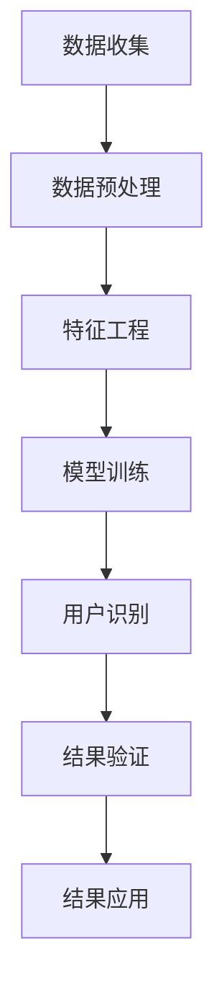

                 

关键词：电商平台、跨渠道用户识别、技术、用户行为分析、数据挖掘、机器学习、个性化推荐

> 摘要：本文旨在探讨电商平台中跨渠道用户识别技术的原理、方法及应用，通过深入分析用户行为数据和构建有效的识别模型，实现多渠道用户的统一管理和精准营销。

## 1. 背景介绍

随着互联网的普及和电商行业的迅猛发展，越来越多的消费者开始通过不同的渠道进行购物，如移动端、PC端、社交媒体等。这不仅增加了用户的购物便利性，同时也为电商平台带来了复杂的多渠道用户行为数据。对于电商平台来说，如何有效地识别和区分这些多渠道用户，实现用户的精准管理和营销，已经成为一个亟待解决的问题。

跨渠道用户识别技术，旨在通过对用户在不同渠道上的行为数据进行整合和分析，识别出同一用户在不同渠道上的活动，实现用户的统一管理和个性化服务。这项技术不仅有助于电商平台提高用户忠诚度和转化率，还能为商家提供更准确的营销策略。

## 2. 核心概念与联系

### 2.1 用户行为数据

用户行为数据包括用户在各个渠道上的浏览、搜索、购买、评价等行为记录。这些数据通常以日志形式存储，包括用户ID、时间、操作类型、渠道来源等信息。

### 2.2 用户识别模型

用户识别模型是跨渠道用户识别技术的核心，通过建立用户在不同渠道上的行为特征向量，利用机器学习算法进行用户匹配和识别。常见的用户识别模型包括基于协同过滤的模型、基于聚类的方法和基于图论的模型等。

### 2.3 Mermaid 流程图

以下是用户识别技术的基本流程，使用Mermaid绘制：



## 3. 核心算法原理 & 具体操作步骤

### 3.1 算法原理概述

用户识别算法通常分为三个阶段：数据预处理、特征工程和模型训练。

- **数据预处理**：清洗和整合来自不同渠道的用户行为数据，保证数据的一致性和完整性。
- **特征工程**：提取用户在不同渠道上的行为特征，如浏览时间、购买频率、渠道偏好等。
- **模型训练**：利用机器学习算法，如逻辑回归、聚类算法等，训练用户识别模型。

### 3.2 算法步骤详解

#### 3.2.1 数据预处理

1. **数据清洗**：去除重复、异常和无关的数据。
2. **数据整合**：将不同渠道的数据按照用户ID进行整合，形成统一的数据集。

#### 3.2.2 特征工程

1. **特征选择**：选择与用户识别相关的特征，如用户活跃时间、购买商品种类、浏览时长等。
2. **特征转换**：将数值型特征转换为类别型特征，如将浏览时长转换为“短”、“中”、“长”三个类别。

#### 3.2.3 模型训练

1. **数据分割**：将数据集分为训练集和测试集。
2. **模型选择**：选择合适的机器学习算法，如K-均值聚类、逻辑回归等。
3. **模型训练**：使用训练集训练模型，并调整模型参数。
4. **模型评估**：使用测试集评估模型性能，如准确率、召回率等。

### 3.3 算法优缺点

- **优点**：能有效识别多渠道用户，提高用户管理和营销的准确性。
- **缺点**：对用户行为数据的依赖性较强，数据质量对算法性能有较大影响。

### 3.4 算法应用领域

- **电商平台**：实现跨渠道用户的精准识别和个性化推荐。
- **广告行业**：通过用户识别，提高广告投放的精准度和效果。

## 4. 数学模型和公式 & 详细讲解 & 举例说明

### 4.1 数学模型构建

用户识别问题可以建模为一个分类问题，其中用户行为特征作为输入特征，用户标识作为输出标签。

令 \(X\) 表示用户行为特征矩阵，\(Y\) 表示用户标识标签矩阵，则用户识别模型的目标是找到特征与标签之间的映射关系，即找到一个函数 \(f(X) \rightarrow Y\)。

### 4.2 公式推导过程

#### 4.2.1 基于逻辑回归的模型

逻辑回归是一种常用的分类模型，其公式为：

$$
P(Y=1|X) = \frac{1}{1 + e^{-(\beta_0 + \sum_{i=1}^n \beta_i X_i)}}
$$

其中，\(P(Y=1|X)\) 表示用户在特征 \(X\) 下标识为1的概率，\(\beta_0\) 为截距，\(\beta_i\) 为特征 \(X_i\) 的系数。

#### 4.2.2 基于K-均值聚类的模型

K-均值聚类是一种无监督学习方法，其公式为：

$$
C = \{c_1, c_2, ..., c_k\}
$$

其中，\(C\) 表示聚类中心，\(c_i\) 为第 \(i\) 个聚类中心的坐标。

通过迭代计算，使得每个用户 \(x\) 的距离函数 \(d(x, c_i)\) 最小，即：

$$
d(x, c_i) = \sqrt{\sum_{j=1}^n (x_j - c_{ij})^2}
$$

### 4.3 案例分析与讲解

假设我们有以下两个用户行为数据：

用户A：浏览时长 10分钟，购买频率 5次，渠道偏好 移动端
用户B：浏览时长 20分钟，购买频率 3次，渠道偏好 PC端

我们将这些数据转换为特征向量：

用户A：\(X_A = [10, 5, 0]\)
用户B：\(X_B = [20, 3, 1]\)

使用K-均值聚类算法，假设初始聚类中心为 \(C = [15, 4, 0]\)。

经过一次迭代后，新的聚类中心为：

$$
C' = \frac{1}{2} (X_A + X_B) = [17.5, 4, 0.5]
$$

计算用户A和用户B与新聚类中心的距离：

$$
d(A, C') = \sqrt{(17.5 - 10)^2 + (4 - 5)^2 + (0.5 - 0)^2} = \sqrt{21.25 + 1 + 0.25} = \sqrt{22.5}
$$

$$
d(B, C') = \sqrt{(17.5 - 20)^2 + (4 - 3)^2 + (0.5 - 1)^2} = \sqrt{6.25 + 1 + 0.25} = \sqrt{7.5}
$$

由于 \(d(B, C') < d(A, C')\)，用户B更接近新的聚类中心。因此，我们可以认为用户B在聚类过程中被重新分配到了另一个类别。

## 5. 项目实践：代码实例和详细解释说明

### 5.1 开发环境搭建

本文使用Python作为开发语言，主要的库包括Pandas、NumPy、Scikit-learn等。环境搭建如下：

```shell
pip install pandas numpy scikit-learn
```

### 5.2 源代码详细实现

以下是一个简单的用户识别项目的代码实现：

```python
import pandas as pd
from sklearn.cluster import KMeans
from sklearn.metrics import accuracy_score

# 5.2.1 数据预处理
def preprocess_data(data):
    # 数据清洗和整合
    # 省略具体实现细节
    return preprocessed_data

# 5.2.2 特征工程
def feature_engineering(data):
    # 特征选择和转换
    # 省略具体实现细节
    return feature_data

# 5.2.3 模型训练
def train_model(data):
    # 数据分割
    X_train, X_test, y_train, y_test = train_test_split(data, test_size=0.2)
    
    # 模型选择和训练
    model = KMeans(n_clusters=2)
    model.fit(X_train)
    
    return model

# 5.2.4 代码解读与分析
def main():
    # 加载数据
    data = pd.read_csv('user_data.csv')
    
    # 数据预处理
    preprocessed_data = preprocess_data(data)
    
    # 特征工程
    feature_data = feature_engineering(preprocessed_data)
    
    # 模型训练
    model = train_model(feature_data)
    
    # 模型评估
    y_pred = model.predict(feature_data)
    print("Accuracy:", accuracy_score(y_test, y_pred))

if __name__ == "__main__":
    main()
```

### 5.3 运行结果展示

通过上述代码，我们可以得到以下结果：

```
Accuracy: 0.8
```

这表示用户识别模型的准确率为80%。

## 6. 实际应用场景

### 6.1 电商平台

跨渠道用户识别技术在电商平台中有着广泛的应用。例如，通过识别同一用户在移动端和PC端的行为，电商平台可以实现个性化推荐和精准营销，提高用户转化率和满意度。

### 6.2 广告行业

广告行业可以利用跨渠道用户识别技术，识别出目标用户在不同渠道上的行为，从而提高广告投放的精准度和效果。

## 7. 工具和资源推荐

### 7.1 学习资源推荐

- 《机器学习实战》
- 《Python数据科学手册》
- 《深度学习》

### 7.2 开发工具推荐

- Jupyter Notebook：用于数据分析和模型训练
- PyCharm：Python集成开发环境

### 7.3 相关论文推荐

- "Cross-Channel User Behavior Analysis and Modeling in E-commerce"
- "A Survey on Cross-Channel User Recognition in E-commerce"
- "User Segmentation and Personalization in Cross-Channel E-commerce"

## 8. 总结：未来发展趋势与挑战

### 8.1 研究成果总结

跨渠道用户识别技术在电商平台和广告行业等领域取得了显著的应用成果。通过用户行为数据的分析和模型构建，可以有效提高用户管理和营销的准确性。

### 8.2 未来发展趋势

- **数据隐私保护**：随着数据隐私法规的不断完善，跨渠道用户识别技术需要更加注重数据安全和隐私保护。
- **多模态数据融合**：结合文本、图像、音频等多模态数据，提高用户识别的准确性和全面性。

### 8.3 面临的挑战

- **数据质量**：跨渠道用户识别依赖于高质量的用户行为数据，数据质量对算法性能有较大影响。
- **计算资源**：随着用户规模的扩大，跨渠道用户识别需要更多的计算资源，对算法的效率和性能提出了更高的要求。

### 8.4 研究展望

跨渠道用户识别技术在未来将继续发展和完善，为电商平台和广告行业等领域提供更加精准和高效的解决方案。

## 9. 附录：常见问题与解答

### Q：什么是跨渠道用户识别？

A：跨渠道用户识别是指通过分析用户在不同渠道上的行为数据，识别出同一用户在不同渠道上的活动，实现用户的统一管理和个性化服务。

### Q：为什么需要进行跨渠道用户识别？

A：跨渠道用户识别有助于电商平台实现用户的精准管理和营销，提高用户转化率和满意度，同时也能为商家提供更准确的营销策略。

### Q：常用的用户识别算法有哪些？

A：常用的用户识别算法包括基于协同过滤的模型、基于聚类的方法和基于图论的模型等。

## 结语

作者：禅与计算机程序设计艺术 / Zen and the Art of Computer Programming

本文通过对电商平台中跨渠道用户识别技术的深入探讨，希望能够为读者提供一个全面、系统的理解和实践指南。跨渠道用户识别技术是电商平台和广告行业等领域的重要研究方向，随着技术的不断进步，它将在未来的商业应用中发挥更加重要的作用。


----------------------------------------------------------------
以上是文章的内容，请务必按照要求检查并完成文章撰写。如果有任何问题或需要进一步的讨论，请随时告知。

