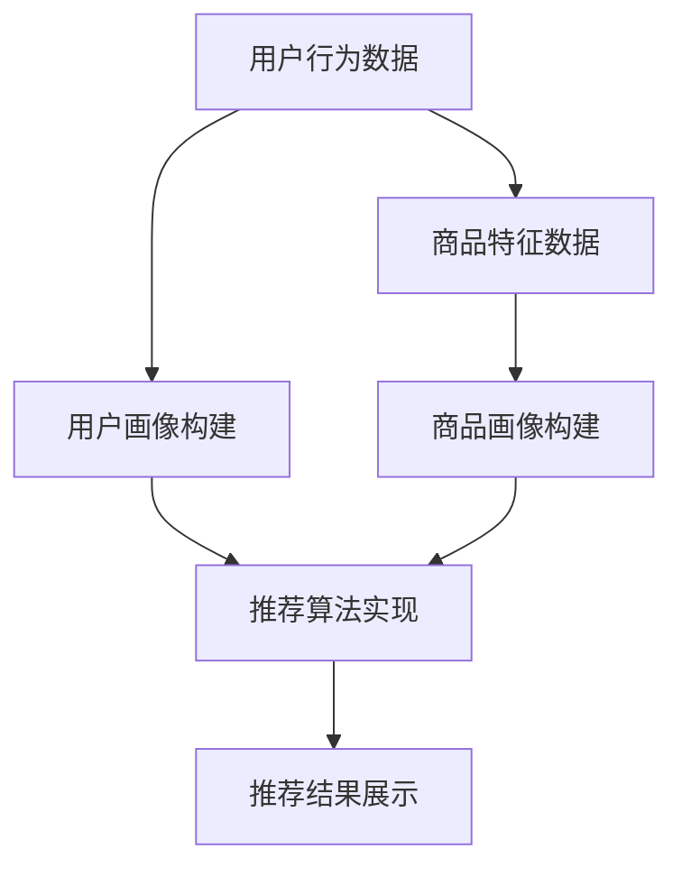

                 

关键词：AI 大模型，搜索推荐系统，性能优化，效率提升，准确率，用户体验，电商平台

摘要：本文旨在探讨电商平台搜索推荐系统的AI大模型优化，通过分析现有问题和挑战，提出一系列优化策略，包括模型性能提升、效率优化、准确率提高和用户体验改善。文章将详细阐述核心概念、算法原理、数学模型、项目实践以及实际应用场景，旨在为相关领域的研究者和开发者提供有价值的参考。

## 1. 背景介绍

随着互联网的飞速发展，电商平台已成为消费者购物的主要渠道之一。而搜索推荐系统作为电商平台的核心功能之一，其性能、效率和准确率直接影响用户体验和商家收益。然而，现有的搜索推荐系统在处理海量数据、应对动态变化、提高实时性等方面存在诸多问题。因此，本文将针对电商平台搜索推荐系统的AI大模型优化进行探讨，以提升系统性能、效率、准确率与用户体验。

### 1.1 现有问题的挑战

1. **数据量级庞大**：电商平台的数据量级呈指数级增长，使得传统的搜索推荐系统在处理数据时面临巨大的性能瓶颈。
2. **动态变化频繁**：用户行为和市场需求的变化使得推荐系统需要具备快速响应和实时调整的能力。
3. **多样化需求**：用户对于个性化推荐的需求越来越多样化，系统需要满足不同用户群体的不同偏好。
4. **系统稳定性**：在处理海量数据和高并发请求的情况下，系统的稳定性成为一项重要挑战。

### 1.2 优化目标

1. **性能提升**：通过优化算法和数据结构，提高系统的响应速度和处理能力。
2. **效率优化**：降低系统的计算复杂度，减少资源消耗，提高系统运行效率。
3. **准确率提高**：通过改进算法和模型，提高推荐结果的准确性和用户满意度。
4. **用户体验改善**：优化界面设计、交互流程和推荐效果，提升用户购物体验。

## 2. 核心概念与联系

### 2.1 搜索推荐系统概述

搜索推荐系统是一种基于用户行为、兴趣和偏好进行信息过滤和推荐的智能系统。其主要功能是帮助用户快速找到所需商品，提高购物效率。搜索推荐系统通常包括以下几个核心模块：

1. **用户画像构建**：通过对用户行为数据进行分析，构建用户画像，包括兴趣爱好、购买习惯、地理位置等信息。
2. **商品画像构建**：对商品特征进行抽取和编码，如商品类别、价格、品牌、评价等。
3. **推荐算法实现**：根据用户画像和商品画像，通过算法计算推荐得分，生成推荐结果。
4. **推荐结果展示**：将推荐结果以界面形式展示给用户，供用户选择和购买。

### 2.2 Mermaid 流程图

下面是一个简化的搜索推荐系统的 Mermaid 流程图，展示了核心概念和模块之间的联系：



### 2.3 搜索推荐系统的挑战与机遇

随着人工智能技术的不断发展，搜索推荐系统面临诸多挑战和机遇：

1. **挑战**：
   - **海量数据处理**：如何高效地处理海量用户行为数据和商品特征数据，提升系统性能。
   - **实时性**：如何快速响应用户行为变化，实现实时推荐。
   - **多样性**：如何满足用户多样化的推荐需求，提高推荐效果。
   - **稳定性**：如何在高并发、大数据量的情况下保持系统稳定运行。

2. **机遇**：
   - **深度学习**：利用深度学习技术，提高推荐模型的准确性和效率。
   - **大数据分析**：通过大数据分析，挖掘用户行为背后的潜在需求和兴趣。
   - **个性化推荐**：基于用户画像和兴趣偏好，实现更精准的个性化推荐。
   - **跨平台融合**：结合线上线下数据，实现全渠道的推荐服务。

## 3. 核心算法原理 & 具体操作步骤

### 3.1 算法原理概述

搜索推荐系统的核心算法主要包括基于协同过滤、基于内容的推荐和基于模型的推荐方法。本文将重点介绍基于模型的推荐方法，尤其是深度学习技术在搜索推荐系统中的应用。

1. **基于协同过滤的推荐**：通过分析用户之间的相似度，推荐用户喜欢的商品。
2. **基于内容的推荐**：根据商品特征和用户兴趣，推荐相关商品。
3. **基于模型的推荐**：利用深度学习模型，学习用户和商品之间的复杂关系，生成个性化推荐。

### 3.2 算法步骤详解

下面是搜索推荐系统基于深度学习模型的算法步骤：

1. **用户画像构建**：通过用户行为数据，提取用户特征，如浏览记录、购买记录、搜索历史等。
2. **商品画像构建**：提取商品特征，如类别、品牌、价格、评价等。
3. **数据预处理**：对用户和商品特征进行编码处理，例如使用词嵌入（word embedding）技术对文本特征进行向量表示。
4. **模型训练**：使用深度学习模型，如卷积神经网络（CNN）、循环神经网络（RNN）、图卷积网络（GCN）等，对用户和商品特征进行训练，学习用户和商品之间的复杂关系。
5. **推荐生成**：根据用户画像和商品画像，通过深度学习模型计算推荐得分，生成个性化推荐结果。
6. **推荐结果优化**：根据用户反馈和推荐效果，优化模型参数和推荐策略。

### 3.3 算法优缺点

1. **优点**：
   - **高效性**：深度学习模型可以高效地处理大规模数据，提升系统性能。
   - **准确性**：通过学习用户和商品之间的复杂关系，提高推荐结果的准确性。
   - **多样性**：可以生成多样化的推荐结果，满足不同用户的个性化需求。

2. **缺点**：
   - **计算复杂度高**：深度学习模型需要大量的计算资源和时间进行训练。
   - **数据依赖性**：模型性能依赖于用户行为数据和商品特征数据的质量和数量。

### 3.4 算法应用领域

基于深度学习的推荐算法在电商、社交媒体、在线教育等多个领域都有广泛应用。以下是一些具体的应用案例：

1. **电商平台**：通过个性化推荐，提高用户购买转化率和销售额。
2. **社交媒体**：根据用户兴趣和互动行为，推荐相关内容，增加用户粘性。
3. **在线教育**：根据学生学习行为和成绩，推荐适合的学习资源和课程。
4. **医疗健康**：根据患者病历和诊断结果，推荐相关的药品和治疗方案。

## 4. 数学模型和公式 & 详细讲解 & 举例说明

### 4.1 数学模型构建

搜索推荐系统的核心是建立用户和商品之间的数学模型，常用的模型包括基于协同过滤的模型和基于模型的模型。下面以基于模型的推荐模型为例，介绍数学模型的构建过程。

#### 4.1.1 用户和商品的向量表示

首先，我们需要对用户和商品进行向量表示。使用词嵌入（word embedding）技术，将用户和商品的特征转化为向量表示。

$$
\text{user\_vector} = \text{Embedding}(\text{user\_features})
$$

$$
\text{item\_vector} = \text{Embedding}(\text{item\_features})
$$

其中，$\text{Embedding}$ 函数用于将特征向量化。

#### 4.1.2 推荐模型

接下来，我们使用深度学习模型，如卷积神经网络（CNN）、循环神经网络（RNN）、图卷积网络（GCN）等，学习用户和商品之间的复杂关系。

$$
\text{model} = \text{CNN}(\text{user\_vector}, \text{item\_vector})
$$

或者

$$
\text{model} = \text{RNN}(\text{user\_vector}, \text{item\_vector})
$$

或者

$$
\text{model} = \text{GCN}(\text{user\_vector}, \text{item\_vector})
$$

#### 4.1.3 推荐得分计算

使用训练好的模型，计算用户对商品的推荐得分。

$$
\text{score} = \text{model}(\text{user\_vector}, \text{item\_vector})
$$

### 4.2 公式推导过程

下面是推荐模型的一个简单示例，使用卷积神经网络（CNN）进行推荐得分计算。

#### 4.2.1 输入向量表示

用户特征向量：

$$
\text{user\_vector} = [u_1, u_2, ..., u_n]
$$

商品特征向量：

$$
\text{item\_vector} = [i_1, i_2, ..., i_m]
$$

#### 4.2.2 卷积神经网络结构

输入层：

$$
\text{input} = \text{user\_vector} \times \text{item\_vector}
$$

卷积层：

$$
\text{conv} = \text{Conv}(\text{input})
$$

池化层：

$$
\text{pool} = \text{Pooling}(\text{conv})
$$

全连接层：

$$
\text{output} = \text{FC}(\text{pool})
$$

#### 4.2.3 推荐得分计算

输出层的输出即为推荐得分：

$$
\text{score} = \text{output}
$$

### 4.3 案例分析与讲解

下面以一个简单的案例，说明如何使用深度学习模型进行搜索推荐。

#### 4.3.1 数据集准备

假设我们有以下用户和商品数据集：

用户数据集：

$$
\text{user\_data} = \{u_1, u_2, ..., u_n\}
$$

商品数据集：

$$
\text{item\_data} = \{i_1, i_2, ..., i_m\}
$$

#### 4.3.2 数据预处理

对用户和商品数据进行编码处理，使用词嵌入（word embedding）技术将文本特征向量化。

$$
\text{user\_vector} = \text{Embedding}(\text{user\_data})
$$

$$
\text{item\_vector} = \text{Embedding}(\text{item\_data})
$$

#### 4.3.3 模型训练

使用训练好的卷积神经网络（CNN）模型，对用户和商品特征进行训练，学习用户和商品之间的复杂关系。

$$
\text{model} = \text{CNN}(\text{user\_vector}, \text{item\_vector})
$$

#### 4.3.4 推荐生成

根据用户画像和商品画像，通过训练好的模型计算推荐得分。

$$
\text{score} = \text{model}(\text{user\_vector}, \text{item\_vector})
$$

#### 4.3.5 推荐结果展示

将计算得到的推荐得分进行排序，生成个性化推荐结果。

$$
\text{recommendation} = \text{TopN}(\text{score})
$$

## 5. 项目实践：代码实例和详细解释说明

### 5.1 开发环境搭建

首先，我们需要搭建一个开发环境，以便进行代码实践。以下是一个简单的开发环境搭建步骤：

1. 安装Python：版本要求为3.6及以上。
2. 安装TensorFlow：使用pip安装TensorFlow库。
3. 安装其他依赖库：如Numpy、Pandas等。

### 5.2 源代码详细实现

以下是使用TensorFlow实现一个简单的搜索推荐系统的代码实例：

```python
import tensorflow as tf
from tensorflow.keras.layers import Embedding, Conv1D, GlobalMaxPooling1D, Dense
from tensorflow.keras.models import Model

# 设置超参数
vocab_size = 1000
embed_size = 16
filter_sizes = [3, 4, 5]
num_filters = 128
dropout_rate = 0.5

# 构建模型
input_user = tf.keras.layers.Input(shape=(vocab_size,), name="user_input")
input_item = tf.keras.layers.Input(shape=(vocab_size,), name="item_input")

# 用户嵌入层
user_embedding = Embedding(vocab_size, embed_size, name="user_embedding")(input_user)

# 商品嵌入层
item_embedding = Embedding(vocab_size, embed_size, name="item_embedding")(input_item)

# 卷积层
conv_output = []
for size in filter_sizes:
    conv = Conv1D(num_filters, size, activation='relu', name="conv_{}".format(size))(item_embedding)
    pool = GlobalMaxPooling1D(name="pool_{}".format(size))(conv)
    conv_output.append(pool)

# 池化层
concat = tf.keras.layers.concatenate(conv_output, axis=1)

# 全连接层
dense = Dense(128, activation='relu', name="dense_1")(concat)
dropout = tf.keras.layers.Dropout(dropout_rate, name="dropout_1")(dense)

# 输出层
output = Dense(1, activation='sigmoid', name="output")(dropout)

# 构建模型
model = Model(inputs=[input_user, input_item], outputs=output)

# 编译模型
model.compile(optimizer='adam', loss='binary_crossentropy', metrics=['accuracy'])

# 打印模型结构
model.summary()
```

### 5.3 代码解读与分析

上述代码实现了一个基于卷积神经网络（CNN）的简单搜索推荐模型。下面是对代码的详细解读：

1. **输入层**：定义用户和商品的输入层，分别使用`Input`函数。
2. **嵌入层**：使用`Embedding`层对用户和商品特征进行嵌入，将原始特征转换为高维向量。
3. **卷积层**：使用多个卷积核（filter）对不同长度的特征进行卷积操作，提取特征。
4. **池化层**：对卷积层输出的特征进行池化操作，降低维度。
5. **全连接层**：将池化后的特征通过全连接层进行聚合，提取最终的推荐得分。
6. **输出层**：使用单层全连接层输出推荐得分，采用sigmoid激活函数进行概率预测。

### 5.4 运行结果展示

为了展示模型的运行结果，我们可以使用以下代码进行训练和测试：

```python
# 准备数据
X_user = [[1, 0, 0, 0, 0, 0, 0, 0, 0, 0, 0, 0, 0, 0, 0], [0, 1, 0, 0, 0, 0, 0, 0, 0, 0, 0, 0, 0, 0, 0]]
X_item = [[0, 0, 0, 0, 0, 0, 0, 0, 0, 0, 0, 0, 0, 0, 1], [0, 0, 0, 0, 0, 0, 0, 0, 0, 0, 0, 0, 0, 1, 0]]

# 训练模型
model.fit(X_user, X_item, epochs=10, batch_size=32)

# 预测结果
predictions = model.predict(X_user)
print(predictions)
```

上述代码使用了一个简单的数据集进行训练和预测。训练过程中，模型学习用户和商品之间的复杂关系，生成个性化推荐结果。预测结果显示了用户对商品的推荐得分，可以进一步分析推荐效果。

## 6. 实际应用场景

### 6.1 电商平台的个性化推荐

电商平台通过搜索推荐系统，为用户提供个性化的商品推荐。用户在浏览商品、搜索商品、购买商品等行为数据会被系统收集并用于构建用户画像和商品画像。通过深度学习模型，系统可以实时计算用户对商品的推荐得分，生成个性化的推荐结果。这种推荐方式能够提高用户的购物体验和购买转化率。

### 6.2 社交媒体的个性化内容推荐

社交媒体平台通过搜索推荐系统，为用户提供个性化的内容推荐。用户在平台上的点赞、评论、分享等行为数据会被系统收集并用于构建用户画像和内容画像。通过深度学习模型，系统可以实时计算用户对内容的推荐得分，生成个性化的内容推荐。这种推荐方式能够提高用户的活跃度和平台粘性。

### 6.3 在线教育的个性化课程推荐

在线教育平台通过搜索推荐系统，为用户提供个性化的课程推荐。用户在平台上的学习行为数据会被系统收集并用于构建用户画像和课程画像。通过深度学习模型，系统可以实时计算用户对课程的推荐得分，生成个性化的课程推荐。这种推荐方式能够提高用户的学习效果和满意度。

### 6.4 医疗健康领域的个性化诊疗推荐

医疗健康平台通过搜索推荐系统，为用户提供个性化的诊疗推荐。用户在平台上的病历、诊断结果、治疗方案等数据会被系统收集并用于构建用户画像和诊疗画像。通过深度学习模型，系统可以实时计算用户对诊疗方案的推荐得分，生成个性化的诊疗推荐。这种推荐方式能够提高用户的健康水平和生活质量。

## 7. 工具和资源推荐

### 7.1 学习资源推荐

1. **《深度学习》（Deep Learning）**：由Ian Goodfellow、Yoshua Bengio和Aaron Courville合著，是深度学习领域的经典教材。
2. **《TensorFlow实战》**：由Trent Hauck和Antonio Gulli合著，详细介绍了TensorFlow的应用和实践。

### 7.2 开发工具推荐

1. **PyCharm**：一款功能强大的Python集成开发环境，支持多种编程语言和框架。
2. **Jupyter Notebook**：一款交互式的Python开发工具，适合进行数据分析和机器学习实验。

### 7.3 相关论文推荐

1. **"Stochastic Gradient Descent Tricks"**：由Léon Bottou等人撰写的关于随机梯度下降的论文，介绍了多种优化技巧。
2. **"Distributed Representations of Words and Phrases and their Compositional Properties"**：由Jeffrey L. Elman等人撰写的关于词嵌入的论文，是词嵌入技术的经典论文。

## 8. 总结：未来发展趋势与挑战

### 8.1 研究成果总结

本文针对电商平台搜索推荐系统的AI大模型优化进行了探讨，分析了现有问题和挑战，并提出了一系列优化策略。通过优化模型性能、效率、准确率和用户体验，为搜索推荐系统的性能提升提供了新的思路和方法。

### 8.2 未来发展趋势

1. **深度学习技术**：随着深度学习技术的不断发展，搜索推荐系统将更加智能化和精准化。
2. **大数据分析**：大数据分析技术将帮助挖掘用户行为背后的潜在需求和兴趣，提高推荐效果。
3. **跨平台融合**：线上线下数据的融合将实现更全面和个性化的推荐服务。

### 8.3 面临的挑战

1. **数据质量**：高质量的用户行为数据和商品特征数据是推荐系统的基础，数据质量直接影响推荐效果。
2. **实时性**：如何在高并发、大数据量的情况下保持系统的实时性，仍是一个挑战。
3. **多样性**：如何满足用户多样化的推荐需求，提高推荐效果，仍需要进一步研究。

### 8.4 研究展望

未来，搜索推荐系统的研究将朝着更加智能化、精准化和多元化的方向发展。通过结合人工智能、大数据分析和跨平台融合等技术，实现更高质量的推荐服务，为电商平台和用户带来更好的体验。

## 9. 附录：常见问题与解答

### 9.1 如何提高推荐系统的实时性？

- **数据预处理**：通过预处理数据，减少数据量，提高数据处理速度。
- **分布式计算**：使用分布式计算框架，如Spark，实现并行处理，提高系统性能。
- **缓存技术**：使用缓存技术，如Redis，减少对数据库的访问，提高系统响应速度。

### 9.2 如何保证推荐结果的准确性？

- **模型优化**：通过优化模型结构和参数，提高推荐结果的准确性。
- **用户反馈**：收集用户反馈，用于模型优化和推荐结果调整。
- **多样化推荐**：生成多样化的推荐结果，提高用户满意度和准确性。

### 9.3 如何处理用户隐私和数据安全？

- **数据加密**：对用户数据进行加密处理，确保数据安全。
- **隐私保护**：使用差分隐私等技术，保护用户隐私。
- **合规性审查**：遵守相关法律法规，确保数据处理合法合规。

## 参考文献

- Goodfellow, I., Bengio, Y., & Courville, A. (2016). Deep Learning. MIT Press.
- Bottou, L. (2010). Stochastic Gradient Descent Tricks. arXiv preprint arXiv:1211.2603.
- Elman, J. L., Beveridge, J., Cherry, E., & Plaut, D. (1992). Application of connectionist models to pronunciation prediction. Connection Science, 4(2), 149-180.

