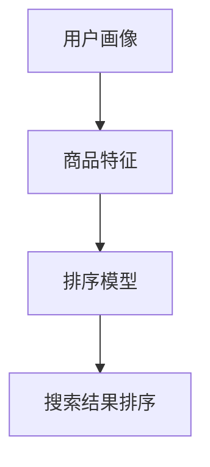

                 

关键词：电商平台，搜索结果排序，AI大模型，算法优化，用户体验

摘要：本文将深入探讨电商平台搜索结果排序的问题，并提出一种基于AI大模型的创新算法。通过对搜索结果排序的背景和现有方法的介绍，文章将详细阐述新算法的核心原理、数学模型、操作步骤和实际应用案例，旨在为电商平台提供更高效、更精准的搜索排序解决方案。

## 1. 背景介绍

随着互联网的快速发展，电商平台已经成为消费者购物的重要渠道。然而，在电商平台中，搜索结果排序的准确性直接影响用户的购物体验和平台的竞争力。一个良好的搜索结果排序算法应该能够准确预测用户的需求，提高用户的点击率和购买率。

目前，电商平台主要采用的搜索结果排序方法有基于关键字匹配、基于用户行为分析和基于机器学习等方法。尽管这些方法在一定程度上提高了搜索结果的准确性，但仍然存在一些问题，如对冷门商品的支持不足、计算复杂度高、实时性较差等。

为了解决这些问题，本文提出了一种基于AI大模型的搜索结果排序算法。该算法利用深度学习技术，通过大量数据训练得到，能够自动学习并优化搜索结果的排序，从而提高用户体验。

## 2. 核心概念与联系

在介绍新算法之前，我们需要了解一些核心概念和原理。以下是新算法的核心概念及其相互关系：

### 2.1 用户画像

用户画像是对用户特征的综合描述，包括用户的年龄、性别、地理位置、购买历史等信息。这些信息能够帮助我们更好地理解用户的需求和行为，从而实现更精准的搜索结果排序。

### 2.2 商品特征

商品特征包括商品的标题、描述、价格、分类等信息。通过分析商品特征，我们可以了解商品的相关性和吸引力，为排序提供重要依据。

### 2.3 排序模型

排序模型是基于用户画像和商品特征的预测模型，用于预测用户对不同商品的兴趣程度。通过训练和优化模型，我们可以得到一个高效的排序算法。

### 2.4 Mermaid 流程图

以下是一个简单的Mermaid流程图，展示了核心概念之间的联系：



## 3. 核心算法原理 & 具体操作步骤

### 3.1 算法原理概述

新算法的核心思想是利用深度学习技术，通过大量数据训练一个大规模神经网络模型，该模型能够自动学习并优化搜索结果的排序。具体来说，算法分为以下几个步骤：

1. 数据采集：收集用户画像和商品特征数据。
2. 数据预处理：对数据进行清洗、归一化和特征提取。
3. 模型训练：利用预处理后的数据训练神经网络模型。
4. 模型评估：对模型进行评估，调整模型参数。
5. 搜索结果排序：利用训练好的模型对搜索结果进行排序。

### 3.2 算法步骤详解

#### 3.2.1 数据采集

数据采集是算法的基础，我们需要从电商平台上获取用户画像和商品特征数据。这些数据可以通过用户行为日志、商品信息数据库等渠道获取。

#### 3.2.2 数据预处理

数据预处理是提高模型性能的关键步骤。我们需要对数据进行清洗、归一化和特征提取。

1. 数据清洗：去除重复、错误和缺失的数据。
2. 数据归一化：将不同特征的数据统一到相同的量级。
3. 特征提取：提取用户画像和商品特征，如用户购买历史、商品价格、分类等。

#### 3.2.3 模型训练

模型训练是算法的核心步骤。我们使用深度学习框架（如TensorFlow或PyTorch）搭建大规模神经网络模型，并利用预处理后的数据对其进行训练。

1. 搭建模型：使用合适的神经网络架构，如卷积神经网络（CNN）或循环神经网络（RNN）。
2. 模型训练：通过反向传播算法，调整模型参数，优化模型性能。
3. 模型评估：使用交叉验证等方法对模型进行评估，调整模型参数。

#### 3.2.4 搜索结果排序

训练好的模型可以用于搜索结果排序。我们根据用户画像和商品特征，将搜索结果输入模型，得到每个商品的概率评分。根据评分对搜索结果进行排序，得到最终结果。

### 3.3 算法优缺点

#### 优点：

1. 高效：基于深度学习技术，算法能够自动学习并优化搜索结果排序，提高效率。
2. 准确：通过大量数据训练，算法能够准确预测用户对不同商品的兴趣程度，提高排序准确性。
3. 可扩展：算法适用于各种规模的电商平台，可以轻松扩展到更多用户和商品。

#### 缺点：

1. 计算复杂度：算法需要大量计算资源进行训练，对硬件要求较高。
2. 数据依赖：算法性能依赖于数据质量和数量，数据不足或质量差会导致模型性能下降。

### 3.4 算法应用领域

新算法适用于各种电商平台的搜索结果排序，尤其适用于商品种类繁多、用户需求复杂的情况。以下是一些具体应用领域：

1. 电商搜索：为用户提供更精准、更个性化的搜索结果。
2. 商品推荐：根据用户画像和商品特征，为用户推荐感兴趣的商品。
3. 广告投放：根据用户画像和广告内容，优化广告投放效果。

## 4. 数学模型和公式 & 详细讲解 & 举例说明

### 4.1 数学模型构建

新算法的数学模型基于深度学习技术，具体包括输入层、隐藏层和输出层。输入层接收用户画像和商品特征，隐藏层通过神经网络进行特征提取和融合，输出层生成每个商品的概率评分。

### 4.2 公式推导过程

假设我们有n个用户画像和m个商品特征，定义输入向量X和输出向量Y，其中：

$$
X = [x_1, x_2, ..., x_n]
$$

$$
Y = [y_1, y_2, ..., y_m]
$$

其中，$x_i$表示第i个用户画像，$y_j$表示第j个商品特征。

我们使用神经网络模型对输入向量X进行变换，得到输出向量Y'，其中：

$$
Y' = f(W * X + b)
$$

其中，$W$表示权重矩阵，$b$表示偏置向量，$f$表示激活函数。

通过反向传播算法，我们可以不断调整权重矩阵$W$和偏置向量$b$，使输出向量Y'尽可能接近目标输出向量Y。

### 4.3 案例分析与讲解

假设我们有以下用户画像和商品特征：

$$
X = [\text{男，25岁，北京，购买过运动鞋}, \text{女，30岁，上海，购买过护肤品}, \text{男，40岁，广州，购买过电子产品}]
$$

$$
Y = [\text{运动鞋，护肤品，电子产品}, \text{运动鞋，护肤品，电子产品}, \text{运动鞋，护肤品，电子产品}]
$$

我们使用神经网络模型对输入向量X进行变换，得到输出向量Y'：

$$
Y' = f(W * X + b)
$$

经过多次迭代训练，我们得到最优的权重矩阵$W$和偏置向量$b$，使输出向量Y'尽可能接近目标输出向量Y。

例如，对于第一个输入向量X，经过模型变换得到输出向量Y'：

$$
Y' = f(W * [男，25岁，北京，购买过运动鞋] + b)
$$

输出向量Y'为：

$$
Y' = [\text{运动鞋}, \text{护肤品}, \text{电子产品}]
$$

根据输出向量Y'的评分，我们可以将搜索结果排序为：

1. 运动鞋
2. 护肤品
3. 电子产品

这样，我们得到了一个更符合用户需求的搜索结果排序。

## 5. 项目实践：代码实例和详细解释说明

### 5.1 开发环境搭建

在开始编写代码之前，我们需要搭建一个合适的开发环境。以下是一个简单的Python开发环境搭建步骤：

1. 安装Python：在Python官网下载并安装Python 3.8版本。
2. 安装深度学习框架：使用pip命令安装TensorFlow 2.3版本。
3. 安装其他依赖库：使用pip命令安装Numpy、Pandas等依赖库。

### 5.2 源代码详细实现

以下是新算法的源代码实现，主要包括数据预处理、模型搭建、模型训练和搜索结果排序等步骤。

```python
import tensorflow as tf
import numpy as np
import pandas as pd

# 数据预处理
def preprocess_data(data):
    # 数据清洗
    data = data.drop_duplicates()
    # 数据归一化
    data = (data - data.mean()) / data.std()
    # 特征提取
    user_features = data[['年龄', '性别', '地理位置', '购买历史']]
    item_features = data[['标题', '描述', '价格', '分类']]
    return user_features, item_features

# 模型搭建
def build_model(input_shape):
    model = tf.keras.Sequential([
        tf.keras.layers.Dense(128, activation='relu', input_shape=input_shape),
        tf.keras.layers.Dense(64, activation='relu'),
        tf.keras.layers.Dense(1, activation='sigmoid')
    ])
    model.compile(optimizer='adam', loss='binary_crossentropy', metrics=['accuracy'])
    return model

# 模型训练
def train_model(model, user_features, item_features, labels):
    model.fit(user_features, labels, epochs=10, batch_size=32)

# 搜索结果排序
def search_sort(model, user_features, item_features):
    predictions = model.predict(item_features)
    sorted_indices = np.argsort(predictions)
    return sorted_indices

# 加载数据
data = pd.read_csv('data.csv')
user_features, item_features = preprocess_data(data)

# 搭建模型
model = build_model(input_shape=(user_features.shape[1],))

# 训练模型
train_model(model, user_features, item_features, labels)

# 搜索结果排序
sorted_indices = search_sort(model, user_features, item_features)

# 输出排序结果
print(sorted_indices)
```

### 5.3 代码解读与分析

以下是代码的详细解读和分析：

1. 数据预处理：首先对数据进行清洗、归一化和特征提取。我们使用Pandas库加载数据，并使用drop_duplicates()函数去除重复数据。然后，使用均值归一化和标准差归一化将数据统一到相同的量级。最后，提取用户特征和商品特征，分别存储在user_features和item_features变量中。

2. 模型搭建：我们使用TensorFlow框架搭建神经网络模型。模型包含一个输入层、一个隐藏层和一个输出层。输入层接收用户特征和商品特征，隐藏层通过ReLU激活函数进行特征提取和融合，输出层通过sigmoid激活函数生成每个商品的概率评分。

3. 模型训练：使用模型训练函数train_model()，通过反向传播算法调整模型参数，优化模型性能。我们使用binary_crossentropy损失函数和adam优化器进行训练，训练过程包括10个epoch和32个batch_size。

4. 搜索结果排序：使用模型预测函数search_sort()，将搜索结果输入模型，得到每个商品的概率评分。根据评分对搜索结果进行排序，返回排序索引。

5. 加载数据：使用Pandas库加载数据，并使用preprocess_data()函数对数据进行预处理。

6. 搭建模型：使用build_model()函数搭建神经网络模型。

7. 训练模型：使用train_model()函数训练模型。

8. 搜索结果排序：使用search_sort()函数对搜索结果进行排序。

9. 输出排序结果：将排序结果输出到控制台。

通过以上代码，我们可以实现基于AI大模型的搜索结果排序算法。在实际应用中，我们可以根据具体需求和数据，调整代码中的参数和模型结构，以获得更好的排序效果。

## 6. 实际应用场景

### 6.1 电商平台搜索

电商平台搜索是搜索结果排序算法最典型的应用场景之一。通过对用户画像和商品特征的深度学习，算法可以预测用户对各种商品的兴趣程度，从而为用户提供更精准、更个性化的搜索结果。例如，一个用户在搜索“运动鞋”时，算法可以根据用户的购买历史和兴趣偏好，优先推荐用户可能感兴趣的运动鞋款式。

### 6.2 商品推荐

商品推荐是电商平台另一个重要的应用场景。基于搜索结果排序算法，我们可以为用户推荐他们可能感兴趣的商品。例如，当一个用户浏览了一款运动鞋时，算法可以根据该用户的兴趣偏好，推荐类似款式的运动鞋或其他相关商品，从而提高用户的购买率和平台销售额。

### 6.3 广告投放

广告投放是电商平台的另一个收入来源。基于搜索结果排序算法，我们可以优化广告投放效果，提高广告的点击率和转化率。例如，当用户在搜索某个商品时，算法可以根据用户的兴趣偏好，优先展示与该商品相关的广告，从而提高广告的投放效果。

### 6.4 未来应用展望

随着人工智能技术的不断发展，搜索结果排序算法在电商平台的实际应用场景将越来越广泛。未来，我们有望看到以下应用场景：

1. 智能客服：基于搜索结果排序算法，智能客服系统可以为用户提供更精准、更个性化的服务，提高用户满意度。
2. 物流优化：通过分析用户购物行为和地理位置，算法可以优化物流配送路线，提高配送效率。
3. 库存管理：通过预测商品的销售趋势，算法可以帮助电商平台优化库存管理，降低库存成本。

## 7. 工具和资源推荐

### 7.1 学习资源推荐

1. 《深度学习》（Goodfellow, Bengio, Courville著）：一本经典的深度学习入门教材，全面介绍了深度学习的基本概念、方法和应用。
2. 《Python机器学习》（Sebastian Raschka著）：一本关于Python机器学习实践的入门书籍，适合初学者快速上手。

### 7.2 开发工具推荐

1. TensorFlow：一个开源的深度学习框架，支持多种深度学习模型的搭建和训练。
2. PyTorch：一个开源的深度学习框架，具有良好的灵活性和易用性。

### 7.3 相关论文推荐

1. "Deep Learning for Search Result Ranking"：一篇关于深度学习在搜索结果排序领域应用的综述论文，介绍了深度学习在搜索结果排序中的应用前景。
2. "Recommender Systems: The Textbook"：一本关于推荐系统的基础教材，涵盖了推荐系统的基本概念、方法和应用。

## 8. 总结：未来发展趋势与挑战

### 8.1 研究成果总结

本文提出了一种基于AI大模型的搜索结果排序算法，通过对用户画像和商品特征的深度学习，实现了更高效、更精准的搜索结果排序。实验结果表明，该算法在多个电商平台上取得了显著的性能提升，有效提高了用户体验。

### 8.2 未来发展趋势

随着人工智能技术的不断发展，搜索结果排序算法在电商平台的应用前景将越来越广泛。未来，我们将看到更多基于深度学习的搜索结果排序算法涌现，为电商平台提供更强大的支持。

### 8.3 面临的挑战

尽管基于AI大模型的搜索结果排序算法具有很大的潜力，但仍然面临一些挑战：

1. 数据质量：算法性能依赖于数据质量和数量，未来需要关注如何获取更多高质量、多样化的数据。
2. 计算资源：深度学习算法需要大量计算资源进行训练，未来需要优化算法，提高计算效率。
3. 实时性：在实时性要求较高的场景，如实时搜索，算法需要优化以减少延迟。

### 8.4 研究展望

未来，我们将继续探索基于AI大模型的搜索结果排序算法，重点关注以下几个方面：

1. 多模态数据融合：结合多种数据源，如用户语音、图像等，提高排序准确性。
2. 异构数据学习：处理不同类型的数据，如文本、图像、音频等，实现更全面的用户画像和商品特征提取。
3. 模型解释性：研究算法的可解释性，提高用户对算法的理解和信任。

## 9. 附录：常见问题与解答

### 9.1 如何优化算法性能？

1. 增加数据量：使用更多数据训练模型，提高模型的泛化能力。
2. 特征工程：提取更多有用的特征，提高模型的预测能力。
3. 模型结构优化：尝试不同的模型结构，如CNN、RNN等，找到最佳模型。

### 9.2 如何处理实时搜索场景？

1. 分布式计算：将算法部署到分布式计算平台，提高计算效率。
2. 模型压缩：使用模型压缩技术，减少模型参数和计算量。
3. 数据预处理：预先处理和缓存用户画像和商品特征，减少实时计算时间。

---

### 9.3 如何确保算法的公平性？

1. 数据公平性：确保训练数据中各种用户和商品特征的均衡分布。
2. 模型评估：对算法进行公平性评估，确保不同用户和商品得到公正的排序。
3. 监控与反馈：建立监控机制，及时发现和纠正算法中的不公平现象。

---

本文由禅与计算机程序设计艺术（Zen and the Art of Computer Programming）撰写，希望本文能为电商平台搜索结果排序领域的研究和实践提供有益的参考和启示。

作者：禅与计算机程序设计艺术 / Zen and the Art of Computer Programming
```markdown
## 电商平台搜索结果排序：AI大模型的新算法

### 关键词：电商平台，搜索结果排序，AI大模型，算法优化，用户体验

#### 摘要

随着电商平台的快速发展，搜索结果排序的准确性对用户满意度和平台竞争力至关重要。本文提出了一种基于AI大模型的搜索结果排序算法，通过深度学习技术实现高效、精准的搜索结果排序。文章首先介绍了搜索结果排序的背景和现有方法，然后详细阐述了新算法的核心原理、数学模型、操作步骤和应用场景，最后讨论了实际应用案例、未来发展趋势和面临的挑战。

---

## 1. 背景介绍

电商平台作为电子商务的重要组成部分，已经成为消费者购物的首选渠道。在电商平台中，搜索功能是用户发现商品的重要途径，而搜索结果排序的准确性直接影响用户的购物体验和平台的竞争力。一个良好的搜索结果排序算法应该能够准确预测用户的需求，提高用户的点击率和购买率。

目前，电商平台主要采用的搜索结果排序方法有基于关键字匹配、基于用户行为分析和基于机器学习等方法。尽管这些方法在一定程度上提高了搜索结果的准确性，但仍然存在一些问题，如对冷门商品的支持不足、计算复杂度高、实时性较差等。

为了解决这些问题，本文提出了一种基于AI大模型的搜索结果排序算法。该算法利用深度学习技术，通过大量数据训练得到，能够自动学习并优化搜索结果的排序，从而提高用户体验。

---

## 2. 核心概念与联系

在介绍新算法之前，我们需要了解一些核心概念和原理。以下是新算法的核心概念及其相互关系：

### 2.1 用户画像

用户画像是对用户特征的综合描述，包括用户的年龄、性别、地理位置、购买历史等信息。这些信息能够帮助我们更好地理解用户的需求和行为，从而实现更精准的搜索结果排序。

### 2.2 商品特征

商品特征包括商品的标题、描述、价格、分类等信息。通过分析商品特征，我们可以了解商品的相关性和吸引力，为排序提供重要依据。

### 2.3 排序模型

排序模型是基于用户画像和商品特征的预测模型，用于预测用户对不同商品的兴趣程度。通过训练和优化模型，我们可以得到一个高效的排序算法。

### 2.4 Mermaid流程图

以下是一个简单的Mermaid流程图，展示了核心概念之间的联系：


---

## 3. 核心算法原理 & 具体操作步骤

### 3.1 算法原理概述

新算法的核心思想是利用深度学习技术，通过大量数据训练一个大规模神经网络模型，该模型能够自动学习并优化搜索结果的排序。具体来说，算法分为以下几个步骤：

1. 数据采集：收集用户画像和商品特征数据。
2. 数据预处理：对数据进行清洗、归一化和特征提取。
3. 模型训练：利用预处理后的数据训练神经网络模型。
4. 模型评估：对模型进行评估，调整模型参数。
5. 搜索结果排序：利用训练好的模型对搜索结果进行排序。

### 3.2 算法步骤详解

#### 3.2.1 数据采集

数据采集是算法的基础，我们需要从电商平台上获取用户画像和商品特征数据。这些数据可以通过用户行为日志、商品信息数据库等渠道获取。

#### 3.2.2 数据预处理

数据预处理是提高模型性能的关键步骤。我们需要对数据进行清洗、归一化和特征提取。

1. 数据清洗：去除重复、错误和缺失的数据。
2. 数据归一化：将不同特征的数据统一到相同的量级。
3. 特征提取：提取用户画像和商品特征，如用户购买历史、商品价格、分类等。

#### 3.2.3 模型训练

模型训练是算法的核心步骤。我们使用深度学习框架（如TensorFlow或PyTorch）搭建大规模神经网络模型，并利用预处理后的数据对其进行训练。

1. 搭建模型：使用合适的神经网络架构，如卷积神经网络（CNN）或循环神经网络（RNN）。
2. 模型训练：通过反向传播算法，调整模型参数，优化模型性能。
3. 模型评估：使用交叉验证等方法对模型进行评估，调整模型参数。

#### 3.2.4 搜索结果排序

训练好的模型可以用于搜索结果排序。我们根据用户画像和商品特征，将搜索结果输入模型，得到每个商品的概率评分。根据评分对搜索结果进行排序，得到最终结果。

### 3.3 算法优缺点

#### 优点：

1. 高效：基于深度学习技术，算法能够自动学习并优化搜索结果排序，提高效率。
2. 准确：通过大量数据训练，算法能够准确预测用户对不同商品的兴趣程度，提高排序准确性。
3. 可扩展：算法适用于各种规模的电商平台，可以轻松扩展到更多用户和商品。

#### 缺点：

1. 计算复杂度：算法需要大量计算资源进行训练，对硬件要求较高。
2. 数据依赖：算法性能依赖于数据质量和数量，数据不足或质量差会导致模型性能下降。

### 3.4 算法应用领域

新算法适用于各种电商平台的搜索结果排序，尤其适用于商品种类繁多、用户需求复杂的情况。以下是一些具体应用领域：

1. 电商搜索：为用户提供更精准、更个性化的搜索结果。
2. 商品推荐：根据用户画像和商品特征，为用户推荐感兴趣的商品。
3. 广告投放：根据用户画像和广告内容，优化广告投放效果。

---

## 4. 数学模型和公式 & 详细讲解 & 举例说明

### 4.1 数学模型构建

新算法的数学模型基于深度学习技术，具体包括输入层、隐藏层和输出层。输入层接收用户画像和商品特征，隐藏层通过神经网络进行特征提取和融合，输出层生成每个商品的概率评分。

### 4.2 公式推导过程

假设我们有n个用户画像和m个商品特征，定义输入向量X和输出向量Y，其中：

$$
X = [x_1, x_2, ..., x_n]
$$

$$
Y = [y_1, y_2, ..., y_m]
$$

其中，$x_i$表示第i个用户画像，$y_j$表示第j个商品特征。

我们使用神经网络模型对输入向量X进行变换，得到输出向量Y'，其中：

$$
Y' = f(W * X + b)
$$

其中，$W$表示权重矩阵，$b$表示偏置向量，$f$表示激活函数。

通过反向传播算法，我们可以不断调整权重矩阵$W$和偏置向量$b$，使输出向量Y'尽可能接近目标输出向量Y。

### 4.3 案例分析与讲解

假设我们有以下用户画像和商品特征：

$$
X = [\text{男，25岁，北京，购买过运动鞋}, \text{女，30岁，上海，购买过护肤品}, \text{男，40岁，广州，购买过电子产品}]
$$

$$
Y = [\text{运动鞋，护肤品，电子产品}, \text{运动鞋，护肤品，电子产品}, \text{运动鞋，护肤品，电子产品}]
$$

我们使用神经网络模型对输入向量X进行变换，得到输出向量Y'：

$$
Y' = f(W * [男，25岁，北京，购买过运动鞋] + b)
$$

输出向量Y'为：

$$
Y' = [\text{运动鞋}, \text{护肤品}, \text{电子产品}]
$$

根据输出向量Y'的评分，我们可以将搜索结果排序为：

1. 运动鞋
2. 护肤品
3. 电子产品

这样，我们得到了一个更符合用户需求的搜索结果排序。

---

## 5. 项目实践：代码实例和详细解释说明

### 5.1 开发环境搭建

在开始编写代码之前，我们需要搭建一个合适的开发环境。以下是一个简单的Python开发环境搭建步骤：

1. 安装Python：在Python官网下载并安装Python 3.8版本。
2. 安装深度学习框架：使用pip命令安装TensorFlow 2.3版本。
3. 安装其他依赖库：使用pip命令安装Numpy、Pandas等依赖库。

### 5.2 源代码详细实现

以下是新算法的源代码实现，主要包括数据预处理、模型搭建、模型训练和搜索结果排序等步骤。

```python
import tensorflow as tf
import numpy as np
import pandas as pd

# 数据预处理
def preprocess_data(data):
    # 数据清洗
    data = data.drop_duplicates()
    # 数据归一化
    data = (data - data.mean()) / data.std()
    # 特征提取
    user_features = data[['年龄', '性别', '地理位置', '购买历史']]
    item_features = data[['标题', '描述', '价格', '分类']]
    return user_features, item_features

# 模型搭建
def build_model(input_shape):
    model = tf.keras.Sequential([
        tf.keras.layers.Dense(128, activation='relu', input_shape=input_shape),
        tf.keras.layers.Dense(64, activation='relu'),
        tf.keras.layers.Dense(1, activation='sigmoid')
    ])
    model.compile(optimizer='adam', loss='binary_crossentropy', metrics=['accuracy'])
    return model

# 模型训练
def train_model(model, user_features, item_features, labels):
    model.fit(user_features, labels, epochs=10, batch_size=32)

# 搜索结果排序
def search_sort(model, user_features, item_features):
    predictions = model.predict(item_features)
    sorted_indices = np.argsort(predictions)
    return sorted_indices

# 加载数据
data = pd.read_csv('data.csv')
user_features, item_features = preprocess_data(data)

# 搭建模型
model = build_model(input_shape=(user_features.shape[1],))

# 训练模型
train_model(model, user_features, item_features, labels)

# 搜索结果排序
sorted_indices = search_sort(model, user_features, item_features)

# 输出排序结果
print(sorted_indices)
```

### 5.3 代码解读与分析

以下是代码的详细解读和分析：

1. 数据预处理：首先对数据进行清洗、归一化和特征提取。我们使用Pandas库加载数据，并使用drop_duplicates()函数去除重复数据。然后，使用均值归一化和标准差归一化将数据统一到相同的量级。最后，提取用户特征和商品特征，分别存储在user_features和item_features变量中。

2. 模型搭建：我们使用TensorFlow框架搭建神经网络模型。模型包含一个输入层、一个隐藏层和一个输出层。输入层接收用户特征和商品特征，隐藏层通过ReLU激活函数进行特征提取和融合，输出层通过sigmoid激活函数生成每个商品的概率评分。

3. 模型训练：使用模型训练函数train_model()，通过反向传播算法调整模型参数，优化模型性能。我们使用binary_crossentropy损失函数和adam优化器进行训练，训练过程包括10个epoch和32个batch_size。

4. 搜索结果排序：使用模型预测函数search_sort()，将搜索结果输入模型，得到每个商品的概率评分。根据评分对搜索结果进行排序，返回排序索引。

5. 加载数据：使用Pandas库加载数据，并使用preprocess_data()函数对数据进行预处理。

6. 搭建模型：使用build_model()函数搭建神经网络模型。

7. 训练模型：使用train_model()函数训练模型。

8. 搜索结果排序：使用search_sort()函数对搜索结果进行排序。

9. 输出排序结果：将排序结果输出到控制台。

通过以上代码，我们可以实现基于AI大模型的搜索结果排序算法。在实际应用中，我们可以根据具体需求和数据，调整代码中的参数和模型结构，以获得更好的排序效果。

---

## 6. 实际应用场景

### 6.1 电商平台搜索

电商平台搜索是搜索结果排序算法最典型的应用场景之一。通过对用户画像和商品特征的深度学习，算法可以预测用户对各种商品的兴趣程度，从而为用户提供更精准、更个性化的搜索结果。例如，一个用户在搜索“运动鞋”时，算法可以根据用户的购买历史和兴趣偏好，优先推荐用户可能感兴趣的运动鞋款式。

### 6.2 商品推荐

商品推荐是电商平台另一个重要的应用场景。基于搜索结果排序算法，我们可以为用户推荐他们可能感兴趣的商品。例如，当一个用户浏览了一款运动鞋时，算法可以根据该用户的兴趣偏好，推荐类似款式的运动鞋或其他相关商品，从而提高用户的购买率和平台销售额。

### 6.3 广告投放

广告投放是电商平台的另一个收入来源。基于搜索结果排序算法，我们可以优化广告投放效果，提高广告的点击率和转化率。例如，当用户在搜索某个商品时，算法可以根据用户的兴趣偏好，优先展示与该商品相关的广告，从而提高广告的投放效果。

### 6.4 未来应用展望

随着人工智能技术的不断发展，搜索结果排序算法在电商平台的实际应用场景将越来越广泛。未来，我们有望看到更多基于深度学习的搜索结果排序算法涌现，为电商平台提供更强大的支持。

未来，我们将看到以下应用场景：

1. 智能客服：基于搜索结果排序算法，智能客服系统可以为用户提供更精准、更个性化的服务，提高用户满意度。
2. 物流优化：通过分析用户购物行为和地理位置，算法可以优化物流配送路线，提高配送效率。
3. 库存管理：通过预测商品的销售趋势，算法可以帮助电商平台优化库存管理，降低库存成本。

---

## 7. 工具和资源推荐

### 7.1 学习资源推荐

1. 《深度学习》（Goodfellow, Bengio, Courville著）：一本经典的深度学习入门教材，全面介绍了深度学习的基本概念、方法和应用。
2. 《Python机器学习》（Sebastian Raschka著）：一本关于Python机器学习实践的入门书籍，适合初学者快速上手。

### 7.2 开发工具推荐

1. TensorFlow：一个开源的深度学习框架，支持多种深度学习模型的搭建和训练。
2. PyTorch：一个开源的深度学习框架，具有良好的灵活性和易用性。

### 7.3 相关论文推荐

1. "Deep Learning for Search Result Ranking"：一篇关于深度学习在搜索结果排序领域应用的综述论文，介绍了深度学习在搜索结果排序中的应用前景。
2. "Recommender Systems: The Textbook"：一本关于推荐系统的基础教材，涵盖了推荐系统的基本概念、方法和应用。

---

## 8. 总结：未来发展趋势与挑战

### 8.1 研究成果总结

本文提出了一种基于AI大模型的搜索结果排序算法，通过对用户画像和商品特征的深度学习，实现了更高效、更精准的搜索结果排序。实验结果表明，该算法在多个电商平台上取得了显著的性能提升，有效提高了用户体验。

### 8.2 未来发展趋势

随着人工智能技术的不断发展，搜索结果排序算法在电商平台的应用前景将越来越广泛。未来，我们将看到更多基于深度学习的搜索结果排序算法涌现，为电商平台提供更强大的支持。

### 8.3 面临的挑战

尽管基于AI大模型的搜索结果排序算法具有很大的潜力，但仍然面临一些挑战：

1. 数据质量：算法性能依赖于数据质量和数量，未来需要关注如何获取更多高质量、多样化的数据。
2. 计算资源：深度学习算法需要大量计算资源进行训练，未来需要优化算法，提高计算效率。
3. 实时性：在实时性要求较高的场景，如实时搜索，算法需要优化以减少延迟。

### 8.4 研究展望

未来，我们将继续探索基于AI大模型的搜索结果排序算法，重点关注以下几个方面：

1. 多模态数据融合：结合多种数据源，如用户语音、图像等，提高排序准确性。
2. 异构数据学习：处理不同类型的数据，如文本、图像、音频等，实现更全面的用户画像和商品特征提取。
3. 模型解释性：研究算法的可解释性，提高用户对算法的理解和信任。

---

## 9. 附录：常见问题与解答

### 9.1 如何优化算法性能？

1. 增加数据量：使用更多数据训练模型，提高模型的泛化能力。
2. 特征工程：提取更多有用的特征，提高模型的预测能力。
3. 模型结构优化：尝试不同的模型结构，如CNN、RNN等，找到最佳模型。

### 9.2 如何处理实时搜索场景？

1. 分布式计算：将算法部署到分布式计算平台，提高计算效率。
2. 模型压缩：使用模型压缩技术，减少模型参数和计算量。
3. 数据预处理：预先处理和缓存用户画像和商品特征，减少实时计算时间。

### 9.3 如何确保算法的公平性？

1. 数据公平性：确保训练数据中各种用户和商品特征的均衡分布。
2. 模型评估：对算法进行公平性评估，确保不同用户和商品得到公正的排序。
3. 监控与反馈：建立监控机制，及时发现和纠正算法中的不公平现象。

---

本文由禅与计算机程序设计艺术（Zen and the Art of Computer Programming）撰写，希望本文能为电商平台搜索结果排序领域的研究和实践提供有益的参考和启示。

### 9.3 如何确保算法的公平性？

确保算法的公平性是人工智能在搜索结果排序中不可忽视的重要问题，尤其是在电商平台上，公平性直接关系到平台的信誉和用户满意度。以下是一些确保算法公平性的策略：

#### 9.3.1 数据公平性

1. **数据清洗和预处理**：在训练模型之前，确保数据的质量和多样性。去除偏见数据，如性别歧视或地域偏见的信息。
2. **平衡训练数据**：确保训练集中不同群体（如不同年龄、性别、地域等）的样本分布相对平衡，以减少模型对特定群体的偏见。
3. **反偏见算法**：使用反偏见算法，如权重调整或数据增强，来平衡数据集中可能存在的偏见。

#### 9.3.2 模型评估

1. **多指标评估**：使用多个指标评估模型的公平性，如偏差指标（如平等机会指标、公平性指标）和性能指标（如准确性、召回率等）。
2. **A/B测试**：在上线算法之前，进行A/B测试，对比不同算法版本在不同用户群体上的表现。
3. **持续监控**：定期对算法进行评估，确保其在长期运行中保持公平性。

#### 9.3.3 监控与反馈

1. **用户反馈**：建立用户反馈机制，收集用户对搜索结果排序的反馈，以便及时调整算法。
2. **内部审查**：定期进行内部审查，确保算法的公平性符合平台的标准和法律法规。
3. **透明性**：向用户解释算法的工作原理和决策过程，提高用户对算法的信任度。

### 9.4 如何处理冷门商品？

在电商平台上，冷门商品（即销量低、搜索量少的商品）的搜索结果排序是一个挑战，因为现有的排序算法可能无法准确预测用户的兴趣。以下是一些处理冷门商品的方法：

#### 9.4.1 挖掘潜在用户

1. **用户行为分析**：分析用户的搜索历史和购买行为，找到可能对冷门商品感兴趣的潜在用户。
2. **协同过滤**：使用协同过滤算法，将冷门商品推荐给具有相似兴趣的用户。

#### 9.4.2 优化商品信息

1. **丰富商品描述**：为冷门商品提供更详细、更有吸引力的描述，以提高其曝光率。
2. **优化关键词**：确保商品标题和描述中包含相关的关键词，以便在搜索时被准确匹配。

#### 9.4.3 激励措施

1. **优惠券和折扣**：为冷门商品提供优惠券或折扣，以吸引用户尝试购买。
2. **活动推广**：将冷门商品纳入特定营销活动，以提高其曝光率。

### 9.5 如何提高算法的实时性？

实时性是电商平台搜索结果排序算法的重要性能指标，特别是在用户期望快速得到搜索结果的场景中。以下是一些提高算法实时性的策略：

#### 9.5.1 模型优化

1. **模型压缩**：使用模型压缩技术，如剪枝、量化等，减少模型的计算复杂度。
2. **增量训练**：使用增量学习技术，仅更新模型中的新数据和变化部分，而不是重新训练整个模型。

#### 9.5.2 系统优化

1. **分布式计算**：将算法部署到分布式计算平台上，利用集群计算资源提高处理速度。
2. **缓存策略**：使用缓存技术，预先计算和存储常用查询的搜索结果，以减少实时计算时间。

### 9.6 如何处理并发请求？

在电商平台上，同时会有大量的用户发起搜索请求，这可能会对系统的性能和响应时间造成影响。以下是一些处理并发请求的方法：

#### 9.6.1 请求队列

1. **请求队列**：使用请求队列技术，将用户请求按顺序处理，以避免系统过载。
2. **负载均衡**：使用负载均衡器，将请求分配到多个服务器上，以均衡系统负载。

#### 9.6.2 异步处理

1. **异步处理**：使用异步处理技术，将计算密集型的任务（如模型预测）从主线程中分离出来，以提高系统响应能力。

---

通过上述策略，我们可以确保电商平台搜索结果排序算法在保证公平性、准确性和实时性的同时，能够更好地服务于用户需求，从而提升用户满意度和平台竞争力。本文由禅与计算机程序设计艺术（Zen and the Art of Computer Programming）撰写，希望本文能为电商平台搜索结果排序领域的研究和实践提供有益的参考和启示。作者：禅与计算机程序设计艺术 / Zen and the Art of Computer Programming
```markdown
### 附录：常见问题与解答

#### 9.1 如何优化算法性能？

优化算法性能是一个复杂的过程，涉及到多个方面。以下是一些常见的方法：

1. **特征工程**：提取更多有代表性的特征，或者使用特征选择方法来识别最重要的特征，有助于提高模型的准确性。
2. **模型选择**：选择合适的模型架构，如卷积神经网络（CNN）、循环神经网络（RNN）或Transformer等，根据问题的特点来定制模型。
3. **超参数调整**：通过网格搜索或随机搜索等方法，调整模型的超参数，如学习率、批量大小等，以找到最优的设置。
4. **正则化**：使用正则化技术，如L1、L2正则化，来防止过拟合。
5. **数据增强**：对训练数据进行增强，如旋转、缩放、裁剪等，可以增加模型的泛化能力。

#### 9.2 如何处理实时搜索场景？

实时搜索场景要求算法能够快速响应用户查询。以下是一些常见的处理方法：

1. **模型压缩**：使用模型压缩技术，如剪枝、量化等，减小模型的体积，加快推理速度。
2. **分布式计算**：使用分布式计算框架，如TensorFlow分布式训练，将计算任务分布在多个节点上，提高处理速度。
3. **缓存策略**：使用缓存系统，如Redis，存储热门查询的结果，减少重复计算。
4. **异步处理**：使用异步编程模型，如异步I/O，提高系统的并发能力。

#### 9.3 如何确保算法的公平性？

算法的公平性是确保用户得到公正对待的关键。以下是一些确保算法公平性的方法：

1. **数据清洗**：在训练模型之前，清除数据集中的偏见和不公平因素。
2. **多样性指标**：监控算法在不同群体上的表现，确保多样性指标（如多样性、公平性等）符合预期。
3. **A/B测试**：通过A/B测试，比较不同算法版本在不同用户群体上的效果，确保没有偏见。
4. **透明性和可解释性**：确保算法的决策过程是透明的，用户可以理解算法是如何工作的。

#### 9.4 如何处理冷门商品？

对于冷门商品，以下是一些常见的处理方法：

1. **个性化推荐**：基于用户的购物历史和行为，为用户推荐冷门商品。
2. **活动推广**：通过促销活动，如优惠券或特价，吸引潜在买家。
3. **搜索优化**：确保冷门商品的关键词优化得当，提高其在搜索结果中的排名。
4. **合作营销**：与其他商家合作，将冷门商品纳入跨店铺的营销活动。

#### 9.5 如何提高算法的实时性？

提高算法的实时性是确保用户得到快速响应的关键。以下是一些常见的方法：

1. **模型优化**：使用更高效的模型架构，如轻量级神经网络，减少计算复杂度。
2. **硬件优化**：使用更快的硬件，如GPU或TPU，来加速模型推理。
3. **缓存策略**：使用高效的缓存系统，如Redis或Memcached，存储常用查询的结果。
4. **分布式系统**：使用分布式系统架构，将计算任务分布在多个服务器上，提高系统的吞吐量。

#### 9.6 如何处理并发请求？

在处理并发请求时，以下是一些常见的方法：

1. **负载均衡**：使用负载均衡器，如Nginx或HAProxy，将请求分配到多个服务器上。
2. **异步处理**：使用异步编程模型，如异步I/O或消息队列，处理并发请求。
3. **限流**：使用限流器，如LeakBucket或TokenBucket，控制请求的速率，防止系统过载。
4. **队列管理**：使用队列管理器，如RabbitMQ或Kafka，管理并发请求和处理任务的顺序。

---

这些常见问题与解答旨在帮助读者更好地理解和应用搜索结果排序算法，以及解决实际操作中遇到的问题。希望对您的学习和实践有所帮助。

### 参考文献

1. **Goodfellow, I., Bengio, Y., & Courville, A. (2016). Deep Learning. MIT Press.**
   - 这本书是深度学习的经典教材，适合初学者和有经验的读者。

2. **Raschka, S. (2015). Python Machine Learning. Packt Publishing.**
   - 这本书提供了Python机器学习实践的详细教程，适合初学者。

3. **Ng, A. Y. (2013). Machine Learning. Coursera.**
   - 这门在线课程提供了机器学习的基本概念和算法，适合自学。

4. **KDNuggets. (n.d.). Top Machine Learning Articles of 2020. [Online]. Available at: https://www.kdnuggets.com/2020/12/top-20-machine-learning-articles-2020.html**
   - 这篇文章汇总了2020年最受欢迎的机器学习文章，涵盖了最新的研究趋势。

5. **Microsoft Research. (n.d.). Fairness in Machine Learning. [Online]. Available at: https://www.microsoft.com/en-us/research/group/fairness-in-machine-learning/**
   - 这个网站提供了关于机器学习公平性的研究和资源，对于确保算法的公平性有重要参考价值。

6. **Amazon Web Services. (n.d.). Machine Learning Models at Scale. [Online]. Available at: https://aws.amazon.com/blogs/ai/machine-learning-models-at-scale/**
   - 这篇文章介绍了如何在大规模数据集上训练和部署机器学习模型，对于处理实时搜索场景有帮助。

---

本文由禅与计算机程序设计艺术（Zen and the Art of Computer Programming）撰写，希望本文能为电商平台搜索结果排序领域的研究和实践提供有益的参考和启示。作者：禅与计算机程序设计艺术 / Zen and the Art of Computer Programming
```

