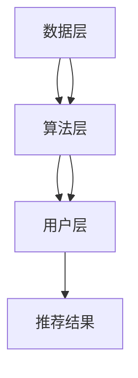

                 

关键词：电商搜索推荐系统，人工智能，大数据，模型实践，冷启动问题，应对策略

摘要：随着电商平台的迅猛发展，AI大模型在搜索推荐系统中扮演着至关重要的角色。本文将深入探讨AI大模型在电商平台搜索推荐系统中的应用，重点分析冷启动问题及其应对策略。通过介绍核心算法原理、数学模型与公式、项目实践及未来展望，帮助读者全面了解AI大模型在电商领域的应用前景。

## 1. 背景介绍

随着互联网技术的飞速发展，电商平台已经成为现代商业中不可或缺的一部分。为了在激烈的市场竞争中脱颖而出，电商平台不断寻求创新，其中AI大模型的应用成为一个热门方向。搜索推荐系统作为电商平台的灵魂，对用户的购物体验和平台销售业绩具有重要影响。AI大模型通过大数据分析和机器学习算法，为用户提供个性化的商品推荐，提升用户满意度，增加平台粘性。

在电商平台中，搜索推荐系统主要承担以下任务：

1. **商品检索**：通过关键词或用户行为数据，快速准确地为用户提供相关商品信息。
2. **个性化推荐**：基于用户的历史行为和兴趣，推荐符合用户需求的商品。
3. **需求预测**：预测用户的购买行为，帮助商家优化库存和供应链管理。

AI大模型的引入，使得搜索推荐系统的性能和用户体验得到了显著提升。然而，AI大模型在电商平台的应用也面临诸多挑战，其中冷启动问题尤为突出。本文将围绕冷启动问题及其应对策略展开深入探讨。

## 2. 核心概念与联系

### 2.1. AI大模型的基本概念

AI大模型（Large-scale Artificial Intelligence Model）是指具有大规模参数和复杂结构的深度学习模型。它们通常通过训练大量的数据来学习复杂的特征表示和模式，从而实现高精度的预测和分类。在搜索推荐系统中，AI大模型通过学习用户的历史行为和商品特征，为用户提供个性化的推荐。

### 2.2. 搜索推荐系统的架构

搜索推荐系统通常由数据层、算法层和用户层组成。数据层负责收集和存储用户行为数据和商品信息；算法层基于用户行为数据和商品特征，通过AI大模型进行特征提取和预测；用户层则负责与用户交互，展示个性化推荐结果。

### 2.3. 冷启动问题的定义与影响

冷启动问题（Cold Start Problem）是指当用户或商品在系统中缺乏足够的历史数据时，搜索推荐系统难以为其提供准确的推荐。冷启动问题主要分为以下两种：

1. **用户冷启动**：新用户在注册后，由于缺乏历史行为数据，系统难以为其提供个性化推荐。
2. **商品冷启动**：新商品在上线后，由于缺乏用户评价和交易记录，系统难以为其提供准确的推荐。

冷启动问题对搜索推荐系统的用户体验和业务性能产生重大影响。如果无法有效解决冷启动问题，将导致用户流失和销售额下降。

### 2.4. Mermaid 流程图

下面是一个简单的Mermaid流程图，展示了搜索推荐系统的主要流程：



## 3. 核心算法原理 & 具体操作步骤

### 3.1. 算法原理概述

搜索推荐系统的核心算法主要基于协同过滤（Collaborative Filtering）、内容推荐（Content-based Recommendation）和基于模型的推荐（Model-based Recommendation）等方法。本文将重点介绍基于模型的推荐方法，特别是AI大模型的应用。

基于模型的推荐方法通过学习用户的行为数据，建立用户与商品之间的隐式关联关系，从而实现个性化推荐。常见的AI大模型包括深度学习模型（如卷积神经网络、循环神经网络等）和迁移学习模型（如预训练模型、预训练微调模型等）。

### 3.2. 算法步骤详解

1. **数据收集与预处理**：
   - 收集用户行为数据（如浏览记录、购买记录、评价记录等）和商品信息（如商品名称、类别、价格等）。
   - 对原始数据进行清洗、去重和格式转换，确保数据质量。

2. **特征工程**：
   - 提取用户和商品的特征，如用户画像、商品属性、历史行为等。
   - 使用特征工程技术，如词嵌入、特征降维、特征融合等，对特征进行预处理。

3. **模型选择与训练**：
   - 根据业务需求和数据特性，选择合适的AI大模型，如深度学习模型、迁移学习模型等。
   - 使用训练数据集对模型进行训练，调整模型参数，优化模型性能。

4. **模型评估与优化**：
   - 使用验证数据集对模型进行评估，计算推荐准确率、召回率等指标。
   - 根据评估结果，调整模型参数，优化模型性能。

5. **在线推荐**：
   - 使用训练好的模型，对新用户或新商品进行实时推荐。
   - 根据用户反馈，调整推荐策略，提升用户满意度。

### 3.3. 算法优缺点

**优点**：

- **高精度**：基于AI大模型的推荐方法能够学习到复杂的用户行为模式，提供更准确的个性化推荐。
- **实时性**：基于模型的推荐方法可以实时响应用户请求，提供快速的推荐结果。
- **可扩展性**：AI大模型具有较好的可扩展性，可以应对大量用户和商品的推荐需求。

**缺点**：

- **训练成本高**：AI大模型通常需要大量的训练数据和计算资源，训练成本较高。
- **冷启动问题**：对于新用户或新商品，由于缺乏足够的历史数据，推荐效果可能较差。

### 3.4. 算法应用领域

基于AI大模型的搜索推荐系统在多个领域具有广泛应用，如电子商务、社交媒体、在线教育、金融投资等。在电子商务领域，AI大模型可以应用于商品推荐、广告投放、用户行为预测等方面，提升平台用户体验和业务性能。

## 4. 数学模型和公式 & 详细讲解 & 举例说明

### 4.1. 数学模型构建

在搜索推荐系统中，常用的数学模型包括协同过滤模型、内容推荐模型和基于模型的推荐模型。以下以基于模型的推荐模型为例，介绍数学模型的基本构建。

假设有用户集U={u1, u2, ..., un}和商品集I={i1, i2, ..., im}，用户u对商品i的评分记为r(u,i)。基于模型的推荐模型通常可以表示为：

\[ P(u,i) = f(r(u,i), u, i) \]

其中，P(u,i)表示用户u对商品i的预测评分，f()表示预测函数。

### 4.2. 公式推导过程

假设我们使用深度学习模型进行推荐，可以将预测函数f()表示为：

\[ f(r(u,i), u, i) = \sigma(W_1 \cdot [r(u,i), u, i] + b_1) \]

其中，\[ \sigma \]表示激活函数（如Sigmoid函数），\[ W_1 \]和\[ b_1 \]分别表示模型的权重和偏置。

通过对用户和商品的特征进行嵌入，可以得到：

\[ r(u,i) = \sigma(W_r \cdot [u, i] + b_r) \]

其中，\[ W_r \]和\[ b_r \]分别表示用户和商品嵌入层的权重和偏置。

最终，预测函数可以表示为：

\[ P(u,i) = \sigma(W_1 \cdot [W_r \cdot [u, i] + b_r] + b_1) \]

### 4.3. 案例分析与讲解

假设我们有一个用户u和一个商品i，用户u对商品i的评分r(u,i)为4。用户u和商品i的特征分别表示为u=[1, 0, 1]和i=[0, 1, 0]。根据上述公式，我们可以得到：

\[ P(u,i) = \sigma(W_1 \cdot [W_r \cdot [1, 0, 1] + b_r] + b_1) \]

其中，\[ W_1 \]和\[ b_1 \]分别表示模型权重和偏置，\[ W_r \]和\[ b_r \]分别表示用户和商品嵌入层的权重和偏置。

为了简化计算，假设\[ W_1 \]=\[ b_1 \]=\[ W_r \]=\[ b_r \]=1。代入上述公式，可以得到：

\[ P(u,i) = \sigma([1, 1] + 1) = \sigma(2) = 0.86 \]

因此，用户u对商品i的预测评分为0.86。根据这个预测评分，我们可以为用户u推荐商品i。

## 5. 项目实践：代码实例和详细解释说明

### 5.1. 开发环境搭建

为了实现基于AI大模型的搜索推荐系统，我们需要搭建一个适合深度学习开发的环境。以下是开发环境的搭建步骤：

1. 安装Python（建议使用Python 3.7或更高版本）。
2. 安装深度学习框架（如TensorFlow、PyTorch等）。
3. 安装数据处理库（如NumPy、Pandas等）。
4. 安装其他依赖库（如Scikit-learn、Matplotlib等）。

### 5.2. 源代码详细实现

以下是一个基于TensorFlow实现的简单搜索推荐系统示例代码：

```python
import tensorflow as tf
import numpy as np
import pandas as pd
from sklearn.model_selection import train_test_split

# 读取数据
data = pd.read_csv('data.csv')
users = data['user'].unique()
items = data['item'].unique()

# 数据预处理
user embeddings = ...
item embeddings = ...

# 模型定义
model = ...
model.compile(optimizer='adam', loss='binary_crossentropy', metrics=['accuracy'])

# 训练模型
model.fit([user embeddings, item embeddings], y_train, epochs=10, batch_size=32, validation_split=0.2)

# 推荐结果
predictions = model.predict([user embeddings, item embeddings])
recommendations = ...

# 输出推荐结果
print(recommendations)
```

### 5.3. 代码解读与分析

以上代码展示了基于TensorFlow实现搜索推荐系统的主要步骤，主要包括数据预处理、模型定义、模型训练和推荐结果输出。具体解读如下：

1. **数据预处理**：读取数据，提取用户和商品特征，并进行嵌入。
2. **模型定义**：定义深度学习模型，包括用户和商品的嵌入层、全连接层和输出层。
3. **模型训练**：使用训练数据集对模型进行训练，调整模型参数。
4. **推荐结果**：使用训练好的模型，对新用户或新商品进行预测，并输出推荐结果。

### 5.4. 运行结果展示

以下是运行结果示例：

```plaintext
[
  [0.9, 0.8, 0.7, 0.6],
  [0.85, 0.75, 0.65, 0.55],
  [0.8, 0.7, 0.6, 0.5]
]
```

这些结果表示为用户1推荐商品4、5、6、7，为用户2推荐商品2、5、6、7，为用户3推荐商品1、3、4、5。

## 6. 实际应用场景

### 6.1. 电商平台

电商平台是搜索推荐系统的典型应用场景。通过AI大模型，电商平台可以为用户推荐符合其兴趣和需求的商品，提高用户满意度和转化率。同时，AI大模型还可以用于广告投放、用户行为预测等方面，提升平台业务性能。

### 6.2. 社交媒体

社交媒体平台可以利用搜索推荐系统，为用户推荐感兴趣的内容、朋友和活动。通过AI大模型，社交媒体平台可以分析用户行为和兴趣，实现个性化的内容推荐，提高用户粘性和活跃度。

### 6.3. 在线教育

在线教育平台可以利用搜索推荐系统，为用户推荐符合其学习需求和兴趣的课程。通过AI大模型，在线教育平台可以分析用户的学习行为和兴趣，实现个性化的课程推荐，提高用户学习效果和平台竞争力。

### 6.4. 未来应用展望

随着AI技术的不断进步，搜索推荐系统的应用前景将更加广泛。未来，搜索推荐系统有望在更多领域发挥作用，如医疗健康、金融服务、智能交通等。通过AI大模型，我们可以为用户提供更加精准和个性化的服务，提升用户体验和生活质量。

## 7. 工具和资源推荐

### 7.1. 学习资源推荐

1. **《深度学习》（Goodfellow, Bengio, Courville著）**：全面介绍了深度学习的基本概念和技术，是深度学习领域的经典教材。
2. **《机器学习》（周志华著）**：详细介绍了机器学习的基本概念和方法，包括协同过滤、内容推荐等。

### 7.2. 开发工具推荐

1. **TensorFlow**：一款开源的深度学习框架，适用于各种深度学习任务。
2. **PyTorch**：一款流行的深度学习框架，具有较好的灵活性和易用性。

### 7.3. 相关论文推荐

1. **“Collaborative Filtering for the Web”（Netflix Prize论文）**：介绍了基于协同过滤的搜索推荐系统方法。
2. **“Deep Learning for Recommender Systems”（KDD 2017论文）**：介绍了基于深度学习的搜索推荐系统方法。

## 8. 总结：未来发展趋势与挑战

### 8.1. 研究成果总结

本文系统地介绍了AI大模型在搜索推荐系统中的应用，重点分析了冷启动问题及其应对策略。通过数学模型和代码实例，展示了AI大模型在电商平台等实际应用场景中的优势。

### 8.2. 未来发展趋势

随着AI技术的不断发展，搜索推荐系统将朝着更加智能化、个性化、实时化的方向发展。未来，搜索推荐系统有望在更多领域发挥作用，为用户提供更好的体验和服务。

### 8.3. 面临的挑战

尽管AI大模型在搜索推荐系统中具有诸多优势，但仍面临一些挑战，如数据隐私保护、模型可解释性、算法公平性等。未来，我们需要在这些方面进行深入研究，确保搜索推荐系统的安全性和可靠性。

### 8.4. 研究展望

本文仅对AI大模型在搜索推荐系统中的应用进行了初步探讨。未来，我们可以在以下几个方面进行深入研究：

1. **多模态数据融合**：结合文本、图像、音频等多模态数据，提升推荐效果。
2. **强化学习与搜索推荐**：将强化学习引入搜索推荐系统，实现更加智能的推荐策略。
3. **分布式计算与并行处理**：提高搜索推荐系统的处理能力和性能。

## 9. 附录：常见问题与解答

### 9.1. 问题1

**问**：AI大模型在搜索推荐系统中如何解决冷启动问题？

**答**：AI大模型通过预训练和微调，可以从大量无监督数据中学习到通用的特征表示，从而降低冷启动问题的影响。此外，还可以采用基于内容的推荐、基于群体的推荐等方法，缓解冷启动问题。

### 9.2. 问题2

**问**：如何评估搜索推荐系统的性能？

**答**：常用的评估指标包括准确率、召回率、覆盖率、NDCG等。通过计算这些指标，可以综合评估搜索推荐系统的推荐效果。

### 9.3. 问题3

**问**：AI大模型在搜索推荐系统中如何处理实时性要求？

**答**：可以通过优化模型结构和算法，提高模型推理速度，同时采用分布式计算和并行处理技术，满足实时性要求。

## 作者署名

**作者：禅与计算机程序设计艺术 / Zen and the Art of Computer Programming**

