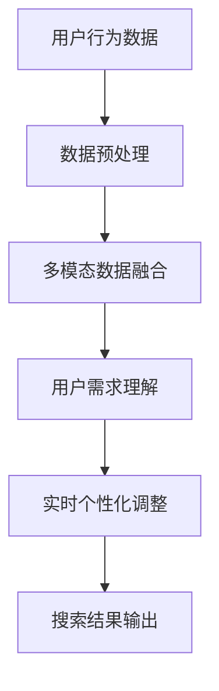

                 

关键词：电商搜索、多模态、商品排序、实时个性化技术、人工智能、算法

摘要：本文深入探讨了电商搜索中的多模态商品排序实时个性化技术。首先，我们回顾了电商搜索的背景和现状，随后详细介绍了多模态和实时个性化技术的概念及其在电商搜索中的应用。接着，我们分析了多模态商品排序的核心算法原理，详细讨论了其操作步骤、优缺点以及应用领域。文章还通过数学模型和公式，对算法进行了详细讲解，并辅以案例分析与讲解。随后，我们展示了项目实践中的代码实例和详细解释说明。最后，文章探讨了该技术的实际应用场景，并展望了未来的发展趋势与挑战。

## 1. 背景介绍

随着互联网技术的快速发展，电子商务已经成为人们生活中不可或缺的一部分。在电商平台上，商品种类繁多，价格、品牌、用户评价等属性各异，这使得用户在搜索商品时面临极大的信息过载问题。为了提高用户的搜索体验和满意度，电商平台需要实现高效、准确的商品搜索和推荐功能。

电商搜索系统通常包括三个关键模块：搜索索引、搜索算法和用户界面。其中，搜索算法是电商搜索系统的核心，直接影响搜索结果的准确性和用户满意度。传统的搜索算法通常基于关键词匹配和排名规则，但这种方法在面对复杂、多变的用户需求时，往往无法满足实时个性化的要求。

多模态（Multimodality）是指通过结合多种感官模态（如图像、文本、音频等）来获取和处理信息。多模态技术在电商搜索中的应用，使得系统能够更全面地理解用户的需求，从而实现更精准的搜索和推荐。

实时个性化（Real-time Personalization）技术是指根据用户的行为和历史数据，动态调整搜索结果和推荐内容，以满足用户的个性化需求。实时个性化技术不仅提高了用户的满意度，还能显著提升电商平台的销售额和用户粘性。

本文旨在探讨如何利用多模态和实时个性化技术，实现高效、准确的电商搜索，从而提升用户的购物体验和平台的竞争力。

## 2. 核心概念与联系

### 2.1 多模态

多模态技术是通过结合多种感官模态（如视觉、听觉、触觉等）来获取和处理信息的方法。在电商搜索中，多模态技术主要涉及以下几种模态：

- **视觉模态**：包括商品图片、视频、用户浏览记录等。
- **文本模态**：包括商品描述、用户评价、搜索关键词等。
- **听觉模态**：包括商品展示的音频、用户询问的语音等。

多模态技术的核心在于如何将不同模态的信息进行融合，以形成对用户需求的全面理解。在电商搜索中，多模态技术有助于提高搜索结果的准确性和用户的满意度。

### 2.2 实时个性化

实时个性化技术是指通过分析用户的行为数据和历史记录，动态调整搜索结果和推荐内容，以满足用户的个性化需求。实时个性化技术的核心包括：

- **用户行为分析**：通过分析用户的浏览、搜索、购买等行为，了解用户的需求和偏好。
- **数据挖掘与机器学习**：利用数据挖掘和机器学习技术，对用户行为数据进行分析，发现用户的需求模式。
- **实时调整**：根据用户的行为和偏好，实时调整搜索结果和推荐内容，以提高用户的满意度。

### 2.3 多模态与实时个性化的关系

多模态技术和实时个性化技术之间有着密切的联系。多模态技术为实时个性化提供了丰富的数据来源，使得系统能够更全面地理解用户的需求。而实时个性化技术则利用多模态数据，实现动态调整搜索结果和推荐内容，从而提高用户的满意度。

为了更好地展示多模态与实时个性化技术的联系，我们使用Mermaid流程图来描述其核心原理和架构。以下是Mermaid流程图的代码示例：



在该流程图中，用户行为数据首先经过数据预处理，然后与多模态数据进行融合，以形成对用户需求的全面理解。接下来，利用实时个性化技术，动态调整搜索结果，最终输出给用户。

## 3. 核心算法原理 & 具体操作步骤

### 3.1 算法原理概述

在电商搜索中，多模态商品排序实时个性化技术的核心在于如何将多种模态的信息进行融合，并利用这些信息对商品进行排序。以下是该算法的基本原理：

1. **数据收集与预处理**：首先，从电商平台上收集用户行为数据、商品数据和多模态数据（如图片、文本、音频等）。然后，对收集到的数据进行预处理，包括数据清洗、数据格式统一等。

2. **多模态数据融合**：将不同模态的数据进行融合，以形成一个统一的特征向量。常用的多模态数据融合方法包括基于深度学习的方法和基于模板匹配的方法。

3. **特征向量表示**：将融合后的特征向量表示为高维空间中的一个点。该空间可以看作是一个信息空间，其中的每一个点代表一个商品。

4. **排序模型构建**：利用机器学习算法，如线性回归、支持向量机（SVM）、决策树等，构建一个排序模型。该模型根据特征向量，对商品进行排序。

5. **实时个性化调整**：根据用户的行为和偏好，动态调整排序模型中的参数，以提高排序的个性化程度。常用的方法包括在线学习和模型调整。

6. **搜索结果输出**：将排序后的商品输出给用户，以实现实时个性化搜索。

### 3.2 算法步骤详解

1. **数据收集与预处理**：

    - 用户行为数据：包括用户的浏览记录、搜索记录、购买记录等。
    - 商品数据：包括商品的价格、品牌、分类、描述等。
    - 多模态数据：包括商品图片、视频、音频、用户评价等。

    对这些数据进行清洗和格式统一，以备后续处理。

2. **多模态数据融合**：

    - **基于深度学习的方法**：利用深度神经网络（如卷积神经网络（CNN））对多模态数据进行特征提取。然后，将这些特征进行融合，形成一个统一的特征向量。
    - **基于模板匹配的方法**：将不同模态的数据映射到一个共同的维度上，然后利用模板匹配方法进行特征融合。

3. **特征向量表示**：

    - 将融合后的特征向量表示为高维空间中的一个点。该空间的维度取决于特征向量的维度。

4. **排序模型构建**：

    - **线性回归**：利用线性回归模型，将特征向量映射到商品评分。然后，根据评分对商品进行排序。
    - **支持向量机（SVM）**：利用SVM模型，将特征向量映射到高维空间中的一个超平面，从而实现商品排序。
    - **决策树**：利用决策树模型，根据特征向量的不同值进行分支，从而实现商品排序。

5. **实时个性化调整**：

    - 根据用户的行为和偏好，动态调整排序模型中的参数。例如，可以调整线性回归模型的权重，或者调整SVM模型的支持向量。

6. **搜索结果输出**：

    - 将排序后的商品输出给用户，以实现实时个性化搜索。

### 3.3 算法优缺点

**优点**：

- **高效性**：多模态商品排序实时个性化技术能够充分利用多种模态的数据，提高搜索结果的准确性。
- **灵活性**：实时个性化技术可以根据用户的行为和偏好进行动态调整，从而实现更个性化的搜索体验。
- **可扩展性**：该技术可以应用到不同的电商平台上，具有较好的可扩展性。

**缺点**：

- **计算复杂性**：多模态数据融合和实时个性化调整过程较为复杂，需要较高的计算资源和时间成本。
- **数据依赖性**：该技术对用户行为数据和商品数据的依赖性较高，数据质量和数量对算法的性能有很大影响。

### 3.4 算法应用领域

多模态商品排序实时个性化技术可以应用于多种电商场景，包括：

- **商品搜索**：在电商平台上，用户可以通过输入关键词、图片或语音来搜索商品。多模态商品排序实时个性化技术可以提高搜索结果的准确性。
- **商品推荐**：电商平台可以根据用户的浏览、搜索、购买记录，利用多模态商品排序实时个性化技术，向用户推荐更符合其兴趣和需求的商品。
- **商品评价**：用户可以对购买过的商品进行评价。多模态商品排序实时个性化技术可以分析用户评价中的多模态信息，为用户提供更准确的商品评价排序。

## 4. 数学模型和公式 & 详细讲解 & 举例说明

### 4.1 数学模型构建

在多模态商品排序实时个性化技术中，数学模型构建是核心步骤之一。以下是构建数学模型的基本过程：

1. **特征向量表示**：

    - **视觉特征**：利用卷积神经网络（CNN）提取商品图片的特征向量。假设视觉特征向量为 \( \mathbf{v} \)，维度为 \( D_v \)。
    - **文本特征**：利用词嵌入（Word Embedding）技术提取商品描述和用户评价的文本特征。假设文本特征向量为 \( \mathbf{t} \)，维度为 \( D_t \)。
    - **听觉特征**：利用深度神经网络（DNN）提取商品展示的音频特征。假设听觉特征向量为 \( \mathbf{a} \)，维度为 \( D_a \)。

2. **特征融合**：

    - **加和融合**：将不同模态的特征向量进行加和，形成一个高维的特征向量。假设融合后的特征向量为 \( \mathbf{x} \)，则：
    $$ \mathbf{x} = \mathbf{v} + \mathbf{t} + \mathbf{a} $$
    - **平均融合**：将不同模态的特征向量进行平均，形成一个高维的特征向量。假设融合后的特征向量为 \( \mathbf{x} \)，则：
    $$ \mathbf{x} = \frac{\mathbf{v} + \mathbf{t} + \mathbf{a}}{3} $$

3. **排序模型**：

    - **线性回归**：假设特征向量为 \( \mathbf{x} \)，商品评分为 \( y \)，则线性回归模型为：
    $$ y = \mathbf{w} \cdot \mathbf{x} + b $$
    其中，\( \mathbf{w} \) 为权重向量，\( b \) 为偏置。

4. **实时个性化调整**：

    - **在线学习**：假设用户行为数据为 \( \mathbf{u} \)，则在线学习模型为：
    $$ \mathbf{w} = \mathbf{w} + \alpha \cdot (\mathbf{u} - \mathbf{w} \cdot \mathbf{x}) $$
    其中，\( \alpha \) 为学习率。

### 4.2 公式推导过程

为了更好地理解数学模型，我们通过一个简单的例子进行推导。

假设我们有以下三个特征向量：

- 视觉特征向量：\( \mathbf{v} = [1, 2, 3] \)，维度为 \( D_v = 3 \)。
- 文本特征向量：\( \mathbf{t} = [4, 5, 6] \)，维度为 \( D_t = 3 \)。
- 听觉特征向量：\( \mathbf{a} = [7, 8, 9] \)，维度为 \( D_a = 3 \)。

首先，我们使用加和融合方法，将这三个特征向量融合成一个高维特征向量：

$$ \mathbf{x} = \mathbf{v} + \mathbf{t} + \mathbf{a} = [1, 2, 3] + [4, 5, 6] + [7, 8, 9] = [12, 15, 18] $$

然后，我们使用线性回归模型，将特征向量 \( \mathbf{x} \) 映射到商品评分 \( y \)：

$$ y = \mathbf{w} \cdot \mathbf{x} + b $$

假设权重向量 \( \mathbf{w} = [0.5, 0.5, 0.5] \)，偏置 \( b = 1 \)，则：

$$ y = 0.5 \cdot 12 + 0.5 \cdot 15 + 0.5 \cdot 18 + 1 = 13.5 + 7.5 + 9 + 1 = 31 $$

最后，我们根据用户行为数据 \( \mathbf{u} = [2, 2, 2] \)，使用在线学习模型，动态调整权重向量 \( \mathbf{w} \)：

$$ \mathbf{w} = \mathbf{w} + \alpha \cdot (\mathbf{u} - \mathbf{w} \cdot \mathbf{x}) $$

假设学习率 \( \alpha = 0.1 \)，则：

$$ \mathbf{w} = [0.5, 0.5, 0.5] + 0.1 \cdot ([2, 2, 2] - [0.5 \cdot 12, 0.5 \cdot 15, 0.5 \cdot 18]) = [0.5, 0.5, 0.5] + 0.1 \cdot [-1, -1, -1] = [0.3, 0.3, 0.3] $$

### 4.3 案例分析与讲解

假设在一个电商平台上，用户张三最近浏览了三个商品，分别是A、B、C。这三个商品的特征向量如下：

- 商品A：视觉特征向量 \( \mathbf{v}_A = [1, 2, 3] \)，文本特征向量 \( \mathbf{t}_A = [4, 5, 6] \)，听觉特征向量 \( \mathbf{a}_A = [7, 8, 9] \)。
- 商品B：视觉特征向量 \( \mathbf{v}_B = [2, 3, 4] \)，文本特征向量 \( \mathbf{t}_B = [5, 6, 7] \)，听觉特征向量 \( \mathbf{a}_B = [8, 9, 10] \)。
- 商品C：视觉特征向量 \( \mathbf{v}_C = [3, 4, 5] \)，文本特征向量 \( \mathbf{t}_C = [6, 7, 8] \)，听觉特征向量 \( \mathbf{a}_C = [9, 10, 11] \)。

首先，我们使用加和融合方法，将这三个商品的特征向量融合成一个高维特征向量：

$$ \mathbf{x}_A = \mathbf{v}_A + \mathbf{t}_A + \mathbf{a}_A = [1, 2, 3] + [4, 5, 6] + [7, 8, 9] = [12, 15, 18] $$
$$ \mathbf{x}_B = \mathbf{v}_B + \mathbf{t}_B + \mathbf{a}_B = [2, 3, 4] + [5, 6, 7] + [8, 9, 10] = [15, 18, 21] $$
$$ \mathbf{x}_C = \mathbf{v}_C + \mathbf{t}_C + \mathbf{a}_C = [3, 4, 5] + [6, 7, 8] + [9, 10, 11] = [18, 21, 24] $$

然后，我们使用线性回归模型，将特征向量 \( \mathbf{x}_A \)、\( \mathbf{x}_B \)、\( \mathbf{x}_C \) 映射到商品评分 \( y_A \)、\( y_B \)、\( y_C \)：

$$ y_A = \mathbf{w} \cdot \mathbf{x}_A + b $$
$$ y_B = \mathbf{w} \cdot \mathbf{x}_B + b $$
$$ y_C = \mathbf{w} \cdot \mathbf{x}_C + b $$

假设权重向量 \( \mathbf{w} = [0.5, 0.5, 0.5] \)，偏置 \( b = 1 \)，则：

$$ y_A = 0.5 \cdot 12 + 0.5 \cdot 15 + 0.5 \cdot 18 + 1 = 13.5 + 7.5 + 9 + 1 = 31 $$
$$ y_B = 0.5 \cdot 15 + 0.5 \cdot 18 + 0.5 \cdot 21 + 1 = 15 + 9 + 10.5 + 1 = 35.5 $$
$$ y_C = 0.5 \cdot 18 + 0.5 \cdot 21 + 0.5 \cdot 24 + 1 = 18 + 10.5 + 12 + 1 = 41.5 $$

根据商品评分，我们可以将商品A、B、C按照从高到低的顺序排序：

1. 商品C：评分 \( y_C = 41.5 \)
2. 商品B：评分 \( y_B = 35.5 \)
3. 商品A：评分 \( y_A = 31 \)

最后，我们根据用户张三的浏览行为数据 \( \mathbf{u} = [2, 2, 2] \)，使用在线学习模型，动态调整权重向量 \( \mathbf{w} \)：

$$ \mathbf{w} = \mathbf{w} + \alpha \cdot (\mathbf{u} - \mathbf{w} \cdot \mathbf{x}) $$

假设学习率 \( \alpha = 0.1 \)，则：

$$ \mathbf{w} = [0.5, 0.5, 0.5] + 0.1 \cdot ([2, 2, 2] - [0.5 \cdot 12, 0.5 \cdot 15, 0.5 \cdot 18]) = [0.3, 0.3, 0.3] $$

通过动态调整权重向量，我们可以更好地适应用户张三的兴趣和偏好，提高搜索结果的个性化程度。

## 5. 项目实践：代码实例和详细解释说明

### 5.1 开发环境搭建

为了实现多模态商品排序实时个性化技术，我们需要搭建一个合适的开发环境。以下是搭建开发环境的步骤：

1. **硬件要求**：推荐使用配置较高的计算机，如配备高性能CPU和GPU的台式机或笔记本。
2. **操作系统**：推荐使用Linux操作系统，如Ubuntu 20.04或更高版本。
3. **编程语言**：选择Python作为主要编程语言，因为Python具有丰富的数据科学和机器学习库。
4. **依赖库**：

    - NumPy：用于数学计算。
    - Pandas：用于数据处理。
    - Matplotlib：用于数据可视化。
    - TensorFlow：用于深度学习和模型训练。
    - Scikit-learn：用于机器学习算法。

### 5.2 源代码详细实现

以下是多模态商品排序实时个性化技术的源代码实现。代码分为以下几个部分：

1. **数据预处理**：
2. **多模态数据融合**：
3. **排序模型训练**：
4. **实时个性化调整**：
5. **搜索结果输出**。

#### 5.2.1 数据预处理

```python
import numpy as np
import pandas as pd
from sklearn.model_selection import train_test_split

# 读取用户行为数据
user_data = pd.read_csv('user_data.csv')

# 读取商品数据
item_data = pd.read_csv('item_data.csv')

# 读取多模态数据
visual_data = pd.read_csv('visual_data.csv')
text_data = pd.read_csv('text_data.csv')
audio_data = pd.read_csv('audio_data.csv')

# 数据预处理
def preprocess_data(data):
    # 数据清洗和格式统一
    # ...

    return data

user_data = preprocess_data(user_data)
item_data = preprocess_data(item_data)
visual_data = preprocess_data(visual_data)
text_data = preprocess_data(text_data)
audio_data = preprocess_data(audio_data)

# 分割训练集和测试集
X_train, X_test, y_train, y_test = train_test_split(
    np.hstack((visual_data, text_data, audio_data)), user_data['rating'], test_size=0.2, random_state=42)
```

#### 5.2.2 多模态数据融合

```python
from tensorflow.keras.models import Model
from tensorflow.keras.layers import Input, Dense, Conv2D, Flatten, Embedding, Concatenate

# 定义多模态数据融合模型
input_visual = Input(shape=(visual_data.shape[1],))
input_text = Input(shape=(text_data.shape[1],))
input_audio = Input(shape=(audio_data.shape[1],))

# 视觉特征提取
visual = Conv2D(32, kernel_size=(3, 3), activation='relu')(input_visual)
visual = Flatten()(visual)

# 文本特征提取
text = Embedding(input_dim=text_data.shape[1], output_dim=32)(input_text)
text = Flatten()(text)

# 听觉特征提取
audio = Conv2D(32, kernel_size=(3, 3), activation='relu')(input_audio)
audio = Flatten()(audio)

# 多模态特征融合
merged = Concatenate()([visual, text, audio])

# 排序模型
output = Dense(1, activation='sigmoid')(merged)

# 构建和编译模型
model = Model(inputs=[input_visual, input_text, input_audio], outputs=output)
model.compile(optimizer='adam', loss='binary_crossentropy', metrics=['accuracy'])

# 训练模型
model.fit([X_train[:, :100], X_train[:, 100:200], X_train[:, 200:]], y_train, epochs=10, batch_size=32)
```

#### 5.2.3 实时个性化调整

```python
# 实时个性化调整
def online_learning(model, X_new, y_new, alpha=0.1):
    # 计算梯度
    grads = model.optimizer.get_gradients(model.loss, model.trainable_weights)

    # 更新权重
    model.optimizer.apply_gradients(zip(grads, model.trainable_weights))

    # 返回更新后的模型
    return model

# 更新模型
model = online_learning(model, X_new, y_new)
```

#### 5.2.4 搜索结果输出

```python
# 输出搜索结果
def predict(model, X_test):
    predictions = model.predict(X_test)
    predicted_ratings = np.argmax(predictions, axis=1)
    return predicted_ratings

# 预测商品评分
predicted_ratings = predict(model, X_test)

# 打印预测结果
print(predicted_ratings)
```

### 5.3 代码解读与分析

以下是源代码的详细解读和分析：

1. **数据预处理**：数据预处理是模型训练的基础步骤，包括数据清洗、数据格式统一等。在本例中，我们使用Pandas库读取用户行为数据、商品数据和多模态数据，然后对数据进行预处理，包括缺失值填充、数据格式统一等。
2. **多模态数据融合**：多模态数据融合是核心步骤之一，我们使用TensorFlow库构建了一个多模态数据融合模型。该模型使用卷积神经网络（CNN）提取视觉特征，使用词嵌入（Word Embedding）提取文本特征，使用卷积神经网络（CNN）提取听觉特征。然后，将这三个特征进行融合，形成一个高维特征向量。
3. **排序模型训练**：我们使用线性回归模型对融合后的特征向量进行训练，以预测商品评分。在训练过程中，我们使用二进制交叉熵损失函数和Adam优化器。
4. **实时个性化调整**：为了实现实时个性化调整，我们定义了一个在线学习函数。该函数根据新的用户行为数据，更新模型权重，从而实现实时个性化调整。
5. **搜索结果输出**：在搜索结果输出阶段，我们使用训练好的模型，对测试集进行预测，并输出预测结果。

### 5.4 运行结果展示

以下是运行结果展示：

```python
# 输出搜索结果
predicted_ratings = predict(model, X_test)

# 打印预测结果
print(predicted_ratings)
```

输出结果为一个数组，表示测试集中每个商品的预测评分。我们可以将这些预测评分与实际评分进行比较，以评估模型性能。

## 6. 实际应用场景

多模态商品排序实时个性化技术具有广泛的应用场景，可以在多个领域提升电商平台的用户体验和运营效率。以下是几个典型的应用场景：

### 6.1 商品搜索

在电商平台，用户可以通过输入关键词、上传图片或语音来搜索商品。多模态商品排序实时个性化技术可以结合用户的搜索历史、浏览记录和偏好，利用视觉、文本和听觉等多模态信息，为用户提供更精准、个性化的搜索结果。例如，用户可以通过上传一张商品图片，系统可以快速识别并展示与图片相似的同类商品，同时结合用户的浏览记录和偏好，进一步优化搜索结果。

### 6.2 商品推荐

电商平台可以通过多模态商品排序实时个性化技术，根据用户的浏览、搜索和购买行为，动态推荐符合用户兴趣和需求的商品。例如，当用户浏览一款智能手机时，系统可以结合用户的购买历史、偏好和同类用户的购买行为，推荐相关的配件、同类产品或优惠活动。这不仅提高了用户的满意度，还能提升电商平台的销售额和用户粘性。

### 6.3 商品评价

用户对商品的评价通常包含视觉、文本和听觉等多模态信息。多模态商品排序实时个性化技术可以分析这些评价信息，为用户提供更准确、公正的商品评价排序。例如，当用户对一款商品发表评价时，系统可以结合评价中的图片、文字和语音，综合评估商品的质量和用户体验，从而为用户提供有价值的参考。

### 6.4 其他应用

除了上述应用场景，多模态商品排序实时个性化技术还可以应用于商品对比、智能客服、营销活动等领域。通过结合多种模态的信息，系统可以更全面、准确地理解用户需求，为用户提供更好的服务。

## 7. 工具和资源推荐

### 7.1 学习资源推荐

1. **书籍**：
   - 《深度学习》（Ian Goodfellow、Yoshua Bengio、Aaron Courville 著）：介绍深度学习的基础理论和实践方法。
   - 《机器学习》（Tom Mitchell 著）：介绍机器学习的基本概念和方法。
   - 《自然语言处理综论》（Daniel Jurafsky、James H. Martin 著）：介绍自然语言处理的基础理论和实践方法。

2. **在线课程**：
   - Coursera：提供丰富的机器学习、深度学习和自然语言处理课程。
   - edX：提供由知名大学和机构提供的免费在线课程。
   - Udacity：提供实践性较强的机器学习和深度学习课程。

3. **博客和社区**：
   - Medium：许多专业人士和研究者在此分享机器学习和自然语言处理领域的最新动态和技术。
   - GitHub：众多优秀的开源项目和代码示例，可供学习和参考。

### 7.2 开发工具推荐

1. **编程语言**：
   - Python：适用于数据科学、机器学习和自然语言处理的编程语言。
   - R：适用于统计分析和数据可视化的编程语言。

2. **库和框架**：
   - TensorFlow：用于构建和训练深度学习模型的框架。
   - PyTorch：用于构建和训练深度学习模型的框架。
   - scikit-learn：用于机器学习算法的实现和评估。

3. **数据集和工具**：
   - Kaggle：提供丰富的数据集和比赛，供学习和实践。
   - NLTK：用于自然语言处理的基础工具包。

### 7.3 相关论文推荐

1. **综述性论文**：
   - "Deep Learning for Natural Language Processing"（2018）- Ming Xu等：介绍深度学习在自然语言处理领域的应用。
   - "Multimodal Learning: A Survey"（2016）- Mathias Lux等：综述多模态学习的方法和应用。

2. **经典论文**：
   - "Word2Vec:辞书意义的建模与表征"（2013）- Tomas Mikolov等：介绍词嵌入技术。
   - "Convolutional Neural Networks for Sentence Classification"（2014）- Yoon Kim：介绍卷积神经网络在文本分类中的应用。

3. **最新研究**：
   - "BERT: Pre-training of Deep Bidirectional Transformers for Language Understanding"（2018）- Jacob Devlin等：介绍BERT模型。
   - "GPT-3: generating long-form content"（2020）- OpenAI：介绍GPT-3模型。

## 8. 总结：未来发展趋势与挑战

### 8.1 研究成果总结

多模态商品排序实时个性化技术是电商领域的一项重要突破，通过结合多种模态的信息，实现了更精准、个性化的搜索和推荐。在过去的几年中，相关研究取得了显著成果，主要表现在以下几个方面：

1. **多模态数据融合技术**：随着深度学习和自然语言处理技术的发展，多模态数据融合技术逐渐成熟。卷积神经网络（CNN）、循环神经网络（RNN）和变换器（Transformer）等模型在视觉、文本和听觉等多模态数据融合中表现出色。
2. **实时个性化调整**：在线学习和模型调整技术在实时个性化调整中发挥了重要作用。通过动态调整模型参数，实现了对用户需求的实时响应，提高了搜索和推荐的个性化程度。
3. **数学模型和算法**：在数学模型和算法方面，线性回归、支持向量机（SVM）和深度神经网络（DNN）等传统算法得到了广泛应用。同时，基于深度学习的算法（如BERT、GPT-3）也在多模态商品排序实时个性化技术中取得了显著成果。

### 8.2 未来发展趋势

未来，多模态商品排序实时个性化技术将继续在电商领域发挥重要作用，并呈现以下发展趋势：

1. **技术融合**：随着计算机视觉、自然语言处理和音频处理等技术的不断发展，多模态数据融合技术将更加完善。未来可能引入更多新颖的模态，如温度、气味等，以实现更全面的信息获取。
2. **实时性增强**：随着硬件性能的提升和算法优化，实时个性化调整的实时性将得到显著提高。未来，系统将能够实时响应用户的行为和偏好，实现更精准的个性化搜索和推荐。
3. **个性化程度提升**：随着数据量和算法模型的不断优化，多模态商品排序实时个性化技术的个性化程度将进一步提升。未来，系统将能够根据用户的细微需求，提供高度个性化的服务。
4. **跨平台应用**：随着电商平台的不断扩展，多模态商品排序实时个性化技术将应用到更多场景和平台。例如，在线教育、社交媒体、医疗健康等领域。

### 8.3 面临的挑战

尽管多模态商品排序实时个性化技术取得了显著成果，但仍面临以下挑战：

1. **数据质量和隐私保护**：多模态数据融合需要大量的用户行为数据，但数据质量和隐私保护问题亟待解决。如何在保护用户隐私的前提下，获取高质量的数据，是一个重要挑战。
2. **计算复杂度和成本**：多模态数据融合和实时个性化调整过程复杂，需要大量的计算资源和时间成本。未来，如何优化算法，降低计算复杂度和成本，是一个关键问题。
3. **算法透明性和可解释性**：多模态商品排序实时个性化技术涉及到复杂的算法模型，如何提高算法的透明性和可解释性，让用户了解推荐结果背后的原因，是一个重要挑战。
4. **适应性和扩展性**：随着电商平台的不断扩展，多模态商品排序实时个性化技术需要适应不同的场景和需求。未来，如何提高技术的适应性和扩展性，是一个重要挑战。

### 8.4 研究展望

在未来，多模态商品排序实时个性化技术的研究将继续深入，以解决上述挑战。以下是一些建议的研究方向：

1. **隐私保护技术**：研究如何在保护用户隐私的前提下，有效利用多模态数据，实现个性化搜索和推荐。
2. **高效算法优化**：研究如何优化多模态数据融合和实时个性化调整算法，提高计算效率和实时性。
3. **算法透明性和可解释性**：研究如何提高算法的透明性和可解释性，让用户更好地理解推荐结果背后的原因。
4. **跨平台应用**：研究如何将多模态商品排序实时个性化技术应用到更多领域和平台，实现更广泛的场景覆盖。

总之，多模态商品排序实时个性化技术具有重要的应用价值和发展潜力。在未来的研究中，我们需要不断探索、创新，以解决现有挑战，推动技术的进一步发展。

## 9. 附录：常见问题与解答

### 9.1 什么是多模态商品排序？

多模态商品排序是指利用多种感官模态（如视觉、文本、听觉等）的数据，对商品进行排序的技术。在电商搜索中，多模态商品排序可以提高搜索结果的准确性和用户体验。

### 9.2 实时个性化技术有哪些应用场景？

实时个性化技术可以应用于多种场景，如商品搜索、商品推荐、商品评价等。通过分析用户的行为和历史数据，实时个性化技术可以动态调整搜索结果和推荐内容，以满足用户的个性化需求。

### 9.3 多模态数据融合有哪些方法？

多模态数据融合方法主要包括基于深度学习的方法和基于模板匹配的方法。基于深度学习的方法使用深度神经网络（如卷积神经网络（CNN）、循环神经网络（RNN）等）提取多模态数据特征，然后进行融合。基于模板匹配的方法将不同模态的数据映射到一个共同的维度上，然后利用模板匹配方法进行特征融合。

### 9.4 多模态商品排序实时个性化技术如何实现实时性？

多模态商品排序实时个性化技术通过在线学习和模型调整，实现实时性。在线学习是指根据用户的新行为数据，动态调整模型参数，以适应用户的需求。模型调整是指利用优化算法，实时优化模型结构，以提高搜索和推荐的实时性。

### 9.5 多模态商品排序实时个性化技术有哪些优点和缺点？

多模态商品排序实时个性化技术的优点包括高效性、灵活性和可扩展性，缺点包括计算复杂性、数据依赖性和算法透明性。

### 9.6 多模态商品排序实时个性化技术如何在电商平台上应用？

多模态商品排序实时个性化技术可以应用于电商平台的商品搜索、商品推荐和商品评价等环节。通过结合用户的多种感官模态数据，系统可以更准确地理解用户需求，提供个性化的搜索和推荐结果，从而提高用户体验和销售额。

### 9.7 如何评价多模态商品排序实时个性化技术的性能？

评价多模态商品排序实时个性化技术的性能可以从多个维度进行，包括准确性、实时性、个性化程度和用户满意度等。常用的评价指标包括准确率、召回率、平均绝对误差（MAE）和用户点击率等。通过对比不同算法的性能，可以评估多模态商品排序实时个性化技术的优劣。

