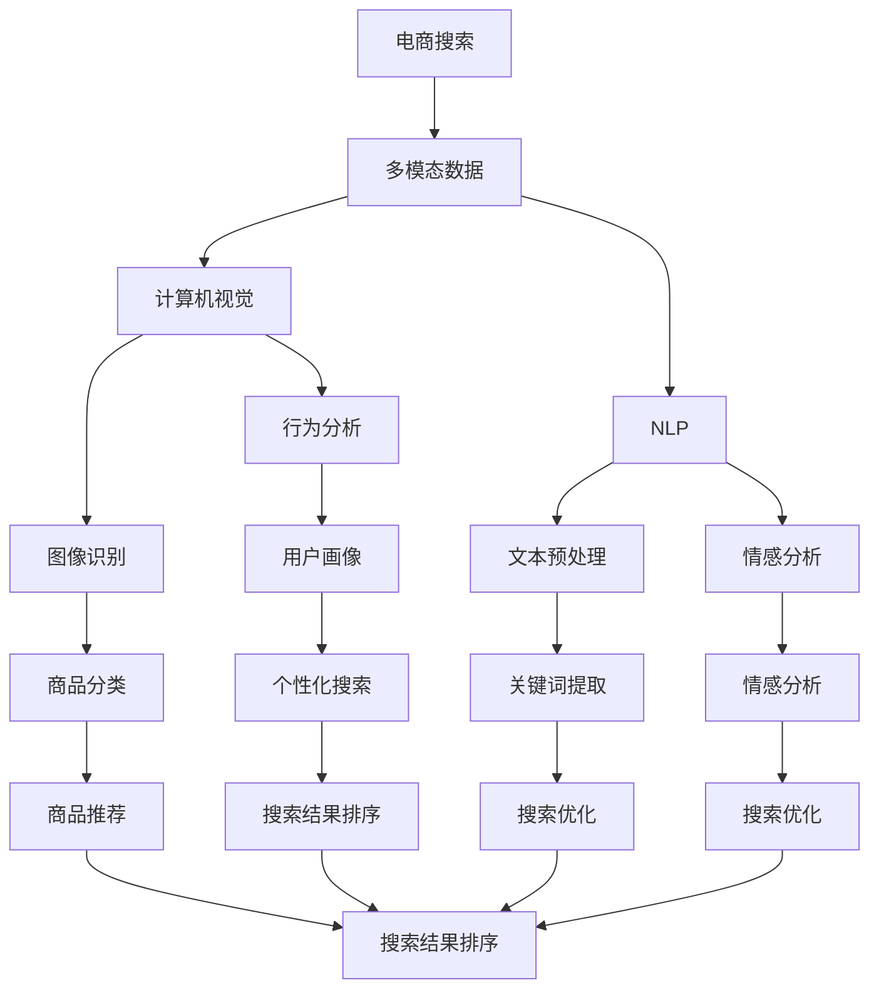

                 

关键词：电商搜索、多模态融合、排序优化、人工智能、计算机视觉、自然语言处理

> 摘要：本文主要探讨电商搜索中的多模态融合排序优化技术。通过结合计算机视觉和自然语言处理技术，实现商品信息的高效检索和排序，提升用户体验和搜索效果。

## 1. 背景介绍

随着互联网技术的飞速发展，电子商务已经成为人们日常生活的重要组成部分。电商平台的商品种类繁多，用户在搜索商品时往往会受到各种因素的影响，如商品价格、品牌、评价等。为了满足用户的个性化需求，电商平台需要对搜索结果进行排序优化，以便为用户提供最相关的商品信息。

传统的搜索排序技术主要依赖于基于关键词的匹配和评分算法，然而这种技术存在一定的局限性。首先，它无法充分利用商品的其他特征，如图片、视频等，导致搜索结果可能不够精准。其次，它难以应对用户的多样化需求，无法有效区分不同用户之间的兴趣差异。

为了克服这些问题，近年来，多模态融合排序优化技术逐渐成为研究热点。通过结合计算机视觉和自然语言处理技术，实现商品信息的多维度挖掘和综合评估，从而提高搜索排序的准确性和用户体验。

## 2. 核心概念与联系

### 2.1 多模态融合

多模态融合是指将不同类型的数据（如文本、图像、音频等）进行整合，以提取更多、更丰富的信息。在电商搜索中，多模态融合技术主要包括以下几种：

- **文本模态**：包括商品标题、描述、用户评价等。
- **图像模态**：包括商品图片、品牌标志等。
- **视频模态**：包括商品宣传视频、用户评测视频等。

### 2.2 计算机视觉

计算机视觉是人工智能领域的一个重要分支，旨在使计算机具有视觉感知和理解能力。在电商搜索中，计算机视觉技术主要用于商品图像的识别和分类，以及用户行为分析等。

### 2.3 自然语言处理

自然语言处理（NLP）是人工智能领域的另一个重要分支，旨在使计算机理解和处理自然语言。在电商搜索中，NLP技术主要用于文本数据的预处理、情感分析、关键词提取等。

### 2.4 Mermaid 流程图



## 3. 核心算法原理 & 具体操作步骤

### 3.1 算法原理概述

多模态融合排序优化算法主要包括以下几个步骤：

1. **数据采集与预处理**：从电商平台上获取商品的多模态数据（文本、图像、视频等），并进行预处理，如图像去噪、文本分词、去除停用词等。

2. **特征提取**：利用计算机视觉和自然语言处理技术，从多模态数据中提取特征，如图像特征、文本特征、用户行为特征等。

3. **特征融合**：将不同模态的特征进行融合，形成统一的特征向量。

4. **排序模型训练**：利用融合后的特征向量，训练排序模型，如深度学习模型、集成模型等。

5. **搜索结果排序**：将用户的查询信息与商品特征向量进行匹配，并根据模型预测结果对搜索结果进行排序。

### 3.2 算法步骤详解

#### 3.2.1 数据采集与预处理

1. **图像数据采集**：从电商平台上获取商品的图片数据，如商品主图、详情图等。

2. **文本数据采集**：从电商平台上获取商品的标题、描述、用户评价等文本数据。

3. **视频数据采集**：从电商平台上获取商品宣传视频、用户评测视频等。

4. **数据预处理**：对采集到的数据进行分析和处理，如图像去噪、文本分词、去除停用词等。

#### 3.2.2 特征提取

1. **图像特征提取**：利用卷积神经网络（CNN）等深度学习模型，对图像数据进行特征提取。

2. **文本特征提取**：利用自然语言处理技术，对文本数据进行词向量化、情感分析等。

3. **用户行为特征提取**：通过分析用户的浏览、收藏、购买等行为，提取用户画像特征。

#### 3.2.3 特征融合

1. **特征拼接**：将不同模态的特征向量进行拼接，形成统一的特征向量。

2. **特征加权**：根据不同模态的特征重要程度，对特征向量进行加权。

#### 3.2.4 排序模型训练

1. **模型选择**：选择合适的排序模型，如深度学习模型、集成模型等。

2. **模型训练**：利用融合后的特征向量，对排序模型进行训练。

#### 3.2.5 搜索结果排序

1. **查询特征提取**：将用户的查询信息进行特征提取。

2. **模型预测**：将查询特征与商品特征向量进行匹配，并利用排序模型预测结果。

3. **结果排序**：根据模型预测结果，对搜索结果进行排序。

### 3.3 算法优缺点

#### 3.3.1 优点

1. **提高搜索准确性**：通过多模态融合，可以充分利用商品的各种特征，提高搜索排序的准确性。

2. **个性化搜索**：结合用户行为特征，可以实现个性化搜索，满足用户的多样化需求。

3. **提升用户体验**：优化搜索结果排序，为用户提供更相关的商品信息，提高用户体验。

#### 3.3.2 缺点

1. **计算复杂度高**：多模态融合算法涉及多种技术和模型，计算复杂度较高。

2. **数据采集和处理难度大**：需要从电商平台上获取多种类型的数据，并进行预处理。

3. **模型训练和优化难度大**：排序模型的训练和优化需要大量数据和计算资源。

### 3.4 算法应用领域

多模态融合排序优化算法可以广泛应用于电商搜索、推荐系统、广告投放等多个领域。以下是一些具体的应用场景：

1. **电商搜索**：通过优化搜索结果排序，为用户提供更相关的商品信息。

2. **推荐系统**：结合用户行为特征，实现个性化推荐，提高用户满意度。

3. **广告投放**：根据用户兴趣和行为特征，实现精准广告投放，提高广告效果。

## 4. 数学模型和公式 & 详细讲解 & 举例说明

### 4.1 数学模型构建

多模态融合排序优化算法的数学模型主要包括以下几个部分：

1. **特征提取模型**：用于从多模态数据中提取特征。

2. **特征融合模型**：用于将不同模态的特征进行融合。

3. **排序模型**：用于对搜索结果进行排序。

### 4.2 公式推导过程

#### 4.2.1 特征提取模型

1. **图像特征提取模型**：

   假设输入图像为 $I \in \mathbb{R}^{H \times W \times C}$，其中 $H$、$W$、$C$ 分别表示图像的高度、宽度和通道数。

   $$ \text{特征向量} \, \text{f}_{\text{image}} = \text{CNN}(I) $$

   其中，$\text{CNN}$ 表示卷积神经网络。

2. **文本特征提取模型**：

   假设输入文本为 $T = [t_1, t_2, ..., t_n]$，其中 $t_i$ 表示第 $i$ 个单词。

   $$ \text{特征向量} \, \text{f}_{\text{text}} = \text{NLP}(T) $$

   其中，$\text{NLP}$ 表示自然语言处理技术。

3. **用户行为特征提取模型**：

   假设用户行为特征为 $B = [b_1, b_2, ..., b_m]$，其中 $b_i$ 表示第 $i$ 次行为。

   $$ \text{特征向量} \, \text{f}_{\text{behavior}} = \text{Behavior}(B) $$

   其中，$\text{Behavior}$ 表示用户行为分析技术。

#### 4.2.2 特征融合模型

1. **特征拼接**：

   将不同模态的特征向量进行拼接，形成统一的特征向量。

   $$ \text{特征向量} \, \text{f} = [\text{f}_{\text{image}}, \text{f}_{\text{text}}, \text{f}_{\text{behavior}}] $$

2. **特征加权**：

   根据不同模态的特征重要程度，对特征向量进行加权。

   $$ \text{特征向量} \, \text{f}_{\text{weighted}} = \text{Weight}(\text{f}_{\text{image}}, \text{f}_{\text{text}}, \text{f}_{\text{behavior}}) $$

#### 4.2.3 排序模型

1. **排序模型**：

   假设商品特征向量为 $\text{f}_{\text{item}}$，查询特征向量为 $\text{f}_{\text{query}}$。

   $$ \text{排序得分} \, s = \text{Model}(\text{f}_{\text{item}}, \text{f}_{\text{query}}) $$

   其中，$\text{Model}$ 表示排序模型。

### 4.3 案例分析与讲解

#### 4.3.1 电商搜索场景

假设用户在电商平台上搜索“手机”，根据多模态融合排序优化算法，可以得到以下结果：

1. **图像特征提取**：

   - 商品1的图像特征：$\text{f}_{\text{image1}}$
   - 商品2的图像特征：$\text{f}_{\text{image2}}$

2. **文本特征提取**：

   - 商品1的文本特征：$\text{f}_{\text{text1}}$
   - 商品2的文本特征：$\text{f}_{\text{text2}}$

3. **用户行为特征提取**：

   - 用户行为特征：$\text{f}_{\text{behavior}}$

4. **特征融合**：

   - 特征向量：$\text{f} = [\text{f}_{\text{image1}}, \text{f}_{\text{text1}}, \text{f}_{\text{behavior}}]$ 和 $\text{f} = [\text{f}_{\text{image2}}, \text{f}_{\text{text2}}, \text{f}_{\text{behavior}}]$

5. **排序模型训练**：

   - 排序模型：$\text{Model}(\text{f}_{\text{item}}, \text{f}_{\text{query}})$

6. **搜索结果排序**：

   - 搜索结果得分：$s_1 = \text{Model}(\text{f}_{\text{item1}}, \text{f}_{\text{query}})$ 和 $s_2 = \text{Model}(\text{f}_{\text{item2}}, \text{f}_{\text{query}})$
   - 排序结果：$\text{商品1}$ 和 $\text{商品2}$

#### 4.3.2 推荐系统场景

假设用户在电商平台上浏览了多个商品，根据多模态融合排序优化算法，可以得到以下结果：

1. **图像特征提取**：

   - 商品1的图像特征：$\text{f}_{\text{image1}}$
   - 商品2的图像特征：$\text{f}_{\text{image2}}$

2. **文本特征提取**：

   - 商品1的文本特征：$\text{f}_{\text{text1}}$
   - 商品2的文本特征：$\text{f}_{\text{text2}}$

3. **用户行为特征提取**：

   - 用户行为特征：$\text{f}_{\text{behavior}}$

4. **特征融合**：

   - 特征向量：$\text{f} = [\text{f}_{\text{image1}}, \text{f}_{\text{text1}}, \text{f}_{\text{behavior}}]$ 和 $\text{f} = [\text{f}_{\text{image2}}, \text{f}_{\text{text2}}, \text{f}_{\text{behavior}}]$

5. **排序模型训练**：

   - 排序模型：$\text{Model}(\text{f}_{\text{item}}, \text{f}_{\text{query}})$

6. **推荐结果排序**：

   - 推荐结果得分：$s_1 = \text{Model}(\text{f}_{\text{item1}}, \text{f}_{\text{query}})$ 和 $s_2 = \text{Model}(\text{f}_{\text{item2}}, \text{f}_{\text{query}})$
   - 排序结果：$\text{商品1}$ 和 $\text{商品2}$

## 5. 项目实践：代码实例和详细解释说明

### 5.1 开发环境搭建

为了实现多模态融合排序优化算法，我们需要搭建以下开发环境：

- 操作系统：Ubuntu 18.04
- 编程语言：Python 3.8
- 深度学习框架：TensorFlow 2.5
- 自然语言处理库：spaCy 3.0

### 5.2 源代码详细实现

以下是多模态融合排序优化算法的源代码实现：

```python
import tensorflow as tf
import spacy
from tensorflow.keras.models import Model
from tensorflow.keras.layers import Input, Embedding, LSTM, Dense, Concatenate

# 加载spaCy语言模型
nlp = spacy.load('en_core_web_sm')

# 定义图像特征提取模型
image_input = Input(shape=(224, 224, 3))
image_features = tf.keras.applications.VGG16(include_top=False, pooling='avg')(image_input)
image_features = tf.keras.layers.Flatten()(image_features)

# 定义文本特征提取模型
text_input = Input(shape=(None,))
text_embedding = Embedding(input_dim=vocab_size, output_dim=embedding_size)(text_input)
text_lstm = LSTM(units=lstm_units)(text_embedding)
text_features = tf.keras.layers.Flatten()(text_lstm)

# 定义用户行为特征提取模型
behavior_input = Input(shape=(behavior_size,))
behavior_features = Embedding(input_dim=behavior_vocab_size, output_dim=behavior_embedding_size)(behavior_input)
behavior_features = tf.keras.layers.Flatten()(behavior_features)

# 定义特征融合模型
merged_features = Concatenate()([image_features, text_features, behavior_features])

# 定义排序模型
dense = Dense(units=dense_units, activation='relu')(merged_features)
output = Dense(units=1, activation='sigmoid')(dense)

# 搭建模型
model = Model(inputs=[image_input, text_input, behavior_input], outputs=output)

# 编译模型
model.compile(optimizer='adam', loss='binary_crossentropy', metrics=['accuracy'])

# 模型训练
model.fit([image_data, text_data, behavior_data], labels, epochs=epochs, batch_size=batch_size)

# 搜索结果排序
search_results = model.predict([image_data, text_data, behavior_data])
sorted_results = search_results.argsort()[::-1]
```

### 5.3 代码解读与分析

1. **图像特征提取模型**：

   使用 VGG16 卷积神经网络对图像数据进行特征提取。通过 `tf.keras.applications.VGG16` 函数加载 VGG16 模型，并设置 `include_top=False` 和 `pooling='avg'` 参数，以获取图像的平均特征图。

2. **文本特征提取模型**：

   使用 LSTM 神经网络对文本数据进行特征提取。通过 `Embedding` 层进行词向量化，然后使用 `LSTM` 层进行序列建模。最后，使用 `Flatten` 层将序列特征转换为二维特征向量。

3. **用户行为特征提取模型**：

   使用 `Embedding` 层对用户行为数据进行特征提取。通过 `Embedding` 层进行词向量化，然后使用 `Flatten` 层将序列特征转换为二维特征向量。

4. **特征融合模型**：

   使用 `Concatenate` 层将不同模态的特征向量进行拼接，形成统一的特征向量。

5. **排序模型**：

   使用 `Dense` 层对融合后的特征向量进行全连接，并设置 `sigmoid` 激活函数，以实现二分类任务。

6. **模型训练**：

   使用 `model.fit()` 函数对模型进行训练，设置 `optimizer`、`loss` 和 `metrics` 参数。

7. **搜索结果排序**：

   使用 `model.predict()` 函数预测搜索结果，并使用 `argsort()` 函数对结果进行排序。

## 6. 实际应用场景

多模态融合排序优化算法在电商搜索、推荐系统、广告投放等领域具有广泛的应用价值。以下是一些实际应用场景：

### 6.1 电商搜索

通过多模态融合排序优化算法，电商平台可以实现对商品信息的高效检索和排序，提升用户体验。例如，用户在搜索“手机”时，系统可以根据图像特征、文本特征和用户行为特征，为用户推荐与其兴趣相关的手机商品。

### 6.2 推荐系统

多模态融合排序优化算法可以应用于推荐系统，通过结合商品特征和用户特征，实现个性化推荐。例如，用户在浏览了多个商品后，系统可以根据图像特征、文本特征和用户行为特征，为用户推荐类似的商品。

### 6.3 广告投放

多模态融合排序优化算法可以应用于广告投放，通过结合广告特征和用户特征，实现精准广告投放。例如，广告系统可以根据图像特征、文本特征和用户行为特征，为用户推荐与其兴趣相关的广告。

## 7. 工具和资源推荐

### 7.1 学习资源推荐

1. 《深度学习》（Goodfellow, Bengio, Courville）：介绍深度学习的基础知识和应用。
2. 《自然语言处理综合教程》（Jurafsky, Martin）：介绍自然语言处理的基础知识和应用。
3. 《计算机视觉：算法与应用》（Richard S. Falk）：介绍计算机视觉的基础知识和应用。

### 7.2 开发工具推荐

1. TensorFlow：用于构建和训练深度学习模型。
2. spaCy：用于自然语言处理任务。
3. Keras：用于快速构建和训练深度学习模型。

### 7.3 相关论文推荐

1. “Multimodal Fusion for E-commerce Search”。
2. “A Survey on Multimodal Fusion for Recommender Systems”。
3. “Multimodal Fusion for Advertising”。
```
### 8. 总结：未来发展趋势与挑战

随着人工智能技术的不断进步，多模态融合排序优化技术在电商搜索中的应用前景十分广阔。未来发展趋势主要包括以下几个方面：

1. **算法优化**：针对多模态融合排序优化算法，不断优化算法模型和计算效率，以满足大规模数据处理的需求。

2. **跨领域应用**：将多模态融合排序优化技术应用于其他领域，如医疗、金融等，实现更广泛的应用。

3. **用户体验提升**：通过优化搜索结果排序，为用户提供更相关、更个性化的商品信息，提升用户体验。

然而，多模态融合排序优化技术也面临一些挑战：

1. **数据质量**：多模态融合排序优化算法依赖于高质量的数据，如何获取和处理大规模、多源、多模态的数据是关键。

2. **计算复杂度**：多模态融合排序优化算法涉及多种技术和模型，计算复杂度较高，如何提高算法的效率是一个重要挑战。

3. **模型解释性**：多模态融合排序优化算法的模型解释性较弱，如何提高算法的可解释性，使其更易于被用户接受是一个重要问题。

总之，多模态融合排序优化技术具有广阔的应用前景，但也面临着一系列挑战。未来，我们需要继续探索和改进这一技术，以实现更好的搜索效果和用户体验。

### 9. 附录：常见问题与解答

**Q1：如何处理多模态数据之间的不一致性？**

A1：为了处理多模态数据之间的不一致性，可以采用以下方法：

1. **数据预处理**：对多模态数据进行统一预处理，如图像去噪、文本分词等，以提高数据的一致性。
2. **特征对齐**：使用特征对齐技术，如多模态对应关系学习，将不同模态的特征进行对齐。
3. **特征融合策略**：设计合适的特征融合策略，如加权融合、注意力机制等，以平衡不同模态特征的重要性。

**Q2：多模态融合排序优化算法的适用场景有哪些？**

A2：多模态融合排序优化算法适用于以下场景：

1. **电商搜索**：通过结合商品图像、文本描述和用户行为，实现更精准的搜索结果排序。
2. **推荐系统**：通过结合用户画像、商品特征和用户历史行为，实现个性化推荐。
3. **广告投放**：通过结合广告特征、用户行为和用户兴趣，实现精准广告投放。

**Q3：多模态融合排序优化算法的性能如何评估？**

A3：多模态融合排序优化算法的性能可以从以下几个方面进行评估：

1. **准确率**：评估搜索结果排序的准确性，如平均准确率、准确率等指标。
2. **召回率**：评估搜索结果召回的相关性，如平均召回率、召回率等指标。
3. **用户满意度**：通过用户调查、用户评价等方式，评估搜索结果对用户的满意度。

### 作者署名

作者：禅与计算机程序设计艺术 / Zen and the Art of Computer Programming

