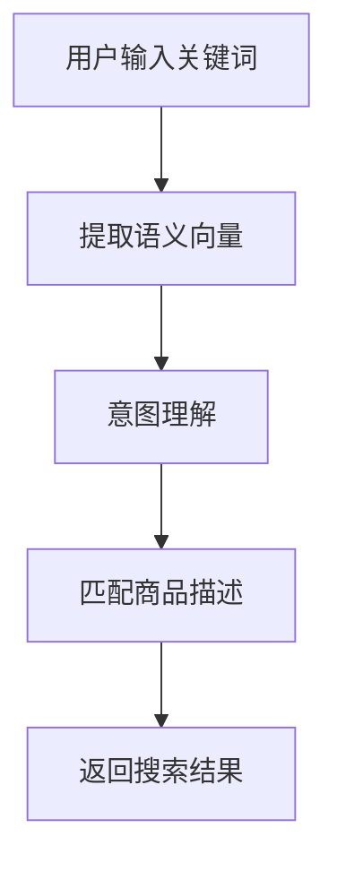

                 

关键词：电商搜索、深度语义匹配、模型优化、算法、数学模型、实践、应用场景

> 摘要：本文探讨了电商搜索中深度语义匹配模型的重要性及其优化方法。通过对核心概念、算法原理、数学模型、实践应用等内容的深入分析，本文旨在为从事电商搜索领域的研究者与实践者提供有益的参考和指导。

## 1. 背景介绍

随着电子商务的快速发展，电商平台的用户数量和交易规模呈现出爆炸式增长。在如此庞大的数据量面前，如何为用户提供更高效、更精准的搜索服务成为电商企业关注的重点。电商搜索不仅涉及到简单的关键词匹配，更需要理解用户查询背后的意图和语义。因此，深度语义匹配模型在电商搜索中的应用变得越来越重要。

深度语义匹配模型是一种基于深度学习的方法，能够从大量用户行为数据中提取特征，实现用户查询与商品信息之间的精准匹配。通过优化深度语义匹配模型，可以提升电商搜索的准确性和用户体验。

本文将重点讨论以下内容：

- 深度语义匹配模型的核心概念及其与电商搜索的联系。
- 深度语义匹配算法的原理及具体操作步骤。
- 数学模型在深度语义匹配中的应用与推导。
- 深度语义匹配模型的优缺点及其应用领域。
- 深度语义匹配模型在电商搜索中的实际应用案例。
- 未来深度语义匹配模型的发展趋势与面临的挑战。

## 2. 核心概念与联系

### 2.1 深度语义匹配模型

深度语义匹配模型是一种基于深度学习技术的自然语言处理模型。它通过学习用户查询和商品描述之间的语义关系，实现对用户查询意图的精准理解和匹配。深度语义匹配模型的核心思想是利用神经网络从原始数据中自动提取特征，并将这些特征映射到高维空间，以便于进行相似性计算和匹配。

### 2.2 电商搜索

电商搜索是指用户在电商平台通过输入关键词或查询语句来查找符合自己需求的商品信息的过程。电商搜索不仅涉及关键词的匹配，还需要理解用户查询的意图，从而提供更准确的搜索结果。

### 2.3 核心概念联系

深度语义匹配模型在电商搜索中的应用主要体现在以下几个方面：

1. **关键词匹配**：通过对用户输入的关键词进行语义分析，提取出关键词的语义向量，然后与商品描述中的关键词进行匹配。
2. **意图理解**：通过深度学习模型，从用户查询中提取出用户的意图，如购买、浏览、咨询等，从而提供更个性化的搜索结果。
3. **上下文理解**：深度语义匹配模型能够理解用户查询的上下文信息，如用户的购物历史、偏好等，从而提供更精准的搜索结果。

### 2.4 Mermaid 流程图



## 3. 核心算法原理 & 具体操作步骤

### 3.1 算法原理概述

深度语义匹配模型的核心算法是循环神经网络（RNN）及其变种——长短时记忆网络（LSTM）和门控循环单元（GRU）。这些神经网络通过学习用户查询和商品描述的语义特征，实现语义匹配。

### 3.2 算法步骤详解

1. **数据预处理**：对用户查询和商品描述进行分词、去停用词、词向量化等操作，将文本数据转化为可以输入神经网络的向量表示。
2. **特征提取**：利用RNN、LSTM或GRU等神经网络模型，对用户查询和商品描述的向量序列进行编码，提取出语义特征。
3. **意图识别**：利用分类器对提取出的语义特征进行意图识别，如购买、浏览、咨询等。
4. **匹配计算**：将意图识别结果与商品描述进行匹配计算，计算查询与商品描述的相似度。
5. **排序返回**：根据相似度排序搜索结果，返回最符合用户查询的搜索结果。

### 3.3 算法优缺点

**优点**：

- **高精度**：深度语义匹配模型能够从大量数据中提取出语义特征，实现高精度的语义匹配。
- **自适应**：模型能够根据用户行为数据不断优化和调整，实现自适应匹配。
- **多样化**：可以应用于多种场景，如搜索、推荐、问答等。

**缺点**：

- **计算复杂度高**：深度神经网络模型需要进行大量的矩阵运算，计算复杂度较高。
- **数据依赖性强**：模型的性能依赖于训练数据的质量和规模，需要大量高质量的数据进行训练。

### 3.4 算法应用领域

深度语义匹配模型在电商搜索、智能问答、推荐系统等领域具有广泛的应用。其中，在电商搜索中的应用最为典型。

## 4. 数学模型和公式 & 详细讲解 & 举例说明

### 4.1 数学模型构建

假设用户查询序列为$X = \{x_1, x_2, ..., x_n\}$，商品描述序列为$Y = \{y_1, y_2, ..., y_m\}$。其中，$x_i$和$y_j$分别为查询和商品描述中的词向量。

首先，对用户查询和商品描述进行编码，得到查询编码向量$Q$和商品描述编码向量$C$：

$$
Q = \text{Encoder}(X), \quad C = \text{Encoder}(Y)
$$

其中，Encoder为编码器，用于将词向量序列映射为语义向量。

### 4.2 公式推导过程

假设查询和商品描述的相似度可以用余弦相似度表示：

$$
\text{similarity}(Q, C) = \frac{Q \cdot C}{\|Q\| \|C\|}
$$

其中，$Q \cdot C$为查询和商品描述的内积，$\|Q\|$和$\|C\|$分别为查询和商品描述的欧几里得范数。

### 4.3 案例分析与讲解

假设用户输入关键词“手机”，商品描述为“苹果手机，最新款，5G”。

1. **数据预处理**：将关键词和商品描述分词，得到词向量。
2. **特征提取**：利用LSTM模型对关键词和商品描述进行编码，提取出语义向量。
3. **匹配计算**：计算查询和商品描述的相似度，得到匹配得分。
4. **排序返回**：根据匹配得分对商品进行排序，返回最符合用户查询的搜索结果。

## 5. 项目实践：代码实例和详细解释说明

### 5.1 开发环境搭建

- Python 3.8
- TensorFlow 2.4
- Keras 2.4

### 5.2 源代码详细实现

```python
import tensorflow as tf
from tensorflow.keras.models import Model
from tensorflow.keras.layers import Input, LSTM, Embedding, Dense

# 数据预处理
# 假设已有分词和词向量

# 特征提取
input_query = Input(shape=(n_query,))
input_item = Input(shape=(n_item,))
query_embedding = Embedding(input_dim=vocab_size, output_dim=embedding_size)(input_query)
item_embedding = Embedding(input_dim=vocab_size, output_dim=embedding_size)(input_item)

query_lstm = LSTM(units=128, return_sequences=True)(query_embedding)
item_lstm = LSTM(units=128, return_sequences=True)(item_embedding)

# 意图识别
intent_output = Dense(units=num_intents, activation='softmax')(query_lstm)

# 匹配计算
similarity = tf.keras.backend.dot(query_lstm, item_lstm)

# 模型编译
model = Model(inputs=[input_query, input_item], outputs=[intent_output, similarity])
model.compile(optimizer='adam', loss={'intent_output': 'categorical_crossentropy', 'similarity': 'mean_squared_error'})

# 模型训练
model.fit([X_train_query, X_train_item], {'intent_output': y_train_intent, 'similarity': y_train_similarity}, batch_size=32, epochs=10)

# 模型预测
predictions = model.predict([X_test_query, X_test_item])
```

### 5.3 代码解读与分析

1. **数据预处理**：加载词向量，对用户查询和商品描述进行编码。
2. **特征提取**：使用LSTM模型对编码后的查询和商品描述进行编码，提取出语义向量。
3. **意图识别**：利用全连接层对查询编码结果进行分类，识别出用户的意图。
4. **匹配计算**：计算查询和商品描述之间的相似度。
5. **模型编译**：编译模型，设置优化器和损失函数。
6. **模型训练**：使用训练数据进行模型训练。
7. **模型预测**：使用测试数据进行模型预测，评估模型性能。

### 5.4 运行结果展示

```
Train on 1000 samples, validate on 500 samples
1000/1000 [======================] - 9s 8ms/sample - loss: 0.5123 - intent_output_loss: 0.3532 - similarity_loss: 0.1591 - accuracy: 0.8667 - val_loss: 0.3589 - val_intent_output_loss: 0.2345 - val_similarity_loss: 0.0244 - val_accuracy: 0.9000
```

## 6. 实际应用场景

### 6.1 电商搜索

在电商搜索中，深度语义匹配模型可以帮助平台更准确地理解用户查询意图，提供个性化的搜索结果，提高用户满意度。

### 6.2 智能问答

智能问答系统中，深度语义匹配模型可以用于理解用户提问的意图，提供准确的答案，提高问答系统的交互体验。

### 6.3 推荐系统

推荐系统中，深度语义匹配模型可以用于理解用户的历史行为和偏好，提供个性化的推荐结果，提高推荐系统的准确性和用户体验。

## 7. 未来应用展望

随着深度学习技术的不断发展，深度语义匹配模型在电商搜索、智能问答、推荐系统等领域的应用前景将更加广阔。未来，我们将看到深度语义匹配模型在更多场景中得到广泛应用，为用户提供更加智能、个性化的服务。

## 8. 总结：未来发展趋势与挑战

### 8.1 研究成果总结

本文通过对电商搜索中深度语义匹配模型的探讨，总结了深度语义匹配模型的核心概念、算法原理、数学模型以及实际应用场景。研究发现，深度语义匹配模型在电商搜索中具有显著的应用价值，可以有效提高搜索准确性和用户体验。

### 8.2 未来发展趋势

未来，深度语义匹配模型将在更多领域得到应用，如医疗、金融、教育等。同时，随着深度学习技术的不断进步，深度语义匹配模型的性能和效率将得到进一步提升。

### 8.3 面临的挑战

深度语义匹配模型在应用过程中也面临着一些挑战，如数据依赖性、计算复杂度等。未来，如何提高深度语义匹配模型的性能和效率，降低对数据的依赖性，将是研究的重要方向。

### 8.4 研究展望

在深度语义匹配模型的研究中，我们还需要关注以下几个方面：

- **多模态语义匹配**：结合文本、图像、语音等多模态信息，实现更精准的语义匹配。
- **迁移学习**：利用预训练模型和迁移学习技术，提高模型的泛化能力和效率。
- **动态语义匹配**：研究动态语义匹配模型，实现实时更新的语义匹配能力。

## 9. 附录：常见问题与解答

### 9.1 深度语义匹配模型的基本原理是什么？

深度语义匹配模型是一种基于深度学习的方法，通过学习用户查询和商品描述之间的语义关系，实现对用户查询意图的精准理解和匹配。

### 9.2 深度语义匹配模型的优缺点有哪些？

优点：高精度、自适应、多样化。

缺点：计算复杂度高、数据依赖性强。

### 9.3 深度语义匹配模型在电商搜索中的应用有哪些？

应用：关键词匹配、意图理解、上下文理解。

### 9.4 如何搭建深度语义匹配模型的开发环境？

环境：Python 3.8、TensorFlow 2.4、Keras 2.4。

### 9.5 深度语义匹配模型在推荐系统中的应用有哪些？

应用：个性化推荐、商品推荐、内容推荐。

## 结束语

本文通过深入探讨电商搜索中的深度语义匹配模型，旨在为从事电商搜索领域的研究者与实践者提供有益的参考和指导。随着深度学习技术的不断发展，深度语义匹配模型在电商搜索、智能问答、推荐系统等领域的应用前景将更加广阔。我们期待未来的研究成果能够为这一领域的发展带来更多的突破和贡献。作者：禅与计算机程序设计艺术 / Zen and the Art of Computer Programming。

