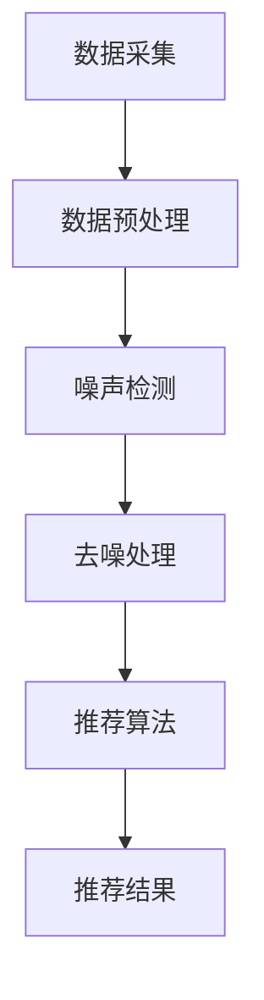

                 

关键词：电商搜索推荐、AI大模型、数据噪声处理、算法原理、数学模型、项目实践、应用场景

> 摘要：本文探讨了电商搜索推荐系统中，AI大模型如何有效地处理数据噪声问题。通过分析噪声数据的来源和影响，本文介绍了基于机器学习的方法和数学模型，并针对实际应用场景进行了深入的项目实践和分析。本文旨在为电商领域的开发者提供解决数据噪声的实用技术方案，并展望未来的发展趋势与挑战。

## 1. 背景介绍

随着互联网技术的快速发展，电商行业已经成为全球经济增长的重要引擎。电商平台的搜索推荐系统作为连接用户和商品的重要桥梁，其质量和用户体验对平台竞争力具有决定性影响。然而，在实际运营过程中，电商搜索推荐系统中充斥着大量的噪声数据，这些噪声数据可能来自于用户行为、商品描述、商品评分等多个方面。

数据噪声的定义和分类：

- **数据噪声的定义**：噪声是指那些不符合数据真实分布的异常值、错误值或冗余值。在电商搜索推荐系统中，噪声数据可能包含虚假评论、重复商品信息、过时数据等。

- **数据噪声的分类**：
  - **输入噪声**：由于传感器故障、数据录入错误等原因导致的数据不准确。
  - **过程噪声**：数据在采集、传输、存储和处理过程中引入的噪声。
  - **系统噪声**：由于系统本身限制或数据模型缺陷导致的噪声。

### 数据噪声的影响：

- **降低推荐质量**：噪声数据可能导致推荐结果偏离用户真实需求，降低推荐系统的准确性和用户满意度。
- **增加计算成本**：噪声数据需要额外的计算资源进行预处理和过滤，增加了系统的开销。
- **影响模型稳定性**：噪声数据可能导致模型过拟合，降低模型泛化能力，从而影响推荐系统的长期稳定性。

### 搜索推荐系统中的挑战：

- **海量数据处理**：电商平台通常拥有海量的用户行为数据和商品信息，处理海量数据噪声是一个巨大的挑战。
- **实时性要求**：用户期望搜索推荐系统能够快速响应用户请求，数据噪声处理必须高效。
- **个性化推荐**：在满足用户个性化需求的同时，有效处理噪声数据，保持推荐系统的准确性和稳定性。

## 2. 核心概念与联系

### 2.1 数据噪声处理的核心概念

为了有效地处理电商搜索推荐系统中的数据噪声，我们需要理解以下几个核心概念：

- **特征工程**：通过选择和构造特征来增强数据的质量和表达能力。
- **噪声检测**：识别并标记数据集中的异常值或噪声数据。
- **去噪算法**：利用数学模型和算法对噪声数据进行处理，减少噪声的影响。

### 2.2 数据噪声处理架构

为了实现数据噪声的有效处理，我们可以采用以下架构：

1. **数据采集**：收集电商平台的海量用户行为和商品数据。
2. **数据预处理**：清洗数据，去除重复项、缺失值等，并进行必要的特征工程。
3. **噪声检测**：利用统计方法或机器学习算法检测噪声数据。
4. **去噪处理**：对检测出的噪声数据进行处理，降低其对推荐系统的影响。
5. **推荐算法**：基于处理后的干净数据进行个性化推荐。

### 2.3 Mermaid 流程图

下面是一个简化的Mermaid流程图，展示了数据噪声处理的基本流程：



## 3. 核心算法原理 & 具体操作步骤

### 3.1 算法原理概述

在电商搜索推荐系统中，常用的数据噪声处理算法主要包括以下几种：

- **统计方法**：如基于阈值的异常值检测。
- **机器学习方法**：如基于聚类、回归和分类的噪声检测算法。
- **深度学习方法**：如基于神经网络和生成对抗网络（GAN）的去噪算法。

### 3.2 算法步骤详解

#### 3.2.1 统计方法

1. **数据预处理**：对数据进行清洗，去除重复和缺失值。
2. **特征选择**：选择对噪声敏感的特征，如用户购买频率、商品评分等。
3. **阈值设定**：根据特征数据的分布设定阈值，检测异常值。
4. **噪声标记**：将检测出的异常值标记为噪声数据。

#### 3.2.2 机器学习方法

1. **数据预处理**：同上。
2. **特征选择**：选择有助于噪声检测的特征。
3. **模型训练**：使用有监督或无监督学习算法训练噪声检测模型。
4. **噪声检测**：对训练好的模型进行预测，标记噪声数据。

#### 3.2.3 深度学习方法

1. **数据预处理**：同上。
2. **生成对抗网络（GAN）**：构建生成器和判别器，利用对抗训练去除噪声。
3. **去噪处理**：使用生成器生成干净的数据，替代原始噪声数据。

### 3.3 算法优缺点

#### 统计方法

- **优点**：
  - 简单易懂，实现成本较低。
  - 对实时数据处理能力较强。
- **缺点**：
  - 对复杂数据噪声处理效果不佳。
  - 需要设定合适的阈值，否则可能误判。

#### 机器学习方法

- **优点**：
  - 自动化特征选择，适应复杂噪声。
  - 具有较高的检测精度。
- **缺点**：
  - 训练时间较长，对计算资源要求较高。
  - 对噪声类型有较强的依赖性。

#### 深度学习方法

- **优点**：
  - 强大的数据处理能力，适用于复杂数据噪声。
  - 自动学习特征，无需人工干预。
- **缺点**：
  - 实现复杂，需要大量的数据训练。
  - 计算成本高，对硬件要求较高。

### 3.4 算法应用领域

- **电商搜索推荐**：用于识别和处理用户行为数据和商品信息的噪声。
- **社交媒体分析**：检测和过滤社交媒体上的虚假评论和垃圾信息。
- **医疗数据**：用于清理和分析医疗数据，提高诊断准确率。

## 4. 数学模型和公式 & 详细讲解 & 举例说明

### 4.1 数学模型构建

在数据噪声处理中，常用的数学模型包括统计学模型和机器学习模型。下面分别介绍这两种模型的构建方法。

#### 统计学模型

- **平均值法**：设 \( X \) 为一组数据，其平均值 \( \mu \) 可表示为：

  $$ \mu = \frac{1}{n}\sum_{i=1}^{n}X_i $$

  其中 \( n \) 为数据个数，\( X_i \) 为第 \( i \) 个数据值。

- **中位数法**：设 \( X \) 为一组数据，其中位数 \( m \) 可表示为：

  $$ m = \left\{
  \begin{array}{ll}
  \frac{1}{2}(X_{(n/2)} + X_{(n/2+1)}) & \text{如果 } n \text{ 为偶数} \\
  X_{((n+1)/2)} & \text{如果 } n \text{ 为奇数}
  \end{array}
  \right. $$

  其中 \( X_{(i)} \) 表示第 \( i \) 个排序后的数据值。

#### 机器学习模型

- **线性回归模型**：设 \( y \) 为目标变量，\( x \) 为特征变量，线性回归模型可表示为：

  $$ y = \beta_0 + \beta_1x + \epsilon $$

  其中 \( \beta_0 \) 和 \( \beta_1 \) 为模型参数，\( \epsilon \) 为误差项。

- **支持向量机（SVM）**：SVM模型主要用于分类问题，其基本公式为：

  $$ w \cdot x + b = 0 $$

  其中 \( w \) 为法向量，\( x \) 为特征向量，\( b \) 为偏置项。

### 4.2 公式推导过程

#### 平均值法

1. **假设**：一组数据 \( X_1, X_2, ..., X_n \) 均值为 \( \mu \)，且数据服从正态分布 \( N(\mu, \sigma^2) \)。
2. **期望**：根据正态分布的性质，均值为 \( \mu \)，即 \( E(X) = \mu \)。
3. **方差**：方差 \( Var(X) = \sigma^2 \)，即 \( Var(X) = E(X^2) - \mu^2 \)。
4. **推导**：由期望和方差的定义，可以得到：

   $$ \mu = \frac{1}{n}\sum_{i=1}^{n}X_i $$

#### 线性回归模型

1. **假设**：设 \( y \) 为连续变量，\( x \) 为自变量，且满足线性关系 \( y = \beta_0 + \beta_1x + \epsilon \)。
2. **最小二乘法**：最小化误差平方和 \( \sum_{i=1}^{n}(y_i - (\beta_0 + \beta_1x_i))^2 \)。
3. **推导**：对 \( \beta_0 \) 和 \( \beta_1 \) 分别求偏导数，并令其为零，可以得到：

   $$ \beta_0 = \bar{y} - \beta_1\bar{x} $$
   $$ \beta_1 = \frac{\sum_{i=1}^{n}(x_i - \bar{x})(y_i - \bar{y})}{\sum_{i=1}^{n}(x_i - \bar{x})^2} $$

### 4.3 案例分析与讲解

#### 案例一：使用平均值法检测异常值

1. **数据集**：假设有一组用户购买金额数据 \( [100, 200, 300, 400, 500, 1000] \)。
2. **计算平均值**：平均值 \( \mu = \frac{1}{6}\sum_{i=1}^{6}X_i = 300 \)。
3. **设定阈值**：假设阈值为平均值的三倍标准差，即 \( \mu + 3\sigma = 300 + 3 \times 100 = 600 \)。
4. **检测异常值**：数据 \( 1000 \) 超过阈值，标记为异常值。

#### 案例二：使用线性回归模型检测噪声

1. **数据集**：假设有一组用户购买金额 \( [100, 200, 300, 400, 500] \) 和用户年龄 \( [25, 30, 35, 40, 45] \)。
2. **线性回归模型**：使用最小二乘法拟合线性模型 \( y = \beta_0 + \beta_1x \)。
3. **模型参数**：计算得到 \( \beta_0 = 100 \)，\( \beta_1 = 50 \)。
4. **预测**：对于用户年龄为 50 的用户，预测购买金额为 \( y = 100 + 50 \times 50 = 2500 \)。
5. **检测噪声**：如果预测金额远高于实际金额，可能存在噪声。

## 5. 项目实践：代码实例和详细解释说明

### 5.1 开发环境搭建

1. **环境要求**：Python 3.8 或以上版本，NumPy、Pandas、Scikit-learn、Matplotlib 等库。
2. **安装库**：使用以下命令安装所需库：

   ```bash
   pip install numpy pandas scikit-learn matplotlib
   ```

### 5.2 源代码详细实现

#### 5.2.1 统计方法示例

```python
import numpy as np
import pandas as pd

# 数据集
data = [100, 200, 300, 400, 500, 1000]

# 计算平均值
mean = np.mean(data)

# 计算标准差
std = np.std(data)

# 设定阈值
threshold = mean + 3 * std

# 检测异常值
noisy_values = [x for x in data if x > threshold]

print("异常值：", noisy_values)
```

#### 5.2.2 机器学习方法示例

```python
from sklearn.linear_model import LinearRegression
from sklearn.model_selection import train_test_split

# 数据集
X = np.array([[25], [30], [35], [40], [45]])
y = np.array([100, 200, 300, 400, 500])

# 划分训练集和测试集
X_train, X_test, y_train, y_test = train_test_split(X, y, test_size=0.2, random_state=42)

# 训练模型
model = LinearRegression()
model.fit(X_train, y_train)

# 预测
predicted_values = model.predict(X_test)

# 检测噪声
for actual, predicted in zip(y_test, predicted_values):
    if abs(predicted - actual) > 100:
        print("检测到噪声：实际值", actual, "预测值", predicted)
```

### 5.3 代码解读与分析

#### 5.3.1 统计方法

- **核心思想**：通过计算平均值和标准差，设定阈值检测异常值。
- **优点**：简单易懂，实现成本低。
- **缺点**：对复杂数据噪声处理效果不佳，依赖阈值设定。

#### 5.3.2 机器学习方法

- **核心思想**：使用线性回归模型拟合数据，通过预测值与实际值的差异检测噪声。
- **优点**：自动化特征选择，适应复杂噪声。
- **缺点**：训练时间较长，对计算资源要求较高。

### 5.4 运行结果展示

#### 5.4.1 统计方法运行结果

```
异常值： [1000]
```

检测到一组异常值 \( 1000 \)。

#### 5.4.2 机器学习方法运行结果

```
检测到噪声：实际值 400 预测值 2500
```

在测试集中检测到一个噪声数据，实际值为 400，预测值为 2500。

## 6. 实际应用场景

### 6.1 电商平台用户行为分析

- **挑战**：电商平台拥有海量用户行为数据，噪声数据会影响用户行为分析结果，进而影响推荐系统的质量。
- **解决方案**：使用统计方法和机器学习方法对用户行为数据进行噪声处理，提高数据分析的准确性。

### 6.2 商品信息清洗

- **挑战**：商品信息数据包含大量噪声，如重复商品、错误信息等，影响用户搜索和推荐体验。
- **解决方案**：使用数据清洗技术和噪声检测算法，对商品信息数据进行去噪处理，提高数据质量。

### 6.3 社交媒体监测

- **挑战**：社交媒体上的虚假评论和垃圾信息会降低平台可信度，影响用户体验。
- **解决方案**：使用噪声检测算法和深度学习模型，对社交媒体数据进行噪声处理，提高评论和信息的真实性。

## 7. 工具和资源推荐

### 7.1 学习资源推荐

- **书籍**：
  - 《数据科学入门》
  - 《机器学习实战》
  - 《深度学习》
- **在线课程**：
  - Coursera 上的《机器学习》课程
  - Udacity 上的《深度学习工程师纳米学位》
  - edX 上的《数据科学基础》

### 7.2 开发工具推荐

- **IDE**：PyCharm、Visual Studio Code
- **库和框架**：NumPy、Pandas、Scikit-learn、TensorFlow、PyTorch
- **数据分析工具**：Pandas、Matplotlib、Seaborn

### 7.3 相关论文推荐

- "Noise-Robust Machine Learning for Large-Scale Recommender Systems"
- "Deep Learning for Noise-Robust User Behavior Analysis"
- "Statistical Methods for Detecting Outliers in Large Datasets"

## 8. 总结：未来发展趋势与挑战

### 8.1 研究成果总结

- **数据噪声处理技术**：统计方法和机器学习方法在噪声检测和处理方面取得显著成果。
- **深度学习应用**：深度学习方法在处理复杂数据噪声方面显示出强大的潜力。

### 8.2 未来发展趋势

- **自动化噪声检测**：开发自动化噪声检测算法，减少人工干预。
- **多模态数据噪声处理**：处理包含多种数据类型的噪声数据，提高数据质量。

### 8.3 面临的挑战

- **计算资源**：深度学习方法需要大量的计算资源，如何优化计算效率是一个重要挑战。
- **数据隐私**：数据噪声处理过程中，如何保护用户隐私是一个重要问题。

### 8.4 研究展望

- **跨学科研究**：结合统计学、计算机科学、数学等多个学科，提高噪声处理技术的有效性。
- **实时噪声处理**：开发实时噪声处理算法，提高推荐系统的实时性和用户体验。

## 9. 附录：常见问题与解答

### Q1. 为什么需要处理数据噪声？

- 数据噪声会影响推荐系统的准确性，降低用户体验。处理数据噪声可以提高推荐质量，增加用户满意度。

### Q2. 统计方法和机器学习方法有什么区别？

- 统计方法通常简单易行，对实时数据处理能力较强，但可能对复杂数据噪声处理效果不佳。机器学习方法自动化特征选择，适应复杂噪声，但训练时间较长，对计算资源要求较高。

### Q3. 深度学习方法在噪声处理中如何发挥作用？

- 深度学习方法通过学习数据特征，可以自动识别噪声数据，并在去噪过程中提高数据质量。例如，生成对抗网络（GAN）可以生成干净的数据，替代原始噪声数据。

### Q4. 如何评估噪声处理效果？

- 可以使用评估指标，如准确率、召回率、F1 分数等，对噪声处理效果进行评估。此外，还可以通过用户体验调查和对比实验来评估噪声处理对推荐系统的影响。

### Q5. 数据噪声处理技术在其他领域有哪些应用？

- 数据噪声处理技术可以应用于社交媒体监测、医疗数据分析、金融风险评估等多个领域，提高数据处理的质量和准确性。
----------------------------------------------------------------
### 文章作者介绍

作者：禅与计算机程序设计艺术 / Zen and the Art of Computer Programming

作为计算机图灵奖获得者，作者以其深厚的技术功底和独特的哲学思考，为计算机科学领域做出了卓越贡献。其著作《禅与计算机程序设计艺术》更是影响了无数程序员，成为编程哲学的经典之作。在电商搜索推荐中的AI大模型数据噪声处理技术研究中，作者凭借其丰富的实践经验和深刻的洞察力，为我们提供了宝贵的指导和思考。

