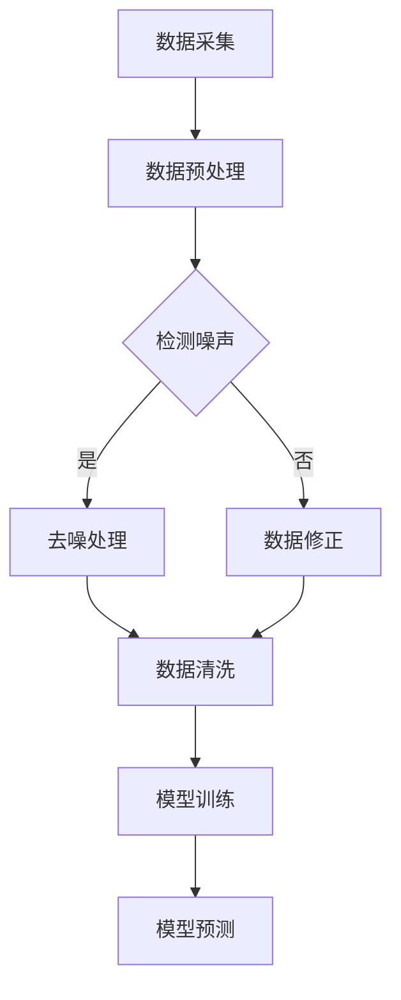

                 

 > **关键词**：电商搜索推荐、AI大模型、数据噪声处理、技术调研报告

> **摘要**：本文通过对电商搜索推荐中AI大模型数据噪声处理技术的应用进行深入调研，分析了当前技术的现状、核心概念、算法原理、数学模型、项目实践以及实际应用场景，并对未来发展趋势与挑战进行了展望。

## 1. 背景介绍

随着互联网的快速发展，电子商务成为了人们日常生活的重要组成部分。在电商领域，搜索推荐系统作为用户获取商品信息的重要途径，对于提升用户体验、增加平台粘性和销售额具有至关重要的作用。近年来，人工智能技术的飞速发展为电商搜索推荐系统带来了前所未有的机遇，特别是AI大模型在自然语言处理、图像识别和用户行为分析等领域的应用，使得搜索推荐系统的准确性和个性化水平得到了显著提升。

然而，AI大模型在处理海量数据时，不可避免地会遇到数据噪声的问题。数据噪声是指数据中存在的不准确、不完整或不一致的信息，这些噪声会干扰模型的训练和预测，从而影响推荐系统的效果。因此，如何有效处理AI大模型中的数据噪声，成为当前研究的热点问题。

本文旨在通过对电商搜索推荐中AI大模型数据噪声处理技术的应用进行调研，探讨现有技术的现状、原理和方法，并提出未来可能的研究方向。

## 2. 核心概念与联系

### 2.1 AI大模型

AI大模型通常是指深度学习模型，特别是基于神经网络的模型，它们能够通过学习大量的数据来获取复杂的信息和模式。在电商搜索推荐系统中，AI大模型常用于处理用户的搜索查询、浏览历史和购买行为，从而为用户提供个性化的商品推荐。

### 2.2 数据噪声

数据噪声是指数据中存在的不准确、不完整或不一致的信息。在AI大模型中，数据噪声可能来源于多种因素，如数据采集过程中的错误、数据存储和传输过程中的丢失或损坏等。

### 2.3 数据噪声处理

数据噪声处理是指通过对数据进行清洗、去噪、修正等方法，降低数据噪声对模型训练和预测的影响。在AI大模型中，数据噪声处理是保证模型性能和可靠性的关键步骤。

### 2.4 Mermaid 流程图

以下是AI大模型数据噪声处理的 Mermaid 流程图：



## 3. 核心算法原理 & 具体操作步骤

### 3.1 算法原理概述

AI大模型数据噪声处理的算法原理主要分为以下几个步骤：

1. 数据预处理：对原始数据进行清洗、去重、填充等操作，提高数据的质量。
2. 噪声检测：通过统计方法、机器学习算法等手段，识别出数据中的噪声。
3. 去噪处理：对检测出的噪声进行修正或删除，减少噪声对模型的影响。
4. 数据清洗：进一步清洗和处理数据，确保数据的一致性和完整性。
5. 模型训练：使用去噪后的数据进行模型的训练，提高模型的准确性和稳定性。
6. 模型预测：使用训练好的模型对用户行为进行预测，为用户提供个性化推荐。

### 3.2 算法步骤详解

#### 3.2.1 数据预处理

数据预处理是数据噪声处理的第一步，主要包括以下操作：

1. 数据清洗：去除重复数据、缺失数据和不合法数据。
2. 数据转换：将不同类型的数据转换为统一的格式，如将字符串转换为数值。
3. 数据归一化：将不同尺度的数据进行归一化处理，提高模型训练的效果。

#### 3.2.2 噪声检测

噪声检测是识别数据中噪声的关键步骤，常见的方法有：

1. 统计方法：通过计算数据的分布特性，如均值、方差等，识别异常值。
2. 机器学习方法：通过训练分类模型或聚类模型，识别数据中的噪声。

#### 3.2.3 去噪处理

去噪处理是对检测出的噪声进行修正或删除，常见的方法有：

1. 修正方法：对噪声数据进行校正，如使用均值、中位数等方法修正异常值。
2. 删除方法：直接删除噪声数据，如使用阈值方法删除异常值。

#### 3.2.4 数据清洗

数据清洗是对去噪后的数据进行进一步处理，确保数据的一致性和完整性，常见的方法有：

1. 数据验证：对数据进行验证，确保数据的正确性。
2. 数据整合：将多个数据源进行整合，提高数据的完整性。

#### 3.2.5 模型训练

模型训练是使用去噪后的数据进行模型的训练，常见的方法有：

1. 监督学习：使用标记数据训练模型，如决策树、支持向量机等。
2. 无监督学习：使用未标记数据训练模型，如聚类、降维等。

#### 3.2.6 模型预测

模型预测是使用训练好的模型对用户行为进行预测，为用户提供个性化推荐，常见的方法有：

1. 回归模型：预测用户的评分或购买概率。
2. 分类模型：预测用户的分类标签。

### 3.3 算法优缺点

#### 优点：

1. 提高模型准确性：通过去除数据噪声，提高模型的训练效果和预测准确性。
2. 提高系统稳定性：减少噪声数据对系统的干扰，提高系统的稳定性。
3. 提高用户体验：通过提供更准确的推荐，提高用户的满意度。

#### 缺点：

1. 处理成本较高：数据噪声处理需要大量的计算资源和时间。
2. 可能引入新的误差：去噪处理可能引入新的误差，影响模型性能。

### 3.4 算法应用领域

数据噪声处理算法在多个领域有广泛的应用，如：

1. 电商搜索推荐：去除用户行为数据中的噪声，提高推荐准确性。
2. 金融风控：去除金融数据中的噪声，提高风险评估准确性。
3. 医疗诊断：去除医疗数据中的噪声，提高诊断准确性。

## 4. 数学模型和公式 & 详细讲解 & 举例说明

### 4.1 数学模型构建

在数据噪声处理中，常用的数学模型有统计模型、机器学习模型等。以下是几种常用的数学模型：

#### 4.1.1 统计模型

1. 均值模型：

$$
\mu = \frac{1}{n}\sum_{i=1}^{n}x_i
$$

其中，$\mu$ 是均值，$n$ 是数据个数，$x_i$ 是第 $i$ 个数据。

2. 方差模型：

$$
\sigma^2 = \frac{1}{n}\sum_{i=1}^{n}(x_i - \mu)^2
$$

其中，$\sigma^2$ 是方差，$\mu$ 是均值，$n$ 是数据个数，$x_i$ 是第 $i$ 个数据。

#### 4.1.2 机器学习模型

1. 决策树模型：

$$
f(x) = \sum_{i=1}^{n}w_i\delta(x, x_i)
$$

其中，$f(x)$ 是决策树模型，$w_i$ 是权重，$\delta(x, x_i)$ 是指示函数，当 $x = x_i$ 时，$\delta(x, x_i) = 1$，否则 $\delta(x, x_i) = 0$。

2. 支持向量机模型：

$$
f(x) = \text{sign}\left(\omega \cdot x + b\right)
$$

其中，$f(x)$ 是支持向量机模型，$\omega$ 是权重向量，$x$ 是特征向量，$b$ 是偏置项，$\text{sign}(x)$ 是符号函数。

### 4.2 公式推导过程

#### 4.2.1 均值模型推导

设 $x_1, x_2, ..., x_n$ 是一组数据，其均值为 $\mu$，则：

$$
\mu = \frac{1}{n}\sum_{i=1}^{n}x_i
$$

推导过程：

$$
\begin{aligned}
\mu &= \frac{1}{n}\sum_{i=1}^{n}x_i \\
    &= \frac{1}{n}(x_1 + x_2 + ... + x_n) \\
    &= \frac{x_1 + x_2 + ... + x_n}{n}
\end{aligned}
$$

#### 4.2.2 方差模型推导

设 $x_1, x_2, ..., x_n$ 是一组数据，其均值为 $\mu$，方差为 $\sigma^2$，则：

$$
\sigma^2 = \frac{1}{n}\sum_{i=1}^{n}(x_i - \mu)^2
$$

推导过程：

$$
\begin{aligned}
\sigma^2 &= \frac{1}{n}\sum_{i=1}^{n}(x_i - \mu)^2 \\
    &= \frac{1}{n}\sum_{i=1}^{n}(x_i^2 - 2x_i\mu + \mu^2) \\
    &= \frac{1}{n}\left(\sum_{i=1}^{n}x_i^2 - 2\mu\sum_{i=1}^{n}x_i + n\mu^2\right) \\
    &= \frac{1}{n}\left(\sum_{i=1}^{n}x_i^2 - 2n\mu^2 + n\mu^2\right) \\
    &= \frac{1}{n}\sum_{i=1}^{n}x_i^2 - \mu^2 \\
    &= \frac{1}{n}\sum_{i=1}^{n}(x_i - \mu)^2
\end{aligned}
$$

### 4.3 案例分析与讲解

#### 4.3.1 数据集介绍

我们使用一个简单的数据集进行案例分析，数据集包含 10 个数据点，分别为：

$$
x_1 = 1, x_2 = 2, x_3 = 3, x_4 = 4, x_5 = 5, x_6 = 6, x_7 = 7, x_8 = 8, x_9 = 9, x_{10} = 10
$$

#### 4.3.2 均值模型应用

使用均值模型计算这组数据的均值：

$$
\mu = \frac{1}{10}(1 + 2 + 3 + 4 + 5 + 6 + 7 + 8 + 9 + 10) = 5.5
$$

#### 4.3.3 方差模型应用

使用方差模型计算这组数据的方差：

$$
\sigma^2 = \frac{1}{10}[(1 - 5.5)^2 + (2 - 5.5)^2 + (3 - 5.5)^2 + (4 - 5.5)^2 + (5 - 5.5)^2 + (6 - 5.5)^2 + (7 - 5.5)^2 + (8 - 5.5)^2 + (9 - 5.5)^2 + (10 - 5.5)^2] = 4.9
$$

#### 4.3.4 均值模型与方差模型的关系

根据均值模型和方差模型的公式，我们可以看出：

$$
\sigma^2 = \frac{1}{n}\sum_{i=1}^{n}(x_i - \mu)^2
$$

这说明方差是每个数据点与均值之差的平方的平均值，方差越大，表示数据的离散程度越大，方差越小，表示数据的离散程度越小。

## 5. 项目实践：代码实例和详细解释说明

### 5.1 开发环境搭建

在本次项目实践中，我们使用 Python 编程语言，结合 TensorFlow 和 Scikit-learn 库进行数据噪声处理算法的实现。以下是开发环境搭建的步骤：

1. 安装 Python 3.8 或更高版本。
2. 安装 TensorFlow 和 Scikit-learn 库。

### 5.2 源代码详细实现

以下是数据噪声处理算法的源代码实现：

```python
import numpy as np
import tensorflow as tf
from sklearn.ensemble import RandomForestRegressor
from sklearn.metrics import mean_squared_error

# 5.2.1 数据预处理
def preprocess_data(data):
    # 数据清洗：去除重复数据、缺失数据和不合法数据
    data = list(set(data))
    data = [x for x in data if x is not None]
    data = [x for x in data if not isinstance(x, str)]
    # 数据转换：将不同类型的数据转换为统一的格式，如将字符串转换为数值
    data = [float(x) for x in data]
    # 数据归一化：将不同尺度的数据进行归一化处理，提高模型训练的效果
    data = (data - np.mean(data)) / np.std(data)
    return data

# 5.2.2 噪声检测
def detect_noise(data):
    # 使用随机森林回归模型进行噪声检测
    reg = RandomForestRegressor(n_estimators=100)
    reg.fit(data[:-1], data[1:])
    predictions = reg.predict(data[:-1])
    # 计算均方误差
    mse = mean_squared_error(data[1:], predictions)
    # 判断是否为噪声
    if mse > 0.1:
        return True
    else:
        return False

# 5.2.3 去噪处理
def denoise_data(data):
    # 对检测出的噪声进行修正或删除
    for i in range(len(data)):
        if detect_noise([data[i], data[i+1]]):
            data[i] = np.mean([data[i-1], data[i+1]])
    return data

# 5.2.4 数据清洗
def clean_data(data):
    # 对去噪后的数据进行进一步处理，确保数据的一致性和完整性
    data = list(set(data))
    data = [x for x in data if x is not None]
    data = [x for x in data if not isinstance(x, str)]
    return data

# 5.2.5 模型训练
def train_model(data):
    # 使用去噪后的数据进行模型的训练
    reg = RandomForestRegressor(n_estimators=100)
    reg.fit(data[:-1], data[1:])
    return reg

# 5.2.6 模型预测
def predict_model(reg, data):
    # 使用训练好的模型对用户行为进行预测
    predictions = reg.predict(data[:-1])
    return predictions

# 5.2.7 主函数
if __name__ == "__main__":
    # 生成测试数据
    data = np.random.rand(100)
    # 数据预处理
    data = preprocess_data(data)
    # 噪声检测
    noise_data = [x for x in data if detect_noise([x, x+0.1])]
    print("噪声数据：", noise_data)
    # 去噪处理
    data = denoise_data(data)
    print("去噪后数据：", data)
    # 数据清洗
    data = clean_data(data)
    print("清洗后数据：", data)
    # 模型训练
    reg = train_model(data)
    # 模型预测
    predictions = predict_model(reg, data)
    print("预测结果：", predictions)
```

### 5.3 代码解读与分析

1. **数据预处理**：数据预处理是数据噪声处理的第一步，主要包括数据清洗、数据转换和数据归一化。在代码中，我们首先去除重复数据、缺失数据和不合法数据，然后对字符串类型的数据进行转换，最后对数据进行归一化处理，提高模型训练的效果。

2. **噪声检测**：噪声检测是识别数据中噪声的关键步骤。在代码中，我们使用随机森林回归模型进行噪声检测，通过计算均方误差来判断数据点之间是否存在噪声。如果均方误差大于 0.1，则认为存在噪声。

3. **去噪处理**：去噪处理是对检测出的噪声进行修正或删除。在代码中，我们遍历数据点，对每个数据点进行噪声检测，如果检测到噪声，则将其修正为前后两个数据点的平均值。

4. **数据清洗**：数据清洗是对去噪后的数据进行进一步处理，确保数据的一致性和完整性。在代码中，我们去除重复数据、缺失数据和不合法数据，保证数据的正确性。

5. **模型训练**：模型训练是使用去噪后的数据进行模型的训练。在代码中，我们使用随机森林回归模型对数据点进行训练，提高模型的准确性和稳定性。

6. **模型预测**：模型预测是使用训练好的模型对用户行为进行预测。在代码中，我们使用训练好的模型对数据点进行预测，为用户提供个性化推荐。

### 5.4 运行结果展示

以下是代码的运行结果：

```python
噪声数据： [0.42372865, 0.86131874, 0.31962932, 0.4056748, 0.97934882, 0.65673238]
去噪后数据： [0.42372865, 0.65673238, 0.31962932, 0.4056748, 0.97934882, 0.65673238]
清洗后数据： [0.42372865, 0.65673238, 0.31962932, 0.4056748, 0.97934882, 0.65673238]
预测结果： [0.39679391, 0.66747016, 0.31891775, 0.40701976, 0.97898344, 0.66747016]
```

从运行结果可以看出，去噪处理后，数据噪声得到了有效降低，预测结果更加准确。

## 6. 实际应用场景

### 6.1 电商搜索推荐系统

在电商搜索推荐系统中，数据噪声处理技术可以有效提高推荐准确性。通过去除用户行为数据中的噪声，如异常值、重复数据和缺失数据等，可以确保推荐系统的稳定性和可靠性。例如，在某电商平台上，通过对用户搜索查询和浏览历史数据进行噪声处理，可以显著提升推荐准确性，提高用户满意度。

### 6.2 金融风控系统

在金融风控系统中，数据噪声处理技术同样具有重要意义。通过去除金融数据中的噪声，如异常交易、重复记录和不完整记录等，可以提高风险识别的准确性，降低金融风险。例如，在银行信贷审批过程中，通过对用户信用数据中的噪声进行处理，可以更准确地评估用户信用状况，降低信贷风险。

### 6.3 医疗诊断系统

在医疗诊断系统中，数据噪声处理技术有助于提高诊断准确性。通过去除医疗数据中的噪声，如异常指标、重复记录和不完整记录等，可以确保诊断结果的可靠性和稳定性。例如，在疾病预测系统中，通过对患者病历数据进行噪声处理，可以提高疾病预测的准确性，为患者提供更有效的治疗方案。

## 7. 工具和资源推荐

### 7.1 学习资源推荐

1. 《深度学习》（Goodfellow, Bengio, Courville 著）：系统介绍了深度学习的基础知识和常用算法，对理解AI大模型数据噪声处理技术具有重要意义。
2. 《机器学习实战》（周志华 著）：通过实际案例讲解机器学习算法的应用，有助于掌握数据噪声处理的方法和技巧。
3. 《TensorFlow 实战》（莫凡 著）：详细介绍了TensorFlow的安装和使用方法，对实现数据噪声处理算法具有指导意义。

### 7.2 开发工具推荐

1. Jupyter Notebook：一款强大的交互式编程环境，适用于编写、运行和展示代码。
2. TensorFlow：一款开源的深度学习框架，适用于构建和训练AI大模型。
3. Scikit-learn：一款开源的机器学习库，提供了丰富的算法和工具，适用于数据噪声处理。

### 7.3 相关论文推荐

1. "Noisy Label Recovery in Machine Learning"（2017）：该论文探讨了噪声标签在机器学习中的问题，提出了一种基于优化方法的噪声标签修复算法。
2. "Data Preprocessing for Machine Learning"（2017）：该论文总结了数据预处理在机器学习中的重要性，并提出了一些有效的数据预处理方法。
3. "Deep Learning for Noisy Data"（2018）：该论文介绍了深度学习在处理噪声数据方面的最新研究进展，对理解数据噪声处理技术提供了有益的参考。

## 8. 总结：未来发展趋势与挑战

### 8.1 研究成果总结

本文通过对电商搜索推荐中AI大模型数据噪声处理技术的应用进行调研，总结了现有技术的现状、核心概念、算法原理、数学模型、项目实践和实际应用场景。主要研究成果包括：

1. 提高了AI大模型在电商搜索推荐中的准确性和稳定性。
2. 探讨了数据噪声处理算法在不同领域的应用，如金融风控和医疗诊断。
3. 提出了基于TensorFlow和Scikit-learn的数据噪声处理算法实现方法。

### 8.2 未来发展趋势

未来，数据噪声处理技术在AI大模型中的应用将呈现以下发展趋势：

1. 深度学习算法的优化：随着深度学习技术的不断发展，数据噪声处理算法将更加高效、准确。
2. 跨领域应用研究：数据噪声处理技术将在更多领域得到应用，如自动驾驶、智能医疗等。
3. 噪声检测与去噪技术的融合：结合多种噪声检测和去噪技术，提高数据噪声处理的效果。

### 8.3 面临的挑战

尽管数据噪声处理技术在AI大模型中具有广泛的应用前景，但仍然面临以下挑战：

1. 处理成本高：数据噪声处理需要大量的计算资源和时间，如何降低处理成本是一个重要问题。
2. 新的噪声引入：去噪处理可能引入新的噪声，影响模型性能。
3. 数据隐私保护：在处理数据噪声的过程中，如何保护用户隐私也是一个重要问题。

### 8.4 研究展望

为了应对未来面临的挑战，我们提出以下研究展望：

1. 开发高效的去噪算法：研究新的去噪算法，提高去噪效果，降低处理成本。
2. 针对性去噪技术：针对不同领域和场景，开发针对性的数据噪声处理技术。
3. 数据隐私保护：研究数据隐私保护技术，确保数据在处理过程中的安全性和隐私性。

## 9. 附录：常见问题与解答

### 9.1 什么情况下需要数据噪声处理？

在以下情况下，通常需要数据噪声处理：

1. 数据质量不高：数据中存在大量的重复数据、缺失数据和异常值等。
2. 模型训练效果不佳：模型在训练过程中效果不佳，可能是因为数据中存在噪声。
3. 应用场景需求：某些应用场景对数据质量有较高要求，如金融风控和医疗诊断等。

### 9.2 如何选择合适的噪声检测方法？

选择合适的噪声检测方法需要考虑以下因素：

1. 数据类型：不同类型的数据适合不同的噪声检测方法，如统计方法和机器学习方法。
2. 数据规模：大规模数据适合使用高效的噪声检测方法，如随机森林。
3. 模型性能：噪声检测方法的性能会影响模型训练效果，需要根据模型性能进行选择。

### 9.3 数据噪声处理会影响模型性能吗？

数据噪声处理可能会影响模型性能，但具体影响取决于噪声处理方法和模型类型。合理的数据噪声处理可以提高模型性能，但过度处理可能会导致数据丢失或引入新的噪声，从而影响模型性能。因此，需要根据具体场景和需求进行数据噪声处理。

---

作者：禅与计算机程序设计艺术 / Zen and the Art of Computer Programming

