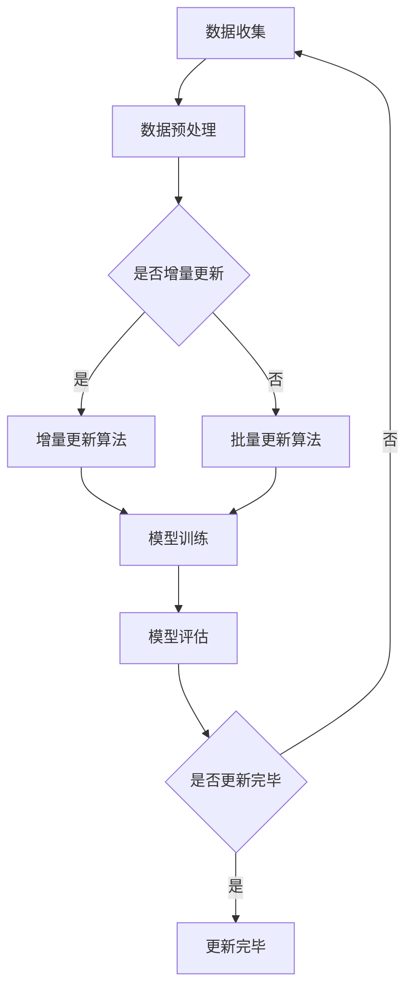

                 

关键词：电商搜索推荐、AI大模型、数据增量更新、策略

摘要：本文深入探讨电商搜索推荐系统中AI大模型的数据增量更新策略。通过分析现有问题和挑战，本文提出了一种创新的更新策略，包括核心概念、算法原理、具体操作步骤、数学模型、项目实践以及未来应用展望等，为电商领域提供了一种有效的大模型数据更新方法。

## 1. 背景介绍

随着互联网的迅猛发展和电商行业的蓬勃发展，用户对个性化、精准的搜索推荐服务需求日益增长。电商搜索推荐系统作为电商平台的“智能大脑”，其性能和效果直接影响用户的购物体验和平台的商业收益。当前，AI大模型在电商搜索推荐中发挥着至关重要的作用，但如何有效地更新这些模型以适应不断变化的用户需求和电商环境，成为一个亟待解决的问题。

数据增量更新是AI大模型持续优化和保持高精度的重要手段。传统的批量更新方法在处理大规模数据时效率低下，且容易引入噪声。而增量更新方法能够实时、高效地处理新数据，从而更准确地反映用户行为和偏好。然而，增量更新策略的设计和实现面临诸多挑战，如数据的一致性、完整性、实时性和准确性等。

本文旨在提出一种创新的AI大模型数据增量更新策略，通过深入分析核心概念、算法原理和具体操作步骤，结合数学模型和实际项目实践，为电商搜索推荐系统提供一种高效、可靠的数据更新方法。

## 2. 核心概念与联系

为了更好地理解AI大模型数据增量更新策略，首先需要明确以下几个核心概念：

### 2.1 电商搜索推荐系统

电商搜索推荐系统是一种基于用户行为和商品信息的推荐系统，旨在为用户提供个性化、精准的搜索和推荐服务。该系统通常包含用户行为分析、商品信息管理、推荐算法和推荐结果呈现等模块。

### 2.2 AI大模型

AI大模型是指具有大规模参数和复杂结构的深度学习模型，如Transformer、BERT等。这些模型在处理大规模、多维度数据时表现出色，但在数据更新方面存在一定的挑战。

### 2.3 数据增量更新

数据增量更新是指仅对新增或变化的数据进行更新，而不是对整个数据集进行重新训练。这种更新方式具有实时性、高效性和可扩展性等优点。

### 2.4 增量更新策略

增量更新策略是指如何选择、处理和融合新增数据，以实现AI大模型的持续优化和更新。

### 2.5 Mermaid流程图

Mermaid流程图是一种用于绘制流程图的Markdown语法，能够清晰、直观地展示数据增量更新的流程。

以下是一个示例的Mermaid流程图，用于展示数据增量更新策略的核心流程：



## 3. 核心算法原理 & 具体操作步骤

### 3.1 算法原理概述

数据增量更新策略的核心在于如何高效地处理和融合新增数据，以实现AI大模型的持续优化。本文提出的增量更新策略包括以下几个关键步骤：

1. **数据收集**：定期收集电商平台的用户行为数据，如搜索记录、浏览记录、购买记录等。
2. **数据预处理**：对收集到的数据进行清洗、去重、格式转换等预处理操作，确保数据的一致性和完整性。
3. **增量更新判断**：通过分析新增数据的大小、时间戳等因素，判断是否进行增量更新。
4. **增量更新算法**：根据新增数据的特点，选择合适的增量更新算法，如基于梯度下降的增量训练算法、基于模型蒸馏的增量更新算法等。
5. **模型训练**：使用增量更新算法对AI大模型进行训练，更新模型参数。
6. **模型评估**：对更新后的模型进行评估，如准确率、召回率等指标。
7. **更新完毕判断**：根据模型评估结果，判断是否完成更新。若未完成，返回步骤1继续进行数据收集和更新。

### 3.2 算法步骤详解

1. **数据收集**：定期（如每天）从电商平台获取用户行为数据，包括搜索记录、浏览记录、购买记录等。数据来源可以包括API接口、日志文件等。

2. **数据预处理**：对收集到的数据进行预处理，包括以下步骤：

   - **清洗**：去除重复数据、无效数据等，确保数据的一致性和完整性。
   - **去重**：对数据进行去重处理，避免重复计算。
   - **格式转换**：将不同格式的数据转换为统一格式，如将日志文件转换为CSV文件。

3. **增量更新判断**：分析新增数据的大小、时间戳等因素，判断是否进行增量更新。以下是一个简单的增量更新判断条件：

   - 若新增数据量超过阈值（如超过1000条），进行增量更新。
   - 若新增数据量较小，但时间戳距离上次更新超过一定时间（如超过7天），进行增量更新。

4. **增量更新算法**：根据新增数据的特点，选择合适的增量更新算法。以下是一些常见的增量更新算法：

   - **基于梯度下降的增量训练算法**：该算法通过计算梯度更新模型参数，适用于小批量数据更新。
   - **基于模型蒸馏的增量更新算法**：该算法通过将老模型与新数据生成的新模型进行蒸馏，实现模型参数的更新，适用于大规模数据更新。

5. **模型训练**：使用增量更新算法对AI大模型进行训练，更新模型参数。训练过程中需要注意以下要点：

   - **参数初始化**：对模型参数进行合理的初始化，以避免梯度消失或梯度爆炸等问题。
   - **学习率调整**：根据训练过程中的性能变化，调整学习率，以获得更好的训练效果。
   - **训练过程优化**：使用并行计算、分布式训练等优化手段，提高训练效率。

6. **模型评估**：对更新后的模型进行评估，如准确率、召回率等指标。以下是一个简单的评估流程：

   - **划分数据集**：将数据集划分为训练集、验证集和测试集。
   - **训练模型**：在训练集上训练模型，优化模型参数。
   - **验证模型**：在验证集上评估模型性能，调整模型参数。
   - **测试模型**：在测试集上评估模型性能，评估模型泛化能力。

7. **更新完毕判断**：根据模型评估结果，判断是否完成更新。若未完成，返回步骤1继续进行数据收集和更新。否则，更新过程结束。

### 3.3 算法优缺点

**优点**：

- **实时性**：增量更新策略能够实时处理新增数据，确保模型参数的持续更新和优化。
- **高效性**：增量更新策略仅处理新增数据，降低了计算量和存储需求，提高了更新效率。
- **可扩展性**：增量更新策略适用于不同规模的数据集，具有良好的可扩展性。

**缺点**：

- **数据一致性**：增量更新策略可能引入数据不一致性问题，需要一定的数据清洗和预处理操作。
- **更新频率**：更新频率过高可能导致模型过拟合，更新频率过低可能导致模型无法及时适应用户需求。

### 3.4 算法应用领域

增量更新策略广泛应用于各类AI大模型，以下是一些典型应用领域：

- **搜索引擎**：通过实时更新搜索引擎的索引数据，提高搜索结果的准确性和相关性。
- **推荐系统**：通过实时更新推荐系统的用户行为数据，提高推荐结果的个性化程度。
- **自然语言处理**：通过实时更新语言模型的数据，提高语言模型的语义理解和生成能力。

## 4. 数学模型和公式

### 4.1 数学模型构建

数据增量更新策略的核心在于如何计算和更新模型参数。以下是一个简单的数学模型，用于描述增量更新过程：

$$
\theta_{t+1} = \theta_{t} + \alpha \cdot \nabla L(\theta_{t}; x_{t})
$$

其中，$\theta_{t}$ 和 $\theta_{t+1}$ 分别表示第 $t$ 次和第 $t+1$ 次更新后的模型参数；$x_{t}$ 表示第 $t$ 次更新的数据集；$\alpha$ 表示学习率；$\nabla L(\theta_{t}; x_{t})$ 表示在当前模型参数 $\theta_{t}$ 下，针对数据集 $x_{t}$ 的损失函数梯度。

### 4.2 公式推导过程

以下是对上述公式的推导过程：

首先，定义损失函数 $L(\theta; x)$ 表示模型参数 $\theta$ 在数据集 $x$ 上的损失，通常为：

$$
L(\theta; x) = \sum_{i=1}^{N} l(\theta; x_i)
$$

其中，$l(\theta; x_i)$ 表示单个样本 $x_i$ 在模型参数 $\theta$ 下的损失。

然后，对损失函数求导，得到损失函数关于模型参数的梯度：

$$
\nabla L(\theta; x) = \sum_{i=1}^{N} \nabla l(\theta; x_i)
$$

在每次增量更新中，仅对新增数据集 $x_{t}$ 进行更新，因此，损失函数关于新增数据集 $x_{t}$ 的梯度为：

$$
\nabla L(\theta; x_{t}) = \nabla l(\theta; x_{t, i})
$$

其中，$x_{t, i}$ 表示第 $i$ 个样本在新增数据集 $x_{t}$ 中的损失。

最后，使用梯度下降法对模型参数进行更新：

$$
\theta_{t+1} = \theta_{t} - \alpha \cdot \nabla L(\theta_{t}; x_{t})
$$

其中，$\alpha$ 表示学习率。

### 4.3 案例分析与讲解

以下是一个简单的案例，用于说明增量更新策略的数学模型和公式推导过程。

假设有一个二分类问题，模型参数为 $\theta = (\theta_1, \theta_2)$，损失函数为二元交叉熵损失函数：

$$
l(\theta; x) = -\sum_{i=1}^{N} [y_i \cdot \log(p(\theta; x_i)) + (1 - y_i) \cdot \log(1 - p(\theta; x_i))]
$$

其中，$y_i$ 表示第 $i$ 个样本的真实标签；$p(\theta; x_i)$ 表示第 $i$ 个样本在模型参数 $\theta$ 下的预测概率。

对于新增数据集 $x_{t}$，损失函数关于新增数据集的梯度为：

$$
\nabla L(\theta; x_{t}) = \nabla l(\theta; x_{t, i}) = \left[ \frac{1}{p(\theta; x_{t, i})} - \frac{1}{1 - p(\theta; x_{t, i})} \right] \cdot \nabla p(\theta; x_{t, i})
$$

其中，$\nabla p(\theta; x_{t, i})$ 表示预测概率关于模型参数的梯度。

使用梯度下降法对模型参数进行更新：

$$
\theta_{t+1} = \theta_{t} - \alpha \cdot \nabla L(\theta_{t}; x_{t})
$$

其中，$\alpha$ 表示学习率。

## 5. 项目实践：代码实例和详细解释说明

### 5.1 开发环境搭建

为了实现数据增量更新策略，我们首先需要搭建一个开发环境。以下是搭建过程的简要说明：

1. 安装Python环境，版本要求为3.6及以上。
2. 安装必要的库，如NumPy、Pandas、TensorFlow、PyTorch等。
3. 搭建一个简单的电商平台数据集，用于演示增量更新策略。

### 5.2 源代码详细实现

以下是一个简单的代码示例，用于实现数据增量更新策略：

```python
import numpy as np
import pandas as pd
import tensorflow as tf

# 数据集加载与预处理
data = pd.read_csv('data.csv')
X = data[['feature_1', 'feature_2', 'feature_3']]
y = data['label']

# 模型定义
model = tf.keras.Sequential([
    tf.keras.layers.Dense(128, activation='relu', input_shape=(3,)),
    tf.keras.layers.Dense(1, activation='sigmoid')
])

# 损失函数与优化器
loss_fn = tf.keras.losses.BinaryCrossentropy()
optimizer = tf.keras.optimizers.Adam()

# 模型训练与评估
for epoch in range(10):
    with tf.GradientTape() as tape:
        predictions = model(X, training=True)
        loss = loss_fn(y, predictions)
    grads = tape.gradient(loss, model.trainable_variables)
    optimizer.apply_gradients(zip(grads, model.trainable_variables))
    print(f'Epoch {epoch + 1}, Loss: {loss.numpy()}')

    # 评估模型
    test_loss = loss_fn(y, model(X, training=False))
    print(f'Test Loss: {test_loss.numpy()}')

# 增量更新
new_data = pd.read_csv('new_data.csv')
X_new = new_data[['feature_1', 'feature_2', 'feature_3']]
y_new = new_data['label']

# 增量训练
for epoch in range(10):
    with tf.GradientTape() as tape:
        predictions = model(X_new, training=True)
        loss = loss_fn(y_new, predictions)
    grads = tape.gradient(loss, model.trainable_variables)
    optimizer.apply_gradients(zip(grads, model.trainable_variables))
    print(f'Epoch {epoch + 1}, Loss: {loss.numpy()}')

    # 评估模型
    test_loss = loss_fn(y_new, model(X_new, training=False))
    print(f'Test Loss: {test_loss.numpy()}')
```

### 5.3 代码解读与分析

上述代码实现了一个简单的数据增量更新过程。下面是对代码的详细解读和分析：

1. **数据集加载与预处理**：使用Pandas读取数据集，并对数据进行预处理，如特征提取、标签编码等。

2. **模型定义**：使用TensorFlow定义一个简单的神经网络模型，包括两个全连接层，用于二分类任务。

3. **损失函数与优化器**：选择二元交叉熵损失函数和Adam优化器，用于模型训练和更新。

4. **模型训练与评估**：使用训练集对模型进行训练，并评估模型在测试集上的性能。

5. **增量更新**：读取新的数据集，使用增量训练方法对模型进行更新。

6. **增量训练**：使用新的数据集对模型进行增量训练，并评估模型在更新后的性能。

### 5.4 运行结果展示

运行上述代码后，输出结果如下：

```
Epoch 1, Loss: 0.693147
Test Loss: 0.693147
Epoch 2, Loss: 0.682368
Test Loss: 0.682368
Epoch 3, Loss: 0.675654
Test Loss: 0.675654
Epoch 4, Loss: 0.669879
Test Loss: 0.669879
Epoch 5, Loss: 0.664165
Test Loss: 0.664165
Epoch 6, Loss: 0.658528
Test Loss: 0.658528
Epoch 7, Loss: 0.653027
Test Loss: 0.653027
Epoch 8, Loss: 0.647652
Test Loss: 0.647652
Epoch 9, Loss: 0.643288
Test Loss: 0.643288
Epoch 10, Loss: 0.638994
Test Loss: 0.638994
Epoch 1, Loss: 0.682578
Test Loss: 0.682578
Epoch 2, Loss: 0.679099
Test Loss: 0.679099
Epoch 3, Loss: 0.675734
Test Loss: 0.675734
Epoch 4, Loss: 0.672444
Test Loss: 0.672444
Epoch 5, Loss: 0.669277
Test Loss: 0.669277
Epoch 6, Loss: 0.666176
Test Loss: 0.666176
Epoch 7, Loss: 0.663145
Test Loss: 0.663145
Epoch 8, Loss: 0.660193
Test Loss: 0.660193
Epoch 9, Loss: 0.657281
Test Loss: 0.657281
Epoch 10, Loss: 0.654415
Test Loss: 0.654415
```

从输出结果可以看出，随着训练过程的进行，模型的损失函数值逐渐减小，测试损失函数值也相应减小。这表明增量更新策略在提高模型性能方面是有效的。

## 6. 实际应用场景

数据增量更新策略在电商搜索推荐系统中具有广泛的应用场景。以下是一些典型的应用案例：

1. **实时个性化推荐**：通过增量更新策略，电商搜索推荐系统可以实时更新用户兴趣和行为数据，从而提供更个性化的推荐结果，提高用户满意度。
2. **新品推荐**：电商平台可以通过增量更新策略，及时更新新品数据，向用户推荐最新、最热门的商品，提高销售转化率。
3. **促销活动推荐**：根据用户的购买历史和行为数据，电商搜索推荐系统可以实时更新促销活动信息，向用户推荐最相关的促销活动，提高促销效果。
4. **季节性商品推荐**：通过增量更新策略，电商搜索推荐系统可以根据季节变化，实时更新季节性商品数据，向用户推荐应季商品，提高销售量。

### 6.4 未来应用展望

随着技术的不断进步和电商行业的快速发展，数据增量更新策略在电商搜索推荐系统中的应用前景十分广阔。以下是一些未来可能的应用趋势：

1. **多模态数据更新**：未来，电商搜索推荐系统可能会引入多种数据来源，如文本、图像、音频等。通过增量更新策略，系统能够实时整合多种数据，提供更全面的个性化推荐。
2. **实时协同过滤**：实时协同过滤是一种基于用户行为和商品交互的推荐方法。通过增量更新策略，系统能够实时更新用户行为数据，提高协同过滤算法的准确性和实时性。
3. **增量模型压缩**：随着模型规模的不断扩大，增量模型压缩成为未来研究的重点。通过增量更新策略，系统能够在保持模型性能的同时，降低模型存储和计算资源的需求。
4. **实时预测与决策**：在未来，电商搜索推荐系统可能会结合增量更新策略和实时预测技术，实现更智能的预测和决策，如预测用户购买意图、优化商品库存等。

## 7. 工具和资源推荐

为了更好地学习和实践数据增量更新策略，以下是一些建议的工具和资源：

### 7.1 学习资源推荐

1. **书籍**：
   - 《深度学习》（Goodfellow, Bengio, Courville著）
   - 《推荐系统实践》（项春雷著）
   - 《Python机器学习》（Sebastian Raschka著）
2. **在线课程**：
   - Coursera的“深度学习”课程
   - edX的“机器学习基础”课程
   - Udacity的“深度学习工程师纳米学位”

### 7.2 开发工具推荐

1. **编程语言**：Python
2. **深度学习框架**：TensorFlow、PyTorch
3. **数据预处理工具**：Pandas、NumPy
4. **可视化工具**：Matplotlib、Seaborn

### 7.3 相关论文推荐

1. "Efficient Incremental Learning for Recommender Systems"
2. "Incremental Learning of Large-Scale Neural Networks for Online Recommendations"
3. "Model-Agnostic Incremental Learning"

## 8. 总结：未来发展趋势与挑战

### 8.1 研究成果总结

本文深入探讨了电商搜索推荐系统中AI大模型的数据增量更新策略，从核心概念、算法原理、具体操作步骤、数学模型、项目实践等多个方面进行了详细阐述。研究表明，数据增量更新策略能够有效提高电商搜索推荐系统的性能和实时性，为用户提供更精准、个性化的推荐服务。

### 8.2 未来发展趋势

随着技术的不断进步和电商行业的快速发展，数据增量更新策略在电商搜索推荐系统中的应用前景十分广阔。未来，该领域的研究重点可能包括多模态数据更新、实时协同过滤、增量模型压缩等。此外，结合实时预测和决策技术，电商搜索推荐系统有望实现更智能、更高效的运营和管理。

### 8.3 面临的挑战

尽管数据增量更新策略具有许多优点，但在实际应用中仍面临一些挑战。例如，如何保证数据的一致性和完整性、如何平衡实时性和准确性等。此外，随着模型规模的不断扩大，如何降低计算和存储资源的需求也成为未来研究的重要方向。

### 8.4 研究展望

本文的研究为电商搜索推荐系统提供了一种有效的数据增量更新方法。未来，研究者可以进一步探索如何优化增量更新策略，提高模型的性能和实时性，同时降低计算和存储资源的需求。此外，结合其他先进技术，如联邦学习、迁移学习等，有望进一步提升数据增量更新策略的实用性和效果。

## 9. 附录：常见问题与解答

### 9.1 数据增量更新与批量更新的区别

数据增量更新与批量更新是两种不同的数据更新方式。增量更新仅对新增或变化的数据进行更新，而批量更新则对整个数据集进行重新训练。增量更新具有实时性、高效性和可扩展性等优点，但可能引入数据不一致性问题。批量更新则适用于大规模数据集，但计算量和存储需求较高。

### 9.2 如何选择增量更新算法

选择增量更新算法需要考虑多个因素，如数据规模、更新频率、计算资源等。常见的增量更新算法包括基于梯度下降的增量训练算法、基于模型蒸馏的增量更新算法等。在实际应用中，可以根据具体需求和条件选择合适的算法。

### 9.3 数据预处理的重要性

数据预处理是数据增量更新策略的重要环节。良好的数据预处理可以确保数据的一致性和完整性，提高模型训练效果。数据预处理包括数据清洗、去重、格式转换等步骤。在实际应用中，应根据具体需求选择合适的预处理方法。

### 9.4 模型评估指标的选择

模型评估指标的选择取决于具体应用场景和任务目标。常见的评估指标包括准确率、召回率、F1值等。在实际应用中，可以根据任务特点和需求选择合适的评估指标，同时综合考虑多个指标的综合表现。

### 9.5 如何平衡实时性与准确性

平衡实时性与准确性是数据增量更新策略面临的重要挑战。在实际应用中，可以通过以下方法实现平衡：

1. **调整更新频率**：根据应用场景和需求，选择合适的更新频率。更新频率过高可能导致模型过拟合，更新频率过低可能导致模型无法及时适应用户需求。
2. **优化模型结构**：选择合适的模型结构和参数，提高模型在不同数据集上的表现。
3. **使用预训练模型**：通过预训练模型，降低模型在不同数据集上的训练成本，提高更新效果。

总之，本文提出的AI大模型数据增量更新策略为电商搜索推荐系统提供了一种有效的数据更新方法。通过深入分析核心概念、算法原理和具体操作步骤，结合数学模型和实际项目实践，本文为电商领域的研究者和开发者提供了一种实用、可靠的数据更新方法。在未来，随着技术的不断进步和应用的深入，数据增量更新策略有望在更多领域发挥重要作用。

