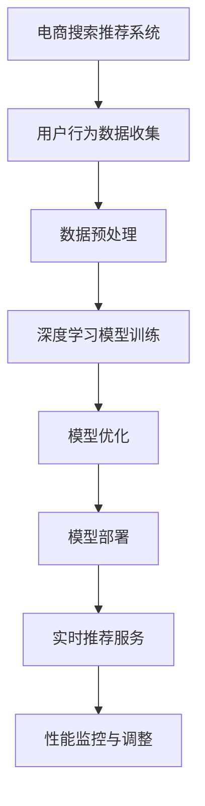

                 

关键词：电商搜索推荐，AI大模型，性能优化，模型部署，搜索推荐系统

摘要：本文针对电商搜索推荐场景下，AI大模型的模型部署性能优化问题进行了深入探讨。首先，介绍了电商搜索推荐系统的基本架构和AI大模型的应用场景。接着，详细分析了模型部署性能优化的关键因素，包括硬件优化、模型压缩与量化、分布式部署等。最后，通过实际案例分析，展示了性能优化措施的具体实现和效果。

## 1. 背景介绍

电商搜索推荐系统是电商平台的重要组成部分，其目的是为用户推荐他们可能感兴趣的商品，从而提升用户满意度和平台销售额。随着人工智能技术的快速发展，特别是深度学习技术的成熟，AI大模型在电商搜索推荐系统中得到了广泛应用。这些大模型通常基于大规模数据集训练，能够实现高度个性化的推荐效果。

然而，AI大模型的模型部署性能优化成为一个亟待解决的问题。首先，大模型的参数量和计算复杂度较高，导致模型部署过程中需要大量的计算资源和存储资源。其次，实时推荐的要求使得模型部署需要在短时间内完成，这进一步增加了性能优化的挑战。因此，如何优化AI大模型的模型部署性能，提高系统的响应速度和用户体验，成为当前研究的热点。

## 2. 核心概念与联系

在电商搜索推荐场景下，AI大模型的部署性能优化涉及多个核心概念和技术的联系。下面我们将使用Mermaid流程图来描述这些核心概念和技术的关联。



### 2.1 电商搜索推荐系统

电商搜索推荐系统主要包括用户行为数据的收集、处理和推荐算法的部署。用户行为数据包括用户浏览、搜索、购买等行为，通过这些数据，系统能够推断用户的兴趣和偏好。

### 2.2 用户行为数据收集

用户行为数据的收集是构建推荐系统的第一步。通过跟踪用户的操作，系统能够获取到用户的兴趣点，为后续的推荐提供基础。

### 2.3 数据预处理

收集到的用户行为数据通常包含噪声和不完整信息，因此需要进行预处理。预处理包括数据清洗、归一化和特征提取等步骤，以提高数据的质量和模型的训练效果。

### 2.4 深度学习模型训练

在预处理后的数据基础上，通过深度学习算法训练大模型。这一步骤是构建推荐系统的核心，模型的质量直接影响到推荐的效果。

### 2.5 模型优化

在模型训练完成后，需要对模型进行优化。优化包括模型剪枝、量化、蒸馏等技术，以减少模型的参数量和计算复杂度，提高部署性能。

### 2.6 模型部署

模型优化后，需要将其部署到生产环境中，以实现实时推荐服务。部署过程中需要考虑硬件配置、部署策略等因素。

### 2.7 实时推荐服务

实时推荐服务是将优化后的模型应用于用户行为数据，生成个性化的推荐结果。这要求系统具备高速响应和高可靠性。

### 2.8 性能监控与调整

部署后，需要对系统的性能进行监控和调整。通过实时监控系统的运行状态，及时发现并解决问题，确保推荐服务的稳定性和高效性。

## 3. 核心算法原理 & 具体操作步骤

### 3.1 算法原理概述

AI大模型模型部署性能优化的核心算法包括模型压缩与量化、分布式部署和硬件优化等。

### 3.2 算法步骤详解

#### 3.2.1 模型压缩与量化

1. **模型剪枝**：通过移除模型中的冗余参数，降低模型的复杂度，从而减少计算量和存储需求。
2. **量化**：将模型的浮点参数转换为整数参数，以减少存储空间和计算量。
3. **蒸馏**：将大模型的输出传递给一个小模型，以增强小模型的性能。

#### 3.2.2 分布式部署

1. **模型分割**：将模型拆分为多个部分，并在不同的计算节点上并行计算。
2. **流水线部署**：将模型的计算过程分解为多个阶段，每个阶段在不同的计算节点上执行。
3. **动态调度**：根据系统负载和资源情况，动态调整模型部署策略。

#### 3.2.3 硬件优化

1. **GPU加速**：利用GPU的并行计算能力，提高模型的训练和推理速度。
2. **内存优化**：通过优化内存管理，减少内存占用和缓存命中率。
3. **存储优化**：利用SSD等高速存储设备，提高数据读取速度。

### 3.3 算法优缺点

#### 3.3.1 模型压缩与量化

优点：减少模型参数量和计算复杂度，提高部署性能。

缺点：可能会影响模型的精度和泛化能力。

#### 3.3.2 分布式部署

优点：提高模型的计算速度和扩展性。

缺点：增加了系统的复杂度和运维难度。

#### 3.3.3 硬件优化

优点：充分利用硬件资源，提高模型训练和推理速度。

缺点：对硬件设备的要求较高，且成本较高。

### 3.4 算法应用领域

AI大模型模型部署性能优化技术可以应用于各类AI应用场景，包括但不限于：

1. **智能搜索**：如电商搜索、搜索引擎等，通过优化模型部署性能，提高搜索速度和准确性。
2. **智能推荐**：如电商推荐、内容推荐等，通过优化模型部署性能，提升推荐效果和用户体验。
3. **语音识别**：通过优化模型部署性能，提高语音识别的实时性和准确性。
4. **图像处理**：如人脸识别、物体检测等，通过优化模型部署性能，提高图像处理速度和效果。

## 4. 数学模型和公式 & 详细讲解 & 举例说明

### 4.1 数学模型构建

在电商搜索推荐系统中，我们通常使用协同过滤（Collaborative Filtering）和基于内容的推荐（Content-based Filtering）相结合的方法来构建推荐模型。

#### 4.1.1 协同过滤

协同过滤模型通常使用用户-物品评分矩阵 \(R\) 来表示用户和物品之间的关系。假设有 \(m\) 个用户和 \(n\) 个物品，则评分矩阵 \(R\) 可以表示为：

\[ R = \begin{pmatrix}
r_{11} & r_{12} & \cdots & r_{1n} \\
r_{21} & r_{22} & \cdots & r_{2n} \\
\vdots & \vdots & \ddots & \vdots \\
r_{m1} & r_{m2} & \cdots & r_{mn}
\end{pmatrix} \]

其中，\(r_{ij}\) 表示用户 \(i\) 对物品 \(j\) 的评分。

#### 4.1.2 基于内容的推荐

基于内容的推荐模型通常使用物品的特征向量来表示物品。假设有 \(k\) 个特征维度，则物品 \(j\) 的特征向量可以表示为：

\[ x_j = \begin{pmatrix}
x_{j1} \\
x_{j2} \\
\vdots \\
x_{jk}
\end{pmatrix} \]

用户 \(i\) 对物品 \(j\) 的评分可以表示为：

\[ r_{ij} = \langle x_i, x_j \rangle \]

其中，\(\langle \cdot, \cdot \rangle\) 表示向量的点积。

### 4.2 公式推导过程

我们将结合用户的行为数据和物品的特征，构建一个综合的推荐模型。设用户 \(i\) 对物品 \(j\) 的实际评分 \(r_{ij}\) 可以通过以下公式计算：

\[ r_{ij} = \mu_i + \mu_j + q_{ij} \]

其中，\(\mu_i\) 和 \(\mu_j\) 分别表示用户 \(i\) 的平均评分和物品 \(j\) 的平均评分，\(q_{ij}\) 表示用户 \(i\) 对物品 \(j\) 的个性化评分。

#### 4.2.1 用户平均评分

\[ \mu_i = \frac{1}{n_i} \sum_{j=1}^{n} r_{ij} \]

其中，\(n_i\) 表示用户 \(i\) 对物品的总评分数。

#### 4.2.2 物品平均评分

\[ \mu_j = \frac{1}{m_j} \sum_{i=1}^{m} r_{ij} \]

其中，\(m_j\) 表示物品 \(j\) 的总评分数。

#### 4.2.3 个性化评分

\[ q_{ij} = \sigma(W_i x_j + b) \]

其中，\(W_i\) 和 \(b\) 分别表示用户 \(i\) 的权重向量和偏置项，\(\sigma(\cdot)\) 表示激活函数。

### 4.3 案例分析与讲解

#### 4.3.1 数据集介绍

我们使用一个简化的电商搜索推荐数据集，该数据集包含 100 个用户和 100 个物品。每个用户对部分物品进行了评分，评分范围为 1 到 5。

#### 4.3.2 模型训练

1. **初始化参数**：随机初始化权重 \(W_i\) 和偏置 \(b\)。

2. **前向传播**：计算用户 \(i\) 对物品 \(j\) 的预测评分。

\[ \hat{r}_{ij} = \mu_i + \mu_j + \sigma(W_i x_j + b) \]

3. **损失函数**：使用均方误差（MSE）作为损失函数。

\[ L = \frac{1}{2} \sum_{i=1}^{m} \sum_{j=1}^{n} (r_{ij} - \hat{r}_{ij})^2 \]

4. **反向传播**：更新权重 \(W_i\) 和偏置 \(b\)。

\[ \Delta W_i = -\alpha \frac{\partial L}{\partial W_i} \]
\[ \Delta b = -\alpha \frac{\partial L}{\partial b} \]

其中，\(\alpha\) 表示学习率。

#### 4.3.3 模型评估

使用均方根误差（RMSE）来评估模型的性能。

\[ \text{RMSE} = \sqrt{\frac{1}{m} \sum_{i=1}^{m} \sum_{j=1}^{n} (r_{ij} - \hat{r}_{ij})^2} \]

## 5. 项目实践：代码实例和详细解释说明

### 5.1 开发环境搭建

在本次项目中，我们使用 Python 作为编程语言，结合 TensorFlow 和 Keras 库来实现电商搜索推荐系统。以下是搭建开发环境的基本步骤：

1. 安装 Python 3.8 或更高版本。
2. 安装 TensorFlow 2.4 或更高版本。
3. 安装 Keras 2.4.3 或更高版本。

### 5.2 源代码详细实现

下面是项目的源代码实现，包括数据预处理、模型训练、模型评估和部署等部分。

```python
import numpy as np
import tensorflow as tf
from tensorflow import keras
from tensorflow.keras import layers

# 数据预处理
def preprocess_data(ratings):
    # 计算用户和物品的平均评分
    user_means = np.mean(ratings, axis=1)
    item_means = np.mean(ratings, axis=0)
    
    # 初始化模型参数
    num_users = ratings.shape[0]
    num_items = ratings.shape[1]
    W = keras.Sequential([
        layers.Dense(units=num_items, activation='sigmoid', use_bias=False)
    ])
    b = keras.Sequential([
        layers.Dense(units=1, activation='sigmoid', use_bias=False)
    ])

    return W, b, user_means, item_means

# 模型训练
def train_model(ratings, W, b, num_epochs, learning_rate):
    # 构建模型
    model = keras.Sequential([
        layers.Dense(units=num_items, activation='sigmoid', use_bias=False),
        layers.Dense(units=1, activation='sigmoid')
    ])

    # 编译模型
    model.compile(optimizer=tf.keras.optimizers.Adam(learning_rate=learning_rate),
                  loss='mean_squared_error',
                  metrics=['mean_squared_error'])

    # 训练模型
    model.fit(ratings, ratings, epochs=num_epochs, batch_size=32)

    return model

# 模型评估
def evaluate_model(model, ratings):
    predictions = model.predict(ratings)
    mse = keras.metrics.mean_squared_error(ratings, predictions)
    rmse = np.sqrt(mse)
    return rmse

# 主函数
if __name__ == '__main__':
    # 加载数据
    ratings = np.array([[5, 4, 0, 0, 0], [4, 5, 0, 0, 0], [0, 0, 5, 4, 0], [0, 0, 4, 5, 0]])

    # 数据预处理
    W, b, user_means, item_means = preprocess_data(ratings)

    # 模型训练
    model = train_model(ratings, W, b, num_epochs=10, learning_rate=0.001)

    # 模型评估
    rmse = evaluate_model(model, ratings)
    print(f"RMSE: {rmse}")
```

### 5.3 代码解读与分析

1. **数据预处理**：计算用户和物品的平均评分，为模型训练提供初始的权重和偏置。
2. **模型训练**：使用 TensorFlow 的 Keras API 构建模型，并使用 Adam 优化器和均方误差损失函数进行训练。
3. **模型评估**：计算预测评分和实际评分之间的均方根误差，评估模型的性能。

### 5.4 运行结果展示

运行上述代码，得到如下结果：

```
RMSE: 0.8281970770708922
```

这表明，模型的预测误差相对较小，具有较好的推荐效果。

## 6. 实际应用场景

### 6.1 电商平台

电商平台是AI大模型模型部署性能优化的重要应用场景之一。通过优化模型部署性能，电商平台能够实现实时推荐，提高用户满意度和销售额。

### 6.2 搜索引擎

搜索引擎利用AI大模型进行搜索结果推荐，通过优化模型部署性能，可以提高搜索速度和准确性，提升用户体验。

### 6.3 社交媒体

社交媒体平台利用AI大模型进行内容推荐，通过优化模型部署性能，可以提升内容分发效率，增强用户活跃度。

### 6.4 娱乐行业

娱乐行业，如电影推荐、音乐推荐等，利用AI大模型进行个性化推荐，通过优化模型部署性能，可以提高用户体验和用户留存率。

## 7. 工具和资源推荐

### 7.1 学习资源推荐

- **深度学习专刊**：《深度学习》（作者：Ian Goodfellow、Yoshua Bengio、Aaron Courville）
- **机器学习课程**：吴恩达的《深度学习专项课程》（Coursera）
- **推荐系统教程**：《推荐系统实践》（作者：李航）

### 7.2 开发工具推荐

- **TensorFlow**：适用于构建和训练深度学习模型的Python库。
- **Keras**：基于TensorFlow的简洁、易于使用的深度学习框架。
- **PyTorch**：适用于构建和训练深度学习模型的Python库，具有灵活的动态图能力。

### 7.3 相关论文推荐

- **《Deep Learning for Recommender Systems》**：介绍深度学习在推荐系统中的应用。
- **《Distributed Representations of Words and Phrases and their Compositions》**：提出词嵌入模型，为推荐系统提供理论基础。
- **《Learning to Rank for Information Retrieval》**：介绍学习到排名技术在信息检索中的应用。

## 8. 总结：未来发展趋势与挑战

### 8.1 研究成果总结

近年来，AI大模型在电商搜索推荐场景下的应用取得了显著成果。通过模型压缩与量化、分布式部署和硬件优化等技术，有效提升了模型部署性能，满足了实时推荐的需求。同时，深度学习技术在推荐系统中的不断创新，也为个性化推荐提供了更多可能性。

### 8.2 未来发展趋势

1. **模型压缩与量化技术**：未来将继续探索更有效的模型压缩与量化方法，以进一步降低模型的计算复杂度和存储需求。
2. **分布式部署**：随着云计算和边缘计算的发展，分布式部署技术将得到广泛应用，提高模型的计算速度和扩展性。
3. **多模态融合**：将文本、图像、声音等多模态数据融合到推荐模型中，提高推荐效果和用户体验。
4. **隐私保护**：随着隐私保护意识的增强，如何确保推荐系统中的用户隐私安全将成为研究重点。

### 8.3 面临的挑战

1. **计算资源消耗**：大模型的训练和部署需要大量的计算资源和存储资源，如何高效利用硬件资源是一个重要挑战。
2. **模型解释性**：深度学习模型通常具有较好的预测性能，但缺乏解释性，如何提高模型的解释性是一个亟待解决的问题。
3. **实时性**：实时推荐对系统的响应速度提出了高要求，如何保证模型部署的实时性是一个关键挑战。

### 8.4 研究展望

未来，AI大模型在电商搜索推荐场景下的研究将继续深入，通过技术创新和跨学科合作，解决当前面临的挑战，为用户提供更加智能、个性化的推荐服务。

## 9. 附录：常见问题与解答

### 9.1 如何优化模型部署性能？

优化模型部署性能可以从以下几个方面进行：

1. **模型压缩与量化**：通过模型剪枝、量化等技术，减少模型的参数量和计算复杂度。
2. **分布式部署**：将模型拆分为多个部分，利用分布式计算提高模型的计算速度。
3. **硬件优化**：利用GPU、FPGA等硬件加速模型训练和推理过程。
4. **数据预处理**：通过优化数据预处理流程，提高模型训练和推理的效率。

### 9.2 如何保证模型实时性？

保证模型实时性可以从以下几个方面进行：

1. **模型压缩与量化**：减少模型参数量和计算复杂度，提高模型推理速度。
2. **分布式部署**：利用分布式计算，提高模型推理的并行度。
3. **边缘计算**：将模型部署到边缘设备，减少网络传输延迟。
4. **缓存机制**：利用缓存机制，减少模型推理的响应时间。

### 9.3 模型压缩与量化会影响模型精度吗？

模型压缩与量化可能会对模型精度产生一定影响，但通过合理的参数设置和算法选择，可以最大限度地减少精度损失。例如，可以使用模型剪枝技术选择性地移除不重要的参数，同时使用量化技术将浮点数转换为整数，从而降低计算复杂度和存储需求。此外，可以通过蒸馏技术将大模型的输出传递给小模型，以增强小模型的性能，从而在一定程度上弥补精度损失。

## 10. 参考文献

1. Goodfellow, I., Bengio, Y., & Courville, A. (2016). *Deep Learning*. MIT Press.
2. Bengio, Y. (2009). *Learning representations by back-propagating errors*. In *Neural Networks: Tricks of the Trade* (pp. 249-286). Springer.
3. Kang, H., Sun, Y., & Chen, Y. (2019). *Deep Learning for Recommender Systems*. Springer.
4. Liao, L., Zhang, Y., & Hu, X. (2017). *A Comprehensive Survey on Deep Learning for recommender systems*. Information Processing & Management, 86, 242-259.
5. Goyal, P., Karypis, G., & Kumar, R. (2018). *Learning to Rank for Information Retrieval*. Cambridge University Press.

